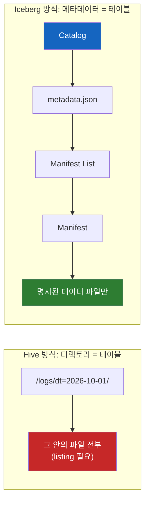
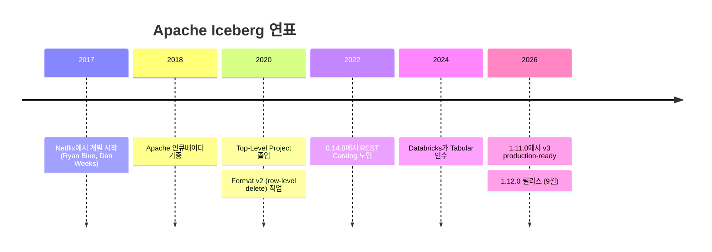
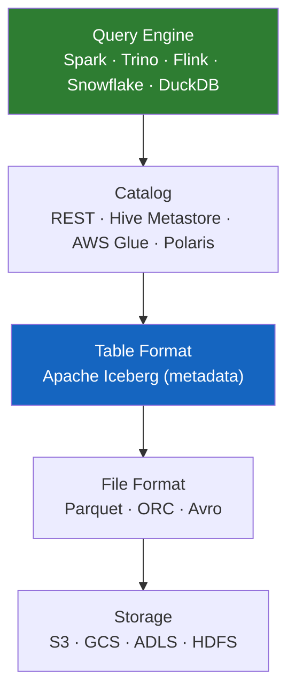
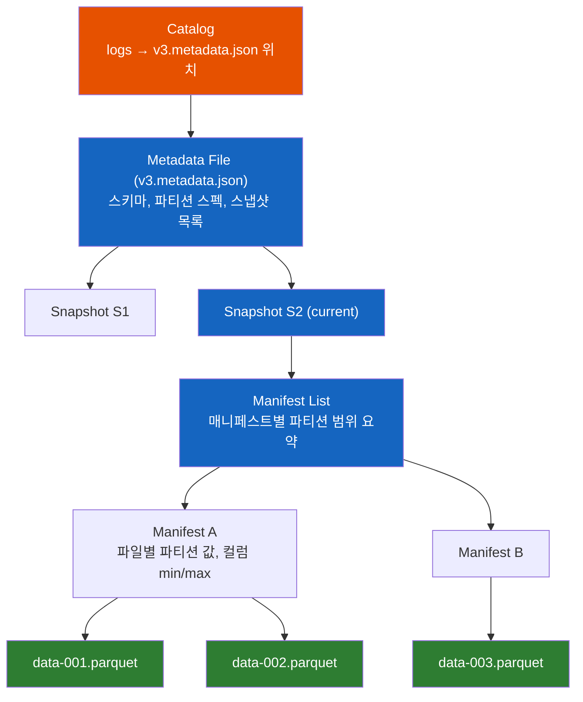
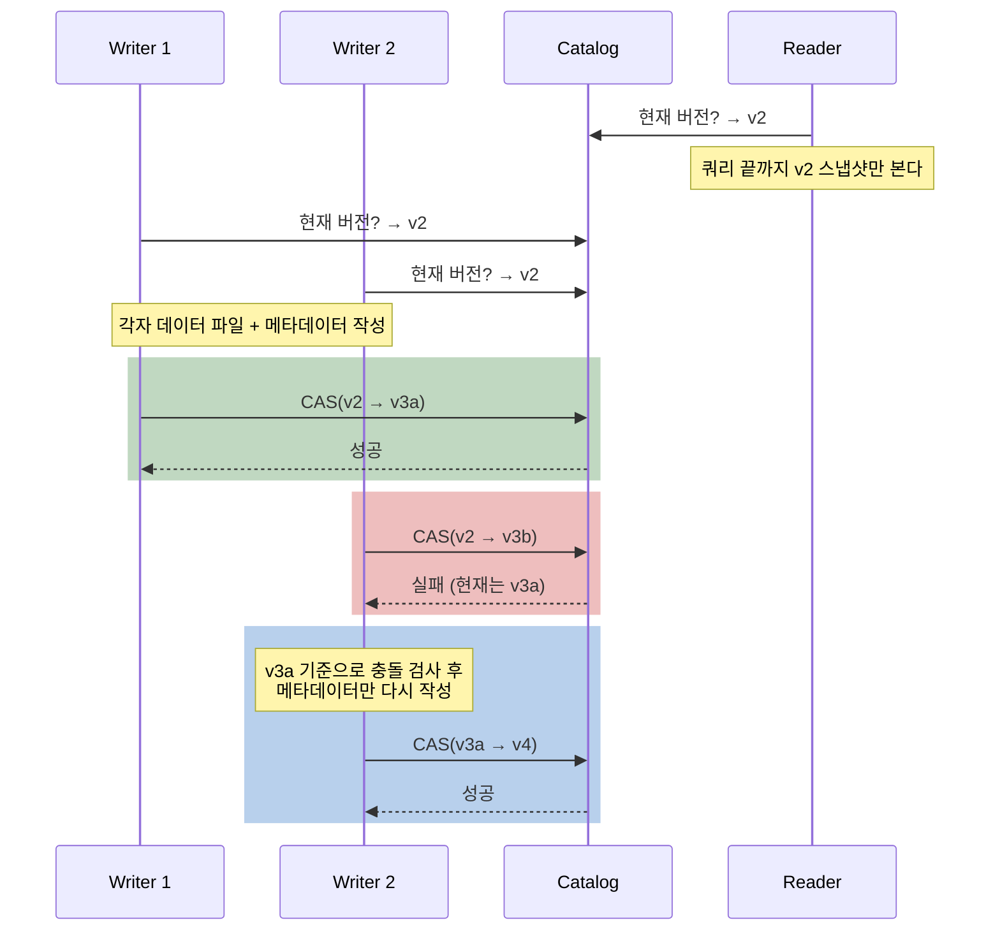
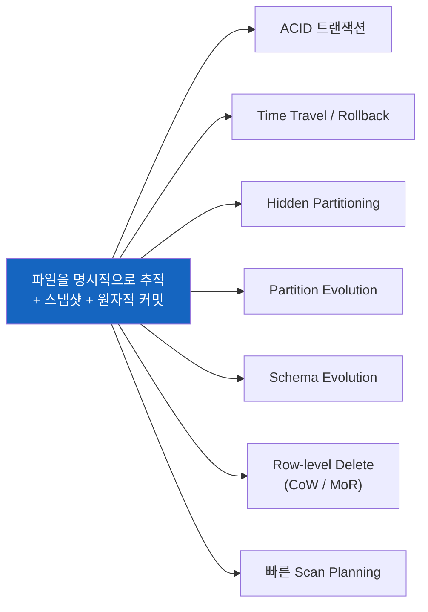

# Apache Iceberg는 왜 디렉토리 대신 파일을 추적할까?

S3에 Parquet 파일을 쌓아두면 그게 곧 "테이블"일까? Netflix는 왜 Hive 테이블을 버리고 새로운 테이블 포맷을 만들었고, 그 결정이 어떻게 오늘날 Lakehouse의 표준이 되었을까?

## 결론부터 말하면

**디렉토리는 쓰는 도중에도 바뀌고, 훑어보는 데 비싸고, 파티션 의미를 문자열 경로에 욱여넣기 때문이다.** 그래서 Apache Iceberg는 "이 디렉토리 안의 파일 전부" 대신 "메타데이터에 기록된 파일만"을 테이블로 정의하는 오픈 테이블 포맷(Open Table Format)이 되었다. 데이터 자체는 여전히 S3 같은 오브젝트 스토리지에 Parquet 파일로 저장된다. Iceberg가 하는 일은 그 위에 "이 테이블은 정확히 어떤 파일들로 이루어져 있는가"를 기록한 **메타데이터 트리** 를 얹는 것이다.

Hive 시절의 테이블은 "이 디렉토리 안에 있는 파일 전부"였다. 그래서 디렉토리를 훑어야(listing) 테이블을 알 수 있었고, 쓰는 도중의 파일도 테이블에 섞여 보였다. Iceberg는 이 관점을 뒤집어 **테이블에 속한 파일을 하나하나 명시적으로 추적** 한다. 이 단 하나의 설계 결정에서 ACID 트랜잭션, 타임 트래블, 스키마·파티션 진화, 빠른 쿼리 계획이 모두 파생된다.



| 문제 | Hive 테이블 | Iceberg 테이블 |
|------|------------|---------------|
| 테이블의 파일 목록 | 디렉토리 listing (느림) | 메타데이터에 기록 (빠름) |
| 동시 읽기/쓰기 | 반쯤 쓴 결과가 보일 수 있음 | 스냅샷 단위 원자적 커밋 |
| 파티션 | 사용자가 컬럼을 직접 관리 | **Hidden Partitioning** |
| 스키마 변경 | 이름/위치 기반, 부작용 가능 | 컬럼 ID 기반, 부작용 없음 |
| 과거 시점 조회 | 불가 | **Time Travel**, Rollback |
| 엔진 종속성 | Hive Metastore 중심 | Spark, Trino, Flink, Snowflake 등 공유 |

---

## 1. 왜 Iceberg가 생겨났을까?

### 1.1 먼저, 데이터 레이크란 무엇인가

이야기를 시작하려면 **데이터 레이크(Data Lake)** 부터 짚어야 한다. 데이터 레이크는 S3, GCS, HDFS 같은 저렴한 스토리지에 원본 데이터를 파일 형태로 그냥 쌓아두는 방식이다. 데이터 웨어하우스(Oracle, Teradata 등)처럼 데이터베이스가 저장 형식을 통제하는 게 아니라, 파일은 파일대로 두고 Spark나 Presto 같은 **쿼리 엔진** 이 필요할 때 읽어 간다. 스토리지와 컴퓨팅이 분리되어 있어서 싸고, 확장이 쉽다.

이때 파일 형식으로 주로 쓰이는 것이 **Apache Parquet** 다. Parquet은 데이터를 행(row)이 아니라 열(column) 단위로 묶어 저장하는 **컬럼 지향 파일 포맷** 이다. `SELECT level FROM logs`처럼 몇 개 컬럼만 읽는 분석 쿼리에서는 필요한 컬럼만 디스크에서 꺼내면 되니 매우 빠르다.

그런데 여기서 근본적인 질문이 생긴다. Parquet 파일 하나는 "파일"일 뿐이다. 수만 개의 Parquet 파일을 모아서 `logs`라는 **테이블** 로 부르려면, 누군가는 "어떤 파일들이 `logs` 테이블에 속하는가"를 정해야 한다. 이 약속을 **테이블 포맷(Table Format)** 이라고 부른다.

### 1.2 Hive의 답: "디렉토리가 곧 테이블이다"

Hadoop 시대에 이 질문에 대한 사실상 표준 답은 **Apache Hive** 였다. Hive의 규칙은 단순하다. 테이블은 하나의 디렉토리이고, 파티션은 하위 디렉토리이며, 그 안의 파일이 곧 데이터다. (Hive에도 ACID 트랜잭션을 지원하는 테이블 유형이 있지만, 이 글에서 말하는 "Hive 방식"은 Netflix를 비롯해 S3 데이터 레이크에서 널리 쓰이던 **디렉토리 기반 비트랜잭션 테이블** 을 뜻한다.)

```text
s3://warehouse/logs/
├── event_date=2026-09-30/
│   ├── part-0001.parquet
│   └── part-0002.parquet
└── event_date=2026-10-01/
    └── part-0003.parquet
```

여기서 **파티셔닝(Partitioning)** 이란 비슷한 행끼리 같은 위치에 모아 쓰는 기법이다. `WHERE event_date = '2026-10-01'`이라는 쿼리가 오면 엔진은 `event_date=2026-10-01/` 디렉토리만 읽으면 된다. 나머지 수천 개 디렉토리는 쳐다볼 필요도 없다. 이것을 **파티션 프루닝(Partition Pruning)** 이라 한다.

어느 디렉토리가 어느 테이블·파티션인지는 **Hive Metastore** 라는 별도 데이터베이스(보통 MySQL)가 기록한다. 직관적이고 단순하다. 그래서 오랫동안 잘 쓰였다.

### 1.3 그런데 규모가 커지자 직관이 무너졌다

2017년 무렵 Netflix는 수십 PB 규모의 데이터를 S3 위의 Hive 테이블로 운영하고 있었다. 그리고 "디렉토리 = 테이블"이라는 단순한 규칙이 곳곳에서 터지기 시작했다. Iceberg의 창시자인 Ryan Blue와 Dan Weeks가 마주한 문제는 크게 세 갈래였다.

**첫째, 정확성(Correctness) 문제.** Hive에서 데이터를 쓰는 과정은 "파일을 디렉토리에 하나씩 넣는 것"이다. 그러면 1,000개 파일 중 500개를 쓴 시점에 누군가 쿼리를 날리면? 반쪽짜리 결과가 그대로 보인다. 덮어쓰기(overwrite) 중이면 옛 파일과 새 파일이 섞여 보일 수도 있다. 트랜잭션이라는 개념이 없으니, 여러 작업이 동시에 같은 테이블을 건드리면 무슨 일이 일어날지 아무도 보장할 수 없었다. 당시 Netflix에서는 "Hive 테이블은 함부로 건드리지 말자"는 분위기가 생길 정도였다.

**둘째, 성능 문제.** 쿼리를 하려면 먼저 "어떤 파일을 읽을지" 알아야 하는데, Hive 방식에서는 디렉토리 listing으로 파일을 찾는다. 로컬 디스크라면 순식간이지만, S3에서 listing은 네트워크 API 호출이고 한 번에 1,000개씩 페이지로 나뉜다. 파티션이 수만 개면 **쿼리를 실행하기도 전에 파일 목록을 모으는 데만 수 분** 이 걸린다. HDFS에서는 NameNode에 부하가 몰렸다. 게다가 S3의 rename은 원자적이지 않고 실제로는 "복사 후 삭제"라서, rename에 기대는 Hive식 커밋은 느리고 위험했다.

**셋째, 사용성 문제.** 파티션 컬럼은 사용자가 직접 만들고 관리해야 했다. `event_time`(timestamp)으로 날짜 파티션을 만들려면 `event_date`라는 별도 문자열 컬럼을 만들어 직접 채워야 한다. 누군가 `2026-10-01` 대신 `20261001` 형식으로 쓰면? 에러 없이 **조용히 틀린 결과** 가 나온다. 쿼리 작성자가 `event_date` 조건을 빼먹고 `event_time`으로만 필터링하면? 파티션 프루닝이 안 되어 전체 테이블을 스캔한다. 스키마 변경도 위험했다. 컬럼을 삭제하고 같은 이름으로 다시 추가하면, 옛 파일에 남아있던 예전 값이 "되살아나는" 사고가 생길 수 있었다.

### 1.4 해법: 디렉토리가 아니라 파일을 추적하자

세 문제의 공통 원인은 하나였다. **테이블의 상태가 "디렉토리에 지금 무엇이 들어 있는가"에 묶여 있다는 것.** 디렉토리는 쓰는 도중에도 바뀌고, 훑어보는 데 비싸고, 의미(파티션 값)를 문자열 경로에 욱여넣는다.

그래서 Netflix 팀은 발상을 뒤집었다. 테이블에 속한 파일의 목록을 **메타데이터 파일에 명시적으로 기록** 하고, 테이블의 새 버전을 만들 때는 새 메타데이터를 쓴 뒤 "현재 버전" 포인터 하나만 원자적으로 바꾸자. 그러면 쓰는 도중의 파일은 아직 메타데이터에 없으니 아무에게도 보이지 않는다. listing도 필요 없다. 파티션 값은 문자열 경로가 아니라 메타데이터에 원래 타입 그대로 저장하면 된다.

이렇게 탄생한 Iceberg는 2018년 11월 Apache Software Foundation 인큐베이터에 기증되었고, 2020년 5월 Apache Top-Level Project로 졸업했다.



---

## 2. Iceberg는 정확히 무슨 일을 하는가?

### 2.1 먼저 위치부터: 파일 포맷과 엔진 사이의 계층

Iceberg가 무엇을 하는지 이해하려면 "Iceberg가 하지 않는 것"부터 알면 쉽다. Iceberg는 데이터를 저장하는 **파일 포맷이 아니다** (그건 Parquet, ORC, Avro의 일이다). 쿼리를 실행하는 **엔진도 아니다** (그건 Spark, Trino, Flink의 일이다). Iceberg는 그 사이에서 "이 파일들이 모여 어떤 테이블을 이루는가"를 정의하는 **스펙(specification)과 라이브러리** 다.



Java 개발자에게 익숙한 비유로 말하면, Iceberg는 **JDBC 같은 표준 인터페이스** 에 가깝다. JDBC 스펙만 지키면 어떤 드라이버든 어떤 DB든 붙듯이, Iceberg 스펙만 지키면 Spark로 쓴 테이블을 Trino로 읽고 Flink로 스트리밍 적재하고 Snowflake로 분석할 수 있다. 데이터를 엔진마다 복사할 필요가 없다. 이것이 "Open" Table Format이라는 이름의 의미다.

### 2.2 메타데이터 트리: Iceberg의 심장

Iceberg 테이블은 4단계의 메타데이터 계층으로 이루어진다. 처음 보면 복잡해 보이지만, 각 단계는 "다음 단계를 빨리 건너뛰기 위한 요약 정보"를 담고 있다는 하나의 원리로 이해할 수 있다.



| 계층 | 형식 | 담는 내용 | 왜 필요한가 |
|------|------|----------|-----------|
| **Catalog** | 외부 서비스 | 테이블 이름 → 현재 metadata 파일 위치 | "현재 버전"을 가리키는 유일한 포인터. 원자적 교체의 기준점 |
| **Metadata File** | JSON | 스키마, 파티션 스펙, 스냅샷 목록, 속성 | 테이블의 전체 상태와 이력 |
| **Manifest List** | Avro | 한 스냅샷을 이루는 매니페스트 목록 + 매니페스트별 파티션 값 범위 | 쿼리와 무관한 매니페스트를 통째로 건너뛰기 |
| **Manifest File** | Avro | 데이터 파일 목록 + 파일별 파티션 값, 행 수, 컬럼별 min/max·null 개수 | 쿼리와 무관한 데이터 파일을 건너뛰기 |
| **Data File** | Parquet 등 | 실제 데이터 | |

여기서 **스냅샷(Snapshot)** 이 핵심 개념이다. 스냅샷은 "특정 시점에 테이블을 이루던 데이터 파일의 완전한 목록"이다. 데이터를 추가·삭제·수정할 때마다 새 스냅샷이 생기고, 옛 스냅샷도 metadata 파일에 그대로 남는다. 이전 스냅샷과 바뀌지 않은 매니페스트는 새 스냅샷에서 **재사용** 되므로, 커밋할 때마다 전체 메타데이터를 다시 쓸 필요는 없다.

이 구조 덕분에 쿼리 계획(scan planning)이 극적으로 빨라진다. `WHERE event_time > '2026-10-01'` 쿼리가 오면 엔진은 S3를 listing하는 대신, Manifest List를 읽어 범위 밖 매니페스트를 버리고, 남은 Manifest에서 컬럼 min/max 통계로 범위 밖 파일을 또 버린다. 파일 수만 개짜리 테이블이라도 실제로 열어볼 파일은 몇 개로 줄어든다. Iceberg 공식 문서가 "분산 SQL 엔진 없이도 수십 PB 테이블을 읽을 수 있다"고 말하는 이유다.

### 2.3 원자적 커밋과 낙관적 동시성 제어

그렇다면 "쓰는 도중의 데이터가 보이는 문제"는 어떻게 해결될까? 답은 **Catalog의 포인터 하나만 원자적으로 교체한다** 는 것이다.

쓰기 작업(writer)은 먼저 새 데이터 파일을 S3에 쓴다. 이 파일들은 아직 어떤 메타데이터에도 등록되지 않았으니 읽는 쪽(reader)에게는 존재하지 않는 것과 같다. 그다음 새 Manifest, 새 Manifest List, 새 Metadata File을 쓴다. 마지막으로 Catalog에 "현재 metadata 위치를 v2에서 v3로 바꿔줘"라고 요청한다. 이 교체는 **Compare-And-Swap(CAS)** 으로 이루어진다. "현재 값이 내가 기준으로 삼은 v2일 때만 v3로 바꿔라"는 조건부 교체다.

이 방식을 **낙관적 동시성 제어(Optimistic Concurrency Control)** 라고 부른다. 락을 먼저 잡는 대신 "아마 아무도 안 바꿨겠지"라고 낙관하고 작업한 뒤, 커밋 순간에만 충돌을 확인한다. JPA의 `@Version` 낙관적 락과 같은 원리다.



실패한 Writer 2가 처음부터 다시 하는 것은 아니다. 재시도 전에 Writer 2는 그 사이 끼어든 커밋(v3a)이 자기 작업과 **호환되는지 검증** 한다. 둘 다 단순 append라면 서로 영향이 없으므로, 데이터 파일은 그대로 두고 새 기준(v3a) 위에 메타데이터만 다시 써서 재시도한다.

하지만 `UPDATE`·`DELETE`·`MERGE` 같은 행 단위 변경은 검증이 더 엄격하다. 같은 파일을 건드리지 않았더라도, v3a가 **내 변경 조건(`WHERE`)에 해당할 수 있는 행을 담은 새 파일을 추가했다면** 충돌로 보고 실패한다. 예를 들어 Writer 2가 `DELETE WHERE level = 'DEBUG'`를 실행하는 동안 Writer 1이 `DEBUG` 행을 새로 append했다면, 그 행을 지워야 했는지 판단할 수 없기 때문이다. 이 검증 강도는 격리 수준(`write.delete.isolation-level` 등, 기본값 `serializable`)으로 조절하며, `snapshot`으로 낮추면 새로 추가된 파일과의 충돌은 검사하지 않는다.

정리하면 Iceberg의 **Serializable Isolation** 은 두 가지가 합쳐져 성립한다. Reader는 처음 읽은 v2 스냅샷을 끝까지 보므로 쿼리 도중 테이블이 바뀌어도 일관된 결과를 얻고, Writer는 커밋 시점의 충돌 검증을 통과해야만 새 버전을 만들 수 있다.

---

## 3. 이 구조에서 파생되는 개념들

"파일을 명시적으로 추적하고, 버전을 스냅샷으로 남긴다"는 하나의 설계에서 Iceberg의 주요 기능이 줄줄이 파생된다.



### 3.1 Time Travel과 Rollback

옛 스냅샷이 metadata 파일에 남아 있으니, "어제 오후 3시의 테이블"을 조회하는 것은 그 시점의 스냅샷을 따라가는 것뿐이다. 이것이 **Time Travel** 이다. 배치 작업이 잘못된 데이터를 넣었다면, 현재 포인터를 이전 스냅샷으로 되돌리기만 하면 된다. 데이터 파일을 복원할 필요 없이 메타데이터 포인터만 바뀌므로 즉시 끝난다. 이것이 **Rollback** 이다. ML 학습 데이터 재현, 감사(audit), 장애 복구에 특히 유용하다.

물론 공짜는 아니다. 옛 스냅샷이 참조하는 파일은 지울 수 없으니 스토리지가 계속 늘어난다. 그래서 일정 기간이 지난 스냅샷을 정리하는 **Expire Snapshots** 유지보수 작업이 필요하다.

### 3.2 Hidden Partitioning

1.3에서 본 Hive의 파티션 문제를 기억하자. 사용자가 `event_date` 컬럼을 직접 만들고, 쓰는 쪽은 형식을 맞추고, 읽는 쪽은 그 컬럼으로 필터링해야 했다.

Iceberg는 파티션을 원본 컬럼과 **변환 함수(transform)** 의 조합으로 정의한다. `days(event_time)`이라고 선언하면, Iceberg가 쓰기 시점에 `event_time`에서 날짜를 계산해 파티션 값으로 기록한다. 사용자는 `event_date`라는 컬럼의 존재조차 모른다. 그래서 **Hidden(숨겨진)** 파티셔닝이다.

```sql
-- Hive: 파티션 컬럼을 사용자가 직접 관리
INSERT INTO logs PARTITION (event_date='2026-10-01')   -- 형식 실수하면 조용히 틀림
SELECT level, message, event_time FROM staging;

SELECT * FROM logs
WHERE event_time BETWEEN '2026-10-01 10:00' AND '2026-10-01 12:00'
  AND event_date = '2026-10-01';   -- 이 줄을 빠뜨리면 풀 스캔

-- Iceberg: 변환 함수로 선언만 하면 끝
CREATE TABLE logs (level STRING, message STRING, event_time TIMESTAMP)
USING iceberg
PARTITIONED BY (days(event_time));

SELECT * FROM logs
WHERE event_time BETWEEN '2026-10-01 10:00' AND '2026-10-01 12:00';
-- Iceberg가 event_time 조건을 days 파티션 조건으로 자동 변환해 프루닝
```

제공되는 변환 함수로는 `years`, `months`, `days`, `hours`(시간 단위), `bucket(N, col)`(해시 버킷), `truncate(W, col)`(문자열·숫자 자르기), `identity`(값 그대로)가 있다.

### 3.3 Partition Evolution

데이터가 적을 때는 월 단위 파티션이 적당했는데, 트래픽이 늘어 일 단위로 바꾸고 싶다면? Hive에서는 테이블 전체를 새 레이아웃으로 다시 써야 했다. PB 단위 테이블이라면 며칠짜리 작업이다.

Iceberg에서는 파티션 스펙 자체가 메타데이터에 버전으로 기록된다. 스펙을 바꾸면 **이후에 쓰는 데이터만** 새 스펙을 따르고, 기존 파일은 옛 스펙 그대로 남는다. 각 데이터 파일이 어느 스펙으로 쓰였는지 매니페스트에 기록되어 있으므로, 쿼리 시 엔진은 스펙별로 따로 프루닝한다. 쿼리 문장은 바꿀 필요가 없다. Hidden Partitioning 덕분에 애초에 쿼리가 파티션 컬럼에 의존하지 않기 때문이다.

### 3.4 Schema Evolution

Hive나 순수 Parquet 파일 묶음에서 컬럼은 **이름** 이나 **위치** 로 식별된다. 그래서 컬럼 `score`를 삭제했다가 같은 이름으로 새 `score`를 추가하면, 옛 파일의 `score` 값이 새 컬럼에 다시 나타나는 "un-delete" 사고가 생긴다.

Iceberg는 모든 컬럼에 **고유한 정수 ID** 를 부여하고, 데이터 파일 안에도 이 ID를 기록한다. 컬럼 이름은 ID에 붙은 라벨일 뿐이다. 그래서 이름을 바꿔도(rename) 데이터 파일을 다시 쓸 필요가 없고, 삭제 후 같은 이름으로 추가한 컬럼은 새 ID를 받으므로 옛 값과 절대 섞이지 않는다. 컬럼 추가·삭제·이름 변경·순서 변경·타입 확장(`int` → `long` 등)이 모두 메타데이터 변경만으로 끝난다. DB 테이블의 surrogate key와 같은 발상이다.

### 3.5 Row-level Delete: Copy-on-Write vs Merge-on-Read

Parquet 파일은 한 번 쓰면 수정할 수 없는(immutable) 파일이다. 그런데 GDPR 삭제 요청이나 CDC(Change Data Capture, 원본 DB의 변경 사항을 따라 반영하는 것) 때문에 특정 행만 지우거나 고쳐야 한다면? Iceberg는 두 가지 전략을 제공한다.

| 전략 | 동작 | 쓰기 비용 | 읽기 비용 | 적합한 경우 |
|------|------|----------|----------|-----------|
| **Copy-on-Write (CoW)** | 해당 행이 든 파일을 통째로 다시 써서 교체 | 높음 | 낮음 | 수정이 드물고 읽기가 많을 때 |
| **Merge-on-Read (MoR)** | "이 파일의 이 행은 삭제됨"이라는 delete 파일만 추가, 읽을 때 병합 | 낮음 | 높음 | 수정이 잦을 때 (스트리밍, CDC) |

MoR의 delete 파일은 Format 버전에 따라 진화해 왔다. v2에서는 "파일 경로 + 행 번호"를 기록하는 **position delete** 와 "`id = 42`인 행"처럼 값 조건을 기록하는 **equality delete** 가 도입되었다. 하지만 작은 delete 파일이 수백 개 쌓이면 읽을 때 병합 비용이 커졌다. 그래서 v3에서는 데이터 파일마다 "삭제된 행 번호"를 비트맵 하나로 표현하는 **Deletion Vector** 가 도입되었다. 비트가 1이면 그 행은 삭제된 것이다. 파일당 비트맵 하나만 읽으면 되니 훨씬 빠르다. (v3 테이블에는 새 position delete 파일을 추가할 수 없고 deletion vector를 써야 한다.)

MoR을 쓰면 delete 파일이 쌓이고, 스트리밍 적재를 하면 작은 파일이 쌓인다. 그래서 주기적으로 파일을 합치는 **Compaction** (`rewrite_data_files`)이 Iceberg 운영의 필수 작업이 된다.

### 3.6 Catalog: 누가 "현재 버전"을 쥐고 있는가

2.3에서 원자적 커밋의 기준점은 Catalog였다. Catalog는 "테이블 이름 → 현재 metadata 파일 위치"를 저장하고, 이 값을 CAS로 바꿔주는 서비스다. 초기에는 Hive Metastore, AWS Glue, JDBC 같은 구현이 엔진마다 클라이언트 라이브러리로 들어가 있었다. 문제는 엔진(Java, Python, Rust 등)마다 이 로직을 다시 구현해야 한다는 점이었다.

그래서 0.14.0부터 **REST Catalog** 스펙이 도입되었다. Catalog 동작을 OpenAPI로 정의된 HTTP API로 표준화한 것이다. 서버 구현이 무엇이든 이 API만 지키면 모든 엔진이 붙을 수 있다. 오늘날 Apache Polaris를 비롯한 여러 카탈로그 서비스가 REST Catalog API를 구현하며, 접근 제어와 자격 증명 발급(credential vending)도 이 계층에서 처리한다. 사실상 "테이블 포맷 전쟁"의 다음 전장이 카탈로그로 옮겨갔다고 할 수 있다.

### 3.7 Format Version: 스펙은 어떻게 진화했나

Iceberg는 라이브러리 버전(1.11, 1.12 …)과 별개로 **테이블 포맷 버전** 을 가진다. 포맷 버전은 옛 리더가 새 테이블을 올바르게 읽지 못하게 되는(forward-compatibility가 깨지는) 기능이 추가될 때만 올라간다.

| Format Version | 핵심 주제 | 주요 기능 |
|---------------|----------|----------|
| **v1** | 분석용 테이블 | 스냅샷, 매니페스트, Hidden Partitioning, Schema Evolution |
| **v2** | 행 단위 삭제 | position/equality delete 파일, Merge-on-Read |
| **v3** | 타입·기능 확장 | Deletion Vector, Row Lineage, `variant` 타입, 기본값(default value), `geometry`/`geography`, 나노초 timestamp, 다중 인자 transform, 테이블 암호화 키 |
| **v4** | 메타데이터 구조 개편 | 개발 중 (예: 메타데이터의 상대 경로 지원) |

v3의 **Row Lineage** 는 각 행에 고유 ID와 "마지막으로 수정된 시점의 sequence number"를 부여해, 어떤 행이 언제 바뀌었는지 추적할 수 있게 한다. 증분 처리와 CDC를 엔진 수준에서 네이티브로 지원하기 위한 기능이다. `variant`는 JSON 같은 반정형 데이터를 문자열이 아닌 효율적인 바이너리로 저장하는 타입이다. v3는 1.11.0(2026년 5월)에서 production-ready로 자리 잡았고, Snowflake·Databricks 등도 2026년에 v3 지원을 GA했다.

### 3.8 Lakehouse와 경쟁 포맷

Iceberg 같은 테이블 포맷이 등장하면서 **Lakehouse** 라는 아키텍처가 가능해졌다. 데이터 레이크의 저렴한 오픈 스토리지 위에서 데이터 웨어하우스 수준의 트랜잭션·스키마 관리·성능을 얻는 것이다. 웨어하우스에 데이터를 복사해 가두지 않고, 하나의 사본을 여러 엔진이 공유한다.

같은 문제를 푸는 포맷이 Iceberg만 있는 것은 아니다.

| 포맷 | 출신 | 특징 |
|------|------|------|
| **Apache Iceberg** | Netflix | 엔진 중립 스펙, 가장 넓은 엔진·벤더 지원 |
| **Delta Lake** | Databricks | Spark·Databricks 생태계 중심, 트랜잭션 로그(`_delta_log`) 방식 |
| **Apache Hudi** | Uber | upsert·증분 처리에 강점 |
| **Apache Paimon** | Flink 커뮤니티 | 스트리밍 우선, LSM 구조 |

한때 "포맷 전쟁"이라 불렸지만, 2024년 Databricks가 Iceberg 창시자들이 세운 Tabular를 인수하고 AWS·Google·Snowflake가 모두 Iceberg를 지원하면서 Iceberg가 사실상의 상호운용 표준으로 자리 잡았다. Apache XTable처럼 포맷 간 메타데이터를 변환해주는 프로젝트도 있다.

---

## 4. 실제로 써보기 (Spark SQL)

Spark에서 Iceberg를 쓰는 전형적인 흐름이다. 카탈로그 이름은 `prod`라고 가정한다. (`ALTER TABLE ... PARTITION FIELD`와 `CALL` 프로시저는 Iceberg Spark SQL Extensions 설정이 필요하다.)

### 4.1 테이블 생성과 적재

```sql
CREATE TABLE prod.db.logs (
    id         BIGINT,
    level      STRING,
    message    STRING,
    event_time TIMESTAMP
)
USING iceberg
PARTITIONED BY (days(event_time), level)
TBLPROPERTIES ('format-version' = '3');

INSERT INTO prod.db.logs VALUES (1, 'ERROR', 'disk full', TIMESTAMP '2026-10-01 10:15:00');
-- 커밋 1번 = 스냅샷 1개 생성
```

### 4.2 메타데이터 테이블로 내부 들여다보기

Iceberg는 메타데이터 자체를 SQL로 조회할 수 있는 테이블로 노출한다. 2장에서 설명한 구조를 직접 확인할 수 있다.

```sql
SELECT snapshot_id, committed_at, operation FROM prod.db.logs.snapshots;  -- 스냅샷 이력
SELECT file_path, record_count, partition   FROM prod.db.logs.files;      -- 현재 data + delete 파일 (data만: .data_files)
SELECT * FROM prod.db.logs.manifests;                                     -- 매니페스트
SELECT * FROM prod.db.logs.history;                                       -- current 포인터 변경 이력
```

### 4.3 Time Travel과 Rollback

```sql
-- 특정 시점/스냅샷 조회 (Spark 3.3+)
SELECT * FROM prod.db.logs TIMESTAMP AS OF '2026-10-01 09:00:00';
SELECT * FROM prod.db.logs VERSION AS OF 8744736658442914487;

-- 잘못된 배치 이후 이전 스냅샷으로 즉시 복구 (데이터 파일 복사 없음)
CALL prod.system.rollback_to_snapshot('db.logs', 8744736658442914487);
```

### 4.4 Schema·Partition Evolution

```sql
-- 메타데이터만 바뀌고 기존 파일은 다시 쓰지 않는다
ALTER TABLE prod.db.logs ADD COLUMN host STRING;
ALTER TABLE prod.db.logs RENAME COLUMN message TO msg;

-- 이후 쓰는 데이터부터 시간 단위 파티션 적용, 기존 데이터는 days 그대로
ALTER TABLE prod.db.logs REPLACE PARTITION FIELD days(event_time) WITH hours(event_time);
```

Java 개발자라면 같은 작업을 Java API로도 할 수 있다. 모든 변경이 `commit()` 한 번에 원자적으로 반영되는 빌더 패턴이다.

```java
Table table = catalog.loadTable(TableIdentifier.of("db", "logs"));

table.updateSchema()
     .addColumn("host", Types.StringType.get())
     .renameColumn("message", "msg")
     .commit();                       // 두 변경이 하나의 새 metadata로 원자적 커밋

table.updateSpec()
     .removeField("event_time_day")
     .addField(Expressions.hour("event_time"))
     .commit();
```

### 4.5 행 단위 수정과 유지보수

```sql
-- 수정이 잦은 테이블은 Merge-on-Read로
ALTER TABLE prod.db.logs SET TBLPROPERTIES (
    'write.delete.mode' = 'merge-on-read',
    'write.update.mode' = 'merge-on-read',
    'write.merge.mode'  = 'merge-on-read'
);

MERGE INTO prod.db.logs t
USING updates u ON t.id = u.id
WHEN MATCHED THEN UPDATE SET t.level = u.level
WHEN NOT MATCHED THEN INSERT *;

-- 운영 필수 작업: 작은 파일/delete 파일 합치기, 옛 스냅샷 정리, 고아 파일 삭제
CALL prod.system.rewrite_data_files('db.logs');
CALL prod.system.expire_snapshots('db.logs', TIMESTAMP '2026-09-24 00:00:00');
CALL prod.system.remove_orphan_files(table => 'db.logs');
```

### 4.6 운영에서 자주 만나는 함정

| 함정 | 증상 | 대응 |
|------|------|------|
| 스트리밍으로 잦은 커밋 | 작은 파일·매니페스트 폭증, 쿼리 계획 느려짐 | `rewrite_data_files`, `rewrite_manifests` 주기 실행 |
| 스냅샷을 정리하지 않음 | 스토리지 비용이 계속 증가 | `expire_snapshots` 스케줄링 (Time Travel 보존 기간과 트레이드오프) |
| 실패한 쓰기가 남긴 파일 | 메타데이터가 참조하지 않는 "고아 파일" 누적 | `remove_orphan_files` (진행 중인 쓰기 파일을 지우지 않도록 충분한 기간을 둘 것) |
| 엔진마다 지원 Format 버전이 다름 | v3 테이블을 구버전 엔진이 못 읽음 | 테이블을 읽는 모든 엔진의 v3 지원 여부를 확인한 뒤 업그레이드 |
| 동시 쓰기가 같은 파티션을 수정 | 커밋 충돌로 재시도 반복·실패 | 작업 분리, 재시도 설정(`commit.retry.*`) 조정 |

---

## 5. 정리

### 핵심 포인트

1. **Iceberg는 "디렉토리 = 테이블"을 "메타데이터 = 테이블"로 바꿨다**
   - 테이블에 속한 파일을 메타데이터에 명시적으로 기록하고, Catalog의 포인터 하나를 원자적으로 교체해 새 버전을 커밋한다.
   - 쓰는 중인 파일은 보이지 않고, S3 listing도 필요 없다.

2. **Netflix의 Hive 테이블이 겪은 세 가지 고통에서 출발했다**
   - 정확성(반쪽짜리 결과, 트랜잭션 부재), 성능(느린 listing, rename 의존), 사용성(수동 파티션 컬럼, 위험한 스키마 변경).

3. **주요 기능은 모두 하나의 설계에서 파생된다**
   - 스냅샷 → Time Travel·Rollback, 변환 함수 기반 파티션 → Hidden Partitioning·Partition Evolution, 컬럼 ID → 안전한 Schema Evolution, 파일 단위 통계 → 빠른 Scan Planning.

4. **Iceberg는 엔진이 아니라 엔진 사이의 표준이다**
   - Spark, Trino, Flink, Snowflake 등이 하나의 데이터 사본을 공유하는 Lakehouse의 기반이며, REST Catalog로 카탈로그까지 표준화되고 있다.

5. **공짜가 아니다: 유지보수가 운영의 일부다**
   - Compaction, Expire Snapshots, Orphan File 정리를 스케줄링해야 성능과 비용이 유지된다.

---

## 출처

- [Apache Iceberg 공식 문서 - Introduction](https://iceberg.apache.org/docs/latest/) - 공식 문서
- [Iceberg Table Spec](https://iceberg.apache.org/spec/) - 공식 스펙 (Format v1~v4, Optimistic Concurrency, Delete Formats)
- [Iceberg Partitioning](https://iceberg.apache.org/docs/latest/partitioning/) - Hive 파티셔닝의 문제와 Hidden Partitioning
- [Iceberg Terms](https://iceberg.apache.org/terms/) - Snapshot, Manifest, Partition Spec, REST Catalog 용어 정의
- [apache/iceberg GitHub](https://github.com/apache/iceberg) - 소스 코드 및 릴리스 (1.12.0, 2026-09-30)
- [Apache Iceberg - Wikipedia](https://en.wikipedia.org/wiki/Apache_Iceberg) - Netflix 기원, Apache 기증·졸업 연혁
- [The Register - Apache Iceberg promises to change cloud-based data analytics](https://www.theregister.com/software/2023/01/03/apache-iceberg-promises-to-change-cloud-based-data-analytics/1058303)
- [Databricks - Agrees to Acquire Tabular (2024-06-04)](https://www.databricks.com/company/newsroom/press-releases/databricks-agrees-acquire-tabular-company-founded-original-creators)
- [Snowflake - Apache Iceberg v3 GA (2026-05-07)](https://docs.snowflake.com/en/release-notes/2026/other/2026-05-07-iceberg-v3-ga)
- [Databricks - Use Apache Iceberg v3 features](https://docs.databricks.com/aws/en/iceberg/iceberg-v3)
- [Alex Merced - Mastering Apache Iceberg v3](https://iceberglakehouse.com/posts/apache-iceberg-v3-upgrade)
