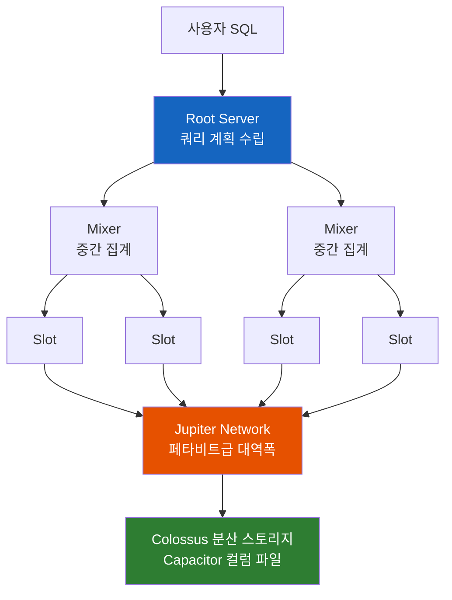

# BigQuery는 왜 인덱스 없이 페타바이트를 스캔할까

> RDBMS에서는 인덱스 없는 풀스캔이 최악의 시나리오다. 그런데 Google BigQuery는 인덱스도 서버도 없이 테라바이트급 집계를 초 단위로 처리하고, 심지어 요금을 "스캔한 바이트"로 매긴다. 이 이상한 설계는 어떻게 가능하고, 왜 합리적일까?

## 결론부터 말하면

**BigQuery는 "읽을 데이터를 찾아가는" 대신 "전부 읽어도 빠르게" 라는 반대 전략을 택했다.** B-tree 인덱스로 소수의 행을 정밀 타격하는 RDBMS와 달리, BigQuery는 컬럼 단위 저장(Capacitor)과 수천 개의 병렬 워커(Dremel의 slot)로 대량 스캔 자체를 빠르게 만든다. 그래서 성능·비용 최적화의 축도 인덱스 튜닝이 아니라 **스캔량 줄이기(파티셔닝·클러스터링)** 로 완전히 바뀐다.

| 구분 | MySQL/PostgreSQL (OLTP) | BigQuery (OLAP) |
|------|------------------------|-----------------|
| 목적 | 건별 조회·갱신 (트랜잭션) | 대량 집계·분석 |
| 저장 방식 | 행(row) 단위 | 컬럼(column) 단위 |
| 접근 전략 | B-tree 인덱스로 소수 행 탐색 | 병렬 풀스캔 + 프루닝 |
| 인프라 | 서버를 직접 관리 | 서버리스 (관리할 서버 없음) |
| 과금 기준 | 인스턴스 사양 x 시간 | 스캔한 바이트 (또는 slot 시간) |
| 최적화 수단 | 인덱스 설계 | 파티셔닝, 클러스터링 |

---

## 1. 왜 운영 DB로는 분석 쿼리를 못 돌릴까?

주문 테이블에 10억 건이 쌓인 서비스를 생각해 보자. 사업팀이 "지난 1년간 카테고리별 월 매출 추이"를 요청했다. SQL 자체는 어렵지 않다.

```sql
SELECT category, DATE_TRUNC(order_date, MONTH) AS month, SUM(amount)
FROM orders
WHERE order_date >= '2025-07-01'
GROUP BY category, month;
```

문제는 이 쿼리를 운영 MySQL에 돌리는 순간 벌어진다. 우리가 아는 인덱스는 **소수의 행을 빨리 찾는 도구** 다. `WHERE user_id = 123` 처럼 전체의 0.01%만 골라낼 때 B-tree는 위력을 발휘한다. 하지만 위 쿼리는 1년치, 즉 테이블의 상당 부분을 **어차피 전부 읽어야** 답이 나온다. 옵티마이저도 이런 경우 인덱스를 버리고 풀스캔을 택한다 — 인덱스 손익분기점을 넘어버리기 때문이다.

여기에 저장 방식의 문제가 겹친다. MySQL 같은 행 기반(row-oriented) 저장은 한 행의 모든 컬럼을 붙여서 디스크에 쓴다. 집계에 필요한 건 `category`, `order_date`, `amount` 세 컬럼뿐인데, 행을 읽는 순간 배송 주소, 메모, 결제 수단까지 통째로 디스크에서 올라온다. 그렇게 몇 분간 디스크와 버퍼 풀을 점유하면 정작 서비스 트래픽이 밀리기 시작한다.

이것이 **OLTP(Online Transaction Processing)** 와 **OLAP(Online Analytical Processing)** 를 분리하는 이유다. 건별 읽기·쓰기에 최적화된 시스템과, 대량 스캔·집계에 최적화된 시스템은 설계 목표가 정반대라서 하나로 겸할 수 없다. 그래서 분석 전용 저장소인 **데이터 웨어하우스(Data Warehouse)** 를 따로 두고, 운영 DB의 데이터를 주기적으로 복사해 온다. BigQuery는 Google Cloud가 제공하는 이 데이터 웨어하우스다 — 2010년 공개된 Google 내부 분석 엔진 **Dremel** 논문의 기술을 상용화해 2011년 정식 출시됐다.

그런데 BigQuery의 접근이 흥미로운 지점은 여기부터다. "분석용이니 인덱스를 분석에 맞게 설계하자"가 아니라, **인덱스라는 개념 자체를 버렸다.**

## 2. 저장과 계산을 완전히 분리하다

### 2.1 컬럼으로 저장하면 스캔이 싸진다

BigQuery는 데이터를 **Capacitor** 라는 자체 컬럼 지향(columnar) 포맷으로 저장한다. Apache Parquet과 비슷한 계열로, 행이 아니라 **컬럼별로 값을 모아서** 저장하는 방식이다.

이게 왜 분석에 유리할까? 첫째, 위의 매출 집계처럼 분석 쿼리는 보통 수십 개 컬럼 중 서너 개만 쓴다. 컬럼별로 저장돼 있으면 **필요한 컬럼 파일만 읽으면** 되고, 나머지 컬럼은 디스크에서 아예 건드리지 않는다. 둘째, 같은 컬럼의 값들은 타입과 분포가 비슷해서 압축이 매우 잘 된다. `category` 컬럼에 'ELECTRONICS'가 백만 번 반복된다면 사전(dictionary) 인코딩과 런렝스(run-length) 인코딩으로 극단적으로 줄어든다. 읽을 바이트 자체가 줄어드는 것이다.

### 2.2 계산은 쿼리 순간에만 빌려 쓴다

저장이 Capacitor라면, 그 파일들이 놓이는 곳은 **Colossus** — Google의 분산 파일 시스템이다. 복제, 장애 복구, 암호화를 알아서 처리하며, 여기까지가 "스토리지 레이어"의 전부다. 주목할 점은 **이 레이어에 계산 능력이 전혀 없다는 것** 이다.

계산은 쿼리가 날아온 순간 **Dremel** 이라는 실행 엔진이 담당한다. Dremel은 쿼리를 트리 구조로 컴파일한다. 맨 아래의 **slot** (병렬 워커, 가상 CPU 한 단위라고 생각하면 된다)들이 Colossus에서 데이터를 읽으며 필터·부분 집계를 수행하고, 중간의 **Mixer** 들이 부분 결과를 모아 올리고, **Root Server** 가 최종 결과를 합쳐 반환한다. 쿼리 하나에 수천 개의 slot이 동적으로 붙었다가, 끝나면 사라진다.



그런데 이상하지 않은가? 저장소와 계산 노드가 물리적으로 분리돼 있으면, 매 쿼리마다 네트워크 너머로 데이터를 퍼 날라야 한다. 로컬 디스크보다 느려야 정상이다. 이 간극을 메우는 것이 **Jupiter** — 총 이분 대역폭(bisection bandwidth) 페타비트급의 Google 내부 네트워크다. 스토리지와 컴퓨트 사이의 전송이 병목이 되지 않을 만큼 빠르기 때문에, 분리 구조의 유연함을 성능 손해 없이 가져갈 수 있다. 이 모든 리소스의 스케줄링은 **Borg** (Kubernetes의 원형이 된 Google의 클러스터 오케스트레이터)가 맡는다.

이 구조가 곧 "서버리스"의 의미다. 사용자는 클러스터 크기도, 노드 사양도, 스케일링 정책도 정하지 않는다. 데이터는 Colossus에 쌓아두기만 하고, 계산력은 쿼리를 던진 순간에만 빌려 쓴다. 저장은 페타바이트로 늘리면서 컴퓨트는 0으로 유지하는 것도, 그 반대도 가능하다.

### 2.3 그래서 인덱스가 필요 없어진다

이제 처음의 질문에 답할 수 있다. 인덱스의 존재 이유는 "느린 풀스캔을 피하는 것"이다. 그런데 컬럼 저장으로 읽을 바이트를 줄이고, 수천 slot으로 그 읽기를 병렬화하면 **풀스캔 자체가 초 단위로 끝난다.** 피할 대상이 사라졌으니 인덱스도 필요 없다. 게다가 분석 쿼리는 매번 다른 컬럼 조합으로 들어오기 때문에, 어차피 모든 패턴에 맞는 인덱스를 미리 만들 수도 없다. "무엇이 올지 모르니, 무엇이 와도 빠르게"가 BigQuery의 설계 철학인 셈이다.

> 참고로 BigQuery에도 search index라는 기능이 있긴 하다. `SEARCH()` 함수를 이용한 텍스트 검색이 대표 용도이고, 선택도가 높은 일부 조건(`=`, `IN`, `LIKE`, `STARTS_WITH` 등)의 가속에도 쓰일 수 있다. 다만 이는 "건초더미에서 바늘 찾기"류의 쿼리를 위한 특수 인덱스이지, RDBMS의 B-tree처럼 모든 조회를 떠받치는 범용 인덱스가 아니다.

## 3. 과금도 "스캔한 바이트"로 바뀐다

아키텍처가 다르면 과금 모델도 달라진다. 서버가 없으니 "인스턴스 사양 x 시간"으로 청구할 대상이 없다. BigQuery의 기본 과금(on-demand)은 **쿼리가 스캔한 바이트** 기준이다.

| 항목 | 내용 (US 리전, 2026년 기준) |
|------|---------------------------|
| 쿼리 (on-demand) | 스캔 데이터 $6.25/TiB, 매월 1 TiB 무료 |
| 쿼리 (capacity, Editions) | slot 시간당 과금 — Standard $0.04, Enterprise $0.06, Enterprise Plus $0.10 (1년/3년 약정 시 할인, 할인율은 약정 유형에 따라 다름) |
| 스토리지 | 활성 스토리지 과금, 90일간 수정 없는 테이블은 장기 보관 요금으로 자동 인하, 매월 10 GB 무료 |

on-demand는 쿼리를 안 돌리면 컴퓨트 비용이 0이라 시작하기 좋지만, 뒤집어 말하면 **쿼리 한 방이 곧 돈** 이다. 페타바이트급 테이블에 무심코 `SELECT *` 를 날리면 그 한 번에 6,000달러 이상이 청구될 수 있다 — 커뮤니티에서 실제로 회자되는 사고 유형이다. 반대로 매일 대량의 정기 배치가 도는 조직이라면 slot을 예약하는 capacity 방식(BigQuery Editions)이 예측 가능하고 저렴해진다. 통상 월 수백 TiB 스캔 규모가 손익분기점으로 이야기된다.

여기서 중요한 관점 전환이 생긴다. RDBMS에서 나쁜 쿼리는 "느린 쿼리"였지만, **BigQuery에서 나쁜 쿼리는 "비싼 쿼리"** 다. 그리고 스캔량이 곧 비용이라면, 최적화란 스캔량을 줄이는 일이 된다. 그 도구가 파티셔닝과 클러스터링이다.

## 4. 인덱스의 빈자리를 채우는 것: 파티셔닝과 클러스터링

인덱스가 없다고 해서 모든 쿼리가 테이블 전체를 읽어야 하는 건 아니다. BigQuery는 "찾아가기" 대신 **"안 읽어도 되는 구간을 통째로 건너뛰기(pruning)"** 전략을 쓴다.

**파티셔닝(partitioning)** 은 테이블을 특정 컬럼 값 기준으로 물리적인 구간으로 쪼개는 것이다. 날짜 컬럼으로 일 단위 파티셔닝을 하면, `WHERE event_date = '2026-07-01'` 쿼리는 365개 파티션 중 해당 1개만 읽는다. 나머지 364개는 스캔도, 과금도 되지 않는다.

**클러스터링(clustering)** 은 테이블(또는 파티션) 내부의 데이터를 지정한 컬럼(최대 4개) 순서로 정렬해 저장하는 것이다. 파티셔닝 없이 단독으로도 쓸 수 있고, 파티셔닝과 함께 쓰면 각 파티션 내부에서 추가로 건너뛰기가 일어난다. 정렬돼 있으면 각 저장 블록이 담고 있는 값의 범위를 메타데이터로 알 수 있고, 필터 조건에 맞지 않는 블록은 열지 않고 건너뛴다(block pruning). 여러 컬럼을 지정할 때는 순서가 중요하다 — 복합 인덱스의 선두 컬럼처럼, 가장 자주 필터링하는 컬럼을 첫 번째로 두어야 프루닝 효과가 크다. 데이터가 계속 추가돼 정렬이 흐트러지면 백그라운드에서 자동으로 재클러스터링되며, 이 작업은 무료다.


DDL로 보면 이렇다.

```sql
-- Bad: 아무 구조 없는 테이블 - 1년치 조회가 1 TB 풀스캔 ($6.25)
CREATE TABLE shop.events (
  event_date DATE,
  customer_id STRING,
  event_type STRING,
  payload JSON
);

-- Good: 파티셔닝 + 클러스터링 - 같은 쿼리가 수 GB 스캔 (~$0.02)
CREATE TABLE shop.events (
  event_date DATE,
  customer_id STRING,
  event_type STRING,
  payload JSON
)
PARTITION BY event_date              -- 날짜로 구간을 쪼개고
CLUSTER BY customer_id, event_type;  -- 구간 안에서 정렬해 둔다
```

잘 설계된 파티셔닝 + 클러스터링 조합은 스캔량을 90~99% 줄이는 것이 일반적이다. 단, 두 가지 모두 **쿼리의 WHERE 절이 해당 컬럼을 필터링할 때만** 작동한다. 파티션 컬럼을 조건에 쓰지 않은 쿼리는 여전히 전체를 스캔한다. RDBMS에서 인덱스 컬럼을 WHERE에 써야 인덱스를 타는 것과 정확히 같은 원리인데, 여기서는 성능이 아니라 **요금 고지서** 로 결과가 돌아온다.

## 5. RDBMS 습관이 만드는 함정

BigQuery가 SQL을 쓴다는 사실은 축복이자 함정이다. 문법이 같아서 진입이 쉽지만, RDBMS의 습관을 그대로 가져오면 비용과 성능 양쪽에서 사고가 난다.

**`SELECT *` 는 컬럼 저장의 이점을 정확히 무효화한다.** 필요한 컬럼만 읽는 것이 Capacitor의 핵심인데, 모든 컬럼을 요청하면 모든 컬럼 파일을 스캔하고 그만큼 과금된다. 필요한 컬럼만 명시하는 습관이 RDBMS에서는 "권장 사항"이었다면 여기서는 "비용 통제 수단"이다.

**`LIMIT 10` 은 비용 통제 수단이 아니다.** RDBMS 감각으로는 10건만 읽고 멈출 것 같지만, 클러스터링되지 않은 테이블에서 BigQuery는 분산 스캔을 끝낸 뒤 결과를 잘라서 보여줄 뿐이다. 과금은 스캔량 기준이므로 `LIMIT` 이 있어도 청구서는 같다. (클러스터 테이블에서는 예외적으로 충분한 블록을 읽으면 스캔을 멈춰 비용이 줄 수 있지만, 이를 믿고 쓸 일은 아니다.) 테이블 내용을 훑어보고 싶다면 콘솔의 미리보기(Preview) 기능을 쓰면 무료다.

다행히 사고를 막는 가드레일도 있다. 쿼리를 실제로 실행하기 전에 **dry run** 으로 예상 스캔량을 공짜로 확인할 수 있고(콘솔은 쿼리 입력만 해도 우상단에 표시해 준다), **maximum bytes billed** 설정으로 상한을 걸어두면 그보다 많이 스캔하려는 쿼리는 과금 없이 실패한다. 테이블에 `require_partition_filter` 옵션을 켜면 파티션 필터 없는 쿼리 자체를 거부할 수도 있다.

**건별 UPDATE/DELETE를 반복하는 패턴은 맞지 않는다.** DML을 지원하긴 하지만 BigQuery의 쓰기는 대량 배치에 최적화돼 있다. OLTP처럼 행 단위로 자주 갱신하면 느리고 비싸며, 잦은 소량 쓰기는 저장 블록을 파편화시켜 클러스터링의 블록 프루닝 효과까지 떨어뜨린다. 원본 데이터의 변경 이력은 운영 DB에 두고, BigQuery에는 배치나 스트리밍으로 append하는 구조가 정석이다.

## 정리

### 핵심 포인트

1. **BigQuery에 인덱스가 없는 건 결함이 아니라 설계다**
   - 분석 쿼리는 어차피 대량을 읽는다 → "찾아가기" 대신 "전부 읽어도 빠르게"
   - 컬럼 저장(Capacitor) + 수천 slot 병렬 스캔(Dremel)이 풀스캔을 초 단위로 만든다

2. **스토리지와 컴퓨트의 완전한 분리가 서버리스를 가능하게 한다**
   - 저장은 Colossus, 계산은 Dremel, 둘을 잇는 것은 페타비트급 Jupiter 네트워크
   - 관리할 서버가 없고, 저장과 계산이 각자 독립적으로 스케일된다

3. **과금 기준이 "스캔한 바이트"이므로 최적화 = 스캔량 줄이기**
   - on-demand $6.25/TiB — 나쁜 쿼리는 느린 쿼리가 아니라 비싼 쿼리
   - 파티셔닝(구간 건너뛰기) + 클러스터링(블록 건너뛰기)이 인덱스의 빈자리를 채운다

4. **SQL이 같다고 습관까지 가져오면 안 된다**
   - `SELECT *` 금지, `LIMIT` 은 비용 절감 효과 없음, 건별 DML 반복 금지
   - WHERE에 파티션·클러스터 컬럼을 쓰지 않으면 프루닝은 작동하지 않는다

## 출처

- [BigQuery overview - Google Cloud 공식 문서](https://cloud.google.com/bigquery/docs/introduction)
- [Introduction to clustered tables - Google Cloud 공식 문서](https://cloud.google.com/bigquery/docs/clustered-tables)
- [Introduction to partitioned tables - Google Cloud 공식 문서](https://cloud.google.com/bigquery/docs/partitioned-tables)
- [BigQuery pricing - Google Cloud 공식 문서](https://cloud.google.com/bigquery/pricing)
- [Factors influencing BigQuery compression ratios - Google Cloud Blog](https://cloud.google.com/blog/products/data-analytics/factors-influencing-bigquery-compression-ratios)
- [Dremel: Interactive Analysis of Web-Scale Datasets (2010)](https://research.google/pubs/pub36632/)
- [Snowflake vs BigQuery comparison - Flexera](https://www.flexera.com/blog/finops/snowflake-vs-bigquery)
- [BigQuery Cost Optimization Guide - Costimizer](https://costimizer.ai/blogs/bigquery-cost-optimization)
