# MVCC와 MySQL의 Gap Lock

"읽는 사람은 쓰는 사람을 막지 않고, 쓰는 사람은 읽는 사람을 막지 않는다." 이 한 문장이 MVCC의 핵심이다. 그런데 MySQL은 왜 Gap Lock이라는 추가적인 잠금 메커니즘을 사용할까?

## 결론부터 말하면

**MVCC(Multi-Version Concurrency Control)** 는 데이터의 여러 버전을 유지하여 읽기와 쓰기가 서로를 차단하지 않게 하는 동시성 제어 기법이다. 하지만 MVCC만으로는 **Phantom Read** 를 완벽히 막을 수 없다. MySQL InnoDB는 이를 해결하기 위해 **Gap Lock** 을 사용한다.

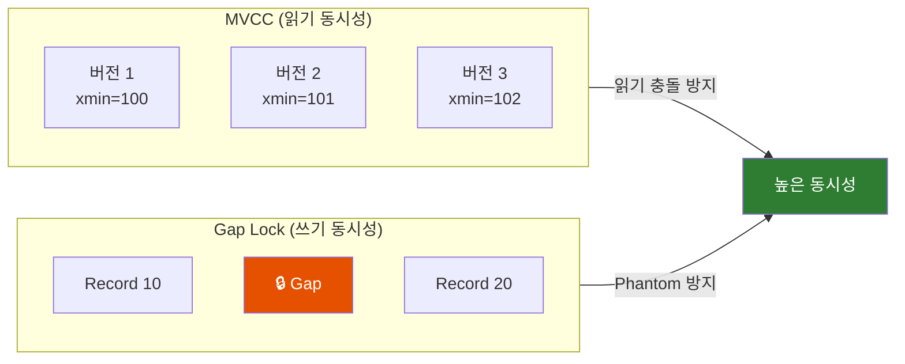

| 구분 | MVCC | Gap Lock |
|------|------|----------|
| **목적** | 읽기/쓰기 동시 실행 | Phantom Read 방지 |
| **방식** | 여러 버전 유지 | 인덱스 간격 잠금 |
| **대상** | 기존 행 읽기 | 새 행 삽입 차단 |
| **성능** | 높음 (Lock-free 읽기) | 상황에 따라 Deadlock 발생 가능 |

---

## 1. 왜 MVCC가 필요한가?

### 1.1 Lock만으로 동시성을 제어하면?

전통적인 방식은 Lock을 사용한다. 누군가 데이터를 수정하면 다른 사람은 기다려야 한다.

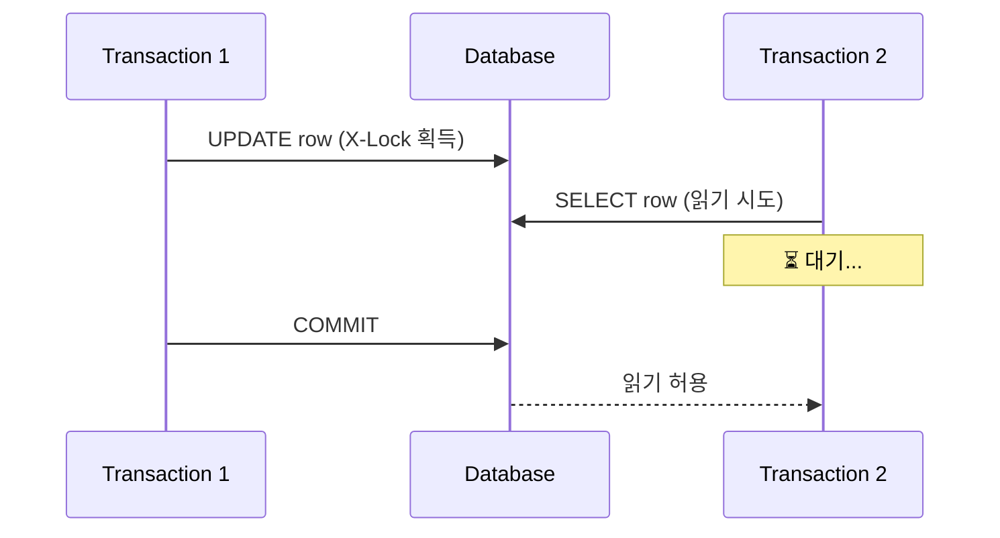

**문제점:**
- 쓰기가 읽기를 막는다 (Writer blocks Reader)
- 읽기가 쓰기를 막는다 (Reader blocks Writer)
- 동시 사용자가 많아지면 성능이 급격히 저하된다

### 1.2 MVCC의 등장

1981년 Phil Bernstein과 Nathan Goodman이 논문에서 MVCC를 소개했다. 핵심 아이디어는 간단하다:

> **"데이터를 수정할 때 덮어쓰지 말고, 새 버전을 만들자"**

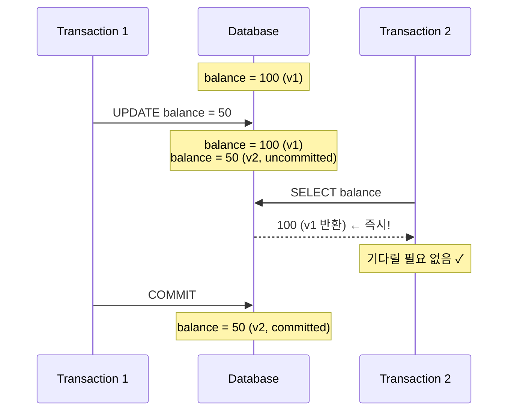

**MVCC의 핵심 원칙:**
- **Writers don't block Readers** : 쓰기가 읽기를 막지 않음
- **Readers don't block Writers** : 읽기가 쓰기를 막지 않음

---

## 2. MVCC 구현: PostgreSQL vs MySQL

두 데이터베이스 모두 MVCC를 사용하지만, 구현 방식이 완전히 다르다.

### 2.1 PostgreSQL: 테이블 내 버전 저장

PostgreSQL은 수정된 행의 **모든 버전을 테이블 안에 저장** 한다.

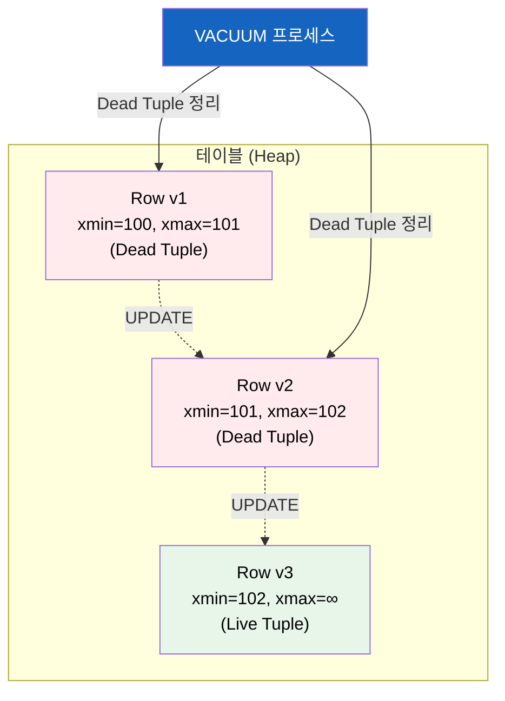

#### 핵심 시스템 컬럼

| 컬럼 | 의미 | 예시 |
|------|------|------|
| **xmin** | 이 버전을 **생성한** 트랜잭션 ID | `xmin=100` |
| **xmax** | 이 버전을 **삭제한** 트랜잭션 ID (0이면 삭제 안 됨) | `xmax=101` |
| **ctid** | 튜플의 물리적 위치 (페이지, 오프셋) | `(0, 1)` |

#### 각 연산의 동작

```sql
-- INSERT: 새 행 생성, xmin = 현재 트랜잭션 ID
INSERT INTO users (name) VALUES ('Alice');
-- 결과: xmin=100, xmax=0 (삭제 안 됨)

-- DELETE: xmax만 업데이트 (물리적 삭제 X)
DELETE FROM users WHERE name = 'Alice';
-- 결과: xmin=100, xmax=101 (Dead Tuple이 됨)

-- UPDATE = DELETE + INSERT
UPDATE users SET name = 'Bob' WHERE name = 'Alice';
-- 결과: 기존 행 xmax=102, 새 행 xmin=102
```

#### 가시성 판단 규칙

트랜잭션이 특정 행을 볼 수 있으려면:

1. **xmin이 커밋되었고** 현재 스냅샷보다 이전이어야 함
2. **xmax가 0이거나**, 커밋되지 않았거나, 현재 스냅샷 이후여야 함

#### VACUUM: 죽은 튜플 청소부

PostgreSQL의 약점은 **Dead Tuple이 쌓인다** 는 것이다.

```sql
-- 테이블 크기 확인 (bloat 발생 시 증가)
SELECT pg_size_pretty(pg_total_relation_size('users'));

-- 수동 VACUUM
VACUUM users;

-- VACUUM + 통계 갱신
VACUUM ANALYZE users;

-- 공격적 정리 (테이블 잠금 발생!)
VACUUM FULL users;
```

**AUTOVACUUM** 이 자동으로 정리하지만, 부하가 심한 테이블은 설정 튜닝이 필요하다.

#### Transaction ID Wraparound 문제

PostgreSQL은 32비트 트랜잭션 ID를 사용한다. 약 40억 개의 ID가 있지만, 초당 1000 트랜잭션이면 약 50일 만에 소진된다.

이를 방지하기 위해 VACUUM은 오래된 튜플을 **Freezing** 한다:


---

### 2.2 MySQL InnoDB: Undo Log 분리 저장

MySQL은 **최신 버전만 테이블에 저장** 하고, 이전 버전은 **Undo Log** 에 따로 관리한다.

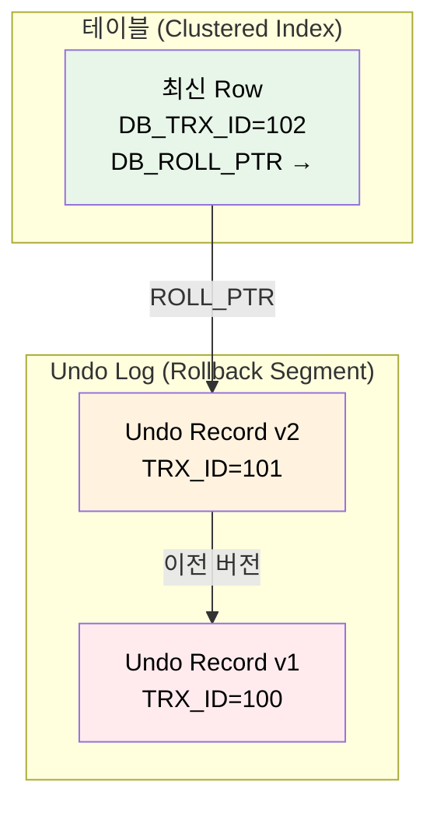

#### 핵심 Hidden Column

| 컬럼 | 크기 | 의미 |
|------|------|------|
| **DB_TRX_ID** | 6 bytes | 이 버전을 생성/수정한 트랜잭션 ID |
| **DB_ROLL_PTR** | 7 bytes | Undo Log의 이전 버전을 가리키는 포인터 |
| **DB_ROW_ID** | 6 bytes | 자동 생성 Row ID (PK 없을 때) |

#### Undo Log의 두 가지 종류

| 종류 | 용도 | 삭제 시점 |
|------|------|----------|
| **Insert Undo Log** | 트랜잭션 롤백 | 커밋 즉시 삭제 가능 |
| **Update Undo Log** | 롤백 + MVCC 읽기 | 해당 버전을 참조하는 트랜잭션이 없을 때 |

#### 과거 버전 읽기 과정

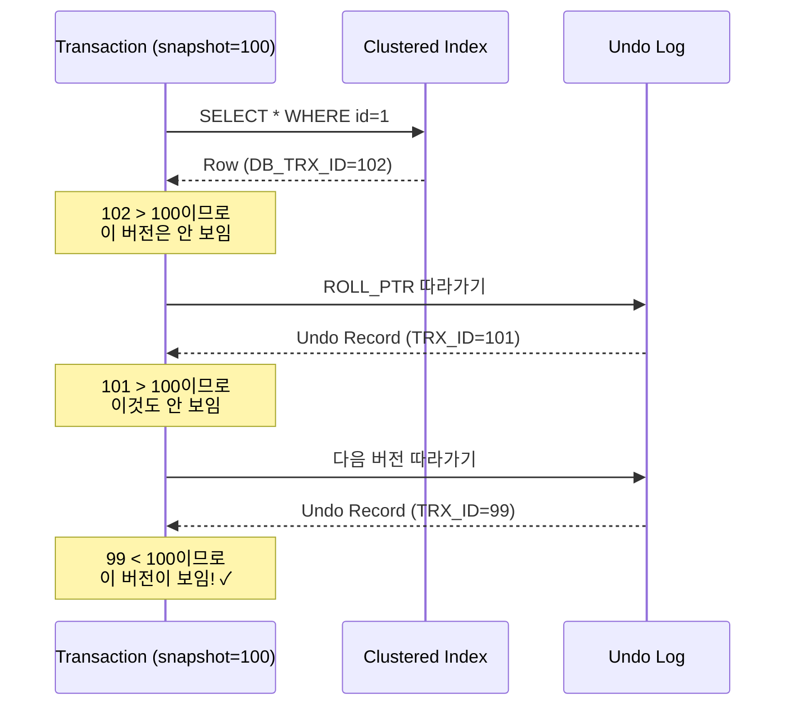

#### Purge: Undo Log 정리

MySQL은 **Purge Thread** 가 백그라운드에서 자동으로 Undo Log를 정리한다. PostgreSQL의 VACUUM처럼 별도 명령이 필요 없다.

```sql
-- Undo Log 상태 확인
SHOW ENGINE INNODB STATUS\G

-- History List Length가 크면 Purge가 밀린 것
-- (오래 실행되는 트랜잭션이 원인일 수 있음)
```

**주의:** 트랜잭션을 오래 열어두면 Undo Log가 쌓여서 디스크 공간이 부족해질 수 있다.

---

### 2.3 PostgreSQL vs MySQL MVCC 비교

| 구분 | PostgreSQL | MySQL (InnoDB) |
|------|------------|----------------|
| **버전 저장 위치** | 테이블 내부 | Undo Log (별도) |
| **읽기 성능** | 빠름 (재구성 불필요) | 과거 버전은 느림 (체인 탐색) |
| **쓰기 성능** | UPDATE가 무거움 (전체 행 복사) | 가벼움 (변경분만 Undo Log에) |
| **정리 방식** | VACUUM (수동/자동) | Purge Thread (자동) |
| **운영 부담** | VACUUM 튜닝 필요 | 거의 없음 |
| **테이블 Bloat** | 발생함 | 발생 안 함 |
| **기본 격리 수준** | READ COMMITTED | REPEATABLE READ |

---

## 3. MySQL의 Lock 메커니즘

MVCC만으로는 모든 문제를 해결할 수 없다. 특히 **쓰기-쓰기 충돌** 과 **Phantom Read** 는 Lock이 필요하다.

### 3.1 Lock의 종류

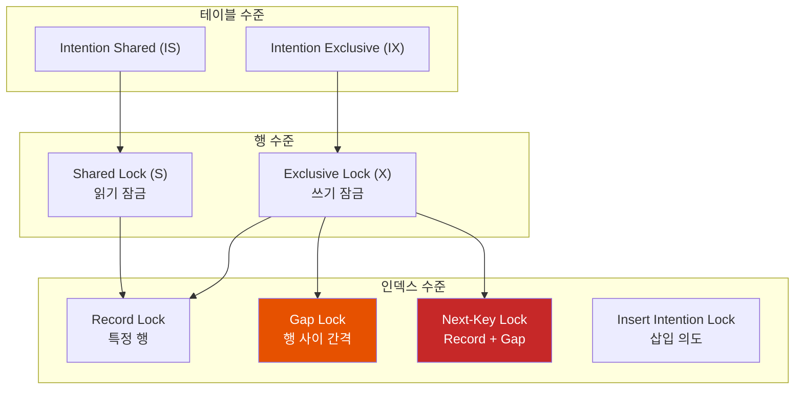

#### Shared Lock (S) vs Exclusive Lock (X)

| Lock | 획득 시 | 다른 S Lock | 다른 X Lock |
|------|---------|------------|------------|
| **S (공유)** | `SELECT ... FOR SHARE` | ✅ 허용 | ❌ 대기 |
| **X (배타)** | `SELECT ... FOR UPDATE`, `UPDATE`, `DELETE` | ❌ 대기 | ❌ 대기 |

#### Intention Lock (의도 잠금)

테이블 레벨에서 "이 테이블의 어떤 행에 Lock을 걸 것이다"라고 미리 알리는 Lock.

```sql
-- IS Lock: "이 테이블에서 S Lock을 걸 행이 있음"
SELECT * FROM users WHERE id = 1 FOR SHARE;

-- IX Lock: "이 테이블에서 X Lock을 걸 행이 있음"
SELECT * FROM users WHERE id = 1 FOR UPDATE;
```

**목적:** `LOCK TABLES ... WRITE` 같은 테이블 전체 잠금과 행 잠금의 충돌을 빠르게 감지.

---

### 3.2 Record Lock, Gap Lock, Next-Key Lock

이 세 가지가 InnoDB의 핵심 Lock이다.

#### Record Lock: 특정 인덱스 레코드 잠금

```sql
-- id=10인 행만 잠금 (id가 UNIQUE인 경우)
SELECT * FROM users WHERE id = 10 FOR UPDATE;
```

```
인덱스:  ... [5] [10] [15] ...
Lock:           🔒
```

#### Gap Lock: 인덱스 간격 잠금

**Gap Lock은 "존재하지 않는 값"의 삽입을 막는다.**

```sql
-- id가 5~15 사이의 "간격"을 잠금
SELECT * FROM users WHERE id BETWEEN 5 AND 15 FOR UPDATE;
```

```
인덱스:  ... [5] ----GAP---- [15] ...
Lock:        🔒   🔒🔒🔒🔒   🔒
                 (간격 잠금)
```

**핵심 특성:**
- Gap Lock은 **순수하게 삽입을 막는 용도** (purely inhibitive)
- 여러 트랜잭션이 **같은 Gap에 동시에 Lock을 잡을 수 있음** (충돌 안 함)
- Gap Lock끼리는 서로 막지 않지만, **Insert는 막음**

#### Next-Key Lock: Record Lock + Gap Lock

InnoDB의 기본 잠금 방식. 레코드 자체와 그 앞의 간격을 함께 잠근다.

```sql
-- REPEATABLE READ에서 기본적으로 사용됨
SELECT * FROM users WHERE id >= 10 FOR UPDATE;
```

```
인덱스:  ... [5] ----GAP---- [10] ----GAP---- [15] ...
Lock:              🔒🔒🔒🔒   🔒    🔒🔒🔒🔒   🔒
                  (Next-Key)     (Next-Key)
```

**Next-Key Lock = 반열린 구간 `(이전 값, 현재 값]`**

#### Insert Intention Lock: 삽입 의도 Lock

INSERT 전에 획득하는 특수한 Gap Lock. **같은 Gap 내 다른 위치에 삽입하는 것은 서로 막지 않는다.**

```sql
-- TX1: id=6 삽입 시도 (Gap 5~10)
INSERT INTO users (id) VALUES (6);  -- Insert Intention Lock 획득

-- TX2: id=8 삽입 시도 (같은 Gap 5~10)
INSERT INTO users (id) VALUES (8);  -- 서로 막지 않음! ✓
```

```
인덱스:  [5] ----GAP---- [10]
TX1:         🔷(6)
TX2:              🔷(8)
              (둘 다 OK!)
```

---

### 3.3 왜 Gap Lock이 필요한가? - Phantom Read 방지

MVCC의 스냅샷 읽기로도 Phantom Read를 막을 수 있지만, **Locking Read** (`SELECT ... FOR UPDATE`)에서는 문제가 된다.

#### Gap Lock 없이 발생하는 Phantom

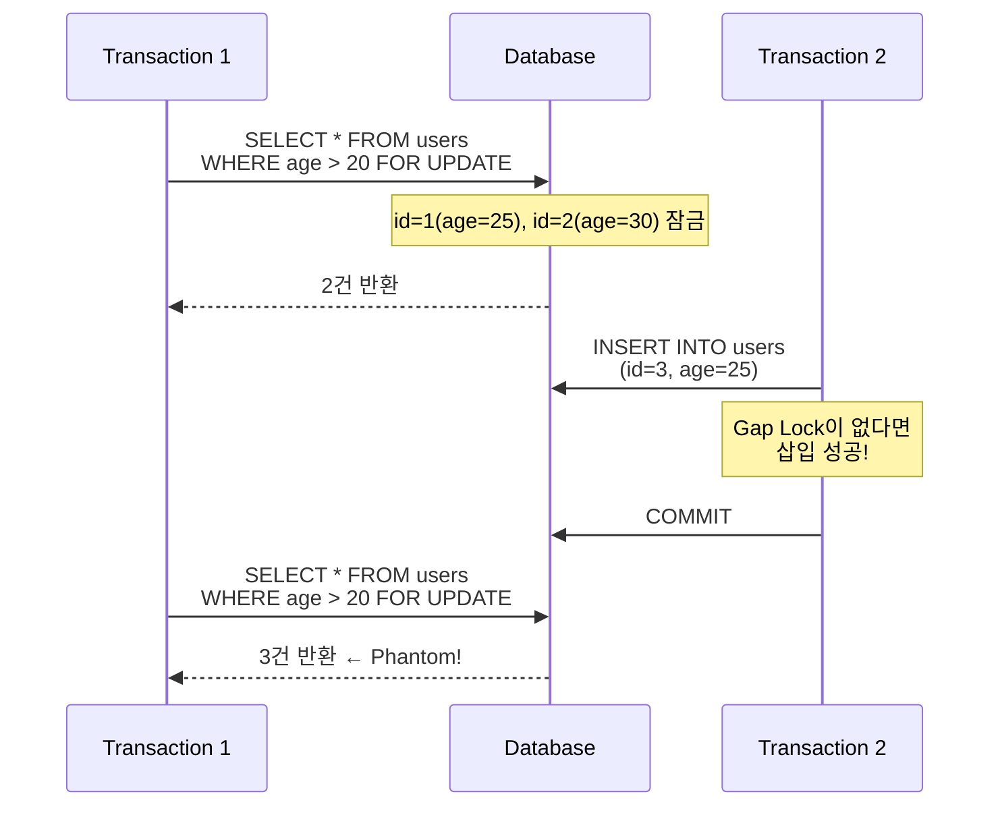

#### Gap Lock으로 Phantom 방지

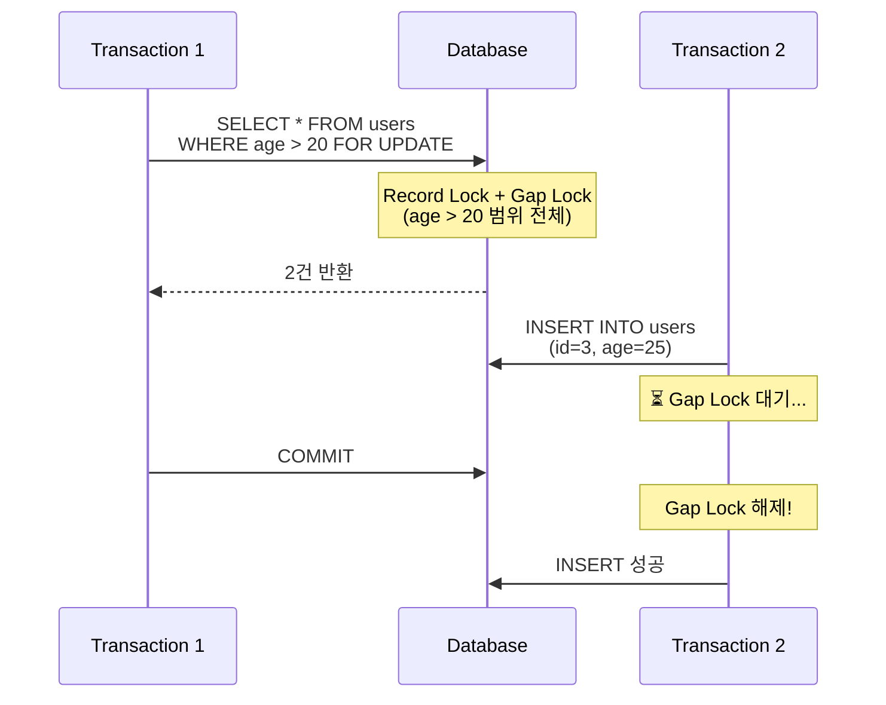

---

### 3.4 격리 수준별 Lock 동작

| 격리 수준 | Gap Lock | 잠금 범위 |
|----------|----------|----------|
| **READ UNCOMMITTED** | ❌ 사용 안 함 | - |
| **READ COMMITTED** | ❌ 사용 안 함 | Record Lock만 (단, FK/중복 키 체크 시 Gap Lock) |
| **REPEATABLE READ** | ✅ 사용 | Next-Key Lock (Record + Gap) |
| **SERIALIZABLE** | ✅ 사용 | 모든 SELECT에 S Lock + Gap Lock |

```sql
-- READ COMMITTED로 변경하면 Gap Lock 비활성화
SET SESSION TRANSACTION ISOLATION LEVEL READ COMMITTED;

-- 확인
SELECT @@transaction_isolation;
```

---

## 4. Gap Lock이 일으키는 Deadlock

Gap Lock의 특성상 **의도치 않은 Deadlock** 이 발생할 수 있다.

### 4.1 Deadlock 시나리오

테이블에 id=3, id=6 두 행만 존재한다고 가정:

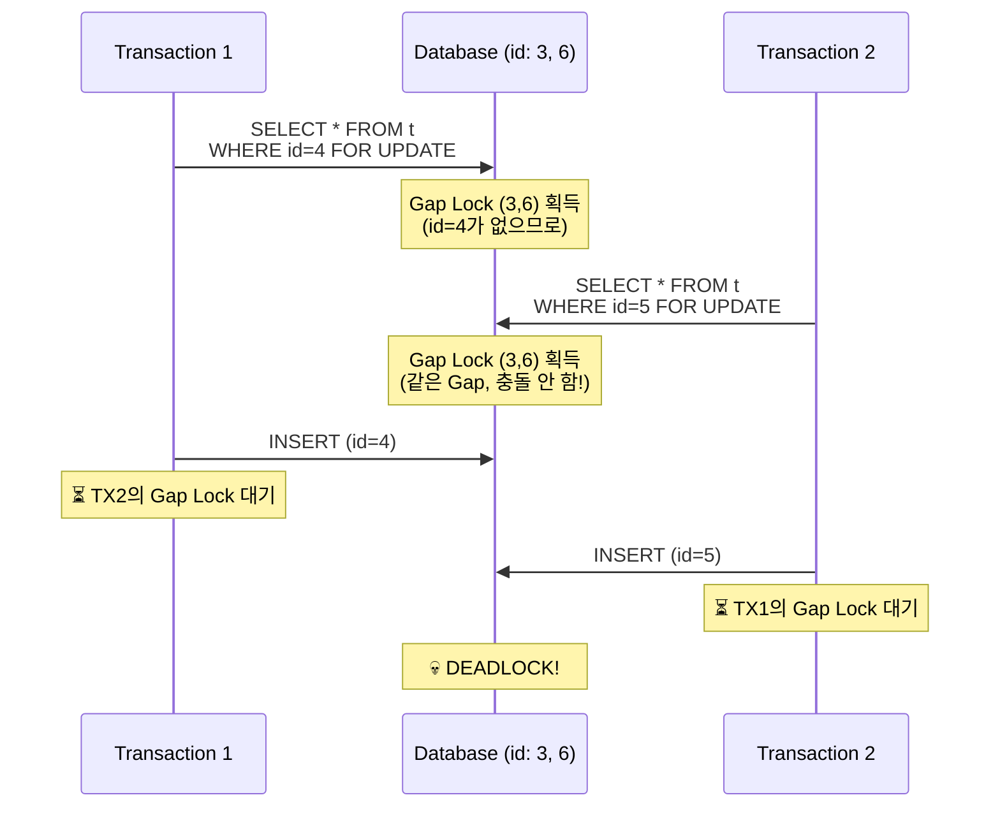

**왜 이런 일이?**
1. Gap Lock끼리는 서로 **호환** 됨 (둘 다 획득 가능)
2. 하지만 **Insert Intention Lock은 Gap Lock과 충돌** 함
3. 서로 상대방의 Gap Lock을 기다리며 Deadlock

### 4.2 Deadlock 해결 방법

#### 방법 1: READ COMMITTED 사용

```sql
SET SESSION TRANSACTION ISOLATION LEVEL READ COMMITTED;
-- Gap Lock이 비활성화되어 Deadlock 감소
```

**단점:** Phantom Read가 발생할 수 있음

#### 방법 2: INSERT ON DUPLICATE KEY UPDATE

```sql
-- AS-IS: SELECT FOR UPDATE → INSERT (Deadlock 위험)
SELECT * FROM t WHERE id = 4 FOR UPDATE;
INSERT INTO t (id, value) VALUES (4, 'new');

-- TO-BE: 한 번에 처리 (Deadlock 방지)
INSERT INTO t (id, value) VALUES (4, 'new')
ON DUPLICATE KEY UPDATE value = 'new';
```

#### 방법 3: 트랜잭션 분리 및 재시도

```java
// Deadlock 발생 시 재시도 로직
@Retryable(value = DeadlockLoserDataAccessException.class, maxAttempts = 3)
@Transactional
public void processWithRetry() {
    // 비즈니스 로직
}
```

#### 방법 4: 락 순서 통일

항상 같은 순서로 Lock을 획득하면 Deadlock을 예방할 수 있다.

```sql
-- 모든 트랜잭션이 id 오름차순으로 Lock 획득
SELECT * FROM t WHERE id = 3 FOR UPDATE;
SELECT * FROM t WHERE id = 6 FOR UPDATE;
```

### 4.3 Deadlock 디버깅

```sql
-- 마지막 Deadlock 정보 확인
SHOW ENGINE INNODB STATUS\G

-- 결과에서 LATEST DETECTED DEADLOCK 섹션 확인
```

```
------------------------
LATEST DETECTED DEADLOCK
------------------------
*** (1) TRANSACTION:
TRANSACTION 12345, ACTIVE 5 sec inserting
mysql tables in use 1, locked 1
LOCK WAIT 3 lock struct(s), heap size 1136, 2 row lock(s)
...
*** (2) TRANSACTION:
TRANSACTION 12346, ACTIVE 3 sec inserting
...
*** WE ROLL BACK TRANSACTION (2)
```

---

## 5. 실무 가이드

### 5.1 Lock 확인 방법

```sql
-- 현재 Lock 상태 확인
SELECT * FROM performance_schema.data_locks;

-- 대기 중인 Lock 확인
SELECT * FROM performance_schema.data_lock_waits;

-- 실행 중인 트랜잭션 확인
SELECT * FROM information_schema.innodb_trx;
```

### 5.2 격리 수준 선택 가이드

| 상황 | 권장 격리 수준 | 이유 |
|------|----------------|------|
| 일반 CRUD | READ COMMITTED | Gap Lock 없어 Deadlock 감소 |
| 재고 관리 | REPEATABLE READ | Phantom 방지 필요 |
| 금융 거래 | SERIALIZABLE | 완벽한 정합성 |
| 분석 쿼리 | READ COMMITTED | 긴 트랜잭션에서 Undo Log 부담 감소 |

### 5.3 ⚠️ 인덱스 없는 조건의 위험성

**WHERE 절에 인덱스가 없으면 테이블 전체가 잠긴다.**

```sql
-- age 컬럼에 인덱스가 없다면?
SELECT * FROM users WHERE age > 20 FOR UPDATE;
```

InnoDB는 조건에 맞는 행을 찾기 위해 **테이블 전체를 스캔** 한다. 이때 스캔하는 모든 레코드에 Next-Key Lock이 걸린다.

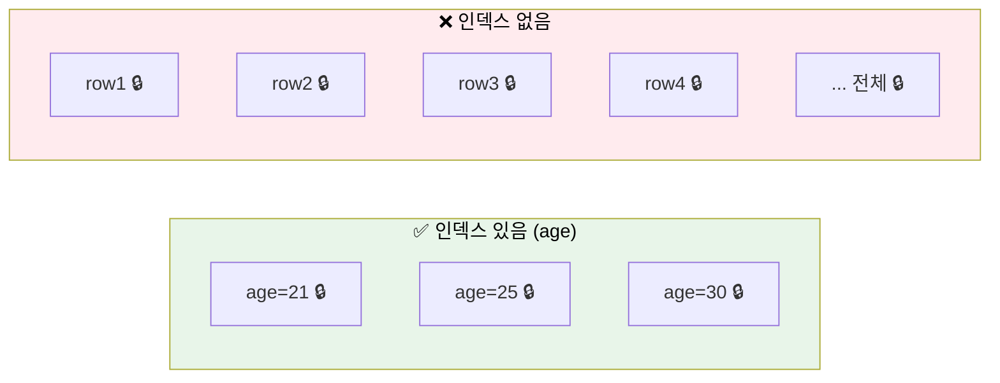

**결과:**
- 다른 트랜잭션의 INSERT, UPDATE, DELETE가 **모두 대기**
- 사실상 **테이블 전체 잠금** 과 같은 효과
- 동시성이 심각하게 저하됨

**해결책:** 쿼리 작성 전 실행 계획을 확인하라.

```sql
-- 실행 계획 확인
EXPLAIN SELECT * FROM users WHERE age > 20 FOR UPDATE;

-- type이 ALL이면 테이블 풀스캔 (위험!)
-- type이 range, ref, eq_ref면 인덱스 사용 (OK)
```

```sql
-- 인덱스 추가
CREATE INDEX idx_users_age ON users(age);
```

### 5.4 MVCC 관련 Best Practices

#### PostgreSQL

```sql
-- AUTOVACUUM 상태 확인
SELECT relname, n_dead_tup, last_autovacuum
FROM pg_stat_user_tables;

-- 긴 트랜잭션 확인 (VACUUM 방해)
SELECT pid, now() - xact_start AS duration, query
FROM pg_stat_activity
WHERE state = 'active'
ORDER BY duration DESC;
```

#### MySQL

```sql
-- 긴 트랜잭션 확인 (Undo Log 증가 원인)
SELECT trx_id, trx_started, trx_mysql_thread_id
FROM information_schema.innodb_trx
ORDER BY trx_started;

-- History List Length 확인
SHOW ENGINE INNODB STATUS\G
-- History list length가 크면 Purge가 밀린 것
```

---

## 6. 정리

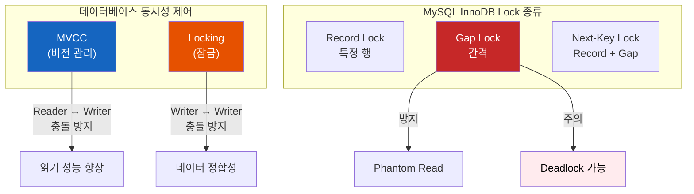

1. **MVCC** 는 여러 버전을 유지해서 읽기/쓰기가 서로 막지 않게 한다
2. PostgreSQL은 **테이블 내 저장 + VACUUM**, MySQL은 **Undo Log + Purge** 방식
3. MVCC만으로는 **Phantom Read를 완전히 막을 수 없어** MySQL은 **Gap Lock** 사용
4. Gap Lock은 **인덱스 간격을 잠가** 새로운 행 삽입을 막는다
5. Gap Lock끼리는 호환되지만 **Insert Intention Lock과 충돌** 해서 Deadlock 발생 가능
6. Deadlock을 줄이려면 **READ COMMITTED** 사용하거나 **트랜잭션을 짧게** 유지

---

## 출처

- [MySQL 8.0 Reference Manual - InnoDB Locking](https://dev.mysql.com/doc/refman/8.0/en/innodb-locking.html)
- [MySQL 8.0 Reference Manual - InnoDB Multi-Versioning](https://dev.mysql.com/doc/refman/8.0/en/innodb-multi-versioning.html)
- [PostgreSQL Documentation - Transaction Isolation](https://www.postgresql.org/docs/current/transaction-iso.html)
- [Multiversion Concurrency Control - Wikipedia](https://en.wikipedia.org/wiki/Multiversion_concurrency_control)
- [How does MVCC work - Vlad Mihalcea](https://vladmihalcea.com/how-does-mvcc-multi-version-concurrency-control-work/)
- [PostgreSQL MVCC Internals - DEV Community](https://dev.to/headf1rst/postgresql-mvcc-internals-from-xminxmax-to-isolation-levels-2g6h)
- [A Comprehensive Guide to InnoDB Locking - Jahfer's Blog](https://jahfer.com/posts/innodb-locks/)
- [MySQL Gap Lock Deadlock Solution - Medium](https://medium.com/@tanishiking/avoid-deadlock-caused-by-a-conflict-of-transactions-that-accidentally-acquire-gap-lock-in-innodb-a114e975fd72)
- [REPEATABLE-READ vs READ-COMMITTED - Percona](https://www.percona.com/blog/differences-between-read-committed-and-repeatable-read-transaction-isolation-levels/)
- [Deep Dive into PostgreSQL VACUUM - Google Cloud Blog](https://cloud.google.com/blog/products/databases/deep-dive-into-postgresql-vacuum-garbage-collector)
