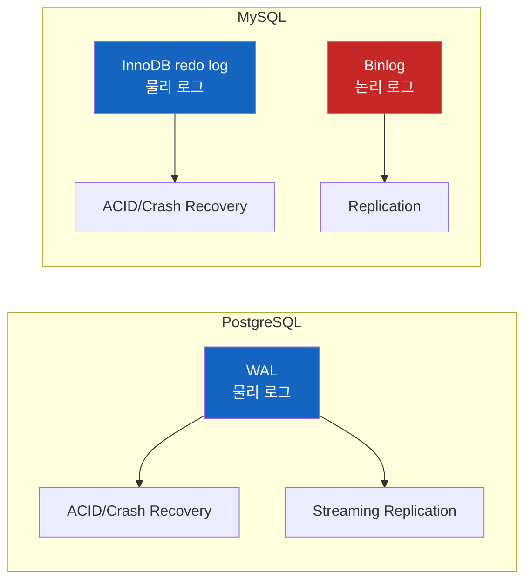
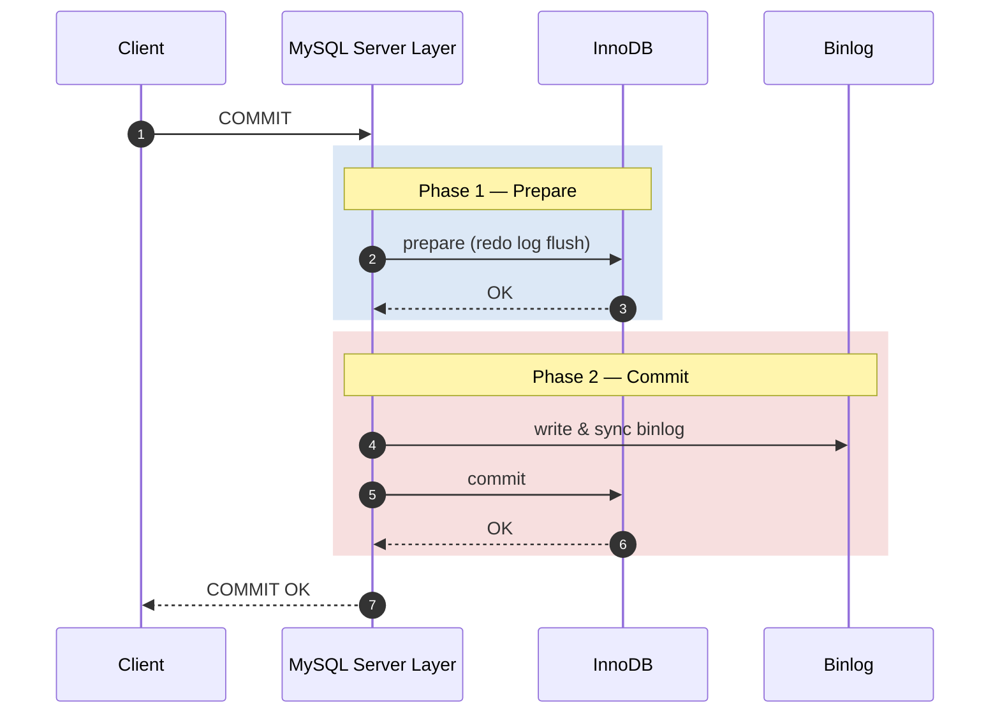
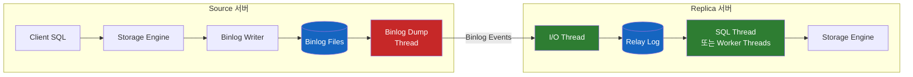
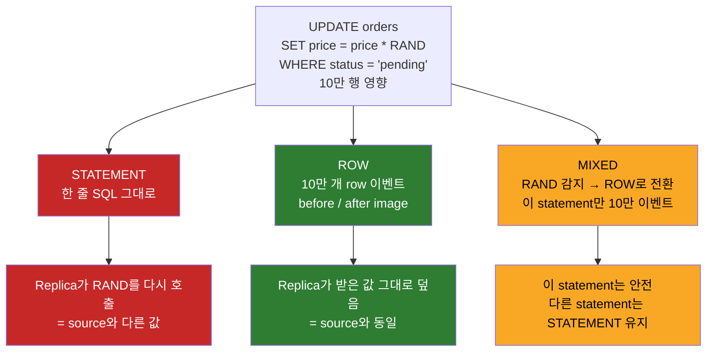

# MySQL 복제는 어떻게 데이터를 보내는가 — Binlog와 ROW/STATEMENT/MIXED

데이터베이스를 복제(replication)한다는 말은 결국 "원본 서버에서 일어난 변경을 어떤 형식으로 잘라서 다른 서버에 보내느냐"의 문제다. 그런데 이 "어떤 형식"이라는 한 줄에 데이터베이스마다 전혀 다른 철학이 숨어 있다.

PostgreSQL을 먼저 써본 사람은 자연스럽게 "복제는 WAL을 보내는 거 아닌가?"라고 생각한다. 그런데 MySQL을 들여다보면 WAL과 비슷해 보이는 InnoDB redo log가 있는데도, 복제는 그 로그가 아니라 **binlog** 라는 완전히 별개의 파일로 동작한다. 왜 이렇게 분리되어 있을까? 그리고 그 binlog 안에는 왜 또 ROW, STATEMENT, MIXED라는 세 가지 포맷이 있을까?

## 결론부터 말하면

- **PostgreSQL** 은 WAL(Write-Ahead Log) 하나로 ACID 보장과 복제를 모두 처리한다 — 같은 물리 블록 변경 기록을 standby가 그대로 재생(replay)한다.
- **MySQL** 은 두 개의 로그를 분리한다. ACID/크래시 복구는 InnoDB의 **redo log**가, 복제는 스토리지 엔진보다 한 층 위에서 작성되는 **binlog** 가 담당한다. 이 분리는 "여러 스토리지 엔진을 동시에 지원해야 한다"는 MySQL의 역사적 설계에서 나왔다.
- binlog는 변경을 기록하는 방식에 따라 세 가지 포맷이 있다 — **STATEMENT** (SQL 문장 그대로), **ROW** (변경된 행의 before/after), **MIXED** (평소엔 STATEMENT, 위험할 땐 ROW로 자동 전환). MySQL 5.7.7부터 ROW가 기본이며, **8.0.34부터 `binlog_format` 자체가 deprecated** 되어 미래에는 ROW만 남을 예정이다.



---

## 1. 왜 MySQL은 WAL이 아니라 Binlog로 복제할까?

### 1.1 WAL이 무엇이고, PostgreSQL은 왜 그것 하나로 충분한가

**WAL(Write-Ahead Log)** 은 "데이터 파일을 직접 수정하기 전에, 변경 내역을 먼저 로그 파일에 순차적으로 기록한다"는 원리다. 갑자기 서버가 죽어도 데이터 파일이 깨졌는지 어쨌는지 알 수 있고, 마지막 커밋 시점까지 복구할 수 있다. 거의 모든 RDBMS가 이 원리를 따른다.

PostgreSQL의 WAL은 한 가지 특징이 있다 — **물리 단위(블록/페이지)로 변경을 기록한다**. "테이블 `users` 의 8KB 페이지 #42를 이렇게 바꿨다" 같은 식이다. 이게 왜 중요하냐면, standby 서버가 같은 페이지를 그대로 덮어쓰기만 하면 되기 때문이다. SQL을 다시 실행할 필요가 없다. 그래서 PostgreSQL의 streaming replication은 본질적으로 **물리 복제(physical replication)** 다.

PostgreSQL은 스토리지 엔진이 사실상 하나(heap)로 고정되어 있고, 모든 트랜잭션이 같은 WAL을 통과한다. 그래서 WAL 하나로 ACID도, 복제도, PITR(Point-in-Time Recovery)도 모두 처리할 수 있다.

> 참고: PostgreSQL도 10버전부터 **Logical Replication** 을 공식 지원한다 — 같은 WAL을 logical decoding으로 풀어 행 단위 변경 이벤트로 변환해 publisher/subscriber 모델로 흘려보낸다. 다만 그 출발점도 결국 WAL 하나라는 점이 핵심이다. MySQL처럼 "복제 전용 로그를 따로 둔" 구조와는 다르다.

### 1.2 MySQL의 사정 — 여러 스토리지 엔진의 짐

MySQL은 출발점이 다르다. InnoDB, MyISAM, MEMORY, Archive, NDB 같은 여러 스토리지 엔진을 **플러그인 방식** 으로 지원한다. 각 엔진은 디스크 포맷도, 트랜잭션 지원 여부도 다르다.

여기서 문제가 생긴다. 만약 InnoDB의 redo log를 그대로 standby에 보낸다면, standby도 InnoDB여야만 한다. MyISAM 테이블은 어떻게 복제할 것인가? 결정적으로, MyISAM은 트랜잭션 자체가 없어서 redo log라는 개념도 없다.

MySQL의 해법은 **스토리지 엔진보다 한 층 위(server layer)에서 모든 변경을 한 번 더 기록하는 것** 이었다. 이게 binlog다. 어떤 엔진을 쓰든 SQL이 실행되어 데이터가 바뀌면, 그 변경은 binlog에도 기록된다. 그래서:

| 로그 | 위치 | 목적 | 단위 |
|------|------|------|------|
| InnoDB **redo log** | 스토리지 엔진 내부 | ACID, 크래시 복구 | 물리 (페이지 변경) |
| **Binlog** | 서버 레이어 | 복제, PITR, CDC | 논리 (SQL 또는 행 변경) |

즉 MySQL은 같은 변경을 **두 번 기록한다** — InnoDB가 자기 redo log에 한 번, 서버가 binlog에 또 한 번. 트랜잭션 커밋 시점에 두 로그를 일관되게 만들기 위해 **2-phase commit (XA-style)** 을 거치는 이유도 여기에 있다.



이 분리 덕분에 MySQL의 binlog는 **엔진 중립적인 논리 로그(logical log)** 가 된다. 그래서 STATEMENT/ROW/MIXED 같은 "표현 방식"을 고를 여지가 생긴 것이다. 물리 로그였다면 이런 선택지 자체가 없다.

> 참고: MySQL이 PostgreSQL의 WAL과 비슷한 "물리 복제"를 선택했다면 binlog는 필요 없었을 것이다. 하지만 그 대신 standby가 source와 정확히 같은 InnoDB 버전·페이지 포맷을 써야 하는 제약이 생긴다. binlog 방식은 그 제약을 풀어준 대가로 두 번 쓰기·포맷 선택의 복잡함을 떠안았다.

---

## 2. MySQL 복제가 실제로 흐르는 모습

binlog가 무엇인지 알았으니, 그 binlog가 어떻게 replica까지 도달하는지를 보자. MySQL 복제는 비동기 **풀 기반(pull-based)** 이다 — replica가 source에 먼저 연결을 걸고 "그 위치 이후의 binlog 이벤트를 보내달라"고 요청한다.



각 스레드의 역할은 이렇다:

- **Binlog Dump Thread (Source)** — replica가 연결되면 켜진다. binlog 파일을 따라가며 새로운 이벤트를 네트워크로 흘려보낸다.
- **I/O Thread (Replica)** — source로부터 받은 이벤트를 로컬의 **relay log** 라는 임시 파일에 그대로 적는다. 이 단계에서는 적용하지 않는다.
- **SQL Thread (Replica)** — relay log를 읽어 실제로 SQL/행 변경을 적용한다. MySQL 5.6에서 multi-threaded applier가 처음 도입되었고 5.7에서 본격 개선되었으며, **8.0.27부터는 `replica_parallel_workers` 기본값이 4** 가 되어 사실상 항상 병렬 적용이 켜져 있다.

I/O와 SQL을 분리한 이유는 명확하다. **수신과 적용을 분리해두면 네트워크가 일시적으로 끊어져도 이미 받아둔 relay log는 계속 적용할 수 있고**, 반대로 적용이 느려도 일단 받아두기는 한다. 두 단계의 진행 위치를 따로 관측할 수 있어 운영상 이점도 크다 — `SHOW REPLICA STATUS` 의 `Read_Source_Log_Pos`(I/O thread가 source binlog에서 어디까지 받아왔는가)와 `Exec_Source_Log_Pos`(SQL thread가 어디까지 적용했는가)의 차이가 곧 "받았지만 아직 못 적용한 양"이다 — 단, 이 offset 빼기는 **두 위치가 같은 binlog 파일 안에 있을 때만 직관적으로 의미가 있다**. 파일이 다르면 `Source_Log_File`/`Relay_Source_Log_File` 같은 파일명을 함께 봐야 하고, GTID 기반 복제라면 차라리 `Retrieved_Gtid_Set` 과 `Executed_Gtid_Set` 의 차집합으로 보는 편이 정확하다. `Seconds_Behind_Source`는 그중 적용 지연을 시간 단위로 표현한 단일 지표다.

> 운영 함정 한 가지: `Seconds_Behind_Source`는 SQL thread가 마지막으로 적용한 이벤트의 timestamp만 비교하기 때문에, **I/O thread가 멈춰서 새 이벤트가 아예 안 들어오고 있어도 0으로 표시될 수 있다**. 즉 "지연 0"이 "복제가 건강함"을 뜻하지 않는다. 반드시 `Replica_IO_Running`/`Replica_SQL_Running` 상태와 last error를 함께 봐야 한다.
>
> 또 한 가지 컨텍스트: 위에서 말한 `Read_Source_Log_Pos`/`Exec_Source_Log_Pos` 는 전통적인 **파일명+오프셋 기반 복제** 의 지표다. MySQL 5.6에서 도입되어 8.0의 표준이 된 **GTID(Global Transaction Identifier) 기반 복제** 에서는 트랜잭션마다 부여된 고유 ID로 진행 상태를 추적해 source 교체나 failover 시 위치 계산이 필요 없다 — 본 문서에서는 다루지 않지만, 운영을 한다면 GTID는 별도 학습 가치가 있다.

이 흐름에서 **"무엇이 binlog 이벤트로 적히는가"** 를 결정하는 것이 바로 다음에 나올 binlog 포맷이다.

---

## 3. Binlog의 세 가지 포맷

같은 `UPDATE users SET status = 'active' WHERE created_at < NOW()` 한 줄을 실행했을 때, binlog에 무엇이 적힐까? 답은 포맷에 따라 다르다.

### 3.1 STATEMENT — "방금 실행한 SQL을 그대로 적는다"

가장 오래된 방식이다. binlog에 SQL 문장 자체를 기록한다. replica의 SQL thread는 이 문장을 파싱해서 자기 데이터에 다시 실행한다.

**장점은 명확하다.** 100만 행을 바꾼 `UPDATE` 하나가 단 한 줄로 기록된다. binlog가 작고, 사람이 눈으로 읽기도 쉽다.

**문제는 "같은 SQL이 항상 같은 결과를 만들어내는가"** 다. 다음 SQL을 보자:

```sql
INSERT INTO audit_log (id, created_at) VALUES (UUID(), SYSDATE());
UPDATE orders SET price = price * RAND() WHERE status = 'pending';
```

`UUID()`, `RAND()`, `SYSDATE()` 는 호출 시점·서버마다 다른 값을 돌려준다. source에서 실행한 결과와 replica에서 실행한 결과가 달라진다. 이 순간 두 서버의 데이터는 조용히 발산(drift)한다 — 에러도 안 나고, 한참 뒤에 다른 쿼리에서 결과가 다르다는 사실로 드러난다. 이게 statement-based replication의 가장 무서운 시나리오다.

> 헷갈리기 쉬운 점: `NOW()`, `CURRENT_TIMESTAMP()` 는 **statement 시작 시점에 한 번 고정** 되고, binlog에 그 timestamp가 함께 기록된다. 그래서 source와 replica가 같은 값을 본다 — **STATEMENT 모드에서 안전하다**. 반면 `SYSDATE()` 는 호출될 때마다 다시 평가되어 unsafe다. 같은 "현재 시간"이라도 동작이 다르다.

MySQL은 이런 케이스를 **non-deterministic** 또는 **unsafe statement** 로 분류하고, STATEMENT 모드에서는 경고를 남긴다:

```
[Warning] Unsafe statement written to binary log using statement format.
Statement is unsafe because it uses a system function that may return
a different value on replica.
```

unsafe로 분류되는 대표 케이스는 다음과 같다:

- `UUID()`, `UUID_SHORT()`, `RAND()`, `SYSDATE()`, `USER()`, `CURRENT_USER()`
- `FOUND_ROWS()`, `ROW_COUNT()`, `LOAD_FILE()`, `SLEEP()`
- `LIMIT` 절이 있는 `UPDATE`/`DELETE` 에서 정렬이 결정적이지 않은 경우
- `AUTO_INCREMENT` 컬럼이 있는 테이블을 트리거/스토어드 펑션이 건드리는 경우

또 한 가지 STATEMENT를 쓸 수 없게 만드는 강제 조건이 있다 — **트랜잭션 격리 수준이 `READ COMMITTED` 또는 `READ UNCOMMITTED` 인 경우, InnoDB는 statement-based 복제를 거부한다.** 이 격리 수준에서는 InnoDB가 **gap lock을 잡지 않아** 다른 트랜잭션이 같은 범위에 새 행을 끼워 넣을 수 있다(phantom read). source에서 실행한 SQL과 replica에서 재실행한 SQL이 보는 행 집합이 달라질 수 있다는 뜻이고, 그래서 MySQL은 아예 statement 기록을 막는다. 이 격리 수준을 쓰려면 `binlog_format = ROW` (또는 MIXED)가 사실상 강제된다 — 격리 수준을 낮춰 동시성을 끌어올리는 운영 선택이 곧 ROW 포맷의 선택을 강제하는 셈이다.

### 3.2 ROW — "변경된 행 자체를 적는다"

ROW 포맷은 **`INSERT`/`UPDATE`/`DELETE` 같은 행 변경 DML에 한해** SQL 문장을 적지 않는다. 대신 **각 행의 변경 전(before image)과 변경 후(after image)** 를 그대로 binlog에 기록한다. replica는 SQL을 다시 실행하지 않고, 받은 행 데이터를 자기 테이블에 똑같이 덮는다.

> 두 가지 한정에 주의. (1) **DDL과 `GRANT`/`REVOKE`, 루틴·트리거·뷰 조작 같은 statement는 ROW 모드에서도 여전히 statement 그대로 binlog에 적힌다** — "ROW면 binlog에 SQL이 전혀 없다"는 오해는 잘못. (2) 이벤트 종류에 따라 기록되는 이미지가 다르다. `WRITE_ROWS_EVENT`(INSERT)는 after image만, `DELETE_ROWS_EVENT`는 before image만, `UPDATE_ROWS_EVENT`만 before/after를 모두 가진다. "before/after 둘 다"는 UPDATE에 한정된 이야기다.

`mysqlbinlog --verbose` 로 보면 다음과 같이 보인다:

```
### UPDATE test.users
### WHERE
###   @1=1
###   @2='john_doe'
###   @3='2024-01-15'
### SET
###   @1=1
###   @2='john_doe_updated'
###   @3='2024-01-15'
```

`UUID()` 가 들어 있어도 상관없다. source에서 만들어진 UUID 값 자체가 binlog에 박히기 때문이다. **결정성(determinism) 문제가 원천적으로 사라진다.** 이것이 ROW 포맷이 5.7.7부터 기본이 되고 8.0.34부터 사실상 유일한 권장 포맷이 된 이유다.

**대신 큰 단점이 있다.** "1줄 짜리 `UPDATE` 가 100만 행을 바꾸는 경우" — STATEMENT라면 한 줄, ROW라면 100만 행 이벤트가 binlog에 쌓인다. 디스크와 네트워크에 부담이 된다. 실무에서는 이런 대량 변경을 그대로 던지지 않고 **PK 범위로 chunk 분할(예: `WHERE id BETWEEN ? AND ?`)** 하여 여러 트랜잭션으로 쪼개는 운영 패턴이 거의 표준이다 — 한 트랜잭션이 너무 커지면 replica의 적용이 그 트랜잭션을 다 끝낼 때까지 막혀 lag가 누적된다.

또 한 가지, **ROW 포맷은 PK/유니크 인덱스가 없는 테이블에 약하다.** replica는 binlog에 박힌 행 이미지를 가지고 자기 테이블에서 같은 행을 찾아 덮어써야 한다. PK 또는 유니크 인덱스가 있으면 인덱스 lookup으로 끝나지만, **둘 다 없으면 `slave_rows_search_algorithms` 설정에 따라 동작이 갈린다** — 기본값인 `INDEX_SCAN,HASH_SCAN` 모드에서는 batch에 들어 있는 모든 before image들을 모아 해시 테이블을 만들고, 대상 테이블을 한 번 스캔하며 매칭한다(8.0.30+에서 더 강화). 즉 "이벤트마다 full scan"까지는 아니지만, **해시 스캔이라도 결국 대상 테이블 전체를 한 번씩 훑는다는 본질은 그대로다**. 수백만~수천만 행 테이블에서 PK 없이 ROW 포맷을 쓰면 batch 한 번 적용에도 분 단위 lag가 쉽게 누적되고, replica는 사실상 멈춘 것처럼 보인다. 운영 정석은 `sql_require_primary_key = ON` 으로 PK 없는 테이블 생성을 처음부터 막는 것이다. **ROW 포맷을 쓴다는 건 PK 설계가 선택이 아니라 전제 조건** 이라는 뜻이다.

이 부담을 완화하는 옵션이 `binlog_row_image` 다:

| 값 | 동작 | 트레이드오프 |
|----|------|-------------|
| `FULL` (기본) | 변경되지 않은 컬럼까지 모든 컬럼의 before/after 기록 | 가장 크지만 가장 호환성 좋음 (CDC 도구 호환) |
| `MINIMAL` | 행 식별에 필요한 컬럼(보통 PK/유니크 키) + 실제 변경된 컬럼만 기록 | binlog 작아짐 (단, PK/유니크 키가 없으면 식별을 위해 모든 컬럼이 before image에 들어가 절감 효과 사라짐) |
| `NOBLOB` | BLOB/TEXT는 변경 시에만 기록 | BLOB이 큰 테이블에서 효과적 |

ROW 포맷의 또 다른 강점은 **CDC(Change Data Capture) 친화적** 이라는 점이다. Debezium 같은 도구는 binlog의 ROW 이벤트를 읽어 Kafka로 흘려 보낸다. SQL을 파싱할 필요 없이 "어느 테이블의 어느 행이 어떤 값으로 바뀌었다"는 사실만 그대로 가져갈 수 있다. CDC를 쓸 거라면 `binlog_row_image = FULL` 은 거의 필수다.

### 3.3 MIXED — "평소엔 STATEMENT, 위험할 땐 ROW로 자동 전환"

MIXED는 둘의 절충안이다. 기본은 STATEMENT로 적되, MySQL이 "이 statement는 unsafe하다"고 판단하는 순간 그 statement만 ROW로 적는다. 한 statement만 동적으로 바뀌고, 다른 statement는 그대로 STATEMENT로 남는다.

핵심은 "어떤 조건에서 자동 전환되는가" 인데, MySQL 매뉴얼은 다음을 명시한다:

- 함수에 `UUID()` 가 포함될 때
- `AUTO_INCREMENT` 컬럼이 있는 테이블이 업데이트되고 동시에 트리거나 스토어드 펑션이 호출될 때
- view의 본문이 row-based replication을 요구할 때 (예: view 생성 SQL이 `UUID()` 를 사용)
- loadable function 호출이 포함될 때
- `FOUND_ROWS()`, `ROW_COUNT()` 가 사용될 때
- `USER()`, `CURRENT_USER()` 가 사용될 때
- `mysql` 데이터베이스의 로그 테이블이 관련될 때
- `LOAD_FILE()` 함수가 사용될 때
- 시스템 변수를 참조할 때 (몇몇 세션 스코프 변수는 예외)
- `LOAD DATA` 문은 항상 ROW로 기록

말하자면 MIXED는 **"방어적 STATEMENT"** 다. statement의 컴팩트함을 살리되, 위험한 한 케이스가 들어오면 그 케이스만 안전하게 ROW로 둔갑시킨다.

다만 현실에서 MIXED를 새로 도입하는 일은 드물다. 위 조건이 의외로 자주 트리거되어 결국 binlog의 상당 부분이 ROW로 적히는 경우가 많고, 운영자 입장에서는 "어떤 statement가 어느 포맷으로 적혔는지"를 추적해야 하는 인지 부담이 추가된다. **MIXED는 STATEMENT 시절에서 점진적으로 마이그레이션할 때의 임시 옵션** 정도의 위치를 갖는다.

---

## 4. 한눈에 비교



| 항목 | STATEMENT | ROW | MIXED |
|------|-----------|-----|-------|
| **기록 단위** | SQL 문장 | 행의 before/after | 둘을 statement 단위로 자동 선택 |
| **binlog 크기** | 가장 작음 | 가장 큼 | 중간 |
| **결정성 보장** | 비결정 함수에서 깨짐 | 항상 보장 | 위험할 때만 ROW로 보장 |
| **트리거/스토어드 프로시저** | replica에서 재실행 → 재현 위험 | source 결과만 적용 → 안전 | 위험 케이스만 ROW |
| **읽기 편의성** | 가장 좋음 (SQL 그대로) | mysqlbinlog 도움 필요 | 섞여 있음 |
| **CDC 적합성** | 부적합 (SQL 파싱 필요) | 매우 적합 | 부분 적합 |
| **MySQL 8.0 권장** | 사용 자제 | **권장 (기본값)** | 레거시용 |

---

## 5. 정리

MySQL의 복제는 PostgreSQL식 "WAL을 그대로 쏘는" 단순한 그림이 아니다. 다중 스토리지 엔진을 지원해야 했던 역사적 사정 때문에, 변경을 두 번 기록한다 — InnoDB의 redo log는 ACID/크래시 복구를 위해, server-layer의 binlog는 복제를 위해. 그리고 binlog는 엔진 중립적인 논리 로그라서 "어떤 형식으로 변경을 표현할지"를 골라야 한다.

세 포맷의 본질을 한 줄씩 줄이면:

- **STATEMENT** — 컴팩트하지만 비결정 함수에서 두 서버 데이터가 조용히 어긋난다.
- **ROW** — 안전하지만 대량 변경에서 binlog가 부푼다. 하지만 결정성과 CDC 호환성 덕에 8.0의 사실상 표준.
- **MIXED** — 평소엔 STATEMENT, 위험 감지 시 statement 단위로 ROW로 자동 전환.

**MySQL 8.0.34부터는 `binlog_format` 자체가 deprecated** 되었다. 미래에는 ROW만 남는다는 신호다. 신규 시스템을 구축한다면 처음부터 ROW + `binlog_row_image = FULL` 이 무난한 선택이다 — Debezium 같은 CDC를 붙이거나, point-in-time recovery를 정확히 돌리거나, replica 데이터 일관성을 의심할 일을 줄여주는 모든 미래의 자기 자신을 위해.

WAL과 binlog의 차이를 다시 보면 결국 **"하나의 로그가 모든 책임을 지느냐, 책임을 분리하느냐"** 라는 설계 결정이다. 어느 쪽이 더 좋다고 단정할 문제는 아니다. 다만 MySQL을 운영한다면 이 두 로그가 어떻게 서로를 바라보는지를 알고 있는 것과 모르는 것의 차이는 크다.

---

## 출처

- [MySQL :: 17.2.1 Replication Formats (8.0 공식 문서)](https://dev.mysql.com/doc/refman/8.0/en/replication-formats.html)
- [MySQL :: 17.2.1.2 Usage of Row-Based Logging and Replication (8.0 공식 문서)](https://dev.mysql.com/doc/refman/8.0/en/replication-sbr-rbr.html)
- [MySQL :: 5.4.4.3 Mixed Binary Logging Format (8.0 공식 문서)](https://dev.mysql.com/doc/refman/8.0/en/binary-log-mixed.html)
- [MySQL :: 17.2.1.3 Determination of Safe and Unsafe Statements in Binary Logging (8.0 공식 문서)](https://dev.mysql.com/doc/refman/8.0/en/replication-rbr-safe-unsafe.html)
- [MySQL :: 17.5.1.26 Replication and Row Searches (8.0 공식 문서)](https://dev.mysql.com/doc/refman/8.0/en/replication-features-row-searches.html)
- [Deep Dive on MySQL's Replication Protocol — DoltHub Blog](https://www.dolthub.com/blog/2024-06-17-mysql-replication/)
- [MySQL Replication Internals — Arpit Bhayani](https://arpitbhayani.me/blogs/mysql-replication-internals/)
- [How to Configure Binary Log Format (ROW, STATEMENT, MIXED) in MySQL — OneUptime](https://oneuptime.com/blog/post/2026-03-31-mysql-configure-binary-log-format/view)
- [MySQL Replication — LinkedIn School of SRE](https://linkedin.github.io/school-of-sre/level101/databases_sql/replication/)
- [Difference between PostgreSQL and MySQL: (1) Replication — InterDB](https://www.interdb.jp/blog/pgsql/pg_vs_my_01/)
- [MySQL CDC vs PostgreSQL CDC — BladePipe](https://www.bladepipe.com/blog/data_insights/mysql_cdc_vs_postgres_cdc/)
