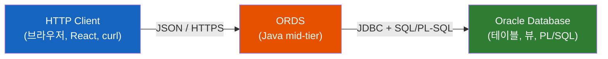
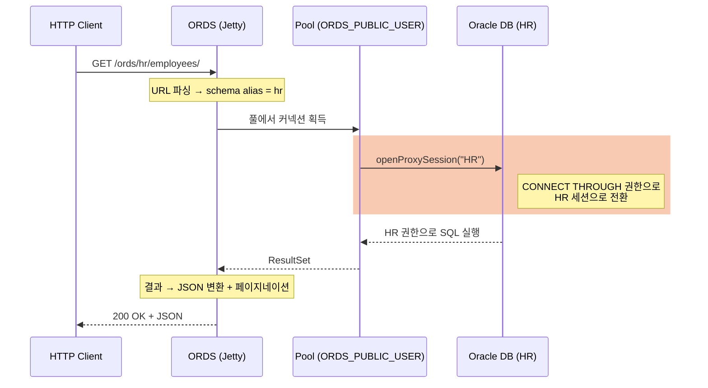
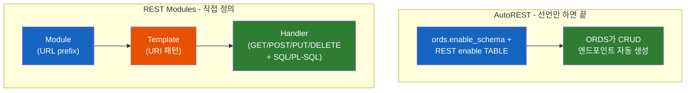

# ORDS는 Oracle 26ai의 기능이 아니다 — SQL을 JSON으로 통역하는 별도의 Java 계층

ORDS의 버전은 26.1, Oracle 데이터베이스는 26ai. 둘 다 "26"인데, 정말 같은 제품의 일부일까? ORDS는 DB 안에 내장된 기능일까, 아니면 그 앞에 따로 세워야 하는 무언가일까?

## 결론부터 말하면

**ORDS(Oracle REST Data Services)는 Oracle 26ai의 "기능"이 아니라, 데이터베이스 앞단에 따로 세우는 별도의 Java 미들티어 제품이다.** 2010년 "APEX Listener"로 출발해 이름을 바꿔온 독립 제품이고, DB와 별개로 다운로드·버전 관리된다. 버전 번호가 `26.1`인 건 26ai와 한 몸이라서가 아니라 **연도 기반 버저닝** 때문이다(흔히 CalVer라 부르는 방식) — `26.1.0`은 2026년 4월 릴리스이고, 이후 26.1.1·26.1.2 같은 패치가 이어진다. 다만 26.1 계열은 26ai의 벡터 검색 REST API를 새로 지원하는 등 **별도 제품이지만 26ai와 긴밀히 맞물려 동작한다.**

ORDS가 하는 일을 한 문장으로 줄이면 이렇다. **테이블·뷰·PL/SQL을 HTTP 위의 JSON으로 통역해주는 계층.** Java 개발자에게 익숙한 말로 바꾸면, Spring Controller + Service + JPA Repository + DTO 매핑으로 짤 "테이블을 REST로 노출하기"를 SQL 한두 줄로 대체한다. Oracle의 표현으로는 **"Zero Libraries, ORMs no longer required"** 다.



| 질문 | 답 |
|------|-----|
| 26ai에 내장된 기능인가? | 아니다. 별도로 설치하는 Java 애플리케이션이다 |
| 그럼 26ai와 무관한가? | 아니다. DB 메타데이터를 DB 안에 저장하고, 26ai 신기능(벡터 등)을 노출한다 |
| 버전이 왜 26.1인가? | 연도 기반 버저닝(2026년 릴리스). DB의 "26ai"와는 우연의 일치에 가깝다 |
| 돈을 더 내야 하나? | 아니다. **"a no-cost product option of the Oracle Database"** — DB 유지보수 계약에 포함된다 |

## 1. 왜 이런 계층이 필요한가? — Java 개발자가 매번 짜던 그 코드

Oracle DB에 `EMPLOYEES` 테이블이 있다. 프론트엔드가 `GET /employees`로 조회하고 싶어 한다. Java 개발자라면 이 흐름이 손에 익었을 것이다.

```java
// 전형적인 Spring 스택 — 테이블 하나를 REST로 노출하기 위해
@Entity class Employee { ... }                       // 1) 엔티티
interface EmployeeRepository extends JpaRepository<Employee, Long> {}  // 2) 리포지토리
class EmployeeDto { ... }                            // 3) DTO
@Service class EmployeeService { ... }               // 4) 서비스
@RestController                                       // 5) 컨트롤러
class EmployeeController {
    @GetMapping("/employees")
    Page<EmployeeDto> list(Pageable p) { ... }       // 페이지네이션, 정렬, 필터링 직접 처리
}
```

테이블 하나당 다섯 종류의 파일, 그리고 거기에 JDBC 드라이버, 커넥션 풀(HikariCP), JPA/MyBatis 같은 ORM 의존성이 따라붙는다. 테이블이 50개라면? 대부분 똑같은 보일러플레이트의 반복이다.

여기서 의문이 든다. **데이터는 이미 DB 안에 다 있는데, 왜 그걸 밖으로 꺼내기 위해 이렇게 많은 중간 계층이 필요할까?** SQL은 그 자체로 이미 필터링(`WHERE`)·정렬(`ORDER BY`)·조인을 다 할 줄 안다. 부족한 건 단 하나, "HTTP로 말하고 JSON으로 주고받는" 능력뿐이다.

ORDS는 바로 그 빠진 조각만 채운다. 애플리케이션 서버에 ORM과 컨트롤러를 쌓는 대신, **DB 바로 앞에 "HTTP↔SQL 통역사"를 한 명 세운다.**

이 발상 자체는 새롭지 않다. Oracle에는 예전부터 `mod_plsql`이라는, Apache 위에서 PL/SQL을 웹으로 노출하던 모듈이 있었다. 공식 문서가 ORDS를 두고 **"a Java EE-based alternative for Oracle HTTP Server and `mod_plsql`"** 이라고 못 박는 이유다. ORDS는 그 낡은 C 기반 모듈을, REST·JSON·OAuth2를 이해하는 현대적 Java 게이트웨이로 다시 쓴 후계자다.

## 2. ORDS의 정체 — "HTTPS Web Gateway for your Oracle Database"

공식 문서는 ORDS를 **"the HTTPS Web Gateway for your Oracle Database"** 라고 정의한다. 게이트웨이라는 단어가 핵심이다. ORDS는 데이터를 저장하지 않는다. 들어온 HTTP 요청을 SQL/PL-SQL 호출로 바꾸고, 그 결과를 JSON으로 되돌려주는 **무상태(stateless) 중계 계층** 이다.

### 2.1 어디서 어떻게 도는가 — 배포 모드

ORDS는 Java 애플리케이션(`.war`로도 배포 가능)이라, 도는 위치를 고를 수 있다.

| 모드 | 설명 | 비고 |
|------|------|------|
| **Standalone** | ORDS에 내장된 **Jetty** 서버로 단독 실행 (`ords serve`) | 가장 단순. 별도 WAS 불필요 |
| **Apache Tomcat** | Tomcat에 `.war` 배포 | 26.4부터 Tomcat 10+ 요구 예정 |
| **Oracle WebLogic** | WebLogic에 `.war` 배포 | 26.4부터 WebLogic 15+ 요구 예정 |

많은 현장에서는 그냥 Standalone(Jetty)으로 띄운다. Tomcat이 꼭 필요한 게 아니라면 "이득 없는 복잡성"이라는 평이 많다 — 추가 valve 같은 WAS 고유 기능이 필요할 때만 앞단에 WAS나 Nginx를 둔다.

### 2.2 요청 한 건이 DB까지 가는 길 — 프록시 인증의 비밀

ORDS 아키텍처에서 Java 개발자가 가장 놓치기 쉬운 부분이 여기다. **"ORDS는 어떤 계정으로 DB에 접속해서 내 테이블을 읽는가?"**

직관적으로는 "스키마마다 커넥션 풀을 따로 두면 되지 않나?" 싶다. 하지만 스키마가 수백 개면 풀도 수백 개가 되어 전혀 확장되지 않는다. ORDS의 해법은 영리하다.

ORDS는 **`ORDS_PUBLIC_USER`** 라는 단 하나의 공용 계정으로 커넥션 풀을 만든다. 그리고 스키마를 REST로 열 때(`ords.enable_schema`) 내부적으로 이런 권한 부여가 일어난다.

```sql
-- ords.enable_schema('HR') 가 내부적으로 수행하는 것의 핵심
ALTER USER hr GRANT CONNECT THROUGH ords_public_user;
```

`GRANT CONNECT THROUGH`는 Oracle의 **프록시 인증(proxy authentication)** 기능이다(9i 시절부터 존재). "ORDS_PUBLIC_USER가 HR의 비밀번호 없이도 HR로 변신해 접속하는 것을 허락한다"는 뜻이다. 그래서 `HR`로 요청이 들어오면, ORDS는 풀에서 꺼낸 `ORDS_PUBLIC_USER` 커넥션 위에서 JDBC의 `openProxySession("HR")`을 호출한다. **새 커넥션을 여는 게 아니라, 같은 프로세스 안에서 세션만 HR 권한으로 갈아끼우는 것** 이다. 그래서 풀 하나로 수많은 스키마를 감당한다.

> 이 `openProxySession` 호출과 "DB Pool 당 단일 공용 계정" 구조는 공식 레퍼런스가 명시하는 사항은 아니고, ORDS 개발팀(Kris Rice 등)이 공개한 동작 설명에 근거한다(출처 참조). 공식 문서가 보장하는 범위는 `ORDS_PUBLIC_USER`와 `GRANT CONNECT THROUGH` 기반 프록시 인증까지다.



이 구조가 깨질 때 나오는 대표적 에러가 `ORA-28150: proxy not authorized to connect as client`다. "ORDS_PUBLIC_USER가 그 스키마로 프록시할 권한이 없다"는 신호 — 즉 `enable_schema`가 제대로 안 됐다는 뜻이다.

### 2.3 URL은 곧 스키마 지도

ORDS의 URL 구조는 이 프록시 모델을 그대로 반영한다.

```
https://host:port/ords/hr/employees/
└──────────────┘ └──┘ └─┘ └────────┘
   ORDS Base URI  ords schema  resource
                       alias
```

`hr`은 스키마 별칭(alias)이고, ORDS는 이 값을 보고 "HR 세션으로 프록시하라"고 판단한다. 별칭을 실제 스키마명과 다르게 두는 것이 보안상 권장된다 — URL만 보고 내부 스키마 이름을 추측하지 못하게.

## 3. 두 가지 REST 만드는 법 — AutoREST vs REST Modules

ORDS로 REST를 만드는 길은 둘이다. 이 선택이 ORDS 사용의 8할이다. 공식 문서의 표현을 빌리면, **AutoREST의 "guide rails(가드레일)"를 탈 것인가, 아니면 직접 resource module을 만들 것인가.**



### 3.1 AutoREST — 테이블을 "REST 활성화"만 하면 끝

테이블·뷰·프로시저를 가리키며 "이걸 REST로 열어"라고 선언하면, ORDS가 CRUD 엔드포인트를 자동 생성한다.

```sql
BEGIN
  ORDS.ENABLE_SCHEMA(                         -- 스키마를 REST 활성화
    p_schema              => 'HR',
    p_url_mapping_pattern => 'hr');           -- URL 별칭(실제 스키마명과 다르게 두는 게 보안상 권장, §2.3)
  ORDS.ENABLE_OBJECT(                          -- 테이블 하나를 REST 활성화
    p_schema      => 'HR',
    p_object      => 'EMPLOYEES',
    p_object_type => 'TABLE');
  COMMIT;
END;
/
```

> 위 예시는 **핵심 파라미터만 추린 최소 호출**이다. 실제 API에는 `p_auto_rest_auth`(메서드 보호), `p_items_per_page`(기본 페이지 크기) 등 기본값을 가진 선택 파라미터가 더 있다.

이것만으로 끝이다. 이제 다음이 전부 동작한다.

```
GET    /ords/hr/employees/        -- 목록 (자동 페이지네이션)
GET    /ords/hr/employees/100     -- PK로 단건 조회
POST   /ords/hr/employees/        -- 생성
PUT    /ords/hr/employees/100     -- 수정
DELETE /ords/hr/employees/100     -- 삭제
GET    /ords/hr/employees/?q={"salary":{"$gt":5000}}  -- 필터링(FbO)
```

코드 한 줄 없이 필터링·정렬·페이지네이션, 그리고 OpenAPI(Swagger) 명세 자동 생성까지 따라온다. JPA Repository를 직접 구현하지 않아도 되는 셈이다.

다만 **주의할 함정이 있다.** 테이블에 AutoREST를 켜면 `GET/POST/PUT/DELETE`가 한꺼번에 열린다. 읽기 전용 API를 원했는데 실수로 DELETE까지 외부에 노출되는 사고가 흔하다. 이를 막으려면 권한(privilege)으로 보호하거나, 애초에 **읽기 권한만 가진 별도 스키마**에 API를 두거나, AutoREST 대신 모듈로 GET만 정의해야 한다.

### 3.2 REST Modules — Module → Template → Handler

세밀한 통제가 필요하면 직접 정의한다. 구조는 3층이다. Java로 비유하면 **Module은 PL/SQL 패키지(혹은 `@RequestMapping` prefix), Template은 URI 패턴, Handler는 HTTP 메서드별 메서드 본문** 에 해당한다.

```sql
BEGIN
  -- 1) Module: URL prefix와 버전을 묶는 논리적 그룹
  ORDS.DEFINE_MODULE(
    p_module_name => 'hr.v1',
    p_base_path   => 'hr/v1/');

  -- 2) Template: prefix 뒤에 붙는 URI 패턴 (파라미터 포함 가능)
  ORDS.DEFINE_TEMPLATE(
    p_module_name => 'hr.v1',
    p_pattern     => 'employees/:dept');   -- :dept 는 바인드 변수로 들어온다

  -- 3) Handler: 메서드 + 실제 SQL/PL-SQL. "당신의 코드가 여기 들어간다"
  ORDS.DEFINE_HANDLER(
    p_module_name => 'hr.v1',
    p_pattern     => 'employees/:dept',
    p_method      => 'GET',
    p_source_type => 'json/collection',
    p_source      => 'SELECT employee_id, first_name, salary
                        FROM employees
                       WHERE department_id = :dept
                       ORDER BY salary DESC');   -- :dept 가 URL에서 자동 바인딩
  COMMIT;
END;
/
```

Template 하나에 `GET/POST/PUT/DELETE` 핸들러를 각각 붙일 수 있다. 핸들러 안에서는 조인, 여러 테이블 가공, PL/SQL 검증 로직 등 SQL이 할 수 있는 모든 것을 한다. AutoREST가 "테이블 모양 그대로"라면, 모듈은 "응답 형태를 내가 설계"한다.

### 3.3 둘 사이의 미묘한 지점 — PL/SQL의 AutoREST는 사실 REST가 아니다

깊이 들어가면 흥미로운 사실이 있다. **PL/SQL 프로시저/함수에 AutoREST를 걸면, 그건 사실 REST라기보다 RPC에 가깝다.** ORDS는 프로시저당 `POST` 엔드포인트 하나만 만들고, IN/OUT 파라미터를 JSON 본문으로 주고받는다. URL이 "자원(명사)"이 아니라 "프로시저 호출(동사)"을 가리키기 때문이다.

이것이 모듈 방식이 더 나은 이유를 설명해준다. REST의 핵심 원칙은 **"행위가 아니라 사물을 모델링하라(Model things, not actions)"** 이고, `GET`은 서버 상태를 바꾸지 않아야(부수효과 없음) RESTful하다. AutoREST-on-PL/SQL은 빠르지만 이 원칙과 어긋나기 쉽다. URL 설계를 직접 통제하려면 모듈을 써야 한다.

### 3.4 보안 — Role, Privilege, 그리고 OAuth2/JWT

ORDS의 엔드포인트는 기본적으로 보호되지 않는다(REST 자체는 아키텍처 스타일을 강제하지 않는다). 보호는 3단계로 건다.

1. **Role 생성** — `ords.create_role('hr_role')`
2. **Privilege 정의 + Role 연결** — `ords.define_privilege(...)` 로 보호 단위를 만들고 role과 묶는다
3. **Privilege를 URL 패턴에 매핑** — `ords.create_privilege_mapping(p_pattern => '/hr/*')` 처럼, 특정 경로 이하 전체를 보호

클라이언트 인증은 **OAuth2 Client Credentials**(머신 대 머신)나 **JWT**(Active Directory 등 외부 IdP 연동)로 한다. OAuth2 클라이언트를 등록하고 role을 부여하면, 발급된 토큰이 그 role을 담아 보호된 엔드포인트를 통과한다. 이 모든 메타데이터(role·privilege·module 정의)는 `ORDS_METADATA` 스키마에 **DB 안에** 저장된다 — 그래서 ORDS 인스턴스를 죽였다 살려도, 심지어 다른 인스턴스를 붙여도 정의가 그대로 살아 있다.

## 4. ORDS가 추가로 하는 일들 (통역사의 부업)

지금까지가 ORDS의 본업("SQL을 JSON으로 통역")이다. 같은 게이트웨이 위에 Oracle은 여러 기능을 얹어 두었다 — 깊이 들어갈 필요는 없지만, "ORDS = 이것들의 공통 기반"이라는 큰 그림을 위해 짚는다.

| 기능 | 한 줄 정리 |
|------|-----------|
| **Database Actions / SQL Developer Web** | 브라우저에서 도는 SQL 개발·관리 도구. 이게 ORDS 위에서 동작한다 |
| **Database API** | PDB 생명주기·성능·Data Pump 등을 다루는 **500개 이상의 REST API** 모음 |
| **Oracle Database API for MongoDB** | MongoDB 와이어 프로토콜을 받아 Oracle로 통역. 몽고 드라이버로 Oracle에 붙는다 |
| **REST-Enabled SQL** | 임의의 SQL/스크립트를 HTTP로 보내 실행하고 결과를 JSON으로 받음 |
| **APEX 프록시** | APEX(로우코드 플랫폼) 엔진 앞단의 웹 게이트웨이 역할 |
| **VecDB REST API (26.1 신규)** | 26ai의 벡터 유사도 검색·벡터 인덱스·ONNX 모델 관리를 REST로 노출 |

마지막 줄이 사용자의 처음 질문에 대한 정밀한 답이다. ORDS는 26ai의 "기능"은 아니지만, **26.1 버전은 26ai(23.26.1)를 요구하는 벡터 검색 REST API를 새로 담았다.** 별도 제품이되, 최신 DB 기능을 세상에 내보내는 창구 역할을 한다.

## 5. 정리

### 핵심 포인트

1. **ORDS는 26ai에 내장된 기능이 아니라, DB 앞에 세우는 별도의 Java 미들티어 제품이다**
   - 2010년 APEX Listener에서 출발한 독립 제품. 버전 `26.1`은 26ai와의 동일성이 아니라 연도 기반 버저닝(2026년 4월 릴리스)의 결과다.
   - 단, DB 유지보수에 포함된 무상 옵션이고, 최신 버전은 26ai 벡터 기능을 노출하는 등 DB와 긴밀히 맞물린다.

2. **본질은 "SQL/PL-SQL ↔ HTTP·JSON" 통역 계층이다**
   - Java로 짜던 Controller + Service + Repository + DTO 스택을, SQL 한두 줄로 대체한다("Zero Libraries, no ORM").
   - 데이터를 저장하지 않는 무상태 게이트웨이. `mod_plsql`의 현대적 후계자.

3. **확장성의 비밀은 단일 풀 사용자 + 프록시 인증이다**
   - `ORDS_PUBLIC_USER` 하나로 풀을 만들고, `GRANT CONNECT THROUGH` + JDBC `openProxySession`으로 요청마다 대상 스키마 세션으로 변신한다. 그래서 스키마가 수백 개여도 풀은 하나면 된다.

4. **REST를 만드는 길은 둘 — AutoREST와 REST Modules**
   - AutoREST: 테이블/뷰를 선언만 하면 CRUD·필터·페이지네이션·OpenAPI 자동 생성(단, 메서드가 한꺼번에 열리는 보안 함정 주의).
   - Modules(Module→Template→Handler): SQL/PL-SQL을 직접 써서 URL과 응답을 완전히 통제. PL/SQL의 AutoREST는 사실상 RPC라는 점이 모듈을 쓰는 또 하나의 이유다.

---

## 출처

- [Oracle REST Data Services (ORDS) Documentation — Introduction](https://docs.oracle.com/en/database/oracle/oracle-rest-data-services/25.4/orddg/introduction-to-Oracle-REST-Data-Services.html) — 공식 문서 (정의·아키텍처·기능)
- [Developing Oracle REST Data Services Applications](https://docs.oracle.com/en/database/oracle/oracle-rest-data-services/25.4/orddg/developing-REST-applications.html) — 공식 문서 (Module/Template/Handler, AutoREST 비교)
- [ORDS Release Notes 26.1.0](https://www.oracle.com/tools/ords/ords-relnotes-26.1.0.html) — 공식 (26ai 연동 VecDB REST API, Tomcat/WebLogic 지원 변경)
- [ORDS Support & Lifetime Support Policy](https://www.oracle.com/tools/ords/support.html) — 공식 (연도 기반 버전 이력, "no-cost product option")
- [REST Data Services 제품 페이지](https://www.oracle.com/database/technologies/appdev/rest.html) — 공식 ("Zero Libraries, ORMs no longer required")
- [ORDS Best Practices](https://www.oracle.com/database/technologies/appdev/rest/best-practices) — 공식 (HA, 페이지네이션, RESTful 설계 원칙)
- [Debugging ORDS Proxy Connection Issues (Kris Rice)](https://krisrice.io/2020-08-25-Debugging-ORDS-Proxy) — `ORDS_PUBLIC_USER`, `openProxySession`, `CONNECT THROUGH` 메커니즘
- [Diagnose JDBC proxy connection (Peter O'Brien)](https://peterobrien.blog/2020/12/09/diagnose-jdbc-proxy-connection) — 프록시 커넥션 동작 상세
- [Proxy User Authentication and Connect Through (ORACLE-BASE)](https://oracle-base.com/articles/misc/proxy-users-and-connect-through) — Oracle 프록시 인증 일반 원리
- [Best Practices for Building ORDS PL/SQL Based REST APIs (Cloudnueva)](https://blog.cloudnueva.com/ords-plsql-based-rest-api-bp) — Module/Template/Handler 실전 예제, 버저닝
