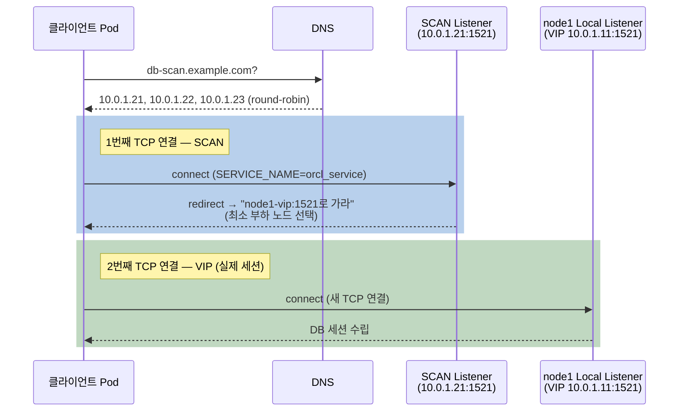

# Oracle RAC은 왜 SCAN IP만 열어서는 접속이 안 될까

접속 문자열에는 분명 SCAN 주소 하나만 적었는데, 왜 방화벽에는 노드 VIP까지 전부 열어야 할까? 그리고 쿠버네티스 default-deny egress 환경에서 RAC에 붙으려면 정확히 어떤 IP·포트를 허용해야 할까?

## 결론부터 말하면

**SCAN은 접속의 목적지가 아니라 접수창구다.** 클라이언트가 SCAN listener에 연결하면, SCAN listener는 부하가 가장 적은 노드의 **VIP에서 대기 중인 local listener 주소를 돌려주며 redirect** 하고, 클라이언트는 그 VIP로 **새로운 TCP 연결을** 맺는다. 실제 DB 세션은 SCAN이 아니라 VIP 위에서 열린다. 그래서 방화벽이든 쿠버네티스 egress 정책이든, **SCAN IP(보통 3개)와 모든 노드 VIP를 리스너 포트(기본 1521)로 함께 허용해야** 접속이 완성된다. 반대로 애플리케이션 쪽 설정은 — Spring Boot든 FastAPI든 — **SCAN 이름 하나만 적으면 충분하다.** redirect를 따라가는 건 전부 Oracle 클라이언트 드라이버의 몫이기 때문이다. 단, 그 몫은 **VIP로 새 연결을 "여는 것"까지다.** 열린 연결이 목적지에 "도달하느냐"는 드라이버가 아니라 네트워크의 몫이고, 위 표는 그 도달을 위한 목록이다.

```mermaid
flowchart LR
    client["클라이언트 Pod<br>(JDBC)"]
    dns["DNS<br>db-scan → IP 3개<br>(round-robin)"]
    scan["SCAN Listener<br>10.0.1.21~23 :1521"]
    vip["노드 VIP의<br>Local Listener<br>10.0.1.11~13 :1521"]
    db["DB 인스턴스"]

    client -->|"1&#46; 이름 풀기"| dns
    client -->|"2&#46; TCP 연결"| scan
    scan -.->|"3&#46; redirect<br>(최소 부하 노드의 VIP)"| client
    client -->|"4&#46; 새 TCP 연결"| vip
    vip --> db

    style client fill:#1565C0,color:#fff
    style dns fill:#6A1B9A,color:#fff
    style scan fill:#E65100,color:#fff
    style vip fill:#2E7D32,color:#fff
    style db fill:#455A64,color:#fff
```



| 트래픽 | 목적지 | 포트 | 안 열면 생기는 일 |
|--------|--------|------|-------------------|
| 최초 접속 | SCAN IP 3개 전부 | 1521 | DNS round-robin으로 매번 다른 SCAN IP가 나와 간헐적 접속 실패 |
| **실제 DB 세션** | **모든 노드 VIP** | 1521 (local listener 포트) | SCAN까지는 성공, redirect된 VIP에서 `ORA-12170` timeout |
| FAN 알림 (FCF 사용 시) | 모든 노드 | 6200 (ONS) | 장애 알림을 못 받아 failover가 느려짐 |

쿠버네티스 egress 통제 환경이라면 이 표가 그대로 NetworkPolicy의 `ipBlock` 목록이 된다. "SCAN 도메인 하나만 FQDN 정책으로 허용"하는 접근이 왜 무너지는지까지 포함해서, 아래에서 하나씩 쌓아보자.

---

## 1. 왜 RAC인가 — 서버 한 대짜리 DB의 두 가지 한계

출발점은 단순하다. Oracle DB를 서버 한 대에서 돌리면 두 가지 문제가 따라온다. **그 서버가 죽으면 서비스 전체가 멈추고(가용성)**, 트래픽이 늘어도 **서버 한 대의 CPU·메모리 이상으로 키울 수 없다(확장성)**.

이 문제를 풀려면 먼저 Oracle이 말하는 **인스턴스(instance)** 와 **데이터베이스(database)** 의 구분을 알아야 한다. 데이터베이스는 디스크에 저장된 데이터 파일 그 자체이고, 인스턴스는 그 파일을 읽고 쓰기 위해 메모리(SGA)와 백그라운드 프로세스로 떠 있는 실행체다. 단일 서버 구성에서는 인스턴스 1개가 데이터베이스 1개를 담당하니 이 구분을 의식할 일이 없다.

**RAC(Real Application Clusters)** 는 이 구분을 비틀어서 문제를 푼다. **데이터베이스는 공유 스토리지에 하나만 두고, 그 하나를 여러 서버(노드)의 인스턴스가 동시에 열어서 서비스한다.** Active-Standby 복제처럼 "대기 서버가 물려받는" 구조가 아니라, 모든 노드가 같은 데이터를 동시에 읽고 쓰는 **Active-Active** 구조다. 노드 하나가 죽어도 나머지 인스턴스가 이미 같은 데이터베이스를 열고 있으므로 서비스가 이어지고(가용성), 노드를 추가하면 처리 용량이 늘어난다(확장성).

물론 여러 인스턴스가 같은 블록을 동시에 만지면 캐시 일관성 문제가 생기는데, RAC은 노드 간 전용 네트워크(interconnect)로 메모리 캐시를 주고받는 **Cache Fusion** 으로 이를 해결한다. 이 글의 주제는 네트워크 쪽이므로 여기서는 "노드끼리 항상 대화해야 하는 구조"라는 점만 기억하면 된다.

그런데 이 Active-Active 구조가 곧바로 다음 질문을 만든다. **클라이언트는 여러 노드 중 어디로 접속해야 하는가?** RAC의 IP 체계가 복잡해지는 이유가 전부 이 질문에서 나온다.

---

## 2. RAC의 IP 동물원 — VIP와 SCAN은 각각 다른 문제를 푼다

Oracle 권장 구성(SCAN IP 3개) 기준으로, 2노드 RAC 하나에는 아홉 개의 IP가 등장한다. 노드마다 Public IP, Private IP, VIP가 하나씩(3×2), 클러스터 전체에 SCAN IP가 3개(SCAN은 1~3개 IP로 등록 가능하지만 Oracle은 고가용성을 위해 3개를 권장한다). 처음 보면 과해 보이지만, 각각이 서로 다른 문제의 답이라는 걸 알면 외울 필요가 없어진다.

| IP | 소속 | 푸는 문제 |
|----|------|-----------|
| Public IP | 노드마다 1개 | 노드 자체의 관리용 접근 (ssh 등) |
| Private IP | 노드마다 1개 | Cache Fusion용 노드 간 interconnect. 클라이언트와 무관 |
| **VIP (Virtual IP)** | 노드마다 1개 | **노드 장애 시 TCP timeout 없이 빠른 실패 통보** |
| **SCAN IP** | 클러스터에 3개 | **노드가 몇 대든 클라이언트 접속 문자열은 이름 하나로 고정** |

### 2-1. VIP — "죽었다"는 대답이라도 빨리 듣기 위해

먼저 VIP다. 클라이언트가 노드의 물리 IP(Public IP)로 직접 접속한다고 하자. 그 노드가 전원째 죽으면 어떻게 될까? IP 뒤에 아무도 없으므로 클라이언트의 SYN 패킷은 응답 없이 사라지고, 클라이언트는 **OS의 TCP connect timeout이 다 찰 때까지(플랫폼에 따라 수십 초~수 분) 하염없이 기다린다.** 죽은 노드가 "나 죽었어"라고 말해줄 수 없기 때문이다.

VIP는 이 대기를 없앤다. VIP는 특정 NIC에 묶이지 않은 가상 IP로, Oracle Clusterware가 리소스로 관리한다. 노드가 죽으면 **Clusterware가 그 노드의 VIP를 살아있는 다른 노드로 즉시 이동시키고**, 옮겨간 VIP는 새 연결 요청에 "여기엔 그 리스너 없음"을 즉시 응답한다. 클라이언트는 timeout을 기다리는 대신 곧바로 에러를 받고 다음 주소로 넘어갈 수 있다. **VIP의 본질은 부하 분산이 아니라 "빠른 실패(fast failure)"다.**

여기서 egress 관점의 중요한 성질 하나가 나온다. **노드가 죽어도 VIP의 IP 주소 자체는 변하지 않는다.** 그 IP를 어느 노드가 들고 있는지만 바뀐다. 즉 방화벽·egress 허용 목록에 넣어둔 VIP 주소는 장애가 나도 그대로 유효하다.

### 2-2. SCAN — 노드가 늘어도 접속 문자열은 그대로

VIP만으로도 접속은 된다. 실제로 11g R2 이전의 RAC 클라이언트는 접속 문자열에 **모든 노드의 VIP를 나열했다.**

```
# SCAN 이전 (11g R2 미만): 모든 노드 VIP를 클라이언트가 알아야 한다
(DESCRIPTION=
  (ADDRESS_LIST=
    (ADDRESS=(PROTOCOL=TCP)(HOST=node1-vip)(PORT=1521))
    (ADDRESS=(PROTOCOL=TCP)(HOST=node2-vip)(PORT=1521)))
  (CONNECT_DATA=(SERVICE_NAME=orcl)))
```

이 방식의 문제는 운영에서 드러난다. **노드를 추가하거나 빼면 그 클러스터에 붙는 모든 클라이언트의 접속 문자열을 고쳐야 한다.** 클라이언트가 수백 개면 수백 곳을 고친다.

그래서 11g R2에서 **SCAN(Single Client Access Name)** 이 도입됐다. 클러스터 전체를 대표하는 **DNS 이름 하나를** 만들고, 그 이름이 (보통) **3개의 SCAN IP로 round-robin 해석되게** 한다. 각 SCAN IP에서는 **SCAN listener** 가 대기하는데, 이 3개의 SCAN listener는 클러스터 내 노드들에 분산 배치되고 노드가 죽으면 VIP처럼 다른 노드로 이동한다. 노드가 2대든 20대든 SCAN listener는 3개면 충분하다 — 실제 일은 각 노드의 local listener가 하기 때문이다.

이제 클라이언트 접속 문자열은 노드 수와 완전히 분리된다.

```
# SCAN 이후: 이름 하나. 노드를 추가·제거해도 이 문자열은 불변
jdbc:oracle:thin:@//db-scan.example.com:1521/orcl_service
```

정리하면 **VIP는 "장애를 빨리 알리는" 문제, SCAN은 "접속 지점을 하나로 고정하는" 문제를** 푼다. 그런데 방금 "실제 일은 local listener가 한다"고 했다. 그 말은, SCAN listener에 닿은 연결이 어딘가로 넘겨진다는 뜻이다. 바로 여기에 이 글의 제목에 대한 답이 있다.

---

## 3. 접속은 한 번이 아니라 두 번 일어난다

SCAN listener는 DB 세션을 직접 만들지 않는다. 각 인스턴스는 자신의 서비스와 현재 부하를 SCAN listener에 계속 보고하고 있고(`REMOTE_LISTENER=SCAN` 설정), SCAN listener는 연결 요청이 오면 **부하가 가장 적은 인스턴스가 있는 노드의 local listener 주소 — 즉 그 노드의 VIP — 를 클라이언트에게 돌려준다.** 클라이언트는 그 주소로 **새로운 TCP 연결을** 맺고, local listener가 비로소 DB 프로세스를 붙여 세션을 만든다.



이 구조를 모른 채 방화벽을 설정하면 전형적인 장애 패턴이 나온다. **"접속 문자열에 적힌 건 SCAN뿐이니 SCAN IP만 열자"** → 1번째 연결은 성공하는데 2번째 연결이 막힌다 → 클라이언트는 `ORA-12170: TNS:Connect timeout occurred`를 받는다. 더 고약한 건 **간헐적으로만 실패하는 경우다.** VIP 중 일부만 열려 있으면, SCAN listener가 열려 있는 노드로 redirect할 때는 성공하고 막힌 노드로 보낼 때만 실패한다. "될 때도 있고 안 될 때도 있는" 장애가 되어 원인 추적이 한참 늦어진다.

한 가지 디테일이 더 있다. redirect 응답에 담겨 오는 주소는 IP가 아니라 **`LOCAL_LISTENER`에 등록된 값 — 보통 `node1-vip` 같은 호스트명** 이다. 즉 클라이언트는 VIP 호스트명을 **다시 DNS로 해석해야** 한다. 클라이언트 쪽에서 SCAN 이름만 해석 가능하고 VIP 호스트명은 해석할 수 없다면(DNS 미등록, hosts 파일 부재), 방화벽이 다 열려 있어도 접속이 실패한다. 이 사실은 잠시 뒤 쿠버네티스 FQDN 정책에서 결정적인 역할을 한다.

---

## 4. 쿠버네티스 밖에서는? — Spring Boot·FastAPI 설정은 SCAN 하나면 끝난다

여기까지 읽으면 반대 방향의 의문이 생긴다. egress 통제 같은 게 없는 평범한 환경 — VM 위의 Spring Boot, 온프레 서버의 FastAPI — 에서는 어떻게 해야 할까? 거기서도 접속 설정에 VIP를 일일이 챙겨 넣어야 하나?

**애플리케이션 설정만 보면, SCAN 이름 하나면 끝이다.** 3장에서 본 redirect는 애플리케이션 코드가 처리하는 게 아니라 Oracle 클라이언트 드라이버(JDBC thin, python-oracledb)가 프로토콜 수준에서 자동으로 따라가는 동작이다. DNS round-robin으로 SCAN IP를 고르고, redirect 응답을 받아 VIP로 재접속하는 두 번의 연결 전부가 드라이버 안에서 일어난다. 애플리케이션은 그저 "SCAN에 접속했더니 세션이 생겼다"고 인식할 뿐이다.

여기서 "드라이버가 알아서 한다"의 경계를 정확히 잘라두자. 드라이버는 유저 스페이스 라이브러리라서, 할 수 있는 일은 redirect 응답을 해석해 **VIP로 새 연결을 여는 것 — 패킷에 목적지 주소를 적는 것까지다.** 그 패킷이 서버(또는 Pod)를 떠난 뒤 실제로 VIP에 도달하느냐는 경로 위의 네트워크(방화벽·라우팅·게이트웨이)가 정하고, 여기엔 드라이버가 개입할 방법이 없다. 비유하면 **드라이버는 주소를 적는 사람, 네트워크는 배달하는 사람이다.** 그래서 "드라이버가 알아서 한다"는 "네트워크 설정이 필요 없다"는 뜻이 아니다 — 오히려 운영자가 접속 문자열에 적은 적 없는 목적지(VIP)로 나가는 연결을 드라이버가 스스로 만들어내니, **네트워크가 열어줘야 할 곳이 접속 문자열보다 늘어난다는 뜻이다.**

Spring Boot라면 datasource URL에 SCAN만 적는다.

```yaml
# application.yml — HikariCP + Oracle JDBC thin
spring:
  datasource:
    # 짧은 형식: jdbc:oracle:thin:@//db-scan.example.com:1521/orcl_service
    # 실무 권장: 접속 재시도까지 붙인 TNS 형식
    url: >-
      jdbc:oracle:thin:@(DESCRIPTION=
        (CONNECT_TIMEOUT=5)(RETRY_COUNT=3)(RETRY_DELAY=1)
        (ADDRESS=(PROTOCOL=TCP)(HOST=db-scan.example.com)(PORT=1521))
        (CONNECT_DATA=(SERVICE_NAME=orcl_service)))
    username: app
    password: ${DB_PASSWORD}
```

FastAPI에서 python-oracledb(기본 thin 모드)를 쓸 때도 같다.

```python
import oracledb

pool = oracledb.create_pool(
    user="app", password=DB_PASSWORD,
    dsn="db-scan.example.com:1521/orcl_service",   # SCAN 하나만. VIP는 어디에도 없다
    min=2, max=10,
    tcp_connect_timeout=5, retry_count=3, retry_delay=1,
)
```

두 예시에 공통으로 붙인 짧은 connect timeout(`CONNECT_TIMEOUT` / `tcp_connect_timeout`)과 재시도 설정에는 이유가 있다. SCAN IP 3개 중 하나에 문제가 생겨도 드라이버는 다음 SCAN IP로 스스로 넘어가는데, timeout이 OS 기본값이면 그 "넘어가기"가 수십 초씩 걸린다. VIP가 빠른 실패를 보장하는 서버 쪽 장치라면, 짧은 connect timeout과 재시도는 클라이언트 쪽 장치다. 그리고 접속 대상은 반드시 SID가 아닌 **SERVICE_NAME** 으로 지정한다 — 서비스 단위로 등록·부하 보고가 이뤄지는 SCAN의 동작 전제이기 때문이다.

다만 "설정에 SCAN만 적으면 된다"와 "네트워크가 SCAN에만 닿으면 된다"는 **다른 명제다.** 일반 환경에서도 다음 네 가지는 점검할 가치가 있다.

- **SCAN "IP"가 아니라 "이름"을 적어라.** 3개 IP 중 하나를 골라 하드코딩하면 DNS round-robin과 SCAN listener failover의 혜택을 전부 버리는 셈이다. 그 IP의 listener가 내려가면 드라이버가 넘어갈 다음 주소가 없다.
- **네트워크 경로는 여전히 VIP까지 필요하다.** 설정에 안 적었을 뿐, 드라이버는 VIP로 두 번째 연결을 맺는다. 앱 서버와 DB가 같은 사내망에 있고 중간 방화벽이 없으면 이 전제가 저절로 충족돼 있어 의식하지 못할 뿐이고, 중간에 방화벽·보안 그룹이 하나라도 있으면 3장의 표(SCAN IP + VIP + 리스너 포트)가 그대로 필요하다.
- **VIP 호스트명이 DNS로 풀려야 한다.** redirect에는 보통 `node1-vip` 같은 호스트명이 담겨 온다(3장). 앱 서버가 그 이름을 해석할 수 없는 망이라면 사내 DNS 등록이나 hosts 파일 등재가 필요하다.
- **HikariCP는 노드 장애를 push로 알지 못한다.** 기본 커넥션 풀은 FAN 이벤트를 구독하지 않으므로, 노드가 죽으면 풀에 남아 있던 죽은 연결이 검증(`maxLifetime`, keepalive)으로 걸러질 때까지 에러를 낼 수 있다. 이 간극이 아프면 FCF를 지원하는 Oracle UCP를 검토한다.

정리하면, 일반 환경에서 "SCAN만 적으면 그냥 되던데?"라는 경험은 설정이 전부여서가 아니라 **네트워크 경로와 DNS라는 두 전제가 이미 충족된 환경이었기 때문이다.** 그 두 전제가 기본값부터 깨져 있는 환경이 바로 default-deny egress를 깐 쿠버네티스이고, 다음 장의 주제다.

---

## 5. 쿠버네티스 egress 통제 환경에서 RAC에 접속하기

이제 무대를 옮기자. 애플리케이션이 쿠버네티스에서 돌고, 클러스터에는 default-deny egress가 깔려 있다. (egress 통제의 기본기와 세 가지 벽 — FQDN 미지원·출발지 IP·네임스페이스 범위 — 은 [[쿠버네티스-Egress-통제는-왜-NetworkPolicy-하나로-끝나지-않을까]]에서 다뤘다. 여기서는 그 도구들을 RAC이라는 목적지에 맞춰 조립한다.)

환경을 이렇게 가정한다.

| 항목 | 값 |
|------|-----|
| SCAN | `db-scan.example.com` → 10.0.1.21, 10.0.1.22, 10.0.1.23 |
| 노드 VIP | `node1-vip.example.com` 10.0.1.11, `node2-vip.example.com` 10.0.1.12 |
| 리스너 포트 | SCAN·local 모두 1521 |
| 접속 Pod | `app=order`, namespace `commerce` |

### 5-1. 표준 NetworkPolicy — ipBlock에 SCAN과 VIP를 전부 나열

표준 NetworkPolicy는 도메인을 모르므로 IP로 적는다. 3장의 결론이 그대로 YAML이 된다: **SCAN IP 3개 + VIP 전부.**

```yaml
apiVersion: networking.k8s.io/v1
kind: NetworkPolicy
metadata:
  name: allow-egress-oracle-rac
  namespace: commerce
spec:
  podSelector:
    matchLabels:
      app: order
  policyTypes:
  - Egress
  egress:
  # 1) DNS — SCAN 이름과 VIP 호스트명을 풀어야 하므로 필수
  - to:
    - namespaceSelector:
        matchLabels:
          kubernetes.io/metadata.name: kube-system
      podSelector:
        matchLabels:
          k8s-app: kube-dns
    ports:
    - protocol: UDP
      port: 53
    - protocol: TCP
      port: 53
  # 2) Oracle RAC — SCAN IP 3개 + 노드 VIP 전부
  - to:
    - ipBlock: { cidr: 10.0.1.21/32 }   # SCAN IP 1
    - ipBlock: { cidr: 10.0.1.22/32 }   # SCAN IP 2
    - ipBlock: { cidr: 10.0.1.23/32 }   # SCAN IP 3
    - ipBlock: { cidr: 10.0.1.11/32 }   # node1 VIP ← redirect의 실제 목적지
    - ipBlock: { cidr: 10.0.1.12/32 }   # node2 VIP ← 이걸 빼먹으면 간헐적 ORA-12170
    ports:
    - protocol: TCP
      port: 1521
```

실무에서는 SCAN IP·VIP가 어차피 같은 DB 서브넷에 모여 있는 경우가 많아, `/32` 다섯 줄 대신 **`cidr: 10.0.1.0/27` 처럼 그 대역을 통째로 허용하는** 쪽이 견고하다. 노드를 증설해 VIP가 추가돼도 정책을 고칠 필요가 없기 때문이다. 단, CIDR 범위는 반드시 검산하라 — 위 예시에서 `/28`(10.0.1.0~15)을 쓰면 VIP(.11~.12)는 덮지만 SCAN IP(.21~.23)가 빠져서 첫 연결부터 막히는 정책이 된다. `/27`(10.0.1.0~31)이어야 둘 다 들어온다. 대역을 열었을 때 함께 열리는 다른 자산이 없는지만 확인하면 된다.

두 가지를 추가로 점검한다.

- **local listener 포트가 SCAN 포트와 다른 클러스터도** 있다(예: SCAN 1521, local 1522). redirect는 그 포트로 오므로 VIP 쪽 허용 포트는 **local listener 포트** 기준이어야 한다.
- **FCF(Fast Connection Failover)를 쓴다면 ONS 포트 6200도** 노드들을 향해 열어야 한다. FCF는 Oracle 클라이언트(UCP 등)가 노드 장애·서비스 이동 알림(FAN 이벤트)을 ONS 데몬에게서 push로 받아 죽은 연결을 즉시 커넥션 풀에서 걷어내는 기능인데, 이 알림 채널이 6200이다. 막혀 있어도 접속 자체는 되므로, "failover가 유난히 느린" 증상으로만 드러나 원인을 찾기 어렵다.

### 5-2. Cilium FQDN 정책 — SCAN 이름만 허용하면 반드시 깨진다

"IP 하드코딩이 싫으니 도메인으로 허용하자"며 Cilium `toFQDNs`를 꺼냈다고 하자. 직관적인 첫 시도는 이거다.

```yaml
# Bad: 접속 문자열에 적힌 이름만 허용 — 1번째 연결만 통과한다
- toFQDNs:
  - matchName: "db-scan.example.com"
```

3장을 통과한 우리는 이게 왜 깨지는지 안다. FQDN 정책은 Pod의 DNS 질의 응답을 엿보고 "그 이름으로 풀린 IP"만 허용 목록에 올린다. 그런데 redirect 이후의 2번째 연결은 **`node1-vip`라는 전혀 다른 이름을** 향한다. SCAN 이름의 DNS 응답에는 VIP가 등장한 적이 없으니, VIP로 나가는 패킷은 정책 엔진 입장에서 "허용된 적 없는 IP"이고 조용히 드롭된다. 증상은 역시 간헐적 timeout이다.

성립 조건을 갖춰서 다시 쓰면 이렇다. **redirect가 호스트명으로 오고, 그 호스트명이 클러스터 DNS로 해석 가능하다는 전제하에**, VIP 호스트명 패턴까지 함께 허용한다.

```yaml
apiVersion: cilium.io/v2
kind: CiliumNetworkPolicy
metadata:
  name: allow-oracle-rac-fqdn
  namespace: commerce
spec:
  endpointSelector:
    matchLabels:
      app: order
  egress:
  # DNS 관찰 규칙 — FQDN 정책의 전제 조건
  - toEndpoints:
    - matchLabels:
        "k8s:io.kubernetes.pod.namespace": kube-system
        "k8s:k8s-app": kube-dns
    toPorts:
    - ports:
      - port: "53"
        protocol: ANY
      rules:
        dns:
        - matchPattern: "*"
  # SCAN 이름 + redirect 대상인 VIP 호스트명 패턴까지
  - toFQDNs:
    - matchName: "db-scan.example.com"
    - matchPattern: "*-vip.example.com"     # node1-vip, node2-vip... redirect의 실제 목적지
    toPorts:
    - ports:
      - port: "1521"
        protocol: TCP
```

`matchPattern`의 기준은 우리가 짐작하는 이름이 아니라 **클라이언트가 실제로 DNS에 질의하는 이름** — 즉 `LOCAL_LISTENER`에 등록되어 redirect로 돌아오는 바로 그 값이다. FQDN 엔진은 질의된 이름으로만 IP를 학습하므로, redirect가 `node1-vip`(짧은 이름)로 오는데 패턴을 FQDN으로 잡았거나 그 반대라면 매칭이 어긋난다. DBA에게 `LOCAL_LISTENER` 등록값을 확인받고 패턴을 맞추는 게 순서다.

다만 RAC 앞에서는 FQDN 정책의 평소 약점들이 전부 증폭된다는 걸 알고 선택해야 한다. **`LOCAL_LISTENER`가 호스트명이 아니라 IP로 등록된 클러스터라면** 클라이언트가 DNS 질의 없이 곧장 그 IP로 연결하므로 FQDN 엔진이 학습할 기회 자체가 없고, **JVM처럼 DNS를 캐시하는 런타임은** 엔진의 TTL 만료와 어긋나 멀쩡한 연결이 드롭되기도 한다(이 함정의 일반론은 [[쿠버네티스-Egress-통제는-왜-NetworkPolicy-하나로-끝나지-않을까]] §2-4). DB처럼 **IP가 사실상 고정된 사내 인프라는** FQDN 정책의 장점(IP 변동 추적)이 살지 않는 대상이므로, 필자라면 RAC 구간은 5-1의 CIDR `ipBlock`으로 열고 FQDN 정책은 IP가 실제로 변하는 외부 SaaS에 아껴 쓰겠다.

### 5-3. DB 쪽 방화벽이 출발지 IP를 요구할 때 — Egress Gateway

방향을 뒤집은 요구도 온다. DB 보안팀이 **"1521 포트는 출발지 IP 화이트리스트로만 연다. 접속해 올 고정 IP를 달라"** 고 하는 경우다. Pod IP는 수시로 바뀌고 노드 IP로 SNAT되며 노드도 교체되므로, 이때는 Egress Gateway로 RAC행 트래픽의 출발지를 고정한다.

```yaml
apiVersion: cilium.io/v2
kind: CiliumEgressGatewayPolicy
metadata:
  name: egress-oracle-rac
spec:
  selectors:
  - podSelector:
      matchLabels:
        app: order
        io.kubernetes.pod.namespace: commerce
  destinationCIDRs:
  - "10.0.1.0/27"            # SCAN IP + VIP를 모두 포함하는 대역이어야 한다
  egressGateway:
    nodeSelector:
      matchLabels:
        node-role: egress-gateway
    egressIP: 10.0.0.50       # DB 방화벽에 화이트리스트할 고정 출발지 IP
```

전제 하나를 빼먹으면 안 된다. `egressIP`는 선언만 한다고 생기는 주소가 아니라 **게이트웨이 노드의 네트워크 인터페이스에 실제로 할당돼 있어야 하는 주소다.** 할당돼 있지 않으면 정책에 매칭된 트래픽이 조용히 드롭된다.

여기서도 3장의 교훈이 반복된다. **`destinationCIDRs`가 SCAN IP만 덮고 VIP를 빠뜨리면**, 1번째 연결은 게이트웨이(10.0.0.50)를 타고 나가 방화벽을 통과하는데 2번째 연결은 정책 범위 밖이라 노드 IP로 새어 나가 방화벽에 막힌다. SCAN과 VIP는 **어떤 도구를 쓰든 항상 한 세트다.** (Egress Gateway의 SPOF·검증 방법은 기존 글 §3 참고.)

egress를 다 뚫었다면 애플리케이션 설정은 4장과 완전히 동일하다 — SCAN 이름 하나, 짧은 connect timeout, 재시도. 쿠버네티스라고 클라이언트 쪽에 특별한 설정이 추가되는 건 없다. 달라진 건 네트워크 경로를 "명시적으로" 열어야 한다는 것뿐이다.

---

## 6. 정리

### 핵심 포인트

1. **SCAN은 접수창구, 실제 세션은 노드 VIP 위에서 열린다**
   - SCAN listener는 최소 부하 노드의 local listener(VIP)로 redirect하고, 클라이언트는 VIP로 새 TCP 연결을 맺는다
   - 그래서 방화벽·egress는 SCAN IP 3개 + 모든 노드 VIP + 리스너 포트를 한 세트로 열어야 한다

2. **VIP와 SCAN은 다른 문제를 푼다**
   - VIP: 노드 장애 시 TCP timeout 대기 없이 즉시 실패를 알리는 장치 (IP는 고정, 호스팅 노드만 이동)
   - SCAN: 노드 수와 무관하게 클라이언트 접속 문자열을 이름 하나로 고정하는 장치 (11g R2+)

3. **애플리케이션 설정은 SCAN 이름 하나면 충분하다**
   - redirect를 따라가는 건 JDBC thin·python-oracledb 드라이버의 몫 — Spring Boot·FastAPI 코드는 두 번의 연결을 의식하지 않는다
   - 단 드라이버의 몫은 새 연결을 "여는 것"까지다. 그 연결이 "도달하는 것"은 네트워크의 몫 — 드라이버는 주소를 적는 사람, 네트워크는 배달하는 사람이다
   - 단 "설정이 SCAN 하나"와 "네트워크가 SCAN에만 닿으면 됨"은 다른 명제다. VIP까지의 경로와 VIP 호스트명 DNS 해석은 어느 환경에서든 전제 조건이다

4. **쿠버네티스 egress에서 RAC은 "IP가 고정된 대상"으로 다루는 게 견고하다**
   - 표준 NetworkPolicy `ipBlock`으로 SCAN+VIP를 덮는 CIDR을 허용하는 것이 기본기
   - FQDN 정책은 redirect가 DNS 이름으로 오고 그 이름이 해석 가능할 때만 성립하며, `LOCAL_LISTENER`가 IP 등록이면 원리적으로 동작하지 않는다

4. **일부만 열린 설정은 "간헐적 장애"로 나타난다**
   - VIP 하나 누락, ONS 6200 차단, Egress Gateway `destinationCIDRs`의 VIP 누락 — 모두 "될 때도 있고 안 될 때도 있는" 증상을 만든다
   - RAC 접속 문제는 항상 "1번째 연결(SCAN)과 2번째 연결(VIP)을 분리해서" 추적한다

> 📖 관련 문서: [[쿠버네티스-Egress-통제는-왜-NetworkPolicy-하나로-끝나지-않을까]] — FQDN 정책·Egress Gateway·cluster-wide 정책의 일반론, [[쿠버네티스-Ingress와-Egress는-왜-대칭이-아닐까]] — default-deny와 DNS 함정

---

## 출처

- [Oracle 공식 — Single Client Access Name (JDBC Developer's Guide)](https://docs.oracle.com/en/database/oracle/oracle-database/21/jjdbc/single-client-access-name.html) — SCAN listener의 redirect 동작, `LOCAL_LISTENER`=node-VIP
- [Oracle 공식 — Oracle RAC Listener](https://docs.oracle.com/en/database/oracle/oracle-database/26/adrac/rac_lstnr.html) — SCAN listener·local listener·VIP의 역할과 failover
- [Oracle White Paper — Single Client Access Name (SCAN)](https://www.oracle.com/docs/tech/database/scan.pdf) — SCAN 아키텍처, `REMOTE_LISTENER`/`LOCAL_LISTENER` 설정
- [Oracle Forums — RAC SCAN firewall setting](https://forums.oracle.com/ords/apexds/post/rac-scan-firewall-setting-oracle-12-6354) — SCAN IP+VIP 방화벽 개방, ONS 6200
- [Cilium — DNS based policies (`toFQDNs`)](https://docs.cilium.io/en/latest/security/dns) — FQDN egress 정책과 DNS 관찰 규칙
- [Cilium — Egress Gateway](https://docs.cilium.io/en/stable/network/egress-gateway/egress-gateway/) — `CiliumEgressGatewayPolicy`와 고정 출발지 IP
