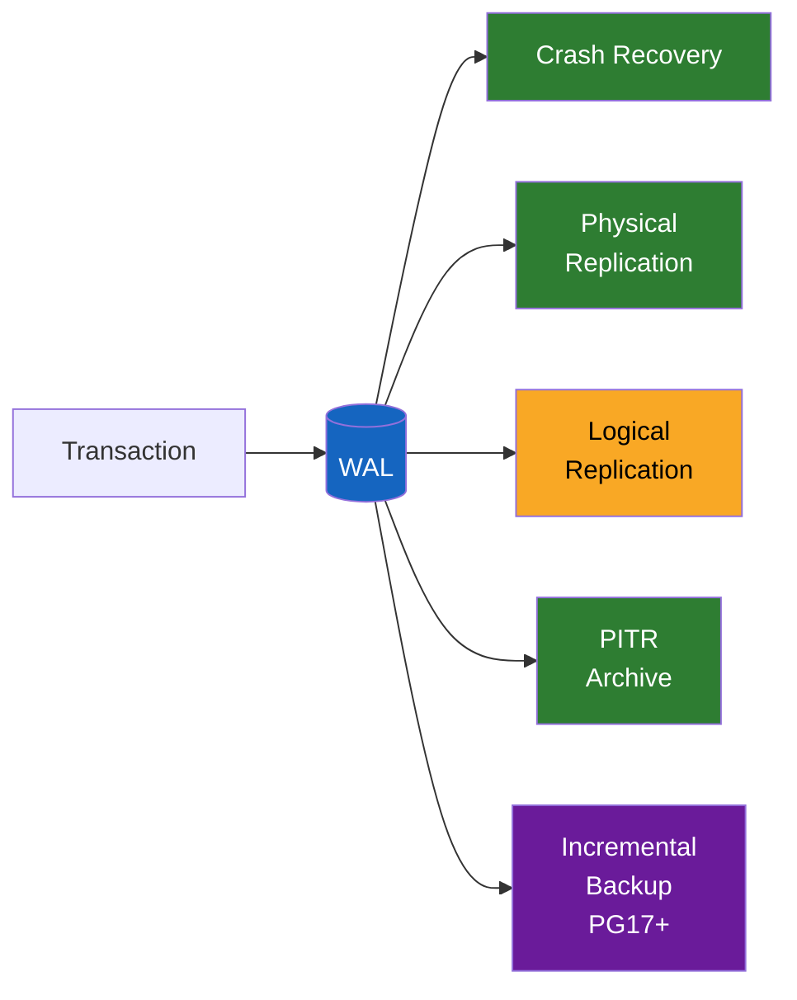
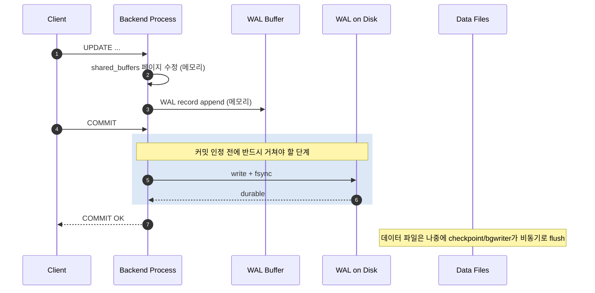
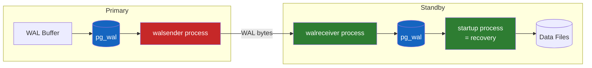
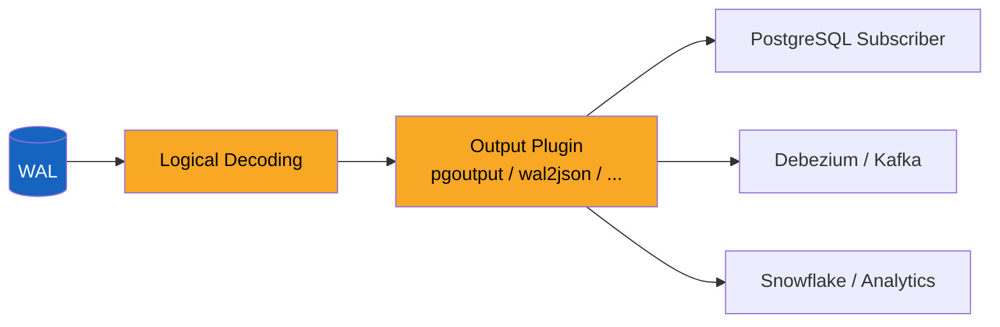
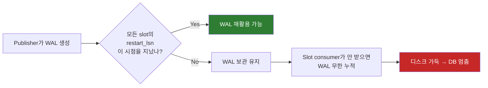

# PostgreSQL의 WAL은 어떻게 ACID와 복제를 동시에 책임지는가

데이터베이스에 `UPDATE` 한 줄을 던지고 `COMMIT` 까지 받았는데, 그 직후에 서버가 정전으로 꺼졌다고 하자. 다시 켜졌을 때 이 변경이 살아남아 있어야 한다. 그것도 데이터 파일이 한 페이지만 반쯤 써져 있거나, OS 캐시에 남아 있다가 사라진 상태에서도 살아남아야 한다. 어떻게 가능한가?

답은 단 한 줄로 줄일 수 있다 — **데이터 파일을 건드리기 전에, 변경 내역을 먼저 다른 파일에 기록해두고, 그 파일이 디스크에 안전히 안착했다는 것을 fsync로 확인한 다음에야 커밋을 인정한다**. 이 "다른 파일"이 PostgreSQL에서는 **WAL(Write-Ahead Log)** 이다.

그런데 WAL은 단순히 ACID 보장 장치에 그치지 않는다. 같은 WAL이 그대로 standby 서버에도 흘러가서 복제를 만들고, 같은 WAL을 logical decoding으로 풀면 row 단위 CDC 이벤트가 된다. PG17부터는 같은 WAL이 incremental backup의 기반이 된다. **하나의 로그가 데이터베이스의 신뢰성과 분산성을 통째로 책임지는 substrate** 라는 것 — 이게 PostgreSQL WAL의 진짜 그림이다.

## 결론부터 말하면

- WAL은 "데이터 파일 변경 전에 변경 내역을 디스크에 먼저 기록한다"는 단순한 원리지만, PostgreSQL은 이 WAL 하나로 **ACID, crash recovery, 물리 복제, 논리 복제, PITR, incremental backup** 을 모두 처리한다.
- 같은 WAL을 byte-by-byte로 standby에 보내면 **physical streaming replication**, logical decoding으로 풀어 row 이벤트로 보내면 **logical replication** 이다 — 두 길이 같은 로그를 공유한다.
- 강력한 만큼 함정도 명확하다. **replication slot은 WAL을 안전하게 잡아두는 안전핀** 이지만, 그 슬롯의 consumer가 멈춰 있으면 WAL이 영원히 누적되어 publisher 디스크를 가득 채운다 — "WAL bloat".



---

## 1. 왜 WAL이라는 개념이 필요한가

### 1.1 데이터 파일을 바로 쓰면 왜 안 되는가

가장 단순한 데이터베이스를 상상해보자. `UPDATE users SET name = 'Alice' WHERE id = 1` 이 들어오면 그 사용자가 들어 있는 페이지를 데이터 파일에서 읽어, 메모리에서 바꾸고, 다시 디스크에 쓴다. 그리고 클라이언트에 OK를 돌려준다. 끝.

이 그림에는 두 가지 결정적 문제가 있다.

**첫째, 매 변경마다 디스크 직행은 너무 느리다.** 같은 페이지를 1초에 100번 업데이트하면 100번 페이지 전체를 디스크에 쓴다. SSD라도 random write 100번은 가볍지 않다.

**둘째, 그보다 더 무서운 문제가 있다 — torn page.** 디스크는 보통 4KB 또는 512바이트 sector 단위로 atomic write를 보장하지만, PostgreSQL의 페이지는 8KB다. 8KB 페이지를 쓰는 도중에 정전이 나면 페이지 일부만 디스크에 안착한 상태로 남는다. 헤더는 새 값, 본문은 옛 값 — 이 페이지는 이제 깨진(corrupted) 페이지다. 단순한 백업으로는 복구할 수 없다.

### 1.2 "변경을 먼저 한 번 더 기록해두면 복구할 수 있다"는 발상

해법은 의외로 단순하다. **데이터 파일을 건드리기 전에, 그 변경의 redo 정보를 별도의 append-only 로그 파일에 먼저 쓰고, 그 로그가 디스크에 fsync된 것이 확인된 다음에야 커밋을 인정한다.** 데이터 파일은 천천히, 비동기적으로 업데이트해도 된다 — 어차피 크래시가 나도 WAL을 다시 재생(replay)하면 동일한 상태로 돌아갈 수 있다. 이게 **Write-Ahead Logging** 이다.

WAL은 두 가지 비용 문제를 한꺼번에 푼다:

- **랜덤 I/O → 순차 I/O**: 데이터 파일 random write 대신 WAL append를 한다. SSD에서도 sequential은 random보다 훨씬 빠르고, HDD에서는 차이가 더 극적이다.
- **torn page**: WAL에는 변경뿐 아니라 변경되는 페이지의 **전체 이미지(full page image, FPI)** 가 checkpoint 이후 처음 변경되는 시점에 함께 기록된다. 크래시가 나서 페이지가 torn이 되어도 WAL에 박힌 full page image를 가져다 덮고, 그 위에 후속 redo를 적용하면 깔끔히 복구된다.



이 그림이 PostgreSQL의 모든 신뢰성과 복제 기능의 출발점이다. 다음 절부터는 이 WAL이 실제로 어떻게 생겼는지를 들여다본다.

---

## 2. WAL의 해부학

### 2.1 LSN — WAL의 위치를 가리키는 좌표

WAL은 본질적으로 **무한히 자라는 append-only 바이트 스트림** 이다. 그 스트림의 어떤 위치든 가리킬 수 있어야 운영이 가능하다 — "여기까지 fsync 됐다", "standby가 여기까지 받았다", "여기서부터 다시 재생하면 된다" 같은 것들. 이 위치 좌표가 **LSN(Log Sequence Number)** 이다.

LSN은 64-bit 정수이고, `pg_lsn` 타입으로 표현된다. **그 64-bit 값 자체가 WAL 스트림의 byte position** 이다. 사람이 읽기 좋게 `0/16A4B80` 같은 형식으로 출력되는데, 이는 슬래시 앞이 상위 32비트, 뒤가 하위 32비트의 hex 표현일 뿐 — 슬래시는 단지 표기 구분자다. segment 파일 내부에서의 offset은 LSN과 WAL segment size로부터 별도 계산된다 (예: 기본 16MB segment에서는 LSN을 16MB로 나눈 나머지가 segment 내 offset이 된다).

```sql
-- WAL insert 위치 — WAL buffer에 record가 들어간 가장 최신 위치 (아직 OS write 전일 수 있음)
SELECT pg_current_wal_insert_lsn();   -- 0/16A4C00

-- WAL write 위치 — OS의 write() 호출까지 완료된 위치 (OS 캐시까지, fsync 전일 수 있음)
SELECT pg_current_wal_lsn();          -- 0/16A4B80

-- WAL flush 위치 — fsync까지 완료되어 디스크에 durable한 위치 (크래시 시 살아남는 한계)
SELECT pg_current_wal_flush_lsn();
```

세 함수의 위치 관계는 항상 `flush_lsn ≤ write_lsn ≤ insert_lsn` 이다. **데이터 내구성(durability)이 보장되는 진짜 경계는 `flush_lsn`** 이고, `pg_current_wal_lsn()` 은 그보다 앞선 OS-write 위치라는 점을 혼동하면 안 된다 — 크래시가 나면 write까지만 되어 fsync 안 된 영역은 사라진다.

LSN은 **단조증가(monotonic)** 한다. 두 LSN의 차이를 빼면 그 사이에 발생한 WAL 바이트 수가 나온다. **standby가 얼마나 뒤처져 있는가** 도 사실상 source의 `pg_current_wal_lsn()` 과 standby의 적용 LSN의 차이로 계산한다.

### 2.2 WAL segment 파일

WAL은 디스크에 **segment 파일** 단위로 저장된다. 위치는 데이터 디렉토리 아래의 `pg_wal/` (구버전에서는 `pg_xlog/`).

```
$PGDATA/pg_wal/
  000000010000000000000001
  000000010000000000000002
  000000010000000000000003
  ...
```

파일명은 24자 hex로 다음 의미를 가진다:

- 앞 8자: **timeline ID** (failover/PITR로 갈래가 갈리면 증가)
- 가운데 8자: LSN의 상위 32비트
- 뒤 8자: 세그먼트 번호

기본 segment 크기는 **16MB**. 가득 차면 다음 파일로 이어 쓴다. **PostgreSQL 11부터는 `initdb --wal-segsize` 로 1MB~1024MB 사이 2의 거듭제곱 값으로 변경할 수 있다** (cluster 초기화 시점에만 가능). 큰 segment는 fsync/스위칭 횟수를 줄여 쓰기 집약적 워크로드에서 throughput을 개선할 수 있지만, archive_command 단위 또한 커지므로 운영 정책과 함께 결정해야 한다.

PostgreSQL은 이 파일들을 무한히 쌓지 않는다. **체크포인트 이후 더 이상 redo에 필요 없어진 segment는 재활용(rename) 또는 삭제** 된다 — 단, 이 "필요 없어졌다"는 판단이 뒤에 나올 replication slot과 archive_command 때문에 복잡해진다.

### 2.3 WAL record 구조

각 WAL record는 다음 요소를 담는다:

- **rmgr (Resource Manager)** — 어느 종류의 변경인가. `Heap`(테이블 row), `Btree`(인덱스), `Transaction`(commit/abort), `XLOG`(checkpoint 등) 같은 분류.
- **이전 record로의 link (prev LSN)**
- **트랜잭션 ID (XID)**
- **redo data** — 실제로 무엇을 어떻게 바꿨는지의 페이로드. INSERT면 새 tuple 데이터, UPDATE면 변경 위치와 새 값 등.

`pg_waldump` 도구로 들여다보면 다음과 같다:

```
rmgr: Heap        len (rec/tot): 80/80, tx: 745, lsn: 0/016A4B80, prev 0/016A4B40,
desc: INSERT off 7 flags 0x00, blkref #0: rel 1663/13428/16384 blk 0
rmgr: Transaction len (rec/tot): 34/34, tx: 745, lsn: 0/016A4BD0, prev 0/016A4B80,
desc: COMMIT 2024-02-11 13:28:51.123456 IST
```

핵심은 **rmgr 별로 redo 함수가 따로 있다** 는 점이다. crash recovery 시 PostgreSQL은 WAL을 순서대로 읽으며 각 record의 rmgr에 등록된 redo handler를 호출해 페이지를 재구성한다.

### 2.4 Full Page Write — torn page를 막는 비용

체크포인트 직후 어떤 페이지가 처음으로 수정되면, PostgreSQL은 그 시점의 **8KB 페이지 전체 이미지** 를 WAL에 박는다. 그 이후 같은 페이지의 추가 수정은 변경분(delta)만 WAL에 적는다. 다음 체크포인트가 지나면 같은 페이지가 처음 수정될 때 다시 full image가 들어간다.

이게 왜 필요한가? **OS와 디스크의 8KB 단위 atomic write를 PostgreSQL이 신뢰하지 않기 때문** 이다. 4KB sector OS에서 8KB 페이지는 두 번에 걸쳐 쓰이고, 그 사이에 크래시가 나면 토큰(torn) 페이지가 된다. 이 경우 WAL에 박힌 full page image를 가져다 덮으면 멀쩡한 페이지로 복원할 수 있다.

**대가는 만만치 않다.** 체크포인트 직후 잠깐 동안 WAL 양이 폭증한다 — 같은 페이지를 1바이트만 바꿔도 8KB가 통째로 들어가니까. 운영적으로는:

- `full_page_writes = on` (기본): 안전. 끄지 말 것.
- 체크포인트 간격(`checkpoint_timeout`, `max_wal_size`)을 늘리면 같은 페이지가 한 체크포인트 사이클에서 한 번만 full로 쓰이므로 WAL 양이 줄어든다 — 그 대신 crash recovery 시간이 늘어난다.

이게 "checkpoint를 자주 vs 드물게"의 근본 트레이드오프다.

### 2.5 Checkpoint — WAL을 영원히 쌓을 수는 없으니

WAL 하나로 ACID와 복제를 모두 한다는 건 멋있지만, 그 WAL이 무한히 쌓이면 디스크가 폭발한다. **체크포인트(checkpoint)** 가 이 문제를 푼다.

checkpoint는 다음 일을 한다:

1. shared_buffers에서 dirty가 된 페이지들을 모두 데이터 파일에 flush.
2. 새로운 **redo point** 를 잡고 control 파일에 기록.
3. redo point 이전의 WAL segment는 더 이상 crash recovery에 필요 없으므로 **재활용 또는 삭제 가능** 으로 표시.

여기서 **redo point** 라는 용어가 등장한다. 크래시 후 PostgreSQL이 재시작되면 가장 마지막 체크포인트의 redo point부터 WAL을 읽어 한 record씩 다시 적용해 메모리 상태를 복구한다. checkpoint가 자주 일어날수록 redo point가 최근에 가까워져서 recovery가 빠르지만, 그만큼 평소에 더 많은 페이지를 데이터 파일에 써야 한다.

체크포인트는 두 조건 중 먼저 도달하는 쪽에 의해 트리거된다:

- `checkpoint_timeout` (기본 5분)
- WAL이 `max_wal_size` 만큼 누적

### 2.6 WAL Buffer & WAL Writer — disk 직행이 아닌 이유

모든 WAL record를 매번 fsync한다면 동시 트랜잭션 1만 개가 있을 때 fsync 1만 번이 발생한다. 디스크가 견디지 못한다. PostgreSQL은 메모리에 **WAL buffer** 를 두고, 다음 시점에 디스크로 flush한다:

- **트랜잭션 commit 시점** — 해당 트랜잭션의 WAL이 fsync되어야 commit이 인정된다 (synchronous_commit이 켜져 있을 때).
- **WAL buffer가 가득 찼을 때**.
- **WAL writer 백그라운드 프로세스가 주기적으로** (`wal_writer_delay`, 기본 200ms).

`synchronous_commit = off` 로 두면 commit 시점에 fsync를 기다리지 않고 OK를 돌려준다 — 응답은 빨라지지만, 크래시 시점에 직전 일부 트랜잭션이 사라질 수 있다(최대 `wal_writer_delay * 3` 만큼). **데이터의 일관성(consistency)은 깨지지 않는다 — 깨지는 것은 durability** 다. 이 미묘한 차이를 알면 "비동기 commit"의 적용 여지가 보인다 (예: 캐시 테이블, 분석용 staging).

여러 동시 commit을 하나의 fsync로 묶는 **group commit** 도 있다 — `commit_delay`, `commit_siblings` 로 조절한다. 처리량을 높이는 대가로 latency가 약간 늘어난다.

---

## 3. WAL을 다른 서버에 흘려보내기 — 복제

이제 본격적으로 "왜 WAL 하나로 복제까지 되는가"를 보자. 핵심 통찰은 단순하다 — **WAL을 그대로 standby에 보내고 standby가 똑같이 redo하면 두 서버는 byte-for-byte 동일해진다**.

### 3.1 wal_level이라는 시작점

WAL에 얼마나 많은 정보를 담을지를 결정하는 것이 `wal_level` 이다:

| 값 | 담기는 정보 | 가능한 것 |
|----|------------|----------|
| `minimal` | crash recovery에 필요한 최소 | 단일 인스턴스 운영 (복제 불가) |
| `replica` (기본) | minimal + 물리 복제용 정보 | streaming replication, PITR, archive |
| `logical` | replica + logical decoding을 위한 추가 메타데이터 (예: 변경된 row의 식별 정보) | 위 모두 + logical replication, CDC |

logical은 더 많은 정보를 WAL에 담기 때문에 WAL 양이 다소 늘어난다. 트레이드오프를 알고 골라야 한다.

### 3.2 Physical Replication (Streaming Replication) — 바이트를 그대로 보낸다

가장 직관적인 방식이다. primary는 자신이 만들어낸 WAL을 그대로 standby로 스트리밍한다. standby는 받은 WAL을 자신의 데이터 파일에 redo한다. 결과적으로 두 서버는 **byte-for-byte 동일한 클러스터 전체의 사본** 이 된다.



특징:

- **클러스터 전체** 가 복제된다. 특정 데이터베이스나 테이블만 고를 수 없다.
- standby는 기본적으로 read-only — `hot_standby = on` 이면 SELECT 가능.
- primary와 standby의 PostgreSQL **major version이 같아야** 한다 (페이지 포맷 차이 때문).
- **synchronous vs asynchronous** 선택 가능. `synchronous_standby_names` 에 지정된 standby가 WAL을 받았다는 ack를 받기 전까지 commit이 차단되는 모드(synchronous)는 데이터 유실 0을 노릴 수 있지만 latency를 늘린다. 단 "유실 0"의 정확한 보장 수준은 `synchronous_commit` 설정에 달려 있다 — `remote_write` (standby가 OS write까지) → `on` (standby가 WAL flush까지, 기본 동기 모드의 무손실 기준) → `remote_apply` (standby가 redo replay까지, read-after-write 일관성까지 보장) 순으로 강해지고, 그만큼 commit latency도 늘어난다.
- **failover 시점에 정확히 어디까지 동기화 되었는지** 추적이 가능하다 — 그 추적의 핵심이 바로 LSN이다.

물리 복제는 **HA(High Availability)와 disaster recovery의 기본 도구** 다. 같은 데이터를 통째로 가지고 있어야 하고, primary 다운 시 그대로 promote만 하면 되는 상황에 적합하다.

### 3.3 Logical Replication & Logical Decoding — WAL을 row 이벤트로 풀어내기

물리 복제만으로는 풀 수 없는 요구가 있다. "users 테이블만 다른 서버에 보내고 싶다", "변경 이벤트를 Kafka로 보내고 싶다", "PostgreSQL 16에서 PostgreSQL 18로 무중단 마이그레이션하고 싶다", "변경 이벤트를 Snowflake로 흘려보내 분석하고 싶다". 이런 요구에는 byte-level 복제가 너무 둔하다.

해법은 **logical decoding** 이다. 같은 WAL을 그대로 보내는 대신, WAL을 파싱해서 "어느 테이블의 어느 row가 어떤 값으로 바뀌었다" 같은 **논리적 변경 이벤트** 로 풀어 흘려보낸다. 이 풀어내는 일은 **output plugin** 이 한다 — 기본 플러그인은 `pgoutput`, JSON으로 받고 싶으면 `wal2json`, CDC 도구(Debezium 등)는 자체 플러그인을 사용하기도 한다.



논리 복제는 PostgreSQL의 **publication / subscription** 모델로 표현된다:

```sql
-- Publisher 쪽
CREATE PUBLICATION my_pub FOR TABLE users, orders;

-- Subscriber 쪽
CREATE SUBSCRIPTION my_sub
  CONNECTION 'host=primary dbname=app user=replicator'
  PUBLICATION my_pub;
```

특징:

- **테이블 단위** 로 골라서 복제 가능 (publication에 명시).
- **PostgreSQL 버전이 달라도** 가능 (예: 14 → 17 마이그레이션).
- subscriber는 read-only가 아니라 **쓸 수 있는 일반 PostgreSQL 인스턴스** — 데이터 통합/머지 시나리오에 유리.
- 단점: **DDL은 자동 복제되지 않는다** — PG18 기준으로도 logical replication은 schema/DDL 변경을 전파하지 않는다. 컬럼을 추가하거나 인덱스를 만들면 publisher와 subscriber 양쪽에서 수동으로 맞춰야 한다 (운영적으로는 변경을 subscriber → publisher 순으로 적용하는 게 안전). 단 **`TRUNCATE` 는 DDL처럼 보이지만 PG11 이후 logical replication 대상으로 포함된다** — 헷갈리기 쉬운 예외.
- 전제 조건: **`UPDATE`/`DELETE` 가 복제되려면 테이블에 적절한 `REPLICA IDENTITY` 가 있어야 한다.** 기본값은 `DEFAULT` 로 PK를 사용하는데, **PK가 없으면 logical decoding이 변경된 row를 식별하지 못해 `UPDATE`/`DELETE` 시 에러가 나며 복제가 멈춘다**. 임시방편으로 `ALTER TABLE ... REPLICA IDENTITY FULL` 을 걸 수도 있지만 이러면 행 전체가 WAL에 들어가 비용이 커진다 — 정석은 모든 복제 대상 테이블에 PK를 두는 것.
- 또 하나의 함정: **시퀀스(`SERIAL`/`IDENTITY`)의 현재 값(`nextval`)은 자동 복제되지 않는다.** 평소엔 문제가 안 되지만 subscriber를 새 primary로 cutover할 때 시퀀스를 수동으로 맞춰주지 않으면 다음 INSERT가 duplicate key 에러를 낸다. 마이그레이션 체크리스트의 단골 함정.
- subscriber가 늦으면 **publisher의 WAL이 지워지지 못한다** — 다음 절의 함정으로 이어진다.

### 3.4 Replication Slot — WAL을 잡아두는 안전핀, 그리고 자폭 장치

지금까지 보면 한 가지 의문이 떠오른다. **WAL은 체크포인트 이후 재활용된다고 했는데, standby가 잠시 끊겨 있는 동안 publisher가 그 WAL을 지워버리면 어떻게 되나?** standby가 다시 연결됐을 때 필요한 WAL이 사라져 있으면 복제는 그 자리에서 끝난다. base backup에서 다시 시작해야 한다.

해법이 **replication slot** 이다. replication slot은 consumer가 "여기까지는 받아 처리했다"고 ack한 LSN을 추적하면서, **consumer가 아직 필요로 할 수 있는 가장 오래된 WAL 위치(`restart_lsn`)부터의 WAL은 제거하지 말고 보존하라** 고 PostgreSQL에 강제하는 메커니즘이다. WAL 보존 여부의 진짜 기준은 언제나 `restart_lsn` 이고, 그 이전의 WAL만 재활용 가능하다. consumer 위치는 `pg_replication_slots` 뷰에서 확인할 수 있다 — 핵심 컬럼은 `restart_lsn`(physical/logical 양쪽에서 보존 기준이 되는 LSN)과, logical slot의 경우 `confirmed_flush_lsn`(consumer가 디코딩 완료를 확인한 LSN).

> logical slot의 미묘함: `confirmed_flush_lsn` 이 앞으로 나아가도 `restart_lsn` 은 그보다 뒤에 머무를 수 있다. 디코딩 도중에 아직 commit되지 않은 진행 중 트랜잭션이 있다면, 그 트랜잭션을 끝까지 따라가기 위해 트랜잭션 시작 시점의 WAL이 필요하기 때문이다. 그래서 **장시간 idle-in-transaction 세션 하나가 logical slot의 `restart_lsn` 을 한참 뒤에 묶어두는 사고 패턴** 이 흔하다.

> **중요**: 일반적인 WAL 누적을 막기 위해 잡아두는 `max_wal_size` 는 **slot이 잡고 있는 WAL에는 적용되지 않는다**. slot이 retain하는 WAL은 그 한도를 가뿐히 넘어 무한히 쌓일 수 있다. "max_wal_size 걸어뒀으니 안전하다"는 오해는 disk full 사고로 이어진다.

```sql
SELECT slot_name, slot_type, active, restart_lsn,
       confirmed_flush_lsn,
       pg_size_pretty(pg_wal_lsn_diff(pg_current_wal_lsn(), restart_lsn)) AS retained_wal
FROM pg_replication_slots;
```

slot은 두 종류다:

| 종류 | 용도 | 특징 |
|------|------|------|
| **Physical slot** | streaming replication의 standby | byte-level WAL 보관 |
| **Logical slot** | logical decoding consumer (CDC, subscription) | output plugin 지정, decoded 위치 기록 |

**그리고 여기에 PostgreSQL 운영의 가장 흔한 사고가 숨어 있다.** consumer가 죽거나, subscription이 비활성화되거나, slot을 만들고 잊어버리면 — PostgreSQL은 그 slot이 필요로 하는 WAL을 **영원히 잡아둔다**. 디스크 사용량이 무한정 늘어나고 결국 publisher의 `pg_wal` 디렉토리가 가득 차서 데이터베이스가 멈춘다. 이게 **WAL bloat** 이다.



운영 방어선은 다음과 같다:

- `pg_replication_slots` 의 `active = false` 슬롯과 `restart_lsn` 이 멈춰 있는 슬롯을 주기적으로 모니터링.
- PostgreSQL 13부터 `max_slot_wal_keep_size` 를 설정해 슬롯이 잡아둘 수 있는 WAL 양을 제한할 수 있다 — 한도를 넘으면 슬롯이 invalidate되고, 해당 consumer는 base backup부터 다시 시작해야 한다 (하지만 publisher는 살린다).
- pgoutput의 **table-level publication** 으로 WAL 디코딩 부담을 줄인다.
- 사용 끝난 슬롯은 반드시 `pg_drop_replication_slot('slot_name')` 으로 명시적으로 삭제.

> 같은 의미의 함정이 MySQL의 binlog에도 있긴 하지만(`expire_logs_days` 설정 잘못으로 누적), PostgreSQL의 slot은 **consumer 측 상태가 publisher의 WAL 보관 정책을 결정** 한다는 점에서 결합도가 더 높다. 이 결합이 PostgreSQL logical replication의 가장 큰 운영 리스크다.

---

## 4. PostgreSQL 17·18의 WAL 관련 변화

WAL은 여전히 진화 중이다. 최근 메이저 릴리즈의 변화 중 알아둘 가치가 있는 것들:

- **WAL Summarizer (PG17)** — 새로운 background process가 도입되었다. 매 체크포인트마다 직전 redo point부터 현재 redo point까지의 WAL을 읽어 어떤 페이지가 바뀌었는지 요약을 `pg_wal/summaries/` 에 쌓는다. 이 요약을 기반으로 `pg_basebackup --incremental` 의 **incremental backup** 이 가능해졌다 — 같은 WAL의 새로운 활용처가 또 하나 생긴 셈이고, PG17 WAL 영역의 가장 큰 변화다. 단 **`summarize_wal` 파라미터의 기본값은 `off` 이므로, 이 기능을 쓰려면 명시적으로 `on` 으로 켜야 한다** (요약 생성 자체가 약간의 백그라운드 I/O를 유발하기 때문).

- **Logical replication slot의 failover 친화성 향상 (PG17)** — primary가 죽고 standby가 promote 됐을 때, 기존 logical subscriber가 새 primary에 매끄럽게 이어 붙을 수 있도록 standby에서도 logical slot을 동기화 유지하는 기능이 들어왔다. 이전에는 logical replication과 HA failover를 동시에 안정적으로 운영하기가 까다로웠다.

- **Streaming logical decoding** (PG14+) — 큰 트랜잭션이 끝날 때까지 모든 변경을 모아 한꺼번에 보내는 대신, 진행 중에 스트리밍으로 보낼 수 있다. 큰 트랜잭션이 disk spill을 일으키던 문제를 완화한다.

---

## 5. MySQL binlog와 다시 비교

직전 글에서 다룬 MySQL의 binlog와 짧게 다시 맞붙여보면 그림이 더 또렷해진다.

| 관점 | MySQL | PostgreSQL |
|------|-------|------------|
| **로그 분리** | InnoDB redo log (ACID) + binlog (복제) — 별도 | WAL 하나가 ACID와 복제 모두 책임 |
| **로그 포맷** | binlog는 논리(SQL 또는 row event) | WAL은 물리(블록/페이지 변경 + redo data) |
| **복제 방향** | 항상 논리 (STATEMENT/ROW/MIXED) | 기본은 물리, 필요 시 logical decoding으로 논리 변환 |
| **DDL 복제** | binlog는 DDL도 statement로 적음 | logical replication에서는 DDL 미지원 (PG18까지) |
| **테이블 단위 선택** | 자연스럽지 않음 (전체) | logical replication의 publication으로 가능 |
| **Major version 달라도 됨** | binlog 호환 가능 | physical은 X, logical은 O |
| **운영 함정** | binlog 누적 (`binlog_expire_logs_seconds`, 8.4에서 `expire_logs_days` 제거) | inactive replication slot으로 인한 WAL bloat |

핵심은 **MySQL은 "복제 전용 로그를 따로 만들었기 때문에 표현 방식(STATEMENT/ROW/MIXED)을 고른다"** 는 점, **PostgreSQL은 "이미 있는 WAL을 그대로 쓰거나 풀어서 흘려보낸다"** 는 점이다. 한쪽은 논리에서 출발했고, 다른 쪽은 물리에서 출발해서 필요할 때 논리로 변환한다.

---

## 6. 정리

PostgreSQL의 WAL은 단순한 트랜잭션 로그가 아니다. **데이터베이스의 신뢰성(crash recovery)과 분산성(physical/logical replication, PITR, incremental backup)을 한 substrate 위에 올려놓은 통합 설계** 다. 이게 가능한 이유는 PostgreSQL이 단일 스토리지 엔진(heap)을 가지고 모든 변경이 같은 WAL을 통과하기 때문이다 — MySQL이 다중 스토리지 엔진을 위해 redo log와 binlog를 분리해야 했던 길과 정반대다.

WAL을 운영자의 시각에서 한 줄로 줄이면 다음과 같다:

- **본질**: data file 변경 전 WAL을 fsync한다. 기본 `synchronous_commit = on` 기준에서는 그 fsync 완료 시점이 commit 응답의 내구성 경계다 (`off` 면 fsync를 기다리지 않고 응답 — 직전 일부 트랜잭션의 durability 손실 가능).
- **단위**: append-only byte stream, 그 위치를 가리키는 좌표가 LSN.
- **저장**: 기본 16MB segment 파일들로 `pg_wal/` 에 쌓인다 (`initdb --wal-segsize` 로 1MB~1024MB 범위에서 변경 가능).
- **재활용**: 체크포인트가 redo point를 갱신하면 그 이전 WAL은 재활용 대상이 된다 — **단, replication slot이 잡고 있으면 못 지운다**.
- **복제**: 같은 WAL을 그대로 보내면 physical, logical decoding으로 풀어 보내면 logical.
- **함정**: full_page_writes 비용은 checkpoint 간격으로 조절. inactive replication slot은 디스크를 죽인다 — `max_slot_wal_keep_size` 와 모니터링이 필수.

운영을 한다면 항상 `pg_replication_slots` 와 `pg_stat_replication`, `pg_wal` 디렉토리 사이즈를 같이 본다. 이 셋의 관계를 머릿속에 그려둔 사람과 그렇지 않은 사람의 운영 결과는 사고가 나는 순간 명확하게 갈린다.

---

## 출처

- [PostgreSQL :: 30. Reliability and the Write-Ahead Log (공식 문서)](https://www.postgresql.org/docs/current/wal.html)
- [PostgreSQL :: 27. High Availability, Load Balancing, and Replication (공식 문서)](https://www.postgresql.org/docs/current/high-availability.html)
- [PostgreSQL :: 49. Logical Decoding (공식 문서)](https://www.postgresql.org/docs/current/logicaldecoding-explanation.html)
- [PostgreSQL :: 31. Logical Replication (공식 문서)](https://www.postgresql.org/docs/current/logical-replication.html)
- [PostgreSQL 17 Release Notes (공식 문서)](https://www.postgresql.org/docs/17/release-17.html)
- [Understanding PostgreSQL Write-Ahead Logging (WAL) — Fujitsu Fastware](https://www.postgresql.fastware.com/blog/understanding-postgresql-write-ahead-logging-wal)
- [Postgres WAL Files and Sequence Numbers — Crunchy Data](https://www.crunchydata.com/blog/postgres-wal-files-and-sequuence-numbers)
- [Mastering Postgres Replication Slots: Preventing WAL Bloat — Gunnar Morling](https://www.morling.dev/blog/mastering-postgres-replication-slots/)
- [PostgreSQL WAL File Retention & Slot Management — Mydbops](https://www.mydbops.com/blog/postgresql-wal-file-retention)
- [PostgreSQL Streaming vs Logical Replication — ScaleGrid](https://scalegrid.io/blog/comparing-logical-streaming-replication-postgresql/)
