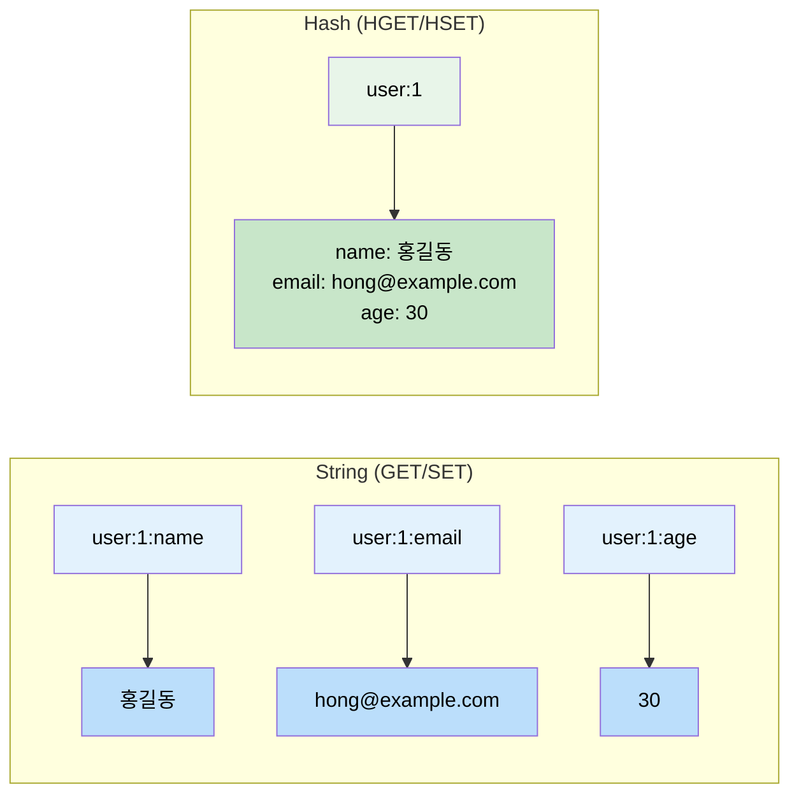
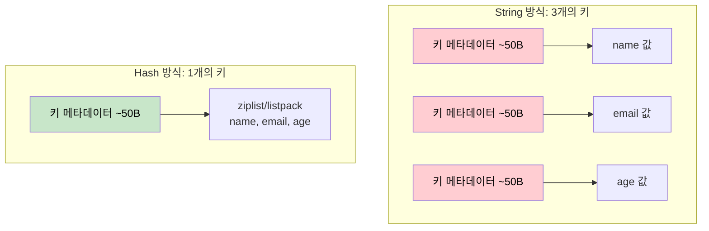
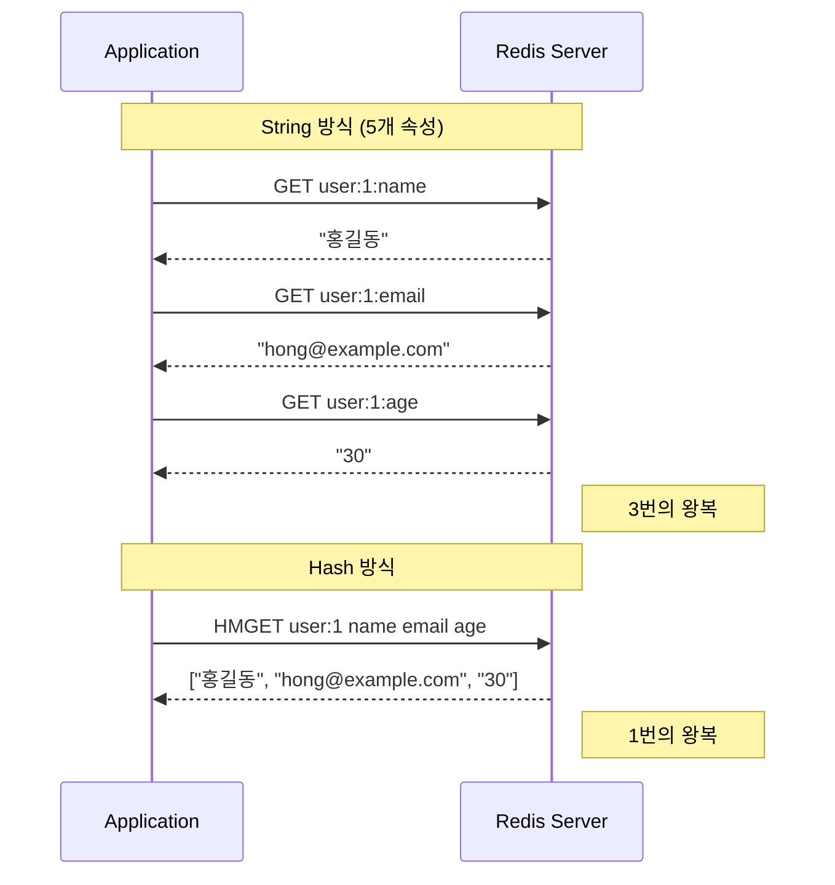
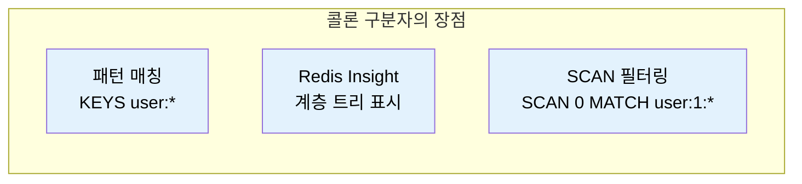
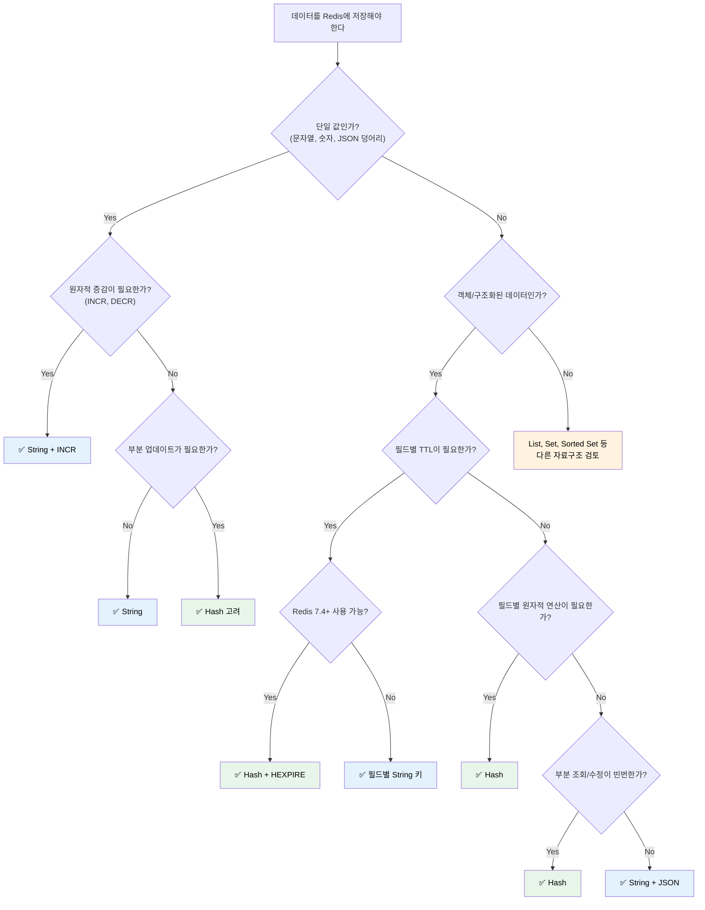

# Redis String vs Hash: 언제 무엇을 써야 하는가

GET/SET과 HGET/HSET, 비슷해 보이지만 완전히 다른 두 자료구조의 본질적 차이와 실전 선택 기준.

## 결론부터 말하면

**String은 "하나의 키에 하나의 값"** 이고, **Hash는 "하나의 키에 여러 필드-값 쌍"** 이다.



| 구분 | String (GET/SET) | Hash (HGET/HSET) |
|------|------------------|------------------|
| 구조 | 1 Key : 1 Value | 1 Key : N Field-Value |
| 용도 | 단일 값, 캐시, 카운터 | 객체, 구조화된 데이터 |
| 메모리 | 키마다 오버헤드 발생 | 필드가 많으면 더 효율적 |
| 부분 조회 | 불가능 (전체 GET) | 가능 (HGET 특정 필드) |
| TTL 설정 | 키 단위 | 키 단위 + **필드 단위 (7.4+)** |

---

## 1. 왜 두 가지 자료구조가 필요한가?

### 1.1 만약 String만 있다면?

사용자 정보를 저장한다고 생각해보자.

```redis
SET user:1:name "홍길동"
SET user:1:email "hong@example.com"
SET user:1:age "30"
SET user:1:created_at "2024-01-15"
SET user:1:last_login "2024-01-20"
```

**5개의 속성을 저장하는데 5개의 키가 필요하다.** 사용자가 100만 명이면? 500만 개의 키가 생긴다.

### 1.2 여기서 문제가 발생한다

```redis
# 사용자 정보 전체를 가져오려면?
GET user:1:name
GET user:1:email
GET user:1:age
GET user:1:created_at
GET user:1:last_login
```

**5번의 네트워크 왕복(Round Trip)** 이 필요하다. 물론 MGET으로 한 번에 가져올 수 있지만, 키 이름을 모두 알고 있어야 한다. 새 속성이 추가되면? 코드를 수정해야 한다.

### 1.3 그래서 Hash가 등장했다

```redis
HSET user:1 name "홍길동" email "hong@example.com" age "30"

# 전체 조회
HGETALL user:1

# 특정 필드만 조회
HGET user:1 name
HMGET user:1 name email
```

**하나의 키 안에 관련된 데이터를 묶을 수 있다.** 이것이 Hash의 존재 이유다.

---

## 2. 내부 구조의 근본적 차이

### 2.1 메모리 관점에서 보면

Redis의 모든 키는 **메타데이터 오버헤드** 를 가진다. 키 하나당 약 50~70바이트의 추가 메모리가 소비된다.



**String 3개: 150B 오버헤드 + 실제 데이터**
**Hash 1개: 50B 오버헤드 + 실제 데이터**

필드가 많아질수록 Hash가 메모리 효율적이다.

### 2.2 Hash의 내부 인코딩

Redis Hash는 필드 수와 크기에 따라 두 가지 인코딩을 사용한다.

| 조건 | 인코딩 | 특징 |
|------|--------|------|
| 필드 ≤ 512개 AND 모든 값 ≤ 64B | **listpack** (Redis 7.0+, 구 ziplist) | 메모리 효율 극대화, $O(n)$ 조회 |
| 그 외 | **hashtable** | $O(1)$ 조회, 메모리 오버헤드 증가 |

> **주의**: 두 조건 중 **어느 하나라도 초과**하면 hashtable로 전환되고, 한 번 전환된 hash는 다시 listpack으로 자동 복귀하지 않는다. 이전 상태로 돌아가려면 키를 새로 만들어야 한다. 임계값은 `hash-max-listpack-entries`(기본 512)와 `hash-max-listpack-value`(기본 64)로 조정할 수 있다.

```redis
# 현재 인코딩 확인
OBJECT ENCODING user:1
# "listpack" 또는 "hashtable"
```

**왜 이런 설계를 했을까?** 작은 해시는 해시테이블 오버헤드가 오히려 낭비다. 선형 탐색 $O(n)$이라도 n이 작으면 충분히 빠르다. Redis는 이런 트레이드오프를 자동으로 관리한다.

#### 인코딩 튜닝 (메모리 최적화)

`listpack`에서 `hashtable`로 전환되는 순간 **메모리 오버헤드가 급증** 한다. 대규모 데이터를 다룬다면 설정값을 조정하여 `listpack`을 최대한 유지하는 것이 핵심 전략이다.

```redis
# redis.conf 또는 CONFIG SET
hash-max-listpack-entries 512   # 기본값: 필드 512개까지 listpack
hash-max-listpack-value 64      # 기본값: 값 64바이트까지 listpack
```

| 설정 | 기본값 | 설명 |
|------|--------|------|
| `hash-max-listpack-entries` | 512 | 이 개수 이하면 listpack 유지 |
| `hash-max-listpack-value` | 64 | 값이 이 바이트 이하면 listpack 유지 |

> **Tip**: 필드가 많지만 값이 작은 경우 `hash-max-listpack-entries`를 늘리고, 값이 큰 경우 `hash-max-listpack-value`를 늘려서 메모리를 절약할 수 있다.

---

## 3. 실전 사용 시나리오

### 3.1 String이 적합한 경우

#### 단순 캐시

```redis
# 페이지 캐시
SET page:/products/123 "<html>...</html>" EX 3600

# API 응답 캐시
SET api:weather:seoul '{"temp": 15, "humidity": 60}' EX 300
```

**전체를 한 번에 읽고, 한 번에 갱신하는 데이터.** 부분 업데이트가 필요 없다.

#### 카운터

```redis
SET counter:pageview:2024-01-15 0
INCR counter:pageview:2024-01-15
# 1
INCRBY counter:pageview:2024-01-15 10
# 11
```

**원자적 증가/감소** 가 필요한 경우. INCR, DECR, INCRBY 명령어 활용.

#### 분산 락

```redis
SET lock:order:12345 "worker-1" NX EX 30
# OK (락 획득 성공)
# nil (이미 다른 곳에서 락 보유)
```

**NX(Not eXists) 옵션** 으로 원자적 락 구현.

#### 세션 ID 매핑

```redis
SET session:abc123 "user:1" EX 1800
```

**단순 매핑 관계.** 세션 ID로 사용자 ID만 찾으면 되는 경우.

### 3.2 Hash가 적합한 경우

#### 사용자/엔티티 정보

```redis
HSET user:1
    name "홍길동"
    email "hong@example.com"
    age "30"
    role "admin"
    created_at "2024-01-15"

# 특정 필드만 조회
HGET user:1 email

# 여러 필드 한 번에 조회
HMGET user:1 name email role
```

**객체 형태의 데이터.** 속성이 여러 개이고, 부분 조회/수정이 필요한 경우.

#### 사용자 설정

```redis
HSET settings:user:1
    theme "dark"
    language "ko"
    notifications "true"
    timezone "Asia/Seoul"

# 테마만 변경
HSET settings:user:1 theme "light"
```

**일부 속성만 변경해도 전체를 다시 쓸 필요가 없다.**

#### 쇼핑 카트

```redis
HSET cart:user:1
    product:123 "2"
    product:456 "1"
    product:789 "3"

# 수량 증가
HINCRBY cart:user:1 product:123 1

# 상품 제거
HDEL cart:user:1 product:456

# 전체 카트 조회
HGETALL cart:user:1
```

**상품별로 독립적인 수량 관리.** 필드별 HINCRBY로 원자적 수량 변경.

#### 실시간 대시보드 메트릭

```redis
HSET metrics:2024-01-15
    requests "15234"
    errors "23"
    avg_response_ms "45"
    active_users "1532"

# 요청 수 증가
HINCRBY metrics:2024-01-15 requests 1
```

**관련 메트릭을 하나의 키로 묶어서 관리.**

---

## 4. 성능 비교

### 4.1 네트워크 왕복 (Round Trip)



### 4.2 벤치마크 시나리오

| 시나리오 | String | Hash | 승자 |
|----------|--------|------|------|
| 단일 값 읽기 | GET | HGET | **비슷** |
| 객체 전체 읽기 (5필드) | MGET 1회 (5개 키) | HGETALL | **비슷** (둘 다 1회 왕복) |
| 단일 필드 수정 | SET | HSET | **비슷** |
| 객체 전체 쓰기 | MSET 1회 (5개 키) | HSET | **비슷** (둘 다 1회 왕복) |
| TTL 개별 설정 | 가능 | **가능 (7.4+)** | **비슷** * |
| 메모리 (100만 객체) | 높음 | **낮음** | **Hash** |

> **주의**: `MGET`/`MSET`은 한 번의 명령으로 여러 키를 처리하므로 네트워크 왕복은 1회다. 다만 Redis Cluster 환경에서는 키들이 **같은 hash slot**에 있어야 제약 없이 쓸 수 있다 (`{user:1}:name`, `{user:1}:email`처럼 hash tag 활용). Hash가 항상 빠른 게 아니라, **메모리 효율과 의미적 응집력**이 결정적인 차이다.

> \* Redis 7.4 미만에서는 Hash 필드별 TTL 불가. 7.4+에서는 HEXPIRE로 가능.

---

## 5. 키 네이밍 베스트 프랙티스

### 5.1 콜론(:)으로 계층 구분

Redis는 네임스페이스를 공식 지원하지 않는다. 하지만 **콜론(:)을 구분자로 사용하는 것이 사실상 표준** 이다.

```redis
# 패턴: <entity>:<id>:<attribute>
user:1:profile
user:1:settings

# 패턴: <service>:<entity>:<id>
order-service:order:12345
auth-service:session:abc123

# 패턴: <environment>:<entity>:<id>
prod:user:1
dev:user:1
```

### 5.2 왜 콜론인가?



1. **패턴 매칭 가능**
   ```redis
   KEYS user:*          # 모든 사용자 키
   KEYS user:1:*        # user:1의 모든 관련 키
   SCAN 0 MATCH cart:*  # 모든 카트 키 순회
   ```

2. **Redis GUI 도구 지원**: Redis Insight 등에서 트리 구조로 표시

3. **논리적 그룹화**: 키 이름만 봐도 구조 파악 가능

### 5.3 네이밍 컨벤션 권장안

| 요소 | 권장 | 비권장 | 이유 |
|------|------|--------|------|
| 구분자 | `:` | `.`, `-`, `_` | 업계 표준, 도구 지원 |
| 대소문자 | 소문자 | 대문자 혼용 | 일관성, 실수 방지 |
| ID 위치 | 중간 | 맨 앞/뒤 | 패턴 매칭 용이 |
| 길이 | 적절히 | 너무 길게 | 메모리 효율 |

```redis
# ✅ Good
user:12345:profile
order:67890:items
cache:api:weather:seoul

# ❌ Bad
User_12345_Profile          # 언더스코어, 대문자
12345:user:profile          # ID가 맨 앞
u:12345:p                   # 너무 축약
user-profile-settings-12345 # 하이픈, 구조 불명확
```

### 5.4 실전 네이밍 패턴

```redis
# 사용자 도메인
user:{id}                    # Hash: 사용자 기본 정보
user:{id}:settings           # Hash: 사용자 설정
user:{id}:notifications      # List: 알림 목록

# 인증 도메인
auth:session:{session_id}    # String: 세션 데이터
auth:refresh:{user_id}       # String: 리프레시 토큰
auth:failed:{ip}             # String: 로그인 실패 횟수

# 캐시 도메인
cache:api:{endpoint}:{params_hash}  # String: API 응답 캐시
cache:db:user:{id}                  # Hash: DB 쿼리 캐시

# 분산 락
lock:order:{order_id}        # String: 주문 처리 락
lock:inventory:{product_id}  # String: 재고 차감 락

# 메트릭/통계
metrics:{date}               # Hash: 일별 메트릭
counter:pageview:{date}      # String: 페이지뷰 카운터
```

---

## 6. 흔한 실수와 해결책

### 6.1 Hash 필드별 TTL 설정

#### Redis 7.4 미만: 일반 EXPIRE로는 불가능

```redis
# ❌ 이건 불가능하다 (EXPIRE는 키 단위)
HSET user:1 temp_token "abc123"
EXPIRE user:1:temp_token 300  # 필드에는 EXPIRE 불가!
```

**해결책 (7.4 미만)**: 별도 String 키로 분리하거나, 애플리케이션에서 만료 처리

```redis
# 방법 1: 별도 키로 분리
SET user:1:temp_token "abc123" EX 300

# 방법 2: 만료 시간을 값에 포함
HSET user:1 temp_token '{"value":"abc123","expires":1705312800}'
```

#### Redis 7.4+: HEXPIRE로 필드별 TTL 가능

**Redis 7.4(2024년)부터** Hash 필드 단위 만료 시간 설정이 가능해졌다.

```redis
# 필드별 TTL 설정 (초 단위)
HEXPIRE user:1 300 FIELDS 1 temp_token

# 필드별 TTL 설정 (밀리초 단위)
HPEXPIRE user:1 300000 FIELDS 1 temp_token

# 특정 Unix timestamp에 만료
HEXPIREAT user:1 1735689600 FIELDS 1 temp_token

# 필드 TTL 확인
HTTL user:1 FIELDS 1 temp_token
# 1) (integer) 287
```

| 명령어 | 설명 |
|--------|------|
| HEXPIRE | 필드에 초 단위 TTL 설정 |
| HPEXPIRE | 필드에 밀리초 단위 TTL 설정 |
| HEXPIREAT | 필드에 Unix timestamp로 만료 시점 설정 |
| HTTL | 필드의 남은 TTL 조회 (초) |
| HPTTL | 필드의 남은 TTL 조회 (밀리초) |
| HPERSIST | 필드의 TTL 제거 (영구 보관) |

### 6.2 너무 큰 Hash 만들기

```redis
# ❌ 수백만 개의 필드를 하나의 Hash에
HSET huge:hash field:1 "value" field:2 "value" ... field:1000000 "value"
```

**문제**: HGETALL 실행 시 블로킹, 메모리 급증

**해결책 1**: HSCAN으로 점진적 순회

```redis
# 커서 기반으로 100개씩 순회 (서버 블로킹 없음)
HSCAN huge:hash 0 COUNT 100
# 1) "13249"                    <- 다음 커서
# 2) 1) "field:1"
#    2) "value"
#    ...

HSCAN huge:hash 13249 COUNT 100
# 커서가 0이 될 때까지 반복
```

**HSCAN vs HGETALL**

| 명령어 | 동작 방식 | 대형 Hash에서 |
|--------|----------|---------------|
| HGETALL | 전체를 한 번에 반환 | **서버 블로킹 위험** |
| HSCAN | 커서 기반 점진적 순회 | **안전함** |

**해결책 2**: 샤딩으로 구조 재설계

```redis
# 10,000개씩 분리
HSET user:shard:0 field:0 "value" ... field:9999 "value"
HSET user:shard:1 field:10000 "value" ... field:19999 "value"
```

### 6.3 JSON을 String에 저장 vs Hash 분리

```redis
# String에 JSON 저장
SET user:1 '{"name":"홍길동","email":"hong@example.com","age":30}'

# Hash로 분리 저장
HSET user:1 name "홍길동" email "hong@example.com" age "30"
```

| 상황 | 권장 방식 |
|------|----------|
| 항상 전체를 읽고 쓴다 | String + JSON |
| 부분 필드만 자주 접근한다 | Hash |
| 중첩 구조가 깊다 (nested objects) | String + JSON (또는 RedisJSON) |
| 필드별 원자적 연산 필요 (HINCRBY) | Hash |

---

## 7. 의사결정 플로우차트



---

## 8. 정리

### String (GET/SET)을 선택하라

- 단일 값 저장 (캐시, 카운터, 락)
- 전체를 한 번에 읽고 쓰는 데이터
- 키별로 다른 TTL이 필요한 경우
- JSON 덩어리를 그대로 저장/조회할 때

### Hash (HGET/HSET)를 선택하라

- 객체/엔티티 데이터 (사용자, 상품, 주문)
- 부분 필드 조회/수정이 빈번한 경우
- 필드별 원자적 증감이 필요한 경우 (HINCRBY)
- 메모리 효율이 중요한 대규모 데이터

### 키 네이밍은

- **콜론(:)으로 계층 구분** 이 업계 표준
- **소문자, 일관된 패턴** 유지
- **`<entity>:<id>:<attribute>`** 형태 권장

---

## 출처

- [Redis Strings](https://redis.io/docs/latest/develop/data-types/strings/) - 공식 문서
- [Redis Hashes](https://redis.io/docs/latest/develop/data-types/hashes/) - 공식 문서
- [Redis Keyspace](https://redis.io/docs/latest/develop/using-commands/keyspace/) - 키 네이밍 가이드
