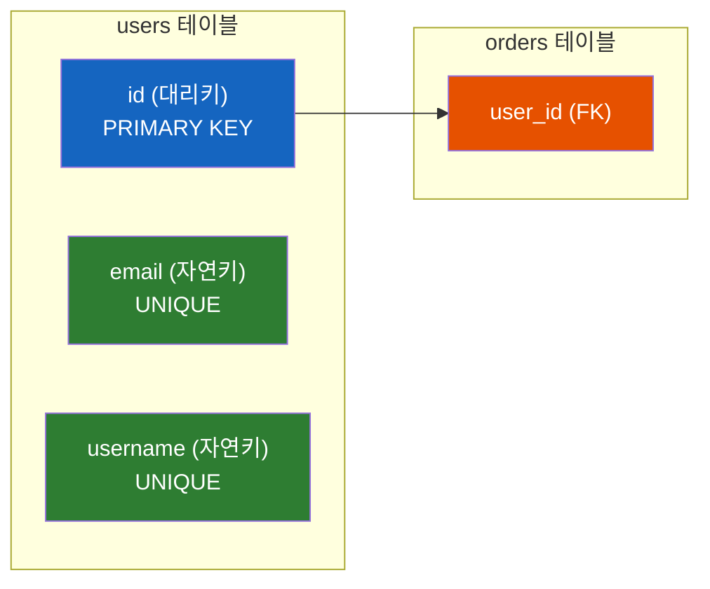
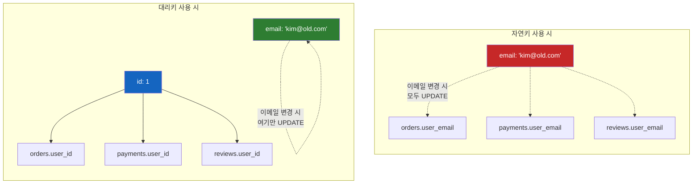
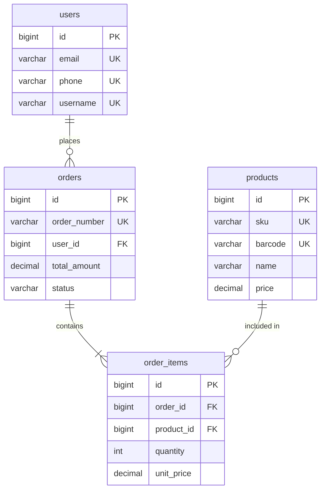
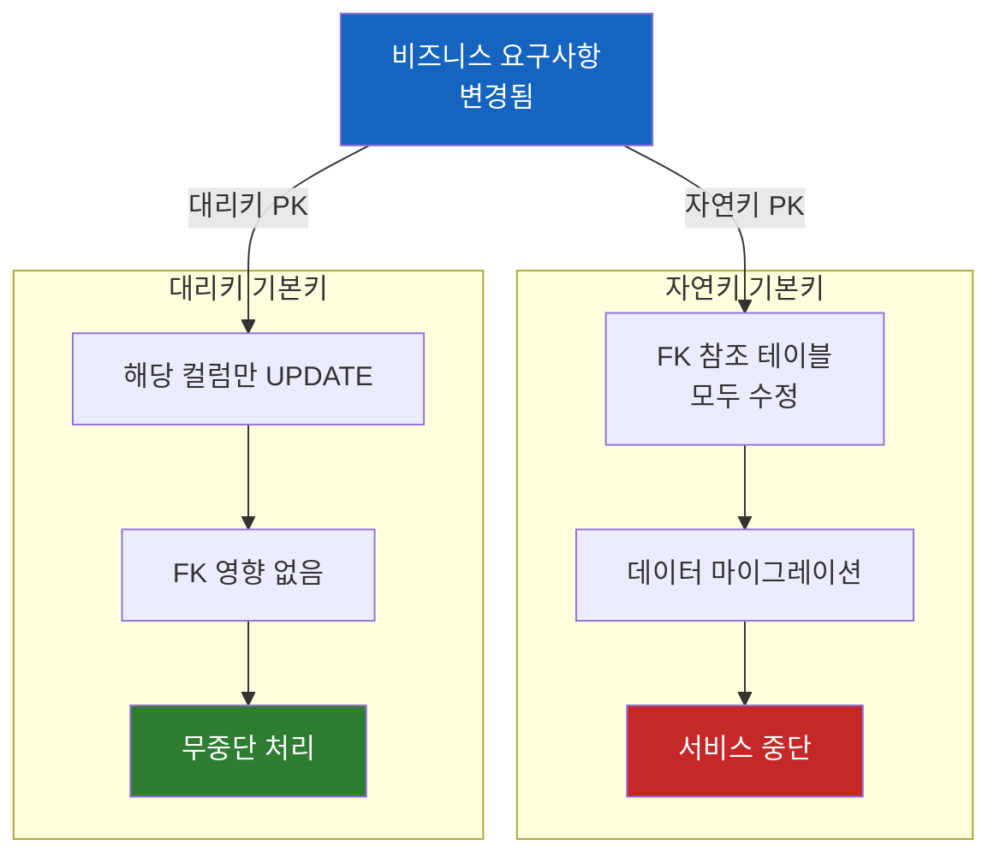

# 대리키 vs 자연키 - 기본키 설계 전략

주민등록번호를 기본키로 썼는데, 외국인 직원이 입사했다. 어떻게 해야 할까?

## 결론부터 말하면

**실무에서는 대리키(Surrogate Key)를 기본키로, 자연키(Natural Key)는 유니크 제약조건으로** 설정하라. 이것이 가장 안전하고 유연한 설계다.

```sql
-- 권장 패턴
CREATE TABLE users (
    id          BIGINT AUTO_INCREMENT PRIMARY KEY,  -- 대리키: 기본키
    email       VARCHAR(255) NOT NULL UNIQUE,       -- 자연키: 유니크 제약
    username    VARCHAR(50) NOT NULL UNIQUE,        -- 자연키: 유니크 제약
    created_at  TIMESTAMP DEFAULT CURRENT_TIMESTAMP
);
```

| 구분 | 역할 | 예시 |
|------|------|------|
| **기본키 (PK)** | 테이블 내 행 식별, FK 참조 대상 | `id` (대리키) |
| **유니크 제약 (UK)** | 비즈니스 무결성 보장 | `email`, `username` (자연키) |



---

## 1. 왜 자연키를 기본키로 쓰면 안 될까?

### 1.1 자연키란?

**자연키(Natural Key)** 는 비즈니스에서 이미 의미를 가진 값이다. 주민등록번호, 이메일, ISBN, 전화번호 등 실제 세계에서 고유한 식별자로 사용되는 값들이다.

```sql
-- 자연키를 기본키로 사용한 예
CREATE TABLE employees (
    ssn         VARCHAR(13) PRIMARY KEY,  -- 주민등록번호
    name        VARCHAR(100),
    department  VARCHAR(50)
);
```

얼핏 보면 합리적으로 보인다. 주민등록번호는 어차피 고유하니까. 그런데 여기서 문제가 시작된다.

### 1.2 "절대 안 변해"라는 가정은 틀린다

**비즈니스 요구사항은 반드시 변한다.** 경험 많은 개발자들이 입을 모아 하는 말이다.

```
처음: "주민등록번호는 절대 안 변해요"
1년 후: "외국인 직원도 채용하기로 했어요"
2년 후: "개인정보보호법 때문에 주민번호 수집이 안 돼요"
```

이런 상황에서 주민등록번호가 기본키라면? 관련된 모든 테이블의 외래키를 수정해야 한다. 데이터 마이그레이션 지옥이 시작된다.

### 1.3 실제로 겪는 문제들

| 문제 상황 | 자연키 기본키 | 대리키 기본키 |
|----------|--------------|--------------|
| 이메일 주소 변경 | FK 있는 모든 테이블 업데이트 필요 | `email` 컬럼만 UPDATE |
| 회사 합병으로 사번 체계 변경 | 전체 DB 재설계 | 사번 컬럼만 UPDATE |
| 복합키 필요 (국가+전화번호) | 모든 FK가 복합키로 | 단일 FK 유지 |
| 테스트 데이터 생성 | 유효한 자연키 값 필요 | 아무 숫자나 가능 |

### 1.4 성능 문제까지 따라온다

자연키는 대부분 **문자열**이다. 문자열 비교는 정수 비교보다 느리다.

```sql
-- 자연키: 문자열 JOIN
SELECT o.* FROM orders o
JOIN users u ON o.user_email = u.email;  -- VARCHAR 비교

-- 대리키: 정수 JOIN
SELECT o.* FROM orders o
JOIN users u ON o.user_id = u.id;  -- BIGINT 비교 (더 빠름)
```

| 비교 대상 | 크기 | 비교 속도 |
|----------|------|----------|
| `BIGINT` | 8 bytes | 빠름 (단순 정수 비교) |
| `VARCHAR(255)` | 최대 255 bytes | 느림 (문자열 비교) |
| 복합키 (3개 컬럼) | 가변 | 매우 느림 |

인덱스 크기도 커지고, 조인 성능도 떨어진다. 데이터가 많아질수록 차이는 벌어진다.

---

## 2. 대리키란 무엇인가

### 2.1 대리키의 정의

**대리키(Surrogate Key)** 는 시스템이 자동으로 생성하는, 비즈니스적 의미가 전혀 없는 식별자다.

```sql
-- 대표적인 대리키 생성 방식
id BIGINT AUTO_INCREMENT PRIMARY KEY                      -- MySQL
id BIGINT GENERATED BY DEFAULT AS IDENTITY PRIMARY KEY    -- PostgreSQL 10+ (SQL 표준, 권장)
id BIGSERIAL PRIMARY KEY                                  -- PostgreSQL (legacy, sequence 매크로)
id NUMBER GENERATED AS IDENTITY PRIMARY KEY               -- Oracle 12c+
id BIGINT IDENTITY(1,1) PRIMARY KEY                       -- SQL Server (권장)
id UNIQUEIDENTIFIER DEFAULT NEWSEQUENTIALID() PRIMARY KEY -- SQL Server (UUID, 시간순)
```

> **DBMS별 주의점:**
> - **PostgreSQL**: `BIGSERIAL`은 SQL 표준이 아니라 **sequence + DEFAULT nextval()로 구성된 매크로**다. 시퀀스 객체가 별도로 노출되어 권한 관리나 명시적 sequence 관리에서 주의가 필요하다 (참고: SERIAL이 만든 sequence는 컬럼에 `OWNED BY`로 연결되어 컬럼/테이블 삭제 시 함께 삭제된다 — 이 부분은 문제 없음). **10+에서는 SQL 표준인 `GENERATED ... AS IDENTITY`가 공식 권장**된다.
> - **SQL Server**: `UNIQUEIDENTIFIER DEFAULT NEWID()`는 **무작위 UUID라 클러스터드 인덱스의 페이지 분할(page split)을 유발**해 INSERT 성능과 인덱스 단편화 측면에서 좋지 않다. 일반적으로는 `IDENTITY` 컬럼을 쓰거나, UUID가 꼭 필요하면 시간순으로 증가하는 `NEWSEQUENTIALID()`를 쓴다.
> - **클러스터드 PK 환경에서는 더더욱 중요**: **MySQL InnoDB는 PK가 곧 클러스터드 인덱스**로 고정이고, **SQL Server는 PK가 기본적으로 클러스터드 인덱스지만 `PRIMARY KEY NONCLUSTERED`로 명시하거나 별도 컬럼에 클러스터드 인덱스를 둘 수도 있다.** 클러스터드 PK가 적용된 환경에서는 PK가 무작위 값이면 매 INSERT가 임의 위치에 끼어들어 페이지 분할이 빈번해진다. UUIDv4 대신 시간순 정렬되는 **UUIDv7, ULID, NEWSEQUENTIALID()** 같은 monotonic ID를 고르는 게 결정적인 이유다.
> - **PostgreSQL/Oracle 같은 heap table은 다르다**: PK는 그냥 별도의 unique B-tree index일 뿐이고 행 자체는 heap에 무순으로 저장된다. PostgreSQL의 `CLUSTER` 명령도 한 번 물리 재정렬을 수행할 뿐 이후 INSERT/UPDATE를 자동 정렬해주지는 않는다. 그래서 이 DB들에서는 페이지 분할보다 **PK 인덱스 자체의 단편화**(B-tree leaf 분포) 관점에서 PK 선택을 평가해야 한다.

대리키는 오직 하나의 목적만 있다: **행을 고유하게 식별하는 것.**

### 2.2 대리키의 장점

| 장점 | 설명 |
|------|------|
| **불변성** | 한 번 할당되면 절대 변하지 않음 |
| **단순성** | 단일 컬럼, 고정 크기 |
| **독립성** | 비즈니스 로직 변경에 영향받지 않음 |
| **성능** | 정수 비교는 문자열보다 빠름 |
| **범용성** | 어떤 테이블에도 동일한 패턴 적용 가능 |

### 2.3 대리키 vs 자연키 비교



---

## 3. 자연키는 유니크 제약조건으로

### 3.1 핵심 원칙

대리키를 기본키로 쓴다고 해서 자연키를 버리는 게 아니다. **자연키는 유니크 제약조건으로 보호한다.**

```sql
CREATE TABLE products (
    id          BIGINT AUTO_INCREMENT PRIMARY KEY,
    sku         VARCHAR(50) NOT NULL UNIQUE,   -- 상품 고유 코드
    barcode     VARCHAR(20) UNIQUE,            -- 바코드 (nullable)
    name        VARCHAR(255) NOT NULL
);
```

이렇게 하면:
- `id`: 기술적 식별자 (조인, FK 참조용)
- `sku`: 비즈니스 식별자 (중복 방지, 검색용)

### 3.2 복합 유니크 제약조건

비즈니스 규칙이 복합적일 때도 대리키 + 유니크 제약 패턴이 유효하다.

```sql
-- 한 사용자는 같은 상품에 하루에 한 번만 리뷰 가능
CREATE TABLE reviews (
    id          BIGINT AUTO_INCREMENT PRIMARY KEY,
    user_id     BIGINT NOT NULL,
    product_id  BIGINT NOT NULL,
    review_date DATE NOT NULL,
    content     TEXT,

    UNIQUE (user_id, product_id, review_date),  -- 복합 유니크
    FOREIGN KEY (user_id) REFERENCES users(id),
    FOREIGN KEY (product_id) REFERENCES products(id)
);
```

복합키를 기본키로 쓸 필요가 없다. 복합 유니크 제약으로 비즈니스 규칙을 지키고, 기본키는 단순한 대리키를 사용한다.

### 3.3 왜 이 방식이 좋은가

| 관점 | 이점 |
|------|------|
| **데이터 무결성** | 유니크 제약이 비즈니스 중복 방지 |
| **조인 성능** | 대리키로 빠른 조인 |
| **유연성** | 자연키 변경 시 해당 컬럼만 수정 |
| **확장성** | 새로운 비즈니스 식별자 추가 용이 |

---

## 4. 실무 설계 가이드라인

### 4.1 기본 템플릿

```sql
CREATE TABLE {table_name} (
    -- 1. 대리키 (항상 첫 번째)
    id BIGINT AUTO_INCREMENT PRIMARY KEY,

    -- 2. 자연키들 (유니크 제약)
    {natural_key_1} ... NOT NULL UNIQUE,
    {natural_key_2} ... UNIQUE,

    -- 3. 일반 컬럼들
    {column_1} ...,
    {column_2} ...,

    -- 4. 외래키 (대리키 참조)
    {parent}_id BIGINT,
    FOREIGN KEY ({parent}_id) REFERENCES {parent}(id),

    -- 5. 타임스탬프
    created_at TIMESTAMP DEFAULT CURRENT_TIMESTAMP,
    updated_at TIMESTAMP DEFAULT CURRENT_TIMESTAMP ON UPDATE CURRENT_TIMESTAMP
);
```

### 4.2 실무 예시: 이커머스 도메인

```sql
-- 사용자
CREATE TABLE users (
    id          BIGINT AUTO_INCREMENT PRIMARY KEY,
    email       VARCHAR(255) NOT NULL UNIQUE,
    phone       VARCHAR(20) UNIQUE,
    username    VARCHAR(50) NOT NULL UNIQUE,
    created_at  TIMESTAMP DEFAULT CURRENT_TIMESTAMP
);

-- 상품
CREATE TABLE products (
    id          BIGINT AUTO_INCREMENT PRIMARY KEY,
    sku         VARCHAR(50) NOT NULL UNIQUE,
    barcode     VARCHAR(20) UNIQUE,
    name        VARCHAR(255) NOT NULL,
    price       DECIMAL(10, 2) NOT NULL,
    created_at  TIMESTAMP DEFAULT CURRENT_TIMESTAMP
);

-- 주문
CREATE TABLE orders (
    id              BIGINT AUTO_INCREMENT PRIMARY KEY,
    order_number    VARCHAR(50) NOT NULL UNIQUE,  -- 주문번호 (비즈니스 식별자)
    user_id         BIGINT NOT NULL,
    total_amount    DECIMAL(10, 2) NOT NULL,
    status          VARCHAR(20) NOT NULL,
    created_at      TIMESTAMP DEFAULT CURRENT_TIMESTAMP,

    FOREIGN KEY (user_id) REFERENCES users(id)
);

-- 주문 상품
CREATE TABLE order_items (
    id          BIGINT AUTO_INCREMENT PRIMARY KEY,
    order_id    BIGINT NOT NULL,
    product_id  BIGINT NOT NULL,
    quantity    INT NOT NULL,
    unit_price  DECIMAL(10, 2) NOT NULL,

    UNIQUE (order_id, product_id),  -- 한 주문에 같은 상품은 한 행
    FOREIGN KEY (order_id) REFERENCES orders(id),
    FOREIGN KEY (product_id) REFERENCES products(id)
);
```

### 4.3 ER 다이어그램



### 4.4 주의사항: 대리키를 사용자에게 노출하지 마라

대리키는 **내부 식별자**다. 사용자에게 노출하면 의도치 않게 비즈니스 의미를 갖게 된다.

```
❌ Bad: "주문번호 12345678"  (대리키 직접 노출)
✅ Good: "주문번호 ORD-2024-ABC123"  (별도의 비즈니스 식별자)
```

왜 문제인가? 사용자가 "주문번호 12345679는 내 것보다 나중이네"라고 인식하기 시작하면, 더 이상 대리키가 아니다. 연속성, 예측 가능성 등의 특성이 비즈니스 요구사항이 되어버린다.

---

## 5. 예외 상황

### 5.1 자연키가 적합한 경우

**모든 규칙에는 예외가 있다.** 다음 조건을 모두 만족하면 자연키를 기본키로 고려할 수 있다:

| 조건 | 설명 |
|------|------|
| 절대 변하지 않음 | 표준 코드, 국제 규격 등 |
| 외부에서 정의 | ISO 국가 코드, 통화 코드 등 |
| 간결함 | 3~4자리 이하의 짧은 코드 |
| FK 참조가 거의 없음 | 조인 성능 이슈 적음 |

```sql
-- 예외적으로 자연키가 적합한 경우
CREATE TABLE countries (
    code    CHAR(2) PRIMARY KEY,  -- ISO 3166-1 alpha-2 (KR, US, JP)
    name    VARCHAR(100) NOT NULL
);

CREATE TABLE currencies (
    code    CHAR(3) PRIMARY KEY,  -- ISO 4217 (KRW, USD, EUR)
    name    VARCHAR(100) NOT NULL,
    symbol  VARCHAR(5)
);
```

### 5.2 데이터 웨어하우스

데이터 웨어하우스에서는 **반드시 대리키를 사용하라.** 소스 시스템의 키 체계가 언제든 변경될 수 있고, 여러 소스를 통합해야 하기 때문이다.

```sql
-- 차원 테이블 (Dimension Table)
CREATE TABLE dim_customer (
    customer_key    BIGINT PRIMARY KEY,  -- 대리키 (웨어하우스 내부)
    customer_id     VARCHAR(50),         -- 소스 시스템 ID
    source_system   VARCHAR(20),         -- 어느 시스템에서 왔는지
    name            VARCHAR(100),
    -- SCD Type 2 컬럼
    effective_date  DATE,
    expiration_date DATE,
    is_current      BOOLEAN
);
```

---

## 6. 정리

### 6.1 핵심 원칙

```
1. 기본키 = 대리키 (AUTO_INCREMENT 또는 UUID)
2. 자연키 = 유니크 제약조건
3. 외래키 = 대리키 참조
4. 대리키를 사용자에게 노출하지 마라
```

### 6.2 설계 체크리스트

- [ ] 모든 테이블에 대리키 기본키가 있는가?
- [ ] 비즈니스 식별자에 유니크 제약이 걸려 있는가?
- [ ] 외래키가 대리키를 참조하는가?
- [ ] 사용자에게 노출하는 식별자가 별도로 있는가?
- [ ] 복합 비즈니스 규칙에 복합 유니크 제약을 사용했는가?

### 6.3 왜 이 패턴인가?



변화는 반드시 온다. 대리키 기본키 + 자연키 유니크 제약 패턴은 그 변화에 대비하는 가장 실용적인 방법이다.

---

## 출처

- [Agile Data - Choosing a Primary Key: Natural or Surrogate?](https://agiledata.org/essays/keys.html)
- [Why Surrogate Keys Win - Liam ERD](https://liambx.com/blog/why-surrogate-keys-win)
- [dbt Labs - A Complete Guide to Surrogate Keys](https://www.getdbt.com/blog/guide-to-surrogate-key)
- [Baeldung - Natural vs. Surrogate Keys](https://www.baeldung.com/sql/keys-natural-vs-surrogate)
- [MSSQLTips - Surrogate Key vs Natural Key Differences](https://www.mssqltips.com/sqlservertip/5431/surrogate-key-vs-natural-key-differences-and-when-to-use-in-sql-server/)
- [Ask TOM - Surrogate versus Natural Keys](https://asktom.oracle.com/ords/f?p=100:11:0::::P11_QUESTION_ID:689240000346704229)
