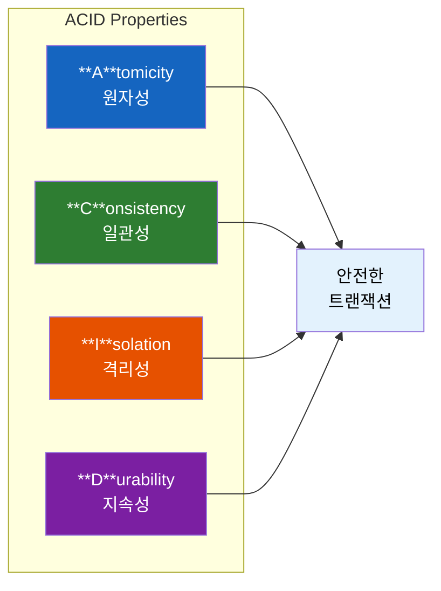
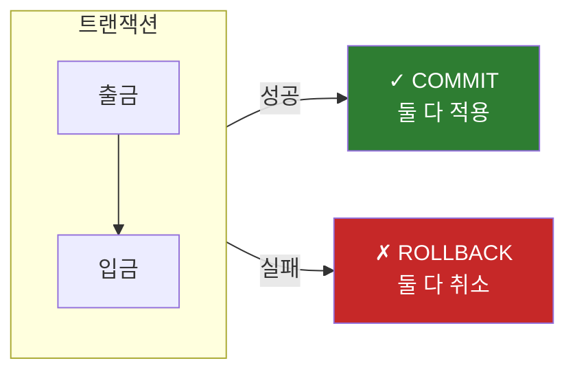
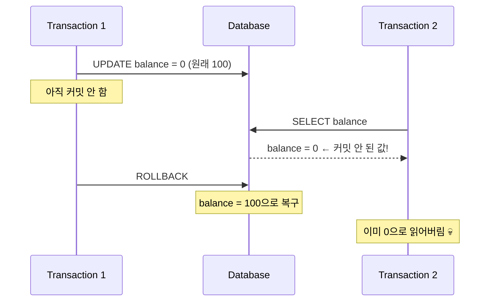
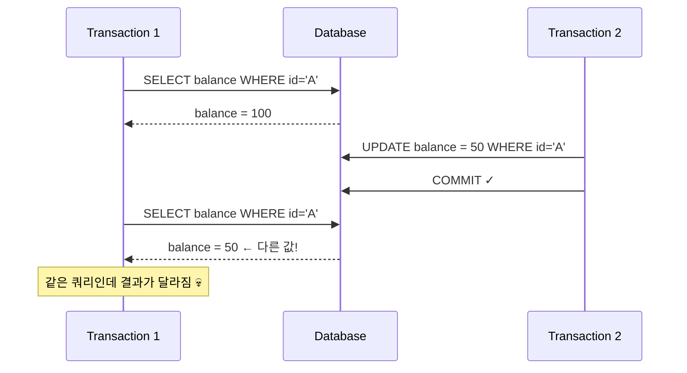
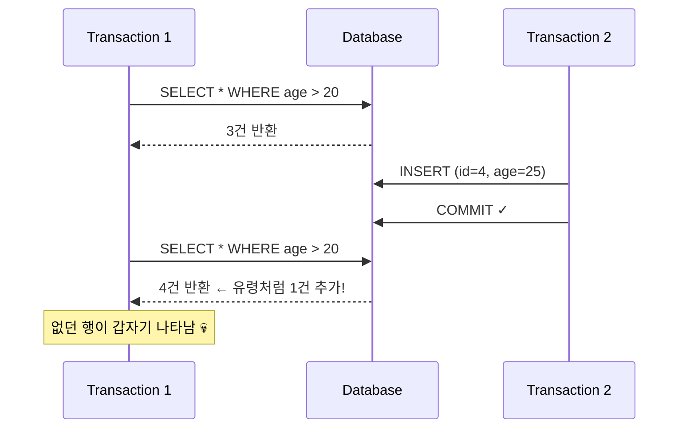
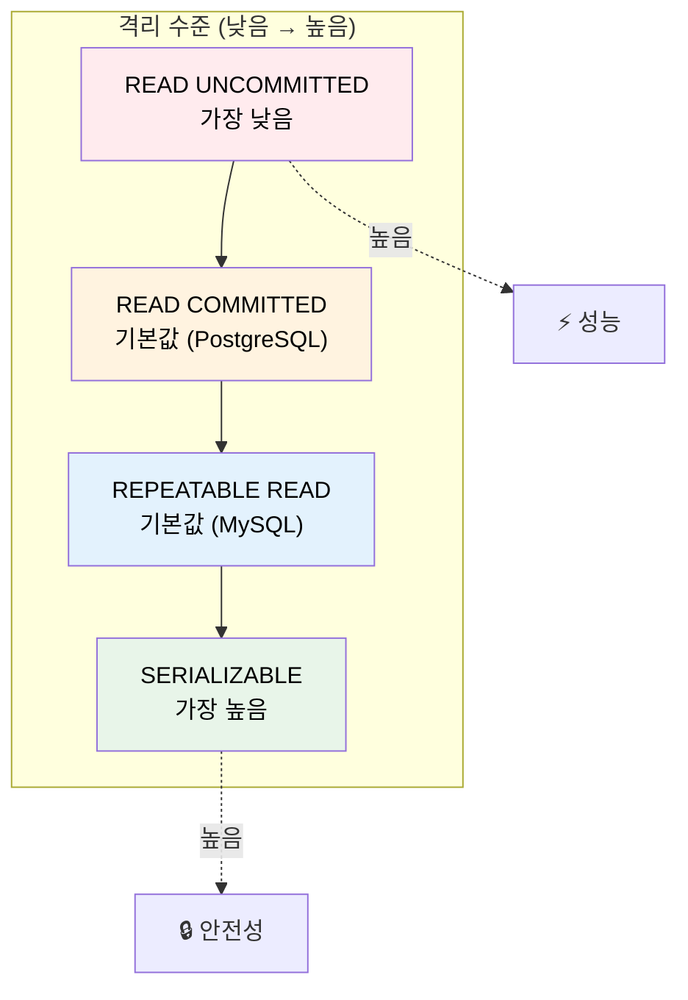
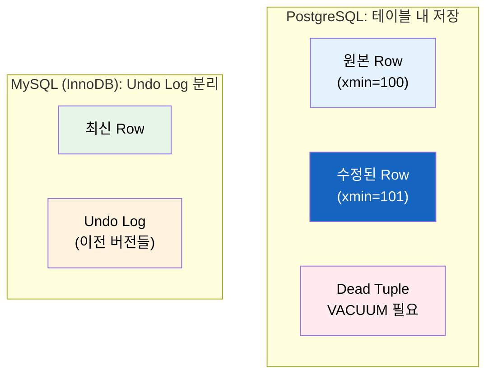

# 데이터베이스 ACID와 트랜잭션 격리 수준

은행에서 A가 B에게 100만 원을 송금하는 중에 서버가 다운되면 어떻게 될까? A 계좌에서는 돈이 빠져나갔는데 B 계좌에는 입금되지 않았다면? 이런 상황을 막기 위해 데이터베이스에는 **ACID** 라는 개념이 존재한다.

## 결론부터 말하면

**ACID는 트랜잭션이 안전하게 수행된다는 것을 보장하기 위한 4가지 속성이다.** 그중 **Isolation(격리성)** 은 동시에 실행되는 트랜잭션들이 서로 간섭하지 않도록 보장한다.



| 속성 | 의미 | 핵심 질문 |
|------|------|----------|
| **Atomicity** | 전부 성공하거나 전부 실패 | "중간에 멈추면?" |
| **Consistency** | 항상 유효한 상태 유지 | "규칙을 어기면?" |
| **Isolation** | 동시 실행해도 간섭 없음 | "동시에 접근하면?" |
| **Durability** | 커밋되면 영원히 유지 | "서버가 죽으면?" |

격리 수준은 **성능과 정합성의 트레이드오프** 다. 높은 격리 수준은 안전하지만 느리고, 낮은 격리 수준은 빠르지만 이상 현상이 발생할 수 있다.

---

## 1. 왜 ACID가 필요한가?

### 1.1 만약 ACID가 없다면?

은행 송금을 생각해보자.

```sql
-- A 계좌에서 100만 원 출금
UPDATE accounts SET balance = balance - 1000000 WHERE id = 'A';
-- B 계좌에 100만 원 입금
UPDATE accounts SET balance = balance + 1000000 WHERE id = 'B';
```

**이 두 쿼리 사이에 서버가 다운되면?**

- A 계좌: -100만 원 (출금 완료)
- B 계좌: +0원 (입금 안 됨)
- 결과: 100만 원이 공중분해

이런 문제를 막기 위해 1983년 Andreas Reuter와 Theo Härder가 **ACID** 라는 개념을 정립했다.

### 1.2 ACID의 네 가지 속성

#### Atomicity (원자성): All or Nothing

트랜잭션은 **쪼갤 수 없는 하나의 작업 단위** 다. 중간에 실패하면 처음으로 되돌린다.



#### Consistency (일관성): 규칙 준수

트랜잭션 전후로 데이터베이스는 항상 **유효한 상태** 를 유지해야 한다.

```sql
-- 잔액은 음수가 될 수 없다 (제약 조건)
ALTER TABLE accounts ADD CONSTRAINT check_balance CHECK (balance >= 0);

-- 이 트랜잭션은 제약 조건을 위반하므로 실패한다
UPDATE accounts SET balance = balance - 1000000 WHERE id = 'A';
-- balance가 50만 원뿐이라면? → 제약 조건 위반 → 롤백
```

#### Durability (지속성): 영원히 기억

커밋된 데이터는 **시스템이 죽어도 살아남는다.** 이를 위해 데이터베이스는 WAL(Write-Ahead Logging) 등의 기법을 사용한다.

#### Isolation (격리성): 서로 간섭하지 않음

**동시에 실행되는 트랜잭션들이 서로의 중간 상태를 보지 못하게 한다.** 이것이 가장 복잡하고 중요한 속성이다.

---

## 2. 격리성(Isolation)을 깊게 파보자

### 2.1 왜 격리성이 복잡한가?

Atomicity, Consistency, Durability는 비교적 명확하다. 하지만 Isolation은 다르다.

**완벽한 격리** 를 구현하면 트랜잭션을 순차적으로 실행해야 한다. 하지만 그러면 성능이 처참해진다. 1초에 1000개의 트랜잭션을 처리해야 하는 시스템에서 순차 실행은 불가능하다.

그래서 데이터베이스는 **격리 수준(Isolation Level)** 이라는 선택지를 제공한다. 개발자가 **"얼마나 엄격하게 격리할 것인가"** 를 선택할 수 있게 해준다.

### 2.2 격리가 깨지면 발생하는 이상 현상들

격리가 완벽하지 않으면 세 가지 이상 현상(Read Phenomena)이 발생할 수 있다.

#### Dirty Read: 커밋되지 않은 데이터를 읽음



**문제:** TX2가 읽은 값(0)은 실제로 존재한 적이 없다. TX1이 롤백했기 때문이다.

#### Non-Repeatable Read: 같은 쿼리인데 결과가 다름



**문제:** TX1 입장에서 같은 쿼리를 두 번 실행했는데 결과가 다르다.

#### Phantom Read: 없던 행이 생김



**문제:** 분명히 3건이었는데 갑자기 4건이 됐다. 마치 유령(Phantom)처럼.

### 2.3 Non-Repeatable Read vs Phantom Read 차이

둘 다 "같은 쿼리인데 결과가 다르다"는 점에서 비슷해 보인다. 하지만 핵심 차이가 있다:

| 구분 | Non-Repeatable Read | Phantom Read |
|------|---------------------|--------------|
| **대상** | 기존 행의 **값이 변경** 됨 | 새로운 **행이 추가/삭제** 됨 |
| **예시** | `balance=100` → `balance=50` | 3건 → 4건 |
| **방지 방법** | Row-level Lock | Range Lock (Gap Lock) |
| **발생 조건** | UPDATE/DELETE | INSERT/DELETE |

---

## 3. 4가지 격리 수준

SQL 표준은 4가지 격리 수준을 정의한다. 아래로 갈수록 엄격하다.



### 3.1 READ UNCOMMITTED: 무법지대

커밋되지 않은 데이터도 읽을 수 있다. **사실상 격리가 없다.**

```sql
SET TRANSACTION ISOLATION LEVEL READ UNCOMMITTED;
```

| Dirty Read | Non-Repeatable Read | Phantom Read |
|:----------:|:-------------------:|:------------:|
| ⚠️ 발생 | ⚠️ 발생 | ⚠️ 발생 |

**언제 쓰나?** 거의 안 쓴다. 대략적인 통계 집계처럼 정확도보다 속도가 중요한 극소수의 경우에만 사용.

### 3.2 READ COMMITTED: 커밋된 것만 읽음

다른 트랜잭션이 **커밋한 데이터만** 읽을 수 있다. PostgreSQL의 기본값.

```sql
SET TRANSACTION ISOLATION LEVEL READ COMMITTED;
```

| Dirty Read | Non-Repeatable Read | Phantom Read |
|:----------:|:-------------------:|:------------:|
| ✅ 방지 | ⚠️ 발생 | ⚠️ 발생 |

**특징:** 쿼리를 실행할 때마다 새로운 스냅샷을 생성한다. 그래서 같은 트랜잭션 내에서 같은 쿼리를 실행해도 결과가 달라질 수 있다.

### 3.3 REPEATABLE READ: 반복 읽기 보장

트랜잭션 **시작 시점의 스냅샷** 을 기준으로 데이터를 읽는다. MySQL(InnoDB)의 기본값.

```sql
SET TRANSACTION ISOLATION LEVEL REPEATABLE READ;
```

| Dirty Read | Non-Repeatable Read | Phantom Read |
|:----------:|:-------------------:|:------------:|
| ✅ 방지 | ✅ 방지 | ⚠️ 발생 (표준) |

**중요:** MySQL과 PostgreSQL은 REPEATABLE READ에서 **Phantom Read도 방지** 한다. SQL 표준보다 더 엄격하게 구현한 것이다.

### 3.4 SERIALIZABLE: 완벽한 격리

트랜잭션을 마치 **순차적으로 실행한 것처럼** 보장한다. 가장 안전하지만 가장 느리다.

```sql
SET TRANSACTION ISOLATION LEVEL SERIALIZABLE;
```

| Dirty Read | Non-Repeatable Read | Phantom Read |
|:----------:|:-------------------:|:------------:|
| ✅ 방지 | ✅ 방지 | ✅ 방지 |

**주의:** 성능 저하가 심하다. 꼭 필요한 경우에만 사용해야 한다.

### 3.5 격리 수준 요약 테이블

| 격리 수준 | Dirty Read | Non-Repeatable Read | Phantom Read | 성능 |
|-----------|:----------:|:-------------------:|:------------:|:----:|
| READ UNCOMMITTED | ⚠️ | ⚠️ | ⚠️ | ⚡⚡⚡⚡ |
| READ COMMITTED | ✅ | ⚠️ | ⚠️ | ⚡⚡⚡ |
| REPEATABLE READ | ✅ | ✅ | ⚠️/✅* | ⚡⚡ |
| SERIALIZABLE | ✅ | ✅ | ✅ | ⚡ |

*MySQL/PostgreSQL은 REPEATABLE READ에서도 Phantom Read를 방지함

---

## 4. MySQL vs PostgreSQL: 구현 방식의 차이

두 데이터베이스 모두 **MVCC(Multi-Version Concurrency Control)** 를 사용하지만, 구현 방식이 다르다.

### 4.1 버전 저장 방식



| 구분 | PostgreSQL | MySQL (InnoDB) |
|------|------------|----------------|
| **버전 저장 위치** | 테이블 내부 | Undo Log (별도 공간) |
| **장점** | 읽기 빠름 (재구성 불필요) | 테이블 깔끔, 자동 정리 |
| **단점** | VACUUM 필요 (Dead Tuple 정리) | 과거 버전 읽을 때 느림 |
| **기본 격리 수준** | READ COMMITTED | REPEATABLE READ |

### 4.2 Serializable 구현 방식

| 구분 | MySQL | PostgreSQL |
|------|-------|------------|
| **방식** | Two-Phase Locking (비관적) | Serializable Snapshot Isolation (낙관적) |
| **비유** | 문 앞에서 미리 차단하는 경비원 | 일단 다 들여보내고 문제 생기면 내보내는 호스트 |
| **충돌 시** | 대기 (Lock) | 롤백 후 재시도 |

---

## 5. 실무에서의 선택 가이드

### 5.1 언제 어떤 격리 수준을 쓸까?

| 상황 | 권장 격리 수준 | 이유 |
|------|----------------|------|
| 일반적인 웹 서비스 | READ COMMITTED | 대부분의 경우 충분, 성능 좋음 |
| 재고 관리, 금융 | REPEATABLE READ | 중복 읽기 방지 필요 |
| 결제, 정산 | SERIALIZABLE | 완벽한 정합성 필요 |
| 통계 집계 (대략적) | READ UNCOMMITTED | 정확도보다 속도 (거의 안 씀) |

### 5.2 격리 수준 확인 및 변경

```sql
-- MySQL: 현재 격리 수준 확인
SELECT @@transaction_isolation;

-- PostgreSQL: 현재 격리 수준 확인
SHOW transaction_isolation;

-- 세션 단위로 변경
SET SESSION TRANSACTION ISOLATION LEVEL REPEATABLE READ;

-- 트랜잭션 단위로 변경
START TRANSACTION ISOLATION LEVEL SERIALIZABLE;
```

---

## 6. 정리

1. **ACID** 는 트랜잭션의 안전성을 보장하는 4가지 속성이다
2. **Isolation(격리성)** 이 가장 복잡하다 — 성능과 정합성의 트레이드오프
3. 격리가 깨지면 **Dirty Read**, **Non-Repeatable Read**, **Phantom Read** 가 발생한다
4. SQL 표준은 4가지 격리 수준을 정의한다: READ UNCOMMITTED → READ COMMITTED → REPEATABLE READ → SERIALIZABLE
5. MySQL과 PostgreSQL은 **MVCC** 로 격리를 구현하지만, 방식이 다르다
6. 실무에서는 대부분 **READ COMMITTED** 나 **REPEATABLE READ** 를 사용한다

---

## 출처

- [ACID - Wikipedia](https://en.wikipedia.org/wiki/ACID)
- [Isolation (database systems) - Wikipedia](https://en.wikipedia.org/wiki/Isolation_(database_systems))
- [PostgreSQL Documentation: Transaction Isolation](https://www.postgresql.org/docs/current/transaction-iso.html)
- [MySQL Transaction Isolation Levels - PlanetScale](https://planetscale.com/blog/mysql-isolation-levels-and-how-they-work)
- [MVCC in PostgreSQL - Postgres Professional](https://postgrespro.com/blog/pgsql/5967856)
- [Transaction Isolation Levels - GeeksforGeeks](https://www.geeksforgeeks.org/dbms/transaction-isolation-levels-dbms/)
- [Non-Repeatable Read vs Phantom Read - Stack Overflow](https://stackoverflow.com/questions/11043712/non-repeatable-read-vs-phantom-read)
- [ACID Transactions - Databricks](https://www.databricks.com/glossary/acid-transactions)
