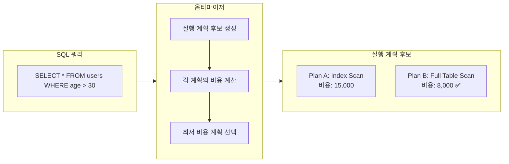
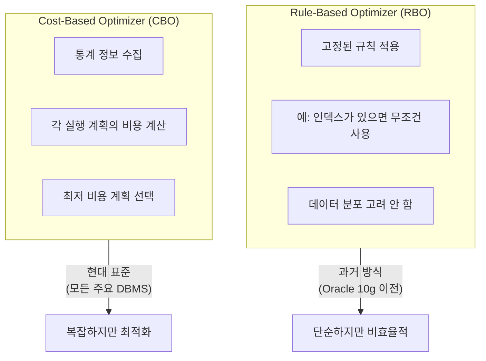
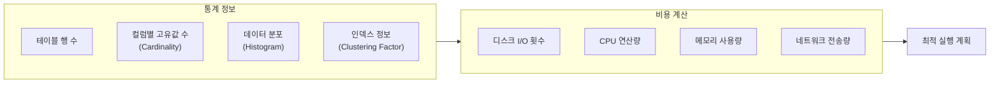
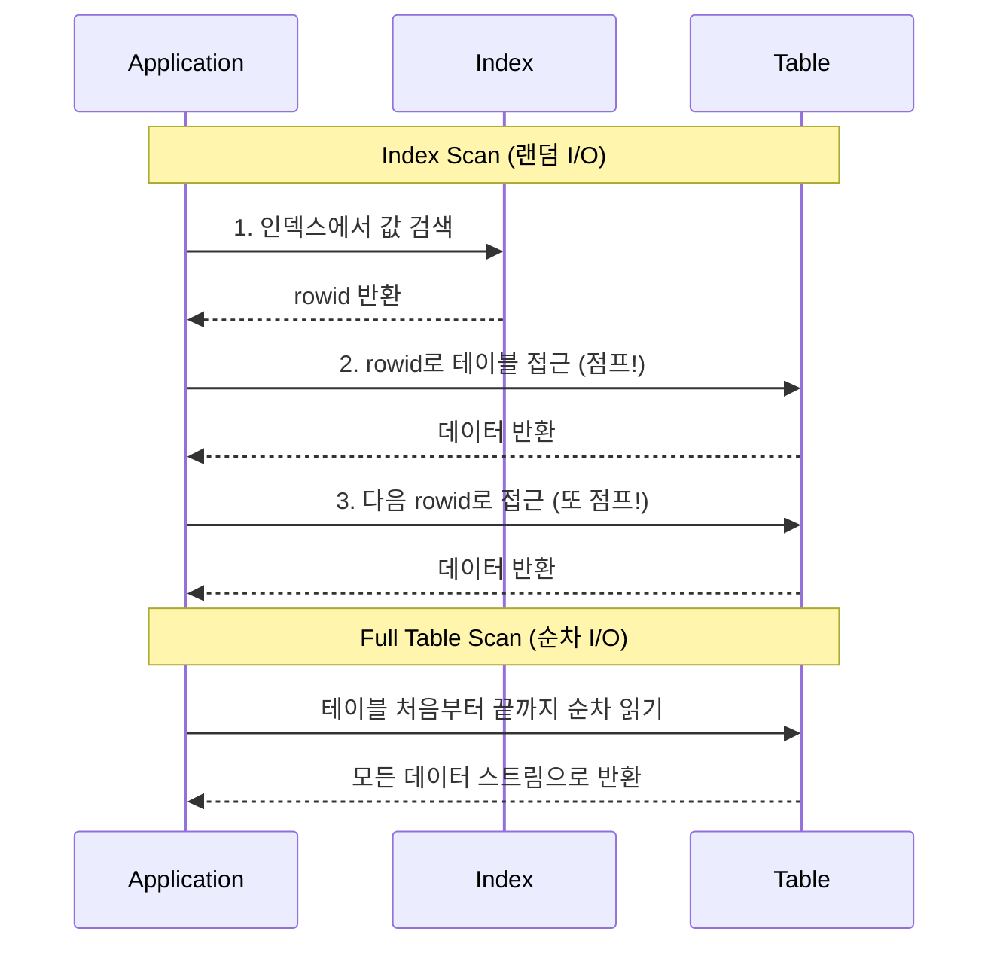
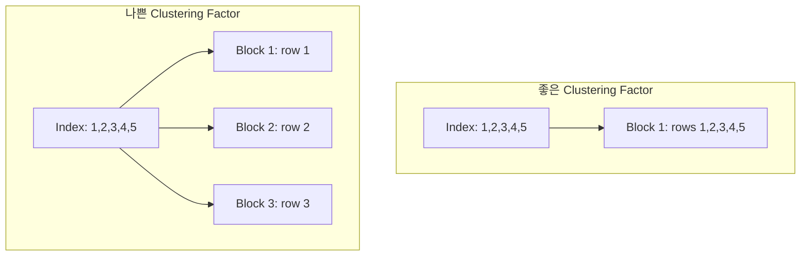
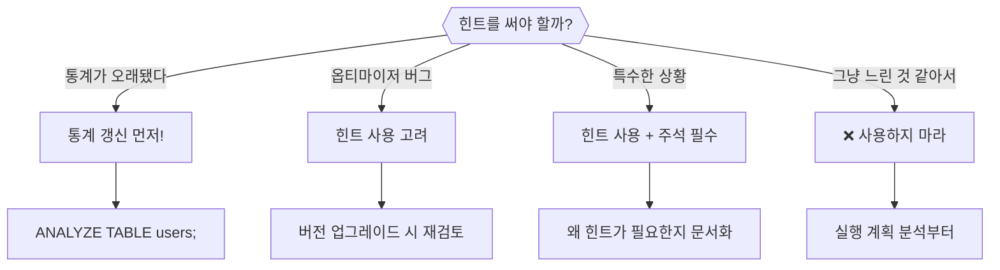
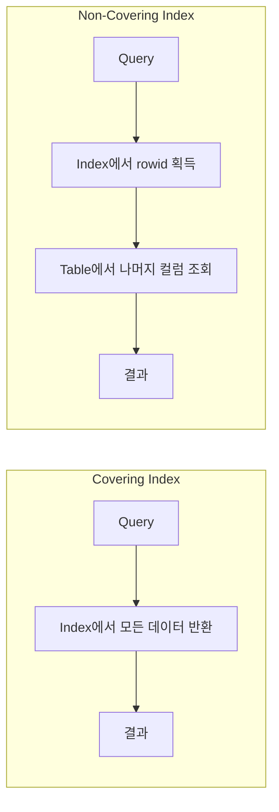
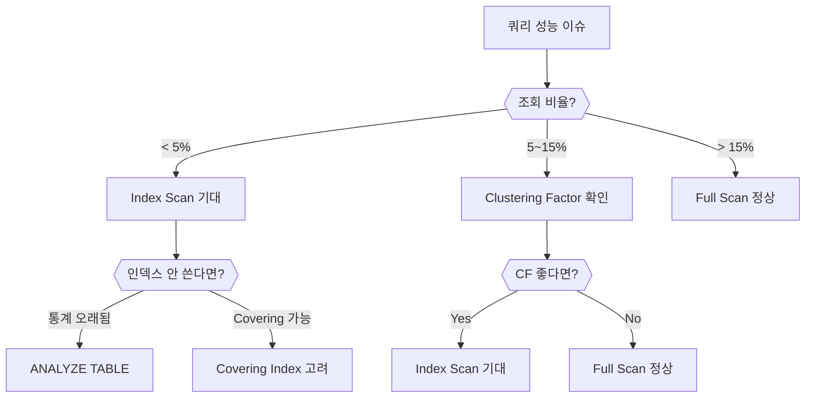

# 데이터베이스 옵티마이저와 인덱스 손익분기점

인덱스를 만들었는데 왜 데이터베이스가 Full Table Scan을 할까?

## 결론부터 말하면

**옵티마이저**(Optimizer)는 쿼리를 가장 효율적으로 실행할 방법을 결정하는 데이터베이스의 두뇌다. 인덱스가 있어도 **손익분기점**을 넘으면 Full Table Scan이 더 빠르다고 판단한다.



| 상황 | 옵티마이저 선택 | 이유 |
|------|----------------|------|
| 전체의 **5% 이하** 조회 | Index Scan | 인덱스가 압도적으로 유리 |
| 전체의 **5~15%** 조회 | **상황에 따라** | 손익분기점 근처 (Clustering Factor 중요) |
| 전체의 **15% 이상** 조회 | Full Table Scan | 테이블 전체 읽기가 더 효율적 |

---

## 1. 옵티마이저란 무엇인가

### 1.1 왜 옵티마이저가 필요한가?

SQL은 **선언적**(declarative) 언어다. "무엇을 원하는지"만 말하고, "어떻게 가져올지"는 말하지 않는다.

```sql
-- "이 조건에 맞는 데이터를 줘" (What)
SELECT * FROM orders WHERE customer_id = 123 AND status = 'shipped';

-- "어떻게 찾을지"는 SQL에 없다 (How)
-- 인덱스를 쓸까? 어떤 인덱스를? 테이블을 통째로 읽을까?
```

이 "어떻게"를 결정하는 것이 **옵티마이저**다. 같은 결과를 내는 수십, 수백 가지 방법 중에서 가장 빠른 방법을 찾아야 한다.

### 1.2 옵티마이저의 종류



| 구분 | Rule-Based (RBO) | Cost-Based (CBO) |
|------|------------------|------------------|
| **결정 방식** | 고정된 규칙 순위 | 비용 추정 및 비교 |
| **통계 활용** | ❌ | ✅ |
| **적응성** | 데이터 변화에 무관 | 데이터 변화에 적응 |
| **현재 상태** | 대부분 폐기 (Oracle 10g~) | 현대 DBMS 표준 |

**핵심:** 현대 데이터베이스는 모두 **Cost-Based Optimizer**를 사용한다. 통계 정보를 바탕으로 각 실행 계획의 비용을 계산하고, 가장 저렴한 계획을 선택한다.

### 1.3 옵티마이저가 고려하는 요소



---

## 2. 인덱스 손익분기점

### 2.1 왜 손익분기점이 존재하는가?

인덱스는 **랜덤 I/O**를 발생시킨다. 인덱스에서 rowid를 찾고, 그 rowid로 테이블의 실제 행을 읽어야 한다.

반면 Full Table Scan은 **순차 I/O**다. 디스크 헤드가 연속된 블록을 순서대로 읽는다.



**순차 I/O가 랜덤 I/O보다 훨씬 빠르다.** HDD에서는 10~100배, SSD에서도 2~10배 차이가 난다.

그래서 조회할 데이터가 일정 비율을 넘으면, 랜덤 I/O를 여러 번 하는 것보다 순차 I/O로 전체를 읽는 게 더 빠르다.

### 2.2 손익분기점은 몇 퍼센트인가?

**정해진 숫자는 없다.** 하지만 일반적인 가이드라인은 다음과 같다:

| 조회 비율 | 일반적 선택 | 비고 |
|----------|-------------|------|
| **< 5%** | Index Scan | 거의 항상 인덱스가 유리 |
| **5~15%** | 상황에 따라 | Clustering Factor에 크게 좌우됨 |
| **> 15%** | Full Table Scan | 순차 I/O가 더 효율적 |

**실제 손익분기점에 영향을 주는 요소:**

1. **테이블 너비**: 좁은 테이블(컬럼 적음)은 Full Scan이 더 유리
2. **Clustering Factor**: 인덱스 순서와 테이블 물리적 순서의 상관관계
3. **블록 크기**: 블록당 저장 행 수
4. **하드웨어**: SSD vs HDD, 메모리 크기

### 2.3 Clustering Factor가 핵심이다

**Clustering Factor**는 인덱스 순서대로 테이블을 읽을 때 얼마나 많은 블록을 방문해야 하는지를 나타낸다.



| Clustering Factor 비율 | 품질 | 인덱스 효율 |
|----------------------|------|------------|
| **< 5%** | Excellent | 넓은 범위도 인덱스 유리 |
| **5~10%** | Good | 일반적인 범위에서 인덱스 유리 |
| **10~15%** | Fair | 손익분기점 근처 |
| **> 20%** | Poor | 좁은 범위만 인덱스 유리 |

*Clustering Factor 비율 = Clustering Factor / 테이블 행 수*

### 2.4 비용 계산 공식

옵티마이저가 인덱스 사용 비용을 계산하는 핵심 공식:

$$
\text{Index Access Cost} = \text{Selectivity} \times \text{Clustering Factor}
$$

**예시:**
- 테이블: 1,000만 행
- Clustering Factor: 1,000만 (최악)
- Selectivity: 1% (10만 행 조회)

$$
\text{Cost} = 0.01 \times 10,000,000 = 100,000
$$

이 비용이 Full Table Scan 비용보다 높으면, 옵티마이저는 Full Scan을 선택한다.

---

## 3. 실행 계획 확인하기

### 3.1 EXPLAIN으로 옵티마이저 결정 보기

```sql
-- MySQL
EXPLAIN SELECT * FROM users WHERE age > 30;

-- PostgreSQL
EXPLAIN ANALYZE SELECT * FROM users WHERE age > 30;

-- Oracle
EXPLAIN PLAN FOR SELECT * FROM users WHERE age > 30;
SELECT * FROM TABLE(DBMS_XPLAN.DISPLAY);
```

**MySQL EXPLAIN 결과 예시:**

```
+----+-------------+-------+------+---------------+------+---------+------+--------+-------------+
| id | select_type | table | type | possible_keys | key  | key_len | ref  | rows   | Extra       |
+----+-------------+-------+------+---------------+------+---------+------+--------+-------------+
|  1 | SIMPLE      | users | ALL  | idx_age       | NULL | NULL    | NULL | 100000 | Using where |
+----+-------------+-------+------+---------------+------+---------+------+--------+-------------+
```

| 컬럼 | 의미 |
|------|------|
| **type** | 접근 방식 (`ALL`=Full Scan, `range`=Index Range Scan, `ref`=Index Lookup) |
| **possible_keys** | 사용 가능한 인덱스 |
| **key** | 실제 선택된 인덱스 (`NULL`이면 인덱스 미사용) |
| **rows** | 예상 조회 행 수 |

### 3.2 왜 인덱스가 있는데 안 쓸까?

```sql
-- 인덱스: idx_age ON users(age)
-- 전체 10만 행 중 8만 행이 age > 30 조건 만족

EXPLAIN SELECT * FROM users WHERE age > 30;
-- type: ALL (Full Table Scan)
-- key: NULL
```

**옵티마이저의 판단:**
1. 조회 대상: 80% (8만/10만)
2. 손익분기점(~15%) 초과
3. Full Table Scan이 더 효율적

---

## 4. 옵티마이저 결정에 개입하기

### 4.1 인덱스 힌트

옵티마이저가 잘못된 결정을 했다면, 힌트로 강제할 수 있다.

```sql
-- MySQL: FORCE INDEX
SELECT * FROM orders FORCE INDEX (idx_customer_date)
WHERE customer_id = 123 AND order_date > '2024-01-01';

-- MySQL: USE INDEX (권장만 함)
SELECT * FROM orders USE INDEX (idx_customer_date)
WHERE customer_id = 123;

-- MySQL: IGNORE INDEX
SELECT * FROM orders IGNORE INDEX (idx_old_unused)
WHERE status = 'pending';
```

```sql
-- Oracle: 힌트 문법
SELECT /*+ INDEX(orders idx_customer_date) */ *
FROM orders
WHERE customer_id = 123;

-- Oracle: Full Scan 강제
SELECT /*+ FULL(orders) */ *
FROM orders
WHERE customer_id = 123;
```

### 4.2 힌트 사용 시 주의사항



**힌트는 최후의 수단이다:**
- 데이터 분포가 변하면 힌트가 오히려 성능을 해칠 수 있다
- 힌트는 옵티마이저의 학습을 방해한다
- 먼저 통계 갱신, 인덱스 재설계를 고려하라

### 4.3 통계 정보 갱신

옵티마이저는 **통계 정보**를 기반으로 결정한다. 통계가 오래되면 잘못된 결정을 내린다.

```sql
-- MySQL: 테이블 통계 갱신
ANALYZE TABLE users;

-- PostgreSQL: 통계 갱신
ANALYZE users;

-- Oracle: 통계 수집
EXEC DBMS_STATS.GATHER_TABLE_STATS('schema_name', 'users');
```

**통계 갱신이 필요한 상황:**
- 대량 데이터 INSERT/DELETE 후
- 데이터 분포가 크게 변한 경우
- 실행 계획이 갑자기 나빠진 경우

---

## 5. Covering Index: 손익분기점을 무력화하는 방법

### 5.1 왜 Covering Index는 다른가?

Covering Index는 쿼리에 필요한 **모든 컬럼**이 인덱스에 포함된 경우다. 테이블에 접근할 필요가 없으므로 Clustering Factor가 무의미해진다.

```sql
-- 인덱스: (customer_id, order_date, total_amount)

-- Covering Index ✅ (테이블 접근 불필요)
SELECT customer_id, order_date, total_amount
FROM orders
WHERE customer_id = 123;

-- Non-Covering ❌ (테이블 접근 필요)
SELECT *  -- 모든 컬럼 요청
FROM orders
WHERE customer_id = 123;
```



| 구분 | Index Scan 비용 | 손익분기점 |
|------|----------------|-----------|
| **Covering Index** | 인덱스 읽기만 | 거의 항상 인덱스 유리 |
| **Non-Covering** | 인덱스 + 테이블 접근 | 5~15% 수준 |

### 5.2 실전에서의 활용

```sql
-- 자주 실행되는 쿼리
SELECT order_id, status, created_at
FROM orders
WHERE user_id = ? AND status = 'pending';

-- Covering Index 생성
CREATE INDEX idx_orders_covering
ON orders(user_id, status, order_id, created_at);
```

**주의:** Covering Index를 위해 인덱스에 컬럼을 많이 추가하면 인덱스 크기가 커지고 쓰기 성능이 저하된다. 자주 실행되는 핵심 쿼리에만 적용하라.

---

## 6. 정리

### 옵티마이저 체크리스트

| 항목 | 확인 방법 |
|------|----------|
| 실행 계획 확인 | `EXPLAIN` / `EXPLAIN ANALYZE` |
| 인덱스 선택 여부 | `key` 컬럼 확인 |
| 예상 행 수 | `rows` 컬럼과 실제 비교 |
| 통계 최신 여부 | `ANALYZE TABLE` 실행 |

### 손익분기점 판단



### 핵심 공식

$$
\text{Index Access Cost} = \text{Selectivity} \times \text{Clustering Factor}
$$

- **Selectivity**가 낮을수록(조회 비율 작을수록) 인덱스 유리
- **Clustering Factor**가 낮을수록(물리적 정렬 좋을수록) 인덱스 유리
- 둘의 곱이 Full Table Scan 비용보다 낮아야 인덱스를 선택

---

## 출처

- [Oracle Documentation - Cost-Based Optimizer](https://docs.oracle.com/cd/B19306_01/server.102/b14211/optimops.htm)
- [MySQL 8.0 Reference Manual - Optimizer Hints](https://dev.mysql.com/doc/refman/8.0/en/optimizer-hints.html)
- [MySQL 8.0 Reference Manual - Index Hints](https://dev.mysql.com/doc/refman/8.0/en/index-hints.html)
- [Richard Foote's Oracle Blog - Index Scan or Full Table Scan](https://richardfoote.wordpress.com/2008/05/12/index-scan-or-full-table-scan-the-magic-number-magic-dance/)
- [CelerData - Cost-Based Optimizer vs Rule-Based Optimizer](https://celerdata.com/glossary/cost-based-optimizer-vs-rule-based-optimizer)
- [Percona - Full Table Scan vs Full Index Scan Performance](https://www.percona.com/blog/2012/11/23/full-table-scan-vs-full-index-scan-performance/)
- [DBA Stack Exchange - When is a full table scan better than index scan?](https://dba.stackexchange.com/questions/11679/when-is-a-full-table-scan-better-than-index-scan)

