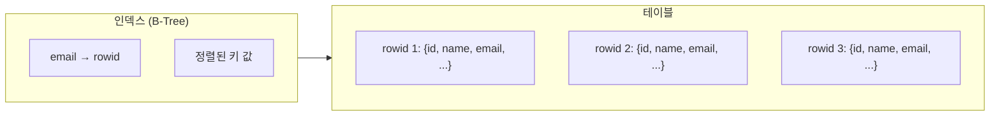
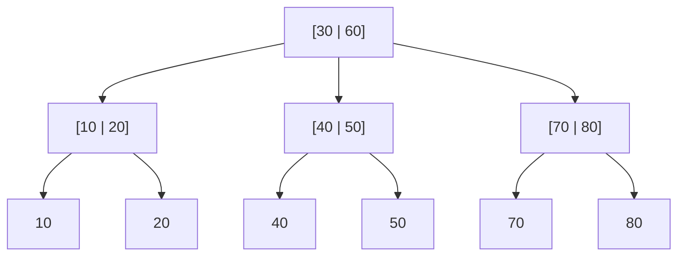
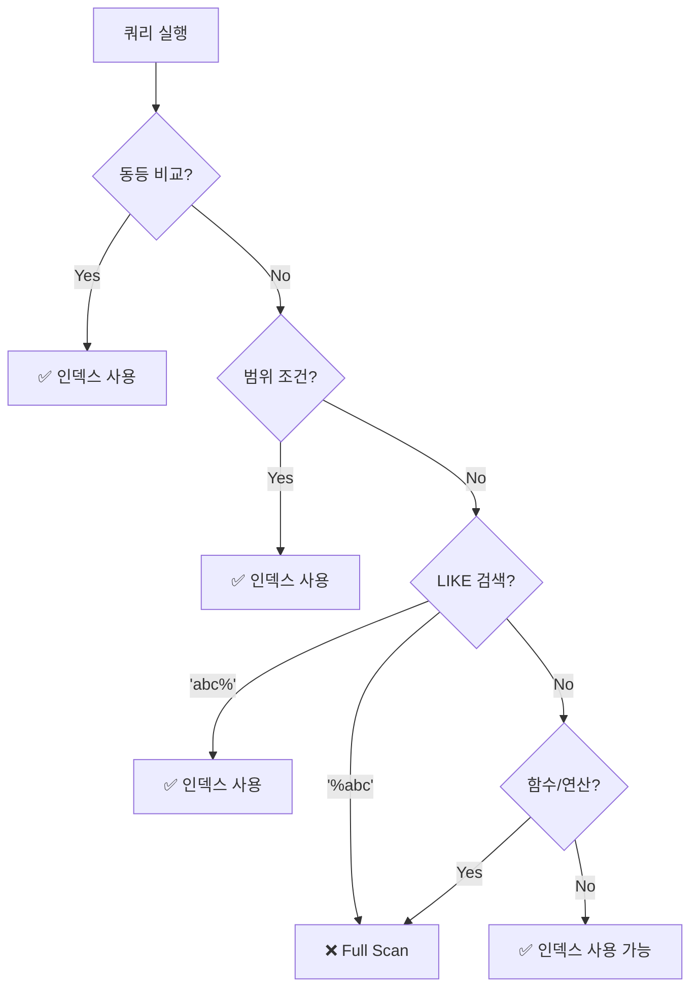

# 데이터베이스 인덱스 기초

100만 건의 데이터에서 특정 행을 찾을 때, 처음부터 끝까지 다 뒤져야 할까?

## 결론부터 말하면

**인덱스**는 데이터베이스에서 원하는 데이터를 빠르게 찾기 위한 자료구조다. 책의 **목차**나 **색인**과 같은 역할을 한다.

```
인덱스 없이: 100만 건 전체 스캔 → $O(n)$
인덱스 사용: B-Tree 탐색 → $O(\log n)$
```

| 데이터 수 | Full Table Scan | B-Tree Index |
|----------|-----------------|--------------|
| 1,000 | 1,000번 비교 | ~10번 비교 |
| 1,000,000 | 1,000,000번 비교 | ~20번 비교 |
| 10억 | 10억 번 비교 | ~30번 비교 |

---

## 1. 인덱스가 필요한 이유

### 1.1 Full Table Scan의 한계

인덱스가 없으면 데이터베이스는 **Full Table Scan**을 수행한다. 테이블의 모든 행을 처음부터 끝까지 읽어야 한다.

```sql
-- 인덱스가 없다면, 100만 건을 모두 읽어야 함
SELECT * FROM users WHERE email = 'john@example.com';
```

100만 건이면 100만 번 비교. 10억 건이면 10억 번 비교. 데이터가 늘어날수록 성능은 선형으로 나빠진다.

### 1.2 디스크 I/O가 핵심 병목

더 큰 문제는 **디스크**다. 메모리는 빠르지만, 디스크는 메모리보다 **100~100,000배 느리다**.

Full Table Scan은 모든 데이터 페이지를 디스크에서 읽어야 하므로, 디스크 I/O가 병목이 된다. 인덱스는 이 디스크 I/O 횟수를 극적으로 줄여준다.

---

## 2. 인덱스란 무엇인가

### 2.1 책의 색인과 같은 원리

1000페이지짜리 책에서 "B-Tree"라는 단어를 찾으려면 어떻게 할까?

| 방법 | 동작 | 시간 |
|------|------|------|
| 처음부터 읽기 | 1페이지부터 1000페이지까지 | 오래 걸림 |
| **색인 사용** | 색인에서 "B-Tree → 234p" 확인 후 바로 이동 | 빠름 |

데이터베이스 인덱스도 마찬가지다. 원하는 값이 **어디에 있는지** 미리 정리해둔 자료구조다.

### 2.2 인덱스의 구조



인덱스는 **키 값과 행의 위치** 쌍을 저장한다. 키 값은 정렬되어 있어서 빠르게 찾을 수 있고, 행의 위치(rowid)를 통해 실제 데이터에 접근한다.

---

## 3. B-Tree: 왜 모든 데이터베이스가 사용하는가

### 3.1 이진 트리의 문제점

단순한 이진 탐색 트리(BST)는 최악의 경우 한쪽으로 치우쳐서 $O(n)$이 될 수 있다.

```
     1
      \
       2
        \
         3
          \
           4  ← 사실상 연결 리스트
```

### 3.2 균형 트리(Balanced Tree)의 등장

**B-Tree**는 **자가 균형**(self-balancing) 트리다. 삽입/삭제 시 스스로 균형을 유지해서 **항상** $O(\log n)$을 보장한다.



### 3.3 B-Tree의 핵심 특징

| 특징 | 설명 |
|------|------|
| **균형 유지** | 모든 리프 노드의 깊이가 동일 |
| **다중 키** | 노드 하나에 여러 키 저장 (디스크 블록 크기에 맞춤) |
| $O(\log n)$ | 삽입, 삭제, 검색 모두 로그 시간 보장 |
| **디스크 최적화** | 노드 크기를 디스크 블록에 맞춰 I/O 최소화 |

### 3.4 실제 깊이는 얼마나 될까?

B-Tree는 노드 하나에 수백 개의 키를 저장할 수 있다. 그래서 **수백만 건의 데이터도 깊이 4~5**면 충분하다.

```
노드당 682개 키 저장 가능 (16KB 블록 기준)
682 × 682 × 682 = 약 3억 1천만 개 → 깊이 3
```

3번의 디스크 읽기로 3억 개 데이터 중 하나를 찾을 수 있다.

---

## 4. 인덱스 명령어 (간단 정리)

### 4.1 생성

```sql
-- 단일 컬럼 인덱스
CREATE INDEX idx_email ON users(email);

-- 복합 인덱스
CREATE INDEX idx_name_age ON users(last_name, first_name, age);

-- 유니크 인덱스
CREATE UNIQUE INDEX idx_email_unique ON users(email);
```

### 4.2 조회

```sql
-- MySQL
SHOW INDEX FROM users;

-- PostgreSQL
\di users  -- psql에서
SELECT * FROM pg_indexes WHERE tablename = 'users';

-- Oracle
SELECT * FROM USER_INDEXES WHERE TABLE_NAME = 'USERS';
```

### 4.3 삭제

```sql
DROP INDEX idx_email ON users;  -- MySQL
DROP INDEX idx_email;           -- PostgreSQL
```

---

## 5. 정방향 인덱스 vs 역방향 인덱스

### 5.1 인덱스 스캔 방향

인덱스는 기본적으로 **오름차순**(ASC)으로 정렬된다. 하지만 데이터베이스는 인덱스를 **양방향**으로 읽을 수 있다.

| 스캔 방향 | 설명 | 성능 |
|----------|------|------|
| **Forward Scan** | 처음 → 끝 방향으로 읽기 | 최적 |
| **Backward Scan** | 끝 → 처음 방향으로 읽기 | 다소 느림 |

```sql
-- Forward Scan (인덱스 순서와 일치)
SELECT * FROM users ORDER BY created_at ASC;

-- Backward Scan (인덱스 역순)
SELECT * FROM users ORDER BY created_at DESC;
```

### 5.2 왜 Backward Scan이 느릴까?

- Forward Scan은 **병렬 처리** 가능
- Backward Scan은 병렬 처리 불가 (일부 DBMS)
- 페이지 간 이동 최적화가 Forward 방향에 맞춰져 있음

### 5.3 DESC 인덱스

자주 역순 정렬이 필요하면 **DESC 인덱스**를 생성하면 된다.

```sql
-- 내림차순 인덱스
CREATE INDEX idx_created_desc ON users(created_at DESC);

-- 혼합 정렬 인덱스 (MySQL 8.0+)
CREATE INDEX idx_mixed ON orders(user_id ASC, created_at DESC);
```

### 5.4 혼합 정렬이 중요한 경우

```sql
-- 이 쿼리를 최적화하려면?
SELECT * FROM orders
WHERE user_id = 123
ORDER BY created_at DESC;

-- 인덱스: (user_id ASC, created_at DESC) → Forward Scan 가능
-- 인덱스: (user_id ASC, created_at ASC) → Backward Scan 필요
```

---

## 6. 인덱스 활용: 어떤 쿼리에서 인덱스를 탈까?

### 6.1 동등 비교(Equality)

```sql
-- 인덱스 사용 ✅
SELECT * FROM users WHERE email = 'john@example.com';
SELECT * FROM users WHERE status = 'active' AND type = 'premium';
```

**동등 비교는 인덱스 활용에 가장 이상적**이다. 정확한 값을 찾으므로 B-Tree를 효율적으로 탐색한다.

### 6.2 범위 검색(Range)

```sql
-- 인덱스 사용 ✅
SELECT * FROM orders WHERE created_at >= '2024-01-01';
SELECT * FROM products WHERE price BETWEEN 1000 AND 5000;
SELECT * FROM users WHERE age > 30;
```

범위 검색도 인덱스를 탄다. B-Tree에서 시작점을 찾고, 리프 노드를 순차적으로 읽는다.

**주의:** 복합 인덱스에서 범위 조건 이후의 컬럼은 인덱스를 제대로 활용하지 못한다.

```sql
-- 인덱스: (status, created_at, type)
SELECT * FROM orders
WHERE status = 'shipped'      -- 동등 비교 ✅
  AND created_at > '2024-01-01'  -- 범위 검색 ✅
  AND type = 'express';       -- 인덱스 활용 제한 ⚠️
```

**규칙:** 동등 비교 컬럼을 앞에, 범위 조건 컬럼을 뒤에 배치하라.

### 6.3 LIKE 검색

```sql
-- 인덱스 사용 ✅ (접두사 검색)
SELECT * FROM users WHERE name LIKE 'Kim%';

-- 인덱스 사용 ❌ (중간/접미사 검색)
SELECT * FROM users WHERE name LIKE '%Kim';
SELECT * FROM users WHERE name LIKE '%Kim%';
```

| 패턴 | 인덱스 사용 | 이유 |
|------|------------|------|
| `'Kim%'` | ✅ | 시작점을 알 수 있음 |
| `'%Kim'` | ❌ | 시작점을 알 수 없음 (Full Scan) |
| `'%Kim%'` | ❌ | 시작점을 알 수 없음 (Full Scan) |

**왜 그럴까?** B-Tree는 **정렬된** 구조다. `'Kim%'`은 "Kim으로 시작하는 범위"를 특정할 수 있다. 하지만 `'%Kim'`은 어디서 시작해야 할지 알 수 없다.

### 6.4 정렬(ORDER BY)

```sql
-- 인덱스로 정렬 ✅ (filesort 없음)
SELECT * FROM users ORDER BY created_at;

-- 인덱스로 정렬 불가 ❌ (filesort 발생)
SELECT * FROM users ORDER BY YEAR(created_at);  -- 함수 적용
SELECT * FROM users ORDER BY created_at + 1;    -- 연산 적용
```

인덱스가 이미 정렬되어 있으므로, **별도의 정렬 작업**(filesort) **없이** 결과를 반환할 수 있다.

**Covered Index**면 더 빠르다:

```sql
-- 인덱스: (status, created_at)
-- 인덱스만으로 결과 반환 가능 (테이블 접근 불필요)
SELECT status, created_at FROM orders
WHERE status = 'shipped'
ORDER BY created_at;
```

---

## 7. 인덱스의 비용 (Trade-off)

인덱스는 **공짜가 아니다**. 읽기 성능을 높이는 대신 다른 비용이 발생한다.

| 비용 | 설명 |
|------|------|
| **쓰기 성능 저하** | INSERT, UPDATE, DELETE 시 인덱스도 함께 수정해야 함 |
| **저장 공간** | 인덱스 자체가 디스크 공간을 차지함 |
| **유지보수** | 인덱스가 많을수록 관리 복잡도 증가 |

```sql
-- 인덱스가 많으면 INSERT가 느려진다
INSERT INTO users (name, email, phone, address, ...)
-- → users 테이블 + idx_email + idx_phone + idx_address + ... 모두 갱신
```

**결론:** 무조건 인덱스를 많이 만들면 안 된다. 읽기/쓰기 비율과 쿼리 패턴을 분석해서 **꼭 필요한 컬럼에만** 인덱스를 생성하라.

---

## 8. 정리: 인덱스 활용 체크리스트

| 조건 | 인덱스 활용 | 비고 |
|------|-----------|------|
| `=` 동등 비교 | ✅ 최적 | 가장 효율적 |
| `>`, `<`, `BETWEEN` 범위 | ✅ 가능 | 복합 인덱스에서 순서 주의 |
| `LIKE 'abc%'` 접두사 | ✅ 가능 | 시작 문자가 고정 |
| `LIKE '%abc'` 접미사 | ❌ 불가 | Full Scan |
| `ORDER BY` | ✅ 가능 | 인덱스 순서와 일치 시 |
| 함수/연산 적용 | ❌ 불가 | `WHERE YEAR(date) = 2024` |



---

## 출처

- [Use The Index, Luke - The Tree](https://use-the-index-luke.com/sql/anatomy/the-tree)
- [Use The Index, Luke - LIKE Performance](https://use-the-index-luke.com/sql/where-clause/searching-for-ranges/like-performance-tuning)
- [PlanetScale - B-Trees and Database Indexes](https://planetscale.com/blog/btrees-and-database-indexes)
- [Built In - How Database B-Tree Indexing Works](https://builtin.com/data-science/b-tree-index)
- [MySQL 8.0 Reference - Descending Indexes](https://dev.mysql.com/doc/refman/8.0/en/descending-indexes.html)
- [Stack Overflow - SQL Server Indexes ASC vs DESC](https://stackoverflow.com/questions/743858/sql-server-indexes-ascending-or-descending-what-difference-does-it-make)
