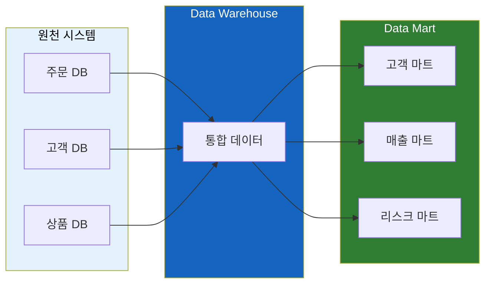
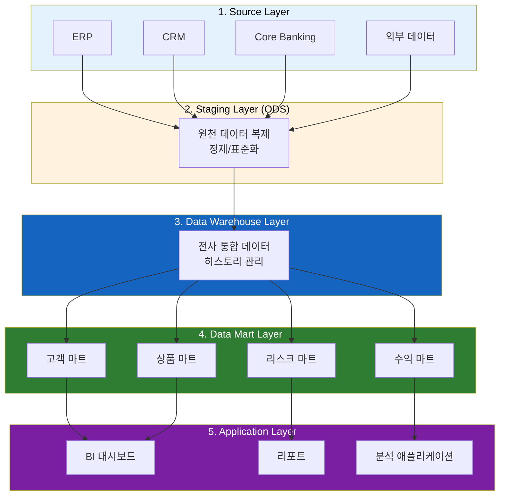
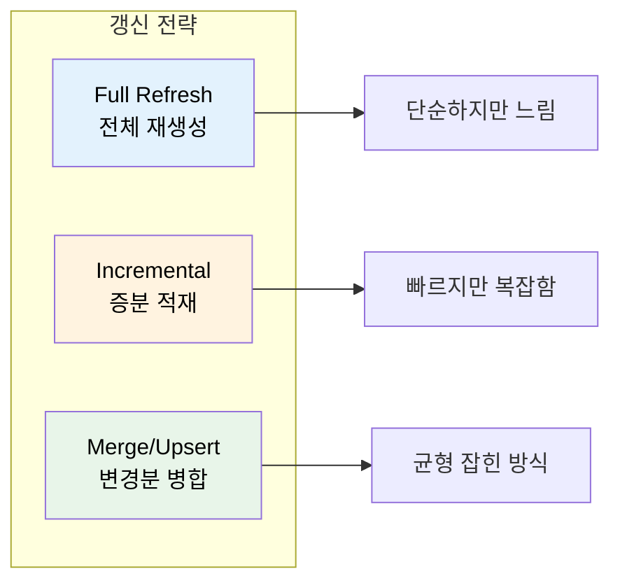

# 마트 테이블(Data Mart) 이해하기

"원천 테이블에서 직접 조회하면 되는데, 왜 굳이 데이터를 복사해서 또 다른 테이블을 만드는 걸까?"

## 결론부터 말하면

**마트 테이블은 "분석용으로 미리 가공해둔 테이블"** 이다. 원천 데이터를 매번 복잡하게 조인하고 집계하는 대신, 자주 쓰는 형태로 미리 만들어두는 것이다.



| 구분 | 원천 테이블 | 마트 테이블 |
|------|------------|------------|
| 목적 | 업무 처리 (OLTP) | 분석/리포팅 (OLAP) |
| 데이터 형태 | 정규화, 분산 | 비정규화, 통합 |
| 조회 복잡도 | 다중 조인 필요 | 단순 조회 가능 |
| 갱신 주기 | 실시간 | 배치 (일/주/월) |

---

## 1. 왜 마트 테이블이 필요한가?

### 1.1 만약 마트 없이 분석한다면?

금융 회사에서 "지난 달 고객별 총 거래금액과 리스크 등급"을 조회한다고 해보자.

원천 테이블에서 직접 조회하려면:

```sql
-- 원천 테이블 직접 조회 (복잡함)
SELECT
    c.customer_id,
    c.customer_name,
    c.segment,
    SUM(t.amount) as total_amount,
    AVG(r.risk_score) as avg_risk_score,
    CASE
        WHEN AVG(r.risk_score) >= 80 THEN 'HIGH'
        WHEN AVG(r.risk_score) >= 50 THEN 'MEDIUM'
        ELSE 'LOW'
    END as risk_grade
FROM customers c
JOIN accounts a ON c.customer_id = a.customer_id
JOIN transactions t ON a.account_id = t.account_id
JOIN risk_assessments r ON c.customer_id = r.customer_id
WHERE t.transaction_date >= DATE_SUB(CURDATE(), INTERVAL 1 MONTH)
  AND t.status = 'COMPLETED'
  AND a.account_status = 'ACTIVE'
GROUP BY c.customer_id, c.customer_name, c.segment
HAVING SUM(t.amount) > 0;
```

이 쿼리의 문제점:

1. **성능**: 수억 건의 거래 데이터를 매번 집계
2. **복잡성**: 4개 테이블 조인, 비즈니스 로직 산재
3. **일관성**: 다른 팀이 같은 분석을 할 때 로직이 달라질 수 있음
4. **운영 부담**: 분석 쿼리가 운영 DB에 부하를 줌

### 1.2 마트 테이블이 있다면?

```sql
-- 마트 테이블 조회 (단순함)
SELECT
    customer_id,
    customer_name,
    segment,
    total_amount,
    avg_risk_score,
    risk_grade
FROM customer_monthly_mart
WHERE base_month = '2024-01';
```

이미 가공된 데이터이기 때문에:
- 조인 없이 바로 조회
- 성능 빠름 (집계 완료 상태)
- 로직 통일 (마트 생성 시 정의됨)
- 운영 DB 부하 없음 (분리된 저장소)

---

## 2. 데이터 계층 구조 이해하기

마트 테이블을 이해하려면 전체 데이터 흐름을 알아야 한다.



### 각 계층의 역할

| 계층 | 역할 | 특징 |
|------|------|------|
| **Source** | 운영 시스템 | OLTP, 실시간 업무 처리 |
| **Staging/ODS** | 원천 복제 및 정제 | ETL 중간 단계, 임시 저장 |
| **Data Warehouse** | 전사 통합 저장소 | 히스토리 보존, 정규화/비정규화 혼합 |
| **Data Mart** | 분석용 가공 데이터 | 부서/도메인별 최적화 |

---

## 3. 마트 테이블의 종류

### 3.1 집계 마트 (Summary Mart)

원천 데이터를 집계하여 요약한 테이블이다.

```sql
-- 예: 월별 고객 거래 요약 마트
CREATE TABLE customer_monthly_summary_mart (
    base_month       VARCHAR(7),      -- 기준월 (2024-01)
    customer_id      BIGINT,
    customer_name    VARCHAR(100),
    segment          VARCHAR(20),

    -- 집계 데이터
    total_tx_count   INT,             -- 총 거래 건수
    total_tx_amount  DECIMAL(18,2),   -- 총 거래 금액
    avg_tx_amount    DECIMAL(18,2),   -- 평균 거래 금액
    max_tx_amount    DECIMAL(18,2),   -- 최대 거래 금액

    -- 계산된 지표
    risk_grade       VARCHAR(10),     -- 리스크 등급
    vip_flag         CHAR(1),         -- VIP 여부

    -- 메타 정보
    created_at       TIMESTAMP,
    updated_at       TIMESTAMP,

    PRIMARY KEY (base_month, customer_id)
);
```

### 3.2 스냅샷 마트 (Snapshot Mart)

특정 시점의 상태를 저장한 테이블이다.

```sql
-- 예: 일별 계좌 잔액 스냅샷 마트
CREATE TABLE account_daily_snapshot_mart (
    base_date        DATE,            -- 기준일
    account_id       BIGINT,
    customer_id      BIGINT,

    -- 스냅샷 데이터 (해당 일자 마감 시점 상태)
    balance          DECIMAL(18,2),   -- 잔액
    available_amount DECIMAL(18,2),   -- 출금가능금액
    hold_amount      DECIMAL(18,2),   -- 보류금액
    account_status   VARCHAR(20),     -- 계좌상태

    PRIMARY KEY (base_date, account_id)
);
```

### 3.3 와이드 마트 (Wide Mart / Flat Mart)

여러 테이블을 조인하여 하나의 넓은 테이블로 만든 것이다.

```sql
-- 예: 고객 통합 뷰 마트 (고객+계좌+거래+리스크 통합)
CREATE TABLE customer_360_mart (
    base_date        DATE,            -- 기준일 (이력 관리용)
    customer_id      BIGINT,

    -- 고객 기본 정보
    customer_name    VARCHAR(100),
    birth_date       DATE,
    gender           CHAR(1),

    -- 계좌 정보 (집계)
    total_accounts   INT,
    total_balance    DECIMAL(18,2),

    -- 거래 정보 (최근 1년)
    yearly_tx_count  INT,
    yearly_tx_amount DECIMAL(18,2),

    -- 리스크 정보
    risk_score       DECIMAL(5,2),
    risk_grade       VARCHAR(10),

    -- 고객 등급
    customer_grade   VARCHAR(20),
    vip_flag         CHAR(1),

    PRIMARY KEY (base_date, customer_id)
);
```

> **왜 `base_date`를 포함하는가?**
>
> 만약 `customer_id`만 PK로 설정하면 "현재 시점"의 상태만 저장된다. 하지만 분석에서는 "3개월 전 이 고객의 리스크 등급은?"처럼 과거 상태를 추적해야 하는 경우가 많다. `base_date`를 포함한 복합 키로 설계하면 시점별 이력을 보존할 수 있어 **시계열 분석, 추세 분석, 변화 감지** 등에 활용할 수 있다.

---

## 4. 금융권의 대표적인 마트 테이블

### 4.1 리스크 마트

금융권에서 가장 중요한 마트 중 하나다.

```sql
-- 신용 리스크 마트 예시
CREATE TABLE credit_risk_mart (
    base_date        DATE,
    customer_id      BIGINT,

    -- 신용 지표
    credit_score     INT,             -- 신용점수
    pd_score         DECIMAL(10,6),   -- 부도확률 (Probability of Default)
    lgd_rate         DECIMAL(5,4),    -- 손실률 (Loss Given Default)
    ead_amount       DECIMAL(18,2),   -- 부도시 익스포저 (Exposure at Default)
    el_amount        DECIMAL(18,2),   -- 예상손실 (Expected Loss = PD × LGD × EAD)

    -- 연체 정보
    overdue_days     INT,             -- 연체일수
    overdue_count    INT,             -- 연체횟수
    overdue_amount   DECIMAL(18,2),   -- 연체금액

    -- 등급
    risk_grade       VARCHAR(10),     -- 리스크 등급 (AAA ~ D)
    watch_flag       CHAR(1),         -- 주의 여부

    PRIMARY KEY (base_date, customer_id)
);
```

### 4.2 수익성 마트

```sql
-- 고객별 수익성 마트 예시
CREATE TABLE customer_profitability_mart (
    base_month       VARCHAR(7),
    customer_id      BIGINT,

    -- 수익
    interest_income  DECIMAL(18,2),   -- 이자수익
    fee_income       DECIMAL(18,2),   -- 수수료수익
    fx_income        DECIMAL(18,2),   -- 외환수익
    total_revenue    DECIMAL(18,2),   -- 총수익

    -- 비용
    interest_expense DECIMAL(18,2),   -- 이자비용
    operating_cost   DECIMAL(18,2),   -- 운영비용
    risk_cost        DECIMAL(18,2),   -- 리스크비용 (충당금)
    total_cost       DECIMAL(18,2),   -- 총비용

    -- 수익성 지표
    net_profit       DECIMAL(18,2),   -- 순이익
    roi              DECIMAL(8,4),    -- 투자수익률

    PRIMARY KEY (base_month, customer_id)
);
```

---

## 5. 마트 테이블 설계 시 고려사항

### 5.1 Grain(입도) 결정

마트의 가장 작은 단위를 무엇으로 할지 결정해야 한다.

| Grain | 예시 | 용도 |
|-------|------|------|
| 일별 + 고객별 | `(base_date, customer_id)` | 일별 추이 분석 |
| 월별 + 고객별 | `(base_month, customer_id)` | 월간 리포트 |
| 월별 + 상품별 | `(base_month, product_id)` | 상품 성과 분석 |
| 거래별 | `(transaction_id)` | 상세 분석 |

### 5.2 갱신 전략



### 5.3 데이터 품질 관리

마트 테이블은 분석의 기반이 되므로, 품질 검증이 필수다.

```sql
-- 마트 데이터 품질 검증 예시
-- 1. 건수 검증
SELECT COUNT(*) FROM customer_monthly_mart WHERE base_month = '2024-01';

-- 2. 합계 검증 (원천과 일치 여부)
SELECT
    SUM(total_amount) as mart_total,
    (SELECT SUM(amount) FROM transactions WHERE ...) as source_total;

-- 3. NULL 검증
SELECT COUNT(*) FROM customer_monthly_mart
WHERE risk_grade IS NULL AND base_month = '2024-01';

-- 4. 범위 검증
SELECT * FROM customer_monthly_mart
WHERE risk_score < 0 OR risk_score > 100;
```

---

## 6. 마트 vs 뷰(View) vs 캐시

"그냥 View를 만들면 안 되나?"라는 의문이 들 수 있다.

| 구분 | 마트 테이블 | View | 캐시 |
|------|------------|------|------|
| 저장 방식 | 물리적 저장 | 쿼리 정의만 저장 | 메모리/Redis |
| 조회 성능 | **빠름** (이미 집계됨) | 느림 (매번 실행) | **매우 빠름** |
| 데이터 신선도 | 배치 주기에 따름 | **실시간** | TTL에 따름 |
| 저장 공간 | 필요함 | 불필요 | 필요함 |
| 적합한 경우 | 복잡한 집계, 대용량 | 단순 조인, 소규모 | 자주 조회되는 결과 |

**언제 무엇을 쓸까?**

- **마트**: 복잡한 집계가 필요하고, 실시간성이 덜 중요할 때
- **View**: 단순 조인이고, 항상 최신 데이터가 필요할 때
- **Materialized View**: 마트와 View의 중간 (일부 DBMS 지원)

---

## 7. 실무에서의 마트 테이블 관리

### 7.1 명명 규칙

```
{도메인}_{주기}_{유형}_mart

예시:
- customer_monthly_summary_mart  (고객_월별_집계_마트)
- account_daily_snapshot_mart    (계좌_일별_스냅샷_마트)
- risk_quarterly_report_mart     (리스크_분기별_리포트_마트)
```

### 7.2 메타데이터 관리

마트 테이블이 많아지면 "이 컬럼이 뭐지?", "언제 갱신되지?" 같은 질문이 생긴다.

```sql
-- 마트 메타데이터 테이블 예시
CREATE TABLE mart_metadata (
    mart_name        VARCHAR(100) PRIMARY KEY,
    description      TEXT,
    grain            VARCHAR(200),    -- PK 설명
    refresh_schedule VARCHAR(50),     -- 예: "매일 06:00"
    source_tables    TEXT,            -- 원천 테이블 목록
    owner_team       VARCHAR(50),
    created_at       TIMESTAMP,
    last_refreshed   TIMESTAMP
);
```

---

## 8. 정리

마트 테이블은 "분석을 위해 미리 준비해둔 테이블"이다.

**왜 필요한가?**
- 복잡한 조인/집계를 매번 하지 않아도 됨
- 일관된 비즈니스 로직 적용
- 운영 DB와 분리하여 부하 방지
- 분석 성능 향상

**어떻게 설계할까?**
- Grain(입도)을 먼저 결정
- 갱신 전략 수립 (Full vs Incremental)
- 데이터 품질 검증 프로세스 구축
- 메타데이터 관리

**언제 사용할까?**
- 리포트, 대시보드의 데이터 소스로
- 복잡한 분석 쿼리의 기반으로
- 데이터 과학/ML 피처로

---

## 출처

- [Kimball Group - Data Warehouse Toolkit](https://www.kimballgroup.com/data-warehouse-business-intelligence-resources/) - 차원 모델링의 바이블
- [AWS - Data Mart란?](https://aws.amazon.com/ko/what-is/data-mart/)
- [Microsoft - 데이터 웨어하우스 아키텍처](https://learn.microsoft.com/ko-kr/azure/architecture/data-guide/relational-data/data-warehousing)
