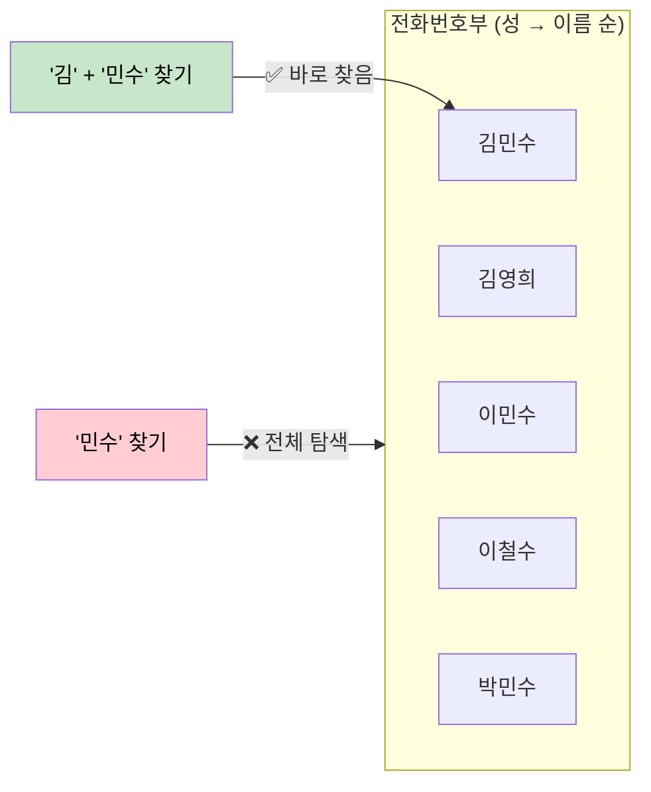
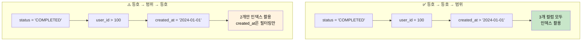
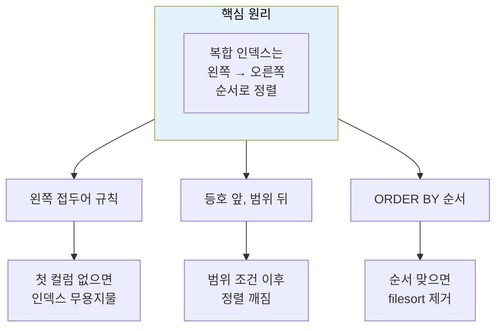

# 복합 인덱스와 컬럼 순서의 비밀

복합 인덱스에서 컬럼 순서가 왜 그토록 중요할까? B-Tree의 정렬 원리를 이해하면 모든 것이 명확해진다.

## 결론부터 말하면

복합 인덱스는 **전화번호부**와 같다. 전화번호부는 "성(姓) → 이름" 순서로 정렬되어 있다. "김"씨 중에서 "민수"를 찾는 건 쉽지만, 이름이 "민수"인 모든 사람을 찾으려면 전화번호부 전체를 뒤져야 한다.



**복합 인덱스 3대 원칙:**

| 원칙 | 설명 | 이유 |
|------|------|------|
| **왼쪽 접두어 규칙** | 인덱스는 왼쪽부터 순서대로 사용 | 첫 번째 컬럼 없이는 정렬 의미 없음 |
| **등호 앞, 범위 뒤** | `=` 조건을 앞에, `<`, `>` 조건을 뒤에 | 범위 조건 이후는 정렬이 깨짐 |
| **ORDER BY도 순서대로** | 정렬도 인덱스 순서를 따라야 함 | 인덱스의 정렬을 그대로 활용 |

---

## 1. 왜 순서가 중요한가?

### 1.1 복합 인덱스의 정렬 원리

복합 인덱스 `(a, b, c)`가 있다고 하자. 데이터베이스는 이 인덱스를 어떻게 정렬할까?

**1차 정렬: a로 정렬**
**2차 정렬: a가 같으면 b로 정렬**
**3차 정렬: a, b가 같으면 c로 정렬**

```sql
CREATE INDEX idx_abc ON orders(status, user_id, created_at);
```

실제 인덱스 내부 데이터:

| status | user_id | created_at | → rowid |
|--------|---------|------------|---------|
| CANCELLED | 100 | 2024-01-05 | ... |
| CANCELLED | 200 | 2024-01-03 | ... |
| COMPLETED | 100 | 2024-01-01 | ... |
| COMPLETED | 100 | 2024-01-15 | ... |
| COMPLETED | 200 | 2024-01-10 | ... |
| PENDING | 100 | 2024-01-20 | ... |

`status`로 먼저 정렬되고, 같은 `status` 내에서 `user_id`로 정렬되고, 같은 `user_id` 내에서 `created_at`으로 정렬된다.

### 1.2 이 구조가 의미하는 것

여기서 핵심을 파악해보자.

**`user_id = 100`인 행들을 보면:**

| status | user_id | created_at |
|--------|---------|------------|
| CANCELLED | 100 | 2024-01-05 |
| COMPLETED | 100 | 2024-01-01 |
| COMPLETED | 100 | 2024-01-15 |
| PENDING | 100 | 2024-01-20 |

`user_id = 100`인 데이터가 **연속해서 모여있지 않다**. CANCELLED, COMPLETED, PENDING에 흩어져 있다.

왜? **`status`로 먼저 정렬했기 때문이다.**

이것이 바로 **왼쪽 접두어 규칙**의 핵심이다.

---

## 2. 왼쪽 접두어 규칙 (Leftmost Prefix Rule)

### 2.1 규칙의 본질

복합 인덱스 `(a, b, c)`는 다음 검색에만 사용할 수 있다:

| 사용 가능 | 사용 불가 |
|-----------|-----------|
| `WHERE a = ?` | `WHERE b = ?` |
| `WHERE a = ? AND b = ?` | `WHERE c = ?` |
| `WHERE a = ? AND b = ? AND c = ?` | `WHERE b = ? AND c = ?` |

**왼쪽부터 연속된 컬럼**만 인덱스를 탈 수 있다.

### 2.2 왜 그럴까?

다시 전화번호부 비유로 돌아가자.

```
전화번호부 (성 → 이름 순 정렬)
─────────────────────────────
김민수  010-1234-5678
김영희  010-2345-6789
김철수  010-3456-7890
이민수  010-4567-8901
이영희  010-5678-9012
박민수  010-6789-0123
...
```

"**김씨 중에 민수**" 찾기 → 김씨 섹션으로 가서 민수를 찾으면 됨 ✅

"**이름이 민수인 사람**" 찾기 → 김민수, 이민수, 박민수... 전화번호부 전체를 훑어야 함 ❌

전화번호부가 "성"으로 먼저 정렬되어 있기 때문에, "성"을 모르면 정렬의 이점을 전혀 활용할 수 없다.

### 2.3 실제 쿼리로 확인

```sql
-- 인덱스: (status, user_id, created_at)

-- ✅ 인덱스 사용 가능
SELECT * FROM orders WHERE status = 'COMPLETED';
SELECT * FROM orders WHERE status = 'COMPLETED' AND user_id = 100;
SELECT * FROM orders WHERE status = 'COMPLETED' AND user_id = 100 AND created_at > '2024-01-01';

-- ❌ 인덱스 사용 불가 (첫 번째 컬럼 없음)
SELECT * FROM orders WHERE user_id = 100;
SELECT * FROM orders WHERE created_at > '2024-01-01';
SELECT * FROM orders WHERE user_id = 100 AND created_at > '2024-01-01';
```

마지막 쿼리가 특히 중요하다. `user_id`와 `created_at` 둘 다 인덱스에 있지만, **첫 번째 컬럼 `status`가 없으면 인덱스를 탈 수 없다**.

---

## 3. 등호 앞, 범위 뒤

### 3.1 범위 조건이 뒤에 와야 하는 이유

이번에는 범위 조건(`<`, `>`, `BETWEEN`, `LIKE 'prefix%'`)을 살펴보자.

인덱스 `(a, b, c)`에서 다음 쿼리를 실행한다고 하자:

```sql
SELECT * FROM table WHERE a > 10 AND b = 5;
```

인덱스 데이터를 보자:

| a | b | c |
|---|---|---|
| 10 | 3 | ... |
| 10 | 5 | ... |
| 11 | 1 | ... |
| 11 | 5 | ... |
| 12 | 2 | ... |
| 12 | 5 | ... |

`a > 10`인 범위를 찾으면 `a = 11, 12, ...`인 행들이 나온다. 그런데 이 범위 안에서 `b = 5`인 행들은 **연속되어 있지 않다**.

- a=11, b=5
- a=12, b=5
- ...

**범위 조건 이후에는 정렬 순서가 의미를 잃는다.**

### 3.2 비교: 등호 vs 범위

```sql
-- 인덱스: (status, user_id, created_at)

-- ✅ 등호 + 등호 + 범위: 3개 컬럼 모두 활용
SELECT * FROM orders
WHERE status = 'COMPLETED'
  AND user_id = 100
  AND created_at > '2024-01-01';

-- ⚠️ 등호 + 범위 + 등호: 2개 컬럼만 활용
SELECT * FROM orders
WHERE status = 'COMPLETED'
  AND user_id > 100
  AND created_at = '2024-01-01';
```

두 번째 쿼리에서 `created_at = '2024-01-01'` 조건은 **인덱스를 타지 못한다**. 왜? `user_id > 100` 범위 조건 때문에 그 이후의 정렬이 깨졌기 때문이다.

### 3.3 시각화로 이해하기



**범위 조건은 인덱스 활용의 끝이다.** 그 이후 컬럼들은 인덱스 스캔 후 필터링만 할 수 있다.

### 3.4 범위 조건은 ORDER BY도 막는다

범위 조건의 영향은 WHERE 절에만 국한되지 않는다. **ORDER BY 최적화도 막아버린다.**

```sql
-- 인덱스: (status, user_id, created_at)

-- ✅ 등호 + 등호 → ORDER BY 최적화 가능
SELECT * FROM orders
WHERE status = 'COMPLETED'
  AND user_id = 100
ORDER BY created_at;  -- filesort 불필요 ✅

-- ❌ 등호 + 범위 → ORDER BY 최적화 불가
SELECT * FROM orders
WHERE status = 'COMPLETED'
  AND user_id > 100
ORDER BY created_at;  -- filesort 발생! ⚠️
```

왜 그럴까? 두 번째 쿼리를 자세히 보자.

`user_id > 100`인 범위 안에서 데이터가 어떻게 정렬되어 있는지 보면:

| status | user_id | created_at |
|--------|---------|------------|
| COMPLETED | 101 | 2024-01-15 |
| COMPLETED | 101 | 2024-01-20 |
| COMPLETED | 102 | 2024-01-05 |
| COMPLETED | 102 | 2024-01-10 |
| COMPLETED | 103 | 2024-01-01 |

`created_at`이 **전체적으로 정렬되어 있지 않다**. 각 `user_id` 내에서만 정렬되어 있을 뿐이다. 따라서 `ORDER BY created_at`을 위해서는 별도의 정렬(filesort)이 필요하다.

이것이 "**범위 조건이 인덱스 활용의 끝**"이라는 말의 진정한 의미다. WHERE 조건뿐 아니라 ORDER BY까지 영향을 받는다.

---

## 4. ORDER BY도 순서를 따르라

### 4.1 인덱스가 이미 정렬되어 있다

복합 인덱스 `(a, b, c)`는 이미 `a → b → c` 순서로 정렬되어 있다. 만약 쿼리의 ORDER BY가 이 순서와 일치하면, **별도의 정렬 작업**(filesort)이 필요 없다.

```sql
-- 인덱스: (status, user_id, created_at)

-- ✅ 인덱스 순서와 일치: filesort 불필요
SELECT * FROM orders
WHERE status = 'COMPLETED'
ORDER BY user_id, created_at;

-- ❌ 인덱스 순서와 불일치: filesort 발생
SELECT * FROM orders
WHERE status = 'COMPLETED'
ORDER BY created_at, user_id;
```

### 4.2 방향도 일치해야 한다

정렬 방향(ASC/DESC)도 중요하다.

```sql
-- 인덱스: (a, b) - 기본 ASC, ASC

-- ✅ 방향 일치
ORDER BY a ASC, b ASC   -- 인덱스 순방향
ORDER BY a DESC, b DESC -- 인덱스 역방향 (둘 다 뒤집기)

-- ❌ 방향 불일치
ORDER BY a ASC, b DESC  -- 혼합 방향 → filesort 발생
```

MySQL 8.0+에서는 인덱스 생성 시 컬럼별 방향을 지정할 수 있다:

```sql
CREATE INDEX idx_ab ON table(a ASC, b DESC);
```

### 4.3 WHERE + ORDER BY 조합

WHERE 절의 등호 조건은 ORDER BY에서 "생략"될 수 있다.

```sql
-- 인덱스: (status, user_id, created_at)

-- status가 상수로 고정되면, 그 다음 컬럼부터 정렬
SELECT * FROM orders
WHERE status = 'COMPLETED'  -- 등호 조건으로 고정
ORDER BY user_id, created_at;  -- status 생략 가능 ✅

-- 논리적으로 이것과 같다:
ORDER BY 'COMPLETED', user_id, created_at
-- 상수는 정렬에 영향을 주지 않으므로 생략 가능
```

---

## 5. 실전 인덱스 설계

### 5.1 설계 체크리스트

복합 인덱스를 설계할 때 다음 순서로 컬럼을 배치하라:

| 순서 | 조건 유형 | 이유 |
|------|-----------|------|
| 1순위 | **등호**(=) 조건 | 가장 선택적, 정렬 유지 |
| 2순위 | **ORDER BY 컬럼** | filesort 제거 |
| 3순위 | **범위**(<, >) 조건 | 범위 이후 정렬 깨짐 |
| 4순위 | **SELECT 컬럼** | 커버링 인덱스 효과 |

### 5.2 예시: 게시판 목록 조회

```sql
-- 자주 실행되는 쿼리
SELECT id, title, created_at
FROM posts
WHERE board_id = 10
  AND status = 'PUBLISHED'
ORDER BY created_at DESC
LIMIT 20;
```

**인덱스 설계:**

```sql
-- 1. 등호 조건: board_id, status
-- 2. ORDER BY: created_at
-- 3. 커버링: id, title

CREATE INDEX idx_posts_list
ON posts(board_id, status, created_at DESC, id, title);
```

| 컬럼 | 역할 |
|------|------|
| `board_id` | 등호 조건 (1순위) |
| `status` | 등호 조건 (1순위) |
| `created_at DESC` | ORDER BY (2순위) |
| `id`, `title` | 커버링 인덱스 (4순위) |

### 5.3 잘못된 설계 예시

```sql
-- ❌ 범위 조건이 앞에 옴
CREATE INDEX idx_bad ON orders(created_at, status, user_id);

-- 이 쿼리에서 status, user_id는 인덱스를 활용하지 못함
SELECT * FROM orders
WHERE created_at > '2024-01-01'
  AND status = 'COMPLETED'
  AND user_id = 100;
```

```sql
-- ✅ 등호 조건을 앞으로
CREATE INDEX idx_good ON orders(status, user_id, created_at);

-- 모든 컬럼이 인덱스를 활용
SELECT * FROM orders
WHERE status = 'COMPLETED'
  AND user_id = 100
  AND created_at > '2024-01-01';
```

---

## 6. EXPLAIN으로 확인하기

### 6.1 key_len 분석

`EXPLAIN`의 `key_len`은 인덱스에서 **실제로 사용된 바이트 수**를 보여준다.

```sql
-- 인덱스: (status VARCHAR(20), user_id BIGINT, created_at DATETIME)
-- 예상 크기: (20*3+2) + 8 + 8 = 78 bytes (utf8mb3 기준, nullable 고려)

EXPLAIN SELECT * FROM orders
WHERE status = 'COMPLETED' AND user_id = 100;
```

| key_len | 의미 |
|---------|------|
| 62 bytes | status만 사용 |
| 70 bytes | status + user_id 사용 |
| 78 bytes | 전체 인덱스 사용 |

### 6.2 Extra 컬럼 확인

| Extra | 의미 |
|-------|------|
| `Using index` | 커버링 인덱스 |
| `Using where` | 인덱스로 조회 후 추가 필터링 |
| `Using filesort` | 별도 정렬 작업 필요 ⚠️ |
| `Using index condition` | ICP (Index Condition Pushdown) |

---

## 7. 정리

복합 인덱스의 컬럼 순서가 중요한 이유는 **B-Tree의 정렬 원리** 때문이다.



**3대 원칙 요약:**

1. **왼쪽 접두어 규칙**: 인덱스는 왼쪽부터 연속된 컬럼만 사용 가능
2. **등호 앞, 범위 뒤**: 범위 조건 이후 컬럼은 인덱스 활용 불가
3. **ORDER BY 순서**: 인덱스 순서와 일치해야 filesort 제거

**인덱스 설계 순서**: 등호 조건 → ORDER BY → 범위 조건 → 커버링 컬럼

---

## 출처

- [MySQL 8.0 Reference Manual - Multiple-Column Indexes](https://dev.mysql.com/doc/refman/8.0/en/multiple-column-indexes.html) - 공식 문서
- [Use The Index, Luke - Concatenated Indexes](https://use-the-index-luke.com/sql/where-clause/the-equals-operator/concatenated-keys) - 인덱스 전문 가이드
- [PlanetScale - Composite Indexes](https://planetscale.com/learn/courses/mysql-for-developers/indexes/composite-indexes)
