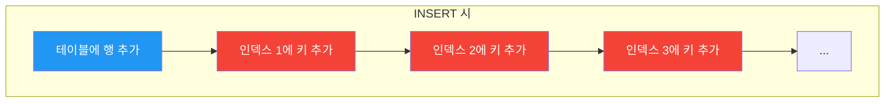
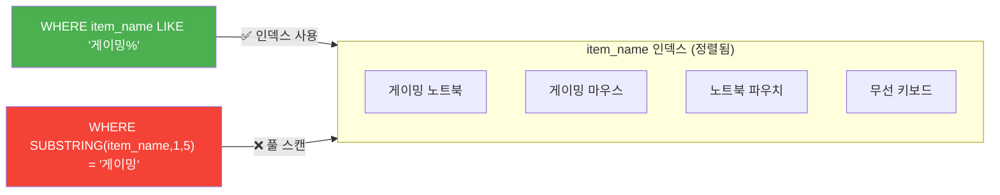
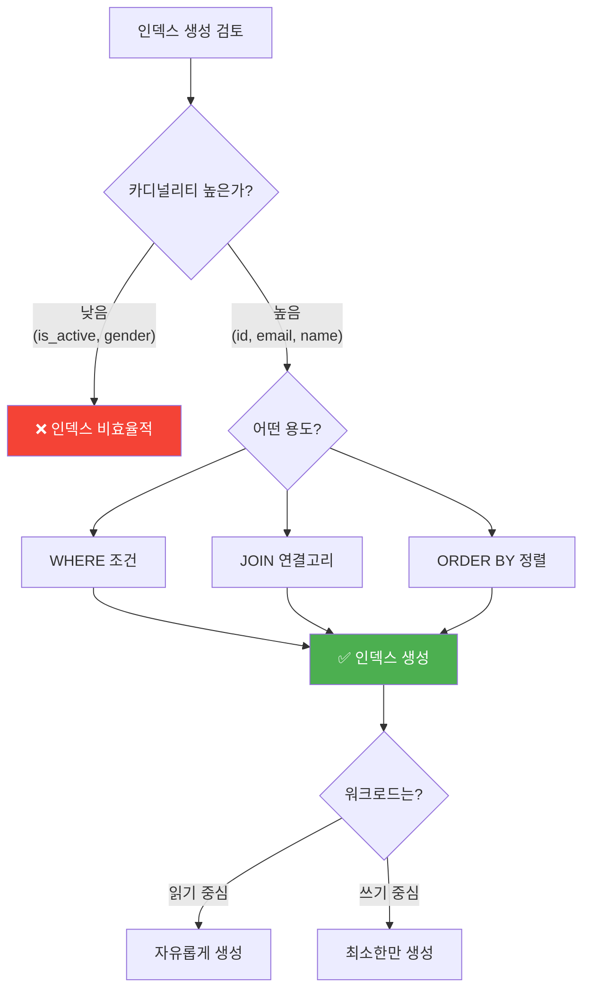

# 인덱스 설계 가이드라인

"인덱스가 검색을 빠르게 한다면, 모든 컬럼에 인덱스를 걸면 최고 아닌가?"

## 결론부터 말하면

**인덱스는 SELECT의 속도를 높이는 대가로, INSERT/UPDATE/DELETE의 속도를 희생시킨다.**


| 구분 | 인덱스 효과 | 이유 |
|------|-----------|------|
| SELECT | ✅ 빨라짐 | B-Tree로 빠른 탐색 |
| INSERT | ❌ 느려짐 | 모든 인덱스에 새 키 추가 |
| UPDATE | ❌ 느려짐 | 인덱스 컬럼 변경 시 삭제+추가 |
| DELETE | ❌ 느려짐 | 모든 인덱스에서 키 삭제 |

---

## 1. 인덱스가 공짜가 아닌 이유

### 1.1 저장 공간을 차지한다

인덱스는 원본 테이블과 별개로 B-Tree 구조를 가진 **물리적인 파일** 로 디스크에 저장된다.

일반적으로 인덱스는 원본 테이블 크기의 약 **10% 내외** 의 공간을 추가로 차지한다.

```
100GB 테이블 + 5개 인덱스 = 약 50GB 추가 디스크 필요
```

인덱스를 무분별하게 생성하면 디스크 사용량이 계속해서 늘어나는 것을 보게 될 것이다.

### 1.2 쓰기 성능이 저하된다

이것이 인덱스의 **가장 치명적인 단점** 이다.

데이터에 변경이 일어날 때마다, 데이터베이스는 원본 테이블뿐만 아니라 **이와 관련된 모든 인덱스를 함께 수정** 해야 한다.



**INSERT:** 새로운 상품이 등록되면 `items` 테이블에 행이 추가된다. 동시에, 이 테이블에 생성된 **모든 인덱스** 의 B-Tree에도 새로운 키 값이 추가되어야 한다. 인덱스가 5개라면, 테이블 삽입 1번에 인덱스 삽입 5번의 작업이 추가된다.

**DELETE:** 테이블에서 행이 삭제되면, **모든 인덱스** 에서도 해당 키 값이 삭제되어야 한다.

**UPDATE:** 가장 복잡한 케이스다.

| 상황 | 처리 방식 |
|------|----------|
| 인덱스 없는 컬럼 변경 | 테이블만 수정 → 빠름 |
| 인덱스 있는 컬럼 변경 | 기존 키 삭제 + 새 키 추가 → **느림** |

인덱스가 있는 `price` 컬럼의 값이 변경된다면? 기존 `price` 값으로 된 인덱스 항목을 삭제하고, 새로운 `price` 값으로 인덱스 항목을 추가하는 작업이 필요하다. INSERT와 DELETE가 동시에 발생하는 것과 같다.

---

## 2. 그렇다면 어디에 인덱스를 걸어야 하나?

### 2.1 핵심 원칙: 카디널리티 (Cardinality)

인덱스를 어디에 걸지 판단하는 가장 중요한 기준은 **카디널리티(Cardinality)** 다.

카디널리티란, 해당 컬럼에 저장된 값들의 **고유성(uniqueness) 정도** 를 나타내는 지표다.

| 카디널리티 | 의미 | 예시 | 인덱스 효과 |
|-----------|------|------|-----------|
| **높음** | 중복 거의 없음 | `item_id`, `email` | ✅ 효과적 |
| **낮음** | 중복 많음 | `is_active`(2종류), `gender`(3종류) | ❌ 비효율적 |

**왜 카디널리티가 중요한가?**

인덱스는 '찾아보기'다. 찾아보기가 효과적이려면, 특정 키워드를 찾았을 때 **검색 범위가 확 줄어들어야** 한다.

```sql
-- is_active에 인덱스가 있어도...
WHERE is_active = TRUE  -- TRUE가 전체의 80%라면?
```

`is_active`가 TRUE인 데이터가 전체의 80%라면, 인덱스를 통해 전체 데이터의 80%를 스캔해야 한다. 이런 경우 옵티마이저는 "이럴 바엔 그냥 풀 테이블 스캔하는 게 낫겠다"고 판단한다.

```sql
-- 반면 item_name에 인덱스가 있다면
WHERE item_name = '게이밍 노트북'  -- 수십만 건 중 단 1건!
```

인덱스는 수십만 건의 상품 데이터 중 **단 1건** 으로 검색 범위를 좁혀준다. 이것이 인덱스의 진정한 가치다.

> **핵심 규칙:** 인덱스는 카디널리티가 높은, 즉 **식별력이 좋은** 컬럼에 생성할 때 가장 효율적이다.

---

## 3. 인덱스 생성 가이드라인

### 3.1 WHERE 절에서 자주 사용되는 컬럼

가장 기본적이고 명백한 가이드라인이다. 인덱스의 존재 이유 자체가 WHERE 절의 검색 속도를 높이는 것이다.

```sql
-- 사용자들이 자주 검색하는 패턴이라면
SELECT * FROM items WHERE item_name = '게이밍 노트북';
SELECT * FROM items WHERE category = '전자기기';
```

이런 컬럼들은 인덱스 생성의 우선 후보가 된다.

### 3.2 JOIN의 연결고리가 되는 컬럼 (외래 키)

JOIN의 성능은 연결고리가 되는 컬럼에 인덱스가 있는지 여부에 따라 **극적으로** 달라진다.

```sql
SELECT s.seller_name, i.item_name, i.price
FROM items i
JOIN sellers s ON i.seller_id = s.seller_id
WHERE s.seller_name = '행복쇼핑';
```

**`items.seller_id`에 인덱스가 없다면:**

1. `sellers` 테이블에서 '행복쇼핑'을 찾는다 (`seller_id = 1`)
2. `items` 테이블의 **모든 행을 처음부터 끝까지 스캔** 하면서 `seller_id = 1`인 상품을 찾는다

items 테이블에 100만 개의 상품이 있다면? JOIN을 위해 100만 번의 비교가 일어난다.

**`items.seller_id`에 인덱스가 있다면:**

1. `sellers` 테이블에서 '행복쇼핑'을 찾는다 (`seller_id = 1`)
2. `items.seller_id` 인덱스를 사용하여 **곧바로** `seller_id = 1`인 상품을 찾는다

```sql
EXPLAIN SELECT s.seller_name, i.item_name, i.price
FROM items i
JOIN sellers s ON i.seller_id = s.seller_id
WHERE s.seller_name = '행복쇼핑';
```

| table | type | key | rows |
|-------|------|-----|------|
| s | const | seller_name | 1 |
| i | **ref** | **fk_items_sellers** | 5 |

`type`이 `ref`이고 `key`가 `fk_items_sellers`라면, JOIN 과정에서 인덱스를 효율적으로 사용했다는 증거다.

> **참고:** MySQL은 외래 키 제약조건을 설정하면 인덱스를 자동으로 생성한다. 하지만 외래 키 제약조건 없이 사용하는 경우, JOIN에 사용되는 컬럼에 반드시 인덱스를 직접 생성해야 한다.

### 3.3 ORDER BY 절에서 자주 사용되는 컬럼

ORDER BY를 사용한 정렬은 데이터의 양이 많을 경우 **매우 비용이 큰 작업** 이다. 데이터베이스는 결과를 반환하기 전에 모든 데이터를 메모리에 올리고 정렬해야 하기 때문이다.

만약 ORDER BY에 사용된 컬럼에 인덱스가 있다면? B-Tree 인덱스는 **이미 데이터가 정렬된 상태** 로 저장되어 있다. 인덱스 순서 그대로 데이터를 읽기만 하면 된다.

```sql
-- 최신 등록 상품 목록 10개
SELECT * FROM items
ORDER BY registered_date DESC
LIMIT 10;
```

`registered_date` 컬럼에 인덱스가 있다면 `filesort` 없이 빠르게 결과를 반환할 수 있다.

> **인덱스 방향과 ORDER BY DESC:**
> 인덱스는 기본적으로 오름차순(ASC)으로 생성된다. `ORDER BY ... DESC`를 사용하면 데이터베이스는 인덱스를 역순으로 스캔(Index Backward Scan)하여 정렬 작업을 생략한다. 하지만 DESC 정렬이 매우 빈번하다면, `CREATE INDEX ... ON items (registered_date DESC);`와 같이 **내림차순 인덱스** 를 생성하는 것이 성능에 더 유리할 수 있다.

---

## 4. 인덱스 컬럼은 가공하면 안 된다

**실무에서 정말 자주 하는 실수다.**

WHERE 절에서 인덱스가 적용된 컬럼을 함수로 감싸거나 계산하면 **인덱스가 작동하지 않는다.**

```sql
-- ❌ 인덱스 무효화
WHERE SUBSTRING(item_name, 1, 5) = '게이밍'
WHERE indexed_column * 10 = 100
WHERE YEAR(created_at) = 2024

-- ✅ 인덱스 활용
WHERE item_name LIKE '게이밍%'
WHERE indexed_column = 10
WHERE created_at >= '2024-01-01' AND created_at < '2025-01-01'
```

> **LIKE 연산자 주의:** `LIKE '게이밍%'`는 인덱스를 사용하지만, `LIKE '%게이밍'`처럼 **앞에 와일드카드(`%`)가 붙으면 인덱스를 사용할 수 없다.** 인덱스는 왼쪽부터 정렬되어 있기 때문이다.

**왜 그럴까?**

인덱스는 **가공되지 않은 원본 값** 을 기준으로 만들어지기 때문이다.



`SUBSTRING(item_name, 1, 5)`의 결과값으로 인덱스가 정렬되어 있지 않으므로, 데이터베이스는 **모든 행을 일일이 함수를 적용해서 비교** 해야 한다.

---

## 5. 실무 가이드: 균형의 미학

### 5.1 워크로드를 분석하라

| 서비스 유형 | 특징 | 인덱스 전략 |
|-----------|------|-----------|
| **읽기 중심** (Read-heavy) | 블로그, 뉴스, 상품 조회 | 인덱스 자유롭게 생성 |
| **쓰기 중심** (Write-heavy) | 로깅, 채팅, 주식 거래 | **최소한의 인덱스만** |

쓰기 중심 서비스에서 인덱스를 남발하면 모든 쓰기 작업에 오버헤드가 추가된다.

### 5.2 "혹시나 해서" 인덱스를 만들지 마라

```sql
-- ❌ "나중에 쓸 것 같아서"
CREATE INDEX idx_maybe_useful ON items(some_column);
```

사용하지 않는 인덱스는 저장 공간만 차지하고 쓰기 성능만 저하시키는 **암적인 존재** 다.

느린 쿼리가 발견되었을 때, **그 쿼리를 개선하기 위한 목적으로** 생성해야 한다.

### 5.3 사용하지 않는 인덱스는 주기적으로 정리하라

대부분의 데이터베이스는 특정 인덱스가 얼마나 사용되었는지 모니터링하는 기능을 제공한다.

```sql
-- MySQL: 인덱스 사용 통계 확인
SELECT * FROM sys.schema_unused_indexes;
```

몇 달, 혹은 1년 이상 사용되지 않는 인덱스가 있다면 과감하게 삭제하자.

---

## 6. 정리



| 원칙 | 설명 |
|------|------|
| **카디널리티 우선** | 중복이 적은 컬럼에 인덱스 생성 |
| **목적 있는 생성** | WHERE, JOIN, ORDER BY에 자주 쓰이는 컬럼 |
| **컬럼 가공 금지** | 함수나 연산 적용 시 인덱스 무효화 |
| **트레이드오프 인식** | SELECT ↑ vs INSERT/UPDATE/DELETE ↓ |
| **주기적 정리** | 사용하지 않는 인덱스 삭제 |

인덱스는 SELECT 성능을 위한 최고의 무기이지만, 저장 공간과 쓰기 성능이라는 비용을 요구하는 **양날의 검** 이다.

---

## 출처

- 강의 자료: 인덱스 설계 가이드라인
- [MySQL 공식 문서 - How MySQL Uses Indexes](https://dev.mysql.com/doc/refman/8.0/en/mysql-indexes.html)
