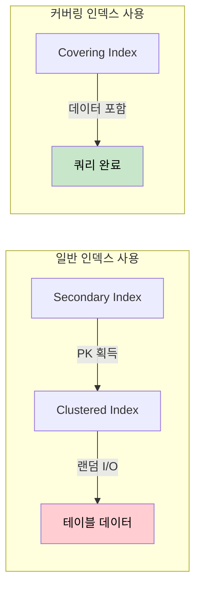
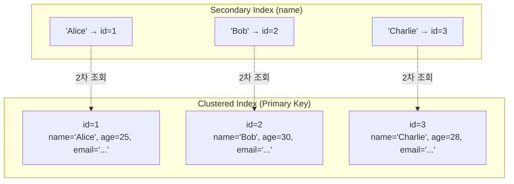
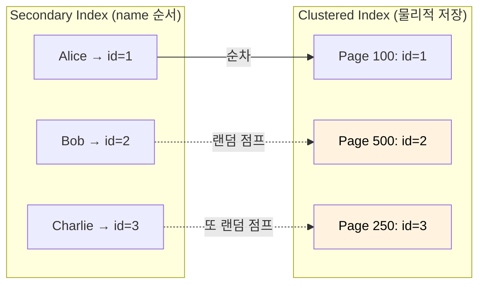
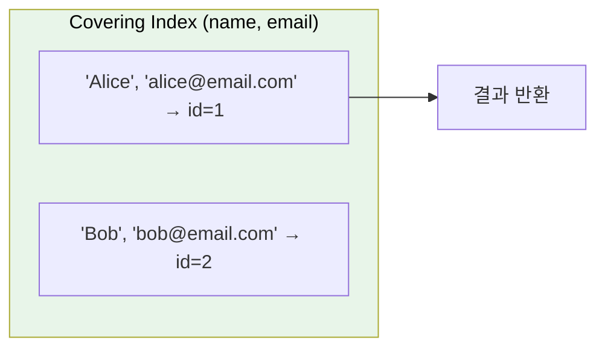
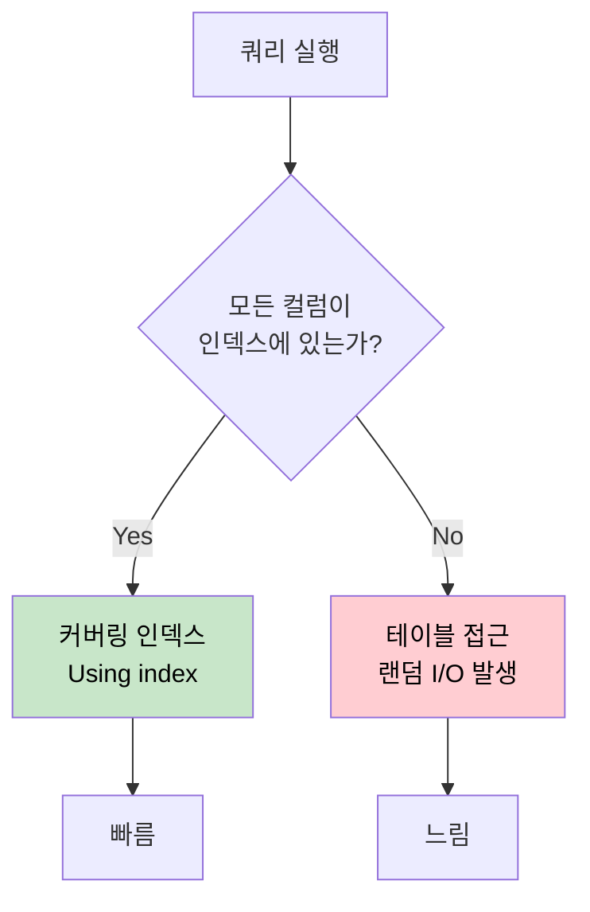

# 커버링 인덱스

인덱스를 사용해도 느린 쿼리가 있다. 왜일까? 테이블에 한 번도 접근하지 않으면 어떨까?

## 결론부터 말하면

**커버링 인덱스**(Covering Index)는 쿼리에 필요한 모든 컬럼을 인덱스 자체에 포함시켜, 테이블에 접근하지 않고 인덱스만으로 쿼리를 완료하는 기법이다.



| 구분 | 일반 인덱스 | 커버링 인덱스 |
|------|-------------|---------------|
| 테이블 접근 | 필요 (랜덤 I/O) | **불필요** |
| I/O 유형 | 랜덤 I/O | 순차 I/O |
| EXPLAIN Extra | NULL 또는 Using where | **Using index** |

---

## 1. 인덱스를 써도 느린 이유

### 1.1 인덱스의 숨겨진 비용

"인덱스를 걸었는데 왜 이렇게 느리지?"

개발자들이 자주 하는 질문이다. 인덱스가 마법의 도구처럼 느껴지지만, 실제로는 인덱스를 탔다고 끝이 아니다. 인덱스 스캔 후에 **테이블 액세스**라는 추가 작업이 필요하기 때문이다.

Index Range Scan의 성능을 결정하는 주요 원인은 인덱스 스캔량이 아니라 **테이블 랜덤 액세스**다.

### 1.2 InnoDB의 인덱스 구조를 이해하자

왜 테이블 액세스가 필요한지 이해하려면, InnoDB의 인덱스 구조를 알아야 한다.



| 인덱스 종류 | 저장 내용 | 특징 |
|-------------|-----------|------|
| **Clustered Index** | 인덱스 키 + **전체 행 데이터** | 테이블당 1개, PK가 기본 |
| **Secondary Index** | 인덱스 키 + **PK 값** | 여러 개 생성 가능 |

**Secondary Index로 검색하면 어떤 일이 벌어질까?**

```sql
SELECT name, email FROM users WHERE name = 'Alice';
```

1. Secondary Index에서 `'Alice'` 검색 → `id=1` 획득
2. Clustered Index에서 `id=1`로 다시 검색 → 전체 행 데이터 획득
3. `email` 컬럼 추출

**2번의 인덱스 탐색**이 필요하다. 그리고 2번 과정에서 **랜덤 I/O**가 발생한다.

### 1.3 랜덤 I/O가 치명적인 이유

인덱스는 정렬되어 있지만, 테이블 데이터는 그렇지 않다.



인덱스 순서(name)와 테이블 저장 순서(id)가 다르기 때문에, 테이블 접근 시 **디스크 헤드가 여기저기 점프**해야 한다. 이것이 랜덤 I/O다.

| I/O 유형 | 특징 | 상대 비용 |
|----------|------|-----------|
| **Sequential I/O** | 연속된 블록 읽기 | 1x |
| **Random I/O** | 흩어진 블록 읽기 | 10~100x |

SSD 환경에서도 랜덤 I/O는 순차 I/O보다 느리다. 전통적인 HDD에서는 그 차이가 더욱 극심하다.

---

## 2. 커버링 인덱스의 마법

### 2.1 테이블 접근을 없애버리면?

만약 Secondary Index 자체에 `email`이 포함되어 있다면 어떨까?

```sql
-- 커버링 인덱스 생성
CREATE INDEX idx_name_email ON users(name, email);

-- 이 쿼리는 테이블에 접근하지 않는다
SELECT name, email FROM users WHERE name = 'Alice';
```



**쿼리에 필요한 모든 컬럼**(`name`, `email`)이 인덱스에 있으므로, Clustered Index를 조회할 필요가 없다.

### 2.2 "커버"한다는 의미

커버링 인덱스가 **커버**해야 하는 것들:

| 절 | 설명 | 예시 |
|-----|------|------|
| `SELECT` | 조회하는 모든 컬럼 | `SELECT name, email` |
| `WHERE` | 조건에 사용되는 컬럼 | `WHERE name = 'Alice'` |
| `ORDER BY` | 정렬에 사용되는 컬럼 | `ORDER BY name` |
| `GROUP BY` | 그룹핑에 사용되는 컬럼 | `GROUP BY name` |

**하나라도 인덱스에 없으면** 테이블 접근이 발생한다.

```sql
-- ❌ age가 인덱스에 없음 → 테이블 접근 필요
SELECT name, email, age FROM users WHERE name = 'Alice';

-- ✅ 모든 컬럼이 인덱스에 있음 → 커버링 인덱스
SELECT name, email FROM users WHERE name = 'Alice';
```

### 2.3 InnoDB의 보너스: PK는 공짜

InnoDB의 Secondary Index는 **항상 Primary Key를 포함**한다. 따라서 PK를 조회할 때는 별도로 인덱스에 추가할 필요가 없다.

```sql
-- idx_name(name) 인덱스만 있어도 커버링 인덱스가 된다
-- 왜? InnoDB Secondary Index는 (name, id)를 저장하기 때문
SELECT id, name FROM users WHERE name = 'Alice';
```

이것은 InnoDB만의 특성이다. MyISAM은 다르게 동작한다.

---

## 3. 실전에서 커버링 인덱스 활용하기

### 3.1 EXPLAIN으로 확인하기

커버링 인덱스가 적용되었는지 확인하는 방법:

```sql
EXPLAIN SELECT name, email FROM users WHERE name = 'Alice';
```

| id | select_type | table | type | key | Extra |
|----|-------------|-------|------|-----|-------|
| 1 | SIMPLE | users | ref | idx_name_email | **Using index** |

**`Extra` 컬럼에 `Using index`가 표시되면** 커버링 인덱스가 적용된 것이다.

| Extra 값 | 의미 |
|----------|------|
| `Using index` | 커버링 인덱스 사용 (테이블 접근 없음) |
| `Using where` | WHERE 조건 필터링 (테이블 접근 가능) |
| `Using index condition` | Index Condition Pushdown (ICP) 사용 |
| NULL | 인덱스로 조회 후 테이블 접근 |

### 3.2 Before / After 비교

**테스트 테이블**: 100만 건의 주문 데이터

```sql
CREATE TABLE orders (
    id BIGINT PRIMARY KEY,
    user_id BIGINT,
    product_id BIGINT,
    amount DECIMAL(10,2),
    status VARCHAR(20),
    created_at DATETIME,
    INDEX idx_user_id (user_id)
);
```

**쿼리**: 특정 사용자의 주문 금액 합계

```sql
SELECT SUM(amount) FROM orders WHERE user_id = 12345;
```

| 상황 | 인덱스 | 테이블 접근 | 실행 시간 |
|------|--------|-------------|-----------|
| Before | `idx_user_id(user_id)` | 필요 (랜덤 I/O) | **280ms** |
| After | `idx_user_amount(user_id, amount)` | 불필요 | **9ms** |

**약 30배 성능 향상**. 커버링 인덱스가 테이블 랜덤 액세스를 완전히 제거했기 때문이다.

### 3.3 손익분기점을 무력화하는 커버링 인덱스

[옵티마이저와 인덱스 손익분기점](./데이터베이스-옵티마이저와-인덱스-손익분기점.md)에서 설명했듯이, 조회 비율이 5~15%를 넘으면 Full Table Scan이 더 효율적이다.

**그러나 커버링 인덱스는 이 법칙을 깨뜨린다.**

```sql
-- 조회 비율 30% (일반적으로 Full Table Scan이 유리한 상황)
SELECT user_id, amount FROM orders WHERE status = 'COMPLETED';
```

| 전략 | 이유 | 비용 |
|------|------|------|
| Full Table Scan | 30%면 인덱스보다 유리 | 높은 Sequential I/O |
| 일반 인덱스 | 30% 랜덤 I/O 발생 | **매우 높음** |
| 커버링 인덱스 | 테이블 접근 없음 | **낮음** |

커버링 인덱스는 테이블 접근 자체가 없으므로, 손익분기점 계산에서 **테이블 액세스 비용이 0**이 된다.

---

## 4. 커버링 인덱스의 트레이드오프

### 4.1 장점

| 장점 | 설명 |
|------|------|
| **랜덤 I/O 제거** | 테이블 접근이 없으므로 랜덤 I/O 0 |
| **Sequential I/O** | 인덱스는 정렬되어 있어 순차 접근 가능 |
| **손익분기점 무시** | 조회 비율과 무관하게 인덱스 사용 가능 |
| **Clustered Index 경합 감소** | 테이블 페이지 접근이 줄어 Lock 경합 완화 |

### 4.2 단점

| 단점 | 설명 |
|------|------|
| **인덱스 크기 증가** | 더 많은 컬럼 = 더 큰 인덱스 |
| **쓰기 성능 저하** | INSERT/UPDATE 시 인덱스 업데이트 비용 |
| **메모리 사용 증가** | Buffer Pool에서 더 많은 공간 차지 |
| **유지보수 복잡성** | 쿼리 변경 시 인덱스도 함께 수정 필요 |

### 4.3 언제 커버링 인덱스를 사용할까?

| 상황 | 권장 여부 | 이유 |
|------|-----------|------|
| 읽기 집중 워크로드 | ✅ 적극 권장 | 읽기 성능 대폭 향상 |
| 쓰기 집중 워크로드 | ⚠️ 신중히 | 인덱스 업데이트 오버헤드 |
| 자주 실행되는 핵심 쿼리 | ✅ 적극 권장 | 반복 이득이 큼 |
| 간헐적으로 실행되는 쿼리 | ❌ 비권장 | 인덱스 유지 비용 > 이득 |
| 컬럼이 적은 경우 | ✅ 권장 | 인덱스 크기 부담 적음 |
| 대용량 TEXT/BLOB 컬럼 | ❌ 불가 | 인덱스에 포함 불가 |

---

## 5. PostgreSQL의 Include Index

PostgreSQL 11부터는 **INCLUDE** 키워드로 커버링 인덱스를 더 효율적으로 만들 수 있다.

```sql
-- 일반 복합 인덱스
CREATE INDEX idx_name_email ON users(name, email);

-- Include Index (PostgreSQL 11+)
CREATE INDEX idx_name_include_email ON users(name) INCLUDE (email);
```

| 방식 | B-Tree 구조 | 특징 |
|------|-------------|------|
| 복합 인덱스 | `(name, email)` 모두 키 | email로도 정렬/검색 가능 |
| Include Index | `name`만 키, `email`은 leaf에만 저장 | 인덱스 크기 절약, email 검색 불가 |

Include Index는 검색에 사용되지 않지만 조회가 필요한 컬럼을 효율적으로 저장한다. SQL Server에서는 이 기능이 2005년부터 있었다.

---

## 6. 정리

커버링 인덱스는 **테이블 랜덤 액세스를 완전히 제거**하는 강력한 최적화 기법이다.



**핵심 포인트:**

1. **인덱스 스캔 후 테이블 접근이 진짜 병목**이다
2. 커버링 인덱스는 **테이블 접근을 0으로** 만든다
3. `EXPLAIN`의 `Using index`로 확인 가능
4. **읽기 성능 vs 쓰기 비용** 트레이드오프를 고려하라
5. InnoDB에서는 **PK가 자동 포함**됨을 기억하라

---

## 출처

- [MySQL 8.0 Reference Manual - Clustered and Secondary Indexes](https://dev.mysql.com/doc/refman/8.0/en/innodb-index-types.html) - 공식 문서
- [PostgreSQL Documentation - Index-Only Scans and Covering Indexes](https://www.postgresql.org/docs/current/indexes-index-only-scans.html) - 공식 문서
- [PlanetScale - Covering Indexes](https://planetscale.com/learn/courses/mysql-for-developers/indexes/covering-indexes)
- [친절한 SQL 튜닝 - 인덱스 튜닝](https://medium.com/@Hailey24/%EC%B9%9C%EC%A0%88%ED%95%9C-sql-%ED%8A%9C%EB%8B%9D-3%EC%9E%A5-%EC%9D%B8%EB%8D%B1%EC%8A%A4-%ED%8A%9C%EB%8B%9D-1-9bae13239416)
- [Tecoble - 커버링 인덱스](https://tecoble.techcourse.co.kr/post/2021-10-12-covering-index/)
- [MySQL에서 커버링 인덱스로 쿼리 성능을 높여보자](https://gywn.net/2012/04/mysql-covering-index/)
