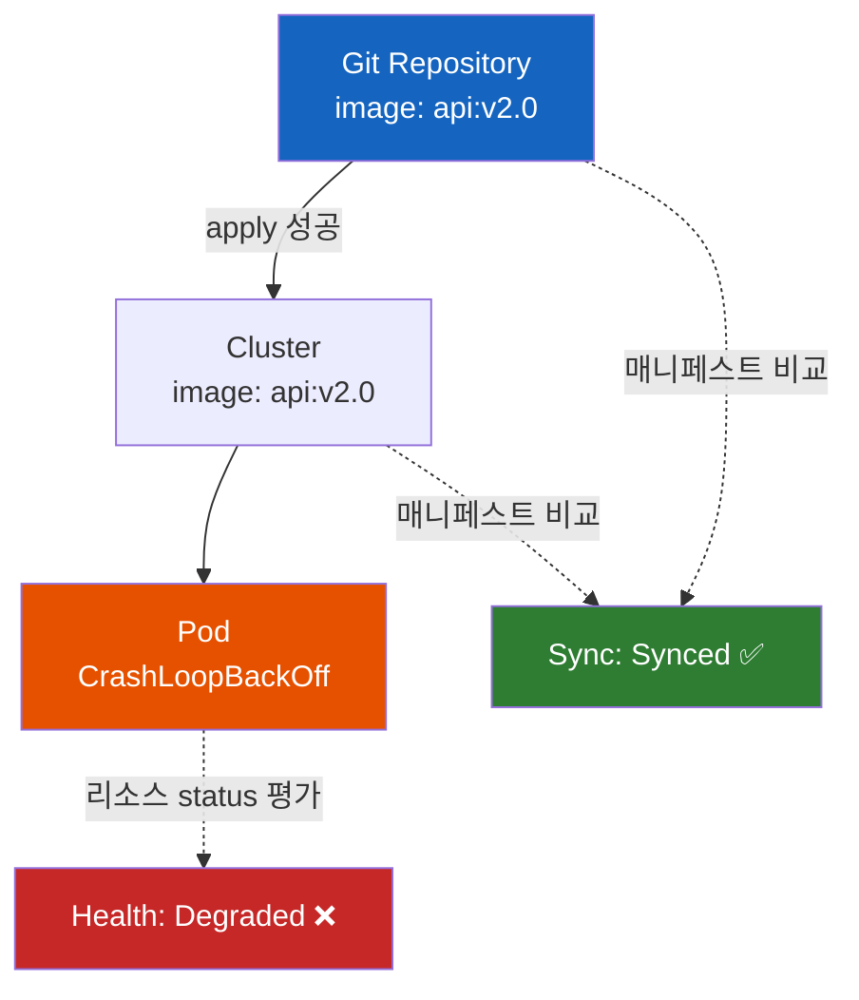
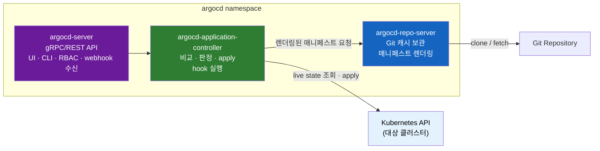
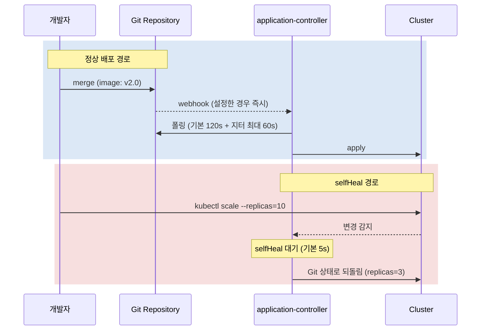
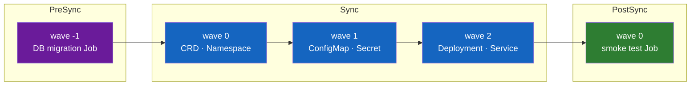
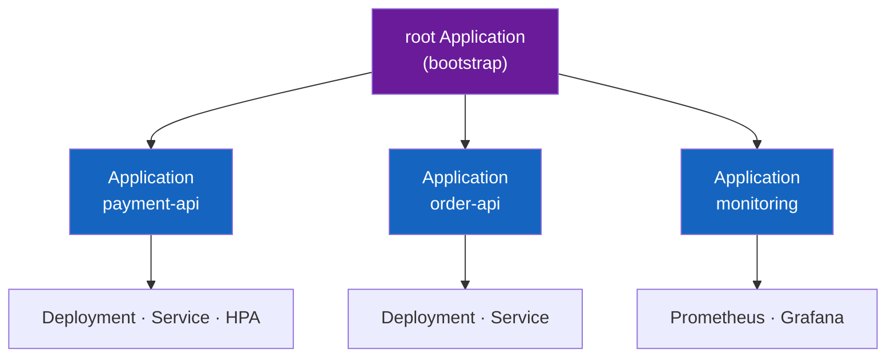
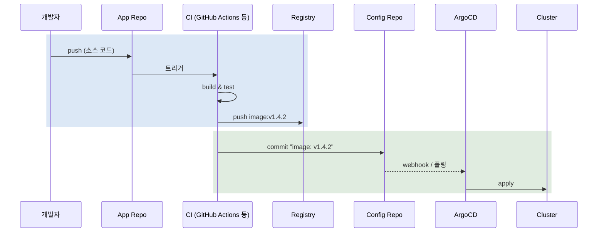

# ArgoCD가 Synced라고 하는데 왜 서비스는 죽어 있을까

ArgoCD 대시보드는 초록색 **Synced** 를 띄우고 있다. Git에 머지한 커밋 해시도 화면에 정확히 찍혀 있다. 그런데 사용자는 502를 받고 있고, Pod는 `CrashLoopBackOff`다. 뭐가 잘못된 걸까?

아무것도 잘못되지 않았다. **ArgoCD는 지금 자기 일을 정확히 했다고 말하고 있을 뿐이다.**

이 노트는 그 문장의 의미를 푸는 데서 시작해, ArgoCD를 운영에 넣었을 때 실제로 부딪히는 것들까지 따라간다.

> **GitOps 자체가 무엇인지** — Git을 Single Source of Truth로 삼는다는 게 왜 필요했고, OpenGitOps 4원칙이 무엇이고, Push 모델과 Pull 모델이 어떻게 다른지 — 는 [GitOps: Git을 Single Source of Truth로 삼는 운영 모델](GitOps-Git을-Single-Source-of-Truth로-삼는-운영-모델.md)에서 이미 다뤘다. 이 노트는 그 위에 얹히는 **도구 층** 을 다룬다. 즉 "GitOps를 하겠다"고 결정한 다음에 실제로 무엇을 마주하게 되는가에 대한 이야기다.

---

## 결론부터 말하면

**ArgoCD는 애플리케이션 상태를 서로 독립된 두 축으로 본다.** 이 두 축을 하나로 착각하는 것이 ArgoCD를 처음 쓸 때 겪는 오해의 대부분을 만든다.

| 축 | 질문 | 값 |
|-----|------|-----|
| **Sync Status** | Git에 적힌 것과 클러스터에 있는 것이 같은가? | `Synced` / `OutOfSync` / `Unknown` |
| **Health Status** | 그 리소스가 실제로 제대로 동작하는가? | `Healthy` / `Progressing` / `Degraded` / `Suspended` / `Missing` / `Unknown` |

`Synced`는 **"Git에 적힌 매니페스트를 클러스터에 넣는 데 성공했다"** 는 뜻이다. 그 매니페스트가 가리키는 이미지가 부팅하다 죽든, DB 접속에 실패하든, Sync Status는 여전히 `Synced`다. 죽었다는 사실은 다른 축, 즉 `Health: Degraded`로 나타난다.



그리고 여기에 하나 더 붙는다. **GitOps의 대표 미덕으로 소개되는 "자가 치유(self-healing)"와 "자동 정리(prune)"는 ArgoCD에서 기본으로 꺼져 있다.** 아무 설정 없이 Application을 만들면 ArgoCD는 관찰하고 보고만 하며, 아무것도 고치지 않는다. 이 노트에서 다룰 내용을 미리 요약하면 이렇다.

| 흔한 기대 | 실제 기본 동작 |
|-----------|----------------|
| Git에 머지하면 자동 배포된다 | `syncPolicy.automated`를 켜야 한다. 안 켜면 `OutOfSync`로 표시만 된다 |
| 손으로 고친 걸 되돌려 준다 | `selfHeal: true`가 필요하다. 기본값은 `false` |
| Git에서 지우면 클러스터에서도 지워진다 | `prune: true`가 필요하다. 기본값은 `false` |
| 커밋하면 즉시 반영된다 | 폴링 주기가 기본 120초 + 최대 60초 지터. 즉시를 원하면 webhook |
| Synced면 배포 성공이다 | Sync와 Health는 별개 축이다 |

---

## 1. 시작점은 Application 하나다

ArgoCD를 설치하면 클러스터에 CRD(Custom Resource Definition) 몇 개가 생긴다. CRD는 쿠버네티스 API에 없던 새로운 리소스 종류를 추가하는 확장 지점이고([쿠버네티스는 어떻게 자기 자신을 확장할까 — CRD와 컨트롤러 그리고 Operator](../kubernetes/쿠버네티스는-어떻게-자기-자신을-확장할까-CRD와-컨트롤러-그리고-Operator.md)), ArgoCD가 추가하는 것 중 가장 중요한 것이 **`Application`** 이다.

ArgoCD로 하는 거의 모든 일은 결국 이 오브젝트 하나를 쓰는 일이다.

```yaml
apiVersion: argoproj.io/v1alpha1
kind: Application
metadata:
  name: payment-api
  namespace: argocd
spec:
  project: default

  # 1) 무엇을 배포할지 — Git 어디의 무엇인가
  source:
    repoURL: https://github.com/myorg/payment-api-deploy.git
    targetRevision: main
    path: overlays/prod

  # 2) 어디에 배포할지 — 어느 클러스터의 어느 네임스페이스인가
  destination:
    server: https://kubernetes.default.svc
    namespace: payment

  # 3) 어떻게 반영할지 — 이 절이 없으면 감지와 표시만 하고 자동 반영은 하지 않는다
  syncPolicy:
    automated:
      prune: true
      selfHeal: true
```

세 개의 블록이 각각 하나의 질문에 답한다. `source`는 **무엇을**, `destination`은 **어디에**, `syncPolicy`는 **어떻게** 다. 그리고 세 번째 블록이 이 노트에서 가장 자주 등장할 이유가 된다.

`source.path`가 가리키는 디렉터리에는 평범한 YAML이 있어도 되고, Kustomize overlay나 Helm chart가 있어도 된다. ArgoCD는 디렉터리를 보고 어떤 도구로 렌더링할지 스스로 판단한다. Helm이라면 chart를 렌더링해서 매니페스트를 만든다 — 이 "렌더링한다"는 표현이 나중에 8.4절에서 아주 중요해진다.

### 1.1 세 개의 컴포넌트가 나눠 갖는 일

Application이 하나 생기면 ArgoCD 내부의 세 컴포넌트가 각자의 역할로 움직인다. 공식 문서가 정의하는 분담은 이렇다.



- **argocd-server** 는 UI와 CLI가 말을 거는 API 서버다. 인증, RBAC 집행, Git webhook 수신이 여기 붙는다.
- **argocd-repo-server** 는 Git 저장소의 로컬 캐시를 들고 있으면서, "이 repoURL / 이 리비전 / 이 path / 이 Helm values로 렌더링하면 어떤 매니페스트가 나오는가"에 답한다.
- **argocd-application-controller** 가 실제 컨트롤러다. 원하는 상태와 실제 상태를 계속 비교해 `OutOfSync`를 감지하고, 필요하면 조치하고, 라이프사이클 hook(PreSync·Sync·PostSync)을 실행한다.

이 분담을 알아둘 실질적 이유가 있다. 장애를 만났을 때 **어느 로그를 봐야 하는지가 여기서 갈린다.** "Git에서 매니페스트가 이상하게 나온다"면 repo-server 로그이고, "Sync가 안 걸린다 / 상태 판정이 이상하다"면 application-controller 로그다. UI가 안 뜨는 문제는 대체로 argocd-server 쪽이다.

또한 이 세 컴포넌트가 모두 **클러스터 안** 에 있다는 점이 GitOps 노트 3.3절에서 말한 Pull 모델의 실체다. CI 서버는 클러스터 자격 증명을 갖지 않는다. 자격 증명은 반대 방향으로 흐른다 — 클러스터 안의 repo-server가 Git을 읽을 권한만 가진다.

---

## 2. 두 개의 신호등 — Sync와 Health

이제 서론의 미스터리로 돌아간다.

### 2.1 Sync Status는 "넣었는가"만 본다

Sync Status는 **텍스트 비교의 결과** 에 가깝다. application-controller가 하는 일은 이렇다.

1. repo-server에게 "Git의 이 리비전을 렌더링해 달라"고 해서 원하는 매니페스트를 받는다
2. 대상 클러스터에서 그 리소스들의 현재 매니페스트를 읽는다
3. 둘을 비교한다

일치하면 `Synced`, 다르면 `OutOfSync`다. 클러스터에 접근할 수 없거나 비교 자체가 불가능하면 `Unknown`이다. 이 판정에는 **"그래서 그게 잘 도는가"라는 개념이 아예 들어 있지 않다.**

### 2.2 Health Status는 "동작하는가"를 본다

Health는 완전히 다른 계산이다. ArgoCD는 표준 쿠버네티스 타입별로 내장 판정 로직을 갖고 있다. 예를 들어 공식 문서 기준으로 `Ingress`는 `status.loadBalancer.ingress` 목록이 비어 있지 않고 그 안에 `hostname`이나 `IP`가 하나라도 있어야 `Healthy`이며, `PersistentVolumeClaim`은 `status.phase`가 `Bound`여야 하고, `StatefulSet`은 `status.updatedReplicas`가 `spec.replicas`와 맞아야 한다.

Deployment의 경우 판정의 실질은 **"롤아웃이 끝났는가"** 이고, 롤아웃이 끝났다는 판단은 결국 readiness probe에 달려 있다. 그래서 probe 설정이 부실하면 Health 판정도 함께 부실해진다([Kubernetes Probe: Liveness, Readiness, Startup](../kubernetes/Kubernetes-Probe-Liveness-Readiness-Startup.md)).

값은 여섯 가지다.

| Health | 의미 |
|--------|------|
| `Healthy` | 정상 동작 중 |
| `Progressing` | 아직 진행 중 (롤아웃 중, LB 할당 대기 중 등) |
| `Degraded` | 실패 상태 |
| `Suspended` | 일시 정지됨 (suspend된 CronJob 등) |
| `Missing` | 클러스터에 없음 |
| `Unknown` | 판정 불가 |

### 2.3 그래서 조합을 읽는 법

두 축이 독립이므로 조합을 읽는 훈련이 필요하다. 운영에서 실제로 마주치는 네 가지가 이렇다.

| Sync | Health | 상황 | 해석 |
|------|--------|------|------|
| `Synced` | `Healthy` | 목표 상태 | 정상 |
| `Synced` | `Degraded` | **서론의 상황** | ArgoCD는 할 일을 다 했다. 문제는 애플리케이션·이미지·의존 서비스 쪽이다 |
| `Synced` | `Progressing` | 배포 직후 | 정상적인 과도 상태. 롤아웃이 끝나기를 기다리는 중 |
| `OutOfSync` | `Healthy` | 새 커밋 대기 / drift | 지금 도는 건 멀쩡한데 Git과 다르다. 자동 sync가 꺼져 있거나, 누가 클러스터를 손으로 고쳤다 |

`Synced` + `Degraded`가 왜 정상적인 표시인지 다시 정리하면 이렇다. **잘못된 매니페스트를 Git에 커밋해서 머지했다면, ArgoCD의 임무는 그 잘못된 매니페스트를 충실히 클러스터에 반영하는 것이다.** Git이 Single Source of Truth라는 원칙을 진지하게 받아들이면 이건 버그가 아니라 설계다. ArgoCD는 Git을 검증하는 도구가 아니라 Git을 집행하는 도구다.

### 2.4 Health는 위로만 전파되고, 아래로는 상속되지 않는다

Application 전체의 Health는 **직속 자식 리소스 중 가장 나쁜 것** 으로 정해진다. 공식 문서가 명시하는 우선순위는 좋은 쪽에서 나쁜 쪽으로 이렇다.

```
Healthy → Suspended → Progressing → Missing → Degraded → Unknown
```

`Missing` 리소스 하나와 `Degraded` 리소스 하나가 같이 있으면 앱 전체는 `Degraded`다.

그런데 여기서 직관을 배신하는 규칙이 하나 있다. **리소스 하나하나의 Health는 자기 자식으로부터 상속되지 않는다.** 공식 문서의 예시가 그 자체로 충격적이다.

```
App (healthy)
└── Deployment (healthy)
    ├── ReplicaSet (healthy)
    │   └── Pod (healthy)
    └── ReplicaSet (unhealthy)
        └── Pod (unhealthy)
```

문서는 이것이 의도된 설계라고 못 박는다. 이유는 이렇다 — **"Deployment의 건강 상태가 그 Pod들의 건강 상태에 반드시 영향받아야 하는 것은 아니다."** 롤링 업데이트 중 구 버전 ReplicaSet의 Pod가 하나 죽어가는 것은 Deployment 입장에서 정상적인 과정이다. 리소스의 Health는 오직 그 리소스 자신의 `status` 필드만 보고 계산된다.

그래서 CRD를 쓸 때 함정이 생긴다. 커스텀 리소스의 자식이 망가져 있어도, 그 커스텀 리소스의 `status`에 그 사실이 반영돼 있지 않으면 ArgoCD는 `Healthy`라고 판정한다. 이 경우 해법은 Lua로 커스텀 health check를 작성해 `argocd-cm`의 `resource.customizations.health.<group>_<kind>` 키에 넣는 것이다.

---

## 3. 자동 배포는 기본이 아니다

GitOps 노트 3.3절과 3.4절은 "에이전트가 Pull해서 적용한다"와 "지속적으로 조정한다"를 원칙으로 소개했다. ArgoCD에서 그 원칙이 실제로 켜지는 지점이 `syncPolicy`다. 그리고 **기본값은 전부 보수적이다.**

### 3.1 automated — 이게 없으면 관찰만 한다

`spec.syncPolicy.automated`가 없으면 ArgoCD는 Git이 바뀐 것을 감지하고 `OutOfSync`로 표시하되, 반영은 사람이 UI나 CLI에서 Sync 버튼을 누를 때까지 기다린다.

이건 결함이 아니라 선택지다. 프로덕션에서 "머지 후 사람의 승인"이라는 게이트를 원한다면 자동 sync를 끄는 것이 정답이다. 다만 이 상태에서는 GitOps 노트가 말한 자동 수렴이 일어나지 않는다는 사실을 알고 있어야 한다.

최근 버전에서는 켜고 끄는 것을 명시적으로 표현할 수 있다.

```yaml
spec:
  syncPolicy:
    automated:
      enabled: true    # false로 두면 prune·selfHeal 값이 있어도 자동 sync를 건너뛴다
```

`enabled`를 아예 지정하지 않으면(null) 자동 sync가 켜진 것으로 취급된다는 점을 주의해야 한다. 즉 `automated: {}`는 "켜짐"이다.

### 3.2 prune — 기본값 false가 만드는 유령 리소스

`prune`은 **Git에서 사라진 리소스를 클러스터에서도 지우는가** 다. 공식 문서는 이 기본값이 `false`인 것을 명시적으로 "안전 장치(safety mechanism)"라고 부른다.

그래서 이런 일이 생긴다.

```bash
# 팀이 사용하지 않는 CronJob을 Git에서 삭제하고 머지했다
git rm manifests/legacy-batch-cronjob.yaml && git commit -m "chore: 미사용 배치 제거" && git push

# ArgoCD: Synced ✅
# 클러스터: legacy-batch-cronjob 여전히 살아서 매일 새벽에 돈다
```

Git에는 없고 클러스터에는 있는 리소스가 조용히 쌓인다. GitOps를 도입한 이유가 "Git이 진실"인 상태를 만드는 것이었는데, 정확히 그 부분이 깨진다. 오래된 클러스터에서 정체불명의 리소스가 발굴되는 흔한 경로가 이것이다.

```yaml
spec:
  syncPolicy:
    automated:
      prune: true
```

여기에 또 하나의 안전 장치가 겹쳐 있다. `prune`을 켜도 **렌더링 결과가 완전히 비어 있으면** ArgoCD는 전부 삭제하는 대신 거부한다. Kustomize 경로를 잘못 건드려서 매니페스트가 0개로 렌더링됐을 때 프로덕션 전체가 날아가는 것을 막아준다. 정말로 전부 비울 의도라면 `allowEmpty: true`를 명시해야 한다.

### 3.3 selfHeal — GitOps의 자가 치유는 옵션이다

이게 가장 자주 오해되는 지점이다. GitOps 소개 글들이 반드시 언급하는 장면 — 누가 `kubectl scale`로 replica를 손으로 바꿨는데 시스템이 알아서 Git 상태로 되돌려 놓는 그 장면 — 은 **`selfHeal: true`가 있어야 일어난다.**

공식 문서의 표현은 담백하다. "기본적으로, 실제 클러스터에 가해진 변경은 자동 sync를 트리거하지 않는다."

```yaml
spec:
  syncPolicy:
    automated:
      selfHeal: true
```

이 옵션이 꺼진 상태에서 손으로 바꾼 값은 `OutOfSync` 표시로 남되 유지된다. 그러다 누군가 Git에 다른 커밋을 머지해 sync가 한 번 돌면, 그때 손으로 바꾼 값이 함께 되돌아간다. **즉 drift가 사라지는 시점이 예측 불가능해진다.** 긴급 상황에 손으로 replica를 10개로 올려두고 잊었다가, 며칠 뒤 무관한 커밋 하나가 머지되는 순간 3개로 되돌아가는 사고가 이렇게 만들어진다.

selfHeal을 끌 이유가 없다는 뜻은 아니다. HPA(Horizontal Pod Autoscaler)가 `spec.replicas`를 바꾸는 환경에서 Git에도 `replicas`가 적혀 있으면 ArgoCD와 HPA가 서로 값을 되돌리며 싸운다. 다만 그 경우의 정석 해법은 selfHeal을 끄는 것이 아니라 **그 필드만 비교에서 제외하는 것** 이다(8.1절의 `ignoreDifferences`).

### 3.4 그래서 언제 반영되는가 — 타이밍의 실제 숫자

"3분마다 Pull한다"는 설명을 자주 보지만, 실제 동작은 조금 더 구체적이다. 공식 문서 기준으로 reconciliation 주기는 **기본 120초에 최대 60초의 지터(jitter)가 더해져 최대 3분** 이다. 지터가 있는 이유는 Application이 수백 개일 때 모든 폴링이 같은 순간에 몰리는 것을 막기 위해서다. 이 값은 `argocd-cm`의 `timeout.reconciliation`으로 조정한다.

selfHeal은 별도의 타이머를 쓴다. drift를 감지한 뒤 재시도까지의 대기는 **기본 5초** 이고, application-controller의 `--self-heal-timeout-seconds` 플래그로 바꾼다.



폴링 주기를 기다리는 것이 답답하다면 Git 저장소에 webhook을 걸어 argocd-server로 push 이벤트를 보내면 된다. 그러면 커밋 직후 refresh가 일어난다. **여기서 "Push 모델로 돌아간 것 아닌가"라는 의문이 생길 수 있는데, 아니다.** webhook이 전달하는 것은 "저장소가 바뀌었으니 확인해 봐라"라는 신호뿐이고, 매니페스트를 읽고 적용하는 주체는 여전히 클러스터 안의 컨트롤러다. 자격 증명의 방향이 바뀌지 않는다는 점이 핵심이다.

### 3.5 알아둘 자동 sync의 나머지 규칙

공식 문서가 명시하는 것 중 운영에서 실제로 걸리는 조항들이다.

- 자동 sync는 앱이 `OutOfSync`일 때만 시도된다.
- **같은 커밋 SHA와 같은 파라미터 조합에 대해 한 번 실패한 sync는 자동으로 재시도되지 않는다.** 인프라 일시 장애로 실패했다면 사람이 개입해야 한다. 커밋을 다시 하는 것도 방법이다.
- **자동 sync가 켜진 앱은 롤백을 할 수 없다.** ArgoCD가 되돌려 놓아도 다음 reconcile에서 즉시 Git 상태로 다시 끌려온다. 그래서 GitOps에서 롤백의 정식 수단은 `git revert`다. UI의 History 버튼이 아니다.

---

## 4. DB 마이그레이션은 어떻게 앱보다 먼저 돌까

GitOps 노트 1.4절은 문제를 하나 던져두고 답하지 않았다. 파이프라인이 세 단계 중 두 번째에서 실패하면 절반만 배포된 상태가 된다는 문제다. 순서와 실패 처리가 필요한 배포에서, 선언적 모델은 어떻게 대응하는가?

ArgoCD의 답은 **Sync Phase와 Sync Wave** 다.

### 4.1 Phase — 매니페스트 적용 전후에 끼어들기

ArgoCD는 sync 작업을 여러 단계로 쪼개고, 각 단계에 리소스를 배치할 수 있게 한다. 배치는 `argocd.argoproj.io/hook` annotation으로 한다.

| Hook | 실행 시점 |
|------|-----------|
| `PreSync` | 매니페스트 적용 **전** |
| `Sync` | 모든 `PreSync`가 성공한 뒤, 매니페스트 적용과 동시에 |
| `Skip` | 이 매니페스트를 적용하지 말라는 표시 |
| `PostSync` | 모든 `Sync` hook 성공 + 적용 성공 + **모든 리소스가 `Healthy`가 된 뒤** |
| `SyncFail` | sync가 실패했을 때 |
| `PreDelete` | Application 삭제 직전 |
| `PostDelete` | Application의 모든 리소스가 삭제된 뒤 (v2.10 이상) |

`PostSync`의 조건을 다시 읽어볼 만하다. 단순히 "apply 후"가 아니라 **모든 리소스가 Healthy가 된 뒤** 다. 그래서 여기에 스모크 테스트를 걸면 "배포가 끝나고 실제로 떴을 때만 검증이 돈다"는 의미 있는 게이트가 된다.

그리고 `PreSync`가 GitOps 노트 1.4절의 답이다. **PreSync hook이 실패하면 sync 전체가 중단되고, 매니페스트는 적용되지 않는다.** DB 마이그레이션이 깨지면 새 이미지가 아예 배포되지 않는다. "절반만 배포된 상태"가 구조적으로 막힌다.

```yaml
apiVersion: batch/v1
kind: Job
metadata:
  name: db-migrate
  annotations:
    argocd.argoproj.io/hook: PreSync
    argocd.argoproj.io/hook-delete-policy: HookSucceeded
    argocd.argoproj.io/sync-wave: '-1'
spec:
  ttlSecondsAfterFinished: 360
  template:
    spec:
      containers:
        - name: postgresql-client
          image: 'my-postgres-data:11.5'
          command: ['psql', '-h=my_postgresql_db', '-U postgres', '-f preload.sql']
      restartPolicy: Never
  backoffLimit: 1
```

`hook-delete-policy`는 실행이 끝난 hook 리소스를 언제 치울지 정한다. `HookSucceeded`(성공 시 삭제), `HookFailed`(실패 시 삭제), `BeforeHookCreation`(새로 만들기 전에 기존 것 삭제) 중 하나이며, 지정하지 않으면 `BeforeHookCreation`으로 동작한다. 실패한 Job을 남겨 로그를 봐야 하는 경우가 많으니 `HookSucceeded`가 실무에서 무난하다.

### 4.2 Wave — 같은 단계 안에서의 순서

Phase가 굵은 단계 구분이라면, Wave는 그 안의 세밀한 순서다. `argocd.argoproj.io/sync-wave` annotation에 정수를 넣으면 **작은 수부터** 적용된다.

```yaml
metadata:
  annotations:
    argocd.argoproj.io/sync-wave: "5"
```

기본값은 0이고, 음수를 쓸 수 있다. 그래서 `-1`을 주면 "다른 모든 것보다 먼저"라는 의미가 된다. 위 마이그레이션 Job 예시가 `PreSync`와 `sync-wave: -1`을 동시에 쓴 이유가 이것이다.

전체 정렬 규칙은 **phase → wave → kind → name** 순이다. 같은 wave 안에서는 kind 순서(namespace가 그 안의 리소스보다 먼저 오는 식)로 정리된다.



wave 사이에는 **기본 2초의 지연** 이 들어간다. 방금 적용한 스펙 변경에 다른 컨트롤러가 반응할 시간을 주고, ArgoCD가 낡은 오브젝트를 보고 Health를 너무 빨리 판정해 다음 wave hook을 성급하게 실행하는 것을 막기 위해서다. 환경 변수 `ARGOCD_SYNC_WAVE_DELAY`로 조정한다. 이 2초가 wave 개수만큼 곱해지므로, wave를 20개 넘게 쓰면 sync 자체가 눈에 띄게 느려진다.

### 4.3 wave의 대표적 함정

**앞 wave의 리소스가 Healthy가 되지 못하면 앱은 영원히 진행 중 상태에 머문다.** 공식 문서가 직접 경고하는 내용이다. 다음 wave로 넘어가려면 앞 wave가 Healthy여야 하는데, 앞 wave에 절대 Healthy가 될 수 없는 리소스가 있으면 뒤의 모든 것이 영구히 멈춘다.

특히 위험한 조합이 이렇다.

- `Ingress`를 앞 wave에 넣었는데 그 환경에 LoadBalancer를 붙여줄 컨트롤러가 없다. `status.loadBalancer.ingress`가 영원히 비어 있으므로 영원히 `Progressing`이다.
- `PersistentVolumeClaim`을 앞 wave에 넣었는데 StorageClass가 `WaitForFirstConsumer`다. 이 PVC를 쓸 Pod가 뒤 wave에 있으므로, PVC는 `Bound`가 되기 위해 Pod를 기다리고 Pod는 PVC가 Bound되기를 기다린다. 교착이다.

또 하나. `Job`이나 `CronJob`이 아닌 리소스를 hook으로 쓸 수는 있지만, hook은 **부분 sync(selective sync)에서는 실행되지 않는다.** UI에서 특정 리소스만 골라 sync하면 마이그레이션 Job이 조용히 건너뛰어진다.

---

## 5. 클러스터와 앱이 늘어나면 — App of Apps

Application 오브젝트 하나가 애플리케이션 하나에 대응한다. 서비스가 30개, 환경이 dev/staging/prod 세 개라면 Application이 90개다. 이걸 사람이 하나씩 만들어야 할까?

첫 번째 답이 **App of Apps** 다. **Application을 만드는 Application** 이다.



발상은 단순하다. Application도 결국 쿠버네티스 리소스이므로, **Application 매니페스트들이 담긴 디렉터리를 가리키는 Application** 을 만들면 된다. 클러스터를 처음 세울 때 root 앱 하나만 손으로 만들면 나머지가 줄줄이 따라 생긴다. 클러스터 부트스트랩의 표준 패턴이다.

### 5.1 App of Apps에서 반드시 짚어야 할 것들

**보안이 먼저다.** 공식 문서는 이 패턴을 명시적으로 "admin-only tool"이라고 부르며, "임의의 Project에 Application을 만들 수 있는 능력은 admin 수준의 권한"이라고 못 박는다. root 앱의 소스 저장소에 push할 수 있는 사람은 실질적으로 클러스터 admin이다. PR 리뷰에서는 특히 각 Application의 `project` 필드를 봐야 한다 — ArgoCD 자신의 네임스페이스에 접근할 수 있는 Project라면 그건 admin 권한과 같다.

**삭제 전파에는 finalizer가 필요하다.** 자식 앱과 그 리소스까지 함께 정리되게 하려면 Application에 `resources-finalizer.argocd.argoproj.io` finalizer를 붙여야 한다.

**초기 sync는 두 번 걸린다.** root 앱을 sync하면 root는 `Synced`가 되지만 방금 만들어진 자식 앱들은 아직 `OutOfSync`다. 자식들을 한 번 더 sync해야 한다. 자식 앱에 `automated`를 켜두는 것이 일반적인 대응이다.

**그리고 sync wave와 조합할 때 함정이 하나 있다.** ArgoCD는 1.8에서 `argoproj.io/Application` 자체에 대한 health 판정을 제거했다. 4.3절에서 봤듯이 wave는 앞 wave가 Healthy가 되어야 진행하는데, Application의 health가 판정되지 않으면 wave 순서가 의도대로 동작하지 않는다. App of Apps에 wave를 쓸 계획이라면 `argocd-cm`에 `resource.customizations.health.argoproj.io_Application` Lua 스크립트를 넣어 health 판정을 되살려야 한다. 공식 문서가 그 스크립트를 그대로 제공한다.

---

## 6. 반복을 걷어내는 층 — ApplicationSet

App of Apps는 "Application 매니페스트를 어디에 둘 것인가"를 해결하지만, **매니페스트 자체의 중복** 은 그대로 남는다. 클러스터 세 개에 같은 앱을 배포하면 거의 똑같은 Application YAML이 세 벌 필요하다.

`ApplicationSet`은 이 층을 없앤다. **파라미터를 생성하는 generator + 그 파라미터로 채울 template** 이라는 구조다.

```yaml
apiVersion: argoproj.io/v1alpha1
kind: ApplicationSet
metadata:
  name: guestbook
spec:
  goTemplate: true
  goTemplateOptions: ["missingkey=error"]
  generators:
  - list:
      elements:
      - cluster: engineering-dev
        url: https://1.2.3.4
      - cluster: engineering-prod
        url: https://2.4.6.8
      - cluster: finance-preprod
        url: https://9.8.7.6
  template:
    metadata:
      name: '{{.cluster}}-guestbook'
    spec:
      project: my-project
      source:
        repoURL: https://github.com/infra-team/cluster-deployments.git
        targetRevision: HEAD
        path: guestbook/{{.cluster}}
      destination:
        server: '{{.url}}'
        namespace: guestbook
```

이 매니페스트 하나가 Application 세 개를 만든다. 공식 문서가 밝히는 목표는 명확하다 — 하나의 매니페스트로 여러 클러스터를 겨냥하고, 하나의 매니페스트로 여러 앱을 배포하고, monorepo를 제대로 지원하고, 공유 클러스터에서 테넌트가 **권한 있는 관리자를 거치지 않고** 스스로 배포할 수 있게 하는 것이다.

### 6.1 generator 아홉 가지

generator는 파라미터를 어디서 얻는지로 구분된다. 공식 문서 기준 현재 아홉 가지다.

| Generator | 파라미터 출처 |
|-----------|---------------|
| **List** | 직접 적은 key/value 목록 |
| **Cluster** | ArgoCD에 등록된 클러스터 목록 (클러스터 추가·제거에 자동 반응) |
| **Git** | Git 저장소의 파일 내용 또는 디렉터리 구조 |
| **Matrix** | 두 generator의 결과를 조합 (곱집합) |
| **Merge** | 여러 generator의 결과를 병합 (뒤가 앞의 값을 덮어씀) |
| **SCM Provider** | GitHub 등의 API로 조직 내 저장소를 자동 발견 |
| **Pull Request** | 열린 PR을 자동 발견 (PR별 프리뷰 환경) |
| **Cluster Decision Resource** | 배포 대상 클러스터를 결정하는 커스텀 리소스와 연동 |
| **Plugin** | HTTP RPC로 외부에서 파라미터를 받아옴 |

실무에서 가장 자주 쓰이는 조합 두 가지를 짚어둘 만하다.

- **Git generator (디렉터리 모드)** — 저장소에 디렉터리를 추가하는 것만으로 새 앱이 생긴다. 즉 "앱 등록"이라는 별도 작업이 사라진다.
- **Matrix (Git × Cluster)** — "저장소에 있는 모든 앱 × 등록된 모든 프로드 클러스터"가 한 매니페스트로 표현된다. 클러스터를 하나 추가하면 그 클러스터에 앱 전체가 자동으로 깔린다. GitOps 노트 5.3절이 "GitOps가 빛나는 상황"으로 꼽은 멀티 클러스터가 실제로 이 지점에서 실현된다.
- **Pull Request generator** — PR이 열리면 프리뷰 환경이 생기고 닫히면 사라진다. 다만 PR마다 실제 리소스가 생기므로 클러스터 비용과 네임스페이스 관리 설계가 함께 필요하다.

### 6.2 ApplicationSet의 함정

**ApplicationSet이 관리하는 Application의 spec을 직접 고쳐도 소용없다.** 잠깐 자동 sync를 끄려고 자식 Application의 `spec.syncPolicy.automated`를 손으로 바꿔도 ApplicationSet 컨트롤러가 곧 template대로 되돌린다. 공식 문서에 별도 장(Controlling Resource Modification)이 있을 만큼 흔한 혼란이다. 토글하려면 ApplicationSet 쪽에서 해야 한다.

**generator의 실수는 폭발적으로 번진다.** Application 하나를 잘못 만들면 앱 하나가 깨지지만, ApplicationSet의 template를 잘못 고치면 그것이 곱해진 만큼의 Application이 동시에 잘못된다. `prune: true`가 켜진 상태에서 generator가 어떤 이유로 빈 목록을 반환하면 그 목록에 대응하던 앱들이 삭제 대상이 된다. dry-run으로 렌더링 결과를 먼저 확인하는 습관, 그리고 3.2절의 `allowEmpty`를 굳이 켜지 않는 것이 방어선이다.

**동시 배포를 순차 배포로 바꾸는 장치가 있다.** 기본 전략은 `AllAtOnce`이므로 template를 고치면 대응하는 Application 전체가 한꺼번에 sync된다. dev에서 먼저 확인하고 prod로 넘어가는 단계적 롤아웃을 원한다면 **Progressive Syncs** 의 `RollingSync` 전략을 쓴다. 다만 이 기능은 v3.3.0부터 Beta이고 **기본적으로 꺼져 있다.** ApplicationSet 컨트롤러에 `--enable-progressive-syncs`를 주거나 `applicationsetcontroller.enable.progressive.syncs: "true"`를 설정해야 활성화된다.

---

## 7. 이미지 태그는 누가 커밋하는가

여기서 GitOps 노트 7.1절이 권장한 "App Repo와 Config Repo 분리"가 구체적인 메커니즘을 요구하게 된다. **ArgoCD는 이미지를 빌드하지 않는다.** Git에 적힌 태그를 읽어 apply할 뿐이다. 그러면 새로 빌드한 이미지 태그는 누가 Git에 적는가?

정석은 **CI가 Config Repo에 커밋하는 것** 이다.



경계가 깔끔하다. CI는 **레지스트리 push 권한과 Config Repo write 권한만** 갖고, 클러스터 자격 증명은 갖지 않는다. GitOps 노트 1.3절이 지적한 "CI 서버가 해킹당하면 프로덕션 전체가 넘어간다"는 문제가 여기서 실제로 축소된다. 최악의 경우에도 공격자가 얻는 것은 "Config Repo에 커밋할 능력"이고, 그 커밋은 Git 히스토리에 남고 리뷰 대상이 된다.

### 7.1 mutable 태그를 쓰면 배포가 멈춘다

그런데 이 구조에는 조용한 함정이 있다. 태그를 `:latest`나 `:main`처럼 **움직이는 이름** 으로 두면 어떻게 될까?

```yaml
# Config Repo에 이렇게 적혀 있다
image: myorg/payment-api:latest
```

CI가 같은 태그로 새 이미지를 push한다. 레지스트리의 `latest`가 가리키는 다이제스트는 바뀌었다. 하지만 **Git의 텍스트는 한 글자도 바뀌지 않았다.** 2.1절에서 봤듯이 Sync Status는 매니페스트 비교의 결과이므로, ArgoCD는 계속 `Synced`라고 판정한다. 새 이미지는 배포되지 않는다.

즉 **`:latest`를 쓰면 GitOps 파이프라인이 조용히 정지한다.** 실패 알림도 없다. 대시보드는 초록색이다.

같은 뿌리에서 나오는 또 다른 증상 — 롤아웃은 일어났는데 예전 코드가 그대로 도는 문제 — 는 [rollout restart를 했는데 왜 예전 코드가 그대로 돌까 — 이미지 태그와 다이제스트](../kubernetes/rollout-restart를-했는데-왜-예전-코드가-그대로-돌까-이미지-태그와-다이제스트.md)에서 다뤘다. 결론은 같다. **불변 태그를 쓰거나 다이제스트로 고정하라.** 커밋 SHA를 태그로 쓰는 방식(`payment-api:a1b2c3d`)이 GitOps와 가장 잘 맞는다. 새 빌드마다 Git의 텍스트가 반드시 바뀌기 때문이다.

### 7.2 Argo CD Image Updater라는 선택지

"CI가 Config Repo에 커밋한다"는 흐름을 CI에 구현하지 않고 맡기고 싶다면 **Argo CD Image Updater** 라는 별도 프로젝트가 있다. 레지스트리를 감시하다가 새 태그를 발견하면 반영해 준다. write-back 방식이 두 가지인데, 이 선택이 GitOps 원칙과 직결된다.

| 방식 | 동작 | 성격 |
|------|------|------|
| `git` | Git 저장소에 커밋한다 (기본적으로 `.argocd-source-<appName>.yaml` 파일) | Git이 진실로 유지된다. 프로덕션 권장 |
| `argocd` | ArgoCD Application 오브젝트를 직접 수정한다 | Git에 남지 않는다. Application을 지우고 다시 만들면 사라진다 |

`argocd` 방식이 기본값이고 설정이 간단하지만, **Git에 기록되지 않으므로 GitOps 모델을 깨뜨린다.** Application을 Git으로 관리하고 있다면 다음 sync에 덮어써진다. 개발 환경에서 커밋을 계속 만들고 싶지 않을 때 쓰는 편의 기능으로 보는 편이 정확하다.

---

## 8. 실전에서 부딪히는 것들

여기까지가 구조다. 이제 실제로 운영하면 반드시 만나게 되는 것들이다.

### 8.1 sync를 했는데도 OutOfSync가 사라지지 않는다

공식 문서가 아예 한 장(Diffing Customization)을 할애한 문제다. sync 직후에도 `OutOfSync`가 유지되는 상황이 있다.

원인은 대체로 하나다. **Git에 적힌 것과 클러스터에 저장된 것이 실제로 다르기 때문** 이다. 다만 그 차이를 만드는 주체가 사람이 아니다.

- **mutating admission webhook** 이 리소스를 저장 전에 고친다. 서비스 메시가 사이드카를 끼워 넣거나, 정책 엔진이 라벨을 붙인다([내가 만들지 않은 컨테이너가 왜 Pod에 들어와 있을까 — Admission Webhook](../kubernetes/내가-만들지-않은-컨테이너가-왜-Pod에-들어와-있을까-Admission-Webhook.md)).
- **다른 컨트롤러** 가 필드를 바꾼다. HPA가 `spec.replicas`를 조정하고, `kube-controller-manager`가 CA bundle을 채운다.
- **Helm chart의 랜덤 함수** 가 렌더링마다 다른 값을 만든다. `randAlphaNum` 같은 함수는 매번 다른 문자열을 낳으므로 Git 쪽 매니페스트 자체가 매번 달라진다.
- **CRD의 커스텀 마샬링** 이 값을 재포맷한다. `cpu: 100m`으로 적었는데 `cpu: 0.1`로 저장되는 식이다.

해법은 **그 필드만 비교에서 제외하는 것** 이다. Application 단위로는 이렇게 쓴다.

```yaml
spec:
  ignoreDifferences:
    # HPA가 관리하는 replicas는 Git과 비교하지 않는다
    - group: apps
      kind: Deployment
      jsonPointers:
        - /spec/replicas

    # 목록 안의 특정 항목만 제외하려면 jq 경로 표현식
    - group: apps
      kind: Deployment
      jqPathExpressions:
        - '.spec.template.spec.initContainers[] | select(.name == "injected-init-container")'

    # 특정 컨트롤러가 소유한 필드 전체를 제외 (server-side apply의 managedFields 활용)
    - group: '*'
      kind: '*'
      managedFieldsManagers:
        - kube-controller-manager
```

세 번째 방식이 특히 우아하다. 필드 경로를 하나씩 나열하는 대신 **"이 컨트롤러가 소유권을 주장한 필드는 전부 무시"** 라고 선언한다. 쿠버네티스의 `metadata.managedFields`를 그대로 활용하므로, 그 컨트롤러가 관리하는 필드가 늘어나도 설정을 고칠 필요가 없다.

클러스터 전체에 적용해야 하는 알려진 문제라면 `argocd-cm`의 `resource.customizations.ignoreDifferences.<group>_<kind>` 키에 넣는다. 대표 예가 webhook의 `caBundle`이다.

```yaml
data:
  resource.customizations.ignoreDifferences.admissionregistration.k8s.io_MutatingWebhookConfiguration: |
    jqPathExpressions:
      - '.webhooks[]?.clientConfig.caBundle'
```

### 8.2 Secret을 Git에 어떻게 둘 것인가

GitOps는 "모든 원하는 상태를 Git에 둔다"는 원칙 위에 서 있다. 그런데 Secret은? **평문으로 커밋하는 것은 선택지가 아니다.** Git 히스토리는 지워도 남고, 저장소를 읽을 수 있는 모든 사람이 프로덕션 자격 증명을 갖게 된다([Kubernetes ConfigMap & Secret](../kubernetes/Kubernetes-ConfigMap-Secret.md)).

ArgoCD 공식 문서는 이 문제를 직접 풀지 않고, 접근 방식 두 갈래로 정리한 뒤 도구를 소개한다.

| 접근 | 원리 | 도구 |
|------|------|------|
| **대상 클러스터에서 복호화/주입** (문서 권장) | Git에는 암호문이나 참조만 두고, 클러스터의 오퍼레이터가 실제 Secret을 만든다 | Sealed Secrets, External Secrets Operator, Kubernetes Secrets Store CSI Driver, aws-secret-operator, Vault Secrets Operator |
| **렌더링 시점에 주입** | 매니페스트 생성 단계에서 값을 끼워 넣는다 | argocd-vault-plugin (Config Management Plugin) |

문서가 첫 번째 접근을 권하는 이유는 **ArgoCD를 비밀에서 떼어놓기 위해서** 다. 두 번째 방식은 repo-server가 Vault 자격 증명을 갖게 되고, 렌더링된 매니페스트에 평문 비밀이 실린다. 첫 번째 방식에서는 ArgoCD가 `SealedSecret`이나 `ExternalSecret`이라는 **암호문 또는 참조만 다루고**, 실제 값은 대상 클러스터의 오퍼레이터만 본다.

실무에서는 대개 이렇게 갈린다. 클러스터 밖에 이미 비밀 저장소(Vault, AWS Secrets Manager 등)가 있다면 **External Secrets Operator**, 별도 저장소 없이 Git만으로 끝내고 싶다면 **Sealed Secrets** 다.

### 8.3 라벨 충돌과 리소스 추적 방식

ArgoCD는 "이 리소스가 어느 Application 소유인가"를 표시해 둬야 한다. 전통적으로 `app.kubernetes.io/instance` 라벨을 썼는데, 문제가 있었다. **이 라벨은 쿠버네티스 생태계의 공용 라벨이라 다른 도구도 붙인다.** 다른 도구가 그 라벨을 덮어쓰면 ArgoCD는 소유 관계를 잃고, 영구히 `OutOfSync`로 보이거나 리소스를 고아로 취급한다. 공식 FAQ에 "Why Is My App Out Of Sync Even After Syncing?"으로 올라와 있는 사례다.

그래서 Argo CD 3.0부터 **기본 추적 방식이 annotation 기반으로 바뀌었다.**

```
argocd.argoproj.io/tracking-id: <app name>:<resource group>/<resource kind>:<resource namespace>/<resource name>
```

ArgoCD 전용 annotation이므로 다른 도구와 부딪히지 않는다. 2.x에서 올라온 인스턴스라면 `argocd-cm`의 `application.resourceTrackingMethod` 값을 확인해 볼 만하다. 값이 없거나 `label`이면 여전히 라벨 방식이다.

### 8.4 Helm의 lookup 함수는 동작하지 않는다

Helm을 쓰는 팀이 반드시 걸리는 지점이다. 원인은 ArgoCD가 Helm을 쓰는 **방식** 에 있다.

**ArgoCD는 `helm install`이나 `helm upgrade`를 실행하지 않는다.** repo-server가 `helm template`으로 매니페스트를 렌더링하고, 그 결과를 쿠버네티스에 apply한다. 즉 ArgoCD 입장에서 Helm은 "YAML을 만들어 주는 템플릿 엔진"이다([Helm: 쿠버네티스의 패키지 매니저는 왜 필요한가](../kubernetes/Helm-쿠버네티스의-패키지-매니저는-왜-필요한가.md)).

이 구조에서 두 가지가 따라 나온다.

**첫째, `lookup` 함수가 빈 값을 반환한다.** Helm 문서 자체가 명시하듯 `helm template` 중에는 Kubernetes API 서버에 접속하지 않으므로 `lookup`은 빈 dict를 준다. "이미 Secret이 있으면 그 값을 쓰고 없으면 새로 만든다"는 흔한 chart 패턴이 ArgoCD 아래에서는 **매번 새로 만드는 쪽으로만 동작한다.** 비밀번호가 sync마다 바뀌는 증상이 이렇게 나온다. ArgoCD 이슈 트래커에 오래 열려 있는 항목이며(#5202, 그리고 `--dry-run=server`를 쓰자는 제안 #21745), 현실적인 대응은 chart를 고쳐 값을 `values`로 주입받게 하는 것이다.

**둘째, Helm의 release 개념이 없다.** `helm list`에 아무것도 안 나오고, `helm rollback`도 쓸 수 없다. 롤백은 `git revert`다(3.5절). 그리고 Helm hook은 ArgoCD hook으로 자동 변환되는데, `pre-install`과 `pre-upgrade`의 구분이 사라지므로 **모든 sync에서 실행된다고 가정하고 hook을 멱등하게 작성해야 한다.**

### 8.5 ArgoCD가 자기 자신을 관리하게 할 것인가

ArgoCD 자체도 쿠버네티스 매니페스트 모음이다. 그러니 ArgoCD를 가리키는 Application을 만들어 자기 자신을 GitOps로 관리하는 것이 가능하다. 실제로 흔한 구성이다.

매력은 분명하다. ArgoCD 설정 변경도 Git 히스토리에 남고 리뷰를 거친다. 대신 **자기 발등을 밟을 수 있다.** 잘못된 설정을 머지하면 그것을 되돌릴 도구가 그 설정 때문에 죽어 있는 상태가 된다. 최소한 두 가지를 준비해 두는 게 좋다 — Git 없이 원래 매니페스트를 다시 적용할 수 있는 경로(`kubectl apply`로 복구할 수 있는 백업), 그리고 ArgoCD Application 자체는 `selfHeal`을 신중하게 다루는 것.

---

## 9. Argo CD 3.x에서 달라진 것들

2.x 시절 자료를 보고 3.x를 쓰면 어긋나는 지점이 있다. 3.0은 공식적으로 "위험이 낮은 업그레이드"를 지향했지만, 기본값 변경이 여러 개 있어서 알아둘 값이 있다.

| 변경 | 2.x | 3.x |
|------|-----|-----|
| 리소스 추적 방식 | 라벨 기반 | **annotation 기반** (8.3절) |
| 로그 조회 RBAC | 플래그로 선택 (`server.rbac.log.enforce.enable`) | **항상 강제.** `logs, get` 권한을 명시적으로 줘야 Pod 로그 탭이 보인다 |
| 세분화 RBAC 상속 | `update`/`delete` 권한이 하위 리소스에도 적용 | **적용 안 됨.** `update/*`, `delete/*` 정책을 따로 정의해야 한다 |
| `resource.exclusions` | 기본값 없음 | **기본 제외 목록 있음** (`Endpoints`, `EndpointSlice`, `Lease`, 각종 Review 리소스 등 고빈도 오브젝트) |
| `status` 필드 diff | CRD만 무시 | **모든 리소스에서 무시** |
| 리소스별 health 저장 | Application CR의 `/status`에 저장 | **외부에 저장.** `argocd app list`는 개별 리소스 health를 더 이상 반환하지 않는다 |
| Dex SSO의 RBAC subject | `sub` 클레임 | **`federated_claims.user_id`** 클레임 |
| `argocd-cm`의 저장소 설정 | 지원 (deprecated) | **제거.** Secret으로 관리해야 한다 |

운영에 실제로 영향이 큰 것 세 개를 꼽으면 이렇다.

- **로그 RBAC 강제** 는 업그레이드 직후 "개발자들이 Pod 로그를 못 보게 됐다"는 문의로 나타난다. `policy.default`가 `role:readonly`나 `role:admin`이면 영향 없지만, 커스텀 롤을 쓰고 `policy.default`가 없으면 영향받는다.
- **health 저장 위치 변경** 은 `.status.resources[].health`를 파싱하던 스크립트를 깨뜨린다. `argocd app get <app> -o json`으로 옮겨야 한다. 되돌리려면 `argocd-cmd-params-cm`의 `controller.resource.health.persist: true`다.
- **annotation 추적으로의 전환** 에는 알려진 edge case가 있다. 전환 후 첫 sync에 리소스 삭제가 포함되면 ArgoCD가 소유권을 인식하지 못해 그 리소스가 고아로 남을 수 있다. 문서의 권고는 **전환 직후 OutOfSync가 아니어도 한 번 sync를 돌려두는 것** 이다.

버전 현황도 짚어두면, 이 글을 쓰는 시점(2026년 7월)의 최신 stable은 **v3.4.5** 다. 릴리스 케이던스가 공개돼 있어서 v3.5는 2026년 8월 4일 GA 예정이다. 2.x 계열은 3.0 이후 새 마이너가 나오지 않으며, 패치는 최근 두 마이너 버전에만 제공된다.

---

## 10. 정리

ArgoCD를 이해하는 데 가장 중요한 문장은 이것이다. **ArgoCD는 Git을 검증하는 도구가 아니라 Git을 집행하는 도구다.**

여기서 이 노트의 모든 이야기가 파생된다.

1. **Sync와 Health는 별개 축이다.** `Synced`는 "Git대로 넣었다"이고 `Healthy`는 "잘 돈다"다. `Synced` + `Degraded`는 버그가 아니라 "잘못된 매니페스트를 충실히 반영했다"는 정직한 보고다.
2. **GitOps의 미덕은 기본으로 켜져 있지 않다.** `automated`, `prune`, `selfHeal` 세 스위치가 각각 자동 배포·자동 정리·자가 치유에 대응한다. 도입할 때 이 세 개를 의식적으로 결정해야 한다.
3. **순서가 필요한 배포는 phase와 wave로 표현한다.** `PreSync` hook의 실패가 sync 전체를 막아준다는 점이 "절반만 배포된 상태"를 구조적으로 차단한다.
4. **규모는 App of Apps → ApplicationSet 순으로 올라간다.** 전자는 부트스트랩, 후자는 곱셈이다. 대신 실수도 곱해진다.
5. **ArgoCD는 이미지를 빌드하지 않는다.** 태그를 Git에 적는 주체가 CI다. 그리고 `:latest`를 쓰면 Git 텍스트가 바뀌지 않아 파이프라인이 조용히 정지한다.
6. **비밀은 Git 바깥에 둔다.** ArgoCD가 암호문이나 참조만 다루게 하는 오퍼레이터 방식이 공식 권장이다.

GitOps는 운영 모델이고, ArgoCD는 그 모델을 집행하는 컨트롤러다. 이 노트에서 다룬 함정 대부분은 **모델과 구현 사이의 간극** 에서 나온다. 원칙은 "지속적으로 조정한다"라고 말하지만 구현은 `selfHeal: true`를 요구하고, 원칙은 "Git이 진실"이라고 말하지만 `:latest` 태그는 Git이 진실을 담지 못하게 만든다. 그 간극을 아는 것이 GitOps를 문서에서 운영으로 옮기는 일의 실체다.

---

## 출처

- [Argo CD Documentation](https://argo-cd.readthedocs.io/en/stable/) — 공식 문서
- [Architectural Overview](https://argo-cd.readthedocs.io/en/stable/operator-manual/architecture/) — API Server · Repository Server · Application Controller의 역할 분담
- [Resource Health](https://argo-cd.readthedocs.io/en/stable/operator-manual/health/) — Health 상태 값, 우선순위, 상속되지 않는 이유, 커스텀 health check
- [Automated Sync Policy](https://argo-cd.readthedocs.io/en/stable/user-guide/auto_sync/) — `automated` · `prune` · `selfHeal` · `allowEmpty`, reconciliation 주기와 self-heal 타임아웃
- [Sync Phases and Waves](https://argo-cd.readthedocs.io/en/stable/user-guide/sync-waves/) — hook 종류, wave 정렬 규칙, `ARGOCD_SYNC_WAVE_DELAY`, DB 마이그레이션 예시
- [Diffing Customization](https://argo-cd.readthedocs.io/en/stable/user-guide/diffing/) — `ignoreDifferences`, jq 경로 표현식, `managedFieldsManagers`
- [Cluster Bootstrapping](https://argo-cd.readthedocs.io/en/stable/operator-manual/cluster-bootstrapping/) — App of Apps 패턴과 admin 권한 경고
- [ApplicationSet](https://argo-cd.readthedocs.io/en/stable/operator-manual/applicationset/) · [Generators](https://argo-cd.readthedocs.io/en/stable/operator-manual/applicationset/Generators/) — generator 아홉 가지
- [Progressive Syncs](https://argo-cd.readthedocs.io/en/stable/operator-manual/applicationset/Progressive-Syncs/) — `RollingSync` 전략과 활성화 방법 (v3.3.0부터 Beta)
- [Secret Management](https://argo-cd.readthedocs.io/en/stable/operator-manual/secret-management/) — 권장 접근 방식과 도구 목록
- [Upgrading v2.14 to 3.0](https://argo-cd.readthedocs.io/en/stable/operator-manual/upgrading/2.14-3.0/) — 3.0 breaking changes 전체 목록
- [Release Process and Cadence](https://argo-cd.readthedocs.io/en/stable/developer-guide/release-process-and-cadence/) — 릴리스 일정과 지원 정책
- [Argo CD FAQ](https://argo-cd.readthedocs.io/en/stable/faq/) — 라벨 충돌로 인한 OutOfSync, Progressing에서 멈추는 리소스
- [Argo CD Image Updater — Update Methods](https://argocd-image-updater.readthedocs.io/en/stable/basics/update-methods/) — `git` · `argocd` write-back 방식 비교
- [Helm — Template Functions: lookup](https://helm.sh/docs/chart_template_guide/functions_and_pipelines/) · [argo-cd#5202](https://github.com/argoproj/argo-cd/issues/5202) · [argo-cd#21745](https://github.com/argoproj/argo-cd/issues/21745) — `helm template`에서 `lookup`이 빈 값을 반환하는 문제

---

## 함께 읽기

> - [GitOps: Git을 Single Source of Truth로 삼는 운영 모델](GitOps-Git을-Single-Source-of-Truth로-삼는-운영-모델.md) — 이 노트의 전제. GitOps가 왜 필요했고 4원칙이 무엇인가
> - [rollout restart를 했는데 왜 예전 코드가 그대로 돌까 — 이미지 태그와 다이제스트](../kubernetes/rollout-restart를-했는데-왜-예전-코드가-그대로-돌까-이미지-태그와-다이제스트.md) — 7.1절 mutable 태그 문제의 뿌리
> - [Helm: 쿠버네티스의 패키지 매니저는 왜 필요한가](../kubernetes/Helm-쿠버네티스의-패키지-매니저는-왜-필요한가.md) · [내 첫 Helm Chart](../kubernetes/내-첫-Helm-Chart-helm-create부터-helm-install까지.md) — ArgoCD가 `helm template`으로만 쓰는 그 Helm
> - [쿠버네티스는 어떻게 자기 자신을 확장할까 — CRD와 컨트롤러 그리고 Operator](../kubernetes/쿠버네티스는-어떻게-자기-자신을-확장할까-CRD와-컨트롤러-그리고-Operator.md) — `Application`과 `ApplicationSet`이 존재할 수 있는 이유
> - [내가 만들지 않은 컨테이너가 왜 Pod에 들어와 있을까 — Admission Webhook](../kubernetes/내가-만들지-않은-컨테이너가-왜-Pod에-들어와-있을까-Admission-Webhook.md) — 8.1절 영구 OutOfSync의 흔한 원인
> - [Kubernetes Probe: Liveness, Readiness, Startup](../kubernetes/Kubernetes-Probe-Liveness-Readiness-Startup.md) — Health 판정이 실제로 무엇에 의존하는가
> - [Kubernetes ConfigMap & Secret](../kubernetes/Kubernetes-ConfigMap-Secret.md) — 8.2절이 다루는 그 Secret
> - [Kubernetes Deployment Strategy](../kubernetes/Kubernetes-Deployment-Strategy.md) — sync 이후 롤아웃이 실제로 어떻게 진행되는가
