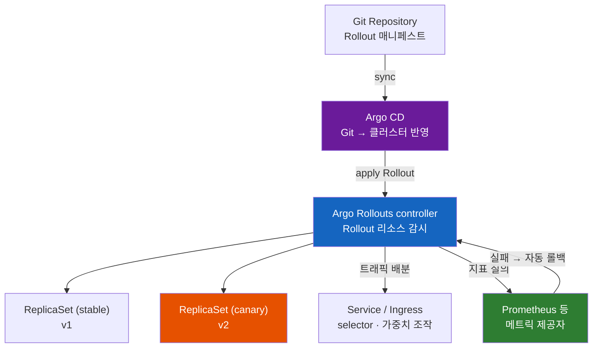
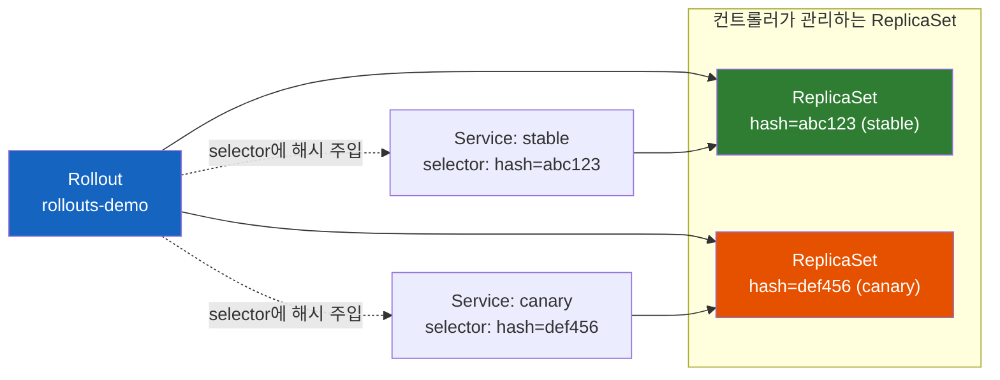
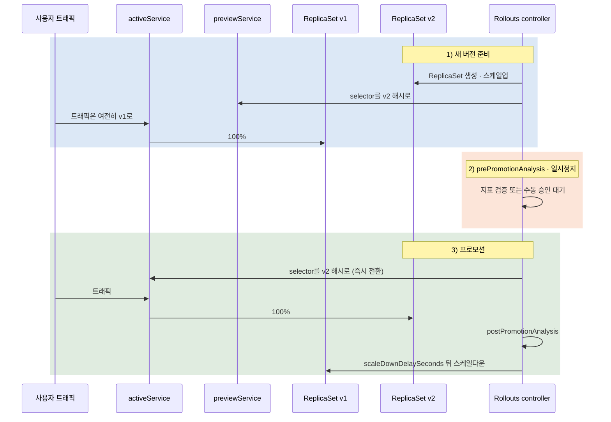
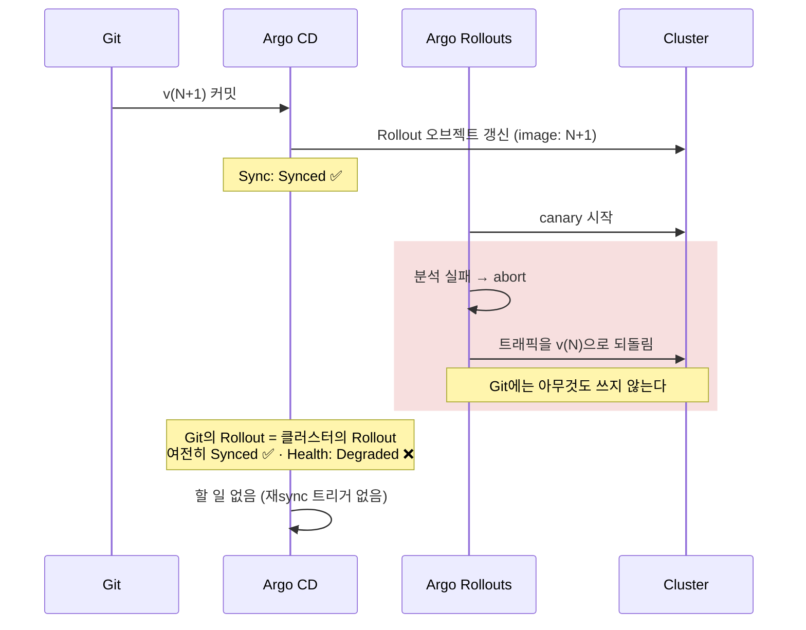

# ArgoCD에 Rollout은 없다 — Argo Rollouts가 Deployment를 대체하는 이유

"ArgoCD의 rollout 기능"이라는 말은 사실 두 번 틀렸다. Rollout은 ArgoCD의 기능이 아니고, 애초에 "기능"이 아니라 **리소스 종류** 다. 그럼 이건 뭐고, 쿠버네티스에서 무슨 자리를 차지하는가?

> 이 노트는 [ArgoCD가 Synced라고 하는데 왜 서비스는 죽어 있을까](ArgoCD가-Synced라고-하는데-왜-서비스는-죽어-있을까.md)의 자매편이다. 그 노트가 **"Git을 클러스터에 반영하는 층"** 을 다뤘다면, 이 노트는 그 아래 **"반영된 새 버전을 실제로 사용자에게 노출시키는 층"** 을 다룬다. 두 층은 자주 한 덩어리로 오해되지만, 만든 사람도 다르고 설치도 따로 하고 서로를 필요로 하지도 않는다.

---

## 결론부터 말하면

**Argo Rollouts는 ArgoCD의 기능이 아니라 같은 Argo 재단 아래 있는 별개 프로젝트다.** 공식 FAQ의 문장은 단호하다 — "Argo Rollouts는 **같은 클러스터에 ArgoCD가 설치되어 있을 것을 요구하지 않는다**." 별도로 설치하고, 별도의 컨트롤러가 돌고, ArgoCD 없이 Jenkins나 순수 `kubectl`만으로도 쓸 수 있다.

그리고 Argo Rollouts가 추가하는 것의 핵심은 **`Rollout`이라는 새로운 워크로드 리소스** 다. 이것은 쿠버네티스 `Deployment`를 **대체** 한다. 옆에 붙는 게 아니라 자리를 뺏는다.



두 도구가 하는 일이 완전히 다르다는 것을 한 줄로 요약하면 이렇다.

| 도구 | 질문 | 관심 대상 |
|------|------|-----------|
| **Argo CD** | Git에 적힌 것이 클러스터에 들어갔는가? | Git ↔ 클러스터의 차이 |
| **Argo Rollouts** | 방금 들어간 새 버전을 사용자에게 얼마나, 어떤 순서로 노출할 것인가? | ReplicaSet ↔ Service ↔ 지표 |

그래서 둘을 같이 쓰면 이렇게 이어진다. **Argo CD가 Git의 `Rollout` 매니페스트를 클러스터에 밀어 넣으면, 거기서부터는 Argo Rollouts 컨트롤러가 인수받아 카나리를 굴린다.** Git은 그 이후에 벌어지는 일을 전혀 모른다 — 이 사실이 6장에서 아주 중요해진다.

| | Deployment | Rollout |
|---|-----------|---------|
| 제공 주체 | 쿠버네티스 내장 (`apps/v1`) | Argo Rollouts CRD (`argoproj.io/v1alpha1`) |
| 배포 전략 | `RollingUpdate` · `Recreate` | `canary` · `blueGreen` (steps 생략 시 RollingUpdate 흉내) |
| 트래픽 비율 제어 | 없음 (Pod 개수가 곧 비율) | 있음 (Ingress · 서비스 메시 연동 시 정밀) |
| 배포 중간 정지 | 없음 | `pause` step, 무기한 또는 시간 지정 |
| 지표 기반 판정 | 없음 | `AnalysisTemplate` + 메트릭 제공자 |
| 실패 시 자동 롤백 | **없음** | 있음 (분석 실패 → abort) |

---

## 1. Deployment의 RollingUpdate는 무엇을 못 하는가

Argo Rollouts가 왜 존재하는지 이해하려면, 먼저 쿠버네티스 기본 `Deployment`가 배포 중에 실제로 무엇을 보고 있는지부터 봐야 한다.

`Deployment`의 기본 전략인 `RollingUpdate`는 새 Pod를 하나 띄우고 기존 Pod를 하나 내리는 식으로 점진 교체한다. 속도는 `maxSurge`와 `maxUnavailable`로 조절한다. 그런데 **"새 Pod가 괜찮은가"를 판단하는 기준이 딱 하나뿐이다 — readiness probe.** Pod가 Ready가 되면 컨트롤러는 다음 Pod로 넘어간다. (probe의 종류와 판정 시점은 [Kubernetes Probe: Liveness, Readiness, Startup](../kubernetes/Kubernetes-Probe-Liveness-Readiness-Startup.md)에서 다뤘다.)

### 1.1 probe를 통과하는 나쁜 버전

여기서 문제가 생긴다. 다음과 같은 배포를 상상해 보자.

```yaml
readinessProbe:
  httpGet:
    path: /healthz    # 프로세스가 살아 있으면 200을 준다
    port: 8080
```

새로 배포한 v2에 결제 로직 버그가 있어서 `POST /orders`가 5xx를 뿜고 있다. 하지만 `/healthz`는 여전히 200이다. 프로세스는 멀쩡히 살아 있으니까.

`Deployment` 입장에서 이 Pod는 **완벽하게 Ready** 다. 그래서 다음 Pod로 넘어가고, 또 넘어가고, 몇 분 뒤 100%가 v2로 바뀐다. 그 사이에 아무도 배포를 멈추지 않았고, 아무도 롤백하지 않았다. 에러율 그래프가 치솟는 것을 사람이 보고 손으로 `kubectl rollout undo`를 칠 때까지.

**readiness probe는 "이 Pod가 요청을 받을 준비가 됐는가"를 묻지, "이 버전이 좋은 버전인가"를 묻지 않는다.** 이 간극이 Argo Rollouts가 태어난 자리다.

### 1.2 `progressDeadlineSeconds`도 롤백해 주지 않는다

"그래도 배포가 안 끝나면 실패로 잡히지 않나?"라는 생각이 들 수 있다. `progressDeadlineSeconds`(기본 600초)를 넘기면 Deployment는 `Progressing=False`, `reason: ProgressDeadlineExceeded` 조건을 단다.

하지만 **거기까지다. 자동 롤백은 일어나지 않는다.** 상태 필드에 실패를 적어놓을 뿐, 트래픽은 그대로 흐른다. 그리고 애초에 1.1의 시나리오에서는 Pod가 전부 Ready였으므로 deadline에 걸리지도 않는다.

> **자주 보이는 오해 하나를 짚어두면** — "ArgoCD 같은 GitOps 도구를 쓰면 자동 롤백된다"는 설명이 종종 보이는데, 정확하지 않다. Argo **CD** 는 Git에 적힌 것을 집행하는 도구이므로, Git에 v2가 적혀 있는 한 v2를 유지한다. 오히려 손으로 되돌려도 다음 reconcile에 다시 v2로 끌려간다. 지표를 보고 자동으로 되돌리는 것은 Argo **Rollouts** 의 일이다. 이름이 비슷해서 자주 뒤섞인다.

### 1.3 트래픽 비율이라는 개념 자체가 없다

또 하나. `Deployment`에는 "새 버전에 트래픽 5%만 주고 30분 지켜보자"를 표현할 방법이 없다. Service는 자기 selector에 걸리는 모든 Pod에 균등하게 나눠줄 뿐이다. 5%를 만들려면 Pod 20개 중 1개를 v2로 만들어야 하는데, 그건 배포 진행도이지 트래픽 정책이 아니다.

정리하면 `Deployment`에 없는 것은 세 가지다 — **관찰할 시간(pause)**, **판단할 근거(metrics)**, **되돌릴 손(auto rollback)**.

---

## 2. Rollout — Deployment의 자리를 뺏는 CRD

Argo Rollouts는 이 셋을 채우기 위해 쿠버네티스 API를 확장한다. CRD로 새 리소스 종류를 등록하고, 그것을 감시하는 컨트롤러를 띄우는 전형적인 Operator 패턴이다([쿠버네티스는 어떻게 자기 자신을 확장할까 — CRD와 컨트롤러 그리고 Operator](../kubernetes/쿠버네티스는-어떻게-자기-자신을-확장할까-CRD와-컨트롤러-그리고-Operator.md)).

설치하면 CRD 다섯 개가 생긴다. 역할로 묶으면 세 덩어리다.

| CRD | 역할 |
|-----|------|
| `Rollout` | Deployment를 대체하는 워크로드 리소스. 이 노트의 주인공 |
| `AnalysisTemplate` | "어떤 지표를 어떤 기준으로 볼 것인가"의 정의 (namespace 범위) |
| `ClusterAnalysisTemplate` | 같은 정의의 클러스터 범위 버전 |
| `AnalysisRun` | 그 정의를 실제로 실행한 인스턴스. Job과 Pod의 관계에 가깝다 |
| `Experiment` | 여러 버전을 임시로 동시에 띄워 비교하는 일회성 실행 |

```bash
kubectl get crd | grep argoproj.io
# analysisruns.argoproj.io
# analysistemplates.argoproj.io
# clusteranalysistemplates.argoproj.io
# experiments.argoproj.io
# rollouts.argoproj.io
```

### 2.1 마이그레이션은 세 줄이다

`Deployment`에서 `Rollout`으로 옮기는 데 바꿔야 하는 필드는 공식 문서 기준 딱 세 개다.

```yaml
apiVersion: argoproj.io/v1alpha1   # 1) apps/v1 에서 변경
kind: Rollout                       # 2) Deployment 에서 변경
metadata:
  name: rollouts-demo
spec:
  replicas: 5
  selector:
    matchLabels:
      app: rollouts-demo
  template:                         # 이하 Pod 템플릿은 그대로
    metadata:
      labels:
        app: rollouts-demo
    spec:
      containers:
        - name: rollouts-demo
          image: argoproj/rollouts-demo:blue
          ports:
            - containerPort: 8080
  strategy:                         # 3) rollingUpdate/recreate 에서 변경
    canary:
      steps:
        - setWeight: 20
        - pause: {}
```

`spec.template` 이하는 `Deployment`와 완전히 동일하다. 그래서 "drop-in replacement"라고 불린다. `replicas`, `selector`, `minReadySeconds`, `revisionHistoryLimit`, `progressDeadlineSeconds` 같은 필드도 그대로 있다.

> **주의:** 이미 프로덕션 트래픽을 받고 있는 `Deployment`를 옮길 때는, 공식 문서가 **기존 Deployment를 지우기 전에 Rollout을 나란히 띄워 두라** 고 경고한다. 같은 이름으로 kind만 바꿔 `kubectl apply`하면 그 순간 Pod가 전부 사라졌다가 다시 뜬다. 다운타임이다.

### 2.2 컨트롤러가 실제로 조작하는 것: ReplicaSet과 Service selector

여기서 `Rollout`이 "마법"이 아니라는 것을 짚고 넘어갈 필요가 있다. Argo Rollouts 컨트롤러는 새로운 종류의 Pod를 만들지 않는다. **평범한 ReplicaSet을 만들고, 평범한 Service의 selector를 고친다.** 그게 전부다.

구체적으로는 이렇다. 컨트롤러는 각 ReplicaSet에 `rollouts-pod-template-hash`라는 라벨을 붙여 버전을 식별한다(`Deployment`가 쓰는 `pod-template-hash`와 이름이 한 글자 다른, 별개의 라벨이다). 그리고 Service의 selector에 그 해시를 끼워 넣거나 빼면서 "이 Service는 지금 어느 버전으로 간다"를 제어한다.



이 사실에서 실무적인 규칙 하나가 나온다. **이 ReplicaSet들을 손으로 건드리지 마라.** 공식 아키텍처 문서가 명시적으로 경고한다 — 컨트롤러가 완전히 자동으로 관리하는 대상이고, 외부 도구로 조작하면 상태가 어긋난다.

비슷하게, 컨트롤러가 수정한 Service와 Ingress에는 `argo-rollouts.argoproj.io/managed-by-rollouts` annotation이 붙는다. Rollout이 삭제될 때 그 리소스들을 원래 상태로 되돌리기 위한 표식이다.

### 2.3 Rollouts는 평범한 Deployment를 절대 건드리지 않는다

도입을 고민할 때 가장 먼저 나오는 질문 — "클러스터 전체에 영향이 가지 않을까?"

가지 않는다. 공식 문서의 표현은 이렇다. **"Argo Rollouts는 일반 Deployment 리소스에서 일어나는 어떤 변화에도 개입하거나 반응하지 않는다."** 컨트롤러는 오직 `kind: Rollout`인 오브젝트만 본다.

그래서 서비스 하나만 먼저 `Rollout`으로 바꿔보고 나머지는 `Deployment`로 두는 점진적 도입이 자연스럽게 가능하다.

### 2.4 Deployment를 지우기 싫다면 — workloadRef

그래도 `kind`를 바꾸는 것이 부담스러운 조직이 있다. Helm chart가 `Deployment`를 전제로 짜여 있거나, 다른 도구가 그 `Deployment`를 참조하고 있을 수 있다.

이 경우 `workloadRef`로 **기존 Deployment를 그대로 두고 참조** 할 수 있다.

```yaml
apiVersion: argoproj.io/v1alpha1
kind: Rollout
metadata:
  name: rollout-ref-deployment
spec:
  replicas: 5
  selector:
    matchLabels:
      app: rollout-ref-deployment
  workloadRef:                      # Pod 템플릿을 여기서 빌려온다
    apiVersion: apps/v1
    kind: Deployment
    name: rollout-ref-deployment
    scaleDown: onsuccess            # never | onsuccess | progressively
  strategy:
    canary:
      steps:
        - setWeight: 20
        - pause: {duration: 10s}
```

`Rollout`에 `template` 대신 `workloadRef`를 쓰면 Pod 스펙을 그 Deployment에서 가져온다. 배포는 **Deployment의 Pod 템플릿을 수정하는 것** 으로 트리거된다. `scaleDown`은 원본 Deployment를 언제 0으로 줄일지 정한다.

| `scaleDown` | 동작 |
|-------------|------|
| `never` | 줄이지 않는다 (직접 0으로 설정해 두는 경우) |
| `onsuccess` | Rollout이 Healthy가 된 뒤 줄인다 |
| `progressively` | Rollout이 커지는 만큼 줄인다. Rollout이 실패하면 다시 늘린다 |

---

## 3. Blue-Green — Service selector를 갈아끼우는 일

이제 두 전략을 본다. 전략 자체의 개념(왜 Blue/Green인지, 왜 Canary인지)은 [Kubernetes Deployment Strategy](../kubernetes/Kubernetes-Deployment-Strategy.md)에서 이미 다뤘으므로, 여기서는 **Argo Rollouts가 그것을 어떻게 구현하는가** 와 **거기서 발이 걸리는 지점** 에 집중한다.

Blue-Green에서 컨트롤러가 조작하는 것은 두 개의 Service다.

```yaml
strategy:
  blueGreen:
    activeService: rollout-bluegreen-active     # 필수. 실서비스 트래픽
    previewService: rollout-bluegreen-preview   # 선택. 새 버전 검증용
    autoPromotionEnabled: false
```

`activeService`는 실사용자 트래픽을 받는 Service이고, `previewService`는 새 버전에만 연결되는 Service다. 컨트롤러가 각 Service의 selector에 ReplicaSet 해시를 주입해서 이 구분을 만든다. **프로모션이란 결국 `activeService`의 selector를 새 해시로 바꾸는 한 번의 동작** 이다.

### 3.1 전체 순서



각 단계에 붙는 옵션들은 이렇다.

| 필드 | 기본값 | 의미 |
|------|--------|------|
| `autoPromotionEnabled` | **`true`** | 새 ReplicaSet이 준비되면 자동으로 프로모션 |
| `autoPromotionSeconds` | 0 | 자동 프로모션을 이만큼 지연시킨다. preview ReplicaSet이 완전히 available해진 시점부터 카운트다운 |
| `previewReplicaCount` | nil (= `spec.replicas`) | preview 스택을 몇 개만 띄울지. 리소스 절약용 |
| `prePromotionAnalysis` | nil | 트래픽 전환 **전** 검증. 실패하면 전환하지 않고 중단 |
| `postPromotionAnalysis` | nil | 트래픽 전환 **후** 검증. 실패하면 다시 v1로 되돌린다 |
| `scaleDownDelaySeconds` | **30** | 프로모션 후 구 ReplicaSet을 얼마나 늦게 줄일지 |
| `scaleDownDelayRevisionLimit` | nil (= 전부 유지) | 스케일다운 대기 중인 구 ReplicaSet을 몇 개까지 남길지 |

`autoPromotionSeconds`에는 함정이 하나 숨어 있다. **이 값은 `autoPromotionEnabled`가 켜져 있을 때만 동작한다.** `false`로 꺼 두면 조용히 무시되고 수동 `promote`를 무기한 기다린다(API 타입 주석이 "This option is ignored if autoPromotionEnabled is set to false"로 명시하고, 컨트롤러의 pause 판정 코드도 자동 프로모션이 켜진 경우에만 카운트다운 분기를 탄다).

즉 이 필드는 **자동 프로모션을 켠 채 유예 시간을 주는 용도** 이지, 수동 게이트에 타임아웃을 얹는 용도가 아니다. "사람이 5분 안에 승인하지 않으면 자동으로 넘어가게 하겠다"는 의도로 `autoPromotionEnabled: false` + `autoPromotionSeconds: 300`을 함께 적으면 아무 일도 일어나지 않는다.

### 3.2 함정 1: `autoPromotionEnabled`의 기본값은 `true`다

Blue-Green을 도입하는 대부분의 이유는 **"전환 전에 사람이 확인하고 싶어서"** 다. 그런데 아무 설정 없이 `blueGreen:`만 쓰면 정확히 그 기대가 배신당한다.

```yaml
strategy:
  blueGreen:
    activeService: my-app-active
    previewService: my-app-preview
    # autoPromotionEnabled 를 안 적었다
```

새 ReplicaSet이 Ready가 되는 순간 자동으로 프로모션된다. preview에서 확인할 틈이 없다. 수동 게이트를 원한다면 **명시적으로 `autoPromotionEnabled: false`** 를 적어야 한다.

이 상태에서 진행시키는 명령은 CLI 플러그인의 `promote`다.

```bash
kubectl argo rollouts promote my-app          # 다음 단계로
kubectl argo rollouts promote my-app --full   # 남은 단계를 전부 건너뛰고 완료
kubectl argo rollouts abort my-app            # 중단하고 stable로 되돌림
kubectl argo rollouts get rollout my-app -w   # 진행 상황을 트리로 관찰
```

### 3.3 함정 2: `scaleDownDelaySeconds`를 줄이면 요청이 샌다

기본값이 왜 하필 30초일까? 공식 문서의 설명이 명확하다. **Service의 selector를 바꿔도 모든 노드의 iptables가 즉시 갱신되지 않기 때문** 이다. 전파가 끝나기 전에 구 Pod를 죽이면, 아직 갱신되지 않은 노드가 그 Pod로 패킷을 보내고 요청이 실패한다.

그래서 문서는 최소 30초를 권장한다. 리소스가 아깝다고 5초로 줄이면 배포 때마다 소량의 에러가 섞이고, 원인을 찾기가 아주 어렵다.

### 3.4 fast rollback — 30초 안에 되돌리면 다르게 동작한다

`scaleDownDelay` 동안 구 ReplicaSet이 살아 있다는 사실이 롤백에서 이점이 된다. 컨트롤러는 구 ReplicaSet에 `argo-rollouts.argoproj.io/scale-down-deadline` annotation으로 남은 시간을 기록해 두는데, **그 시간이 지나기 전에 예전 매니페스트를 다시 적용하면 컨트롤러는 "fast rollback" 경로를 탄다.**

이 경로에서는 정상 배포 절차를 밟지 않는다. `activeService`의 selector를 구 ReplicaSet 해시로 즉시 되돌리고 스케일다운 annotation을 제거한다. 새 버전을 띄우는 모든 과정이 생략되므로 거의 즉시 복구된다.

반대로 deadline이 이미 지나 구 ReplicaSet이 0으로 줄어든 뒤라면, 그 예전 버전은 컨트롤러에게 그냥 "새로운 버전"일 뿐이다. 스케일업부터 분석까지 전 과정을 다시 밟는다. **롤백 속도가 30초를 기점으로 극적으로 갈린다.**

---

## 4. Canary — 트래픽 라우터가 있느냐 없느냐가 전부다

Canary 전략은 `steps` 목록으로 표현한다. 컨트롤러는 이 목록을 위에서부터 하나씩 실행하고, 전부 끝나야 새 ReplicaSet을 stable로 승격한다.

```yaml
spec:
  replicas: 10
  strategy:
    canary:
      maxSurge: '25%'
      maxUnavailable: 0
      steps:
        - setWeight: 10
        - pause: {duration: 1h}
        - setWeight: 20
        - pause: {}              # 무기한 정지. promote 해야 진행
```

`pause`의 시간 단위는 `s`/`m`/`h`이고, 숫자만 쓰면 초다. `pause: {}`처럼 `duration`을 생략하면 **무기한** 정지하며, `kubectl argo rollouts promote`로만 풀린다.

### 4.1 트래픽 라우터가 없으면 "가중치"는 근사치다

여기가 Canary를 제대로 이해하는 데 가장 중요한 지점이다.

`trafficRouting`을 설정하지 않은 기본 Canary에서, 컨트롤러는 트래픽을 직접 나눌 방법이 없다. 그래서 **Pod 개수로 비율을 흉내 낸다.** replicas가 10이고 `setWeight: 10`이면 canary ReplicaSet을 1개, stable을 9개로 맞춘다. 실제 트래픽 분배는 kube-proxy의 평범한 Service 라우팅이 알아서 한다.

그럼 `setWeight: 41`이면? 공식 문서가 규칙을 명시한다 — **가장 작은 오차를 만드는 정수를 고르고, 오차가 같으면 올림한다.** 10개 중 41%는 4/10(0.1 오차)이 5/10(0.9 오차)보다 가까우므로 canary 4개, stable 6개다. 즉 **실제 비율은 40%** 다.

replicas가 4개라면 표현 가능한 비율은 0%, 25%, 50%, 75%, 100%뿐이다. `setWeight: 5`를 적어도 실제로는 25%가 나간다. **소규모 서비스에서 "5% 카나리"를 하려면 트래픽 라우터가 필수** 라는 결론이 여기서 나온다.

```yaml
strategy:
  canary:
    canaryService: my-app-canary     # canary Pod만 선택하는 Service
    stableService: my-app-stable     # stable Pod만 선택하는 Service
    trafficRouting:
      nginx:
        stableIngress: my-app-ingress
    steps:
      - setWeight: 5                 # 이제 진짜 5%
      - pause: {duration: 10m}
```

`trafficRouting`을 쓰면 컨트롤러가 Ingress나 서비스 메시의 리소스를 직접 수정해서 가중치를 만든다. 지원 대상은 NGINX, AWS ALB, Istio, Traefik, Kong, APISIX, Ambassador, SMI, Google Cloud 등이고 플러그인으로 확장할 수 있다. Gateway API도 플러그인으로 지원된다.

라우터가 붙으면 가중치 외의 것도 가능해진다. 특정 헤더를 가진 요청만 canary로 보내는 `setHeaderRoute`, 트래픽을 복제해서 canary에도 흘려보내되 응답은 버리는 `setMirrorRoute` 같은 step이 그것이다.

공식 문서의 비교표가 세 접근의 차이를 잘 정리한다.

| | Blue/Green | Basic Canary | Canary + 트래픽 매니저 |
|---|---|---|---|
| 도입 복잡도 | 낮음 | 중간 | 높음 |
| 유연성 | 낮음 | 높음 | 최대 |
| 트래픽 제공자 필요 | 아니오 | 아니오 | **예** |
| 큐 워커에서 동작 | **예** | 아니오 | 아니오 |
| 공유·잠금 자원과 병행 | **예** | 아니오 | 아니오 |
| 트래픽 전환 | 전부 아니면 전무 | 점진적 비율 | 점진적 비율 |
| 트래픽 제어 정밀도 | 0% 또는 100% | 거침 | 정밀 |
| 비율을 결정하는 것 | 배포 상태 | canary Pod 개수 | 임의의 분배 규칙 |
| 실패 시 영향 범위 | **전면적** | 낮음 | 낮음 |

문서의 권고는 "Blue/Green으로 시작해서, 지표와 애플리케이션에 자신이 생기면 Canary로 넘어가라"이다. 특히 **큐에서 작업을 가져오는 워커** 는 Canary가 사실상 불가능하다. 트래픽이 HTTP로 들어오지 않으니 라우터가 개입할 지점이 없고, canary Pod도 큐에서 마음대로 작업을 가져간다.

### 4.2 함정: `setCanaryScale`과 `setWeight`를 같이 쓸 때

트래픽 라우터를 쓰면 "트래픽 비율"과 "canary Pod 개수"가 분리된다. 기본적으로 컨트롤러는 둘을 맞춰주지만, `setCanaryScale`로 따로 지정할 수 있다.

문제는 이 둘을 잘못 조합했을 때다. 공식 문서가 직접 제시하는 사고 사례가 이렇다.

```yaml
spec:
  replicas: 10
  strategy:
    canary:
      steps:
        - setCanaryScale:
            weight: 10        # canary Pod는 1개 (전체의 10%)
        - setWeight: 90       # 그런데 트래픽의 90%를 보낸다
        - pause: {}
```

**전체 트래픽의 90%가 Pod 1개로 쏟아진다.** 그 Pod는 즉시 죽는다. `setCanaryScale`을 명시값으로 쓰면 이후 `setWeight`가 Pod 개수를 따라오지 않게 되기 때문이다. 되돌리려면 `setCanaryScale: {matchTrafficWeight: true}`를 넣어야 한다.

### 4.3 리소스가 두 배로 드는 이유와 `dynamicStableScale`

트래픽 라우팅을 쓰는 Canary에서 stable ReplicaSet은 기본적으로 **업데이트 내내 100%로 유지된다.** canary가 늘어나도 stable이 줄지 않으므로, 배포 막바지에는 Pod가 거의 두 배가 된다. Blue-Green과 비슷한 비용이 드는 셈이다.

이건 버그가 아니라 의도된 설계다. abort가 발생했을 때 지연 없이 즉시 stable로 트래픽을 되돌릴 수 있기 때문이다. 리소스가 아깝다면 v1.1부터 있는 옵션으로 끌 수 있다.

```yaml
strategy:
  canary:
    dynamicStableScale: true        # canary가 커지는 만큼 stable을 줄인다
    abortScaleDownDelaySeconds: 600 # abort 시 canary를 남겨두는 시간 (기본 30, 0이면 안 줄임)
```

트레이드오프는 명확하다. **비용을 아끼는 대신 abort 복구가 느려진다.** stable을 다시 스케일업하는 시간만큼 지연된다.

### 4.4 그래서 Rollouts는 RollingUpdate를 지원하는가

공식 문서 두 페이지가 서로 다르게 말해서 혼란스러운 지점이다. Concepts 페이지는 "Argo Rollouts는 Blue-Green과 Canary만 지원한다"고 하고, FAQ는 "BlueGreen, Canary, Rolling Update를 지원한다"고 한다.

정답은 Canary 페이지에 있다. **`steps` 필드를 생략하면 canary 전략이 RollingUpdate처럼 동작한다.** 이때는 `maxSurge`와 `maxUnavailable`만으로 진행되며, `Deployment`의 롤링 업데이트와 사실상 같다. 즉 "별도 전략으로 존재하지는 않지만 canary의 축약형으로 표현된다"가 정확한 서술이다. `Recreate`는 지원하지 않는다.

---

## 5. Analysis — "자동 롤백"의 실체

앞의 두 장은 **어떻게 노출할지** 를 다뤘다. 하지만 진짜 가치는 그 다음이다. `pause: {duration: 10m}`을 걸어두고 사람이 그래프를 보는 것과, 컨트롤러가 지표를 직접 보고 판단하는 것은 다른 얘기다.

### 5.1 AnalysisTemplate과 AnalysisRun

`AnalysisTemplate`은 **어떤 지표를 어떤 기준으로 볼 것인가** 를 정의한다. `AnalysisRun`은 그것이 실제로 돌아가는 인스턴스다. `Job`과 그 Pod의 관계, 혹은 클래스와 객체의 관계에 가깝다.

```yaml
apiVersion: argoproj.io/v1alpha1
kind: AnalysisTemplate
metadata:
  name: success-rate
spec:
  args:
    - name: service-name              # Rollout에서 값을 주입받는다
  metrics:
    - name: success-rate
      interval: 1m                    # 1분마다 측정. 생략하면 단 한 번만 측정
      count: 5                        # 5회 측정. 생략하면 무기한
      successCondition: result[0] >= 0.95
      failureLimit: 3                 # 실패 3회 누적되면 분석 실패
      provider:
        prometheus:
          address: http://prometheus.monitoring:9090
          query: |
            sum(rate(http_requests_total{service="{{args.service-name}}",code!~"5.."}[5m]))
            / sum(rate(http_requests_total{service="{{args.service-name}}"}[5m]))
```

`ClusterAnalysisTemplate`은 같은 정의를 클러스터 전역에서 공유하는 버전이다. "5xx 비율 1% 미만"처럼 조직 표준으로 쓸 기준을 한 번만 정의하고 모든 팀이 참조하게 할 때 쓴다.

메트릭 제공자는 Prometheus 외에 Datadog, New Relic, CloudWatch, Graphite, InfluxDB, Wavefront, SkyWalking, Kayenta가 내장이고 플러그인으로 확장한다. **그리고 지표가 없어도 쓸 수 있다** — `Job` provider는 컨테이너를 하나 실행해서 종료 코드로 판정하고, `Web` provider는 임의의 HTTP 엔드포인트를 호출해 응답으로 판정한다. 스모크 테스트 스위트를 이미지에 담아 `Job` 분석으로 돌리는 것이 흔한 패턴이다.

### 5.2 두 가지 실행 방식

분석을 붙이는 자리가 두 군데다. 이 구분이 실제 동작을 꽤 바꾼다.

```yaml
strategy:
  canary:
    # (A) background analysis — 배포 전체에 걸쳐 계속 돈다
    analysis:
      templates:
        - templateName: success-rate
      args:
        - name: service-name
          value: guestbook-svc.default.svc.cluster.local
      startingStep: 2        # 3번째 step부터 시작

    steps:
      - setWeight: 20
      - pause: {duration: 10m}
      # (B) inline analysis step — 이 지점에서 한 번 돌고 통과해야 다음으로
      - analysis:
          templates:
            - templateName: smoke-test
      - setWeight: 40
```

**(A) background** 는 배포가 진행되는 내내 백그라운드에서 계속 측정한다. 어느 순간이든 실패 판정이 나면 즉시 abort된다. `startingStep`으로 시작 시점을 늦출 수 있다 — 카나리 Pod가 아직 워밍업 중일 때의 나쁜 수치로 오판하는 것을 막는 용도다.

**(B) inline step** 은 그 자리에서 실행되고 끝날 때까지 다음 step으로 넘어가지 않는다. 게이트에 가깝다.

Blue-Green에서는 `prePromotionAnalysis`(전환 전 게이트)와 `postPromotionAnalysis`(전환 후 감시)로 나뉜다.

### 5.3 실패, 에러, 그리고 판단 보류

분석 결과는 성공/실패의 이분법이 아니다. 세 가지가 구분되고, 각각 다른 결과를 낳는다.

| 결과 | 정의 | Rollout의 반응 |
|------|------|----------------|
| **Failure** | `failureCondition`이 참이거나, failureCondition 없이 `successCondition`이 거짓 | `failureLimit` 초과 시 **abort** |
| **Error** | 컨트롤러가 측정 자체를 못 함 (Prometheus URL 오류, 타임아웃 등) | `consecutiveErrorLimit` 초과 시 abort |
| **Inconclusive** | 성공/실패를 판정할 수 없음 | `inconclusiveLimit` 초과 시 **일시정지** (롤백 아님) |

이 구분이 중요한 이유는 **"Prometheus가 잠깐 죽은 것"과 "우리 앱이 에러를 뿜는 것"이 같은 취급을 받으면 안 되기 때문** 이다. 전자는 Error로 분류되어 별도 한도를 갖는다.

abort가 발생하면 컨트롤러는 canary 가중치를 0으로 되돌리고 Rollout을 `Degraded`로 표시한다. 이것이 앞에서 말한 "자동 롤백"의 실체다 — **Git을 되돌리는 것이 아니라, 클러스터의 트래픽을 stable로 되돌리는 것** 이다.

### 5.4 Experiment — 배포와 무관한 임시 비교

`Experiment` CRD는 조금 다른 물건이다. **여러 버전을 임시로 동시에 띄워서 비교하고, 끝나면 치운다.**

```yaml
apiVersion: argoproj.io/v1alpha1
kind: Experiment
spec:
  duration: 20m
  templates:
    - name: baseline
      replicas: 1
      # ... v1 Pod 스펙
    - name: canary
      replicas: 1
      # ... v2 Pod 스펙
  analyses:
    - name: compare-results
      templateName: mann-whitney
      requiredForCompletion: true
```

전형적인 용도는 Kayenta 스타일의 통계 비교다. 같은 조건에서 baseline과 canary를 나란히 돌리고 지표 분포를 비교한다. 프로덕션 트래픽을 받지 않는 별도 라벨로 띄워서 부하 테스트만 돌릴 수도 있다. `Rollout`의 canary step 안에서 `experiment:`로 호출하는 것도 가능하다.

---

## 6. 그래서 ArgoCD와는 무슨 사이인가

이제 처음의 오해로 돌아간다.

### 6.1 서로를 필요로 하지 않는다

FAQ가 정리하는 관계는 이렇다.

- Argo Rollouts는 **독립 프로젝트** 다. ArgoCD가 없어도 완전히 동작한다.
- **GitOps를 하지 않아도 된다.** Rollouts는 매니페스트가 어떻게 바뀌었는지에 관심이 없다. Git 커밋이든, Jenkins가 친 `kubectl apply`든, 사람이 손으로 고친 것이든 똑같이 반응한다.
- 반대로 ArgoCD도 Rollouts 없이 잘 돈다. 그냥 `Deployment`를 sync할 뿐이다.

### 6.2 연결되는 지점: Health 판정과 Resource Action

그럼에도 둘을 같이 쓰는 이유가 있다. ArgoCD는 `Rollout` 리소스를 **이해** 한다.

[ArgoCD 노트 2.4절](ArgoCD가-Synced라고-하는데-왜-서비스는-죽어-있을까.md)에서 다뤘듯, ArgoCD는 리소스 종류별로 Health 판정 로직을 갖는다. CRD의 경우 기본적으로는 판정하지 못하지만, ArgoCD에는 `Rollout`용 Lua health check가 **기본 내장** 되어 있다. 그래서 Rollout의 상태가 ArgoCD 대시보드에 그대로 나타난다.

| Rollout 상태 | ArgoCD Health |
|--------------|---------------|
| 배포 진행 중 | `Progressing` |
| `pause`에서 대기 중 | **`Suspended`** |
| abort되어 stable로 돌아감 | `Degraded` |
| 완료 | `Healthy` |

`Suspended`가 특히 유용하다. **"카나리 20%에서 사람의 승인을 기다리는 중"이 ArgoCD Application 화면에 그대로 뜬다.** 그리고 ArgoCD의 Resource Action(Lua 기반)으로 UI에서 바로 `resume`이나 `restart`를 실행할 수 있다. CLI로도 된다.

```bash
argocd app actions run <app> resume --kind Rollout --resource-name my-app
```

### 6.3 롤백해도 Git은 안 바뀐다 — 무한 루프가 없는 이유

여기가 두 도구를 같이 쓸 때 가장 자주 나오는 질문이다. **"Rollouts가 롤백하면 ArgoCD가 다시 새 버전으로 되돌리고, 또 롤백하고... 무한 루프 아닌가?"**

아니다. 열쇠는 **Argo Rollouts가 Git에 아무것도 쓰지 않는다** 는 사실이다. 애초에 Git이라는 것의 존재를 모른다. FAQ가 제시하는 순서는 이렇다.



핵심은 **`Rollout` 오브젝트 자체는 여전히 v(N+1)을 가리키고 있다** 는 것이다. Rollouts가 되돌린 것은 ReplicaSet의 스케일과 Service의 selector이지 `Rollout`의 spec이 아니다. Git과 클러스터의 `Rollout` 매니페스트는 완전히 일치하므로 ArgoCD는 `Synced`를 유지하고, 아무 조치도 하지 않는다. 다만 Health는 `Degraded`다.

즉 최종 상태는 이렇다. **클러스터는 v(N)으로 정상 서비스 중, Git은 v(N+1), 대시보드는 Degraded.** 다운타임은 없고, 개발자는 원인을 고쳐서 v(N+2)를 roll forward하면 된다. GitOps를 엄격히 지키자면 이것이 정석이다.

여기서 파생되는 정리 하나 — **ArgoCD의 롤백과 Rollouts의 롤백은 완전히 다른 것이다.** ArgoCD 롤백은 클러스터를 예전 Git 해시로 되돌리는 것이고, Rollouts 롤백은 트래픽을 stable ReplicaSet으로 되돌리는 것이다. Rollouts를 쓰고 있다면 보통 ArgoCD 롤백 명령은 쓸 일이 없다.

### 6.4 ArgoCD와 결정적으로 다른 점: 중앙 집중이 안 된다

ArgoCD는 하나의 인스턴스가 여러 원격 클러스터를 관리할 수 있다. Argo Rollouts는 **불가능하다.**

이유는 구조적이다. `Rollout`은 CRD이므로 그 CRD가 등록되지 않은 클러스터에서는 존재할 수 없는 리소스다. 따라서 **Rollout 워크로드를 돌릴 모든 클러스터에 CRD와 컨트롤러를 각각 설치해야 한다.** 멀티 클러스터 운영이라면 설치 대상이 클러스터 수만큼 늘어난다.

컨트롤러 자체는 HA로 띄울 수 있다. `--leader-elect` 플래그를 주고 replica를 늘리면 leader election으로 하나만 활성화된다.

---

## 7. 언제 쓰지 말아야 하는가

기능 목록보다 이쪽이 도입 판단에 더 유용하다. 공식 Best Practices 문서가 명시적으로 걸러내는 경우들이다.

### 7.1 두 버전이 동시에 못 도는 애플리케이션

Canary와 Blue-Green 모두 **일정 시간 두 버전이 공존** 한다. 그래서 문서는 도입 전에 애플리케이션 개발자에게 이것부터 확인하라고 한다.

- **공유 자원에 쓰는 앱** — 같은 파일에 기록하거나 잠금을 잡는 구조라면 문제가 생긴다.
- **큐에서 작업을 가져오는 워커** — 소스 코드 수정 없이는 거의 동작하지 않는다. Canary는 사실상 불가능하고, Blue-Green은 가능하다.
- **DB 스키마 변경이 따르는 배포** — 구 버전과 신 버전이 같은 스키마 위에서 동시에 돌아야 하므로 하위 호환이 필수다.

### 7.2 인프라 컴포넌트에는 쓰지 말 것

문서는 대문자로 **NOT** 을 쓴다. cert-manager, nginx, coredns, sealed-secrets 같은 인프라 성격의 애플리케이션에 Argo Rollouts를 쓰는 것은 **권장되지 않는다.**

### 7.3 프리뷰 환경 용도가 아니다

PR마다 임시 환경을 띄우고 싶다면 그건 Rollouts의 일이 아니라 **ArgoCD의 Pull Request generator** 의 일이다([ArgoCD 노트 6.1절](ArgoCD가-Synced라고-하는데-왜-서비스는-죽어-있을까.md)). `previewService`라는 이름 때문에 헷갈리기 쉬운데, 성격이 전혀 다르다.

### 7.4 며칠씩 두 버전을 굴리는 용도가 아니다

이게 가장 자주 어긋나는 기대다. 문서의 권고는 **"15~20분, 길어야 1~2시간짜리 배포"** 다. 새 버전을 며칠 또는 몇 주 돌려보고 판단하고 싶다면 Argo Rollouts는 맞는 도구가 아니다.

이유는 병렬 릴리스가 길어지면 답이 갈리는 질문들이 생기기 때문이다. 문서가 드는 예 — 1.3이 stable이고 1.4가 preview인 상태로 일주일이 지났는데 누군가 1.5를 배포했다. 새 상태는 "1.3 stable + 1.5 preview"인가, "1.4 stable + 1.5 preview"인가? 그리고 1.5도 실패하면 1.3으로 가야 하는가 1.4로 가야 하는가?

**Argo Rollouts는 항상 첫 번째 답을 택한다.** 즉 stable은 1.3이고, 롤백 대상도 1.3이다. 중간의 preview들은 "뭔가 문제가 있었던 버전"으로 간주된다. 이 가정이 불편하다면 사용 방식이 설계 의도와 어긋난 것이다. 마찬가지로 1.1, 1.2, 1.3을 동시에 굴리는 시나리오도 설계 범위 밖이다 — **컨트롤러는 언제나 stable 하나와 preview 하나만 가정한다.**

### 7.5 지표가 없으면 가치의 절반이 사라진다

문서의 표현이 직설적이다. "지금 배포하고 나서 사람이 2시간 동안 로그와 지표를 들여다보고 있다면, Argo Rollouts를 도입해도 자동화에 큰 도움이 되지 않는다."

**목표는 완전 자동 배포** 이고, 수동 pause와 수동 promote는 실험과 테스트를 위한 보조 수단이라는 것이 프로젝트의 입장이다. 5~15분 안에 배포 성공 여부를 말해주는 지표를 먼저 갖추고, dry-run으로 검증한 뒤 프로덕션에 적용하라는 순서를 권한다.

---

## 8. 운영에서 걸리는 것들

### 8.1 첫 배포에는 전략이 적용되지 않는다

`Rollout`을 처음 만들면 카나리 step이 실행되지 않는다. 컨트롤러는 최대한 빨리 안정 상태를 만들기 위해 `.spec.template`으로 완전히 스케일업된 ReplicaSet을 즉시 만든다. 비교할 stable ReplicaSet이 아직 없으니 당연하다. `Deployment`도 같은 동작을 한다.

### 8.2 HPA와는 잘 맞물린다

[ArgoCD 노트 3.3절](ArgoCD가-Synced라고-하는데-왜-서비스는-죽어-있을까.md)에서 ArgoCD와 HPA가 `spec.replicas`를 놓고 싸우는 문제를 다뤘는데, Rollout과 HPA의 관계는 오히려 깔끔하다.

`Rollout`은 v0.3.0부터 `/scale` 서브리소스를 `Deployment`와 똑같이 노출한다. 그래서 HPA가 `scaleTargetRef`로 `Rollout`을 직접 가리킬 수 있다.

```yaml
apiVersion: autoscaling/v2
kind: HorizontalPodAutoscaler
spec:
  scaleTargetRef:
    apiVersion: argoproj.io/v1alpha1
    kind: Rollout                      # Deployment가 아니라 Rollout
    name: rollout-hpa-example
  minReplicas: 1
  maxReplicas: 10
```

HPA는 총 Pod 수만 결정해서 `spec.replicas`에 쓰고, **그것을 stable과 canary에 어떻게 나눌지는 Rollouts 컨트롤러가 전략에 따라 결정한다.** 역할 분담이 명확하다.

다만 Blue-Green에서는 주의가 필요하다. HPA가 `spec.replicas`를 올리면 **active와 preview 양쪽 모두** 그만큼 스케일된다. 비용이 정직하게 두 배가 된다. `previewReplicaCount`를 지정하면 preview 쪽은 그 값에 고정되므로, 긴 검증 기간에 비용을 아낄 수 있다.

### 8.3 롤백을 빠르게 하고 싶다면 rollbackWindow

기본적으로 예전 매니페스트를 다시 적용하면 컨트롤러는 그것을 "새로운 스펙 변경"으로 취급한다. 즉 카나리 step과 분석을 처음부터 전부 다시 돈다. 급하게 되돌리고 싶은 상황에서는 최악이다.

3.4절의 fast rollback이 그 예외 중 하나인데, v1.4부터는 명시적인 옵션이 생겼다.

```yaml
spec:
  rollbackWindow:
    revisions: 3        # 최근 3개 리비전으로의 복귀는 모든 step을 건너뛴다
  revisionHistoryLimit: 5
```

리비전이 1, 2, 3, 4, 5(현재)일 때 5에서 4나 3으로 되돌리는 것은 윈도우 안에 들어가므로 즉시 승격된다.

### 8.4 ConfigMap을 고쳐도 배포가 안 된다

`Rollout`은 `.spec.template`이 바뀔 때 새 ReplicaSet을 만든다. 그런데 마운트된 ConfigMap의 내용만 바꾸면 Pod 템플릿은 한 글자도 안 바뀐다. **배포가 트리거되지 않는다.**

[ArgoCD 노트 7.1절](ArgoCD가-Synced라고-하는데-왜-서비스는-죽어-있을까.md)의 `:latest` 태그 문제와 정확히 같은 구조다 — 실제 내용은 바뀌었는데 매니페스트 텍스트가 그대로라 아무도 눈치채지 못한다.

해법은 ConfigMap 이름에 내용 해시를 붙이는 것이다.

```yaml
apiVersion: v1
kind: ConfigMap
metadata:
  name: my-config-7270e14e6      # 내용이 바뀌면 이름도 바뀐다
  annotations:
    argocd.argoproj.io/sync-options: PruneLast=true
```

`PruneLast=true`가 붙은 이유가 있다. 구 ConfigMap이 새 것과 동시에 생기자마자 지워지면, 롤백이나 Experiment 때 구 버전 Pod가 참조할 ConfigMap이 사라진다. ArgoCD의 `PruneLast` 옵션으로 삭제를 sync 맨 마지막으로 미루는 것이 문서가 제시하는 조합이다.

### 8.5 revisionHistoryLimit이 컨트롤러 메모리를 먹는다

Rollout이 수천 개인 클러스터에서는 이게 실질적인 문제가 된다. 문서가 인용하는 사례에서, Rollout 1,290개인 클러스터가 `revisionHistoryLimit`을 10에서 0으로 낮춰 **컨트롤러 메모리를 27% 줄였다.**

다만 히스토리를 0으로 두면 되돌릴 리비전이 없다는 뜻이므로, 8.3절의 `rollbackWindow`와 함께 신중히 결정해야 한다.

### 8.6 "Argo Rollouts API"는 없다

Rollout을 제어하는 별도의 API 서버를 찾는 사람이 많은데, 존재하지 않는다. `kubectl argo rollouts` 플러그인이 하는 일은 **쿠버네티스 API로 Rollout 오브젝트를 patch하거나 필드를 읽는 것뿐** 이다.

그래서 CI에서 프로모션을 자동화하고 싶다면 그냥 쿠버네티스 API를 patch하면 된다. 플러그인과 컨트롤러의 버전 스큐 문제도 이 구조 덕분에 거의 없다 — 구 버전 플러그인이 신 기능의 필드를 모를 뿐, 깨지지는 않는다.

반대 방향의 통합, 즉 "배포가 끝났을 때 다른 시스템에 알리기"는 Notifications 기능으로 한다. Slack, PagerDuty, 웹훅 등으로 보낸다.

관찰용으로는 CLI와 별도 대시보드가 있다. ArgoCD와 달리 **UI가 컨트롤러에 내장되어 있지 않고 CLI에서 로컬로 띄운다.**

```bash
kubectl argo rollouts dashboard      # 로컬에서 웹 UI 실행
```

---

## 9. 정리

Argo Rollouts를 한 문장으로 요약하면 이렇다. **Argo Rollouts는 "배포가 끝났는가"가 아니라 "이 버전이 좋은 버전인가"를 묻고, 그 답에 따라 트래픽을 움직이는 컨트롤러다.**

1. **ArgoCD의 기능이 아니라 별개 프로젝트다.** 서로를 필요로 하지 않는다. GitOps를 하지 않는 조직도 쓸 수 있다. 같이 쓰면 ArgoCD가 Git을 클러스터에 반영하고, 거기서부터 Rollouts가 인수받는다.
2. **`Rollout`은 `Deployment`를 대체하는 CRD다.** `apiVersion`·`kind`·`strategy` 세 필드만 바꾸면 되고, 나머지 Pod 스펙은 그대로다. 컨트롤러가 하는 일은 결국 평범한 ReplicaSet과 평범한 Service selector를 조작하는 것이다.
3. **트래픽 라우터가 없으면 카나리 가중치는 Pod 개수의 근사치다.** replicas 10에 `setWeight: 41`이면 실제로는 40%다. 정밀한 비율을 원하면 Ingress나 서비스 메시 연동이 필요하다.
4. **자동 롤백은 Analysis가 만든다.** `AnalysisTemplate`으로 기준을 정의하고 `AnalysisRun`이 측정한다. 실패하면 트래픽을 stable로 되돌리는데, **Git에는 아무것도 쓰지 않는다.** 그래서 ArgoCD와 무한 루프가 생기지 않고, 최종 상태는 "Git은 신버전 / 클러스터는 구버전 / Health는 Degraded"다.
5. **기본값이 직관과 어긋나는 곳이 몇 군데 있다.** Blue-Green의 `autoPromotionEnabled`는 기본 `true`라서 수동 게이트를 원하면 명시적으로 꺼야 하고, `scaleDownDelaySeconds` 30초는 iptables 전파 시간이므로 함부로 줄이면 요청이 샌다.
6. **모든 워크로드에 쓰는 도구가 아니다.** 큐 워커·공유 자원 사용 앱·인프라 컴포넌트(cert-manager, nginx 등)에는 권장되지 않고, 15~20분짜리 짧은 배포를 전제로 설계되었으며, 쓸 만한 지표가 없으면 가치의 절반이 사라진다.

`Deployment`의 롤링 업데이트는 **"모든 Pod를 새 버전으로 교체했는가"** 라는 질문에 답하는 도구다. Argo Rollouts는 그 질문을 **"이 버전을 사용자에게 노출해도 되는가"** 로 바꾼다. 배포의 성공 기준이 "완료"에서 "검증"으로 옮겨간 것 — 그것이 progressive delivery라는 말이 가리키는 내용이다.

> 이 노트의 내용은 2026년 8월 기준이며, 당시 최신 stable은 **v1.9.1** (2026년 7월 17일 릴리스)이다. v1.10.0은 rc 단계다.

---

## 출처

- [Argo Rollouts Documentation](https://argo-rollouts.readthedocs.io/en/stable/) — 공식 문서
- [Concepts](https://argo-rollouts.readthedocs.io/en/stable/concepts/) — Rollout 정의, progressive delivery, 전략별 비교표
- [Architecture](https://argo-rollouts.readthedocs.io/en/stable/architecture/) — 컨트롤러·Rollout·ReplicaSet·Service·Analysis 구성 요소
- [BlueGreen Deployment Strategy](https://argo-rollouts.readthedocs.io/en/stable/features/bluegreen/) — `autoPromotionEnabled` 기본값, `scaleDownDelaySeconds`, 프로모션 순서
- [Canary Deployment Strategy](https://argo-rollouts.readthedocs.io/en/stable/features/canary/) — `setWeight` 근사 규칙, `setCanaryScale`, `dynamicStableScale`
- [Traffic Management](https://argo-rollouts.readthedocs.io/en/stable/features/traffic-management/) — 지원 제공자, `setHeaderRoute`·`setMirrorRoute`
- [Analysis Overview](https://argo-rollouts.readthedocs.io/en/stable/features/analysis/) — background·inline 분석, `startingStep`
- [Experiment CRD](https://argo-rollouts.readthedocs.io/en/stable/features/experiment/) — 임시 ReplicaSet 비교 실행
- [Rollout Spec](https://argo-rollouts.readthedocs.io/en/stable/features/specification/) — 전체 필드 명세, `workloadRef`·`scaleDown`
- [Migrating](https://argo-rollouts.readthedocs.io/en/stable/migrating/) — Deployment ↔ Rollout 전환과 다운타임 경고
- [HPA Support](https://argo-rollouts.readthedocs.io/en/stable/features/hpa-support/) — `/scale` 서브리소스, Blue-Green에서의 동작
- [Rollback Windows](https://argo-rollouts.readthedocs.io/en/stable/features/rollback/) — `rollbackWindow.revisions`
- [Best Practices](https://argo-rollouts.readthedocs.io/en/stable/best-practices/) — 도입하지 말아야 할 경우, 15~20분 전제, ConfigMap 해시 패턴
- [FAQ](https://argo-rollouts.readthedocs.io/en/stable/FAQ/) — ArgoCD 관계, 롤백과 Git, 중앙 집중 불가, failure vs error
- [argo-rollouts releases](https://github.com/argoproj/argo-rollouts/releases) — 버전 현황

---

## 함께 읽기

> - [ArgoCD가 Synced라고 하는데 왜 서비스는 죽어 있을까](ArgoCD가-Synced라고-하는데-왜-서비스는-죽어-있을까.md) — 이 노트의 자매편. Sync·Health 두 축과 ArgoCD 운영 함정
> - [GitOps: Git을 Single Source of Truth로 삼는 운영 모델](GitOps-Git을-Single-Source-of-Truth로-삼는-운영-모델.md) — 6.3절의 "Git에 쓰지 않는다"가 왜 중요한지의 배경
> - [Kubernetes Deployment Strategy](../kubernetes/Kubernetes-Deployment-Strategy.md) — Rolling Update·Blue/Green·Canary 전략 자체의 개념과 순수 쿠버네티스 구현
> - [Kubernetes ReplicaSet & Deployment](../kubernetes/Kubernetes-ReplicaSet-Deployment.md) — 컨트롤러가 실제로 조작하는 그 ReplicaSet
> - [Kubernetes Probe: Liveness, Readiness, Startup](../kubernetes/Kubernetes-Probe-Liveness-Readiness-Startup.md) — 1.1절에서 배신당하는 그 readiness probe
> - [쿠버네티스는 어떻게 자기 자신을 확장할까 — CRD와 컨트롤러 그리고 Operator](../kubernetes/쿠버네티스는-어떻게-자기-자신을-확장할까-CRD와-컨트롤러-그리고-Operator.md) — `Rollout`이 존재할 수 있는 이유
> - [Ingress 리소스가 하나도 없는데 트래픽은 어떻게 들어올까 — 서비스 메시가 대체하는 것들](../kubernetes/Ingress-리소스가-하나도-없는데-트래픽은-어떻게-들어올까-서비스-메시가-대체하는-것들.md) — 4.1절의 `trafficRouting`이 조작하는 대상
> - [rollout restart를 했는데 왜 예전 코드가 그대로 돌까 — 이미지 태그와 다이제스트](../kubernetes/rollout-restart를-했는데-왜-예전-코드가-그대로-돌까-이미지-태그와-다이제스트.md) — 이름이 비슷하지만 다른 이야기. `kubectl rollout`은 Deployment의 명령어다
