# GitOps: Git을 Single Source of Truth로 삼는 운영 모델

"kubectl apply를 직접 실행하지 마세요. Git에 커밋하면 시스템이 알아서 반영합니다."

그런데 "알아서 반영한다"는 말은 정확히 무슨 뜻일까? 파이프라인이 배포하는 것과 어떻게 다르고, 왜 그 차이가 운영 방식 전체를 바꿔놓을까?

> 이 노트는 **운영 모델 층** 을 다룬다. 그 모델을 실제로 집행하는 **도구 층** — ArgoCD의 Sync와 Health, `syncPolicy` 스위치, sync wave, ApplicationSet — 은 [ArgoCD가 Synced라고 하는데 왜 서비스는 죽어 있을까](ArgoCD가-Synced라고-하는데-왜-서비스는-죽어-있을까.md)에서 이어서 다룬다.

---

## 결론부터 말하면

**GitOps는 배포 자동화가 아니라 제어 루프(control loop)다.** Git을 시스템의 "원하는 상태(Desired State)"로 삼고, 클러스터 안에 상주하는 에이전트가 실제 상태를 그 선언과 **계속 비교하며 수렴시킨다.** 파이프라인이 한 번 밀어 넣고 끝나는 것과 근본적으로 다르다.

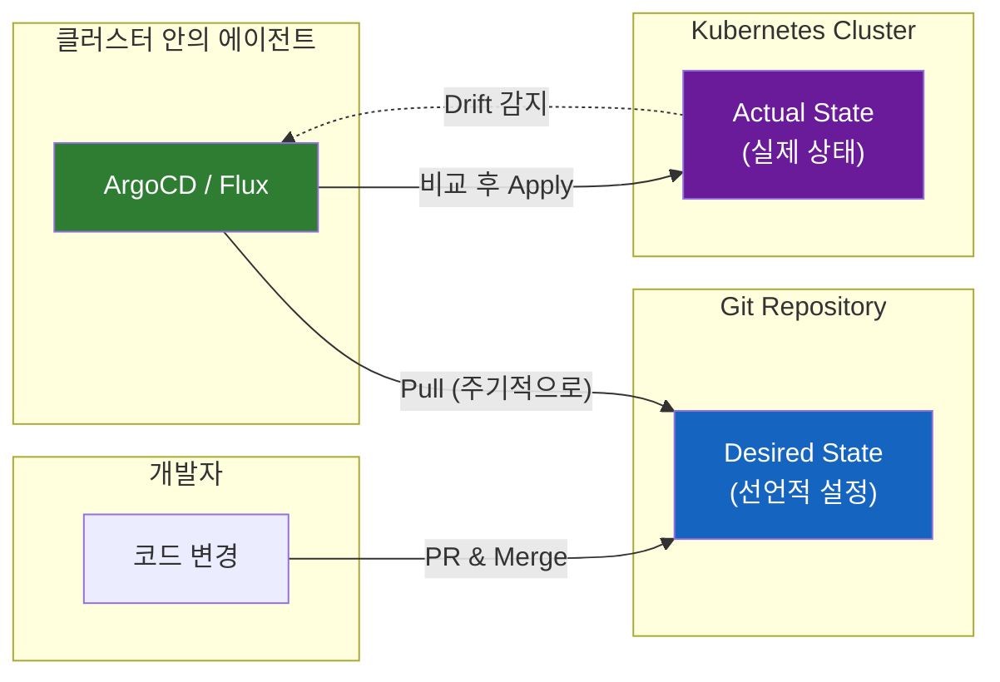

| 구분 | 전통적 CI/CD (Push) | GitOps (Pull) |
|------|---------------------|---------------|
| 트리거 방식 | 이벤트 기반 (edge-triggered) | 상태 기반 (level-triggered) |
| 배포 주체 | CI 파이프라인이 클러스터에 Push | 클러스터 내 에이전트가 Git에서 Pull |
| 자격 증명 | CI 시스템에 클러스터 접근 권한 필요 | 클러스터 내부에서만 동작 |
| Drift 대응 | 감지 어려움, 수동 확인 필요 | 자동 감지, 선택적 자동 복구 |
| 롤백 | 파이프라인 재실행 | `git revert` |
| CD의 정체 | 파이프라인의 **마지막 단계** | 상주하는 **컨트롤러** |

이 표의 마지막 줄이 GitOps 도입에서 가장 자주 걸려 넘어지는 지점이다. **CD가 "단계"에서 "프로세스"로 바뀐다.** 그리고 CNCF의 OpenGitOps 1.0이 정의한 네 원칙은 이 전환을 이렇게 압축한다.

| 원칙 | 원문 요구사항 |
|------|---------------|
| **Declarative** | 원하는 상태가 선언적으로 표현되어야 한다 |
| **Versioned and Immutable** | 불변성·버전 관리를 강제하는 방식으로 저장되고, 완전한 이력이 남아야 한다 |
| **Pulled Automatically** | 소프트웨어 에이전트가 원하는 상태 선언을 자동으로 가져온다 |
| **Continuously Reconciled** | 에이전트가 실제 상태를 지속적으로 관찰하며 원하는 상태를 적용한다 |

여기서 이상한 점 하나. **네 원칙 어디에도 "Git"이라는 단어가 없다.** 이게 우연이 아닌 이유는 3.5절에서 다룬다.

---

## 1. 왜 GitOps가 필요했을까?

### 1.1 CI/CD 파이프라인의 한계

2017년 이전, 대부분의 조직은 Jenkins나 GitHub Actions 같은 CI/CD 파이프라인으로 배포했다. 흐름은 이랬다.

1. 개발자가 코드 Push
2. CI가 빌드 & 테스트
3. CI가 `kubectl apply`로 클러스터에 직접 배포

언뜻 보면 완벽해 보인다. 실제로 상당 기간 잘 작동했다. 하지만 운영 규모가 커지면서 네 가지 문제가 순서대로 드러났다.

### 1.2 "누가, 언제, 뭘 바꿨지?"

**첫 번째 문제: 추적 불가능한 변경**

```bash
# 금요일 밤, 트래픽이 몰려서 누군가 이렇게 했다
kubectl scale deployment api --replicas=10
```

CI/CD 파이프라인은 "배포 성공" 로그만 남긴다. 운영자가 직접 `kubectl`로 수정한 내용은 어디에도 기록되지 않는다. 1주일 후 이 상황을 조사하면 이렇게 된다.

```bash
# 클러스터는 10개라고 말한다
kubectl get deployment api -o jsonpath='{.spec.replicas}'
10

# Git은 3개라고 말한다
git show HEAD:manifests/api-deployment.yaml | grep replicas
  replicas: 3

# 그럼 누가 바꿨나? 이벤트를 보면...
kubectl describe deployment api | grep -A5 Events
Events:  <none>
```

**아무것도 남아 있지 않다.** 쿠버네티스 Event는 기본적으로 1시간 후 사라진다(kube-apiserver의 `--event-ttl` 기본값). API 서버 감사 로그(audit log)를 미리 켜두고 어딘가로 보내두지 않았다면, "누가 언제 왜"는 복원 불가능하다.

Git에는 3이라고 되어 있는데 실제로는 10개가 돌고 있는 이 상태를 **Configuration Drift(설정 드리프트)** 라고 부른다. 그리고 이건 replicas 하나의 문제가 아니다. 오래된 클러스터에는 아무도 기억하지 못하는 ConfigMap, 정체불명의 CronJob, 누군가 디버깅하려고 붙였다가 잊은 label이 층층이 쌓인다.

### 1.3 "CI 서버가 해킹당하면?"

**두 번째 문제: 과도한 권한 집중**

전통적 Push 모델에서 CI 서버는 모든 환경에 배포할 수 있는 자격 증명을 갖고 있다.

```yaml
# CI 파이프라인에 저장된 시크릿
KUBE_CONFIG_DEV:     <dev-cluster-admin-token>
KUBE_CONFIG_STAGING: <staging-cluster-admin-token>
KUBE_CONFIG_PROD:    <production-cluster-admin-token>   # 여기가 문제다
```

CI 서버가 공격당하면? 공격자는 프로덕션 클러스터에 대한 전체 접근 권한을 얻는다. 더 나쁜 것은 이 경로가 **인터넷에서 클러스터 API로 들어오는 방향** 이라는 점이다. 클러스터 API 엔드포인트를 CI가 도달할 수 있도록 열어둬야 하고, 그 말은 다른 것도 도달할 수 있다는 뜻이다.

그리고 CI는 대개 서드파티 액션·플러그인을 실행한다. 공급망 공격 하나가 프로덕션 admin 토큰까지 이어지는 구조다.

### 1.4 "파이프라인이 실패하면 어떻게 되지?"

**세 번째 문제: 배포 실패 시 상태 불일치**

```
Pipeline Step 1: 성공 — DB 마이그레이션 완료
Pipeline Step 2: 성공 — API 서버 배포 완료
Pipeline Step 3: 실패 — Frontend 배포 실패 (레지스트리 일시 장애)
```

파이프라인 중간에 실패하면? 절반만 배포된 상태가 된다. 이제 시스템은 어느 쪽으로도 정의되지 않은 상태에 있다. 앞으로 밀어야 할지(재시도), 뒤로 되돌려야 할지(롤백), 되돌린다면 마이그레이션은 어떻게 할지 — 파이프라인은 답을 갖고 있지 않다. **"Deploy and hope(배포하고 기도하기)"** 모델의 전형적인 문제다.

### 1.5 "이 클러스터를 처음부터 다시 만들 수 있을까?"

**네 번째 문제이자 가장 저평가된 문제: 재구축 불가능성**

리전 장애가 났다고 가정하자. 또는 클러스터 버전 업그레이드가 돌이킬 수 없게 실패했다고 하자. 새 클러스터를 세우고 원래 상태를 복원해야 한다. 무엇을 보고 복원할까?

| 질문 | kubectl 시대의 답 | GitOps의 답 |
|------|-------------------|-------------|
| 어떤 워크로드가 돌고 있었나 | 죽은 클러스터에 물어봐야 한다 | Git 저장소를 보면 된다 |
| 각 설정값은 무엇이었나 | 백업한 etcd 스냅샷을 뒤진다 | 커밋에 적혀 있다 |
| 복원 절차는 무엇인가 | 아무도 문서화하지 않았다 | 새 클러스터에 에이전트 하나를 설치한다 |
| 복원 결과가 맞는지 어떻게 아나 | 눈으로 비교한다 | 에이전트가 `Synced`라고 말한다 |

이것이 GitOps를 도입한 팀이 사후에 가장 크게 체감하는 가치다. 배포가 빨라지는 것보다, **"클러스터를 언제든 버리고 다시 만들 수 있다"** 는 성질이 운영의 심리를 바꾼다. 클러스터가 소중한 애완동물(pet)에서 교체 가능한 가축(cattle)이 된다.

---

## 2. Weaveworks와 GitOps의 탄생

### 2.1 2017년, 용어의 등장

**GitOps라는 용어는 2017년 Weaveworks의 CEO Alexis Richardson이 "Operations by Pull Request"라는 블로그 포스트에서 처음 사용했다.**

Richardson은 Weaveworks 팀이 Kubernetes 클러스터를 운영하면서 발견한 패턴을 정리했다.

> "Git을 single source of truth로 삼고, 모든 변경을 Pull Request로 처리하면,
> 배포가 선언적이고 버전 관리되며 감사 가능해진다."

주목할 것은 이 문장이 **새 기술을 발명하지 않았다** 는 점이다. Git도 있었고, 선언적 매니페스트도 있었고, PR 리뷰도 있었다. Richardson이 한 일은 이미 존재하던 관행들을 하나의 이름으로 묶어, 그것이 "Git 저장소를 쓴다"는 막연한 주장과 구별되는 **검증 가능한 패턴** 임을 보인 것이다.

### 2.2 "GitOps"라는 이름의 의미

| 단어 | 의미 |
|------|------|
| **Git** | 버전 관리 시스템 = Single Source of Truth |
| **Ops** | 운영(Operations) = 인프라와 애플리케이션 관리 |

"DevOps"가 개발과 운영의 협업을 강조했다면, **"GitOps"는 Git이 운영의 중심이 되어야 한다** 는 철학을 담았다. 개발자가 코드를 다루는 방식 — 브랜치, PR, 리뷰, 머지, revert — 을 그대로 인프라 운영에 가져오는 것이다.

### 2.3 Flux의 탄생과 그 이후

Weaveworks는 말만 한 게 아니었다. 직접 도구를 만들었다. **Flux CD** 는 Git 저장소를 감시하고, 변경이 감지되면 자동으로 Kubernetes 클러스터에 적용하는 오픈소스 프로젝트다.

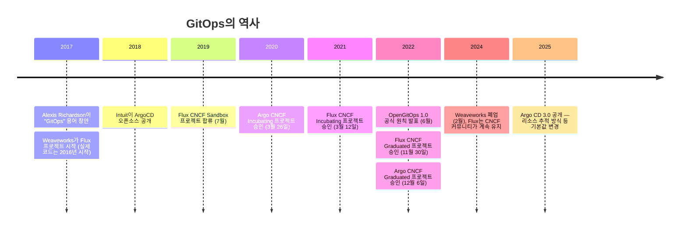

Weaveworks가 2024년 문을 닫은 것은 상징적이다. **용어를 만든 회사는 사라졌지만 모델은 남았다.** Flux는 CNCF Graduated 프로젝트로서 커뮤니티가 계속 유지하고 있고, GitOps는 특정 벤더의 제품이 아니라 CNCF 표준 원칙으로 존재한다.

---

## 3. GitOps의 4가지 원칙 (OpenGitOps)

CNCF의 OpenGitOps 프로젝트는 60개 이상의 기업과 34명의 공동 저자가 참여해 GitOps를 정의하는 네 가지 원칙을 발표했다. 각 원칙은 "시스템의 원하는 상태가 어떠해야 하는가"를 규정한다.

### 3.1 Declarative (선언적)

**"어떻게(How)"가 아니라 "무엇(What)"을 정의한다.**

```bash
# 명령형 (Imperative) — GitOps가 아니다
kubectl scale deployment api --replicas=5
kubectl set image deployment/api api=myapp:v2.0
```

```yaml
# 선언형 (Declarative) — GitOps
apiVersion: apps/v1
kind: Deployment
metadata:
  name: api
spec:
  replicas: 5
  template:
    spec:
      containers:
      - name: api
        image: myapp:v2.0
```

차이는 문법이 아니라 **재실행 가능성** 이다. 명령형 스크립트를 두 번 실행하면 어떻게 될지 예측하기 어렵다. 선언형 매니페스트는 몇 번 적용해도 같은 결과다. 이 성질을 **멱등성(idempotency)** 이라고 하고, 4절에서 볼 제어 루프가 성립하는 전제 조건이다.

Java 개발자에게 익숙한 비유가 두 개 있다. 첫째, Spring의 Bean 설정이다. `new UserService(new UserRepository(dataSource))`라고 조립 순서를 쓰는 대신 `@Bean`으로 "이런 객체가 있어야 한다"를 선언하고, 조립은 컨테이너가 한다. 둘째, SQL이다. `SELECT ... WHERE`는 원하는 결과 집합을 기술하고, 인덱스를 탈지 풀 스캔을 할지는 옵티마이저가 결정한다.

주의할 점: **선언적이라는 것이 YAML을 뜻하지는 않는다.** OpenGitOps 문서는 CUE, Pulumi, HCL, ytt 등으로 표현해도 원하는 상태를 선언적으로 저장할 수 있으면 원칙을 만족한다고 본다. 반대로 `kubectl apply`를 순서대로 호출하는 Bash 스크립트는 파일이 YAML이어도 선언적이지 않다.

### 3.2 Versioned and Immutable (버전 관리 & 불변)

**모든 원하는 상태는 불변성과 버전 관리를 강제하는 방식으로 저장되고, 완전한 이력이 남는다.**

```bash
git log --oneline apps/payment-api/overlays/prod/
a1b2c3d feat: 결제 API 레플리카 6개로 증가 (블프 대응)
d4e5f6g fix: DB 연결 풀 크기 40으로 조정
h7i8j9k refactor: 환경별 설정을 overlay로 분리
```

롤백은 `git revert`다. 파이프라인을 다시 돌리는 것도, UI에서 History 버튼을 찾는 것도 아니다. **"되돌린다"가 "새 커밋을 만든다"로 표현되므로, 롤백조차 이력에 남는다.**

그런데 이 원칙에는 두 개의 조용한 배신이 있다.

**첫째, Git은 기본적으로 불변이 아니다.** `git push --force`는 히스토리를 덮어쓴다. 서명 없는 커밋은 작성자 이름을 위조할 수 있다. 즉 "Git에 저장했으니 불변이고 감사 가능하다"는 문장은 **설정을 갖춰야 참이 된다** — 브랜치 보호(force push 금지, 필수 리뷰), 커밋 서명과 검증, CODEOWNERS. 이 설정 없는 GitOps 저장소는 감사 로그가 아니라 그냥 파일 보관소다.

**둘째, Git은 이미지를 담지 않고 이미지의 참조를 담는다.**

```yaml
image: myorg/payment-api:latest
```

이 한 줄은 불변인가? 텍스트는 불변이다. 하지만 `latest`가 가리키는 다이제스트는 언제든 바뀐다. 원칙을 실제로 만족하려면 커밋 SHA 태그(`payment-api:a1b2c3d`)나 다이제스트(`payment-api@sha256:...`)처럼 **가리키는 대상까지 불변인 참조** 를 써야 한다. 이 문제가 어떻게 파이프라인을 조용히 멈추는지는 [ArgoCD 노트 7.1절](ArgoCD가-Synced라고-하는데-왜-서비스는-죽어-있을까.md)에서 구체적으로 다룬다.

### 3.3 Pulled Automatically (자동 Pull)

**변경을 Push하는 것이 아니라, 에이전트가 원하는 상태 선언을 자동으로 가져온다.**

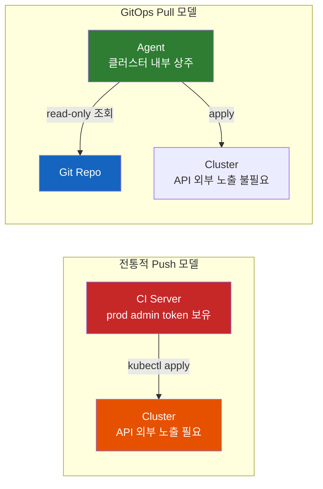

**왜 Pull이 더 안전할까?** 화살표의 방향을 보면 된다. Push 모델에서 자격 증명은 밖에서 안으로 흐른다. Pull 모델에서는 안에서 밖으로 흐르고, 그것도 Git 저장소에 대한 **읽기 권한** 뿐이다.

- CI 서버가 클러스터 자격 증명을 가질 필요가 없다
- 클러스터 API 엔드포인트를 외부에 열지 않아도 된다
- CI가 침해되어도 공격자가 얻는 것은 "Config Repo에 커밋할 능력"이고, 그 커밋은 이력에 남고 리뷰 대상이 된다

다만 세 번째 항목은 조건부다. **컨트롤러가 감시하는 브랜치에 직접 커밋할 수 있다면, 그 커밋은 결국 클러스터 변경으로 이어진다.** Pull 모델이 피해를 줄여주는 것은 브랜치 보호와 PR 승인이 그 브랜치를 지키고, 컨트롤러의 RBAC가 필요한 네임스페이스로 좁혀져 있을 때다. 그 조건이 갖춰지면 공격의 결과가 "즉시 클러스터 장악"에서 "감사 가능한 Git 변경 시도"로 내려간다. 조건이 없다면 Push 모델과 실질적 차이가 크지 않다.

OpenGitOps 문서는 여기에 중요한 단서를 붙인다. **"관찰을 앞당기는 트리거(webhook)가 있을 수는 있지만, GitOps 시스템이 트리거에만 의존해서는 안 된다."** webhook이 유실되어도 다음 주기에 수렴해야 한다는 뜻이고, 이게 다음 원칙으로 이어진다.

### 3.4 Continuously Reconciled (지속적 조정)

**에이전트가 실제 상태를 지속적으로 관찰하고 원하는 상태를 적용한다.**

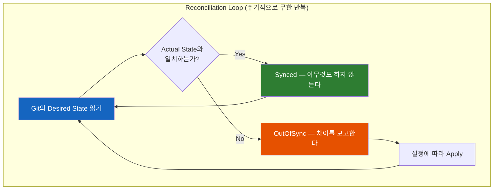

이 루프가 GitOps의 심장이다. 그리고 나머지 세 원칙과 성격이 다르다. 1~3은 "상태를 어떻게 저장하고 가져오는가"에 대한 규정인데, 4는 **시스템이 어떻게 동작하는가** 에 대한 규정이다. 4절 전체를 여기에 쓴다.

한 가지만 미리 못 박아두면, **"자가 치유(self-healing)"는 이 원칙의 자동 귀결이 아니다.** 원칙은 "관찰하고 적용을 시도한다"까지 말하고, 손으로 고친 값을 실제로 되돌릴지는 구현의 선택이다. ArgoCD에서 이것은 `selfHeal: true`라는 명시적 스위치이고 **기본값은 꺼져 있다** ([ArgoCD 노트 3.3절](ArgoCD가-Synced라고-하는데-왜-서비스는-죽어-있을까.md)). GitOps 소개 글이 반드시 보여주는 그 장면 — 누가 `kubectl scale`한 것을 시스템이 알아서 되돌리는 장면 — 은 켜야 일어난다.

### 3.5 "Git"은 네 원칙 어디에도 없다

이제 앞에서 던진 이상한 점으로 돌아간다. 원칙 원문을 다시 읽어보면 Git이라는 단어가 한 번도 등장하지 않는다. 원칙 2는 "불변성과 버전 관리를 강제하는 방식으로 저장된다"고 말할 뿐이고, Git은 그 조건을 만족하는 **가장 흔한 구현** 일 뿐이다.

이건 사소한 트리비아가 아니다. 두 가지 실질적 결과가 나온다.

**첫째, 상태 저장소가 Git이 아닐 수 있다.** Flux의 source-controller는 Git 저장소뿐 아니라 OCI 레지스트리나 S3 버킷도 소스로 받는다. 렌더링된 매니페스트를 OCI 아티팩트로 패키징해 레지스트리에 올리고 컨트롤러가 그것을 당겨오는 구성을 **"Gitless GitOps"** 라고 부른다(11절). 원칙을 위반한 게 아니라, 원칙이 Git을 요구하지 않았을 뿐이다.

**둘째, 이름이 강조점을 잘못 가리킨다.** 네 원칙 중 셋은 저장·전달에 관한 것이고, 실제로 전통적 CD와 GitOps를 갈라놓는 것은 네 번째다. 그래서 GitOps를 "Git-ops"보다 **"reconciliation-ops"** 로 읽는 게 정확하다. Git 저장소를 쓰고 PR로 리뷰하는데도 GitOps가 아닌 조직이 많은 이유가 여기 있다 — 파이프라인이 `kubectl apply`를 실행하는 구조라면, 원칙 1·2·3을 만족해도 원칙 4가 없다.

---

## 4. Reconciliation은 배포가 아니라 제어 루프다

이 절이 이 노트의 핵심이다. "3분마다 Git을 확인해서 반영한다"는 설명은 맞지만, 그것이 **왜** 파이프라인과 근본적으로 다른지를 설명하지 못한다.

### 4.1 Edge-triggered와 Level-triggered

전기 회로 설계에서 온 두 개념이다.

- **Edge-triggered(엣지 트리거)**: 신호가 **변하는 순간** 에 반응한다. 버튼을 누르는 그 순간에 동작이 일어난다.
- **Level-triggered(레벨 트리거)**: 신호의 **현재 값** 을 계속 보고, 목표와 다르면 조정한다. 온도가 목표보다 낮으면 계속 가열한다.

집안 난방에 비유하면 이렇다. **스위치는 엣지 트리거다** — 누르면 켜지고, 그 다음은 관심이 없다. 누가 몰래 껐다면 다시 누를 때까지 꺼져 있다. **온도조절기는 레벨 트리거다** — 목표 온도를 설정하면, 창문이 열려 온도가 떨어져도 계속 다시 데운다. 누군가 개입해도 결국 목표로 돌아온다.

CI/CD 파이프라인은 스위치다. GitOps 에이전트는 온도조절기다.

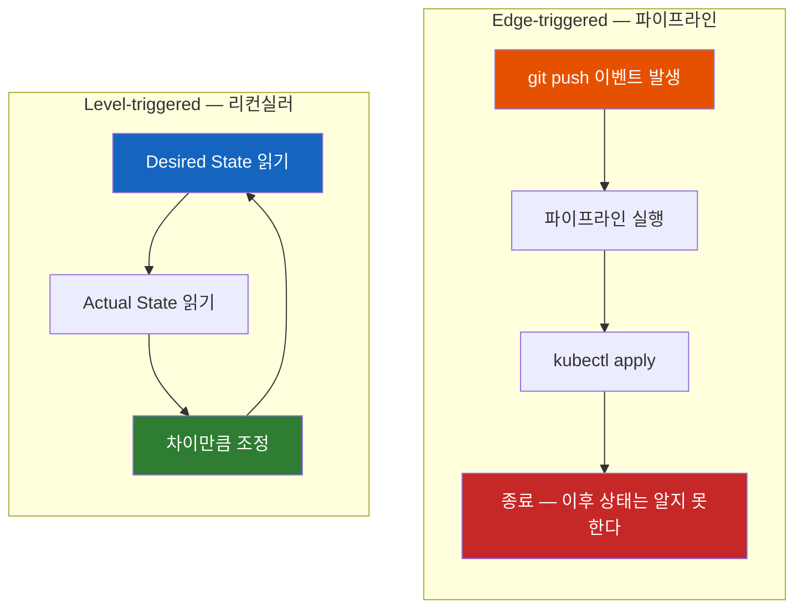

Java 코드로 쓰면 차이가 더 선명하다.

```java
// Edge-triggered: 이벤트가 오면 한 번 처리하고 끝
@EventListener
void onPush(PushEvent event) {
    kubectl.apply(event.manifests());   // 이 시점 이후는 관심 밖
}

// Level-triggered: 목표와 현재를 영원히 비교
while (true) {
    var desired = git.readManifests("HEAD");
    var actual  = cluster.readLiveState();
    if (!desired.equals(actual)) {
        cluster.apply(desired);          // 차이만큼 밀어붙인다
    }
    sleep(interval);                     // 그리고 다시 처음으로
}
```

`while (true)`가 이 모델의 전부다. **이 루프는 "배포 요청"이라는 개념을 갖고 있지 않다.** 누가 커밋했는지, 몇 번째 배포인지, 이전에 성공했는지 알 필요가 없다. 매 회차가 "지금 Git은 무엇을 원하고, 클러스터는 무엇인가"라는 질문 하나로 완결된다.

이건 새로 발명된 발상이 아니다. **쿠버네티스 자체가 원래 이렇게 만들어져 있다.** Deployment 컨트롤러는 "replicas 3"을 보고 현재 Pod 수와 비교해 차이를 메운다. Pod가 죽으면 다시 만든다. GitOps는 이 루프의 목표값 출처를 etcd에서 **Git까지 한 칸 더 밀어낸 것** 이다. 그래서 GitOps가 쿠버네티스 생태계에서 먼저 꽃핀 것은 우연이 아니다(11절).

### 4.2 그래서 무엇이 달라지는가

레벨 트리거로 바꾸면 공짜로 따라오는 성질이 세 개 있다.

**첫째, 이벤트 유실에 강하다.** webhook이 네트워크 문제로 도달하지 않았다면? 다음 폴링 주기에 어차피 발견한다. Push 모델에서는 트리거 유실이 곧 "배포 안 됨"이지만, 여기서는 **지연** 일 뿐이다. 원칙 3이 "트리거에만 의존하지 마라"고 못 박은 이유가 이것이다.

**둘째, 멱등하다.** 루프를 100번 돌려도 결과는 같다. 그래서 "혹시 두 번 적용되면 어떻게 되지?"라는 파이프라인 시대의 걱정이 사라진다.

**셋째, 순서가 중요하지 않다.** 커밋 A와 B가 빠르게 연달아 머지되면, 파이프라인은 두 번 돌면서 중간 상태를 만든다. 리컨실러는 다음 회차에 그냥 최종 상태(B)를 본다. **중간 상태를 건너뛰는 것이 결함이 아니라 설계다.**

대신 대가도 세 개다.

| 대가 | 내용 | 완화 |
|------|------|------|
| 반영 시점이 불확정 | "지금 배포됐나?"에 시계로 답할 수 없다 | webhook으로 관찰을 앞당긴다. 단 의존하지 않는다 |
| 중간 과정을 표현할 수 없다 | "마이그레이션 먼저, 그 다음 앱"을 최종 상태로 쓸 방법이 없다 | 도구가 별도 장치를 제공한다 (sync phase/wave) |
| 수렴하지 않는 경우가 있다 | 다른 컨트롤러가 반대로 밀면 진동한다 | 4.3절 |

두 번째 대가가 1.4절의 "절반만 배포된 상태" 문제와 정면으로 만난다. 선언적 최종 상태만으로는 순서를 표현할 수 없기 때문이다. 도구 층이 이 구멍을 어떻게 메우는지는 [ArgoCD 노트 4절](ArgoCD가-Synced라고-하는데-왜-서비스는-죽어-있을까.md)이 다룬다 — 요점은 `PreSync` hook이 실패하면 뒤따르는 매니페스트 적용이 중단되므로, DB 마이그레이션이 깨진 상태에서 새 이미지가 배포되는 일이 막힌다는 것이다.

다만 이것을 트랜잭션으로 오해하면 안 된다. **sync는 원자적이지 않다.** 앞선 phase나 wave에서 이미 적용된 리소스는 뒤에서 실패해도 자동으로 롤백되지 않는다. 선행 작업 실패 시 후속 적용을 막아 partial rollout의 **위험 범위를 좁히는** 장치이지, "전부 아니면 전무"를 보장하는 장치가 아니다. 되돌리는 것은 여전히 `git revert`와 다음 수렴 회차의 일이다.

### 4.3 수렴하지 않는 경우 — 두 컨트롤러의 줄다리기

레벨 트리거 루프는 목표값이 하나일 때만 수렴한다. **같은 필드를 두 컨트롤러가 서로 다른 목표로 밀면 진동한다.**

가장 흔한 사례가 HPA(Horizontal Pod Autoscaler)다. Git에 `replicas: 3`이 적혀 있고, HPA는 부하를 보고 8로 올린다.

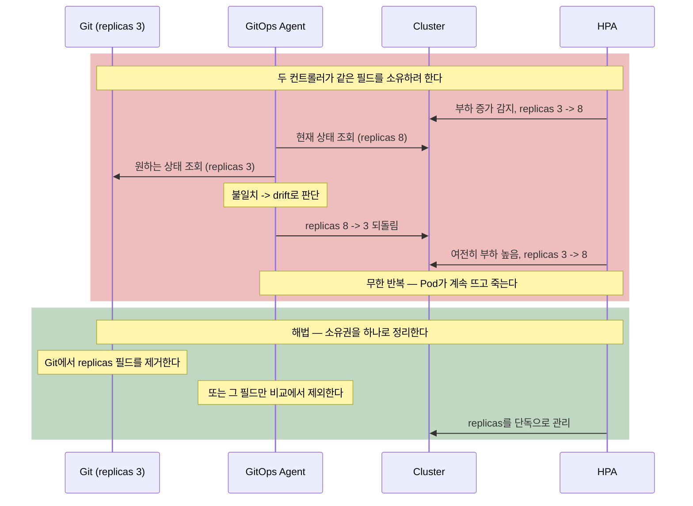

여기서 배울 일반 규칙은 이것이다. **하나의 필드에는 하나의 소유자만 있어야 한다.** 어떤 필드를 다른 컨트롤러에게 맡기기로 했다면, 그 필드는 Git에서 빼거나 비교 대상에서 제외해야 한다. 그렇지 않으면 GitOps는 그 컨트롤러와 싸운다.

그리고 이 규칙을 모른 채 자가 치유를 먼저 켜면 정확히 이 사고가 난다. 그래서 도입 순서가 중요하다(12절).

---

## 5. Push vs Pull: 운영 철학의 차이

단순히 "Push냐 Pull이냐"의 문제가 아니다. **운영 철학 자체가 다르다.**

| 관점 | Push-based (전통 CI/CD) | Pull-based (GitOps) |
|------|------------------------|---------------------|
| 배포 철학 | Pipeline-driven | State-driven |
| 트리거 | Edge-triggered | Level-triggered |
| 명령 방식 | Imperative (명령형) | Declarative (선언적) |
| 배포 전략 | "Deploy and hope" | "Continuously reconcile" |
| 신뢰 대상 | 파이프라인을 신뢰 | Git을 신뢰 |
| Drift 대응 | 수동 확인/복구 | 자동 감지, 선택적 복구 |
| 실패의 의미 | 배포 실패 = 상태 미정의 | 수렴 실패 = 계속 재시도 대상 |

### 5.1 자격 증명의 방향이 전부다

보안 측면에서 GitOps의 이득은 한 문장으로 압축된다. **클러스터를 향한 쓰기 권한이 클러스터 밖에 존재하지 않는다.**

| | Push 모델 | Pull 모델 |
|--|-----------|-----------|
| 클러스터 write 권한을 가진 주체 | CI 서버 (외부) | 클러스터 안의 컨트롤러 |
| 클러스터 API 외부 노출 | 필요 | 불필요 |
| Git 저장소에 대한 권한 | CI가 read/write | 컨트롤러는 read만 |
| CI 침해 시 최대 피해 | 프로덕션 클러스터 장악 | Config Repo에 커밋 시도 (브랜치 보호·PR 승인이 있을 때) |
| 신규 클러스터 추가 비용 | CI에 자격 증명 추가 | 클러스터에 에이전트 설치 |

마지막 줄이 특히 중요하다. Push 모델에서 클러스터가 20개면 CI 시스템에 20개의 admin 자격 증명이 모인다. 그 저장소 하나가 조직 전체의 단일 실패점이 된다. Pull 모델에서는 각 클러스터가 자기 자신만 책임진다.

### 5.2 그래도 Pull이 만능은 아니다

균형을 위해 Pull 모델의 비용도 적어둔다.

**반영이 즉시가 아니다.** 폴링 주기만큼 기다린다. webhook으로 줄일 수 있지만, 원칙상 webhook에 의존할 수는 없다.

**에이전트를 어디에 둘지가 새로운 설계 결정이 된다.** 에이전트 자체가 관리 대상이고, 업그레이드 대상이며, 장애 지점이다. 그리고 그 에이전트를 무엇으로 배포할 것인가라는 부트스트랩 문제가 생긴다(에이전트가 자기 자신을 관리하게 하는 구성의 위험은 [ArgoCD 노트 8.5절](ArgoCD가-Synced라고-하는데-왜-서비스는-죽어-있을까.md)에서 다룬다).

클러스터가 여러 개면 배치 방식이 둘로 갈린다.

| 방식 | 구조 | 이득 | 대가 |
|------|------|------|------|
| **Hub-and-Spoke** (중앙 집중) | 관리 클러스터 한 곳의 에이전트가 원격 클러스터들에 apply | 운영 지점이 하나. 전체 현황을 한 화면에서 본다 | 폭발 반경이 넓다. 그 에이전트가 죽으면 전 클러스터의 수렴이 멈춘다. 그리고 **원격 클러스터 자격 증명이 다시 한곳에 모인다** — 1.3절 문제의 재발 |
| **Autonomous Agent** (자율형) | 각 클러스터가 자기 안의 에이전트로 자기만 관리 | 장애가 격리된다. 자격 증명이 클러스터 밖으로 나가지 않아 망 분리 환경에 적합 | 에이전트 수만큼 운영 부담. 전체 현황을 보려면 별도 집계 층이 필요 |

Pull 모델의 보안 이점을 끝까지 살리는 것은 자율형이다. 그런데 실제 조직은 대개 관측 편의 때문에 Hub-and-Spoke로 시작한다. **이 선택이 "클러스터 자격 증명이 한곳에 모이지 않는다"는 5.1절의 이득을 부분적으로 반납한다는 사실을 알고 결정해야 한다.**

**Git 저장소가 새로운 병목이 된다.** 클러스터 50개 × 앱 5개 = 250개의 리컨실러가 각자 주기적으로 저장소를 조회한다. Git 호스팅의 rate limit와 clone 비용이 실제 운영 문제로 올라온다. 이 부하를 줄이는 것이 Flux가 소스와 적용을 분리한 이유이고(10.3절), 렌더링 결과를 OCI 아티팩트로 옮기는 동기 중 하나다.

**모든 것이 Git을 거쳐야 하는 마찰.** 5초면 끝날 값 하나를 바꾸려고 PR을 열고 리뷰를 받고 머지하고 폴링을 기다린다. 이 마찰은 대개 이득이지만, 장애 대응 중에는 이득이 아니다. 그래서 break-glass 절차 설계가 GitOps 도입의 필수 항목이다(6.1절).

### 5.3 언제 GitOps를 선택해야 할까?

**GitOps가 빛나는 상황:**

- 여러 Kubernetes 클러스터를 관리할 때 — 클러스터 수만큼 이득이 곱해진다
- 팀 규모가 커지고 변경 추적이 중요할 때
- 감사(Audit)·컴플라이언스 요구사항이 있을 때
- 재해 복구에서 "클러스터 재구축"이 시나리오에 있을 때 (1.5절)
- Configuration Drift가 이미 문제가 되고 있을 때

**전통적 Push가 더 나은 상황:**

- 클러스터가 하나이고 만지는 사람이 두세 명인 단순한 시스템
- Kubernetes가 아닌 환경 — 선언적 API와 제어 루프가 없다면 GitOps 에이전트가 그것부터 만들어야 한다 (11절)
- 빠른 프로토타이핑 — Git 왕복의 마찰이 이득보다 클 때
- 배포 자체가 명령형인 경우 — 예를 들어 되돌릴 수 없는 일회성 데이터 이관

판단 기준을 한 줄로 압축하면 이렇다. **"클러스터의 현재 상태를 아무도 확신할 수 없다"는 순간이 왔다면 GitOps가 답이다.** 그 순간이 오지 않았다면 아직 이르다.

---

## 6. Drift는 하나가 아니다

GitOps 도입에서 가장 흔한 실수는 "drift는 나쁜 것이니 자동으로 되돌리면 된다"고 생각하는 것이다. 실제로 drift는 성격이 완전히 다른 세 종류이고, **대응 방법도 정반대다.**

| 종류 | 누가 만드는가 | 예시 | 올바른 대응 |
|------|---------------|------|-------------|
| **사고성 drift** | 사람이 클러스터를 직접 고침 | 긴급 `kubectl scale`, 클라우드 콘솔 편집, 검증용 label 추가 후 방치 | 되돌린다. 그리고 애초에 못 하게 만든다 |
| **의도적 drift** | 다른 컨트롤러가 그 필드를 정당하게 소유 | HPA가 `replicas`, cert-manager가 `tls.crt`, kube-controller-manager가 CA bundle | 되돌리면 안 된다. Git에서 빼거나 비교에서 제외 |
| **시스템 유래 drift** | 클러스터가 저장 과정에서 값을 변형 | admission webhook의 사이드카 주입, 기본값 채워짐, `cpu: 100m`이 `0.1`로 정규화 | 되돌릴 수 없다. 비교 규칙을 조정 |

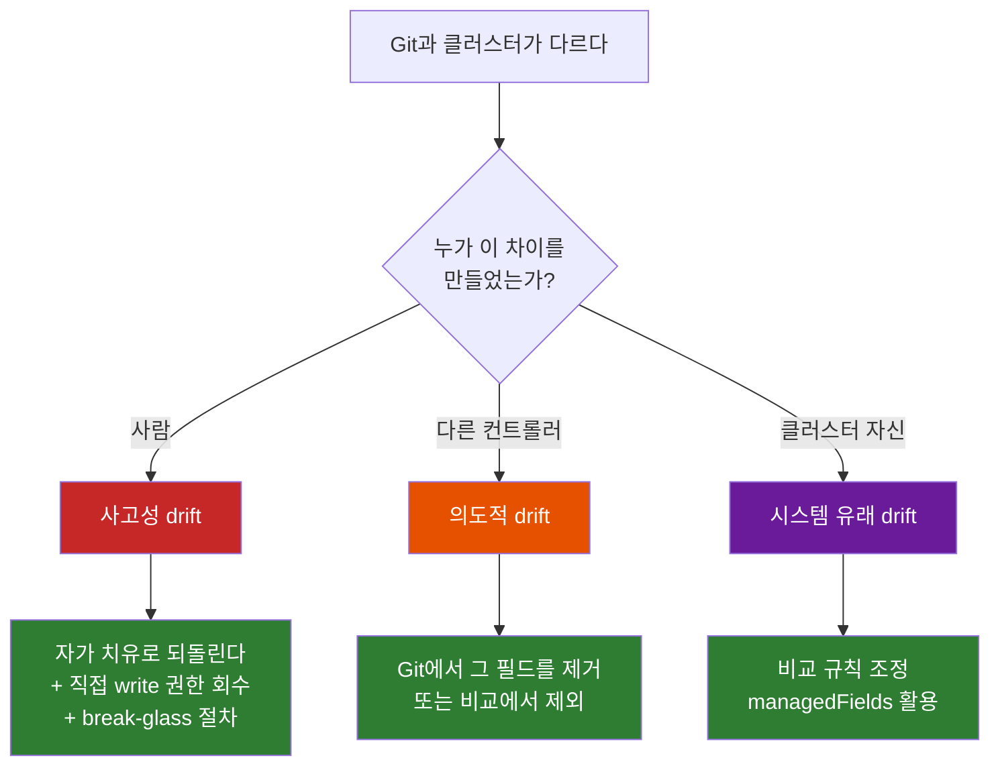

**여기서 나오는 실질적 교훈이 하나 있다.** 자가 치유를 가장 먼저 켜면 첫 번째 종류는 해결되지만, 두 번째와 세 번째는 **오히려 악화된다.** 컨트롤러 싸움(4.3절)이 시작되고, 아무리 sync해도 사라지지 않는 영구 `OutOfSync`가 대시보드를 뒤덮는다. 그러면 팀은 그 경고를 무시하기 시작하고, 그 순간 진짜 사고성 drift도 함께 묻힌다.

그래서 순서가 이렇다. **비교 예외를 먼저 정리하고, 자가 치유는 그 다음에 켠다.** 어떤 필드를 왜 제외하는지, 그 문법이 어떻게 되는지는 [ArgoCD 노트 8.1절](ArgoCD가-Synced라고-하는데-왜-서비스는-죽어-있을까.md)이 다룬다.

### 6.1 사고성 drift를 막는 것은 도구가 아니라 권한 설계다

자가 치유는 사고성 drift를 **되돌리지만 예방하지 않는다.** 예방은 권한에서 온다.

- 클러스터에 대한 쓰기 권한을 GitOps 컨트롤러의 ServiceAccount로 좁힌다. 사람 계정은 읽기 전용이 기본이다([Pod는 어떻게 쿠버네티스 API에 자기를 증명할까 — ServiceAccount와 RBAC](../kubernetes/Pod는-어떻게-쿠버네티스-API에-자기를-증명할까-ServiceAccount와-RBAC.md))
- 그래도 긴급 경로는 반드시 남긴다. **break-glass 절차** — 한시적 권한 상승, 전 과정 로깅, 지정된 사고 담당자, 그리고 **사후에 Git을 현실과 일치시키는 커밋 의무**
- 마지막 항목이 없으면 자가 치유가 긴급 조치를 조용히 지워버리거나, 반대로 원래 장애를 다시 재현한다

**Git이 진실이 되는 것은 선언이 아니라 권한 구성의 결과다.** 도구를 깔았다고 Git이 진실이 되지는 않는다.

---

## 7. 저장소를 어떻게 나눌 것인가

여기서부터는 실전이다. GitOps를 도입한 팀이 가장 먼저 부딪히는 것은 도구 설정이 아니라 **"저장소와 디렉터리를 어떻게 자를 것인가"** 다.

### 7.1 App Repo와 Config Repo를 분리하라

| 저장소 | 내용 | 변경 주체 | 변경 빈도 |
|--------|------|----------|-----------|
| **App Repo** | 소스 코드, Dockerfile, CI 파이프라인 | 개발자 | 하루에 여러 번 |
| **Config Repo** | Kubernetes manifests, Helm values, Kustomize overlay | CI(이미지 태그), 운영자(설정) | 배포 시 |

왜 분리할까? 이유가 세 개다.

**첫째, 변경 주기가 다르다.** 코드는 하루에 열 번 바뀌고 인프라 설정은 일주일에 한 번 바뀐다. 한 저장소에 두면 리컨실러가 관심 없는 커밋에 계속 반응하고, Config Repo의 히스토리가 코드 커밋에 묻힌다.

**둘째, 접근 권한을 분리할 수 있다.** 프로덕션 리소스 한도와 네트워크 정책을 바꿀 수 있는 사람과, 애플리케이션 코드를 고칠 수 있는 사람이 같아야 할 이유는 없다. Config Repo에 CODEOWNERS와 필수 리뷰를 별도로 걸 수 있다.

**셋째, 무한 루프를 피한다.** CI가 이미지 태그를 커밋하는데 그 커밋이 다시 CI를 트리거하면 순환이 생긴다. 같은 저장소를 쓸 경우 경로 필터나 커밋 메시지 규약으로 막아야 하는데, 분리하면 이 문제가 애초에 없다.

### 7.2 환경은 브랜치가 아니라 디렉터리로 나눈다

이것이 GitOps 도입에서 가장 자주 틀리는 결정이고, 되돌리는 비용도 가장 크다.

직관적으로는 브랜치가 자연스러워 보인다. `dev` 브랜치는 dev 클러스터가, `prod` 브랜치는 prod 클러스터가 바라본다. 승격은 `dev`를 `prod`로 머지하면 된다. **깔끔해 보이고, 실제로 대부분의 팀이 처음에 이렇게 시작한다.** 그리고 대부분 후회한다. 왜일까?

**첫째, 병합 충돌이 구조적으로 발생한다.** dev와 prod의 차이는 "아직 승격되지 않은 변경"만이 아니다. 레플리카 수, 도메인, 리소스 한도, 로그 레벨 — **영구히 달라야 하는 값들** 이 브랜치 diff에 섞여 있다. `dev`를 `prod`에 머지할 때마다 Git은 이 영구 차이를 "충돌"로 보고하고, 사람이 매번 손으로 골라낸다. 한 번만 실수하면 dev의 `replicas: 1`이 프로덕션에 들어간다.

**둘째, cherry-pick 운영으로 흐른다.** 위 충돌을 피하려고 팀은 전체 머지 대신 필요한 커밋만 골라 옮기기 시작한다. 그러면 어느 변경이 어느 환경에 반영됐는지 추적이 불가능해진다. "이 버그 수정이 staging에 들어갔나?"에 답하려면 커밋 로그를 뒤져야 한다.

**셋째, 환경 간 diff를 볼 수 없다.** "dev와 prod의 설정 차이가 뭐야?"는 운영에서 가장 자주 나오는 질문이다. 브랜치 방식에서 `git diff dev prod`를 하면 설정 차이에 **커밋 히스토리 차이가 섞여** 나온다. 아직 승격 안 된 기능 3개와 환경 전용 값 5개가 뒤엉킨 diff를 사람이 읽어야 한다.

**넷째, 배포 프로세스가 Git 브랜치 전략에 결합된다.** 환경을 하나 추가하려면 브랜치를 만들어야 하고, 브랜치 전략을 바꾸려면 배포 구조를 건드려야 한다.

**예외는 있다.** 규제 산업에서 프로덕션 변경마다 수동 승인과 감사 흔적이 법적으로 요구되는 경우, 브랜치 경계가 그 게이트를 자연스럽게 만들어준다. 하지만 그 경우에도 대개는 디렉터리 + PR 승인 규칙으로 같은 통제를 얻을 수 있다.

#### 디렉터리 방식의 실제 구조

권장은 **트렁크 기반 개발 + 디렉터리 분리** 다. 브랜치는 `main` 하나이고, 환경은 경로로 구분된다.

```
gitops-config/
├── apps/
│   └── payment-api/
│       ├── base/                        # 환경 공통 — 여기엔 환경 정보가 없다
│       │   ├── deployment.yaml
│       │   ├── service.yaml
│       │   └── kustomization.yaml
│       └── overlays/
│           ├── dev/
│           │   ├── kustomization.yaml
│           │   └── patch-resources.yaml
│           ├── staging/
│           │   └── kustomization.yaml
│           └── prod/
│               ├── kustomization.yaml
│               ├── patch-resources.yaml
│               └── patch-topology-spread.yaml
│
├── infrastructure/                      # 플랫폼 팀 소유
│   ├── ingress-nginx/
│   ├── cert-manager/
│   └── monitoring/
│
└── clusters/                            # 어느 클러스터에 무엇을 깔 것인가
    ├── dev/
    ├── staging/
    └── prod/
```

`base`는 환경 정보를 담지 않는다. 네임스페이스도, 레플리카 수도, 이미지 태그도 적지 않는다.

```yaml
# apps/payment-api/base/kustomization.yaml
apiVersion: kustomize.config.k8s.io/v1beta1
kind: Kustomization
resources:
  - deployment.yaml
  - service.yaml
commonLabels:
  app.kubernetes.io/name: payment-api
```

환경별 차이는 overlay가 전부 표현한다. 프로덕션은 이렇다.

```yaml
# apps/payment-api/overlays/prod/kustomization.yaml
apiVersion: kustomize.config.k8s.io/v1beta1
kind: Kustomization
namespace: payment

resources:
  - ../../base

images:
  - name: myorg/payment-api
    newTag: a1b2c3d              # CI가 승격 시 이 한 줄만 바꿔 커밋한다

replicas:
  - name: payment-api
    count: 6

patches:
  - path: patch-resources.yaml
  - path: patch-topology-spread.yaml

configMapGenerator:
  - name: payment-config
    literals:
      - LOG_LEVEL=warn
      - DB_POOL_SIZE=40
```

dev는 같은 base를 쓰면서 값만 다르다.

```yaml
# apps/payment-api/overlays/dev/kustomization.yaml
apiVersion: kustomize.config.k8s.io/v1beta1
kind: Kustomization
namespace: payment-dev

resources:
  - ../../base

images:
  - name: myorg/payment-api
    newTag: e4f5g6h              # dev는 항상 최신 빌드를 가리킨다

replicas:
  - name: payment-api
    count: 1

patches:
  - path: patch-resources.yaml

configMapGenerator:
  - name: payment-config
    literals:
      - LOG_LEVEL=debug
      - DB_POOL_SIZE=5
```

이 구조가 주는 세 가지 이득이 브랜치 방식의 문제와 정확히 대응한다.

**환경 간 차이를 렌더링 결과로 직접 비교할 수 있다.** 이게 가장 큰 이득이다.

```bash
# dev와 prod가 실제로 무엇이 다른지, 최종 매니페스트 수준에서 비교한다
diff <(kustomize build apps/payment-api/overlays/dev) \
     <(kustomize build apps/payment-api/overlays/prod)
```

커밋 히스토리가 섞이지 않은, 순수한 설정 차이만 나온다. 이 명령 하나가 "dev에서는 되는데 prod에서는 왜 안 되나"라는 질문의 절반을 해결한다.

**승격이 한 줄 커밋이 된다.** 브랜치 머지도, cherry-pick도 아니다. prod overlay의 `newTag`를 dev에서 검증된 값으로 바꾸는 커밋 하나다. 되돌리기도 `git revert` 하나다.

**병합 충돌이 사라진다.** 환경 전용 값은 각자의 파일에 있으므로 서로 만나지 않는다.

그리고 CI에서 이 구조를 검증할 수 있다.

```bash
# 모든 overlay가 실제로 렌더링되는지, 스키마가 유효한지 PR에서 확인
for env in dev staging prod; do
  kustomize build apps/payment-api/overlays/$env | kubeconform -strict -summary
done
```

### 7.3 Monorepo vs Polyrepo — Conway의 법칙이 결정한다

디렉터리 구조를 정했다면 다음 질문은 "저장소를 몇 개로 나눌까"다. 여기에는 정답이 없고, 그 이유가 흥미롭다.

Akuity의 GitOps 모범사례 백서는 이 문제를 **Conway의 법칙** 으로 설명한다.

> "시스템을 설계하는 조직은 그 조직의 의사소통 구조를 복제한 설계를 만들어낸다." — Melvin E. Conway

즉 저장소 구조는 기술적 최적해가 아니라 **조직 경계의 반영** 이다. 개발자가 플랫폼 설정을 건드리지 않고 플랫폼 운영자가 애플리케이션 코드를 고치지 않는다면, 그 경계가 저장소 경계가 되는 것이 자연스럽다.

| 방식 | 적합한 조직 | 이득 | 비용 |
|------|-------------|------|------|
| **Monorepo** | 팀 수가 적고 경계가 흐릿함 | 전체를 한 PR로 원자적 변경. 검색·리팩터링이 쉽다 | 권한 분리가 어렵다. 저장소가 커지면 clone·폴링 비용 증가 |
| **Polyrepo** | 팀·테넌트 경계가 명확함 | 권한과 리뷰를 팀 단위로 자연스럽게 분리 | 여러 저장소에 걸친 변경이 원자적이지 않다. 공통 base 공유에 별도 설계 필요 |
| **하이브리드** | 대부분의 중대형 조직 | 공통 라이브러리 저장소 + 팀별/환경별 저장소 | 참조 관계 관리가 필요 |

실용적 출발점은 이렇다. **하나로 시작하고, 권한을 나눠야 하는 순간에 쪼갠다.** 저장소를 미리 잘게 나누는 것이 미래를 대비하는 것처럼 느껴지지만, 실제로는 존재하지 않는 조직 경계를 코드에 새기는 일이 되기 쉽다.

### 7.4 그래서 이미지 태그는 누가 커밋하는가 — CI와 CD의 새 경계선

overlay의 `newTag`를 누군가는 바꿔야 한다. 여기서 GitOps가 CI/CD의 경계를 어떻게 다시 그었는지가 드러난다.

| 층 | 하는 일 | 필요한 권한 |
|----|---------|-------------|
| **CI** (파이프라인) | 빌드·테스트·이미지 push·**Config Repo에 태그 커밋** | 레지스트리 write, Config Repo write |
| **CD** (리컨실러) | Git 읽기·클러스터 apply·지속적 수렴 | Git read, 클러스터 write |

**CD가 파이프라인의 마지막 단계에서 상주 프로세스로 옮겨갔다.** 그리고 CI의 마지막 산출물이 "배포된 클러스터"가 아니라 **"커밋"** 이 되었다. 두 층이 만나는 유일한 지점은 Git 커밋이고, 어느 쪽도 상대의 자격 증명을 갖지 않는다.

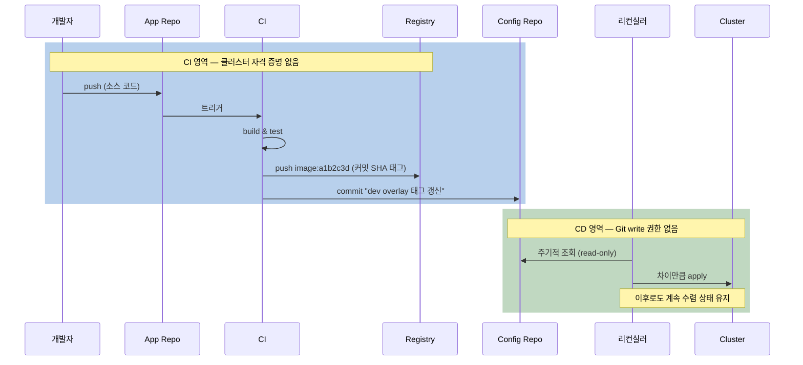

실제 CI 구현은 이렇게 짧다.

```yaml
# App Repo — .github/workflows/release.yml
jobs:
  build-and-promote:
    steps:
      - uses: actions/checkout@v4

      - name: 불변 태그로 빌드 (커밋 SHA)
        run: |
          TAG="${GITHUB_SHA::7}"
          IMAGE="ghcr.io/myorg/payment-api:${TAG}"
          docker build -t "$IMAGE" .
          docker push "$IMAGE"
          echo "TAG=$TAG" >> "$GITHUB_ENV"

      - name: Config Repo의 dev overlay에 태그 반영
        run: |
          git clone --depth 1 \
            "https://x-access-token:${{ secrets.CONFIG_REPO_TOKEN }}@github.com/myorg/gitops-config.git"
          cd gitops-config/apps/payment-api/overlays/dev

          # overlay의 images 항목 한 줄만 바뀐다
          kustomize edit set image "myorg/payment-api=ghcr.io/myorg/payment-api:${TAG}"

          git -C ../../../.. commit -am "chore(payment-api): dev 이미지 ${TAG}"
          git -C ../../../.. push
```

여기서 짚어둘 것이 세 개다.

**`kustomize edit set image`가 정확히 한 줄만 바꾼다.** YAML을 `sed`로 치환하거나 템플릿으로 재생성하지 않는다. 그래서 diff가 깨끗하고 리뷰가 가능하다.

**dev는 자동 커밋, prod는 PR로 나누는 것이 자연스러운 승격 게이트다.** 같은 CI가 dev overlay에는 직접 커밋하고, prod overlay 변경은 PR을 열게 하면 "검증된 것만 프로덕션으로"라는 정책이 Git 메커니즘으로 표현된다.

**CI가 만든 커밋이 다시 CI를 트리거하지 않도록 막아야 한다.** Config Repo를 분리했다면 대개 문제가 안 되지만, 같은 저장소를 쓴다면 경로 필터(`paths-ignore`)나 봇 계정 필터가 필요하다. 이 순환을 놓치면 커밋 폭풍이 난다.

CI 대신 레지스트리를 감시해 태그를 커밋해주는 도구도 있다 — Argo CD Image Updater, Flux의 image-automation-controller. 다만 이 도구들의 write-back 방식 선택이 GitOps 원칙과 직결되므로 주의가 필요하다([ArgoCD 노트 7.2절](ArgoCD가-Synced라고-하는데-왜-서비스는-죽어-있을까.md)).

---

## 8. Git에 있는 것과 클러스터에 도는 것은 같지 않다

7.2절의 구조에는 조용한 문제가 하나 숨어 있다. 그리고 이 문제는 "Git이 Single Source of Truth"라는 이 노트의 제목 자체를 흔든다.

### 8.1 PR에는 보이지 않는 변경

Helm chart 버전을 올리는 PR을 상상해 보자. diff는 이렇다.

```diff
 # apps/payment-api/prod/values.yaml
 postgresql:
-  chartVersion: 12.5.1
+  chartVersion: 13.0.0
```

**한 줄이다.** 이 PR을 리뷰하는 사람은 무엇을 승인하는 걸까? 저 한 줄이 렌더링되면 StatefulSet의 볼륨 클레임 이름이 바뀔 수도 있고, 기본 인증 방식이 `scram-sha-256`으로 바뀔 수도 있고, 리소스 요청량이 두 배가 될 수도 있다. **PR을 봐서는 알 수 없다.** chart 안을 직접 읽고 렌더링해봐야 안다.

Kustomize도 정도만 다르다. `patch-resources.yaml`을 고치면 실제로 어느 컨테이너의 어느 필드가 바뀌는지 base와 overlay를 머릿속에서 합성해야 한다.

여기서 딜레마가 드러난다. **DRY와 WYSIWYG는 동시에 만족되지 않는다.**

| 목표 | 방식 | 대가 |
|------|------|------|
| **DRY** (중복 제거) | Git에 "레시피"를 둔다 — Helm values, Kustomize overlay | Git이 결과물을 담지 않는다. 리뷰가 불투명해진다 |
| **WYSIWYG** (본 대로 배포) | Git에 "결과물"을 둔다 — 렌더링된 평문 YAML | 중복이 폭증한다. 환경 3개면 같은 YAML 3벌 |

Helm과 Kustomize는 첫 번째를 택한 도구다. 그리고 그 선택 때문에 **Git은 원하는 상태의 "의도(intent)"를 담고, 클러스터에 실제로 도는 오브젝트는 렌더링과 admission을 거친 결과** 라는 간극이 생긴다. 사이드카가 주입되고 기본값이 채워지는 것까지 합치면(6절의 시스템 유래 drift), "Git = 클러스터"라는 등식은 엄밀하게는 성립하지 않는다.

### 8.2 Rendered Manifests Pattern — 간극을 Git 안으로 끌어들인다

해법은 발상을 뒤집는 것이다. **렌더링을 배포 시점이 아니라 커밋 시점에 한다.** 그리고 렌더링 **결과** 를 Git에 넣는다.

Helm과 Kustomize를 버리지 않는다. 여전히 쓴다. 다만 그것들은 이제 "배포 도구"가 아니라 **"컴파일러"** 다. 소스(dry)와 산출물(hydrated)이 둘 다 Git에 있고, 리컨실러는 산출물만 본다.

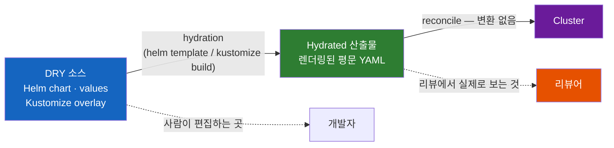

이제 앞의 PR은 이렇게 보인다.

```diff
 # rendered/prod/postgresql-statefulset.yaml  (자동 생성)
       containers:
         - name: postgresql
-          image: bitnami/postgresql:15.4.0
+          image: bitnami/postgresql:16.1.0
           env:
-            - name: POSTGRESQL_PASSWORD_FILE
+            - name: POSTGRES_PASSWORD_FILE
           resources:
             requests:
-              memory: 512Mi
+              memory: 1Gi
```

**chart 버전 한 줄이 실제로 무엇을 바꾸는지가 diff에 그대로 나온다.**

### 8.3 네 가지 구현 방식

같은 패턴을 구현하는 방법이 넷이고, 각자 다른 것을 우선한다.

| 방식 | 렌더링 주체 | 성격 | 현재 상태 |
|------|-------------|------|-----------|
| **CI 렌더링** | CI 파이프라인 | 가장 단순. 익숙한 도구만 쓴다. CI에서 "재렌더링해도 diff 없음"을 검증해 정합성을 강제한다 | 지금 바로 가능 |
| **ArgoCD sourceHydrator** | ArgoCD 자신 | 선언적. `drySource` / `syncSource` / `hydrateTo`로 표현. `hydrateTo`로 스테이징 브랜치를 거치게 하면 렌더링 결과를 PR로 리뷰할 수 있다 | 현재 stable(v3.4)에서 Alpha, v3.5.0에서 Beta |
| **Kargo** | 전용 승격 도구 | 렌더링과 **단계별 승격 게이트** 를 하나의 워크플로로 묶는다. 환경이 여러 단계일 때 강하다 | 별도 프로젝트 |
| **OCI 아티팩트** | CI가 렌더 후 레지스트리에 push | 배포 단위를 컨테이너처럼 서명된 불변 아티팩트로 만든다. Git clone 대신 아티팩트 하나를 당기므로 sync가 빠르다 | Flux `OCIRepository` 등 |

우선순위별 선택 기준은 이렇다. **가시성과 감사가 목적이면 CI 렌더링으로 시작한다.** 같은 결과를 유지 부담 없이 원하면 sourceHydrator, 진짜 승격 파이프라인이 필요하면 Kargo, 공급망 무결성(서명·검증)이 목적이면 OCI 아티팩트다.

### 8.4 그리고 이 패턴의 대가

공짜가 아니다.

- **커밋 노이즈.** 자동 생성 커밋이 사람 커밋을 압도한다. 히스토리를 읽으려면 봇 커밋을 걸러내는 습관이 필요하다
- **저장소 크기.** 환경 수 × 앱 수만큼 렌더링 결과가 쌓인다
- **새로운 장애 지점.** 렌더링 파이프라인 자체가 멈추면 배포가 멈춘다. 그리고 "dry는 바뀌었는데 hydrated가 안 바뀐" 불일치 상태가 새로 생긴다

그래서 이 패턴은 **환경이 여러 개이고 chart 업그레이드가 무서운 조직** 에서 값어치를 한다. 클러스터 하나에 앱 몇 개라면 과하다.

---

## 9. GitOps가 답하지 않는 것들

GitOps를 도입하면 해결될 것 같지만 실제로는 별개 층이 필요한 문제들이 있다. 이 경계를 미리 아는 것이 실망을 줄인다.

### 9.1 Secret — 평문 값에는 원칙 2를 그대로 적용할 수 없다

원칙 2는 "모든 원하는 상태를 버전 관리하라"고 말한다. 그런데 DB 비밀번호는? **평문으로 커밋하는 것은 선택지가 아니다.** Git 히스토리는 지워도 포크와 로컬 clone에 남고, 저장소를 읽을 수 있는 모든 사람이 프로덕션 자격 증명을 갖게 된다.

오해를 피해 정확히 말하면, Secret 리소스가 GitOps 관리 대상에서 빠지는 것이 아니다. **비밀 값만 Git 밖에 두고, Git에는 암호문이나 외부 저장소 참조를 둔다.** 그 참조 자체는 다른 매니페스트와 똑같이 버전 관리되고 리뷰된다.

모델 층에서 접근은 두 갈래다. **Git에 암호문이나 참조만 두고 클러스터의 오퍼레이터가 실제 Secret을 만들게 하는 방식** (Sealed Secrets, External Secrets Operator)과, **렌더링 시점에 값을 주입하는 방식** (argocd-vault-plugin)이다. 전자가 권장되는 이유는 GitOps 컨트롤러를 비밀에서 떼어놓기 때문이다.

도구별 비교와 선택 기준은 [ArgoCD 노트 8.2절](ArgoCD가-Synced라고-하는데-왜-서비스는-죽어-있을까.md)에서 다룬다. 여기서 기억할 모델 층의 결론은 하나다. **비밀 값을 어떻게 Git 밖에 두면서도 참조를 버전 관리할지 정하지 않은 GitOps 도입은 반드시 도중에 멈춘다.**

### 9.2 점진적 배포(Progressive Delivery)는 별개 층이다

GitOps는 **최종 상태** 를 선언한다. 그런데 "트래픽을 10%씩 옮기면서 에러율을 보고, 임계치를 넘으면 자동으로 되돌린다"는 것은 최종 상태가 아니라 **전환 과정** 이다. 선언적 최종 상태만으로는 표현할 방법이 없다.

그래서 이 층은 별도 컨트롤러가 담당한다.

| 도구 | 접근 방식 | 생태계 |
|------|-----------|--------|
| **Argo Rollouts** | 표준 `Deployment`를 `Rollout` CRD로 대체하고, 컨트롤러가 canary/blue-green 전환을 직접 관리 | Argo (ArgoCD와 함께) |
| **Flagger** | 기존 `Deployment`를 그대로 두고 옆에서 canary를 만들어 서비스 메시·Ingress로 트래픽을 분배 | Flux (Flagger는 Flux 프로젝트) |

두 도구 모두 메트릭 제공자(Prometheus, Datadog 등)를 조회해 자동 승격/롤백을 판단한다. 그리고 **둘 다 결국 CRD이므로 GitOps로 선언된다.** 층이 이렇게 쌓인다.

> GitOps가 "원하는 상태는 무엇인가"를 담당하고, Progressive Delivery가 "그 상태로 어떻게 안전하게 건너갈 것인가"를 담당한다.

같은 생태계끼리 조합하는 것이 일반적이지만(ArgoCD + Rollouts, Flux + Flagger) 교차 조합도 가능하다. 둘은 의도적으로 느슨하게 결합되어 있다.

### 9.3 환경 승격(Promotion)은 Git의 개념이 아니다

7.4절에서 "prod overlay의 태그를 바꾸는 커밋"이 승격이라고 했다. 그런데 그것은 **관습** 이지 메커니즘이 아니다. Git에는 "승격"이라는 개념이 없고, GitOps 컨트롤러에도 없다.

그래서 실제 조직에서 이 층은 대개 손으로 만든 CI 스크립트 더미가 된다. dev에서 검증됐는지 확인하고, staging에 커밋하고, 시간을 기다리고, 메트릭을 보고, prod PR을 열고 — 이 흐름을 표현할 1급 개념이 없기 때문이다.

이 빈자리를 채우는 전용 도구가 등장했다.

- **Kargo** — 단계(Stage)와 게이트를 선언적으로 정의한다. 렌더링·이미지 감시·승격을 한 워크플로로 묶는다
- **GitOps Promoter** — 계약이 인상적으로 단순하다. hydration 시스템이 dry 브랜치를 감시해 환경별 hydrated 커밋을 스테이징 브랜치에 올리면, Promoter가 **PR을 열고 갱신하고 머지하는 일** 을 담당한다. 승격 자체를 PR 흐름으로 표현한다

여기서 알아둘 것은 도구 이름보다 **"승격은 GitOps가 공짜로 주지 않는다"** 는 사실이다. 환경이 셋 이상이면 이 층을 설계해야 한다.

### 9.4 Git이 감사 로그라는 주장의 한계

3.2절에서 언급한 것을 정리해두면, "Git 히스토리가 곧 감사 로그"라는 주장은 세 가지 조건 위에서만 참이다.

| 구멍 | 결과 | 막는 방법 |
|------|------|-----------|
| `push --force` 가능 | 히스토리를 덮어쓸 수 있다 | 브랜치 보호 — force push 금지, 삭제 금지 |
| 서명 없는 커밋 | 작성자를 위조할 수 있다 | 커밋 서명 필수화 + 서버 측 검증 |
| 클러스터 직접 write 허용 | Git 밖에서 일어난 변경은 어디에도 없다 | RBAC로 write를 컨트롤러로 좁힘 + break-glass (6.1절) |

세 번째가 가장 자주 방치된다. **GitOps 도구를 깔았지만 아무도 kubectl 권한을 회수하지 않은 조직에서, Git 히스토리는 감사 로그가 아니라 "변경의 일부 기록"이다.** 그리고 그 사실을 모르면 컴플라이언스 감사에서 곤란해진다.

---

## 10. 도구 층 — ArgoCD와 Flux

CNCF Graduated 프로젝트 두 개가 이 모델을 구현한다. 같은 원칙을 따르지만 **설계 철학이 뚜렷하게 다르다.**

### 10.1 ArgoCD — 애플리케이션 중심

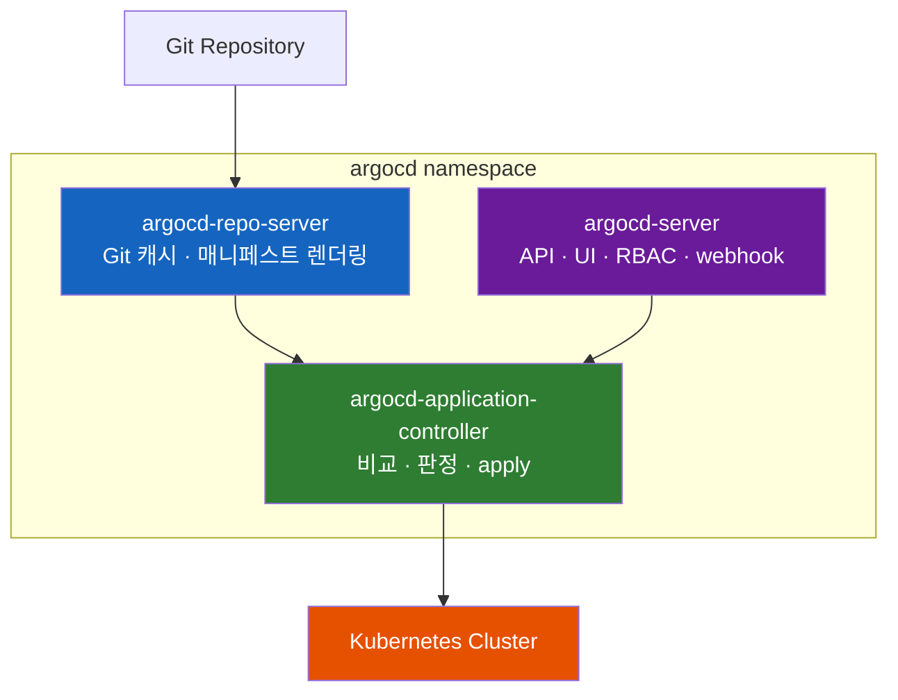

**특징:**
- `Application` CRD 하나가 "무엇을 · 어디에 · 어떻게"를 모두 담는다
- 직관적인 Web UI로 리소스 트리와 상태를 시각화. SSO/RBAC 통합
- 2018년 Intuit에서 개발, CNCF Graduated

ArgoCD의 상태 판정(Sync와 Health가 왜 별개 축인지), `syncPolicy` 스위치, sync wave, App of Apps, ApplicationSet은 [ArgoCD 노트](ArgoCD가-Synced라고-하는데-왜-서비스는-죽어-있을까.md)에서 전부 다룬다.

### 10.2 Flux — GitOps Toolkit이라는 부품 상자

Flux는 하나의 컨트롤러가 아니라 **역할별로 쪼개진 컨트롤러 묶음** 이다. 각자 자기 CRD를 갖고, 쿠버네티스 API를 통해서만 협력한다.

| 컨트롤러 | CRD | 역할 |
|----------|-----|------|
| **source-controller** | `GitRepository`, `OCIRepository`, `HelmRepository`, `Bucket` | 외부 소스를 가져와 `.tar.gz` 아티팩트로 제공. 서명 검증, semver 정책 평가 |
| **kustomize-controller** | `Kustomization` | 아티팩트를 빌드해 클러스터에 apply. 상태 수렴을 담당하는 본체 |
| **helm-controller** | `HelmRelease` | Helm release 라이프사이클 관리 — install · upgrade · rollback · test |
| **notification-controller** | `Alert`, `Provider`, `Receiver` | 인바운드 webhook 수신, 아웃바운드 알림 발송 |
| **image-reflector-controller** | `ImageRepository`, `ImagePolicy` | 레지스트리 태그를 스캔하고 정책으로 평가 |
| **image-automation-controller** | `ImageUpdateAutomation` | 선택된 태그를 Git에 커밋 |

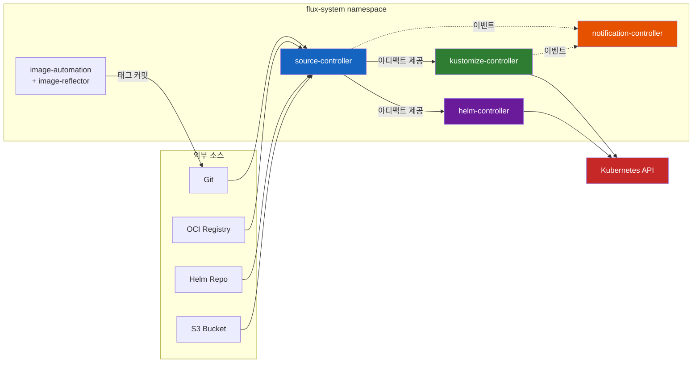

여기서 실무적으로 중요한 차이가 하나 나온다. **Flux의 helm-controller는 실제로 Helm을 실행한다.** release 개념이 존재하고, `helm rollback`과 Helm test, `--wait` 기반 헬스 체크가 동작한다. 반면 ArgoCD는 `helm template`으로 렌더링만 하고 apply한다 — 그래서 release가 없고 `lookup` 함수가 빈 값을 반환한다([ArgoCD 노트 8.4절](ArgoCD가-Synced라고-하는데-왜-서비스는-죽어-있을까.md)). Helm chart에 의존이 깊은 팀에게는 이 차이가 도구 선택의 결정적 요인이 될 수 있다.

### 10.3 같은 배포를 두 도구로 표현하면

7.2절의 prod overlay를 배포하는 선언을 나란히 놓아보면 설계 철학의 차이가 한눈에 보인다.

**ArgoCD — 오브젝트 하나에 전부 담는다.**

```yaml
apiVersion: argoproj.io/v1alpha1
kind: Application
metadata:
  name: payment-api-prod
  namespace: argocd
spec:
  project: default
  source:                                    # 무엇을
    repoURL: https://github.com/myorg/gitops-config.git
    targetRevision: main
    path: apps/payment-api/overlays/prod
  destination:                               # 어디에
    server: https://kubernetes.default.svc
    namespace: payment
  syncPolicy:                                # 어떻게
    automated:
      prune: true
      selfHeal: true
```

**Flux — 소스와 적용을 분리한다.**

```yaml
# 1) 소스는 무엇인가 — 여러 Kustomization이 이것을 공유한다
apiVersion: source.toolkit.fluxcd.io/v1
kind: GitRepository
metadata:
  name: gitops-config
  namespace: flux-system
spec:
  interval: 1m
  url: https://github.com/myorg/gitops-config.git
  ref:
    branch: main
---
# 2) 그 소스의 어디를 어떻게 적용하는가
apiVersion: kustomize.toolkit.fluxcd.io/v1
kind: Kustomization
metadata:
  name: payment-api-prod
  namespace: flux-system
spec:
  interval: 10m
  sourceRef:
    kind: GitRepository
    name: gitops-config
  path: ./apps/payment-api/overlays/prod
  targetNamespace: payment
  prune: true
  wait: true
  timeout: 5m
```

**분리가 만드는 실질적 차이는 Git 부하다.** 5.2절에서 본 "250개 리컨실러가 각자 저장소를 조회하는" 문제를 떠올려 보자. Flux에서는 `GitRepository` 하나가 저장소를 1분마다 가져오고, 그 아티팩트를 수십 개 `Kustomization`이 공유한다. **저장소 조회는 앱 수와 무관하게 한 번이다.** ArgoCD는 repo-server 캐시로 같은 문제를 다르게 푼다.

반대 방향의 차이도 있다. ArgoCD는 "앱 하나 = 오브젝트 하나"이므로 UI·RBAC·상태 표현이 앱 단위로 자연스럽게 정렬된다. 개발자에게 "네 앱의 상태를 여기서 봐라"라고 말하기 쉽다.

그리고 drift 교정의 기본 동작이 다르다. ArgoCD는 `selfHeal: true`라는 명시적 스위치를 켜야 손으로 고친 값을 되돌린다. Flux의 `Kustomization`은 `interval`마다 원하는 상태를 다시 적용하는 구조여서, **drift 교정이 별도 스위치가 아니라 reconcile 동작 자체에 들어 있다.** 6절의 drift 분류를 Flux에서 먼저 정리해야 하는 이유가 이것이다.

### 10.4 어떤 도구를 선택할까?

| 요구사항 | 추천 |
|---------|------|
| 개발자에게 보여줄 UI와 시각화가 중요하다 | **ArgoCD** |
| 경량화·CLI 자동화·쿠버네티스 네이티브 조합이 중요하다 | **Flux** |
| Helm release 개념(rollback, test, `lookup`)이 필요하다 | **Flux** |
| 앱 단위 RBAC·SSO·멀티테넌시 UI가 필요하다 | **ArgoCD** |
| 저장소 조회 부하를 구조적으로 줄이고 싶다 | **Flux** (소스 공유) |
| 엔터프라이즈 상용 지원이 필요하다 | **ArgoCD** (Akuity 등) |
| 이미 Kustomize/Helm을 많이 쓴다 | 둘 다 잘 지원 |

실무적으로는 **조직의 인터페이스 취향** 이 가장 크게 작동한다. "플랫폼 팀이 CLI와 CRD로 모든 것을 다루고 싶다"면 Flux, "여러 팀에 셀프서비스 화면을 제공해야 한다"면 ArgoCD로 수렴하는 경향이 있다.

---

## 11. Kubernetes 밖의 GitOps

GitOps가 왜 쿠버네티스에서 먼저 꽃폈는지를 4.1절에서 이미 답했다. **선언적 API와 레벨 트리거 제어 루프가 이미 있었기 때문이다.** GitOps는 그 루프의 목표값 출처를 Git까지 밀어냈을 뿐이다.

그러면 쿠버네티스가 아닌 것 — RDS 인스턴스, S3 버킷, DNS 레코드 — 은 어떻게 할까? 두 가지 접근이 있다.

| 접근 | 방식 | 대표 도구 |
|------|------|-----------|
| **클라우드 리소스를 쿠버네티스 리소스로 표현** | 클라우드 API를 감싸는 CRD를 만들고, 컨트롤러가 실제 리소스를 조정한다. 그러면 기존 GitOps 루프에 그대로 들어온다 | Crossplane, AWS Controllers for Kubernetes(ACK) |
| **IaC 도구의 실행을 클러스터 안으로 옮김** | `plan`/`apply`를 클러스터 안 컨트롤러가 주기적으로 수행한다 | Terraform Controller, OpenTofu 기반 컨트롤러 |

첫 번째가 더 순수한 GitOps다. 클라우드 리소스도 결국 `kubectl get`으로 조회되고, 같은 리컨실러가 같은 방식으로 수렴시킨다([쿠버네티스는 어떻게 자기 자신을 확장할까 — CRD와 컨트롤러 그리고 Operator](../kubernetes/쿠버네티스는-어떻게-자기-자신을-확장할까-CRD와-컨트롤러-그리고-Operator.md)).

여기서 일반 원리를 뽑을 수 있다. **GitOps를 어떤 시스템에 적용하려면 그 시스템에 세 가지가 있어야 한다** — 상태를 선언적으로 표현할 방법, 현재 상태를 조회할 방법, 차이를 멱등하게 적용할 방법. 명령형 API만 제공하는 시스템(순차 실행 스크립트로만 조작되는 레거시 장비)에서는 GitOps 에이전트가 이 세 가지를 처음부터 만들어야 하고, 그것이 어렵기 때문에 GitOps가 잘 퍼지지 않는다.

그리고 3.5절에서 예고한 반대 방향의 확장도 있다. 상태 저장소를 Git이 아니라 OCI 레지스트리로 두는 구성이다. CI가 렌더링 결과를 아티팩트로 서명해 push하고, Flux의 `OCIRepository`가 그것을 당겨온다. Git 히스토리와 협업은 그대로 쓰면서 **런타임 상태 저장소만 레지스트리로 옮기는 것** 이라서 **"Gitless GitOps"** 라고 불린다. 이름은 도발적이지만 원칙 위반이 아니다 — 원칙 2가 요구한 것은 불변성과 버전 관리였고, 서명된 OCI 아티팩트는 그것을 Git보다 더 강하게 만족한다.

---

## 12. 도입 로드맵과 흔한 안티패턴

지금까지의 내용을 실행 순서로 정리한다. **순서를 지키는 것이 도구 선택보다 중요하다.**

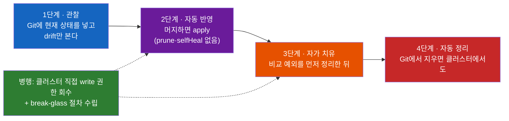

**1단계 · 관찰만 한다.** 기존 클러스터 상태를 Git에 넣고, 자동 반영 없이 drift 표시만 켠다. 여기서 대부분의 팀이 충격을 받는다 — "Git에 없는 리소스가 이렇게 많았나". 이 단계의 산출물은 배포 자동화가 아니라 **현실 파악** 이다.

**2단계 · 자동 반영을 켠다.** 머지하면 apply된다. 아직 자가 치유도 자동 정리도 없다. 이 단계에서 팀이 "이제 kubectl 대신 커밋한다"는 습관을 익힌다.

**3단계 · 자가 치유를 켠다.** 단, 6절의 의도적/시스템 유래 drift를 **먼저** 비교 예외로 정리한 뒤다. 순서를 뒤집으면 HPA와 싸우고, 영구 `OutOfSync`가 쌓이고, 팀이 경고를 무시하기 시작한다.

**4단계 · 자동 정리를 켠다.** 가장 위험하므로 마지막이다. 렌더링 결과가 빈 상태일 때 전부 삭제되는 것을 막는 방어 장치를 반드시 확인한다.

그리고 2·3단계와 병행해야 하는 것이 6.1절의 권한 정리다. 이것 없이는 Git이 진실이 되지 않는다.

### 흔한 안티패턴

| 안티패턴 | 왜 문제인가 | 대신 |
|----------|-------------|------|
| 환경을 브랜치로 나눔 | 구조적 병합 충돌, 환경 간 diff 불가, cherry-pick 운영으로 붕괴 | 디렉터리 + overlay (7.2절) |
| `:latest`나 브랜치 참조 | 원칙 2 위반. Git 텍스트가 안 바뀌므로 **수렴할 대상이 없다** — 파이프라인이 조용히 정지 | 커밋 SHA 태그 또는 다이제스트 (3.2절) |
| 평문 Secret 커밋 | 히스토리·포크·로컬 clone에 영구 잔존 | ESO / Sealed Secrets (9.1절) |
| 자가 치유를 가장 먼저 켬 | 의도적 drift와 싸운다. 컨트롤러 진동과 영구 OutOfSync | 비교 예외 정리 후 (6절, 12절) |
| GitOps 도입 후에도 kubectl write 허용 | Git 히스토리가 "변경의 일부 기록"이 된다 | 컨트롤러만 write + break-glass (6.1절, 9.4절) |
| CD를 여전히 "파이프라인 마지막 단계"로 생각 | 수렴 모델과 어긋나 즉시성을 기대하게 된다 | 상주 컨트롤러로 재인식 (4절, 7.4절) |
| Application/Kustomization을 손으로 하나씩 생성 | 앱 30개 × 환경 3개 = 90개에서 무너진다 | App of Apps → ApplicationSet ([ArgoCD 노트 5·6절](ArgoCD가-Synced라고-하는데-왜-서비스는-죽어-있을까.md)) |
| 승격 흐름을 CI 스크립트로 임시 구현 | 어느 변경이 어느 환경에 있는지 추적 불가 | 승격을 1급 개념으로 (9.3절) |

---

## 13. 정리

GitOps는 단순한 배포 자동화가 아니다. **"Git이 시스템의 진실이다"** 라는 철학을 운영에 적용한 것이고, 그것을 가능하게 하는 메커니즘은 파이프라인이 아니라 **제어 루프** 다.

1. **핵심은 Git이 아니라 reconciliation이다.** OpenGitOps 네 원칙 어디에도 "Git"이 없다. 전통적 CD와 GitOps를 갈라놓는 것은 네 번째 원칙 — level-triggered 제어 루프다. `while (true) { desired vs actual }`이 모델의 전부이고, 여기서 이벤트 유실 내성·멱등성·순서 무관성이 따라 나온다. 대신 반영 시점의 불확정성과 "중간 과정을 표현할 수 없음"이라는 대가를 낸다.

2. **환경은 브랜치가 아니라 디렉터리로 나눈다.** 브랜치 방식은 영구 환경 차이를 머지 충돌로 만들고, 환경 간 diff를 읽을 수 없게 한다. 디렉터리 + Kustomize overlay라면 `diff <(kustomize build dev) <(kustomize build prod)` 한 줄로 환경 차이를 볼 수 있고, 승격은 태그 한 줄 커밋이 된다.

3. **drift는 세 종류이고 대응이 정반대다.** 사람이 만든 사고성 drift는 되돌려야 하지만, HPA 같은 다른 컨트롤러가 소유한 의도적 drift와 admission webhook이 만드는 시스템 유래 drift는 되돌리면 안 된다. 비교 예외를 정리하기 전에 자가 치유를 켜는 것이 GitOps 도입 실패의 가장 흔한 경로다.

4. **Git에 있는 것과 클러스터에 도는 것은 같지 않다.** Helm/Kustomize는 DRY를 위해 Git에 "레시피"를 둔다. 그 대가로 chart 버전 한 줄짜리 PR이 실제로 무엇을 바꾸는지 리뷰에서 보이지 않는다. Rendered Manifests 패턴은 렌더링을 커밋 시점으로 옮겨 이 간극을 Git 안으로 끌어들인다.

5. **GitOps가 주지 않는 것을 미리 알아야 한다.** Secret(원칙 2의 예외), 점진적 배포(Argo Rollouts / Flagger), 환경 승격(Kargo / GitOps Promoter)은 각각 별개 층이다. 그리고 "Git 히스토리가 감사 로그"라는 주장은 브랜치 보호·커밋 서명·클러스터 write 권한 회수라는 세 조건 위에서만 참이다.

2017년 Weaveworks의 Alexis Richardson이 창안한 이후, GitOps는 Kubernetes 생태계의 표준 운영 모델로 자리 잡았다. 용어를 만든 회사는 2024년에 사라졌지만 모델은 남았고, ArgoCD와 Flux라는 두 CNCF Graduated 프로젝트가 이를 뒷받침하고 있다. **그 모델의 본질을 한 문장으로 압축하면 이렇다 — GitOps는 쿠버네티스가 이미 하고 있던 일(선언과 현실을 계속 수렴시키는 것)을 Git까지 한 칸 더 확장한 것이다.**

---

## 출처

- [OpenGitOps Principles](https://opengitops.dev/) · [OpenGitOps 1.0 발표](https://opengitops.dev/blog/1.0-announcement) — CNCF 공식 4원칙 원문과 각 원칙의 의도
- [Weaveworks Blog — Operations by Pull Request (2017)](https://www.weave.works/blog/gitops-operations-by-pull-request) — GitOps 용어 최초 등장
- [CNCF GitOps Working Group](https://github.com/cncf/tag-app-delivery/tree/main/gitops-wg) — 원칙 제정 과정과 용어집
- [ArgoCD Documentation](https://argo-cd.readthedocs.io/en/stable/) — Application, syncPolicy, 아키텍처
- [Argo CD — Source Hydrator](https://argo-cd.readthedocs.io/en/stable/user-guide/source-hydrator/) — `drySource` · `syncSource` · `hydrateTo`, 현재 Alpha
- [Flux CD Documentation](https://fluxcd.io/) · [Flux from End-to-End](https://fluxcd.io/flux/flux-e2e/) — GitOps Toolkit 컨트롤러 구성과 각 역할
- [Flux controller releases](https://fluxcd.io/flux/releases/controllers/) — 컨트롤러별 저장소와 의존 관계
- [Argo Rollouts Documentation](https://argo-rollouts.readthedocs.io/) — Progressive Delivery 층
- [GitOps Promoter](https://gitops-promoter.readthedocs.io/) — hydration 계약과 PR 기반 승격
- [Akuity — The Rendered Manifests Pattern](https://akuity.io/blog/the-rendered-manifests-pattern) — CI 렌더링 · sourceHydrator · Kargo · OCI 네 가지 구현 비교
- [Akuity — GitOps Best Practices Whitepaper](https://akuity.io/blog/gitops-best-practices-whitepaper) — 환경별 브랜치 금지, Conway의 법칙과 저장소 구조
- [Platform Engineering — GitOps architecture, patterns and anti-patterns](https://platformengineering.org/blog/gitops-architecture-patterns-and-anti-patterns) — 브랜치 기반 승격이 안티패턴인 이유, OCI 기반 "Gitless GitOps"
- [DevOps Directive — The Rendered Manifests Pattern](https://devopsdirective.com/posts/2026/01/rendered-manifests-pattern/) — 렌더링 정합성을 CI에서 강제하는 구현
- [Git Is Not Your Source of Truth (ITNEXT)](https://itnext.io/git-is-not-your-source-of-truth-rethinking-gitops-for-kubernetes-platforms-e50666f38e5e) — Git이 담는 것은 참조와 의도라는 관점, 규모에서의 Git 부하
- [Buoyant — Flagger vs Argo Rollouts](https://www.buoyant.io/blog/flagger-vs-argo-rollouts-for-progressive-delivery-on-linkerd) — 두 도구의 기본값 철학 차이와 GitOps 도구와의 조합

---

## 함께 읽기

> - [ArgoCD가 Synced라고 하는데 왜 서비스는 죽어 있을까](ArgoCD가-Synced라고-하는데-왜-서비스는-죽어-있을까.md) — 이 노트의 도구 층. Sync와 Health, `syncPolicy` 세 스위치, sync wave, App of Apps와 ApplicationSet, 비교 예외 설정
> - [쿠버네티스는 어떻게 자기 자신을 확장할까 — CRD와 컨트롤러 그리고 Operator](../kubernetes/쿠버네티스는-어떻게-자기-자신을-확장할까-CRD와-컨트롤러-그리고-Operator.md) — 4.1절의 제어 루프가 쿠버네티스에 원래 있던 이유, 그리고 11절의 Crossplane이 가능한 이유
> - [Helm: 쿠버네티스의 패키지 매니저는 왜 필요한가](../kubernetes/Helm-쿠버네티스의-패키지-매니저는-왜-필요한가.md) · [내 첫 Helm Chart](../kubernetes/내-첫-Helm-Chart-helm-create부터-helm-install까지.md) — 8절 DRY/WYSIWYG 딜레마의 한쪽 축
> - [rollout restart를 했는데 왜 예전 코드가 그대로 돌까 — 이미지 태그와 다이제스트](../kubernetes/rollout-restart를-했는데-왜-예전-코드가-그대로-돌까-이미지-태그와-다이제스트.md) — 3.2절 "불변 참조" 문제의 뿌리
> - [Pod는 어떻게 쿠버네티스 API에 자기를 증명할까 — ServiceAccount와 RBAC](../kubernetes/Pod는-어떻게-쿠버네티스-API에-자기를-증명할까-ServiceAccount와-RBAC.md) — 6.1절의 권한 회수를 실제로 어떻게 하는가
> - [Kubernetes ConfigMap & Secret](../kubernetes/Kubernetes-ConfigMap-Secret.md) — 9.1절이 다루는 그 Secret
> - [Kubernetes Deployment Strategy](../kubernetes/Kubernetes-Deployment-Strategy.md) — 9.2절 Progressive Delivery가 대체하려는 기본 롤아웃
> - [Harbor: 왜 회사들은 사내 컨테이너 레지스트리를 두는가](../kubernetes/Harbor-왜-회사들은-사내-컨테이너-레지스트리를-두는가.md) — 8.3절 OCI 아티팩트를 상태 저장소로 쓰는 이야기의 전제
