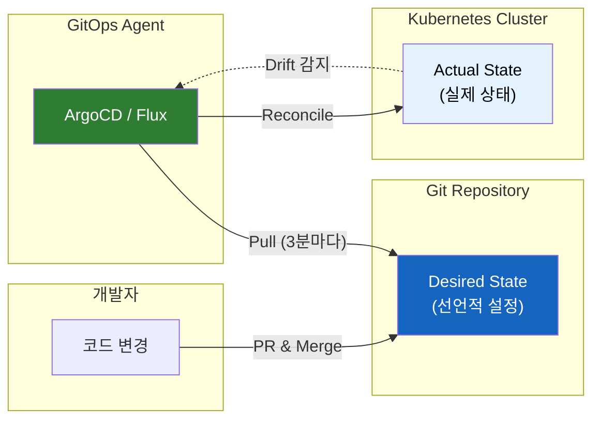
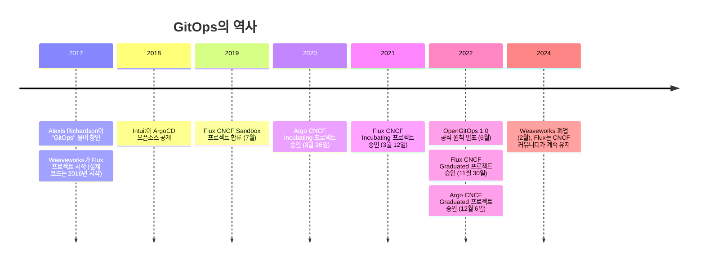
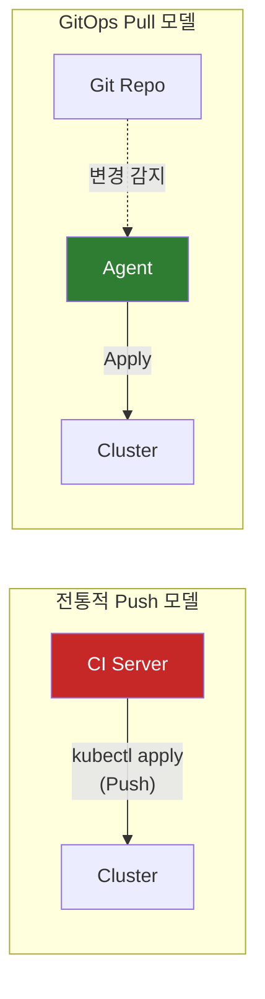
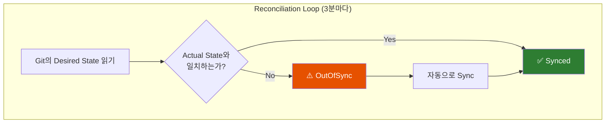
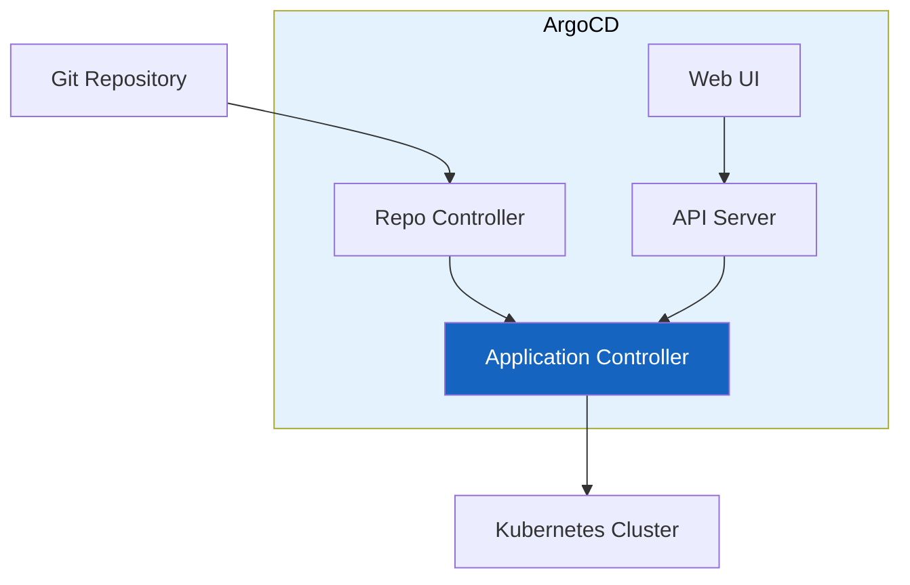

# GitOps: Git을 Single Source of Truth로 삼는 운영 모델

"kubectl apply를 직접 실행하지 마세요. Git에 커밋하면 시스템이 알아서 반영합니다."

## 결론부터 말하면

**GitOps는 도구가 아니라 운영 모델이다.** Git을 시스템의 "진짜 상태(Single Source of Truth)"로 삼고, 자동화된 에이전트가 실제 시스템을 Git의 선언적 상태와 지속적으로 일치시키는 방식이다.



| 구분 | 전통적 CI/CD (Push) | GitOps (Pull) |
|------|---------------------|---------------|
| 배포 주체 | CI 파이프라인이 클러스터에 Push | 클러스터 내 에이전트가 Git에서 Pull |
| 자격 증명 | CI 시스템에 클러스터 접근 권한 필요 | 클러스터 내부에서만 동작 |
| Drift 대응 | 감지 어려움, 수동 확인 필요 | 자동 감지 및 복구 |
| 롤백 | 파이프라인 재실행 | `git revert` |

---

## 1. 왜 GitOps가 필요했을까?

### 1.1 CI/CD 파이프라인의 한계

2017년 이전, 대부분의 조직은 Jenkins나 GitHub Actions 같은 CI/CD 파이프라인으로 배포했다. 흐름은 이랬다:

1. 개발자가 코드 Push
2. CI가 빌드 & 테스트
3. CI가 `kubectl apply`로 클러스터에 직접 배포

언뜻 보면 완벽해 보인다. 하지만 운영 규모가 커지면서 문제가 드러났다.

### 1.2 "누가, 언제, 뭘 바꿨지?"

**첫 번째 문제: 추적 불가능한 변경**

```bash
# 긴급 상황에서 누군가 이렇게 했다
kubectl scale deployment api --replicas=10

# 1주일 후...
"왜 레플리카가 10개지? 원래 3개 아니었나?"
```

CI/CD 파이프라인은 "배포 성공" 로그만 남긴다. 하지만 운영자가 직접 `kubectl`로 수정한 내용은 어디에도 기록되지 않는다. Git에는 replica=3이라고 되어 있는데, 실제로는 10개가 돌고 있다. 이것이 **Configuration Drift(설정 드리프트)** 다.

### 1.3 "CI 서버가 해킹당하면?"

**두 번째 문제: 과도한 권한 집중**

전통적 Push 모델에서 CI 서버는 모든 환경에 배포할 수 있는 자격 증명을 갖고 있다.

```yaml
# CI 파이프라인에 저장된 시크릿
KUBE_CONFIG: <production-cluster-admin-token>
```

CI 서버가 공격당하면? 공격자는 프로덕션 클러스터에 대한 전체 접근 권한을 얻게 된다.

### 1.4 "파이프라인이 실패하면 어떻게 되지?"

**세 번째 문제: 배포 실패 시 상태 불일치**

```
Pipeline Step 1: ✅ DB 마이그레이션 완료
Pipeline Step 2: ✅ API 서버 배포 완료
Pipeline Step 3: ❌ Frontend 배포 실패 (네트워크 오류)
```

파이프라인 중간에 실패하면? 절반만 배포된 상태가 된다. "Deploy and hope(배포하고 기도하기)" 모델의 전형적인 문제다.

---

## 2. Weaveworks와 GitOps의 탄생

### 2.1 2017년, 용어의 등장

**GitOps라는 용어는 2017년 Weaveworks의 CEO Alexis Richardson이 "Operations by Pull Request"라는 블로그 포스트에서 처음 사용했다.**

Richardson은 Weaveworks 팀이 Kubernetes 클러스터를 운영하면서 발견한 패턴을 정리했다:

> "Git을 single source of truth로 삼고, 모든 변경을 Pull Request로 처리하면,
> 배포가 선언적이고 버전 관리되며 감사 가능해진다."

### 2.2 "GitOps"라는 이름의 의미

Richardson이 이 용어를 만든 이유는 명확하다:

| 단어 | 의미 |
|------|------|
| **Git** | 버전 관리 시스템 = Single Source of Truth |
| **Ops** | 운영(Operations) = 인프라와 애플리케이션 관리 |

"DevOps"가 개발과 운영의 협업을 강조했다면, **"GitOps"는 Git이 운영의 중심이 되어야 한다** 는 철학을 담았다.

### 2.3 Flux의 탄생

Weaveworks는 말만 한 게 아니었다. 직접 도구를 만들었다. **Flux CD** 는 Git 저장소를 감시하고, 변경이 감지되면 자동으로 Kubernetes 클러스터에 적용하는 오픈소스 프로젝트다.



---

## 3. GitOps의 4가지 원칙 (OpenGitOps)

CNCF의 OpenGitOps 프로젝트는 GitOps를 정의하는 4가지 원칙을 발표했다.

### 3.1 Declarative (선언적)

**"어떻게(How)"가 아니라 "무엇(What)"을 정의한다.**

```yaml
# 명령형 (Imperative) - ❌ GitOps가 아님
kubectl scale deployment api --replicas=5
kubectl set image deployment/api api=v2.0

# 선언형 (Declarative) - ✅ GitOps
apiVersion: apps/v1
kind: Deployment
metadata:
  name: api
spec:
  replicas: 5
  template:
    spec:
      containers:
      - name: api
        image: myapp:v2.0
```

Java 개발자에게 익숙한 비유: Spring의 `@Bean` 설정과 같다. "이 객체를 이렇게 만들어라"가 아니라 "이런 객체가 있어야 한다"를 선언한다.

### 3.2 Versioned and Immutable (버전 관리 & 불변)

**모든 원하는 상태(Desired State)는 Git에 저장되어 버전 관리된다.**

```bash
# 누가, 언제, 왜 변경했는지 모든 기록이 남는다
git log --oneline infrastructure/
abc1234 feat: API 레플리카 5개로 증가 (트래픽 대응)
def5678 fix: DB 연결 풀 크기 조정
ghi9012 refactor: 환경별 설정 분리
```

롤백? `git revert`면 끝이다.

### 3.3 Pulled Automatically (자동 Pull)

**변경을 Push하는 것이 아니라, 에이전트가 Pull해서 적용한다.**



**왜 Pull이 더 안전할까?**

- CI 서버가 클러스터 자격 증명을 가질 필요가 없다
- 클러스터 내부에서만 동작하므로 공격 표면이 줄어든다
- 네트워크 방화벽으로 외부 접근을 완전히 차단할 수 있다

### 3.4 Continuously Reconciled (지속적 조정)

**에이전트가 실제 상태(Actual State)를 원하는 상태(Desired State)와 지속적으로 비교하고 조정한다.**



**Self-Healing(자가 치유)의 핵심:**

```bash
# 누군가 실수로 직접 수정했다
kubectl delete pod api-xxx

# 기존 CI/CD: "모르겠고, 파이프라인 다시 돌려야 함"
# GitOps: "Git에는 replica=3이니까 자동으로 복구"
```

---

## 4. Push vs Pull: 운영 철학의 차이

단순히 "Push냐 Pull이냐"의 문제가 아니다. **운영 철학 자체가 다르다.**

| 관점 | Push-based (전통 CI/CD) | Pull-based (GitOps) |
|------|------------------------|---------------------|
| 배포 철학 | Pipeline-driven | State-driven |
| 명령 방식 | Imperative (명령형) | Declarative (선언적) |
| 배포 전략 | "Deploy and hope" | "Continuously reconcile" |
| 신뢰 대상 | 파이프라인을 신뢰 | Git을 신뢰 |
| Drift 대응 | 수동 확인/복구 | 자동 감지/복구 |

### 4.1 언제 GitOps를 선택해야 할까?

**GitOps가 빛나는 상황:**

- 여러 Kubernetes 클러스터를 관리할 때
- 팀 규모가 커지고 변경 추적이 중요할 때
- 감사(Audit) 요구사항이 있을 때
- Configuration Drift가 문제가 될 때

**전통적 Push가 더 나은 상황:**

- 단순한 시스템
- Kubernetes가 아닌 환경
- 빠른 프로토타이핑이 필요할 때

---

## 5. 대표적인 GitOps 도구

### 5.1 ArgoCD



**특징:**
- 직관적인 Web UI로 애플리케이션 상태 시각화
- Multi-cluster 지원
- SSO/RBAC 통합
- 2018년 Intuit에서 개발, CNCF Graduated 프로젝트

### 5.2 Flux CD

**특징:**
- CLI-first 접근 (UI 없음)
- Kubernetes-native (CRD 기반)
- 모듈식 아키텍처 (Source Controller, Kustomize Controller 등)
- 2017년 Weaveworks에서 개발, CNCF Graduated 프로젝트

### 5.3 어떤 도구를 선택할까?

| 요구사항 | 추천 도구 |
|---------|----------|
| UI와 시각화가 중요하다 | **ArgoCD** |
| 경량화와 CLI 자동화가 중요하다 | **Flux** |
| 엔터프라이즈 지원이 필요하다 | **ArgoCD** (Akuity 지원) |
| 이미 Helm/Kustomize를 많이 쓴다 | 둘 다 잘 지원 |

---

## 6. GitOps 저장소 구조

### 6.1 Monorepo vs Polyrepo

**Monorepo (단일 저장소):**

```
infrastructure/
├── apps/
│   ├── api/
│   │   ├── base/
│   │   │   ├── deployment.yaml
│   │   │   └── service.yaml
│   │   └── overlays/
│   │       ├── dev/
│   │       ├── staging/
│   │       └── prod/
│   └── frontend/
└── clusters/
    ├── dev/
    ├── staging/
    └── prod/
```

**Polyrepo (분리 저장소):**

```
# 애플리케이션 코드
my-app/
├── src/
├── Dockerfile
└── Jenkinsfile

# 인프라 설정 (별도 저장소)
my-app-deploy/
├── base/
└── overlays/
```

### 6.2 권장 패턴

**App Repo와 Config Repo를 분리하라:**

| 저장소 | 내용 | 변경 주체 |
|--------|------|----------|
| App Repo | 소스 코드, Dockerfile, CI 파이프라인 | 개발자 |
| Config Repo | Kubernetes manifests, Helm values | CI (이미지 태그 업데이트), 운영자 |

왜 분리할까?
- 애플리케이션 코드 변경과 인프라 설정 변경의 주기가 다르다
- 접근 권한을 분리할 수 있다
- Config Repo에 대한 변경만 감사하면 된다

---

## 7. 정리

GitOps는 단순한 배포 자동화가 아니다. **"Git이 시스템의 진실이다"** 라는 철학을 운영에 적용한 것이다.

**핵심 가치:**

1. **선언적 설정** - "무엇"을 정의하면 시스템이 "어떻게"를 알아서 한다
2. **Git = 감사 로그** - 모든 변경이 커밋으로 남는다
3. **자동 복구** - Drift가 발생해도 자동으로 원래 상태로 돌아간다
4. **보안 강화** - CI 서버에 클러스터 접근 권한이 필요 없다

2017년 Weaveworks의 Alexis Richardson이 창안한 이후, GitOps는 Kubernetes 생태계의 표준 운영 모델로 자리 잡았다. ArgoCD와 Flux라는 두 CNCF Graduated 프로젝트가 이를 뒷받침하고 있다.

---

## 출처

- [Weaveworks Blog - Operations by Pull Request (2017)](https://www.weave.works/blog/gitops-operations-by-pull-request) - GitOps 용어 최초 등장
- [OpenGitOps Principles](https://opengitops.dev/) - CNCF OpenGitOps 공식 원칙
- [ArgoCD Documentation](https://argo-cd.readthedocs.io/) - ArgoCD 공식 문서
- [Flux CD Documentation](https://fluxcd.io/) - Flux CD 공식 문서
- [CNCF GitOps Working Group](https://github.com/cncf/tag-app-delivery/tree/main/gitops-wg)
