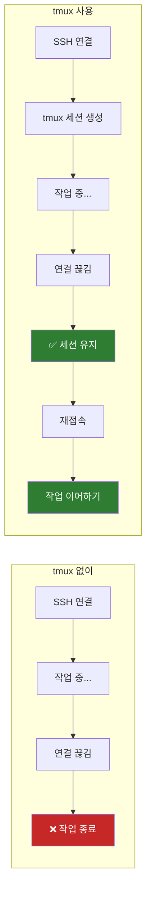
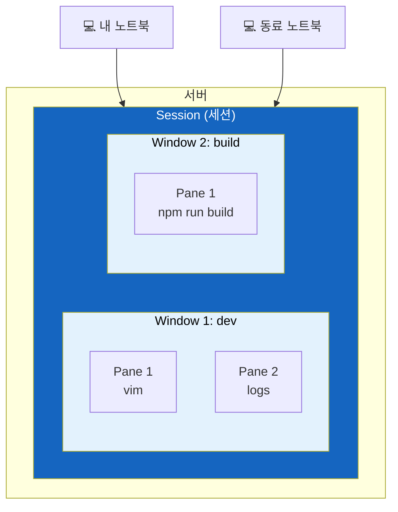

# tmux - 터미널 멀티플렉서의 모든 것

SSH 연결이 끊겨도 작업이 살아있고, 하나의 터미널에서 여러 작업을 동시에 할 수 있다면?

## 결론부터 말하면

**tmux는 터미널 세션을 서버에 유지시켜주는 도구다.** SSH 연결이 끊겨도 작업이 계속 실행되고, 나중에 다시 접속해서 이어할 수 있다. 또한 하나의 터미널 창에서 여러 작업 공간을 만들고 전환할 수 있다.



| 상황 | tmux 없이 | tmux 사용 |
|------|-----------|-----------|
| SSH 끊김 | 작업 종료 | 세션 유지 |
| 여러 작업 동시에 | 터미널 여러 개 | 하나의 창에서 분할 |
| 장시간 빌드/배포 | 컴퓨터 켜놔야 함 | 퇴근해도 OK |

---

## 1. 왜 tmux가 필요한가?

### 1.1 SSH의 치명적인 약점

서버에서 작업하다 보면 누구나 한 번쯤 겪는 상황이 있다.

> "빌드 돌려놓고 커피 마시러 갔다 왔는데... 연결이 끊겨있다?"

SSH는 연결 기반 프로토콜이다. 네트워크가 불안정하거나, 노트북을 닫거나, 공유기가 재부팅되면 연결이 끊긴다. 문제는 **SSH 연결이 끊기면 그 위에서 실행 중이던 모든 프로세스가 종료된다는 것이다.**

왜 그럴까? SSH로 접속하면 서버에 PTY(가상 터미널)가 생성된다. 이 PTY에서 실행한 프로세스들은 PTY가 닫히면 SIGHUP 신호를 받고 종료된다. SSH 연결이 끊기면 PTY도 닫히고, 결국 모든 작업이 날아간다.

### 1.2 nohup으로는 부족하다

"nohup 쓰면 되지 않나요?"라고 생각할 수 있다.

```bash
nohup ./long-running-script.sh &
```

맞다. nohup은 SIGHUP 신호를 무시하게 해서 프로세스가 살아남게 한다. 하지만 **상호작용이 불가능하다.** 로그를 실시간으로 보거나, 중간에 입력을 넣거나, 에러가 났을 때 바로 대응할 수 없다.

그래서 tmux가 필요하다. tmux는 세션을 서버에 유지하면서도, 언제든지 다시 붙어서(attach) 상호작용할 수 있다.

### 1.3 터미널 창 관리의 한계

또 다른 문제가 있다. 서버에서 동시에 여러 작업을 해야 할 때:
- 한쪽에서는 로그를 모니터링하고
- 한쪽에서는 코드를 수정하고
- 한쪽에서는 빌드를 돌리고

SSH 창을 여러 개 열 수도 있지만, 관리가 힘들고 창이 많아지면 헷갈린다. tmux는 **하나의 SSH 연결 안에서 여러 작업 공간을 만들고 자유롭게 전환** 할 수 있게 해준다.

---

## 2. tmux의 구조 이해하기

tmux를 제대로 쓰려면 세 가지 개념을 이해해야 한다.



| 개념 | 비유 | 설명 |
|------|------|------|
| **Session** | 작업 프로젝트 | 서버에 유지되는 작업 환경 전체 |
| **Window** | 브라우저 탭 | 세션 안의 각 화면, 탭처럼 전환 |
| **Pane** | 분할 화면 | 윈도우를 나눈 각 영역 |

**Session** 은 tmux의 최상위 단위다. SSH 연결이 끊겨도 세션은 서버에 살아있다. 나중에 다시 attach하면 끊기기 전 상태 그대로 이어할 수 있다.

**Window** 는 세션 안의 탭이다. "개발용", "빌드용", "모니터링용" 같이 용도별로 윈도우를 만들고 전환할 수 있다.

**Pane** 은 윈도우를 분할한 것이다. 한 화면에서 왼쪽은 vim, 오른쪽은 로그 모니터링처럼 동시에 여러 작업을 볼 수 있다.

---

## 3. tmux 필수 명령어

### 3.1 세션 관리

```bash
# 새 세션 시작 (이름 지정)
tmux new -s myproject

# 세션 목록 보기
tmux ls

# 세션에 다시 붙기
tmux attach -t myproject
# 또는 줄여서
tmux a -t myproject

# 세션 종료 (세션 안에서)
exit
# 또는
Ctrl-d
```

**가장 중요한 것: detach**

세션에서 빠져나오되 세션은 유지하려면 `Ctrl-b d`를 누른다. 이게 tmux의 핵심이다. detach하면 SSH를 끊어도 세션은 살아있다.

### 3.2 Prefix 키

tmux 명령은 대부분 **Prefix 키** 를 먼저 누르고 입력한다. 기본 Prefix는 `Ctrl-b`다.

| 동작 | 키 조합 | 설명 |
|------|---------|------|
| Detach | `Ctrl-b d` | 세션에서 빠져나오기 |
| 새 윈도우 | `Ctrl-b c` | create의 c |
| 다음 윈도우 | `Ctrl-b n` | next의 n |
| 이전 윈도우 | `Ctrl-b p` | previous의 p |
| 윈도우 번호로 이동 | `Ctrl-b 숫자` | 0, 1, 2... |
| 수직 분할 | `Ctrl-b %` | 세로선(%)처럼 분할 |
| 수평 분할 | `Ctrl-b "` | 따옴표(")처럼 분할 |
| Pane 이동 | `Ctrl-b 화살표` | 방향키로 이동 |
| Pane 닫기 | `Ctrl-b x` | 현재 pane 종료 |

### 3.3 실전 예시: 개발 환경 구성

```bash
# 1. 새 세션 생성
tmux new -s dev

# 2. 첫 번째 윈도우에서 vim 실행
vim app.py

# 3. 새 윈도우 생성 (Ctrl-b c), 이름 변경 (Ctrl-b ,)
# "logs"라고 이름 붙이기

# 4. 로그 모니터링
tail -f /var/log/app.log

# 5. 윈도우 전환: Ctrl-b 0 (첫 번째 윈도우), Ctrl-b 1 (두 번째 윈도우)

# 6. 퇴근할 때: Ctrl-b d (detach)
# 다음 날: tmux a -t dev
```

---

## 4. 언제 tmux를 쓰면 좋은가?

### 4.1 장시간 실행 작업

```bash
# 빌드, 배포, 데이터 처리 등
tmux new -s build
npm run build:production  # 30분 걸리는 빌드
# Ctrl-b d로 detach하고 퇴근
```

### 4.2 서버 모니터링

```bash
tmux new -s monitor
# 화면 분할해서 여러 로그 동시 모니터링
# Ctrl-b % (수직 분할)
tail -f /var/log/nginx/access.log
# Ctrl-b 화살표 (다른 pane으로 이동)
tail -f /var/log/app/error.log
```

### 4.3 페어 프로그래밍

같은 세션에 여러 사람이 attach할 수 있다. 한 사람이 타이핑하면 다른 사람 화면에도 실시간으로 보인다. 단, 두 사용자가 어떤 OS 계정으로 붙느냐에 따라 절차가 달라진다.

**케이스 1: 같은 계정에 SSH로 들어오는 경우**

```bash
# A가 세션 생성
tmux new -s pair

# B도 동일 계정(예: deploy)으로 SSH 접속 후
tmux a -t pair
```

이 경우 둘 다 `/tmp/tmux-<UID>/default` 소켓을 공유하므로 추가 설정이 필요 없다.

**케이스 2: 서로 다른 OS 계정인 경우**

기본 socket은 `/tmp/tmux-<UID>/`에 사용자 본인만 접근 가능한 권한(0700)으로 생성되기 때문에, 단순히 `tmux a`로 붙으려 하면 다른 사용자는 "no server running" 또는 권한 오류를 만난다. 이때는 공유 socket을 명시적으로 만들어야 한다.

```bash
# A가 공유 socket 경로로 세션 생성
tmux -S /tmp/pair-sock new -s pair

# 다른 사용자가 접근 가능하도록 권한 부여 (그룹 공유)
chgrp devs /tmp/pair-sock && chmod 770 /tmp/pair-sock

# B가 같은 socket을 지정해 attach
tmux -S /tmp/pair-sock a -t pair
```

`-S` 옵션은 socket 파일 경로를 지정하는 옵션으로, 모든 tmux 명령에 동일하게 붙여야 한다(`ls`, `kill-session` 등 포함). 작업이 끝나면 socket 파일을 삭제하는 것을 잊지 말자.

### 4.4 불안정한 네트워크 환경

카페, 기차, 비행기에서 작업할 때. 네트워크가 끊겨도 작업이 날아가지 않는다.

---

## 5. 유용한 설정 (선택사항)

`~/.tmux.conf` 파일을 만들어 설정을 커스터마이징할 수 있다.

```bash
# 마우스 지원 (pane 크기 조절, 스크롤 등)
set -g mouse on

# Prefix를 Ctrl-a로 변경 (screen 스타일)
# unbind C-b
# set -g prefix C-a

# pane 분할 키를 직관적으로
bind | split-window -h  # |로 수직 분할
bind - split-window -v  # -로 수평 분할

# 윈도우/pane 번호를 1부터 시작
set -g base-index 1
setw -g pane-base-index 1

# 256 색상 지원
# screen-256color: 범용적, 대부분 서버에서 동작
# tmux-256color: 이탤릭 등 더 많은 기능 지원 (terminfo 필요)
set -g default-terminal "screen-256color"
```

설정 적용:
```bash
# 실행 중인 tmux에서
tmux source-file ~/.tmux.conf
```

### macOS iTerm2 사용자 팁

iTerm2는 **tmux Integration(Control Mode)** 을 지원한다. `tmux -CC`로 세션을 열면 tmux의 윈도우/pane이 iTerm2의 네이티브 탭과 분할 창으로 동작한다.

```bash
# iTerm2 통합 모드로 세션 시작
tmux -CC new -s myproject

# 기존 세션에 통합 모드로 붙기
tmux -CC a -t myproject
```

Prefix 키 없이 `Cmd+D`(수직 분할), `Cmd+Shift+D`(수평 분할) 같은 iTerm2 단축키를 그대로 쓸 수 있다.

### 서버 재부팅 대비: tmux-resurrect

tmux는 SSH 끊김에는 강하지만, **서버가 재부팅되면 세션이 사라진다.** 이를 대비하려면 `tmux-resurrect` 플러그인을 사용한다.

```bash
# 플러그인 설치 (TPM 사용 시)
# ~/.tmux.conf에 추가
set -g @plugin 'tmux-plugins/tmux-resurrect'
set -g @plugin 'tmux-plugins/tmux-continuum'  # 자동 저장/복원

# 수동 저장: Ctrl-b Ctrl-s
# 수동 복원: Ctrl-b Ctrl-r
```

`tmux-continuum`을 함께 쓰면 15분마다 자동 저장되고, tmux 시작 시 자동 복원된다.

---

## 6. 정리

### tmux를 써야 하는 이유

1. **SSH 끊김 방지**: 네트워크 문제로 작업이 날아가는 일이 없다
2. **세션 유지**: 퇴근해도 빌드가 계속 돌아간다
3. **작업 공간 관리**: 하나의 연결로 여러 작업을 동시에
4. **협업**: 같은 세션을 여러 명이 공유

### 필수 암기 명령어

| 상황 | 명령어 |
|------|--------|
| 세션 시작 | `tmux new -s 이름` |
| 세션 목록 | `tmux ls` |
| 세션 붙기 | `tmux a -t 이름` |
| 세션 빠져나오기 | `Ctrl-b d` |
| 새 윈도우 | `Ctrl-b c` |
| 윈도우 전환 | `Ctrl-b 숫자` |
| 화면 분할 | `Ctrl-b %` / `Ctrl-b "` |

---

## 출처

- [tmux GitHub Repository](https://github.com/tmux/tmux) - 공식 저장소
- [tmux Wiki](https://github.com/tmux/tmux/wiki) - 공식 문서
- [A Quick and Easy Guide to tmux](https://www.hamvocke.com/blog/a-quick-and-easy-guide-to-tmux/) - 입문 가이드
