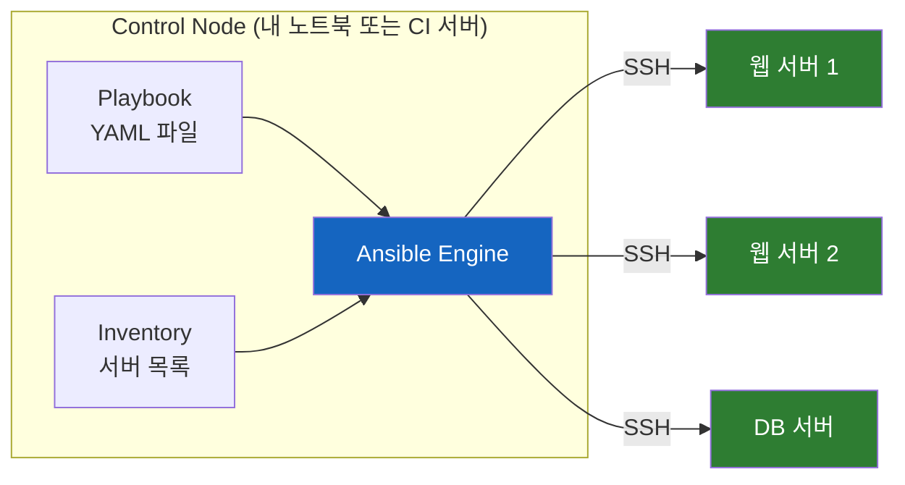
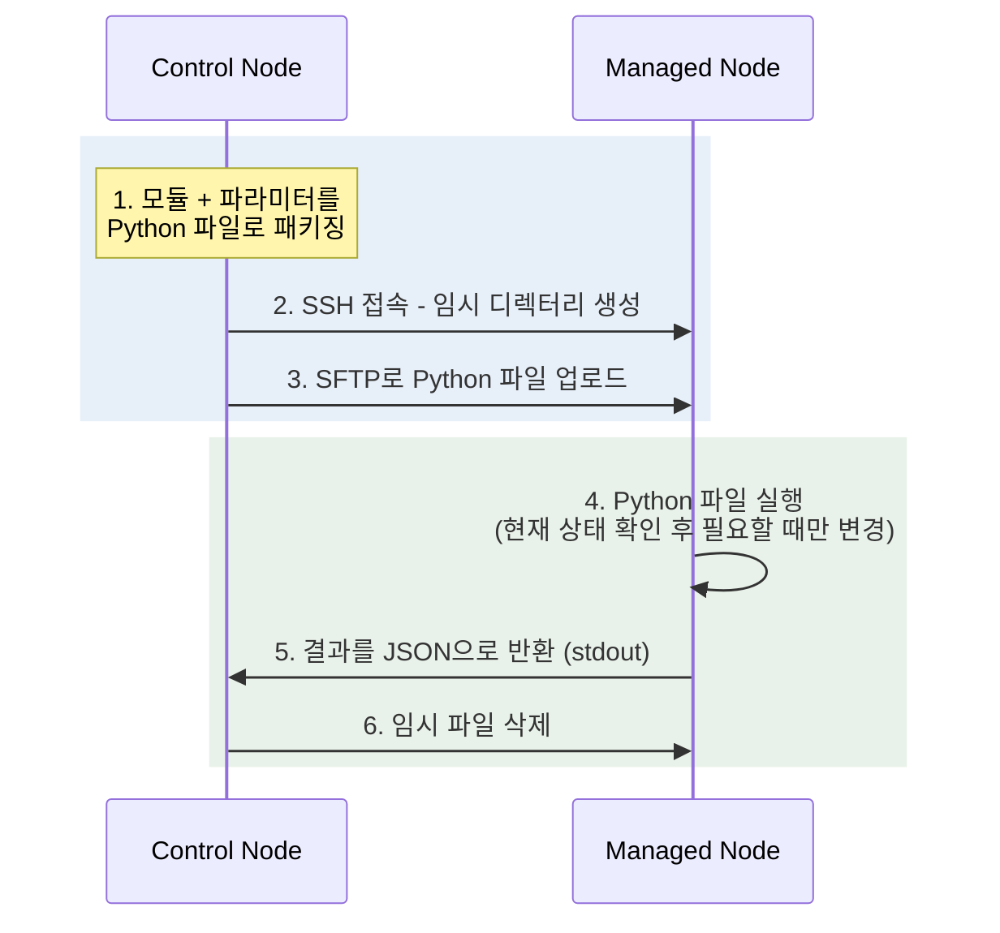

# 왜 Ansible은 에이전트 없이 수천 대의 서버를 관리할까

## 결론부터 말하면

**Ansible은 관리 대상 서버에 별도의 에이전트를 설치하지 않고, SSH로 접속해서 필요한 작업을 밀어 넣는(push) 방식의 자동화 도구다.** 서버 상태를 YAML로 선언해 두면 Ansible이 SSH로 들어가 그 상태를 만들어 준다. 2012년 Michael DeHaan이 "Puppet과 Chef는 너무 복잡하다"는 문제의식으로 만들었고, 2015년 Red Hat이 인수해 지금까지 유지하고 있다.



핵심은 세 가지다. **에이전트가 없다** (SSH만 되면 관리 대상이 된다). **YAML로 쓴다** (프로그래밍 언어를 몰라도 읽을 수 있다). **멱등성(idempotency)을 지향한다** (같은 플레이북을 100번 실행해도 결과는 같다).

---

## 1. 왜 Ansible이 필요했을까

### 서버 10대에 nginx를 설치해야 한다면

서버가 한두 대일 때는 SSH로 접속해서 `apt install nginx`를 치면 된다. 그런데 서버가 10대라면? 10번 반복하면 된다. 100대라면? 셸 스크립트에 `for` 루프를 돌리기 시작한다. 그리고 여기서부터 지옥이 열린다.

스크립트는 **"어떻게(How)"만 기술하고 "현재 상태"를 모르기 때문이다.** 3번 서버는 이미 nginx가 깔려 있는데 스크립트가 또 설치를 시도하다 에러로 죽고, 7번 서버는 네트워크가 잠깐 끊겨서 절반만 실행됐다. 이제 100대의 서버는 각자 미묘하게 다른 상태가 됐고, 어느 서버가 어떤 상태인지 아무도 모른다. 이런 서버를 **눈송이 서버(snowflake server)** 라고 부른다 — 눈송이처럼 하나하나 모양이 달라서 재현할 수 없는 서버라는 뜻이다.

이 문제를 풀기 위해 2000년대에 **구성 관리(Configuration Management)** 도구들이 등장했다. "명령을 나열"하는 대신 "서버가 도달해야 할 상태를 선언"하고, 도구가 현재 상태와 비교해서 차이만 메꾸는 접근이다. CFEngine(1993), Puppet(2005), Chef(2009)가 이 계보다.

### 그런데 Puppet과 Chef도 아팠다

문제가 해결된 것 같지만, 당시 Puppet과 Chef를 실제로 도입해 본 사람들은 다른 종류의 고통을 겪었다. 두 도구 모두 **에이전트(agent) 기반** 이었기 때문이다. 에이전트란 관리 대상 서버마다 상주시켜야 하는 데몬 프로세스로, 중앙 서버(master)에 주기적으로 접속해 "내가 적용해야 할 설정이 있나요?"라고 물어보는(pull) 역할을 한다.

이 구조는 강력하지만 비용이 크다. 자동화를 **시작하기 위해** 먼저 해야 할 일이 산더미다:

- 모든 서버에 에이전트를 설치하고 버전을 관리해야 한다
- 에이전트와 master 사이의 인증서(PKI)를 발급하고 갱신해야 한다
- master 서버 자체를 구축하고 운영해야 한다
- Chef는 Ruby, Puppet은 전용 DSL(Domain-Specific Language, 특정 목적 전용 언어)을 배워야 한다

"서버 설정을 자동화하려고 도구를 깔았는데, 그 도구를 운영하는 게 새로운 일이 됐다"는 역설이다.

### Michael DeHaan의 반란: 이미 있는 것만 쓰자

Michael DeHaan은 이 고통을 정확히 아는 사람이었다. Red Hat에서 PXE 베어메탈 설치 자동화 도구인 **Cobbler** 와 원격 관리 프레임워크 **Func** 를 만들었던 그는, Puppet/Chef 도입에 며칠씩 걸리는 현실에 좌절하고 2012년 정반대 철학의 도구를 만든다.

> "모든 서버에는 이미 SSH가 있고, 대부분 Python이 깔려 있다. 그것만 쓰면 되지 않을까?"

이것이 Ansible이다. 에이전트도, master 서버도, 별도 인증서 체계도 없다. **SSH로 접속할 수 있는 서버라면 그 순간부터 관리 대상이다.** 설정 파일은 프로그래밍 언어가 아닌 YAML이라 시스템 관리자든 개발자든 바로 읽을 수 있다. 도입에 며칠이 아니라 한나절이면 충분했고, 이 낮은 진입 장벽이 폭발적인 인기의 원동력이 됐다.

참고로 "Ansible"이라는 이름은 어슐러 K. 르 귄(Ursula K. Le Guin)의 1966년 SF 소설 『로캐넌의 세계』에 나오는 **초광속 통신 장치** 에서 따왔다. 거리에 상관없이 즉시 통신한다는 의미가, 수천 대의 서버에 즉시 명령을 전달하는 도구의 정체성과 맞아떨어진다.

### 역사 한눈에 보기

| 연도 | 사건 |
|------|------|
| 2012 | Michael DeHaan이 Ansible 첫 릴리스 |
| 2013 | AnsibleWorks(후에 Ansible, Inc.) 창업 — DeHaan, Timothy Gerla, Saïd Ziouani |
| 2015.10 | **Red Hat이 약 1억 5천만 달러에 인수** |
| 2019 | Red Hat이 IBM에 인수되면서 IBM 산하로 (Ansible은 독립 브랜드 유지) |
| 2021 | 패키지 구조 개편 — `ansible-core`(엔진)와 collections(모듈 모음) 분리 |
| 2023~ | Event-Driven Ansible 등 Ansible Automation Platform 확장 |

**"레드햇과 관련된 오픈소스"라는 인상이 정확한 이유가 여기 있다.** Ansible은 태생부터 Red Hat 출신 엔지니어가 만들었고, 2015년부터는 Red Hat이 공식 스폰서이자 유지 관리 주체다. 다만 오픈소스 프로젝트(GPL-3.0)로서의 Ansible과, Red Hat이 파는 상용 제품(Ansible Automation Platform)은 구분해야 한다. 이 구분은 4장에서 다시 다룬다.

---

## 2. 핵심 개념 — 여섯 개의 단어만 알면 된다

Ansible 문서를 처음 열면 낯선 용어가 쏟아진다. 하지만 구조는 단순하다. 아래 여섯 개가 전부다.

| 용어 | 뜻 | 비유 |
|------|-----|------|
| **Control Node** | Ansible이 설치되어 명령을 내리는 쪽 (내 노트북, CI 서버) | 지휘자 |
| **Managed Node** | SSH로 관리당하는 대상 서버. **에이전트 설치 불필요** (Python은 필요) | 연주자 |
| **Inventory** | 관리할 서버 목록 파일 (그룹으로 묶을 수 있음) | 출석부 |
| **Module** | 하나의 작업 단위 프로그램 (`apt`, `copy`, `service` 등 수천 개) | 악보의 한 마디 |
| **Task** | 모듈을 파라미터와 함께 호출하는 것 | "nginx를 설치하라"는 지시 |
| **Playbook** | Task들을 순서대로 묶은 YAML 파일 | 전체 악보 |

여기에 규모가 커지면 등장하는 두 가지를 더하면 완성이다. **Role** 은 재사용 가능한 Task 묶음(예: "nginx 역할", "PostgreSQL 역할")이고, **Collection** 은 모듈·롤·플러그인을 배포 단위로 패키징한 것이다. 2021년부터 모듈은 `community.docker.docker_container`처럼 `네임스페이스.컬렉션.모듈` 형태의 정규화된 이름(FQCN)으로 부르는 것이 권장된다. `package` 같은 짧은 이름도 여전히 동작하지만, 공식 문서와 ansible-lint는 FQCN을 표준으로 삼는다.

### 에이전트 없이 어떻게 동작할까

"에이전트가 없다"는 말은 마법이 아니다. Ansible은 실행할 때마다 다음 과정을 반복한다.



즉 Ansible은 **작은 프로그램(모듈)을 그때그때 서버에 복사해서 실행하고, 끝나면 지운다.** 상주 프로세스가 필요 없는 이유다. 모듈 대부분이 Python으로 작성되어 있어 Managed Node에 Python이 필요하지만(요즘 리눅스에는 기본 탑재), JSON만 반환하면 어떤 언어로도 모듈을 만들 수 있다. Windows 서버는 SSH 대신 WinRM으로 접속해 PowerShell을 실행한다.

### 멱등성 — 100번 실행해도 결과는 같다

셸 스크립트와 Ansible의 결정적 차이가 **멱등성(idempotency)** 이다. 수학에서 $f(f(x)) = f(x)$인 함수를 멱등이라 부르듯, 멱등한 작업은 몇 번을 반복 실행해도 첫 실행과 같은 결과를 낸다.

```yaml
# 셸 스크립트 방식: "명령"을 기술 → 두 번 실행하면 에러 또는 중복
# useradd deploy && mkdir /app && ...

# Ansible 방식: "상태"를 선언 → 이미 그 상태면 아무것도 안 함
- name: deploy 유저가 존재해야 한다
  ansible.builtin.user:
    name: deploy
    state: present
```

모듈은 실행 전에 **현재 상태를 먼저 확인** 한다. `deploy` 유저가 이미 있으면 아무것도 하지 않고 `ok`를, 없어서 만들었으면 `changed`를 반환한다. 그래서 플레이북 실행 결과에 `changed=0`이 찍히면 "서버가 이미 원하는 상태였다"는 뜻이 되고, 같은 플레이북을 cron으로 매일 돌려서 설정 드리프트(누가 수동으로 바꿔 놓은 것)를 자동 복구하는 용도로도 쓸 수 있다.

단, 멱등성은 공짜가 아니다. `ansible.builtin.command`나 `shell` 모듈로 생 명령어를 실행하면 Ansible은 상태를 알 수 없으므로 멱등성이 깨진다. **가능하면 목적에 맞는 전용 모듈을 쓰는 것** 이 Ansible의 제1 관용구다.

### Push vs Pull — 철학의 차이

Ansible과 Puppet/Chef의 구조 차이는 결국 **push와 pull의 차이** 로 요약된다.

| | Push (Ansible) | Pull (Puppet, Chef) |
|---|---|---|
| 동작 | 중앙에서 명령을 밀어 넣음 | 각 서버의 에이전트가 주기적으로 설정을 당겨 감 |
| 실행 시점 | 사람/CI가 원할 때 즉시 | 폴링 주기마다 (Puppet 기본 30분) |
| 장점 | 즉각적, 순서 제어 쉬움, 구조 단순 | 지속적인 상태 강제, 서버가 스스로 복구 |
| 단점 | 실행 안 하면 드리프트 방치됨 | 인프라(master·에이전트·인증서) 운영 부담 |

pull 모델은 "서버가 항상 스스로 올바른 상태를 유지"하는 데 강하고, push 모델은 "지금 당장 이 순서로 배포해"라는 오케스트레이션에 강하다. Ansible이 구성 관리 도구이면서 동시에 배포 도구로도 널리 쓰이는 이유가 이 push 모델 덕분이다.

---

## 3. 실제로 써 보기

### 설치

Control Node(내 맥북이면 충분하다)에만 설치하면 된다.

```bash
# macOS
brew install ansible

# 또는 Python 환경에
pipx install ansible   # 엔진 + 주요 컬렉션 포함 커뮤니티 패키지
```

### Inventory: 관리할 서버 목록

INI 또는 YAML 형식으로 서버를 그룹으로 묶는다.

```ini
# inventory.ini
[webservers]
web1.example.com
web2.example.com

[dbservers]
db1.example.com ansible_user=admin

[all:vars]
ansible_user=deploy
```

정적 파일 대신 **동적 인벤토리(dynamic inventory)** 를 쓰면 AWS·Azure API에서 서버 목록을 실시간으로 가져올 수도 있다. 오토스케일링으로 서버가 늘었다 줄었다 하는 환경에서 필수다.

### Ad-hoc 명령: 플레이북 없이 한 방

일회성 작업은 플레이북을 만들 필요 없이 `ansible` 명령으로 바로 날린다.

```bash
# 모든 웹 서버에 ping (SSH 연결 + Python 확인)
ansible webservers -i inventory.ini -m ansible.builtin.ping

# 모든 서버의 디스크 사용량 확인
ansible all -i inventory.ini -m ansible.builtin.command -a "df -h"

# 웹 서버 전체에 nginx 재시작 (sudo 권한으로)
ansible webservers -i inventory.ini -m ansible.builtin.service \
  -a "name=nginx state=restarted" --become
```

`-m`이 모듈, `-a`가 모듈에 넘기는 인자, `--become`이 sudo 승격이다. "서버 50대에서 이 명령 좀 돌려줘" 같은 요청을 처리하는 가장 빠른 길이다.

### Playbook: 자동화의 본체

같은 작업을 반복할 거라면 플레이북으로 만든다. "웹 서버 그룹에 nginx를 설치하고, 설정 파일을 배포하고, 서비스를 켠다"는 전형적인 예시다.

```yaml
# webserver.yml
- name: 웹 서버 구성
  hosts: webservers          # inventory의 그룹 이름
  become: true               # sudo로 실행
  vars:
    server_name: myapp.example.com

  tasks:
    - name: nginx 설치
      ansible.builtin.package:
        name: nginx
        state: present

    - name: nginx 설정 파일 배포
      ansible.builtin.template:
        src: nginx.conf.j2   # Jinja2 템플릿 — 변수가 치환됨
        dest: /etc/nginx/nginx.conf
      notify: nginx 재시작    # 파일이 실제로 바뀌었을 때만 핸들러 호출

    - name: nginx 기동 및 부팅 시 자동 시작
      ansible.builtin.service:
        name: nginx
        state: started
        enabled: true

  handlers:
    - name: nginx 재시작
      ansible.builtin.service:
        name: nginx
        state: restarted
```

```bash
ansible-playbook -i inventory.ini webserver.yml
```

여기서 Ansible다운 장치 두 가지를 눈여겨보자. **template 모듈** 은 Jinja2 문법(`{{ server_name }}`)으로 변수를 치환해 설정 파일을 만들어 주고, **handler** 는 "설정 파일이 실제로 변경됐을 때만" 재시작을 수행한다. 멱등성 원칙이 서비스 재시작에까지 이어지는 것이다 — 바뀐 게 없으면 재시작도 없다.

### Role과 디렉터리 구조: 규모가 커지면

플레이북 하나에 태스크 50개가 들어가기 시작하면 **Role** 로 쪼갠다. Role은 정해진 디렉터리 규약을 따르는 재사용 단위다.

```
roles/
└── nginx/
    ├── tasks/main.yml       # 태스크 목록
    ├── handlers/main.yml    # 핸들러
    ├── templates/           # Jinja2 템플릿
    ├── files/               # 그대로 복사할 파일
    ├── defaults/main.yml    # 기본 변수 (덮어쓰기 쉬움)
    └── vars/main.yml        # 고정 변수 (우선순위 높음)
```

플레이북에서는 `roles: [nginx, postgresql]` 한 줄로 불러 쓴다. 잘 만든 Role은 프로젝트 간에 재사용되고, **Ansible Galaxy** (galaxy.ansible.com)라는 공개 저장소에서 남이 만든 Role과 Collection을 `ansible-galaxy install`로 받아 쓸 수도 있다. Docker Hub의 Ansible 판이라고 생각하면 된다.

### Vault: 비밀번호를 Git에 올려야 할 때

플레이북에는 DB 비밀번호 같은 민감 정보가 들어가기 마련이다. **Ansible Vault** 는 변수 파일을 AES-256으로 암호화해서, 암호화된 상태 그대로 Git에 커밋할 수 있게 해 준다.

```bash
ansible-vault encrypt secrets.yml          # 파일 암호화
ansible-playbook site.yml --ask-vault-pass # 실행 시 복호화 암호 입력
```

### 자주 쓰는 명령 치트시트

| 명령 | 용도 |
|------|------|
| `ansible-playbook site.yml --check` | **드라이런** — 실제 변경 없이 뭐가 바뀔지 미리 보기 |
| `ansible-playbook site.yml --diff` | 파일이 어떻게 바뀌는지 diff 출력 |
| `ansible-playbook site.yml --limit web1` | 특정 서버에만 실행 |
| `ansible-playbook site.yml --tags deploy` | 태그 붙은 태스크만 실행 |
| `ansible-inventory -i inv.ini --graph` | 인벤토리 그룹 구조 확인 |
| `ansible-doc ansible.builtin.copy` | 모듈 문서 보기 (man 페이지처럼) |
| `ansible-lint site.yml` | 플레이북 정적 검사 |

`--check`(check mode)는 처음 Ansible을 운영에 쓸 때 심리적 안전망이 되어 주는 기능이니 꼭 기억해 두자.

---

## 4. 생태계 — "Ansible"이라는 이름이 가리키는 것들

Ansible을 검색하다 보면 ansible-core, AWX, Tower, AAP 같은 이름들이 뒤섞여 나와서 혼란스럽다. 정리하면 **오픈소스 층과 Red Hat 상용 층의 2층 구조** 다.

| 오픈소스 (무료) | Red Hat 상용 (구독) | 역할 |
|----------------|---------------------|------|
| `ansible-core` | — | 실행 엔진 + 최소 빌트인 모듈 |
| `ansible` (커뮤니티 패키지) | Ansible Automation Platform (AAP) | 엔진 + 검증된 컬렉션 묶음 |
| Ansible Galaxy | Automation Hub | 컬렉션/롤 저장소 (커뮤니티 vs 인증·지원) |
| AWX | Automation Controller (구 **Ansible Tower**) | 웹 UI + REST API + 스케줄러 + 권한 관리 |

몇 가지 짚을 점:

- `pip install ansible-core`는 엔진만, `pip install ansible`은 엔진에 커뮤니티 컬렉션 수백 개를 얹은 배포판이다. 2026년 기준 ansible-core 2.20 / 커뮤니티 패키지 13.x가 최신 라인이다.
- CLI만으로 팀 운영을 하다 보면 "누가 언제 어떤 플레이북을 돌렸는지", "실행 권한 분리", "스케줄 실행"이 필요해진다. 이걸 해결하는 웹 플랫폼이 **AWX** (오픈소스)이고, Red Hat이 AWX를 검증·강화해 파는 것이 **Automation Controller** 다. 예전 이름인 **Ansible Tower** 로 더 잘 알려져 있다.
- **Ansible Automation Platform(AAP)** 은 Controller + Automation Hub + Event-Driven Ansible(이벤트 감지 시 자동으로 플레이북 실행) 등을 묶은 Red Hat의 엔터프라이즈 제품이다. Red Hat의 전형적인 비즈니스 모델 — 업스트림 오픈소스(Fedora↔RHEL 관계와 동일)를 다듬어 구독으로 파는 — 이 Ansible에도 그대로 적용된 것이다.

개인 학습이나 소규모 팀이라면 `ansible` 커뮤니티 패키지 + Galaxy로 충분하고, 감사(audit)·RBAC·인증 컬렉션이 필요한 규모가 되면 AWX나 AAP를 검토하면 된다.

---

## 5. 비교 제품 — 무엇과 싸우고, 무엇과는 협력하는가

### 구성 관리 3파전: Puppet, Chef, SaltStack

| | **Ansible** | **Puppet** | **Chef** | **SaltStack** |
|---|---|---|---|---|
| 등장 | 2012 | 2005 | 2009 | 2011 |
| 에이전트 | **불필요** (SSH/WinRM) | 필요 (puppet-agent) | 필요 (chef-client) | 선택 (minion 또는 salt-ssh) |
| 모델 | Push | Pull (30분 주기 폴링) | Pull | Push + Pull 모두 |
| 언어 | **YAML** | 전용 DSL | Ruby | YAML + Python |
| 실행 순서 | 위에서 아래로 절차적 | 선언적 (의존성 그래프) | 절차적 (Ruby 코드) | 선언적 |
| 중앙 서버 | 불필요 (AWX는 선택) | Puppet Server 필수 | Chef Server 필수 | Salt Master (보통 필요) |
| 강점 | 낮은 진입장벽, 오케스트레이션 | 지속적 상태 강제, 성숙한 컴플라이언스 | 개발자 친화적 유연성 | 대규모에서 빠름 (ZeroMQ) |
| 현재 위상 | **사실상 기본 선택지** | 유지 (Perforce 인수) | 축소 (Progress 인수 후) | 축소 (VMware→Broadcom) |

역사의 승부는 사실상 갈렸다. Puppet과 Chef는 각각 인수 이후 커뮤니티 동력이 줄었고, 신규 프로젝트에서 구성 관리 도구를 고른다면 대부분 Ansible로 시작한다. 다만 **"에이전트 + pull 모델이 본질적으로 열등해서"가 아니라는 점** 은 짚어야 한다. 수만 대 규모에서 상시적인 상태 강제와 감사가 최우선이라면 지금도 Puppet 계열의 설계가 유리한 영역이 있다. Ansible이 이긴 것은 기술이 아니라 **도입 비용의 싸움** 이었다.

### Terraform: 경쟁자가 아니라 동료

"Ansible vs Terraform"은 자주 나오는 질문이지만, 사실 **비교 대상이 아니라 역할 분담 관계** 다.

- **Terraform** 은 **프로비저닝(provisioning)** 도구다. 클라우드 API를 호출해 VM, 네트워크, 로드밸런서 같은 인프라 자원 자체를 **만들어 낸다**. 상태 파일(state file)로 "내가 만든 자원"을 추적하며, 자원의 생성·변경·파괴 생명주기를 관리한다.
- **Ansible** 은 **구성 관리** 도구다. 이미 존재하는 서버 **안으로 들어가서** 패키지를 깔고 설정을 잡고 앱을 배포한다.


그래서 실무 표준 조합은 "Terraform으로 인프라를 깎고(Day 0), Ansible로 그 위를 채운다(Day 1+)"이다. Terraform이 만든 서버 목록을 Ansible의 동적 인벤토리로 넘겨주는 연동도 흔하다. 참고로 Terraform은 2023년 라이선스가 BSL로 바뀌면서 오픈소스 포크인 **OpenTofu** 가 갈라져 나왔는데, Ansible은 여전히 GPL-3.0 오픈소스다.

### 그런데 요즘도 Ansible이 필요한가 — 컨테이너 시대의 위상

정직하게 짚고 넘어갈 부분이 있다. Docker와 Kubernetes가 표준이 된 환경에서는 "서버 안에 들어가 상태를 바꾸는" 구성 관리의 필요 자체가 줄었다. 서버를 고치는 대신 **이미지를 새로 구워 통째로 교체하는(immutable infrastructure)** 패턴이 지배적이기 때문이다.

그럼에도 Ansible이 여전히 널리 쓰이는 영역은 분명하다:

- **컨테이너화할 수 없는 것들** — VM 기반 레거시 앱, Windows 서버, 온프레미스 DB
- **네트워크 장비 자동화** — Cisco, Juniper 등 스위치/라우터 설정 (에이전트를 깔 수 없는 장비라서 agentless가 유일한 답)
- **Kubernetes 노드 그 자체** — 클러스터를 올리기 전의 OS 준비 (kubespray가 Ansible 기반)
- **일회성 대량 작업** — "전 서버 보안 패치", "인증서 교체" 같은 오케스트레이션

즉 Ansible은 "클라우드 네이티브의 빈틈"을 메우는 도구로 자리를 옮겼고, 그 빈틈은 생각보다 넓다.

---

## 6. 정리

- Ansible은 **agentless(SSH만으로) + push(중앙에서 밀어 넣기) + YAML(누구나 읽는 선언)** 세 가지 설계로 Puppet/Chef의 도입 장벽 문제를 푼 자동화 도구다.
- 2012년 Michael DeHaan(전 Red Hat, Cobbler 개발자)이 만들었고, **2015년 Red Hat이 인수** 해 오픈소스(GPL-3.0)로 유지하며 상용판(Ansible Automation Platform)을 판다.
- 동작 원리는 단순하다: **모듈(작은 프로그램)을 SSH로 복사 → 실행 → JSON 결과 수신 → 삭제.** 상주 에이전트가 필요 없는 이유다.
- 핵심 가치는 **멱등성** — "명령"이 아닌 "상태"를 선언하므로 몇 번을 실행해도 안전하다. 단 `shell`/`command` 모듈을 남용하면 이 보장이 깨진다.
- Puppet/Chef와는 경쟁해서 사실상 이겼고(도입 비용의 승리), **Terraform과는 경쟁이 아니라 분업 관계** 다(Terraform이 인프라를 만들고, Ansible이 그 안을 구성한다).
- 컨테이너 시대에 구성 관리의 입지는 줄었지만, 네트워크 장비·Windows·레거시 VM·대량 오케스트레이션이라는 넓은 빈틈에서 여전히 사실상의 표준이다.

## 출처

- [Ansible 공식 문서](https://docs.ansible.com/)
- [How Ansible Works — Red Hat](https://www.redhat.com/en/ansible-collaborative/how-ansible-works)
- [Ansible vs. Red Hat Ansible Automation Platform — Red Hat](https://www.redhat.com/en/technologies/management/ansible/ansible-vs-red-hat-ansible-automation-platform)
- [Ansible (software) — Wikipedia](https://en.wikipedia.org/wiki/Ansible_(software))
- [What is Ansible? A brief history — Windmill](https://www.windmill.dev/blog/ansible-history)
- [Ansible vs Puppet vs Chef vs SaltStack — Opsio](https://opsiocloud.com/blogs/ansible-puppet-chef-saltstack-comparison)
- [Ansible vs Terraform: When to Use Each or Both — env0](https://www.env0.com/blog/ansible-vs-terraform-when-to-choose-one-or-use-them-together)
- [Ansible communication medium — DevOps Stack Exchange](https://devops.stackexchange.com/questions/3242/ansible-communication-medium)
