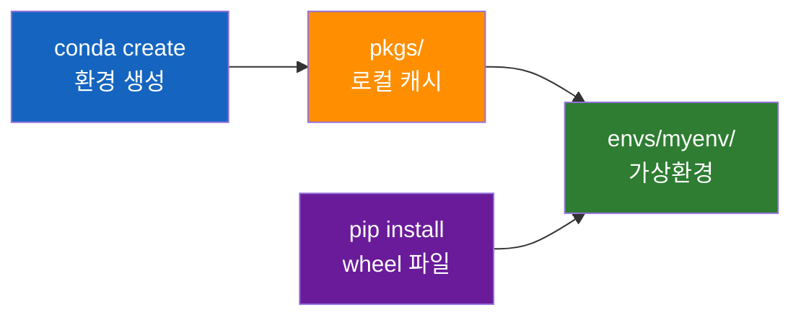
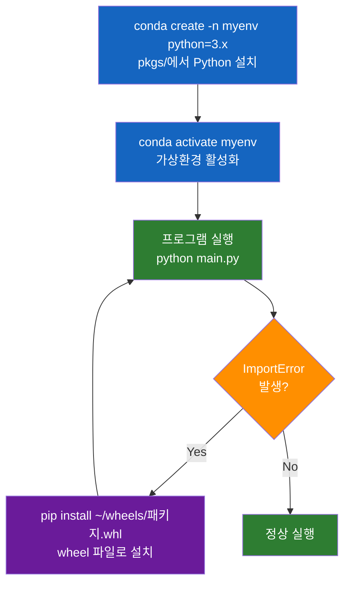

# 폐쇄망에서 Miniconda3로 Python 환경 구축하기

인터넷이 없는 폐쇄망 리눅스 서버에서 conda 가상환경을 만들고, wheel 파일로 패키지를 설치하는 방법을 정리한다.

## 결론부터 말하면

폐쇄망에서 Miniconda3는 **두 가지 경로** 로 패키지를 관리한다. conda 자체 패키지는 `pkgs/` 디렉토리를 오프라인 채널로 사용하고, pip 패키지는 `.whl` 파일을 직접 설치한다. `conda activate` 상태에서 `pip install`하면 해당 가상환경의 `site-packages/`에 설치되므로, 환경 간 격리가 보장된다.



## 1. 왜 폐쇄망에서 conda가 필요한가?

금융권 서버는 외부 인터넷에 접근할 수 없다. `pip install requests`를 치면 PyPI에 연결을 시도하고 당연히 실패한다. 그렇다면 Python 패키지를 어떻게 설치할까?

방법은 크게 두 가지다. 하나는 필요한 패키지를 미리 다운로드해서 서버에 옮기는 것이고, 다른 하나는 패키지 매니저 자체가 오프라인 모드를 지원하는 경우다. Miniconda3는 후자에 해당한다. `pkgs/` 디렉토리를 `file://` 프로토콜로 로컬 채널로 지정하면, 인터넷 없이도 conda 패키지를 설치할 수 있다.

하지만 conda 채널에 없는 패키지도 있다. 이때는 `.whl`(wheel) 파일을 직접 가져와서 pip으로 설치해야 한다.

## 2. pkgs 디렉토리는 뭘 하는 곳인가?

`pkgs/`는 conda 패키지의 **로컬 캐시(저장소)** 다. 온라인 환경이라면 패키지를 다운로드한 뒤 여기에 캐싱해두고, 다음에 같은 패키지가 필요하면 다시 다운로드하지 않고 캐시에서 가져온다.

폐쇄망에서는 이 캐시 디렉토리를 **오프라인 채널** 로 활용한다. 미리 필요한 conda 패키지를 `pkgs/`에 넣어두면, `conda create`나 `conda install` 시 이 디렉토리에서 패키지를 찾아 설치한다. 이때 `--offline` 플래그를 함께 사용하는 것이 중요하다. 플래그 없이 실행하면 conda가 기본 채널(defaults)에 접속해 인덱스를 업데이트하려고 시도하고, 폐쇄망이라 연결이 안 되니 타임아웃이 날 때까지 한참을 기다리게 된다.

```bash
# --offline 플래그로 네트워크 접속 시도 자체를 차단
conda create -n myenv python=3.x --offline
conda install numpy --offline
```

```
~/miniconda3/
├── pkgs/                ← conda 패키지 캐시 (오프라인 채널)
│   ├── python-3.11.tar.bz2
│   ├── numpy-1.24.0.tar.bz2
│   └── ...
├── envs/                ← 가상환경 모음
│   ├── project-a/
│   └── project-b/
└── bin/
```

재미있는 점은 conda가 `pkgs/`에서 가상환경으로 패키지를 설치할 때 **하드링크** 를 사용한다는 것이다. 파일을 복사하는 게 아니라 같은 파일을 가리키는 링크를 만들기 때문에, 여러 환경에서 동일한 패키지를 사용해도 디스크 공간을 절약할 수 있다. 단, 하드링크는 `pkgs/`와 `envs/`가 동일한 파티션에 있을 때만 작동하며, 서로 다른 파티션에 위치하면 conda가 자동으로 복사 방식으로 전환한다.

## 3. wheel 파일은 어디에 설치되는가?

가장 중요한 부분이다. `conda activate myenv` 상태에서 `pip install`을 하면, wheel 파일은 **활성화된 가상환경 안에** 설치된다.

```bash
# 1. 가상환경 활성화
conda activate myenv

# 2. wheel 파일 설치 (--no-index로 PyPI 접속 차단)
pip install --no-index ~/wheels/requests-2.31.0-py3-none-any.whl

# 3. 여러 wheel을 한번에 설치할 때
pip install --no-index --find-links ~/wheels/ requests pandas

# 4. 설치 경로 확인
pip show requests
# Location: ~/miniconda3/envs/myenv/lib/python3.11/site-packages
```

여기서 `--no-index` 플래그가 중요하다. 이 플래그 없이 설치하면 wheel에 누락된 의존성이 있을 때 pip이 PyPI에 접속을 시도하고, 폐쇄망에서는 타임아웃까지 기다리게 된다. `--no-index`를 붙이면 네트워크 접속 시도 자체를 차단하고 로컬에서만 패키지를 찾는다.

즉, `~/miniconda3/envs/myenv/lib/python3.x/site-packages/`가 설치 경로다. 다른 가상환경에는 영향을 주지 않으므로, 프로젝트별로 독립된 패키지 구성을 유지할 수 있다.

주의할 점은 **반드시 `conda activate`를 먼저 해야 한다** 는 것이다. 활성화하지 않으면 base 환경이나 시스템 Python에 설치될 수 있다.

참고로 wheel 파일을 준비할 때는 인터넷이 되는 환경에서 `pip download`를 사용하면 의존성 패키지까지 한번에 수집할 수 있다.

```bash
# 인터넷이 되는 PC에서 wheel 파일 일괄 다운로드
pip download -d ./wheels -r requirements.txt
```

## 4. 폐쇄망 작업 흐름 정리

실제 작업 흐름을 순서대로 정리하면 다음과 같다.



현재 환경 상태를 확인하는 명령어도 알아두면 유용하다.

| 명령어 | 용도 |
|--------|------|
| `conda info --envs` | 환경 목록 확인 (활성화된 환경에 `*` 표시) |
| `echo $CONDA_DEFAULT_ENV` | 현재 활성화된 환경 이름 |
| `which python` | Python 실행 파일 경로로 환경 확인 |
| `pip show 패키지명` | 패키지 설치 경로 확인 |
| `conda deactivate` | 가상환경 비활성화 |

## 5. conda 패키지 vs pip wheel 비교

| 항목 | conda (`pkgs/`) | pip (`wheels/`) |
|------|-----------------|-----------------|
| 패키지 포맷 | `.tar.bz2` / `.conda` | `.whl` |
| 관리 주체 | conda solver | pip resolver |
| 설치 방식 | 하드링크 (디스크 절약) | 복사 (site-packages에 직접) |
| 비-Python 패키지 | 지원 (CUDA, MKL 등) | 미지원 |
| 의존성 해결 | conda가 통합 관리 | pip이 독립적으로 관리 |

## 6. 심화: conda-pack으로 환경 통째로 옮기기

지금까지 설명한 방식은 폐쇄망 서버에서 직접 환경을 구축하는 'Build-on-site' 방식이다. 하지만 의존성이 수십 개가 넘는 프로젝트라면 wheel 파일을 일일이 준비하는 것이 번거로울 수 있다. 이때 `conda-pack`을 사용하면 인터넷이 되는 환경에서 구축한 가상환경을 통째로 압축해서 옮길 수 있다.

```bash
# 인터넷이 되는 PC에서
conda activate myenv
conda install conda-pack
conda-pack -n myenv -o myenv.tar.gz

# 폐쇄망 서버에서 (conda 설치 불필요)
mkdir -p ~/envs/myenv
tar -xzf myenv.tar.gz -C ~/envs/myenv
source ~/envs/myenv/bin/activate
conda-unpack    # 환경 내부의 hardcoded 절대 경로를 현재 위치로 재작성
```

여기서 마지막 `conda-unpack` 단계를 절대 빠뜨리면 안 된다. `conda-pack`은 패키징 시점의 절대 경로(예: `/home/builder/miniconda3/envs/myenv/...`)를 환경 내부 스크립트, conda metadata, 일부 shebang에 그대로 박아 넣는다. `conda-unpack`은 이 경로들을 새 위치로 일괄 치환해 환경을 정상화한다. 생략하면 `python` 실행은 멀쩡해 보여도 activate 후크나 `pkg-config`, conda 명령처럼 hardcoded path를 읽는 도구에서 조용한 실패가 발생한다.

또한 conda가 설치되지 않은 대상 서버에서도 압축 해제만으로 즉시 실행 가능한 환경을 만들 수 있어, 복잡한 의존성을 가진 프로젝트에서 유용하다. 단, **패키징하는 PC와 대상 서버의 OS 및 아키텍처가 동일해야 한다** 는 점에 주의해야 한다. 예를 들어 Mac에서 `conda-pack`으로 만든 아카이브는 Linux 서버에서 동작하지 않는다. 개발 PC가 Windows/Mac이고 배포 서버가 Linux라면, 동일한 Linux 환경(예: Docker 컨테이너)에서 패키징해야 한다.

## 정리

폐쇄망에서 Miniconda3를 사용할 때 기억할 핵심은 세 가지다. `pkgs/`는 conda의 로컬 캐시이자 오프라인 채널이다. `conda activate` 후 `pip install`하면 해당 가상환경의 `site-packages/`에 설치된다. 그리고 의존성이 있는 wheel 파일은 함께 준비해서 `pip install ~/wheels/*.whl`로 한번에 설치하면 pip이 순서를 자동 처리한다.

---

## 출처

- [Conda 공식 문서 - Managing environments](https://docs.conda.io/projects/conda/en/latest/user-guide/tasks/manage-environments.html)
- [Conda 공식 문서 - Using conda offline](https://docs.conda.io/projects/conda/en/latest/user-guide/tasks/manage-pkgs.html#installing-packages-on-a-non-networked-air-gapped-computer)
- [pip 공식 문서 - Installing from local packages](https://pip.pypa.io/en/stable/user_guide/#installing-from-local-packages)
