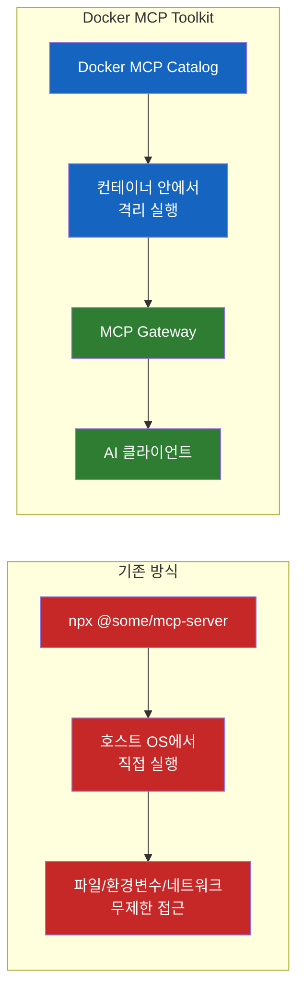
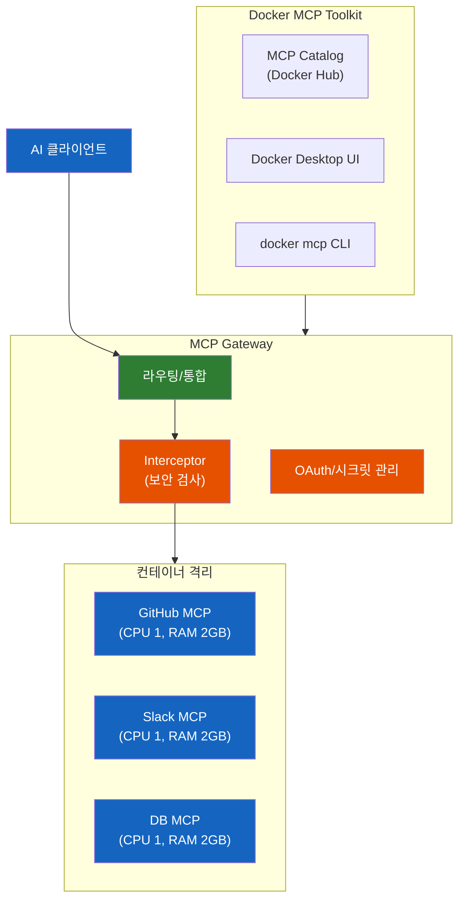

# Docker MCP Toolkit

npx로 MCP 서버를 실행하면 왜 위험한지, Docker MCP Toolkit이 이를 어떻게 해결하는지 알아본다.

## 결론부터 말하면

**`npx`나 `uvx`로 MCP 서버를 실행하는 건 `curl | bash`와 다를 바 없다.** 검증되지 않은 코드가 당신의 파일 시스템, 환경 변수, 네트워크에 무제한 접근 권한을 갖게 된다. Docker MCP Toolkit은 이 문제를 **컨테이너 격리 + MCP Gateway + Interceptor** 의 조합으로 해결한다.



## 1. 기존 MCP 서버 실행 방식, 무엇이 문제인가?

### 1.1 MCP란?

MCP(Model Context Protocol)는 AI 에이전트(Claude, Cursor 등)가 외부 도구를 호출할 때 사용하는 표준 프로토콜이다. GitHub에서 코드를 검색하거나, Slack 메시지를 보내거나, 데이터베이스를 조회하는 등의 작업을 AI가 수행할 수 있게 해준다.

이때 **MCP 서버** 가 중간에서 AI 클라이언트의 요청을 받아 실제 도구를 실행하는 역할을 한다.

### 1.2 지금까지 우리가 MCP 서버를 실행하던 방법

Claude Desktop이나 Cursor에서 MCP 서버를 설정할 때, 대부분 이렇게 한다:

```json
{
  "mcpServers": {
    "github": {
      "command": "npx",
      "args": ["-y", "@modelcontextprotocol/server-github"],
      "env": {
        "GITHUB_TOKEN": "ghp_xxxxxxxxxxxx"
      }
    }
  }
}
```

`npx -y`는 패키지를 **매번 최신 버전으로 다운로드** 해서 바로 실행한다. 편리하다. 하지만 여기서 문제가 생긴다.

### 1.3 이게 왜 위험할까?

이 실행 방식은 사실상 `curl | bash`와 같다. 검증 없이 인터넷에서 코드를 받아서 내 머신에서 그대로 실행하는 것이다.

`npx`로 실행된 MCP 서버는 **당신의 사용자 권한을 그대로 상속** 한다. 즉, 이 코드는:

| 할 수 있는 일 | 구체적 위험 |
|--------------|-----------|
| 파일 시스템 전체 접근 | `~/.ssh/id_rsa`, `~/.aws/credentials` 등 민감 파일 읽기 |
| 환경 변수 탈취 | `GITHUB_TOKEN`, `AWS_SECRET_KEY` 등 시크릿 유출 |
| 네트워크 요청 | 탈취한 정보를 외부 서버로 전송 |
| 프로세스 실행 | 임의의 시스템 명령어 실행 |

실제 보안 분석에서도 MCP 서버의 66%가 코드 품질 문제(code smells)를 보였고, 평문 시크릿이 프로세스 목록과 로그에 노출되는 사례가 수천 건의 설치에서 발견되었다.

### 1.4 실제로 발견된 공격 패턴들

이론적인 위험이 아니다. 실제로 여러 공격 벡터가 보고되었다.

**Tool Poisoning:** 공격자가 MCP 서버의 도구 설명(metadata)을 조작한다. 예를 들어, "cleanup"이라는 도구의 예시 파라미터에 `rm -rf /tmp/`를 숨겨놓으면, AI 에이전트가 이를 신뢰하고 실행한다. Invariant Labs의 연구에서는 악성 MCP 서버가 정상적인 WhatsApp MCP 서버와 같은 에이전트에서 실행될 때, 사용자의 **전체 WhatsApp 대화 기록** 을 탈취하는 데모를 공개하기도 했다.

**Tool Rug Pull:** 처음에는 정상적인 MCP 서버를 배포한 뒤, 신뢰를 얻고 나서 악성 코드가 포함된 업데이트를 밀어넣는다. `npx -y`는 매번 최신 버전을 자동으로 받으니, 사용자는 아무것도 모른 채 악성 버전을 실행하게 된다.

**Prompt Injection을 통한 데이터 탈취:** 2025년 5월 Invariant Labs가 발견한 GitHub MCP 취약점이 대표적이다. 공격자가 공개 저장소의 이슈에 악성 프롬프트를 심어놓으면, AI가 이슈를 조회하다가 해당 프롬프트를 명령으로 해석한다. 그 결과 사용자의 **비공개 저장소** 코드를 읽어서 공개 PR로 만들어버렸다. 근본 원인은 과도한 권한(broad PAT scope)과 신뢰할 수 없는 콘텐츠가 LLM 컨텍스트에 함께 들어간 것이었다.

## 2. Docker MCP Toolkit은 이걸 어떻게 해결하는가?

Docker MCP Toolkit은 크게 세 가지 구성 요소로 이루어져 있다.



| 구성 요소 | 역할 |
|----------|------|
| **MCP Catalog** | Docker Hub에서 200+ MCP 서버를 검색/설치 |
| **MCP Gateway** | 단일 진입점. 라우팅, 보안 검사, 인증을 처리 |
| **컨테이너 런타임** | 각 MCP 서버를 격리된 컨테이너에서 실행 |

### 2.1 컨테이너 격리: 호스트 접근 차단

Docker MCP Toolkit의 발상은 단순하다. **MCP 서버를 컨테이너 안에서 실행하면, 호스트에 대한 접근을 원천 차단할 수 있다.**

Docker 컨테이너는 이미 프로덕션 환경에서 수년간 검증된 격리 기술이다. 파일 시스템, 네트워크, 프로세스가 모두 격리된다. 각 MCP 서버 컨테이너는 Toolkit이 적용하는 **기본 제한값**을 가지며, 사용자가 필요에 따라 조정할 수 있다:

| 리소스 | 기본 제한 |
|--------|----------|
| CPU | 1코어 |
| 메모리 | 2GB |
| 파일 시스템 | 호스트 접근 **불가** (사용자가 명시적으로 마운트한 경로만 허용) |
| 네트워크 | 호스트 네트워크 분리 + MCP Gateway를 통한 단일 진입점 (Interceptor로 추가 정책 적용 가능) |

호스트의 `~/.ssh`나 `~/.aws`에 접근할 수 없고, 허용된 네트워크 요청만 가능하다. 또한 Docker가 빌드한 MCP 서버 이미지(`mcp/*`)는 **디지털 서명 + SBOM(Software Bill of Materials)** 이 포함되어 공급망 검증이 가능하다.

### 2.2 MCP Gateway: 단일 진입점

기존 방식에서는 AI 클라이언트가 각 MCP 서버에 **개별적으로** 연결해야 했다. 서버가 10개면 설정도 10개, 관리도 10배 복잡해진다.

Docker MCP Toolkit은 **MCP Gateway** 라는 단일 진입점을 제공한다. 클라이언트는 Gateway 하나만 연결하면 되고, Gateway가 뒤에 있는 모든 MCP 서버를 중계한다.

```json
{
  "mcpServers": {
    "docker": {
      "command": "docker",
      "args": ["mcp", "gateway", "run"]
    }
  }
}
```

기존에 서버마다 따로 설정하던 것이 이 한 줄로 끝난다. 새로운 MCP 서버를 추가하더라도 이 설정은 바뀌지 않는다. Docker Desktop에서 원하는 서버를 활성화하기만 하면 Gateway가 자동으로 노출한다.

### 2.3 시크릿 관리: 평문 환경변수에서 벗어나기

기존 방식에서는 API 키를 JSON 설정 파일에 **평문** 으로 적어야 했다. `GITHUB_TOKEN`, `SLACK_BOT_TOKEN` 같은 시크릿이 환경 변수에 그대로 노출되어 있었다.

Docker MCP Toolkit은 두 가지 방식으로 이를 대체한다:

**OAuth 통합:** GitHub, Notion, Linear 같은 서비스는 OAuth 플로우로 인증한다. 브라우저에서 인증하면 Toolkit이 토큰을 안전하게 관리한다. PAT(Personal Access Token)를 직접 생성해서 환경 변수에 넣을 필요가 없다.

```bash
# OAuth 인증
docker mcp oauth authorize github-official

# 인증 상태 확인
docker mcp oauth ls

# 즉시 폐기
docker mcp oauth revoke github-official
```

**시크릿 저장소:** OAuth를 지원하지 않는 서비스의 API 키는 Docker Desktop의 **플랫폼 네이티브 암호화 저장소** 에 보관된다. 환경 변수나 설정 파일에 평문으로 노출되지 않는다.

### 2.4 보안 검사: Interceptor

컨테이너 격리는 호스트 시스템에 대한 **물리적 접근** 을 차단한다. 하지만 그것만으로 충분할까? 컨테이너 내부에서 AI가 프롬프트 인젝션에 의해 **허용된 범위 안에서** 의도치 않은 도구를 실행하는 논리적 위협은 여전히 존재한다. 예를 들어, GitHub MCP 서버가 컨테이너 안에서 격리되어 있어도, AI가 악성 프롬프트에 속아 비공개 저장소를 삭제하는 API를 호출할 수 있다.

MCP Gateway의 **Interceptor** 는 이 문제를 해결하기 위해 MCP 프로토콜 수준에서 요청과 응답을 실시간으로 검사한다.

| 시점 | 역할 | 예시 |
|------|------|------|
| Before (요청 전) | 요청 검증/차단 | "GitHub 호출 시 하나의 repo만 허용" |
| After (응답 후) | 응답 검사/필터링 | "응답에 시크릿이 포함되어 있으면 차단" |

기본적으로 시크릿이 포함된 요청/응답은 자동으로 차단된다. 여기에 더해 커스텀 스크립트를 작성하면 **Human-in-the-loop** 패턴도 구현할 수 있다. 파일 삭제, 데이터 변경 같은 위험한 작업은 Interceptor가 가로채서 사용자의 최종 확인을 요청하도록 구성하는 것이다. 컨테이너가 **시스템 접근** 을 격리하고, Interceptor가 **논리적 위협** 을 방어하는 이중 방어 구조다.

## 3. 기존 방식 vs Docker MCP Toolkit 비교

| 항목 | 기존 방식 (npx/uvx) | Docker MCP Toolkit |
|------|--------------------|--------------------|
| **실행 모델** | 호스트 OS에서 직접 실행 | 컨테이너 격리 실행 |
| **시크릿 관리** | 환경 변수에 평문 | 플랫폼 네이티브 암호화 저장소 + OAuth |
| **네트워크** | 호스트 네트워크 무제한 | L7 프록시 + allowlist |
| **리소스 제한** | 없음 | CPU 1개, 메모리 2GB |
| **공급망 검증** | npm 패키지 (탈취 가능) | 디지털 서명 + SBOM |
| **설정 방식** | 서버마다 개별 JSON 설정 | Gateway 하나로 통합 |
| **보안 검사** | 없음 | Interceptor로 요청/응답 실시간 검사 |
| **모니터링** | 가시성 없음 | `--log-calls`로 전체 호출 로깅 |

## 4. 정리

MCP는 AI 에이전트의 능력을 확장하는 강력한 프로토콜이다. 하지만 지금까지의 실행 방식(`npx`, `uvx`)은 **편의성을 위해 보안을 포기한** 구조였다. 검증되지 않은 코드를 호스트 권한으로 실행하는 건, 아무리 좋게 봐도 프로덕션에서 쓸 수 있는 방식이 아니다.

Docker MCP Toolkit은 이미 검증된 컨테이너 격리 기술을 MCP에 적용했다. 새로운 개념이 아니라, Docker가 수년간 해온 것을 MCP 생태계에 가져온 것이다. MCP 서버를 하나라도 사용하고 있다면, 컨테이너 기반 실행으로 전환하는 것을 권장한다.

---

## 출처

- [Docker MCP Catalog and Toolkit 공식 발표](https://www.docker.com/blog/introducing-docker-mcp-catalog-and-toolkit/) - Docker 공식 블로그
- [Docker MCP Toolkit: MCP Servers That Just Work](https://www.docker.com/blog/mcp-toolkit-mcp-servers-that-just-work/) - Docker 공식 블로그
- [Docker MCP Toolkit 공식 문서](https://docs.docker.com/ai/mcp-catalog-and-toolkit/toolkit/) - Docker Docs
- [MCP Security Issues Threatening AI Infrastructure](https://www.docker.com/blog/mcp-security-issues-threatening-ai-infrastructure/) - Docker 공식 블로그
- [AI Guide to the Galaxy: MCP Toolkit and Gateway, Explained](https://www.docker.com/blog/mcp-toolkit-gateway-explained/) - Docker 공식 블로그
- [MCP Horror Stories: The GitHub Prompt Injection Data Heist](https://www.docker.com/blog/mcp-horror-stories-github-prompt-injection/) - Docker 공식 블로그
- [MCP Server: The Dangers of "Plug-and-Play" Code](https://acuvity.ai/mcp-server-the-dangers-of-plug-and-play-code/) - Acuvity
- [MCP security: The current situation](https://www.redhat.com/en/blog/mcp-security-current-situation) - Red Hat
