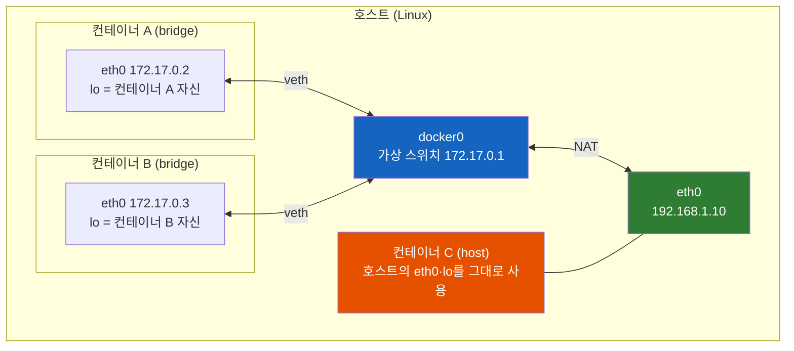
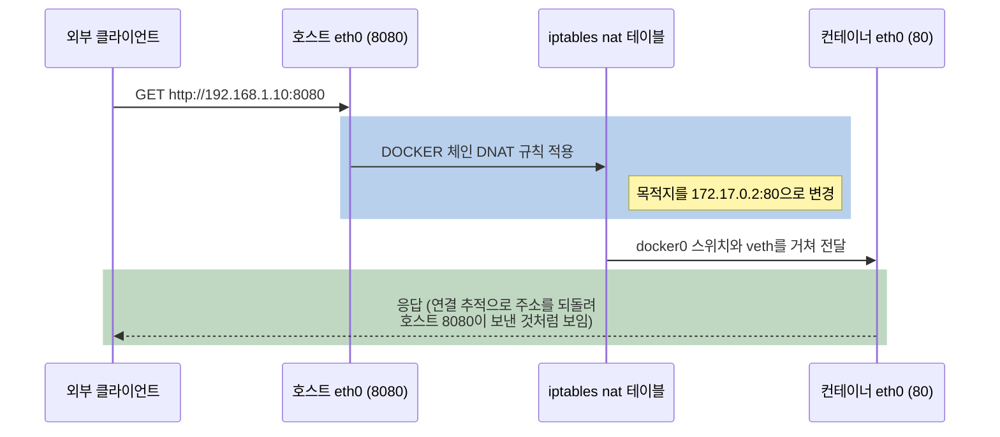
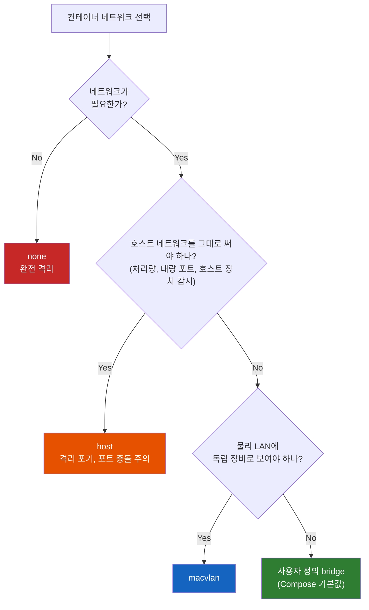

# Docker Network — 컨테이너 안의 localhost는 왜 내 컴퓨터가 아닐까, bridge와 host

내 PC에서는 잘 붙던 `localhost:5432`가 컨테이너 안에서는 왜 `Connection refused`일까? 그리고 `--network host` 한 줄을 붙이면 왜 갑자기 될까?

## 결론부터 말하면

**컨테이너 안의 `localhost`는 내 컴퓨터가 아니라 컨테이너 자기 자신이다.** Docker가 컨테이너마다 독립된 네트워크 공간(network namespace)을 만들어 주기 때문이다. 기본값인 **bridge 네트워크** 는 이 공간을 가상 랜선으로 호스트의 가상 스위치에 연결하고, 바깥과는 공유기처럼 주소를 바꿔(NAT) 통신하게 한다. 반면 **host 네트워크** 는 공간을 따로 만들지 않고 호스트의 네트워크를 그대로 쓴다. 그래서 host 네트워크에서는 `localhost`가 진짜 내 컴퓨터다.

| 구분 | bridge (기본값) | host |
|------|----------------|------|
| 네트워크 공간 | 컨테이너마다 독립 | 호스트와 공유 |
| 컨테이너 IP | 별도 사설 IP (보통 `172.17.x.x`) | 없음 (호스트 IP를 그대로 사용) |
| 컨테이너 안의 `localhost` | 컨테이너 자신 | 호스트 |
| 외부 공개 | `-p 8080:80`으로 포트를 열어야 함 | 컨테이너가 연 포트가 곧 호스트 포트 (`-p`는 무시됨) |
| 포트 충돌 | 컨테이너마다 같은 포트를 써도 됨 | 호스트·다른 컨테이너와 충돌 |
| 격리 | 있음 | 없음 |
| 성능 | NAT를 거침 | NAT 없음 |
| Docker Desktop(macOS) | 동작하지만 Mac에서 컨테이너 IP로는 못 감 (`-p` 포트로만 접속) | 설정을 켜야 Mac과 포트로 연결 (4.34+, TCP/UDP만) |



## 1. 왜 컨테이너에서 localhost로 내 DB에 못 붙을까?

내 PC에 PostgreSQL을 설치해 5432 포트로 띄워 두었다고 하자. IDE에서 Spring Boot 앱을 실행하면 `jdbc:postgresql://localhost:5432/mydb`로 잘 붙는다. 그런데 같은 앱을 이미지로 만들어 `docker run`으로 띄우면 `Connection refused`가 난다. 코드도 같고, 컴퓨터도 같고, DB도 그대로 떠 있다. 도대체 뭐가 달라진 걸까?

### 1.1 network namespace: 컨테이너마다 따로 받는 네트워크 세트

답을 찾으려면 리눅스 커널의 **network namespace** 부터 알아야 한다. network namespace는 네트워크 장치, IP 주소, 라우팅 테이블, 포트 번호를 프로세스 묶음마다 따로 갖게 해 주는 칸막이다. 리눅스 매뉴얼은 이를 "network devices, IPv4 and IPv6 protocol stacks, … port numbers (sockets)"를 격리하는 기능이라고 설명한다. 칸막이 하나마다 자기만의 `lo`(loopback, 즉 `127.0.0.1`) 인터페이스도 따로 생긴다.

여기서 자연스러운 기대가 하나 생긴다. 컨테이너는 VM이 아니라 호스트 커널을 공유하는 평범한 프로세스다. 그러니 네트워크도 호스트와 같이 쓰고, `localhost`도 당연히 내 PC를 가리킬 것 같다.

하지만 Docker는 컨테이너를 만들 때마다 **새 network namespace를 하나씩 만들어 그 안에 컨테이너를 넣는다.** 컨테이너가 받은 `lo`는 컨테이너 전용이다. 그래서 앱이 `localhost:5432`로 보낸 패킷은 컨테이너 칸막이 밖으로 한 발짝도 나가지 않는다. 그 칸막이 안에서 5432를 듣는 프로세스는 없으니 `Connection refused`가 나는 것이다. Docker 문서도 `--dns=127.0.0.1` 옵션을 설명하면서 이 주소가 "the container's own loopback address"를 가리킨다고 못 박는다.

직접 확인하면 바로 보인다:

```bash
# 호스트의 네트워크 인터페이스: eth0, docker0, veth... 등 여러 개
ip addr

# 컨테이너 안의 네트워크 인터페이스: 살아 있는(UP) 것은 lo와 eth0뿐이고, IP도 다르다
# (커널에 터널 모듈이 올라가 있으면 tunl0, gre0 같은 장치가 DOWN 상태로 함께 보인다. Docker Desktop이 그렇다)
docker run --rm alpine ip addr
```

그렇다면 해법은 두 갈래다. 첫째, 컨테이너는 자기 칸막이에 그대로 두고 **호스트로 가는 다른 주소** 를 쓰는 것이다(5.2절의 `host.docker.internal`). 둘째, **칸막이를 아예 만들지 않고** 호스트의 네트워크를 함께 쓰는 것이다(4절의 host 네트워크). 어느 쪽이 맞는지 고르려면, 먼저 기본값인 bridge가 어떻게 생겼는지 알아야 한다.

## 2. bridge 네트워크: 컨테이너마다 집을 짓고, 가상 스위치로 잇는다

### 2.1 가상 랜선(veth)과 가상 스위치(docker0)

새로 만든 network namespace는 처음에는 바깥과 아무 연결도 없는 외딴 방이다. Docker는 이 방에 두 가지 부품으로 길을 낸다.

첫째는 **veth pair** 다. veth는 양 끝이 이어진 가상 랜선으로, 리눅스 매뉴얼의 표현대로 "always created in interconnected pairs", 즉 항상 두 끝이 한 쌍으로 만들어진다. 한쪽 끝으로 들어간 패킷은 반대쪽 끝으로 나온다. Docker는 한쪽 끝을 컨테이너의 namespace에 넣고 `eth0`이라는 이름을 붙이고, 다른 끝은 호스트에 `vethXXXX` 같은 이름으로 남긴다.

둘째는 **docker0** 이다. docker0은 Docker가 호스트에 만든 리눅스 bridge, 즉 소프트웨어로 만든 스위치다. 호스트 쪽에 남은 veth 끝을 이 스위치에 꽂으면, 같은 스위치에 꽂힌 컨테이너끼리 이더넷으로 대화할 수 있게 된다.

주소는 이렇게 정해진다. 기본 bridge 네트워크는 보통 `172.17.0.0/16` 대역을 쓰고, docker0이 그 첫 주소인 `172.17.0.1`을 게이트웨이로 갖는다. 다만 호스트에서 이미 그 대역을 쓰고 있으면 Docker가 다른 대역을 고르므로, 실제 값은 직접 확인하는 편이 정확하다.

```bash
# bridge 네트워크의 대역(Subnet)과 게이트웨이(Gateway), 붙어 있는 컨테이너 확인
docker network inspect bridge

# 호스트에서 본 docker0 인터페이스
ip addr show docker0
```

### 2.2 나갈 때와 들어올 때: NAT

이제 컨테이너끼리는 대화할 수 있다. 그런데 `172.17.0.2`는 이 호스트 안에서만 통하는 사설 주소다. 이 주소로 인터넷에 나가면 응답이 돌아올 길이 없다. 그래서 Docker는 집에 있는 공유기와 똑같은 일을 iptables 규칙으로 한다. iptables는 리눅스 커널을 지나는 패킷을 걸러내거나 주소를 바꾸는 규칙을 등록하는 도구다.

**나갈 때** 는 출발지 주소를 호스트 주소로 바꾼다. 이를 MASQUERADE(출발지 NAT)라고 하고, Docker는 대략 `-A POSTROUTING -s 172.17.0.0/16 ! -o docker0 -j MASQUERADE` 같은 규칙을 만든다. "172.17 대역에서 출발해 docker0이 아닌 곳으로 나가는 패킷은 호스트 주소로 바꿔라"라는 뜻이다. 컨테이너에서 `curl`로 인터넷에 접속하는 데 아무 설정이 필요 없는 이유다.

**들어올 때** 는 반대로 목적지 주소를 바꿔야 한다. 바깥에서는 `172.17.0.2`라는 주소를 모르기 때문이다. `docker run -p 8080:80`이 바로 이 일을 한다. 호스트의 8080 포트로 들어온 패킷의 목적지를 컨테이너의 80 포트로 바꾸는 DNAT(목적지 NAT) 규칙을 iptables `nat` 테이블의 `DOCKER` 체인에 추가하는 것이다. 공유기에서 설정하는 포트 포워딩과 같은 원리다.



한 가지 예외가 있다. 호스트 자신이 `localhost:8080`으로 접속하는 경우는 loopback 트래픽이라 위 규칙을 타지 않는다. 이때는 Docker가 포트마다 띄워 두는 작은 중계 프로세스인 `docker-proxy`(userland proxy)가 연결을 받아 컨테이너로 넘긴다. dockerd 설정의 설명도 "Use userland proxy for loopback traffic (default true)"다.

### 2.3 이름의 함정: Docker의 bridge는 VirtualBox의 Bridge가 아니다

VirtualBox를 써 봤다면 여기서 헷갈릴 수 있다. VirtualBox의 **Bridge** 모드는 VM을 물리 LAN에 직접 붙여, VM이 자기 MAC 주소로 공유기에서 IP를 받고 같은 사무실 PC에서 바로 접속되게 하는 방식이었다([VM Network Mode — 왜 가상머신에는 네트워크 모드가 4개나 있을까](../computer-science/VM-Network-Mode-왜-가상머신에는-네트워크-모드가-4개나-있을까.md) 참고).

Docker의 bridge는 이름만 같을 뿐 정반대에 가깝다. 사설 대역 안에서 컨테이너끼리 대화하고, 나갈 때는 NAT, 들어올 때는 포트 포워딩이 필요하다. 이건 VirtualBox의 **NAT Network** 모드와 거의 같은 구조다. Docker에서 VirtualBox Bridge처럼 물리 LAN에 직접 붙는 쪽은 `macvlan` 드라이버로, 공식 문서는 이를 "assign a MAC address to a container, making it appear as a physical device on your network"라고 설명한다.

| VirtualBox | Docker | 공통 구조 |
|------------|--------|-----------|
| NAT Network | bridge | 사설망 안에서 서로 통신, 나갈 때 NAT, 들어올 때 포트 포워딩 |
| Bridge | macvlan | 자기 MAC 주소로 물리 LAN에 직접 참여 |
| (해당 없음) | host | 호스트의 네트워크를 그대로 공유 |

마지막 줄이 흥미롭다. VM에는 host 같은 모드가 없다. VM은 자기 커널을 따로 갖고 있어서 호스트 커널의 네트워크 공간에 그냥 들어갈 방법이 없기 때문이다. 컨테이너는 호스트 커널을 공유하는 프로세스라서, namespace만 새로 만들지 않으면 곧바로 호스트의 네트워크를 쓰게 된다. host 네트워크는 컨테이너라서 가능한 모드다.

## 3. 기본 bridge와 사용자 정의 bridge: 이름으로 찾을 수 있는가

### 3.1 기본 bridge에서는 이름이 통하지 않는다

컨테이너 두 개를 띄우고 한쪽에서 다른 쪽을 이름으로 불러 보자.

```bash
docker run -d --name db -e POSTGRES_PASSWORD=secret postgres:17
docker run --rm alpine ping -c 1 db
# ping: bad address 'db'
```

`-p`도 안 붙였고, 둘 다 같은 docker0 스위치에 붙어 있는데 이름을 못 찾는다. 이유는 `--network`를 지정하지 않으면 컨테이너가 붙는 **기본 `bridge` 네트워크** 에 이름 해석 기능이 없기 때문이다. 공식 문서에 따르면 기본 bridge의 컨테이너끼리는 "can only access each other by IP addresses, unless you use the `--link` option, which is considered legacy", 즉 IP 주소나 레거시 옵션인 `--link`로만 서로를 찾을 수 있다. 문서는 기본 bridge 자체를 "a legacy detail of Docker and is not recommended for production use"라고 부른다.

### 3.2 사용자 정의 bridge는 내장 DNS를 준다

해법은 네트워크를 직접 만드는 것이다.

```bash
docker network create app-net

docker run -d --name db --network app-net -e POSTGRES_PASSWORD=secret postgres:17
docker run --rm --network app-net alpine ping -c 1 db
# 64 bytes from 172.19.0.2 ... 이름으로 찾아진다 (대역은 환경마다 다르다)
```

`docker network create`로 만든 **사용자 정의 bridge** 에 붙은 컨테이너는 Docker의 내장 DNS 서버(`127.0.0.11`)를 쓴다. 내장 DNS는 같은 네트워크에 있는 컨테이너 이름을 IP로 바꿔 준다. 반면 기본 bridge의 컨테이너는 호스트의 `/etc/resolv.conf` 복사본을 받기 때문에 다른 컨테이너 이름을 알 길이 없다. `inspiring_franklin` 같은 자동 생성 이름과 짧은 컨테이너 ID도 등록되긴 하지만, 컨테이너를 새로 만들 때마다 바뀌므로 접속할 이름은 `--name`이나 네트워크 alias로 정해 두는 편이 낫다. (공식 bridge 문서에는 자동 생성 이름은 해석되지 않는다는 문구가 남아 있지만, Engine 29.8에서 직접 확인하면 해석된다.)

| 항목 | 기본 bridge | 사용자 정의 bridge |
|------|-------------|---------------------|
| 이름으로 찾기 | 불가 (IP 또는 레거시 `--link`) | 가능 (내장 DNS `127.0.0.11`) |
| 격리 | `--network` 없이 뜬 모든 컨테이너가 한 망에 모임 | 같은 네트워크에 붙인 컨테이너끼리만 |
| 실행 중 연결·해제 | 컨테이너를 멈추고 다시 만들어야 함 | `docker network connect/disconnect`로 즉시 |
| 권장 여부 | 레거시, 프로덕션 비권장 | 권장 |

사용자 정의 네트워크끼리는 기본적으로 서로 막혀 있다. 다른 네트워크에 있는 컨테이너는 이름은 물론 IP로도 닿지 않는다. 두 네트워크의 컨테이너와 모두 대화해야 하는 컨테이너는 `docker network connect`로 두 네트워크에 동시에 붙이면 된다.

### 3.3 docker compose가 그냥 되는 이유

docker compose로 서비스를 띄우면 따로 설정하지 않아도 `app`에서 `db`라는 이름으로 접속이 된다. Compose가 프로젝트마다 `<프로젝트이름>_default`라는 사용자 정의 bridge를 자동으로 만들고, 각 서비스를 서비스 이름으로 내장 DNS에 등록하기 때문이다. 앞의 `bad address` 문제를 Compose가 뒤에서 대신 풀어 주고 있었던 셈이다([Dockerfile과 docker-compose의 차이](./Dockerfile과-docker-compose의-차이.md) 참고).

## 4. host 네트워크: 칸막이를 아예 만들지 않는다

### 4.1 동작과 대가

```bash
docker run -d --network host nginx
curl http://localhost:80   # Linux 호스트의 80 포트에서 nginx가 바로 응답한다
```

`--network host`를 주면 Docker는 새 namespace를 만들지 않는다. 공식 문서의 표현대로 "the container shares the host's networking namespace, and the container doesn't get its own IP-address allocated", 즉 컨테이너가 호스트의 네트워크 공간을 그대로 쓰고 자기 IP도 받지 않는다. 그래서 컨테이너 안의 `localhost`가 곧 호스트이고, 1절의 DB 문제도 `localhost:5432` 그대로 해결된다.

포트 매핑도 의미가 없어진다. 컨테이너가 80을 열면 그게 곧 호스트의 80이다. 그래서 `-p`를 함께 주면 Docker는 `WARNING: Published ports are discarded when using host network mode` 경고와 함께 무시한다. 대신 성능상 이점이 있다. 문서에 따르면 host 모드는 "doesn't require network address translation (NAT), and no "userland-proxy" is created for each port", 즉 NAT도, 포트마다의 `docker-proxy`도 거치지 않는다. 포트를 대량으로 쓰거나 처리량이 중요한 경우, 또는 Prometheus node_exporter처럼 호스트의 네트워크 장치를 직접 들여다봐야 하는 에이전트에 host 모드가 쓰인다.

물론 대가가 있다.

- **격리가 없다.** 컨테이너가 호스트의 모든 네트워크 인터페이스를 보고, 아무 호스트 포트나 열 수 있다.
- **포트가 충돌한다.** host 모드 nginx 두 개는 둘 다 호스트의 80을 원하므로 두 번째가 뜨지 못한다. bridge에서는 각자 자기 namespace의 80을 쓰므로 문제가 없었다.
- **Compose의 서비스 이름 DNS가 동작하지 않는다.** `network_mode: host`인 서비스는 내장 DNS 대신 호스트 네트워크를 쓰므로, 서비스 이름으로 다른 서비스를 찾을 수 없다.

### 4.2 Docker Desktop(macOS)에서는 이야기가 다르다

여기까지는 Linux 호스트 이야기다. macOS의 Docker Desktop은 Docker Engine을 Mac에서 직접 돌리지 않고 "a lightweight Linux virtual machine", 즉 가벼운 Linux VM 안에서 돌린다. 그래서 Mac에서 보면 한 겹이 더 있다.

- Mac에는 docker0이 없다. 컨테이너 IP(`172.17.x.x`)는 VM 안에만 있어서 Mac에서 ping도, 직접 접속도 안 된다. Mac에서 컨테이너에 닿는 길은 `-p`로 공개한 포트뿐이고, Docker Desktop의 `com.docker.backend` 프로세스가 Mac에서 그 포트를 받아 VM 안으로 넘겨 준다.
- `--network host`는 원래 Mac이 아니라 **VM의 네트워크** 를 공유한다는 뜻이었다. 그래서 컨테이너의 `localhost`는 Mac이 아니라 VM이었다.

이 차이를 메우려고 Docker Desktop은 host networking 기능을 추가했다. 4.29에서 베타로 들어와 4.34(2024-08)에 정식 기능이 되었고, 4.35부터는 Docker 계정 로그인도 필요 없다(공식 문서 페이지에는 아직 로그인 단계가 남아 있다). `Settings > Resources > Network > Enable host networking`으로 켜면, host 모드 컨테이너가 Mac의 `localhost` 서비스에 접속하고 Mac에서도 컨테이너가 연 포트에 접속할 수 있다. 다만 제약이 있다.

- 4계층(TCP/UDP)에서만 동작한다.
- Linux 컨테이너만 지원한다.
- 컨테이너가 호스트의 특정 IP에 bind할 수 없다.
- Enhanced Container Isolation과 함께 쓸 수 없다.

## 5. 통신 경로 5가지: 실제로 어떻게 연결하나

지금까지의 내용을 "누가 누구에게 접속하는가"로 정리하면 다섯 가지 경로가 나온다.

| 경로 | 방법 | 예시 | 주의 |
|------|------|------|------|
| 1. 컨테이너 ↔ 컨테이너 | 같은 사용자 정의 네트워크 + 이름 | `postgres://db:5432` | `-p` 필요 없음. 컨테이너 포트로 바로 접속 |
| 2. 컨테이너 → 호스트 | `host.docker.internal` | `jdbc:postgresql://host.docker.internal:5432/mydb` | Linux Engine은 `host-gateway` 설정 필요 |
| 3. 호스트 → 컨테이너 | `-p 127.0.0.1:8080:80` 후 `localhost:8080` | `curl localhost:8080` | Linux 호스트는 컨테이너 IP로도 직접 가능, Docker Desktop은 불가 |
| 4. 외부 → 컨테이너 | `-p 8080:80` | `http://<호스트 IP>:8080` | 기본으로 모든 주소에 열리고 ufw 규칙을 우회함 |
| 5. 컨테이너 → 외부 | 설정 불필요 (MASQUERADE) | `curl https://example.com` | 외부에서는 출발지가 호스트 IP로 보임 |

### 5.1 컨테이너끼리는 `-p`가 필요 없다

흔한 오해가 "앱이 DB에 붙으려면 DB에 `-p 5432:5432`를 붙여야 한다"는 것이다. 그렇지 않다. `-p`는 호스트와 외부를 위한 문이다. 같은 사용자 정의 네트워크에 있는 컨테이너끼리는 가상 스위치로 직접 이어져 있으니, 상대의 컨테이너 포트(`db:5432`)로 바로 접속하면 된다. 오히려 DB에 `-p 5432:5432`를 붙이면 4번 경로가 열려서, 같은 네트워크의 다른 기기에서도 DB에 접근할 수 있게 된다.

### 5.2 컨테이너에서 호스트로: host.docker.internal

1절의 문제로 돌아가 보자. 컨테이너를 bridge에 둔 채로 호스트의 DB에 접속하려면 `localhost` 대신 호스트를 가리키는 다른 이름이 필요하다. 그게 `host.docker.internal`이다. Docker Desktop은 이 이름을 기본으로 제공한다. Linux의 Docker Engine에서는 컨테이너를 띄울 때 직접 연결해 줘야 한다(20.10부터 지원).

```bash
# Linux Engine에서 host-gateway는 기본 bridge의 게이트웨이 주소(보통 docker0의 172.17.0.1)로 바뀐다
docker run --add-host host.docker.internal=host-gateway my-app
```

Linux에는 함정이 하나 더 있다. 호스트의 DB가 `127.0.0.1`에만 bind되어 있으면 이렇게 해도 접속되지 않는다. 컨테이너에서 출발한 패킷은 호스트의 loopback이 아니라 docker0 주소(`172.17.0.1`)로 도착하는데, `127.0.0.1`에만 귀를 연 서비스는 그 주소로 온 연결을 받지 않기 때문이다. Docker 문서도 컨테이너가 접근할 수 있는 호스트 서비스를 "listening on that bridge address (including services listening on "any" host address, `0.0.0.0` or `::`)"로 설명한다. PostgreSQL이라면 `listen_addresses`에 docker0 주소나 `*`를 넣고, `pg_hba.conf`에서 컨테이너 대역의 접속을 허용해야 한다. 실제로 Linux 환경에서 같은 포트 번호로 서버 두 개를 각각 `127.0.0.1`과 `0.0.0.0`에 열고 bridge 컨테이너에서 `172.17.0.1`로 접속해 보면, 앞쪽은 `Connection refused`, 뒤쪽은 정상 응답이 돌아온다.

Docker Desktop(macOS)은 사정이 다르다. Mac에서 `127.0.0.1`에만 열어 둔 서버에도 컨테이너가 `host.docker.internal`로 접속된다. 그래서 같은 설정이 Mac에서는 되고 Linux 서버에서는 안 되는 일이 생긴다.

### 5.3 외부 공개: `-p`는 기본으로 모든 주소에 열린다

`-p 8080:80`만 쓰면 Docker는 호스트의 모든 주소(`0.0.0.0`과 `[::]`)에 포트를 연다. 공식 문서가 "Publishing container ports is insecure by default"라고 경고하는 이유다. 내 PC에서만 쓸 개발용 DB라면 `-p 127.0.0.1:5432:5432`처럼 loopback에만 여는 것이 안전하다.

더 큰 함정은 방화벽이다. Ubuntu의 ufw로 8080을 막아 두었어도 Docker가 공개한 포트는 열려 있다. 문서의 설명은 이렇다. "Docker routes container traffic in the `nat` table, which means that packets are diverted before it reaches the `INPUT` and `OUTPUT` chains that ufw uses … effectively ignoring your firewall configuration." 2.2절에서 본 DNAT가 ufw가 검사하는 지점보다 앞에서 목적지를 바꿔 버리기 때문이다. firewalld는 사정이 조금 달라서, Docker가 `docker`라는 zone을 따로 만들어 연동한다.

Docker Engine도 이 방향으로 조금씩 문을 좁혀 왔다. Engine 28.0(2025-02)부터는 `-p`로 공개하지 않은 포트에 다른 호스트가 컨테이너 IP로 직접 라우팅해 들어오는 경로가 기본으로 막혔다. `127.0.0.1`에 매핑한 포트에 이웃 호스트가 접속할 수 있던 보안 문제도 함께 고쳐졌다. Engine 29에서는 iptables 대신 nftables로 규칙을 만드는 옵션(`firewall-backend: nftables`)이 실험 기능으로 들어왔지만, 기본값은 여전히 iptables다.

### 5.4 docker compose로 한 번에 보기

```yaml
services:
  app:
    build: .
    ports:
      - "127.0.0.1:8080:8080"                          # 경로 3: 내 PC에서만 접속
    environment:
      - DB_URL=jdbc:postgresql://db:5432/mydb          # 경로 1: 서비스 이름으로 접속
      - LEGACY_API=http://host.docker.internal:9000    # 경로 2: 호스트에서 도는 서비스
    extra_hosts:
      - "host.docker.internal:host-gateway"            # Linux Engine용 (Docker Desktop은 기본 제공)

  db:
    image: postgres:17
    environment:
      - POSTGRES_PASSWORD=secret
      - POSTGRES_DB=mydb
    # ports 없음: app은 같은 네트워크라서 db:5432로 바로 붙는다
```

### 5.5 네트워크 공간을 통째로 빌려 쓰기: `--network container:<이름>`

bridge와 host 사이에 하나의 선택지가 더 있다. 다른 컨테이너의 network namespace에 그대로 들어가는 것이다. 공식 문서의 예시가 이 원리를 잘 보여 준다.

```bash
# redis를 컨테이너 자신의 loopback(127.0.0.1)에만 열어 둔다
docker run -d --name redis redis --bind 127.0.0.1

# 두 번째 컨테이너가 redis의 네트워크 공간을 함께 쓰므로 127.0.0.1로 접속된다
docker run --rm -it --network container:redis redis redis-cli -h 127.0.0.1
```

두 컨테이너가 같은 칸막이 안에 있으니 `localhost`도 같다. 디버깅용 도구 컨테이너를 붙일 때 쓰기 좋고, Kubernetes Pod 안의 컨테이너들이 `localhost`로 서로 통신하는 것도 같은 원리다.

## 6. 그래서 무엇을 쓸까?



대부분의 경우 답은 사용자 정의 bridge다. 격리와 이름 해석을 함께 주고, Compose를 쓰면 저절로 그렇게 된다. host는 격리를 포기할 이유가 분명할 때만 고른다. 나머지 드라이버는 다음과 같다.

| 드라이버 | 공식 문서의 한 줄 설명 |
|---------|----------------------|
| `none` | 컨테이너를 호스트와 다른 컨테이너로부터 완전히 격리한다 |
| `macvlan` | 컨테이너에 MAC 주소를 줘서 네트워크의 물리 장치처럼 보이게 한다 |
| `ipvlan` | IPv4·IPv6 주소 지정을 사용자가 완전히 제어한다 |
| `overlay` | 여러 Docker 데몬을 연결해 Swarm 서비스와 컨테이너가 노드를 넘어 통신하게 한다 |

## 7. 정리

### 핵심 포인트

1. **컨테이너의 `localhost`는 컨테이너 자신이다**
   - Docker는 컨테이너마다 network namespace를 새로 만들고, 그 안에 컨테이너 전용 `lo`가 생긴다
   - 호스트의 서비스에 접속하려면 `host.docker.internal`을 쓰거나 host 네트워크를 쓴다

2. **bridge는 사설망 + NAT다**
   - veth로 docker0 스위치에 연결하고, 나갈 때는 MASQUERADE, 들어올 때는 `-p`(DNAT)를 거친다
   - 이름과 달리 VirtualBox의 Bridge가 아니라 NAT Network에 가깝다

3. **컨테이너끼리는 사용자 정의 네트워크와 이름으로 통신한다**
   - 기본 bridge에는 DNS가 없고, 사용자 정의 bridge는 내장 DNS(`127.0.0.11`)를 준다
   - 같은 네트워크 안에서는 `-p`가 필요 없고, Compose는 이 네트워크를 자동으로 만든다

4. **host는 칸막이를 없애는 대신 격리를 포기한다**
   - `localhost`를 호스트와 공유하고 `-p`는 무시되며, 포트 충돌을 직접 관리해야 한다
   - Docker Desktop에서는 VM이 한 겹 더 있어서 host networking 설정을 켜야 Mac과 연결된다

5. **`-p`는 기본으로 모든 주소에 열리고 ufw를 우회한다**
   - 내 PC에서만 쓸 포트는 `127.0.0.1:호스트포트:컨테이너포트`로 연다

---

## 출처

- [Networking overview](https://docs.docker.com/engine/network/) - Docker 공식 문서
- [Bridge network driver](https://docs.docker.com/engine/network/drivers/bridge/) - Docker 공식 문서
- [Host network driver](https://docs.docker.com/engine/network/drivers/host/) - Docker 공식 문서
- [Network drivers](https://docs.docker.com/engine/network/drivers/) - Docker 공식 문서
- [Port publishing and mapping](https://docs.docker.com/engine/network/port-publishing/) - Docker 공식 문서
- [Packet filtering and firewalls](https://docs.docker.com/engine/network/packet-filtering-firewalls/) - Docker 공식 문서
- [Networking in Compose](https://docs.docker.com/compose/how-tos/networking/) - Docker 공식 문서
- [Docker Desktop networking](https://docs.docker.com/desktop/features/networking/) - Docker 공식 문서
- [Docker Desktop release notes](https://docs.docker.com/desktop/release-notes/) - host networking 도입·GA 이력
- [Docker Engine 28 release notes](https://docs.docker.com/engine/release-notes/28/) - Docker 공식 문서
- [Docker Engine 29 release notes](https://docs.docker.com/engine/release-notes/29/) - Docker 공식 문서
- [network_namespaces(7)](https://man7.org/linux/man-pages/man7/network_namespaces.7.html) - Linux man page
- [veth(4)](https://man7.org/linux/man-pages/man4/veth.4.html) - Linux man page
- [VM Network Mode — 왜 가상머신에는 네트워크 모드가 4개나 있을까](../computer-science/VM-Network-Mode-왜-가상머신에는-네트워크-모드가-4개나-있을까.md) - 관련 TIL
