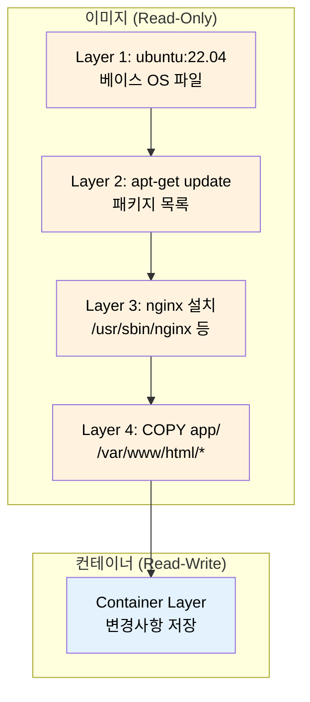
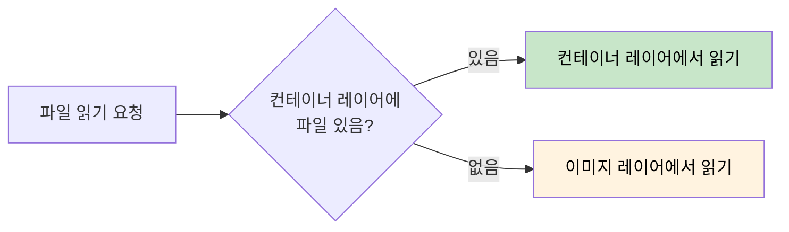
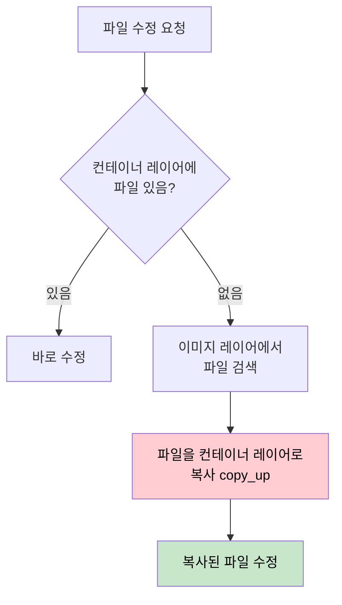
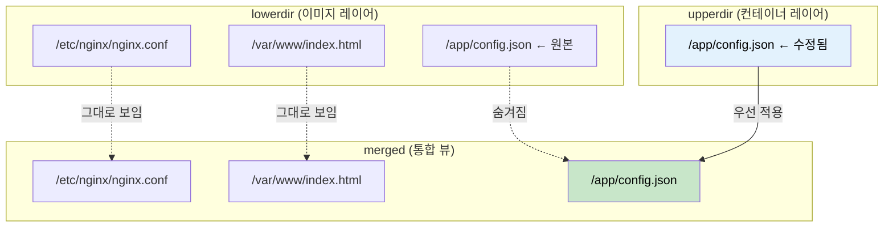
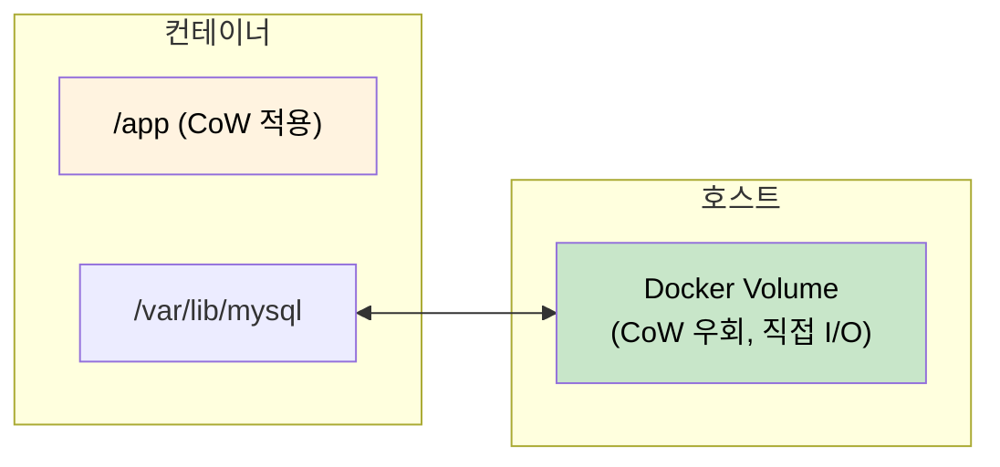

# Docker의 Copy-on-Write 전략

Docker가 이미지 레이어를 효율적으로 관리하고, 컨테이너를 빠르게 시작할 수 있는 비밀은 Copy-on-Write(CoW) 전략에 있다.

## 결론부터 말하면

**Copy-on-Write(CoW)**는 "쓰기가 발생할 때만 복사한다"는 전략이다. Docker는 이 전략 덕분에:

1. **이미지 공유**: 100개의 컨테이너가 같은 이미지를 사용해도 이미지는 한 벌만 저장
2. **빠른 시작**: 컨테이너 시작 시 전체 파일시스템을 복사하지 않음
3. **저장소 절약**: 변경된 파일만 컨테이너 레이어에 저장

```
┌─────────────────────────────────────────────────────────┐
│                    Container Layer                       │
│                 (Read-Write, CoW 적용)                   │
│  ┌─────────────────────────────────────────────────┐    │
│  │ 수정된 파일만 여기에 복사됨                        │    │
│  └─────────────────────────────────────────────────┘    │
├─────────────────────────────────────────────────────────┤
│                    Image Layer 3                         │
│                     (Read-Only)                          │
├─────────────────────────────────────────────────────────┤
│                    Image Layer 2                         │
│                     (Read-Only)                          │
├─────────────────────────────────────────────────────────┤
│                    Image Layer 1                         │
│                     (Read-Only)                          │
└─────────────────────────────────────────────────────────┘
```

## 1. 왜 Copy-on-Write가 필요한가?

Docker 없이 가상화를 생각해보자. 전통적인 VM은 각 인스턴스마다 전체 OS를 복사한다.

```
전통적 VM 방식:
VM1: Ubuntu 전체 (20GB) + 앱
VM2: Ubuntu 전체 (20GB) + 앱
VM3: Ubuntu 전체 (20GB) + 앱
→ 총 60GB+ 사용

Docker 방식 (CoW):
Ubuntu 이미지 (20GB) ← 공유
├── Container1: 변경분만 (50MB)
├── Container2: 변경분만 (30MB)
└── Container3: 변경분만 (40MB)
→ 총 20.12GB 사용
```

이것이 Docker가 "가볍다"고 불리는 이유다. CoW 덕분에 같은 베이스 이미지를 사용하는 컨테이너들은 읽기 전용 레이어를 공유하고, 각자 변경한 부분만 따로 저장한다.

## 2. Docker 레이어 구조 이해하기

### 이미지 레이어의 탄생

Dockerfile의 각 명령어는 새로운 레이어를 만든다:

```dockerfile
FROM ubuntu:22.04           # Layer 1: 베이스 이미지
RUN apt-get update          # Layer 2: 패키지 목록 업데이트
RUN apt-get install -y nginx # Layer 3: nginx 설치
COPY app/ /var/www/html/    # Layer 4: 애플리케이션 복사
```



### 컨테이너 레이어

컨테이너를 시작하면 이미지 위에 얇은 쓰기 가능 레이어가 추가된다. 이 레이어에서 모든 변경이 일어난다.

| 레이어 유형 | 읽기 | 쓰기 | 공유 | 지속성 |
|------------|------|------|------|--------|
| 이미지 레이어 | O | X | O (여러 컨테이너) | 영구 |
| 컨테이너 레이어 | O | O | X (해당 컨테이너만) | 컨테이너 삭제 시 제거 |

## 3. Copy-on-Write 동작 원리

### 파일 읽기

컨테이너에서 파일을 읽을 때:



- 컨테이너 레이어에 파일이 있으면 → 그 파일 사용
- 없으면 → 이미지 레이어에서 찾아서 사용
- **복사 없음** → 빠름

### 파일 쓰기 (Copy-on-Write 발동!)

컨테이너에서 기존 파일을 수정할 때:



이것이 **Copy-on-Write**다:
1. 수정하려는 파일이 이미지 레이어에만 있으면
2. 먼저 컨테이너 레이어로 **전체 파일을 복사** (copy_up)
3. 그 다음 복사본을 수정

### 파일 삭제

이미지 레이어의 파일은 실제로 삭제할 수 없다 (읽기 전용이므로). 대신 **whiteout 파일**을 생성해서 "이 파일은 삭제됨"을 표시한다.

```bash
# 이미지 레이어에 /etc/nginx/nginx.conf가 있다고 가정
# 컨테이너에서 삭제하면:

# 컨테이너 레이어에 whiteout 파일 생성
/etc/nginx/.wh.nginx.conf  # "nginx.conf는 삭제됨"을 의미
```

## 4. overlay2 Storage Driver

현재 Docker의 기본 스토리지 드라이버는 **overlay2**다. OverlayFS를 기반으로 CoW를 구현한다.

### overlay2 디렉토리 구조

```bash
# Docker 저장소 위치
/var/lib/docker/overlay2/

# 각 레이어별 디렉토리
/var/lib/docker/overlay2/
├── l/                          # 심볼릭 링크 (짧은 이름)
├── abc123.../                  # 레이어 1
│   ├── diff/                   # 이 레이어의 파일들
│   └── link                    # 짧은 이름 참조
├── def456.../                  # 레이어 2
│   ├── diff/
│   ├── link
│   ├── lower                   # 하위 레이어 참조
│   └── work/                   # OverlayFS 작업 디렉토리
└── ghi789.../                  # 컨테이너 레이어
    ├── diff/                   # 변경된 파일들
    ├── link
    ├── lower
    ├── merged/                 # 통합된 뷰 (마운트 포인트)
    └── work/
```

### OverlayFS의 세 가지 디렉토리

| 디렉토리 | 역할 | 읽기/쓰기 |
|---------|------|----------|
| **lowerdir** | 이미지 레이어들 (여러 개 가능) | 읽기 전용 |
| **upperdir** | 컨테이너 레이어 | 읽기/쓰기 |
| **merged** | 통합된 뷰 (컨테이너가 보는 파일시스템) | - |



### 실제로 확인해보기

```bash
# 컨테이너 시작
docker run -d --name test nginx

# 컨테이너의 마운트 정보 확인
docker inspect test --format '{{.GraphDriver.Data}}'

# 또는 mount 명령으로 확인
docker exec test mount | grep overlay
# overlay on / type overlay (rw,relatime,
#   lowerdir=/var/lib/docker/overlay2/xxx/diff:...,
#   upperdir=/var/lib/docker/overlay2/yyy/diff,
#   workdir=/var/lib/docker/overlay2/yyy/work)
```

## 5. CoW의 성능 특성

### 장점

1. **저장소 효율성**
   - 동일 이미지 기반 컨테이너들이 레이어 공유
   - 변경분만 저장하므로 디스크 절약

2. **빠른 컨테이너 시작**
   - 전체 파일시스템 복사 불필요
   - 얇은 컨테이너 레이어만 생성

3. **메모리 효율성 (Page Cache Sharing)**
   - 같은 파일을 읽는 여러 컨테이너가 메모리 캐시 공유

### 단점과 주의사항

1. **첫 번째 쓰기 지연 (copy_up overhead)**
   ```
   시나리오: 1GB 로그 파일에 한 줄 추가

   1. 파일이 이미지 레이어에 있음
   2. copy_up: 1GB 전체를 컨테이너 레이어로 복사
   3. 복사된 파일에 한 줄 추가

   → 단순 append인데 1GB 복사 발생!
   ```

2. **파일 단위 복사**
   - overlay2는 블록이 아닌 파일 단위로 작동
   - 작은 수정에도 전체 파일 복사

3. **쓰기 집약적 워크로드에 부적합**
   - 데이터베이스
   - 로그 파일
   - 대용량 파일 처리

### 해결책: Docker Volume 사용

CoW의 오버헤드를 피해야 하는 데이터는 **볼륨**을 사용한다:

```bash
# 볼륨 마운트 - CoW 우회
docker run -d \
  -v /host/data:/var/lib/mysql \
  mysql

# Named volume
docker run -d \
  -v mysql_data:/var/lib/mysql \
  mysql
```



| 데이터 유형 | 권장 저장 위치 |
|------------|---------------|
| 애플리케이션 코드 | 이미지 레이어 (CoW) |
| 설정 파일 (읽기 위주) | 이미지 레이어 또는 ConfigMap |
| 데이터베이스 | **볼륨** |
| 로그 파일 | **볼륨** 또는 로그 드라이버 |
| 업로드 파일 | **볼륨** |
| 캐시 데이터 | tmpfs 또는 볼륨 |

## 6. 다른 스토리지 드라이버들

overlay2 외에도 여러 스토리지 드라이버가 있다:

| 드라이버 | 특징 | CoW 단위 | 권장 환경 |
|---------|------|----------|----------|
| **overlay2** | 현재 기본, 가장 널리 사용 | 파일 | 대부분의 Linux |
| **btrfs** | B-tree 파일시스템, 스냅샷 지원 | 블록 | btrfs 파일시스템 |
| **zfs** | 고급 기능, 데이터 무결성 | 블록 | ZFS 파일시스템 |
| **devicemapper** | LVM 기반 | 블록 | 레거시 |
| **vfs** | CoW 없음, 매번 전체 복사 | - | 테스트용 |

```bash
# 현재 사용 중인 스토리지 드라이버 확인
docker info | grep "Storage Driver"
# Storage Driver: overlay2
```

## 7. 실무에서의 Best Practices

### Dockerfile 최적화

CoW를 이해하면 효율적인 Dockerfile을 작성할 수 있다:

```dockerfile
# Bad: 레이어마다 불필요한 파일 생성
RUN apt-get update
RUN apt-get install -y nginx
RUN apt-get clean

# Good: 한 레이어에서 정리까지 완료
RUN apt-get update && \
    apt-get install -y nginx && \
    apt-get clean && \
    rm -rf /var/lib/apt/lists/*
```

### 자주 변경되는 파일은 마지막에

```dockerfile
# Good: 변경 빈도 낮은 것 → 높은 것 순서
FROM node:18

# 1. 시스템 의존성 (거의 안 바뀜)
RUN apt-get update && apt-get install -y some-lib

# 2. 앱 의존성 (가끔 바뀜)
COPY package*.json ./
RUN npm install

# 3. 소스 코드 (자주 바뀜)
COPY . .

# → 소스 코드만 바뀌면 마지막 레이어만 다시 빌드
```

### 불필요한 파일 제외

```bash
# .dockerignore
node_modules
.git
*.log
.env.local
```

## 8. 정리

Copy-on-Write는 Docker의 핵심 전략이다:

```
읽기: 공유된 이미지 레이어에서 직접 읽음 → 빠름
쓰기: 수정할 때만 컨테이너 레이어로 복사 → 효율적
삭제: whiteout 파일로 "삭제됨" 표시 → 이미지 보존
```

**핵심 포인트**:
- CoW 덕분에 컨테이너가 가볍고 빠르다
- overlay2가 현재 기본 스토리지 드라이버
- 쓰기 집약적 데이터는 볼륨 사용 필수
- Dockerfile 최적화로 레이어 효율성 극대화

## 출처

- [Docker Storage Drivers](https://docs.docker.com/engine/storage/drivers/) - 공식 문서
- [OverlayFS Storage Driver](https://docs.docker.com/engine/storage/drivers/overlayfs-driver/) - overlay2 상세
- [Docker Storage Drivers - DEV Community](https://dev.to/meghasharmaaaa/docker-storage-drivers-4a75)
- [Understanding Container Images: Working with Overlays](https://blogs.cisco.com/developer/373-containerimages-03) - Cisco 기술 블로그
