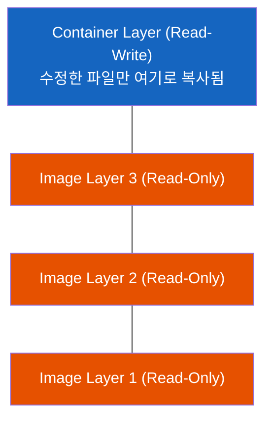
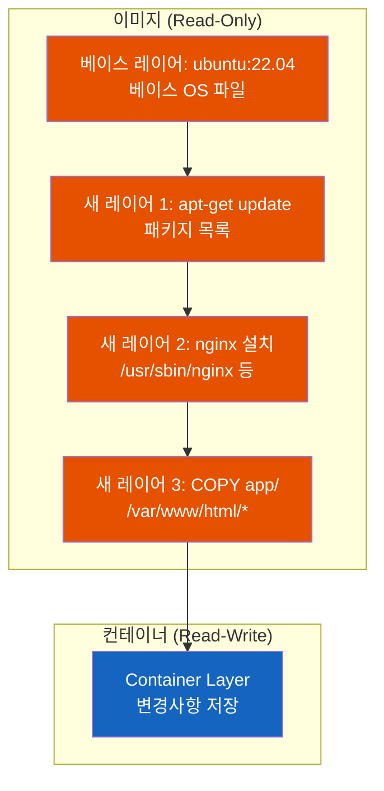
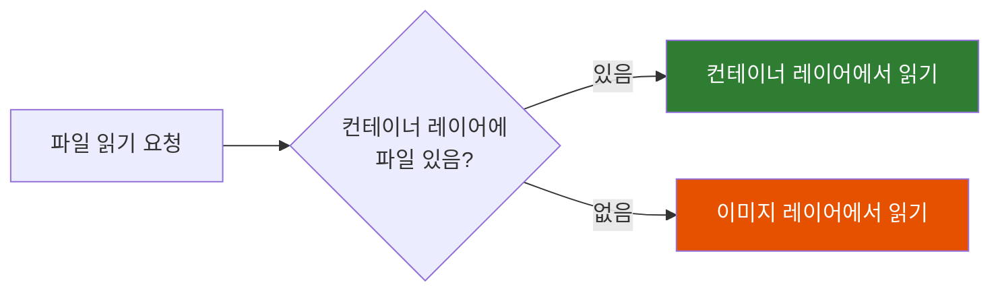
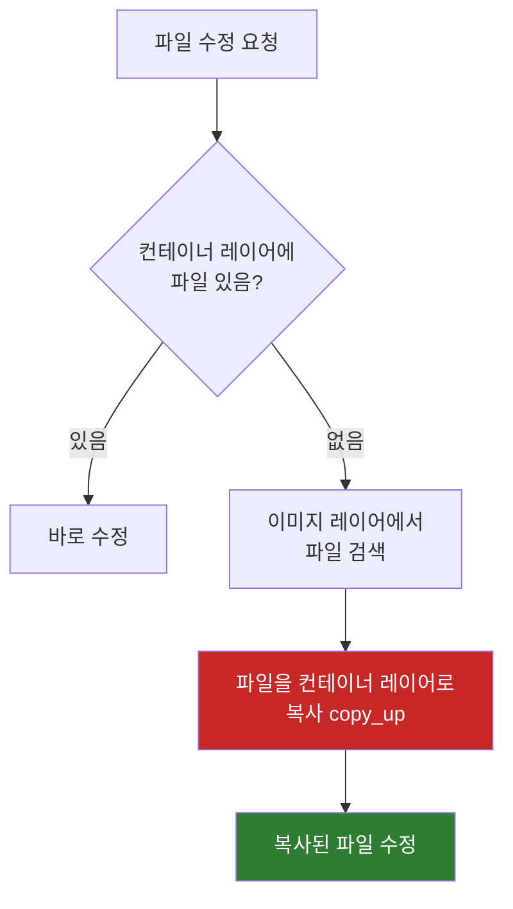
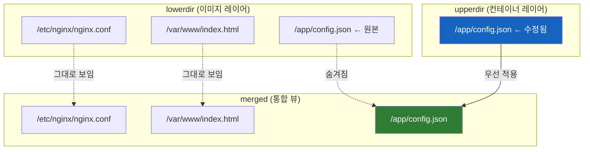
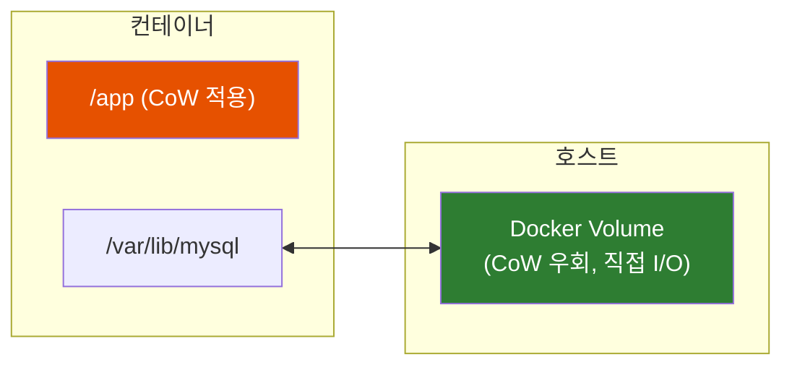

# Docker의 Copy-on-Write 전략

Docker가 이미지 레이어를 효율적으로 관리하고, 컨테이너를 빠르게 시작할 수 있는 비밀은 Copy-on-Write(CoW) 전략에 있다.

## 결론부터 말하면

**Copy-on-Write(CoW)** 는 "쓰기가 발생할 때만 복사한다"는 전략이다. Docker는 이 전략 덕분에:

1. **이미지 공유**: 100개의 컨테이너가 같은 이미지를 사용해도 이미지는 한 벌만 저장
2. **빠른 시작**: 컨테이너 시작 시 전체 파일시스템을 복사하지 않음
3. **저장소 절약**: 변경된 파일만 컨테이너 레이어에 저장


```mermaid
flowchart TB
    CL["Container Layer (Read-Write)<br>수정한 파일만 여기로 복사됨"]
    L3["Image Layer 3 (Read-Only)"]
    L2["Image Layer 2 (Read-Only)"]
    L1["Image Layer 1 (Read-Only)"]

    CL --- L3 --- L2 --- L1

    style CL fill:#1565C0,color:#fff
    style L3 fill:#E65100,color:#fff
    style L2 fill:#E65100,color:#fff
    style L1 fill:#E65100,color:#fff
```

## 1. 왜 Copy-on-Write가 필요한가?

Docker 없이 가상화를 생각해보자. 전통적인 VM은 인스턴스마다 커널을 포함한 게스트 OS 전체를 디스크 이미지로 갖는다.

| 방식 | 구성 | 디스크 사용량 (예시) |
|------|------|---------------------|
| 전통적 VM | VM 3대 × (Ubuntu 게스트 OS 디스크 20GB + 앱) | 60GB 이상 |
| Docker (CoW) | Ubuntu 이미지 약 80MB 한 벌 공유 + 컨테이너별 변경분 50MB·30MB·40MB | 약 0.2GB |

이 차이에는 두 가지 효과가 겹쳐 있다. 첫째, 컨테이너 이미지에는 커널이 없다. 컨테이너는 호스트 커널을 공유하므로 `ubuntu:22.04` 이미지는 압축 기준 약 30MB, 풀어도 약 80MB에 불과하다. 둘째가 CoW다. 같은 베이스 이미지를 사용하는 컨테이너들은 읽기 전용 레이어를 한 벌만 두고 공유하며, 각자 변경한 부분만 따로 저장한다. 컨테이너를 100개 띄워도 이미지는 복사되지 않는다.

이 두 가지가 Docker가 "가볍다"고 불리는 이유다. 이 문서는 그중 두 번째인 CoW를 다룬다.

## 2. Docker 레이어 구조 이해하기

### 이미지 레이어의 탄생

Dockerfile 명령어 중 파일시스템을 바꾸는 명령(`RUN`, `COPY`, `ADD` 등)이 새로운 레이어를 만든다. `CMD`, `ENV`, `LABEL` 같은 명령은 레이어 없이 이미지 설정(메타데이터)만 바꾼다. `FROM`도 새 레이어를 만들지 않고, 베이스 이미지의 레이어들을 그대로 가져와 그 위에 쌓기 시작한다. 아래 예시는 베이스 레이어 위에 새 레이어 세 개를 쌓는다:

```dockerfile
# 베이스: ubuntu:22.04의 레이어들을 그대로 가져온다 (새 레이어 아님)
FROM ubuntu:22.04
# 새 레이어 1: 패키지 목록 업데이트 (설명을 위해 나눴다. 실제로는 7절처럼 install과 합친다)
RUN apt-get update
# 새 레이어 2: nginx 설치
RUN apt-get install -y nginx
# 새 레이어 3: 애플리케이션 복사
COPY app/ /var/www/html/
```

> Dockerfile에서 `#`는 줄 맨 앞에 있을 때만 주석이다. `FROM ubuntu:22.04  # 설명`처럼 명령 뒤에 붙이면 인자로 해석되어 빌드가 실패하므로, 주석은 항상 별도 줄에 쓴다.


```mermaid
flowchart TB
    subgraph Image["이미지 (Read-Only)"]
        L1["베이스 레이어: ubuntu:22.04<br/>베이스 OS 파일"]
        L2["새 레이어 1: apt-get update<br/>패키지 목록"]
        L3["새 레이어 2: nginx 설치<br/>/usr/sbin/nginx 등"]
        L4["새 레이어 3: COPY app/<br/>/var/www/html/*"]
    end

    subgraph Container["컨테이너 (Read-Write)"]
        CL["Container Layer<br/>변경사항 저장"]
    end

    L1 --> L2 --> L3 --> L4 --> CL

    style CL fill:#1565C0,color:#fff
    style L1 fill:#E65100,color:#fff
    style L2 fill:#E65100,color:#fff
    style L3 fill:#E65100,color:#fff
    style L4 fill:#E65100,color:#fff
```

### 컨테이너 레이어

컨테이너를 시작하면 이미지 위에 얇은 쓰기 가능 레이어가 추가된다. 이 레이어에서 모든 변경이 일어난다.

| 레이어 유형 | 읽기 | 쓰기 | 공유 | 지속성 |
|------------|------|------|------|--------|
| 이미지 레이어 | O | X | O (여러 컨테이너) | 영구 |
| 컨테이너 레이어 | O | O | X (해당 컨테이너만) | 컨테이너 삭제 시 제거 |

## 3. Copy-on-Write 동작 원리

### 파일 읽기

컨테이너에서 파일을 읽을 때:


```mermaid
flowchart LR
    A[파일 읽기 요청] --> B{컨테이너 레이어에<br/>파일 있음?}
    B -->|있음| C[컨테이너 레이어에서 읽기]
    B -->|없음| D[이미지 레이어에서 읽기]

    style C fill:#2E7D32,color:#fff
    style D fill:#E65100,color:#fff
```

- 컨테이너 레이어에 파일이 있으면 → 그 파일 사용
- 없으면 → 이미지 레이어에서 찾아서 사용
- **복사 없음** → 빠름

### 파일 쓰기 (Copy-on-Write 발동!)

컨테이너에서 기존 파일을 수정할 때:


```mermaid
flowchart TD
    A[파일 수정 요청] --> B{컨테이너 레이어에<br/>파일 있음?}
    B -->|있음| C[바로 수정]
    B -->|없음| D[이미지 레이어에서<br/>파일 검색]
    D --> E[파일을 컨테이너 레이어로<br/>복사 copy_up]
    E --> F[복사된 파일 수정]

    style E fill:#C62828,color:#fff
    style F fill:#2E7D32,color:#fff
```

이것이 **Copy-on-Write** 다:
1. 수정하려는 파일이 이미지 레이어에만 있으면
2. 먼저 컨테이너 레이어로 **전체 파일을 복사** (copy_up)
3. 그 다음 복사본을 수정

### 파일 삭제

이미지 레이어의 파일은 실제로 삭제할 수 없다 (읽기 전용이므로). 대신 컨테이너 레이어에 **whiteout** 이라는 표시를 남겨 "이 파일은 삭제됨"을 나타낸다. OverlayFS가 파일을 지울 때 만드는 whiteout은 지운 파일과 **같은 이름의 문자 디바이스(장치 번호 0/0)** 다. (커널은 `trusted.overlay.whiteout` xattr가 붙은 빈 파일도 whiteout으로 인식하지만, OverlayFS가 직접 만드는 형태는 문자 디바이스다.)

```bash
# 이미지 레이어에 /etc/nginx/nginx.conf가 있다고 가정하고, 컨테이너에서 삭제하면
docker exec test rm /etc/nginx/nginx.conf

# 컨테이너 레이어(upperdir)에는 같은 이름의 0/0 문자 디바이스가 생긴다
ls -l <upperdir>/etc/nginx/
# c--------- 1 root root 0, 0 ... nginx.conf
```

통합 뷰(merged)는 whiteout을 만나면 아래 레이어의 같은 이름 파일을 숨긴다. 흔히 보는 `.wh.nginx.conf` 같은 이름은 이 상태를 이미지 레이어 tar로 묶을 때(`docker commit`, `docker push` 등) 쓰는 OCI 이미지 형식의 표기다. 디스크 위의 표현과 배포용 tar의 표현이 다를 뿐, 의미는 같다.

## 4. overlay2와 containerd image store

### 지금 내 Docker는 어느 쪽인가?

Docker가 레이어를 디스크에 저장하는 방식은 두 가지다. 오랫동안 기본이었던 **overlay2 storage driver** 는 Docker 엔진이 직접 레이어를 관리하고 `/var/lib/docker/overlay2/`에 저장한다. 반면 Docker Engine 29.0(2025-11)부터 새로 설치하면 기본이 되는 **containerd image store** 는 레이어 관리를 containerd에 맡기고, containerd의 overlayfs snapshotter가 `/var/lib/containerd/` 아래에 저장한다.

이름과 저장 위치는 다르지만 둘 다 리눅스 커널의 **OverlayFS** 로 레이어를 겹친다. 그래서 이 문서의 CoW 원리(lowerdir/upperdir/merged, copy_up, whiteout)는 어느 쪽이든 그대로 적용된다. 달라지는 건 디렉토리 위치와 확인 방법이다.

| 구분 | overlay2 storage driver | containerd image store |
|------|------------------------|------------------------|
| 기본값이 되는 경우 | Engine 28 이하, 또는 그 버전에서 업그레이드한 설치 | Engine 29+ 새 설치, Docker Desktop 4.34+ 새 설치 |
| `docker info` | `Storage Driver: overlay2` | `Storage Driver: overlayfs`<br>`driver-type: io.containerd.snapshotter.v1` |
| 레이어 저장 위치 | `/var/lib/docker/overlay2/` | `/var/lib/containerd/io.containerd.snapshotter.v1.overlayfs/snapshots/` |
| `docker inspect`로 lowerdir/upperdir 확인 | 가능 (`GraphDriver.Data`) | 불가 |

```bash
docker info | grep -A1 "Storage Driver"

# overlay2 storage driver인 경우
#  Storage Driver: overlay2
#   Backing Filesystem: extfs

# containerd image store인 경우
#  Storage Driver: overlayfs
#   driver-type: io.containerd.snapshotter.v1
```

> 업그레이드한 엔진을 containerd image store로 바꾸려면 `/etc/docker/daemon.json`에 `"features": {"containerd-snapshotter": true}`를 넣고 데몬을 재시작한다. 바꾸면 overlay2에 있던 이미지·컨테이너는 디스크에 남은 채 보이지 않게 되고, 다시 overlay2로 돌아오면 나타난다. 또 `userns-remap`을 쓰는 설치는 Engine 29에서도 overlay2가 유지된다.

### overlay2 디렉토리 구조

overlay2 storage driver 기준의 구조다:

```bash
# Docker 저장소 위치
/var/lib/docker/overlay2/

# 각 레이어별 디렉토리
/var/lib/docker/overlay2/
├── l/                          # 심볼릭 링크 (짧은 이름)
├── abc123.../                  # 레이어 1
│   ├── diff/                   # 이 레이어의 파일들
│   └── link                    # 짧은 이름 참조
├── def456.../                  # 레이어 2
│   ├── diff/
│   ├── link
│   ├── lower                   # 하위 레이어 참조
│   └── work/                   # OverlayFS 작업 디렉토리
├── ghi789...-init/             # 컨테이너 초기화 레이어 (/etc/hosts 등 자리 표시용)
└── ghi789.../                  # 컨테이너 레이어
    ├── diff/                   # 변경된 파일들
    ├── link
    ├── lower
    ├── merged/                 # 통합된 뷰 (마운트 포인트)
    └── work/
```

containerd image store에서는 `snapshots/<번호>/fs` 디렉토리 하나하나가 레이어(또는 컨테이너 레이어) 역할을 하고, 같은 OverlayFS 원리로 겹친다.

### OverlayFS의 디렉토리들

| 디렉토리 | 역할 | 읽기/쓰기 |
|---------|------|----------|
| **lowerdir** | 이미지 레이어들 (여러 개 가능) | 읽기 전용 |
| **upperdir** | 컨테이너 레이어 | 읽기/쓰기 |
| **merged** | 통합된 뷰 (컨테이너가 보는 파일시스템) | - |
| **workdir** | copy_up, whiteout 생성 같은 작업을 원자적으로 처리하는 내부용 디렉토리 | - |


```mermaid
flowchart TB
    subgraph merged["merged (통합 뷰)"]
        M1["/etc/nginx/nginx.conf"]
        M2["/var/www/index.html"]
        M3["/app/config.json"]
    end

    subgraph upper["upperdir (컨테이너 레이어)"]
        U1["/app/config.json ← 수정됨"]
    end

    subgraph lower["lowerdir (이미지 레이어)"]
        L1["/etc/nginx/nginx.conf"]
        L2["/var/www/index.html"]
        L3["/app/config.json ← 원본"]
    end

    L1 -.->|그대로 보임| M1
    L2 -.->|그대로 보임| M2
    U1 -->|우선 적용| M3
    L3 -.->|숨겨짐| M3

    style U1 fill:#1565C0,color:#fff
    style M3 fill:#2E7D32,color:#fff
```

### 실제로 확인해보기

```bash
# 컨테이너 시작
docker run -d --name test nginx

# overlay2 storage driver: 마운트 정보 확인
# (containerd image store에서는 lowerdir/upperdir가 나오지 않는다)
docker inspect test --format '{{.GraphDriver.Data}}'

# 컨테이너 안에서 루트 파일시스템의 마운트 옵션 확인
docker exec test mount | grep overlay
# overlay2 기준 출력 예시:
# overlay on / type overlay (rw,relatime,
#   lowerdir=/var/lib/docker/overlay2/l/ABC...:/var/lib/docker/overlay2/l/DEF...,
#   upperdir=/var/lib/docker/overlay2/yyy/diff,
#   workdir=/var/lib/docker/overlay2/yyy/work)
```

## 5. CoW의 성능 특성

### 장점

1. **저장소 효율성**
   - 동일 이미지 기반 컨테이너들이 레이어 공유
   - 변경분만 저장하므로 디스크 절약

2. **빠른 컨테이너 시작**
   - 전체 파일시스템 복사 불필요
   - 얇은 컨테이너 레이어만 생성

3. **메모리 효율성 (Page Cache Sharing)**
   - 같은 파일을 읽는 여러 컨테이너가 메모리 캐시 공유

### 단점과 주의사항

1. **첫 번째 쓰기 지연 (copy_up overhead)**
   ```
   시나리오: 1GB 로그 파일에 한 줄 추가

   1. 파일이 이미지 레이어에 있음
   2. copy_up: 1GB 전체를 컨테이너 레이어로 복사
   3. 복사된 파일에 한 줄 추가

   → 단순 append인데 1GB 복사 발생!
   ```

2. **파일 단위 복사**
   - OverlayFS는 블록이 아닌 파일 단위로 작동
   - 작은 수정에도 전체 파일 복사

3. **쓰기 집약적 워크로드에 부적합**
   - 데이터베이스
   - 로그 파일
   - 대용량 파일 처리

### 해결책: Docker Volume 사용

CoW의 오버헤드를 피해야 하는 데이터는 **볼륨** 을 사용한다:

```bash
# bind mount - 호스트 디렉토리를 그대로 연결 (CoW 우회)
docker run -d \
  -e MYSQL_ROOT_PASSWORD=secret \
  -v /host/data:/var/lib/mysql \
  mysql

# named volume - Docker가 관리하는 볼륨 (CoW 우회)
docker run -d \
  -e MYSQL_ROOT_PASSWORD=secret \
  -v mysql_data:/var/lib/mysql \
  mysql
```

둘 다 해당 경로를 OverlayFS 밖의 일반 디렉토리에 연결하므로 copy_up이 일어나지 않는다. 참고로 mysql·postgres 같은 공식 DB 이미지는 Dockerfile에 `VOLUME /var/lib/mysql`처럼 데이터 경로를 미리 선언해 두었다. 그래서 `-v`를 빠뜨려도 데이터는 이름 없는 익명 볼륨에 저장되어 CoW를 거치지 않는다. 다만 익명 볼륨은 이름이 없어 컨테이너를 새로 만들면 다시 연결하기 어려우므로, 위처럼 이름을 붙이는 편이 낫다.


```mermaid
flowchart LR
    subgraph Container["컨테이너"]
        A["/app (CoW 적용)"]
        B["/var/lib/mysql"]
    end

    subgraph Host["호스트"]
        C["Docker Volume<br/>(CoW 우회, 직접 I/O)"]
    end

    B <--> C

    style A fill:#E65100,color:#fff
    style C fill:#2E7D32,color:#fff
```

| 데이터 유형 | 권장 저장 위치 |
|------------|---------------|
| 애플리케이션 코드 | 이미지 레이어 (CoW) |
| 설정 파일 (읽기 위주) | 이미지 레이어 또는 bind mount(`:ro`) |
| 데이터베이스 | **볼륨** |
| 로그 파일 | **볼륨** 또는 로그 드라이버 |
| 업로드 파일 | **볼륨** |
| 캐시 데이터 | tmpfs 또는 볼륨 |

## 6. 다른 스토리지 드라이버들

OverlayFS 기반의 두 방식 외에도 여러 스토리지 드라이버가 있다:

| 드라이버 | 특징 | CoW 단위 | 현재 상태 |
|---------|------|----------|----------|
| **overlay2** | 커널 OverlayFS 기반, 오랫동안 기본값 | 파일 | Engine 28 이하·업그레이드 설치의 기본 |
| **containerd snapshotter (overlayfs)** | containerd가 레이어를 관리, 같은 OverlayFS 사용 | 파일 | Engine 29+ 새 설치의 기본 |
| **fuse-overlayfs** | 사용자 공간(FUSE) OverlayFS 구현 | 파일 | 커널 5.11 미만의 rootless 환경 (5.11 이상은 overlay2로 rootless 가능) |
| **btrfs** | B-tree 파일시스템, 스냅샷 지원 | 블록 | 호스트가 btrfs일 때 |
| **zfs** | 데이터 무결성·스냅샷 등 고급 기능 | 블록 | 호스트가 ZFS일 때 |
| **devicemapper** | LVM 기반 | 블록 | **제거됨** (18.09에서 deprecated, Engine 25.0에서 삭제) |
| **vfs** | CoW 없음, 매번 전체 복사 | - | 테스트·디버깅 전용 |

현재 사용 중인 방식은 4절의 `docker info` 명령으로 확인한다.

## 7. 실무에서의 Best Practices

### Dockerfile 최적화

CoW를 이해하면 효율적인 Dockerfile을 작성할 수 있다:

```dockerfile
# Bad: 정리를 다른 레이어에서 하면 이미지가 줄지 않는다
RUN apt-get update
RUN apt-get install -y nginx
RUN rm -rf /var/lib/apt/lists/*

# Good: 한 레이어에서 설치와 정리를 끝낸다
RUN apt-get update && \
    apt-get install -y nginx && \
    rm -rf /var/lib/apt/lists/*
```

Bad가 나쁜 이유는 두 가지다. 첫째는 CoW 때문이다. `apt-get update`가 받은 패키지 목록은 이미 그 `RUN`의 레이어에 기록되었으므로, 다음 레이어에서 지워도 whiteout으로 가려질 뿐 이미지 크기는 그대로다. 둘째는 빌드 캐시 때문이다. `apt-get update`만 따로 있는 레이어는 캐시되어 다시 실행되지 않는다. 그래서 나중에 install 줄에 패키지를 추가하면 오래된 패키지 목록으로 설치하게 된다. Docker 공식 가이드가 `update`와 `install`을 항상 같은 `RUN`에 두라고 하는 이유다. 참고로 Debian·Ubuntu 공식 이미지는 `apt-get clean`을 자동으로 실행하므로 따로 넣을 필요가 없다.

### 자주 변경되는 파일은 마지막에

```dockerfile
# Good: 변경 빈도 낮은 것 → 높은 것 순서
FROM node:24
# 작업 디렉토리 지정 (없으면 / 에서 npm이 실행되어 오류가 날 수 있다)
WORKDIR /app

# 1. 시스템 의존성 (거의 안 바뀜)
RUN apt-get update && apt-get install -y some-lib && rm -rf /var/lib/apt/lists/*

# 2. 앱 의존성 (가끔 바뀜)
COPY package*.json ./
RUN npm ci

# 3. 소스 코드 (자주 바뀜)
COPY . .

# → 소스 코드만 바뀌면 마지막 레이어만 다시 빌드
```

### 불필요한 파일 제외

```bash
# .dockerignore
node_modules
.git
*.log
.env.local
```

## 8. 정리

Copy-on-Write는 Docker의 핵심 전략이다:

| 동작 | 일어나는 일 | 결과 |
|------|------------|------|
| 읽기 | 공유된 이미지 레이어에서 직접 읽음 | 복사 없음, 빠름 |
| 쓰기 | 처음 수정할 때 파일 전체를 컨테이너 레이어로 복사(copy_up) | 변경분만 저장 |
| 삭제 | whiteout으로 "삭제됨" 표시 | 이미지 레이어는 그대로 |

**핵심 포인트**:
- CoW 덕분에 컨테이너가 가볍고 빠르다 (여기에 커널 공유가 더해진다)
- overlay2든 containerd image store든 같은 OverlayFS를 쓰므로 CoW 원리는 동일하다
- 쓰기 집약적 데이터는 볼륨 사용 필수
- Dockerfile 최적화로 레이어 효율성 극대화

## 출처

- [Docker Storage Drivers](https://docs.docker.com/engine/storage/drivers/) - 공식 문서
- [OverlayFS Storage Driver](https://docs.docker.com/engine/storage/drivers/overlayfs-driver/) - overlay2 상세
- [containerd image store with Docker Engine](https://docs.docker.com/engine/storage/containerd/) - 공식 문서
- [Docker Engine 29 Release Notes](https://docs.docker.com/engine/release-notes/29/) - containerd image store 기본값 전환
- [Deprecated Docker Engine features](https://docs.docker.com/engine/deprecated/) - 스토리지 드라이버 제거 이력
- [Building best practices](https://docs.docker.com/build/building/best-practices/) - apt-get 사용 가이드
- [Overlay Filesystem](https://docs.kernel.org/filesystems/overlayfs.html) - Linux 커널 문서 (whiteout 정의)
- [Docker Storage Drivers - DEV Community](https://dev.to/meghasharmaaaa/docker-storage-drivers-4a75)
- [Understanding Container Images: Working with Overlays](https://blogs.cisco.com/developer/373-containerimages-03) - Cisco 기술 블로그
