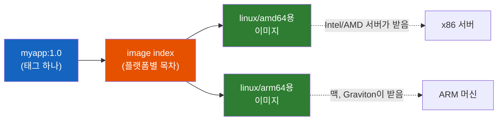
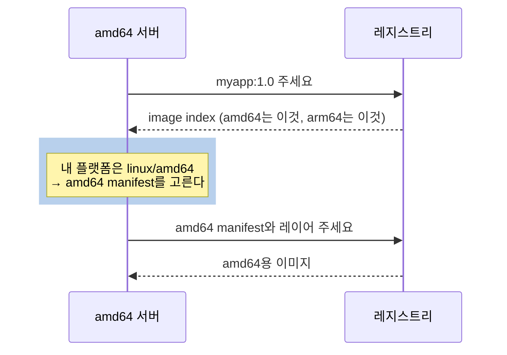

# 맥에서 만든 Docker 이미지는 왜 서버에서 안 돌까 - docker buildx와 멀티플랫폼 이미지

"docker buildx는 멀티플랫폼 이미지를 위한 도구"라는데, 평소 쓰는 `docker build`와는 뭐가 다를까? 그리고 이미지 하나가 어떻게 서로 다른 CPU에서 돌 수 있을까?

## 결론부터 말하면

**맥에서 만든 이미지가 서버에서 안 도는 이유는, 이미지 속 프로그램이 맥의 CPU(arm64)용으로 만들어져서 서버의 CPU(amd64)가 실행할 수 없기 때문이다.** 해결책은 서버 CPU용으로 빌드하거나, 여러 CPU용 이미지를 태그 하나에 묶은 **멀티플랫폼 이미지** 를 만드는 것이다.

그리고 buildx는 멀티플랫폼 전용 도구가 아니라 Docker의 빌드 명령 그 자체다. Docker Engine 23.0부터 `docker build`는 `docker buildx build`의 별칭(alias)이라서, 우리는 이미 매일 buildx로 빌드하고 있다.



| 하고 싶은 것 | 명령 |
|-------------|------|
| 서버(amd64)용 이미지 하나만 만들기 | `docker build --platform linux/amd64 -t myapp .` |
| amd64와 arm64를 모두 지원하는 이미지 만들기 | `docker build --platform linux/amd64,linux/arm64 -t myapp .` |
| 레지스트리에 올린 이미지가 어떤 플랫폼을 지원하는지 확인 | `docker buildx imagetools inspect myapp` |

> Docker Desktop과 Docker Engine 29.0 이상을 새로 설치한 환경 기준이다. 예전 버전에서 업그레이드한 환경은 3.6절을 보자.

---

## 1. 왜 맥에서 만든 이미지가 서버에서 안 돌까?

### 1.1 흔한 사고 한 장면

Apple Silicon(M1~M4 칩) 맥에서 Spring Boot 앱을 `docker build`로 이미지로 만들고, 레지스트리에 push한 뒤, 회사 서버나 쿠버네티스 노드에 배포했다. 맥에서는 `docker run`으로 잘 돌던 이미지다. 그런데 서버에서는 컨테이너가 뜨자마자 죽고, 로그에는 이런 형태의 메시지가 찍힌다.

```
exec /opt/java/openjdk/bin/java: exec format error
```

코드는 한 줄도 바꾸지 않았고, 맥에서는 분명히 돌았다. 무엇이 달라진 걸까?

### 1.2 컨테이너는 CPU 명령어를 그대로 실행한다

답은 CPU에 있다. 모든 프로그램은 결국 CPU가 알아듣는 기계어로 실행되는데, 기계어의 문법은 CPU 계열마다 다르다. 이 계열을 **아키텍처(architecture)** 라고 부른다. 지금 서버와 PC에서 주로 쓰는 아키텍처는 둘이고, 같은 것을 부르는 이름이 여러 개라 처음에 헷갈리기 쉽다.

| 아키텍처 | 같은 뜻의 다른 이름 | 주로 쓰는 곳 |
|----------|-------------------|-------------|
| **amd64** | x86_64, x64 | Intel·AMD CPU. 대부분의 서버와 Windows PC |
| **arm64** | aarch64, ARMv8 | Apple Silicon 맥, AWS Graviton, 라즈베리 파이 |

리눅스에서 `uname -m`을 치면 나오는 `x86_64`나 `aarch64`가 바로 이 이름이다. Docker는 이미지가 어떤 OS와 아키텍처용인지를 `linux/amd64`, `linux/arm64`처럼 `OS/아키텍처` 형식으로 표기하고, 이 조합을 **플랫폼(platform)** 이라고 부른다.

여기서 컨테이너의 성질이 중요해진다. 컨테이너는 가상 머신(VM)이 아니다. VM은 가상의 하드웨어를 통째로 흉내 내지만, 컨테이너는 호스트의 커널과 CPU를 그대로 쓰는 격리된 프로세스일 뿐이다. (맥에서는 Docker Desktop이 작은 Linux VM을 띄우고, 컨테이너는 그 VM의 Linux 커널을 공유한다. 그 VM이 맥의 CPU 위에서 돌기 때문에 맥에서 만든 이미지는 `linux/arm64`가 된다.) Docker 공식 문서도 컨테이너는 호스트 커널을 공유하므로 컨테이너 안의 코드가 호스트 아키텍처와 호환되어야 하고, 그래서 에뮬레이션 없이는 arm64 호스트에서 `linux/amd64` 컨테이너를 실행할 수 없다고 설명한다.

이제 사고의 원인이 보인다. 맥에서 `--platform` 없이 빌드하면 Docker는 맥의 CPU에 맞춰 `linux/arm64` 이미지를 만든다. 이 이미지 속 프로그램은 arm64 기계어라서 amd64 서버의 CPU는 실행할 수 없다. `exec format error`는 커널이 "이 실행 파일 형식은 실행할 수 없다"고 거절하는 메시지다.

Java 개발자라면 의아할 수 있다. JAR는 어디서나 돌지 않나? 맞다, 바이트코드는 플랫폼에 무관하다. 하지만 그 바이트코드를 실행하는 `java` 명령(JVM)과 그 아래의 OS 라이브러리는 특정 CPU용 기계어다. 이미지에는 JAR만이 아니라 JVM과 OS 파일까지 통째로 들어가므로, 이미지는 플랫폼을 탄다.

### 1.3 그런데 내 맥에서는 amd64 이미지도 돌던데?

이상한 점이 하나 남는다. arm64 맥에서 amd64 전용 이미지를 실행해 보면 경고만 나오고 잘 돈다. 아래는 이 글을 쓰며 실제로 실행한 결과다.

```bash
$ docker run --rm demo:amd64only
WARNING: The requested image's platform (linux/amd64) does not match the detected host platform (linux/arm64/v8) and no specific platform was requested
x86_64
```

Docker Desktop이 다른 아키텍처의 프로그램을 **에뮬레이션** (다른 CPU의 명령어를 소프트웨어로 번역해 실행하는 것)으로 돌려주기 때문이다. 편리하지만 이 친절함이 문제를 가린다. 맥에서는 아키텍처가 맞지 않는 이미지도 "어쨌든 도니까" 불일치를 눈치채기 어렵다. 반면 리눅스 서버는 에뮬레이터를 따로 설치해 등록하지 않으면 다른 아키텍처의 실행 파일을 돌릴 수 없어서 그대로 실패한다. "내 맥에서는 되는데 서버에서는 안 된다"는 이렇게 생긴다.

### 1.4 가장 간단한 해결: 서버용으로 빌드하기

해결의 첫걸음은 단순하다. 빌드할 때 대상 플랫폼을 알려주면 된다.

```bash
# 맥(arm64)에서 서버(amd64)용 이미지를 빌드한다
docker build --platform linux/amd64 -t myapp:1.0 .
```

이 이미지는 amd64 서버에서 그대로 돈다. 빌드 도중의 `RUN` 명령은 맥에서 에뮬레이션으로 실행되어 amd64용 결과물을 만든다.

하지만 곧 다음 고민이 생긴다. 개발자 맥은 arm64인데 운영 서버는 amd64다. 비용을 줄이려고 일부 서버를 AWS Graviton(arm64)으로 옮기면 한 클러스터에 두 아키텍처가 섞인다. 그러면 `myapp:1.0-amd64`, `myapp:1.0-arm64`처럼 태그를 두 개 만들고, 배포 설정마다 노드에 맞는 태그를 골라 적어야 할까? Pod가 어느 노드에 뜰지 미리 알 수 없는 쿠버네티스에서는 그것조차 쉽지 않다.

**하나의 태그로 어느 CPU에서든 자기에게 맞는 이미지를 받게 할 수는 없을까?** 이것이 멀티플랫폼 이미지가 푸는 문제다.

---

## 2. 멀티플랫폼 이미지와 buildx의 정체

### 2.1 멀티플랫폼 이미지는 "목차가 붙은 이미지 묶음"이다

이미지 한 벌은 **manifest** 라는 명세서로 기술된다. manifest에는 "이 이미지의 설정은 이것이고, 파일 레이어는 이것들이다"가 적혀 있다. 단일 플랫폼 이미지는 manifest 하나로 끝난다.

멀티플랫폼 이미지는 그 위에 한 층을 더 얹는다. 플랫폼별 manifest 여러 개를 가리키는 **image index** (예전 이름은 manifest list)라는 목차다. 태그는 이 목차를 가리킨다. 같은 제목의 책이 한국어판과 영어판으로 따로 나와 있고, 서점 카운터에는 "어느 판으로 드릴까요?"라고 묻는 목차 카드 한 장이 놓여 있는 모습을 떠올리면 된다.

pull할 때는 이런 일이 일어난다.



실제 공식 이미지로 확인해 보자. `docker buildx imagetools inspect`는 레지스트리에 있는 이미지의 목차를 보여준다. `alpine:3.22`를 열어 보면(출력 일부 생략) 다음과 같다.

```bash
$ docker buildx imagetools inspect alpine:3.22
Name:      docker.io/library/alpine:3.22
MediaType: application/vnd.oci.image.index.v1+json    # 목차(image index)라는 뜻
Digest:    sha256:5291449c3df7...

Manifests:
  Name:        docker.io/library/alpine:3.22@sha256:3e9b4b680bfc...
  MediaType:   application/vnd.oci.image.manifest.v1+json
  Platform:    linux/amd64
  ...
  Name:        docker.io/library/alpine:3.22@sha256:450c744b1ef4...
  MediaType:   application/vnd.oci.image.manifest.v1+json
  Platform:    linux/arm/v6
  ...
```

플랫폼만 추리면 `linux/amd64`, `linux/arm64/v8`, `linux/arm/v6`, `linux/arm/v7`, `linux/386`, `linux/ppc64le`, `linux/riscv64`, `linux/s390x`의 8개다(`arm64/v8`의 `v8`은 같은 아키텍처 안의 세부 버전 표기다). 우리가 `docker pull alpine`을 칠 때 아키텍처를 신경 쓰지 않아도 됐던 건 공식 이미지 대부분이 이렇게 만들어져 있기 때문이다. 목록에 `unknown/unknown`으로 찍히는 항목도 보이는데, 실행용 이미지가 아니라 빌드 출처 정보(attestation)라서 무시해도 된다.

### 2.2 buildx는 "멀티플랫폼 도구"가 아니라 빌드 클라이언트다

그럼 이런 이미지는 무엇으로 만들까? 여기서 buildx가 등장한다. 그런데 "buildx는 멀티플랫폼용 별도 도구"라는 설명은 절반만 맞다.

Docker의 빌드는 클라이언트-서버 구조로 되어 있다.

| 구성 요소 | 역할 | 식당에 비유하면 |
|----------|------|---------------|
| **BuildKit** | 실제로 빌드를 수행하는 엔진(데몬). Dockerfile을 해석해 각 단계를 실행하고 결과물을 만든다 | 주방 |
| **buildx** | 빌드를 요청하고 관리하는 CLI 플러그인. 옵션을 해석해 BuildKit에 빌드 요청을 보낸다 | 주문 카운터 |

`docker build`를 치면 buildx가 옵션을 해석해 BuildKit에 빌드를 요청한다. Docker Engine 23.0에서 Buildx와 BuildKit이 Linux의 기본 빌더가 되면서 `docker build` 자체가 `docker buildx build`의 alias가 되었다. 즉 **우리는 이미 매일 buildx로 빌드하고 있다.**

buildx가 멀티플랫폼 도구로 알려진 데에는 역사적 이유가 있다. 예전 레거시 빌더는 멀티플랫폼 빌드를 지원하지 않았고, `docker buildx build --platform ...`이 그걸 할 수 있는 길이었다. 그래서 수많은 가이드가 "멀티플랫폼은 buildx로"라고 적었다. 하지만 BuildKit은 멀티플랫폼 말고도 빌드 캐시 마운트, 빌드 중 비밀값 전달, 원격 빌더 연결 같은 기능을 함께 제공하고, buildx는 그 전부를 쓰는 창구다.

그렇다면 `docker buildx`를 직접 칠 일은 없을까? 몇 가지는 여전히 buildx 하위 명령으로만 할 수 있다. 여기서 **빌더(builder)** 는 BuildKit 인스턴스 하나에 붙인 이름이다.

| 하고 싶은 일 | 명령 |
|-------------|------|
| 빌더 목록 확인, 새 빌더 생성, 기본 빌더 전환 | `docker buildx ls`, `docker buildx create`, `docker buildx use` |
| 레지스트리 이미지의 목차와 플랫폼 확인 | `docker buildx imagetools inspect` |
| `buildx use`로 고른 빌더로 빌드 | `docker buildx build` (`docker build`는 하위 호환을 위해 항상 엔진에 내장된 기본 빌더를 쓰므로, 다른 빌더를 쓰려면 `--builder`를 명시해야 한다) |

### 2.3 예전 가이드가 복잡했던 이유: image store

멀티플랫폼 빌드를 검색하면 오래된 글 대부분이 이런 준비 단계부터 시킨다.

```bash
docker buildx create --name mybuilder --driver docker-container --use
docker buildx build --platform linux/amd64,linux/arm64 -t myapp --push .
```

왜 빌더를 따로 만들고 꼭 `--push`로 올려야 했을까? 원인은 **image store** (로컬에서 이미지를 저장하고 관리하는 부분)에 있었다. 예전 Docker의 classic image store는 image index를 다룰 수 없었다. 멀티플랫폼 이미지를 만들어도 로컬에 둘 곳이 없으니, BuildKit을 별도 컨테이너로 띄우는 `docker-container` driver로 빌드해서 결과를 레지스트리로 바로 올려야 했던 것이다.

지금은 사정이 다르다. containerd image store가 image index를 지원하고, Docker Desktop과 Docker Engine 29.0 이상 새 설치에서 기본값이다. 이 환경에서는 준비 없이 `docker build --platform ...`만으로 멀티플랫폼 이미지를 만들고 로컬에서 실행까지 할 수 있다. 내 환경이 어느 쪽인지는 이렇게 확인한다.

```bash
$ docker info --format '{{.DriverStatus}}'
[[driver-type io.containerd.snapshotter.v1]]   # 이게 보이면 containerd image store를 쓰는 중
```

주의할 점이 있다. Engine 29 이전에 설치한 뒤 업그레이드한 서버는 기존의 classic image store를 그대로 쓴다. CI 서버처럼 오래된 머신이라면 3.6절의 방법이 필요할 수 있다.

### 2.4 다른 CPU용 빌드는 어떻게 가능할까: 세 가지 전략

멀티플랫폼 빌드의 진짜 어려움은 빌드 과정에 있다. 맥(arm64)에서 amd64 이미지를 빌드하려면 `RUN apt-get install ...` 같은 단계에서 amd64용 프로그램을 실행해야 한다. 내 CPU가 못 알아듣는 프로그램을 어떻게 실행할까? 공식 문서는 세 가지 전략을 제시한다.

| 전략 | 방식 | 장점 | 단점 |
|------|------|------|------|
| **에뮬레이션 (QEMU)** | 다른 CPU의 명령어를 소프트웨어로 번역해 실행 | Dockerfile 수정이 필요 없다. Docker Desktop은 설정 없이 바로 된다 | 느리다. 컴파일, 압축처럼 CPU를 많이 쓰는 작업은 특히 |
| **네이티브 노드** | amd64 머신과 arm64 머신을 빌더 하나로 묶어 각자 자기 플랫폼을 빌드 | 빠르고, 에뮬레이션이 처리 못 하는 경우도 처리 | 빌드 머신 여러 대를 관리해야 한다 (Docker Build Cloud 같은 관리형 서비스도 있다) |
| **크로스 컴파일** | 빌더 자신의 CPU에서 컴파일러를 돌리되, "결과물은 다른 CPU용으로 만들어라"라고 지시 | 네이티브 속도 | 언어와 도구가 크로스 컴파일을 지원해야 하고 Dockerfile을 고쳐야 한다 |

**QEMU** 는 널리 쓰이는 오픈소스 에뮬레이터다. 공식 BuildKit 릴리스에 QEMU가 함께 들어 있어서 대부분 따로 설치할 필요가 없다.

공식 문서는 가능하면 에뮬레이션보다 네이티브 노드나 크로스 컴파일을 쓰라고 권한다. 하지만 시작은 에뮬레이션으로 충분하고, 3.4절에서 보듯 Java 앱은 Dockerfile 한 줄만 고쳐도 에뮬레이션 비용을 거의 없앨 수 있다.

---

## 3. 직접 해보기

### 3.1 첫 멀티플랫폼 이미지

빌드 중에 어떤 CPU로 실행됐는지 기록하는 아주 작은 이미지를 만들어 보자. 아래 출력은 arm64 맥(Docker 29.8, buildx v0.37)에서 실제로 실행한 결과이고, 태그 이름만 짧게 바꿨다.

```dockerfile
FROM alpine:3.22
RUN uname -m > /arch          # 빌드 중 이 단계가 실행된 CPU 아키텍처를 기록
CMD ["cat", "/arch"]
```

```bash
$ docker build --platform linux/amd64,linux/arm64 -t demo:multi .
...
#10 exporting manifest list sha256:d739d8ebbe8e... done    # 목차(image index)가 만들어졌다

$ docker image ls --tree demo:multi
IMAGE            ID             DISK USAGE   CONTENT SIZE
demo:multi       d739d8ebbe8e       26.1MB         7.92MB
├─ linux/amd64   e6bb52b2798e       12.8MB         3.79MB
└─ linux/arm64   aa824afd8079       13.3MB         4.12MB

$ docker run --rm demo:multi                          # 그냥 실행하면 내 플랫폼(arm64)을 고른다
aarch64
$ docker run --rm --platform linux/amd64 demo:multi   # amd64 변형을 골라 실행
x86_64
```

태그는 하나인데 그 안에 두 벌이 들어 있고, 실행하는 쪽이 자기 플랫폼에 맞는 것을 고른다. amd64 변형에서 `x86_64`가 찍혔다는 건 빌드 중 `RUN uname -m`이 실제로 amd64 환경에서(맥이니까 에뮬레이션으로) 실행됐다는 뜻이다.

비교를 위해 `--platform` 없이 평소처럼 빌드하면 어떻게 될까?

```bash
$ docker build -t demo:mac .
$ docker image ls --tree demo:mac
IMAGE            ID             DISK USAGE   CONTENT SIZE
demo:mac         8e453f08b84b       13.3MB         4.13MB
└─ linux/arm64   aa824afd8079       13.3MB         4.12MB
```

`linux/arm64` 하나뿐이다. 이 이미지를 push해서 amd64 서버에 배포한 것이 1.1절의 사고다.

### 3.2 레지스트리에 올리고 확인하기

실제 배포에서는 빌드와 동시에 레지스트리로 올린다.

```bash
# 빌드하고 바로 push
docker build --platform linux/amd64,linux/arm64 \
  -t registry.example.com/myapp:1.0 --push .

# 올라간 이미지의 목차 확인
docker buildx imagetools inspect registry.example.com/myapp:1.0
```

CI에서는 에뮬레이션을 피하려고 다른 방식도 많이 쓴다. amd64 러너와 arm64 러너에서 각자 자기 플랫폼만 네이티브로 빌드해 임시 태그로 push한 다음, 마지막에 목차만 만들어 하나의 태그로 묶는 방식이다.

```bash
# 각 러너가 push한 단일 플랫폼 이미지 두 개를 하나의 image index로 묶는다
docker buildx imagetools create -t registry.example.com/myapp:1.0 \
  registry.example.com/myapp:1.0-amd64 \
  registry.example.com/myapp:1.0-arm64
```

`imagetools inspect`의 `Digest:` 줄에 찍히는 값이 목차 전체의 digest다. 이 값을 배포 설정에 고정하는 이유와 방법은 [rollout-restart를 했는데 왜 예전 코드가 그대로 돌까 - 이미지 태그와 다이제스트](../kubernetes/Kubernetes-Image-Tag-Digest.md)에서 다룬다.

### 3.3 빌드 인자: 지금 어느 CPU에서, 어느 CPU용으로 빌드하는가

멀티플랫폼 빌드에서는 플랫폼이 두 종류로 나뉜다. 빌드를 **실행하는** 머신의 플랫폼(build platform)과, 결과물이 **돌아갈** 플랫폼(target platform)이다. BuildKit은 이 정보를 Dockerfile 안에서 쓸 수 있도록 미리 정의된 빌드 인자로 넣어 준다.

| 빌드 인자 | 의미 | 맥에서 amd64용으로 빌드할 때의 값 |
|----------|------|-------------------------------|
| `BUILDPLATFORM` | 빌드를 실행하는 플랫폼 | `linux/arm64` |
| `BUILDARCH` | 빌드를 실행하는 아키텍처 | `arm64` |
| `TARGETPLATFORM` | 결과물이 돌아갈 플랫폼 | `linux/amd64` |
| `TARGETOS` | 결과물의 OS | `linux` |
| `TARGETARCH` | 결과물의 아키텍처 | `amd64` |

`BUILDOS`, `BUILDVARIANT`, `TARGETVARIANT`도 있다. 여기서 초보자가 자주 걸리는 함정이 하나 있다. 이 인자들은 Dockerfile의 전역 범위에만 있고 **각 stage로 자동 상속되지 않는다.** stage 안에서 쓰려면 `ARG`로 다시 선언해야 한다.

```dockerfile
FROM alpine:3.22
RUN echo "arch: $TARGETARCH"      # Bad: 빈 값이 찍힌다

FROM alpine:3.22
ARG TARGETARCH                    # Good: stage 안에서 선언하면
RUN echo "arch: $TARGETARCH"      # amd64, arm64가 제대로 찍힌다
```

### 3.4 Java 앱: 빌드 stage는 한 번만, 네이티브로

이제 실전이다. Spring Boot 앱은 보통 multi-stage Dockerfile로 만든다. 첫 stage에서 Gradle로 JAR를 빌드하고, 둘째 stage에서 JRE 이미지에 JAR를 복사한다. 이 Dockerfile을 그대로 `--platform linux/amd64,linux/arm64`로 빌드하면 어떻게 될까? Gradle 빌드가 플랫폼마다 한 번씩, **두 번** 돈다. 그중 맥과 다른 아키텍처 쪽은 에뮬레이션으로 돈다. 에뮬레이션은 컴파일처럼 CPU를 많이 쓰는 작업에서 특히 느리다.

그런데 생각해 보면 이상하다. JAR는 플랫폼에 무관하다. amd64용 JAR와 arm64용 JAR는 똑같다. 그렇다면 Gradle 빌드는 **한 번만, 그것도 빌더 자신의 CPU에서** 돌리면 되지 않을까?

그 방법이 `FROM --platform=$BUILDPLATFORM`이다. 빌드 stage를 빌더의 플랫폼에 고정하면, 대상 플랫폼이 몇 개든 그 stage는 네이티브로 한 번만 실행된다. 정말 그런지 alpine으로 실험해 봤다. 빌드 stage에서 `RUN echo "built on $(uname -m)"`를 실행하고, 결과를 실행 stage로 복사하는 Dockerfile을 두 가지로 만들어 비교했다.

| 빌드 stage의 FROM | RUN 실행 횟수 | amd64 변형을 실행한 결과 |
|------------------|-------------|----------------------|
| `FROM alpine:3.22` (고정 안 함) | 2번 (arm64 네이티브 1번 + amd64 에뮬레이션 1번) | `built on x86_64` |
| `FROM --platform=$BUILDPLATFORM alpine:3.22` (고정) | **1번** (arm64 네이티브) | `built on aarch64` |

고정한 쪽은 빌드 단계가 한 번만 실행됐고, amd64 이미지 안에도 arm64 맥에서 네이티브로 만든 결과물이 들어갔다. JAR처럼 결과물이 플랫폼에 무관하다면 바로 이게 원하던 동작이다.

이 원리를 Spring Boot에 적용한 패턴은 다음과 같다(위 실험의 원리를 옮긴 패턴이며, Gradle 프로젝트로 직접 실행해 본 예제는 아니다).

```dockerfile
# syntax=docker/dockerfile:1

# 빌드 stage: 빌더의 CPU에 고정한다
# → 대상 플랫폼이 몇 개든 한 번만, 네이티브 속도로 실행된다
FROM --platform=$BUILDPLATFORM eclipse-temurin:21-jdk AS build
WORKDIR /app
COPY . .
RUN ./gradlew bootJar --no-daemon      # 결과 JAR는 어느 CPU에서든 같다

# 실행 stage: 플랫폼마다 만들어진다
# eclipse-temurin은 amd64와 arm64 이미지를 모두 제공한다
FROM eclipse-temurin:21-jre
COPY --from=build /app/build/libs/*.jar /app/app.jar
ENTRYPOINT ["java", "-jar", "/app/app.jar"]
```

실행 stage에는 `RUN`이 없다는 점에 주목하자. `COPY`와 `ENTRYPOINT`는 프로그램을 실행하지 않으므로, amd64 변형을 만들 때도 에뮬레이션이 필요 없다. 결국 이 패턴에서는 에뮬레이션 비용이 사실상 사라진다. 단, 빌드 단계에서 JNI 같은 네이티브 코드를 컴파일한다면 그 결과물은 플랫폼을 타므로 예외다.

여기서 흔한 함정도 짚고 가자. `exec format error`를 검색하면 아래처럼 고치라는 글이 많이 나온다.

```dockerfile
# Bad: 플랫폼을 amd64로 하드코딩
FROM --platform=linux/amd64 eclipse-temurin:21-jre

# Good: 빌드 stage만 빌더 플랫폼에 고정하고, 실행 stage는 --platform 옵션을 따르게 둔다
FROM --platform=$BUILDPLATFORM eclipse-temurin:21-jdk AS build
FROM eclipse-temurin:21-jre
```

첫 번째 방식은 당장의 에러는 없애 주지만, 이 Dockerfile로는 영원히 amd64 이미지만 나온다. arm64 서버(Graviton 등)로 옮기는 순간 같은 문제가 반대 방향으로 터지고, `--platform linux/amd64,linux/arm64`로 빌드해도 arm64 변형에 amd64 바이너리가 들어간다. 플랫폼은 Dockerfile에 박지 말고 빌드 명령의 `--platform`으로 정하는 것이 원칙이다.

### 3.5 Go처럼 네이티브 바이너리를 만드는 언어: 크로스 컴파일

Java와 달리 Go, Rust, C 같은 언어는 빌드 결과물 자체가 특정 CPU용 기계어다. 이때는 빌드 stage를 `$BUILDPLATFORM`에 고정하되, 컴파일러에게 대상 아키텍처를 알려 주는 크로스 컴파일을 쓴다. Go는 `GOOS`, `GOARCH` 환경 변수로 대상 플랫폼을 지정한다(공식 문서의 예시를 줄인 것이다).

```dockerfile
# syntax=docker/dockerfile:1
FROM --platform=$BUILDPLATFORM golang:alpine AS build
ARG TARGETOS                       # stage 안에서 선언해야 값이 들어온다
ARG TARGETARCH
WORKDIR /app
COPY . .
RUN GOOS=${TARGETOS} GOARCH=${TARGETARCH} go build -o server .   # 네이티브로 돌면서 대상 CPU용 바이너리 생성

FROM alpine
COPY --from=build /app/server /server
ENTRYPOINT ["/server"]
```

Java 패턴과의 차이는 `RUN` 한 줄에 있다. 결과물이 플랫폼을 타므로 대상 플랫폼마다 한 번씩 컴파일하지만, 컴파일러는 에뮬레이션 없이 네이티브 속도로 돈다.

### 3.6 예전 환경(classic image store)에서 빌드하기

2.3절에서 본 것처럼 classic image store를 쓰는 환경에서는 두 가지 선택지가 있다. 하나는 daemon 설정으로 containerd image store를 켜는 것이다. 다른 하나는 `docker-container` driver로 빌더를 따로 만드는 것이다.

```bash
# BuildKit을 별도 컨테이너로 띄우는 빌더를 만들고 기본으로 지정
docker buildx create --name container-builder --driver docker-container --bootstrap --use

# 결과가 로컬 image store에 자동으로 들어오지 않으므로 레지스트리로 바로 push
docker buildx build --platform linux/amd64,linux/arm64 \
  -t registry.example.com/myapp:1.0 --push .
```

이 빌더의 결과물은 로컬 image store에 자동으로 들어오지 않는다. 그래서 빌드가 끝났는데 `docker images`에 이미지가 안 보여 당황하기 쉽다. 단일 플랫폼이라면 `--load`로 가져올 수 있지만, classic store는 image index를 담지 못하므로 멀티플랫폼 결과물은 로컬로 가져올 수 없고 push해야 한다. 여기서 `docker build`가 아니라 `docker buildx build`를 쓴 것도 이유가 있다. `buildx use`로 바꾼 기본 빌더는 `docker buildx build`만 따르기 때문이다(2.2절).

또 리눅스 서버에서 에뮬레이션 빌드가 실패한다면, 공식 문서가 안내하는 방법으로 QEMU를 직접 등록할 수 있다.

```bash
docker run --privileged --rm tonistiigi/binfmt --install all
```

### 3.7 자주 만나는 함정

| 증상 | 원인 | 대응 |
|------|------|------|
| 서버에서 `exec format error` | 이미지가 서버와 다른 아키텍처용이다 | `docker image inspect --format '{{.Os}}/{{.Architecture}}' <이미지>`로 확인하고 `--platform`으로 다시 빌드 |
| 맥에서는 되는데 서버에서 안 된다 | Docker Desktop의 에뮬레이션이 불일치를 가렸다 | 실행할 때 나오는 `WARNING: The requested image's platform ...`을 무시하지 말 것 |
| 멀티플랫폼 빌드가 지나치게 느리다 | 컴파일이 에뮬레이션으로 돌고 있다 | 빌드 stage를 `$BUILDPLATFORM`에 고정하거나 크로스 컴파일 (3.4, 3.5절) |
| `$TARGETARCH`가 빈 값이다 | stage 안에서 `ARG`로 다시 선언하지 않았다 | 해당 stage에 `ARG TARGETARCH` 추가 |
| arm64 서버에서 amd64 바이너리가 돈다 | Dockerfile에 `FROM --platform=linux/amd64`를 하드코딩했다 | 플랫폼은 빌드 명령의 `--platform`으로 지정 |
| 빌드는 끝났는데 `docker images`에 없다 | `docker-container` driver는 결과를 자동으로 로컬에 넣지 않는다 | `--push`, 또는 단일 플랫폼이면 `--load` |
| `imagetools inspect`에 `unknown/unknown`이 보인다 | 빌드 출처 정보(attestation) 항목이다 | 정상이다. 무시해도 된다 |

---

## 4. 정리

### 핵심 포인트

1. **이미지는 CPU 아키텍처를 탄다**
   - 컨테이너는 VM이 아니라 호스트의 CPU를 그대로 쓴다. 맥(arm64)에서 `--platform` 없이 만든 이미지는 amd64 서버에서 `exec format error`를 낸다
   - 맥에서는 Docker Desktop의 에뮬레이션이 이 불일치를 가리므로 경고를 놓치지 말아야 한다

2. **멀티플랫폼 이미지는 태그 하나에 붙은 목차(image index)다**
   - 플랫폼별 이미지 여러 벌을 하나의 태그로 묶고, pull하는 쪽이 자기 플랫폼에 맞는 것을 고른다
   - `docker build --platform linux/amd64,linux/arm64`로 만들고 `docker buildx imagetools inspect`로 확인한다

3. **buildx는 멀티플랫폼 전용 도구가 아니라 BuildKit의 빌드 클라이언트다**
   - Docker Engine 23.0부터 `docker build`가 `docker buildx build`의 alias다
   - 예전 가이드가 빌더를 따로 만들게 한 건 classic image store가 image index를 못 담았기 때문이다. 지금은 Docker Desktop과 Engine 29+ 새 설치의 기본값인 containerd image store로 바로 된다

4. **다른 CPU용 빌드는 에뮬레이션, 네이티브 노드, 크로스 컴파일로 한다**
   - Java처럼 결과물이 플랫폼에 무관하면 빌드 stage를 `FROM --platform=$BUILDPLATFORM`으로 고정해 한 번만 네이티브로 빌드한다
   - 플랫폼을 Dockerfile에 하드코딩하지 말고 빌드 명령의 `--platform`으로 정한다

> 📖 관련 문서:
> - [rollout-restart를 했는데 왜 예전 코드가 그대로 돌까 - 이미지 태그와 다이제스트](../kubernetes/Kubernetes-Image-Tag-Digest.md)
> - [Jenkins가 있는데 왜 Tekton이 빌드할까](../kubernetes/Jenkins가-있는데-왜-Tekton이-빌드할까.md) (쿠버네티스 안에서 Docker daemon 없이 BuildKit 같은 빌더로 이미지를 만드는 이유)
> - [Docker의 Copy-on-Write 전략](./Docker의-Copy-on-Write-전략.md) (이미지 레이어 구조)

---

## 출처

- [Docker Docs - Multi-platform builds](https://docs.docker.com/build/building/multi-platform/) - 공식 문서 (세 가지 전략, containerd image store 전제 조건, Go 크로스 컴파일 예시)
- [Docker Docs - Docker Build Overview](https://docs.docker.com/build/concepts/overview/) - 공식 문서 (Buildx와 BuildKit의 클라이언트-서버 구조)
- [Docker Docs - Builders](https://docs.docker.com/build/builders/) - 공식 문서 (`docker build`와 `docker buildx build`의 차이)
- [Docker Docs - Build drivers](https://docs.docker.com/build/builders/drivers/) - 공식 문서
- [Docker Docs - containerd image store](https://docs.docker.com/desktop/features/containerd/) - 공식 문서 (classic image store의 한계)
- [Docker Docs - Build variables](https://docs.docker.com/build/building/variables/#multi-platform-build-arguments) - 공식 문서 (멀티플랫폼 빌드 인자)
- [Docker Engine 23.0 release notes](https://docs.docker.com/engine/release-notes/23.0/) - `docker build`를 `docker buildx build`의 alias로 지정
- [Docker Blog - Docker Engine v29](https://www.docker.com/blog/docker-engine-version-29/) - containerd image store 기본값 전환
- [tonistiigi/binfmt](https://github.com/tonistiigi/binfmt) - QEMU 에뮬레이터 등록 도구
