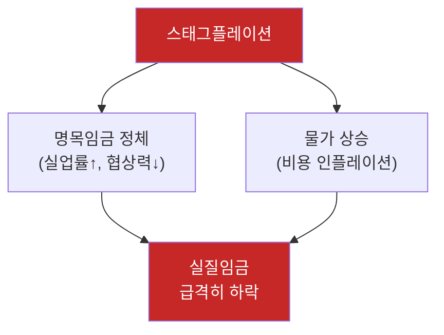
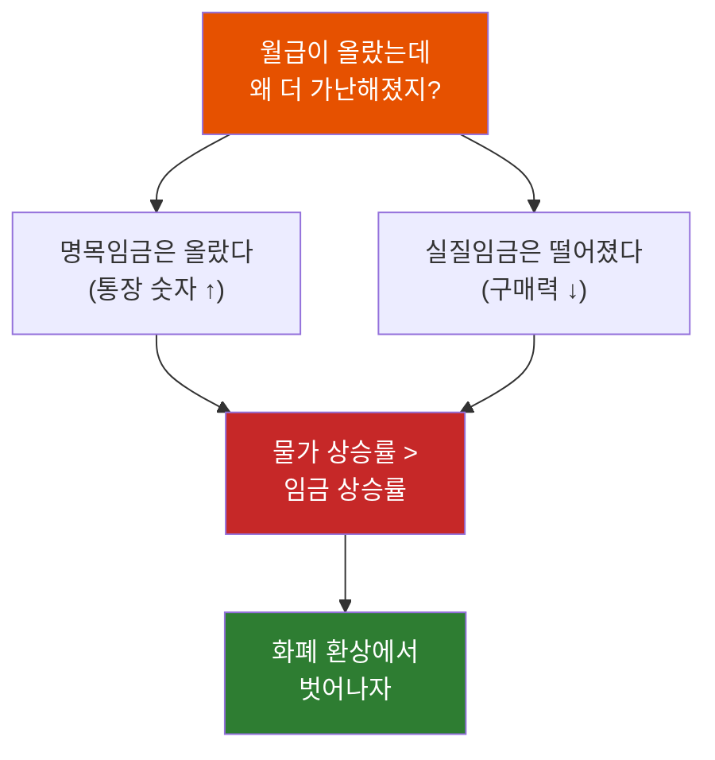

# 명목임금 vs 실질임금 - 월급이 올랐는데 왜 더 가난해졌을까?

"올해 연봉 5% 올랐어!" 기뻐하며 회식을 했다. 그런데 한 달 뒤, 마트에서 장을 보다가 이상한 느낌이 들었다. 분명 돈을 더 많이 버는데, 왜 카트에 담긴 물건은 줄어들었을까?

## 결론부터 말하면

**명목임금** 은 통장에 찍히는 숫자고, **실질임금** 은 그 돈으로 실제로 살 수 있는 물건의 양이다.

$$
\text{실질임금} = \frac{\text{명목임금}}{\text{물가수준}}
$$

월급이 올라도 물가가 더 빨리 오르면, **숫자는 커지지만 구매력은 줄어든다.** 이것이 "월급은 올랐는데 더 가난해진 느낌"의 정체다.


| 구분 | 의미 | 비유 |
|------|------|------|
| **명목임금** | 화폐 단위로 표시된 임금 | 자(ruler)의 눈금 |
| **실질임금** | 구매력으로 환산한 임금 | 실제로 잴 수 있는 길이 |

---

## 1. 왜 두 개념을 구분해야 할까?

### 1.1 착각의 시작

2020년, 철수의 월급은 300만원이었다. 당시 라면 한 봉지는 1,000원. 철수는 월급 전부를 라면에 쓴다면 3,000개를 살 수 있었다.

2024년, 철수는 승진했다. 월급이 330만원으로 올랐다! 10% 인상이다. 하지만 라면 가격도 올랐다. 이제 한 봉지에 1,500원. 철수가 월급 전부를 라면에 쓴다면?

```
2020년: 3,000,000원 ÷ 1,000원 = 3,000개
2024년: 3,300,000원 ÷ 1,500원 = 2,200개
```

**월급은 10% 올랐는데, 살 수 있는 라면은 27% 줄었다.**

### 1.2 화폐의 함정

여기서 핵심적인 의문이 생긴다. 왜 "330만원 > 300만원"인데 더 가난해진 걸까?

답은 간단하다. **돈의 가치가 고정되어 있지 않기 때문이다.**

화폐는 그 자체로 가치가 없다. 1만원짜리 지폐는 종이 조각일 뿐이다. 그 종이가 "1만원어치의 물건과 교환할 수 있다"는 약속이 있기에 가치를 갖는다. 그런데 물가가 오르면? 같은 1만원으로 교환할 수 있는 물건의 양이 줄어든다.


그래서 경제학자들은 두 가지 잣대를 만들었다:

- **명목임금**: 화폐 단위 그대로 측정 (숫자)
- **실질임금**: 구매력으로 환산하여 측정 (실제 가치)

---

## 2. 실질임금은 어떻게 계산할까?

### 2.1 기본 공식

$$
\text{실질임금} = \frac{\text{명목임금}}{\text{물가지수}} \times 100
$$

물가지수는 기준연도를 100으로 잡고, 현재 물가가 얼마나 올랐는지를 나타낸다. 실질임금 계산에는 주로 **소비자물가지수(CPI, Consumer Price Index)** 를 사용한다. CPI는 일반 가구가 구매하는 상품과 서비스의 가격 변동을 측정하므로, 실제 생활 구매력을 파악하는 데 가장 적합하다.

**예시:**
- 2020년 물가지수: 100 (기준연도)
- 2024년 물가지수: 150 (물가가 50% 상승)
- 2024년 명목임금: 330만원

$$
\text{2024년 실질임금} = \frac{330만원}{150} \times 100 = 220만원
$$

2020년 화폐가치로 환산하면, 330만원은 사실 220만원의 구매력밖에 없다.

### 2.2 임금 상승률 vs 물가 상승률

| 상황 | 결과 |
|------|------|
| 임금 상승률 > 물가 상승률 | 실질임금 ↑ (진짜 부자가 됨) |
| 임금 상승률 = 물가 상승률 | 실질임금 → (제자리) |
| 임금 상승률 < 물가 상승률 | 실질임금 ↓ (숫자만 커짐) |

---

## 3. 실제 사례: 화폐 환상

### 3.1 화폐 환상(Money Illusion)이란?

사람들은 명목 가치에 속기 쉽다. 이를 **화폐 환상** 이라고 한다.

> "연봉이 3,000만원에서 3,300만원으로 올랐어요!"

이 말을 들으면 대부분 "좋겠다"고 반응한다. 하지만 같은 기간 물가가 20% 올랐다면?

```
실질적으로는 3,300만원 ÷ 1.2 = 2,750만원
→ 실질임금은 오히려 250만원 감소
```

숫자의 증가에 현혹되어 실제 구매력 감소를 인지하지 못하는 것, 이것이 화폐 환상이다.

### 3.2 왜 위험한가?

화폐 환상에 빠지면:

1. **저축의 함정**: "작년보다 100만원 더 모았어!" → 실질 가치는 오히려 줄었을 수 있음
2. **연봉 협상 실패**: 물가 상승률을 고려하지 않고 "인상됐으니 됐다"고 만족
3. **투자 판단 오류**: 명목 수익률만 보고 실질 수익률(인플레이션 차감)을 무시

---

## 4. 심화: 경제학에서의 명목 vs 실질

### 4.1 피셔 방정식 (Fisher Equation)

명목과 실질의 구분은 임금뿐만 아니라 **금리** 에도 적용된다. 미국 경제학자 어빙 피셔(Irving Fisher)가 정립한 공식이다.

$$
i \approx r + \pi
$$

| 기호 | 의미 |
|------|------|
| $i$ | 명목금리 (은행이 제시하는 금리) |
| $r$ | 실질금리 (실제 구매력 증가분) |
| $\pi$ | 기대 인플레이션율 |

**예시:** 은행 예금 금리가 5%인데, 물가 상승률이 3%라면?

$$
r = i - \pi = 5\% - 3\% = 2\%
$$

실질금리는 2%다. 내 돈의 구매력은 1년에 2%만 늘어난다.

> **왜 중요한가?** 명목금리만 보고 "5%나 준다!"고 좋아하면 화폐 환상에 빠진 것이다. 물가 상승률이 6%면 실질금리는 -1%, 즉 **예금해도 돈의 가치가 줄어든다.**

### 4.2 필립스 곡선 (Phillips Curve)

1958년 영국 경제학자 윌리엄 필립스가 발견한 관계다. 처음에는 명목임금 상승률과 실업률 사이의 관계로 시작했다.


$$
\text{실업률} \downarrow \quad \Leftrightarrow \quad \text{인플레이션} \uparrow
$$

| 상황 | 실업률 | 인플레이션 | 실질임금 |
|------|--------|-----------|---------|
| 경기 호황 | 낮음 | 높음 | 불확실 (임금↑ vs 물가↑) |
| 경기 침체 | 높음 | 낮음 | 불확실 (임금↓ vs 물가↓) |

**핵심 통찰:** 정부가 실업률을 낮추려고 돈을 풀면 인플레이션이 생기고, 인플레이션을 잡으려고 긴축하면 실업률이 올라간다. 실질임금을 올리기가 쉽지 않은 이유다.

### 4.3 스태그플레이션 (Stagflation)

필립스 곡선의 **예외 상황** 이다. 'stagflation'이라는 용어는 1965년 영국 보수당 의원 **Iain Macleod**가 하원 연설에서 처음 사용했고, 1973년 오일 쇼크 이후 전 세계적으로 본격화되며 케인스주의 경제학의 한계를 드러냈다.

| 일반적 상황 | 스태그플레이션 |
|-------------|---------------|
| 경기 침체 → 물가 안정 | 경기 침체 + 물가 상승 |
| 경기 호황 → 물가 상승 | 실업↑ + 인플레이션↑ |

$$
\text{Stagflation} = \text{Stagnation (침체)} + \text{Inflation (인플레이션)}
$$

**왜 최악인가?** 실업률이 높아 명목임금 인상이 어려운데, 물가는 계속 오른다. 실질임금이 양쪽에서 공격받는 상황이다.



### 4.4 브래킷 크리프 (Bracket Creep)

화폐 환상의 또 다른 함정이다. **세금** 과 관련된 현상이다.

누진세 구조에서는 소득이 올라갈수록 높은 세율이 적용된다.

| 과세표준 | 세율 |
|----------|------|
| 1,400만원 이하 | 6% |
| 1,400만원 ~ 5,000만원 | 15% |
| 5,000만원 ~ 8,800만원 | 24% |
| 8,800만원 초과 | 35%+ |

**문제 상황:**

```
2020년: 연봉 4,800만원 → 15% 구간
2024년: 연봉 5,200만원 (8% 인상) → 24% 구간으로 진입!

물가 상승률: 10%
실질 소득: 오히려 감소
세금: 더 높은 구간 적용
```

명목 소득은 올랐지만, 실질 소득은 줄었는데, 세금은 더 내게 된다. 이중으로 손해다.

> **해결책:** 일부 국가에서는 세금 구간을 물가 상승률에 맞춰 자동 조정(indexation)한다. 한국은 아직 이 제도가 없어서 브래킷 크리프에 취약하다.

---

## 5. 정리



| 핵심 개념 | 설명 |
|-----------|------|
| **명목임금** | 화폐 단위로 표시된 임금. 통장에 찍히는 숫자. |
| **실질임금** | 물가를 반영한 실제 구매력. 진짜 생활 수준. |
| **화폐 환상** | 명목 가치 증가에 속아 실질 가치 하락을 인지 못하는 현상. |

**기억할 것:** 연봉 협상할 때, 저축 계획 세울 때, 투자 수익을 볼 때 — 항상 **"물가 상승률을 빼면 얼마지?"** 를 먼저 계산하자.

---

## 출처

- [한국은행 - 경기변동과 실업 (명목임금/실질임금 설명)](https://www.bok.or.kr/portal/bbs/B0000216/view.do?nttId=165653&type=PEPL&menuNo=200648)
- [KDI 경제교육 - 경제금융용어 700선](https://eiec.kdi.re.kr/policy/materialView.do?num=173885)
- [Investopedia - Real Wages](https://www.investopedia.com/terms/r/realincome.asp)
- [Wikipedia - Money Illusion](https://en.wikipedia.org/wiki/Money_illusion)
- [Wikipedia - Phillips Curve](https://en.wikipedia.org/wiki/Phillips_curve)
- [Wikipedia - Stagflation](https://en.wikipedia.org/wiki/Stagflation)
