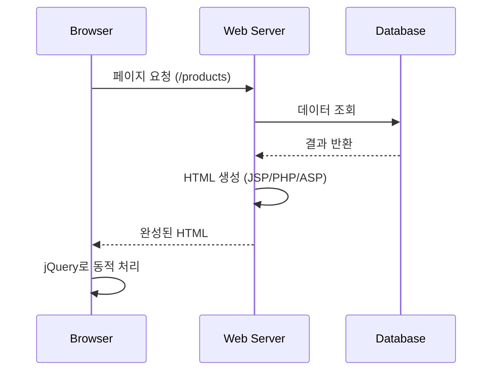
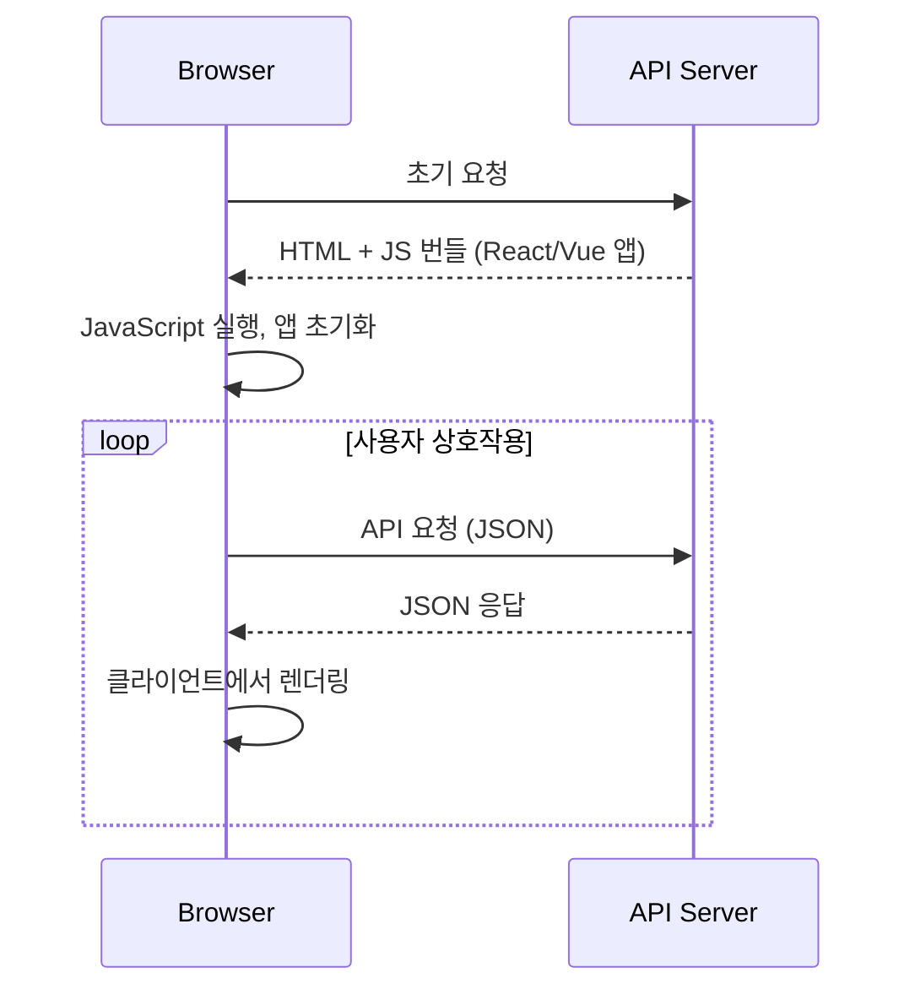
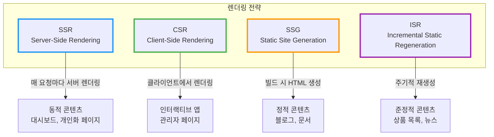
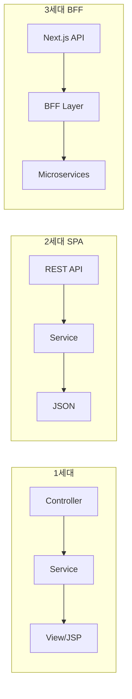

# 프론트엔드 개발의 변화

서버 사이드 렌더링(SSR) + jQuery 시대부터 SPA, 그리고 Next.js/Nuxt 같은 메타 프레임워크까지 프론트엔드 아키텍처의 진화 과정을 정리한다.

## 결론부터 말하면

프론트엔드 개발은 **서버 중심 → 클라이언트 중심 → 하이브리드**로 진화했다.

```
┌─────────────────────────────────────────────────────────────────┐
│  1세대: 서버 사이드 렌더링 (2000년대)                             │
│  Server → HTML 생성 → Browser 표시 → jQuery로 동적 처리          │
├─────────────────────────────────────────────────────────────────┤
│  2세대: SPA (2010년대)                                           │
│  Server → JSON API → Browser에서 React/Vue가 렌더링              │
├─────────────────────────────────────────────────────────────────┤
│  3세대: 메타 프레임워크 (2020년대)                                │
│  Next.js/Nuxt → SSR + CSR + SSG 하이브리드                       │
│  → 서버와 클라이언트의 장점을 모두 활용                            │
└─────────────────────────────────────────────────────────────────┘
```

**핵심 변화:**
- **렌더링 주체**: 서버 → 클라이언트 → 상황에 따라 선택
- **상태 관리**: 서버 세션 → 클라이언트 상태 → 서버/클라이언트 분산
- **개발 패러다임**: 페이지 단위 → 컴포넌트 단위 → 서버 컴포넌트까지

## 1. 1세대: 서버 사이드 렌더링 + jQuery (2000년대)

### 1.1 아키텍처



### 1.2 기술 스택

| 영역 | 기술 |
|------|------|
| 서버 템플릿 | JSP, PHP, ASP, Thymeleaf, FreeMarker |
| JavaScript | jQuery, Prototype.js, MooTools |
| CSS | 순수 CSS, 초기 Bootstrap |
| 통신 | Form 전송, Ajax (XMLHttpRequest) |

### 1.3 코드 예시

**JSP + jQuery 조합:**

```html
<%-- products.jsp --%>
<%@ page contentType="text/html;charset=UTF-8" %>
<html>
<head>
    <script src="jquery.min.js"></script>
</head>
<body>
    <h1>상품 목록</h1>
    <ul id="product-list">
        <% for (Product p : products) { %>
            <li class="product" data-id="<%= p.getId() %>">
                <%= p.getName() %> - <%= p.getPrice() %>원
                <button class="add-cart">장바구니</button>
            </li>
        <% } %>
    </ul>

    <script>
    $(document).ready(function() {
        $('.add-cart').click(function() {
            var productId = $(this).closest('.product').data('id');
            $.ajax({
                url: '/cart/add',
                method: 'POST',
                data: { productId: productId },
                success: function(response) {
                    alert('장바구니에 추가되었습니다');
                }
            });
        });
    });
    </script>
</body>
</html>
```

### 1.4 특징

**장점:**
- ✅ SEO 친화적 (완성된 HTML 제공)
- ✅ 초기 로딩 빠름 (서버에서 렌더링 완료)
- ✅ JavaScript 비활성화 시에도 동작
- ✅ 단순한 아키텍처

**단점:**
- ❌ 페이지 전환마다 전체 새로고침
- ❌ 서버 부하 증가 (매 요청마다 HTML 생성)
- ❌ 사용자 경험 제한 (깜빡임, 느린 반응)
- ❌ 프론트엔드/백엔드 코드 혼재
- ❌ jQuery 스파게티 코드 발생

**jQuery의 한계:**

```javascript
// DOM 직접 조작 → 상태 추적 어려움
$('#count').text(parseInt($('#count').text()) + 1);

// 이벤트 바인딩 중복
$('.btn').off('click').on('click', handler);

// 복잡한 UI에서 코드 관리 어려움
if ($('#modal').hasClass('active')) {
    $('#modal').removeClass('active');
    $('#overlay').hide();
    $('body').removeClass('no-scroll');
    // ... 수십 줄의 DOM 조작
}
```

## 2. 2세대: SPA와 컴포넌트 기반 라이브러리 (2010년대)

### 2.1 SPA(Single Page Application) 아키텍처



### 2.2 주요 라이브러리/프레임워크

```
2010 ─── Backbone.js (MVC 패턴 도입)
2010 ─── AngularJS (양방향 바인딩, DI)
2013 ─── React (Virtual DOM, 단방향 데이터 흐름)
2014 ─── Vue.js (React + Angular 장점 결합)
2016 ─── Angular (TypeScript 기반 재작성)
```

### 2.3 React 예시

**함수형 컴포넌트 + Hooks:**

```jsx
// ProductList.jsx
import { useState, useEffect } from 'react';

function ProductList() {
    const [products, setProducts] = useState([]);
    const [loading, setLoading] = useState(true);

    useEffect(() => {
        fetch('/api/products')
            .then(res => res.json())
            .then(data => {
                setProducts(data);
                setLoading(false);
            });
    }, []);

    const addToCart = async (productId) => {
        await fetch('/api/cart', {
            method: 'POST',
            body: JSON.stringify({ productId })
        });
        alert('장바구니에 추가되었습니다');
    };

    if (loading) return <div>로딩 중...</div>;

    return (
        <div>
            <h1>상품 목록</h1>
            <ul>
                {products.map(product => (
                    <li key={product.id}>
                        {product.name} - {product.price}원
                        <button onClick={() => addToCart(product.id)}>
                            장바구니
                        </button>
                    </li>
                ))}
            </ul>
        </div>
    );
}
```

### 2.4 Vue.js 예시

**Composition API:**

```html
<!-- ProductList.vue -->
<template>
    <div>
        <h1>상품 목록</h1>
        <div v-if="loading">로딩 중...</div>
        <ul v-else>
            <li v-for="product in products" :key="product.id">
                {{ product.name }} - {{ product.price }}원
                <button @click="addToCart(product.id)">장바구니</button>
            </li>
        </ul>
    </div>
</template>

<script setup>
import { ref, onMounted } from 'vue';

const products = ref([]);
const loading = ref(true);

onMounted(async () => {
    const res = await fetch('/api/products');
    products.value = await res.json();
    loading.value = false;
});

const addToCart = async (productId) => {
    await fetch('/api/cart', {
        method: 'POST',
        body: JSON.stringify({ productId })
    });
    alert('장바구니에 추가되었습니다');
};
</script>
```

### 2.5 jQuery vs React/Vue 비교

| 관점 | jQuery | React/Vue |
|------|--------|-----------|
| 패러다임 | 명령형 (어떻게 변경할지) | 선언형 (무엇을 보여줄지) |
| 상태 관리 | DOM이 상태 | JavaScript 객체가 상태 |
| 업데이트 | 직접 DOM 조작 | Virtual DOM 비교 후 최소 변경 |
| 구조 | 이벤트 핸들러 중심 | 컴포넌트 중심 |
| 재사용 | 플러그인 | 컴포넌트 |

**명령형 vs 선언형 비교:**

```javascript
// jQuery (명령형): "어떻게" 변경할지 지시
$('#count').text(count + 1);
if (count > 10) {
    $('#warning').show();
}

// React (선언형): "무엇"을 보여줄지 선언
function Counter({ count }) {
    return (
        <div>
            <span>{count}</span>
            {count > 10 && <Warning />}
        </div>
    );
}
```

### 2.6 SPA의 특징

**장점:**
- ✅ 부드러운 사용자 경험 (페이지 새로고침 없음)
- ✅ 컴포넌트 재사용성
- ✅ 프론트엔드/백엔드 분리 (API 기반)
- ✅ 상태 관리 용이
- ✅ 풍부한 에코시스템 (상태 관리, 라우팅 등)

**단점:**
- ❌ 초기 로딩 느림 (큰 JS 번들)
- ❌ SEO 어려움 (빈 HTML + JS 렌더링)
- ❌ JavaScript 필수
- ❌ 복잡한 빌드 설정

## 3. 3세대: 메타 프레임워크 (2020년대)

### 3.1 등장 배경

SPA의 문제점을 해결하면서 장점을 유지하기 위해 등장:

```
SPA 문제점                    메타 프레임워크 해결책
─────────────────────────────────────────────────────
초기 로딩 느림          →     SSR로 첫 페이지 빠르게
SEO 어려움              →     서버에서 HTML 생성
큰 번들 사이즈          →     코드 스플리팅, 자동 최적화
복잡한 설정             →     Zero-config, 컨벤션 기반
```

### 3.2 주요 메타 프레임워크

| 프레임워크 | 기반 | 특징 |
|-----------|------|------|
| **Next.js** | React | 가장 인기, Vercel 지원, App Router |
| **Nuxt** | Vue.js | Vue 생태계 통합, 자동 임포트 |
| **Remix** | React | 웹 표준 중심, 중첩 라우팅 |
| **SvelteKit** | Svelte | 컴파일 타임 최적화 |
| **Astro** | 다중 | 콘텐츠 중심, 아일랜드 아키텍처 |

### 3.3 렌더링 전략

메타 프레임워크는 **페이지별로 최적의 렌더링 방식 선택** 가능:



### 3.4 Next.js 예시 (App Router)

**서버 컴포넌트 (기본):**

```tsx
// app/products/page.tsx
// 서버에서 실행 - DB 직접 접근 가능
async function ProductsPage() {
    // 서버에서 데이터 페칭 (API 불필요)
    const products = await db.product.findMany();

    return (
        <div>
            <h1>상품 목록</h1>
            <ul>
                {products.map(product => (
                    <li key={product.id}>
                        {product.name} - {product.price}원
                        <AddToCartButton productId={product.id} />
                    </li>
                ))}
            </ul>
        </div>
    );
}
```

**클라이언트 컴포넌트:**

```tsx
// components/AddToCartButton.tsx
'use client';  // 클라이언트에서 실행

import { useState } from 'react';

export function AddToCartButton({ productId }: { productId: string }) {
    const [loading, setLoading] = useState(false);

    const handleClick = async () => {
        setLoading(true);
        await fetch('/api/cart', {
            method: 'POST',
            body: JSON.stringify({ productId })
        });
        setLoading(false);
        alert('장바구니에 추가되었습니다');
    };

    return (
        <button onClick={handleClick} disabled={loading}>
            {loading ? '추가 중...' : '장바구니'}
        </button>
    );
}
```

### 3.5 Nuxt 예시

```html
<!-- pages/products.vue -->
<template>
    <div>
        <h1>상품 목록</h1>
        <ul>
            <li v-for="product in products" :key="product.id">
                {{ product.name }} - {{ product.price }}원
                <button @click="addToCart(product.id)">장바구니</button>
            </li>
        </ul>
    </div>
</template>

<script setup>
// useFetch: SSR 시 서버에서, CSR 시 클라이언트에서 실행
const { data: products } = await useFetch('/api/products');

const addToCart = async (productId) => {
    await $fetch('/api/cart', {
        method: 'POST',
        body: { productId }
    });
    alert('장바구니에 추가되었습니다');
};
</script>
```

### 3.6 서버 컴포넌트 vs 클라이언트 컴포넌트

| 구분 | 서버 컴포넌트 | 클라이언트 컴포넌트 |
|------|--------------|-------------------|
| 실행 위치 | 서버 | 브라우저 |
| 데이터 접근 | DB, 파일시스템 직접 접근 | API 호출 필요 |
| 번들 크기 | JS 번들에 포함 안됨 | JS 번들에 포함 |
| 상태/이벤트 | useState, onClick 불가 | useState, onClick 사용 |
| 용도 | 데이터 페칭, 정적 UI | 인터랙티브 UI |

**사용 기준:**

```
서버 컴포넌트 사용:
├─ 데이터 페칭
├─ 백엔드 리소스 직접 접근
├─ 민감한 정보 (API 키 등)
└─ 정적 콘텐츠

클라이언트 컴포넌트 사용:
├─ 이벤트 핸들러 (onClick, onChange)
├─ 상태 관리 (useState, useReducer)
├─ 브라우저 API (localStorage, geolocation)
└─ React 훅 사용
```

## 4. Java 백엔드 개발자 관점

### 4.1 아키텍처 변화에 따른 백엔드 역할



### 4.2 Spring Boot 역할 변화

| 세대 | Spring Boot 역할 |
|------|-----------------|
| 1세대 | 풀스택 (Controller + View) |
| 2세대 | REST API 서버 |
| 3세대 | BFF 또는 마이크로서비스 |

**Spring Boot as REST API:**

```java
@RestController
@RequestMapping("/api/products")
public class ProductController {

    @GetMapping
    public List<ProductDto> getProducts() {
        return productService.findAll();
    }

    @PostMapping("/cart")
    public ResponseEntity<Void> addToCart(@RequestBody CartRequest request) {
        cartService.addProduct(request.getProductId());
        return ResponseEntity.ok().build();
    }
}
```

### 4.3 프론트엔드 협업 시 고려사항

**API 설계:**
- REST 또는 GraphQL
- 페이지네이션, 필터링 표준화
- 에러 응답 형식 통일
- CORS 설정

**문서화:**
- OpenAPI (Swagger) 스펙
- API 버저닝 전략

## 5. 기술 선택 가이드

### 5.1 프로젝트 유형별 추천

| 프로젝트 유형 | 추천 스택 | 이유 |
|--------------|----------|------|
| 마케팅 사이트 | Next.js (SSG) / Astro | SEO, 빠른 로딩 |
| 대시보드/관리자 | React + Vite | CSR로 충분, 빠른 개발 |
| 이커머스 | Next.js (ISR) | SEO + 동적 콘텐츠 |
| 블로그/문서 | Astro / Next.js (SSG) | 정적 콘텐츠 최적화 |
| 복잡한 웹앱 | Next.js / Remix | 풀스택 기능 |

### 5.2 React vs Vue.js

| 관점 | React | Vue.js |
|------|-------|--------|
| 학습 곡선 | 중간 (JSX, 훅) | 낮음 (템플릿, 직관적) |
| 유연성 | 높음 (라이브러리) | 중간 (프레임워크) |
| 생태계 | 가장 큼 | 큼 |
| 기업 채용 | 더 많음 | 많음 |
| TypeScript | 우수 | 우수 (Vue 3) |

## 6. 정리: 프론트엔드 아키텍처 진화

```
시기        아키텍처              렌더링        상태 관리
────────────────────────────────────────────────────────
2000년대    MPA + jQuery         서버          서버 세션
2010년대    SPA (React/Vue)      클라이언트    Redux/Vuex
2020년대    메타 프레임워크       하이브리드    서버/클라이언트 분산

핵심 트렌드:
├─ 서버 컴포넌트 (RSC): 서버와 클라이언트 경계 유연화
├─ 아일랜드 아키텍처: 정적 + 동적 부분 분리
├─ Edge 렌더링: CDN에서 동적 렌더링
└─ 스트리밍 SSR: 점진적 HTML 전송
```

## 출처

- [React 공식 문서](https://react.dev/)
- [Vue.js 공식 문서](https://vuejs.org/)
- [Next.js 공식 문서](https://nextjs.org/docs)
- [Nuxt 공식 문서](https://nuxt.com/docs)
- [Patterns.dev - Rendering Patterns](https://www.patterns.dev/react/rendering-patterns)
- [Web.dev - Rendering on the Web](https://web.dev/rendering-on-the-web/)
