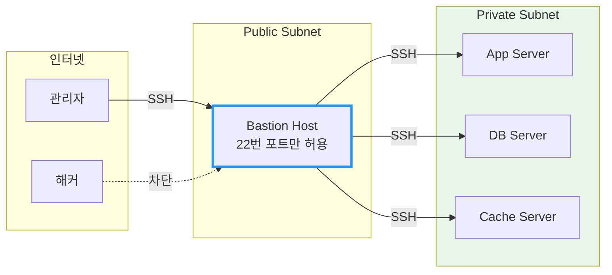
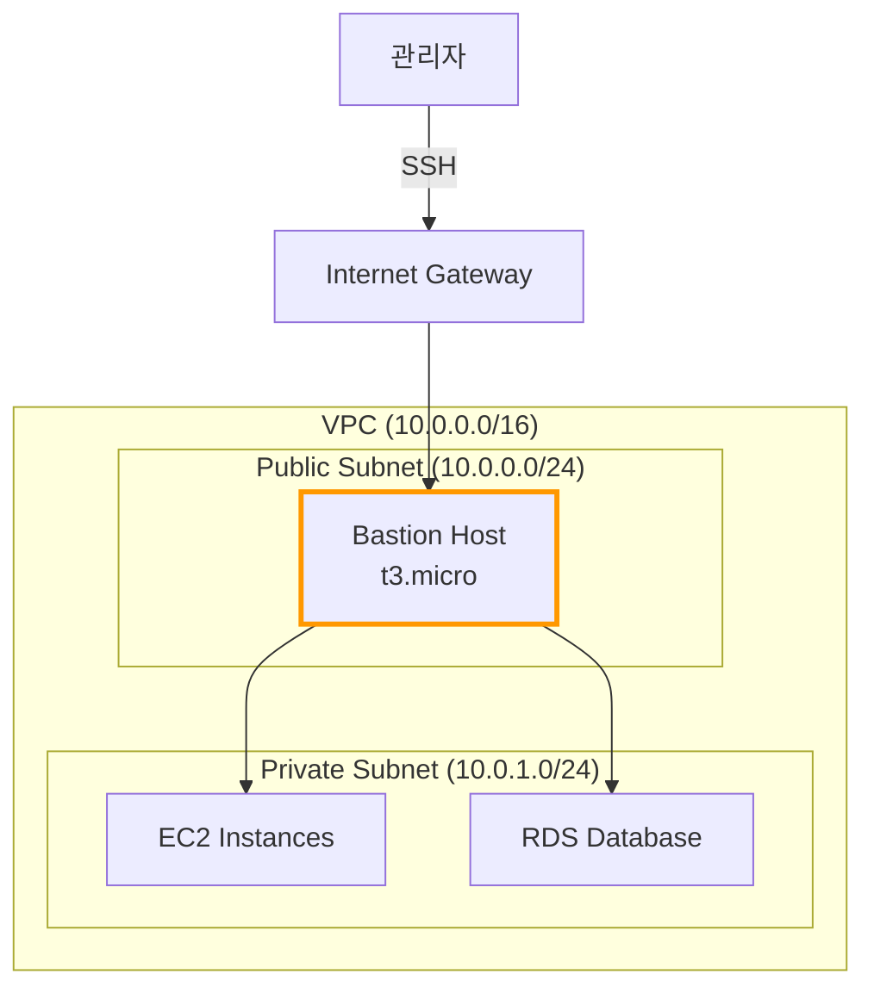
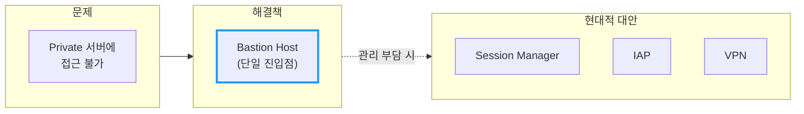

# Bastion Host

외부에서 프라이빗 네트워크 내부 서버에 안전하게 접근하기 위한 "관문" 서버

## 결론부터 말하면

**Bastion Host는 외부 인터넷과 내부 프라이빗 네트워크 사이에서 단일 진입점 역할을 하는 서버다.**

프라이빗 서브넷의 서버들은 인터넷에 직접 노출되지 않아 안전하지만, 관리자가 접근할 방법이 없다. Bastion Host는 이 문제를 해결한다.

```
인터넷 ─────▶ Bastion Host ─────▶ Private Server
(Public)      (Public Subnet)      (Private Subnet)
   │               │                     │
   └── SSH 22 ────►└──── SSH 22 ────────►│
       (허용)           (내부만 허용)
```

## 1. 왜 Bastion Host가 필요한가?

### 문제 상황: 보안과 접근성의 딜레마

클라우드에서 서비스를 운영한다고 가정해보자. 데이터베이스 서버, 애플리케이션 서버 등 핵심 서버들이 있다.

이 서버들을 인터넷에 직접 노출시키면 어떻게 될까?

- 전 세계 해커들의 SSH 브루트포스 공격 대상이 된다
- 취약점이 발견되면 즉시 침투당할 수 있다
- 보안 사고 시 피해 범위가 전체로 확산된다

그래서 **프라이빗 서브넷**에 서버를 배치한다. 인터넷에서 직접 접근이 불가능해 안전하다.

하지만 새로운 문제가 생긴다. **관리자도 접근할 수 없다!**

배포는 어떻게 하지? 로그는 어떻게 보지? 장애 대응은?

### 해결책: 단 하나의 문을 만들자

모든 서버에 문을 열어두는 대신, **단 하나의 출입문**만 만든다. 이것이 Bastion Host다.



## 2. Bastion Host의 특징

### 2.1 보안 강화 포인트

| 특징 | 설명 |
|------|------|
| **단일 진입점** | 모니터링과 감사가 한 곳에 집중됨 |
| **최소 권한** | SSH(22) 포트만 열고, 나머지는 모두 차단 |
| **접근 제어** | 특정 IP 대역에서만 접근 허용 가능 |
| **로깅** | 모든 접속 기록이 한 곳에 남음 |
| **Hardening** | 불필요한 서비스 제거, 최소한의 소프트웨어만 설치 |

### 2.2 "Bastion"이라는 이름의 유래

Bastion은 성벽에서 돌출된 "**돌출 방어 시설**"을 뜻한다. 중세 성곽에서 적의 공격을 방어하기 위해 만든 구조물이다.

네트워크 보안에서도 같은 의미다. 외부 공격으로부터 내부 네트워크를 보호하는 **최전방 방어선** 역할을 한다.

## 3. SSH 점프 호스트로 사용하기

Bastion Host는 **점프 호스트**(Jump Host)라고도 불린다. SSH로 "점프"해서 내부 서버에 도달하기 때문이다.

### 3.1 기본 방식: 2단계 SSH

```bash
# 1단계: Bastion에 접속
ssh -i bastion-key.pem ec2-user@bastion.example.com

# 2단계: Bastion에서 내부 서버로 접속
ssh -i private-key.pem ec2-user@10.0.1.100
```

불편하다. 매번 두 번씩 접속해야 한다.

### 3.2 ProxyJump: 한 번에 점프하기

SSH 설정 파일(`~/.ssh/config`)을 사용하면 한 번에 접속할 수 있다.

```ssh-config
# Bastion Host 정의
Host bastion
    HostName bastion.example.com
    User ec2-user
    IdentityFile ~/.ssh/bastion-key.pem

# Private 서버 (Bastion을 통해 접속)
Host app-server
    HostName 10.0.1.100
    User ec2-user
    IdentityFile ~/.ssh/private-key.pem
    ProxyJump bastion
```

이제 한 줄로 내부 서버에 접속한다:

```bash
ssh app-server  # 자동으로 bastion을 거쳐 접속
```

### 3.3 SSH Agent Forwarding

Private 키를 Bastion에 복사하지 않고도 내부 서버에 접속할 수 있다.

```bash
# 로컬에서 SSH Agent에 키 등록
ssh-add ~/.ssh/private-key.pem

# Agent Forwarding으로 접속
ssh -A -J bastion ec2-user@10.0.1.100
```

키가 Bastion 서버에 저장되지 않아 보안상 더 안전하다.

## 4. 클라우드별 Bastion Host 구성

### 4.1 AWS



**Security Group 설정:**

| 구분 | Inbound | Outbound |
|------|---------|----------|
| **Bastion SG** | SSH(22) from 관리자 IP | SSH(22) to Private Subnet |
| **Private SG** | SSH(22) from Bastion SG | 필요한 아웃바운드만 |

### 4.2 GCP

GCP에서는 **IAP**(Identity-Aware Proxy)를 통해 Bastion 없이도 접근 가능하지만, 전통적인 Bastion 구성도 가능하다.

```bash
# GCP에서 IAP 터널링 (Bastion 불필요)
gcloud compute ssh instance-name --tunnel-through-iap
```

### 4.3 Azure

Azure에서는 **Azure Bastion** 서비스를 제공한다. VM 형태가 아닌 PaaS 서비스로, 브라우저에서 직접 SSH/RDP 접속이 가능하다.

## 5. Bastion Host의 대안들

Bastion Host는 효과적이지만, 관리 오버헤드가 있다. 최근에는 다양한 대안이 등장했다.

| 방식 | 설명 | 장점 | 단점 |
|------|------|------|------|
| **AWS Session Manager** | SSH 없이 브라우저/CLI로 접속 | 22번 포트 불필요, IAM 통합 | AWS 종속 |
| **GCP IAP** | Identity-Aware Proxy | 제로 트러스트, 간편함 | GCP 종속 |
| **VPN** | 사설 네트워크 확장 | 전체 네트워크 접근 | 설정 복잡, 비용 |
| **Tailscale/Zerotier** | 메시 VPN | 간편한 설정 | 외부 서비스 의존 |

### 5.1 AWS Session Manager 예시

```bash
# Bastion 없이 Private 인스턴스에 직접 접속
aws ssm start-session --target i-0123456789abcdef0
```

Session Manager는 SSH 키 관리가 필요 없고, IAM으로 권한을 제어한다. 22번 포트를 열 필요도 없어 보안이 강화된다.

## 6. Bastion Host 운영 베스트 프랙티스

### 6.1 보안 강화

```bash
# 1. 불필요한 서비스 비활성화
sudo systemctl disable --now postfix
sudo systemctl disable --now avahi-daemon

# 2. SSH 설정 강화 (/etc/ssh/sshd_config)
PermitRootLogin no
PasswordAuthentication no
MaxAuthTries 3
ClientAliveInterval 300
ClientAliveCountMax 2
```

### 6.2 모니터링 필수 항목

| 항목 | 이유 |
|------|------|
| SSH 로그인 시도 | 브루트포스 공격 탐지 |
| 세션 명령어 기록 | 감사 추적(Audit Trail) |
| CPU/메모리 사용량 | 비정상 활동 탐지 |
| 아웃바운드 트래픽 | 데이터 유출 탐지 |

### 6.3 고가용성 고려

단일 Bastion Host는 **단일 장애점**(SPOF)이 될 수 있다. 중요한 환경에서는:

- 다중 AZ에 Bastion 배치
- Auto Scaling Group으로 자동 복구
- 또는 Session Manager 같은 관리형 서비스 사용

## 정리



Bastion Host는 **클라우드 네트워크 보안의 기본**이다. 단일 진입점을 통해 내부 네트워크를 보호하면서도 관리자 접근을 가능하게 한다.

다만, 최근에는 AWS Session Manager, GCP IAP 같은 관리형 서비스가 Bastion Host의 역할을 대체하고 있다. 새 프로젝트라면 이런 대안들도 검토해보자.

---

## 출처

- [AWS Bastion Host Architecture](https://docs.aws.amazon.com/ko_kr/mwaa/latest/userguide/tutorials-private-network-bastion.html)
- [GCP IAP for TCP forwarding](https://cloud.google.com/iap/docs/using-tcp-forwarding)
- [Azure Bastion Documentation](https://docs.microsoft.com/en-us/azure/bastion/)
