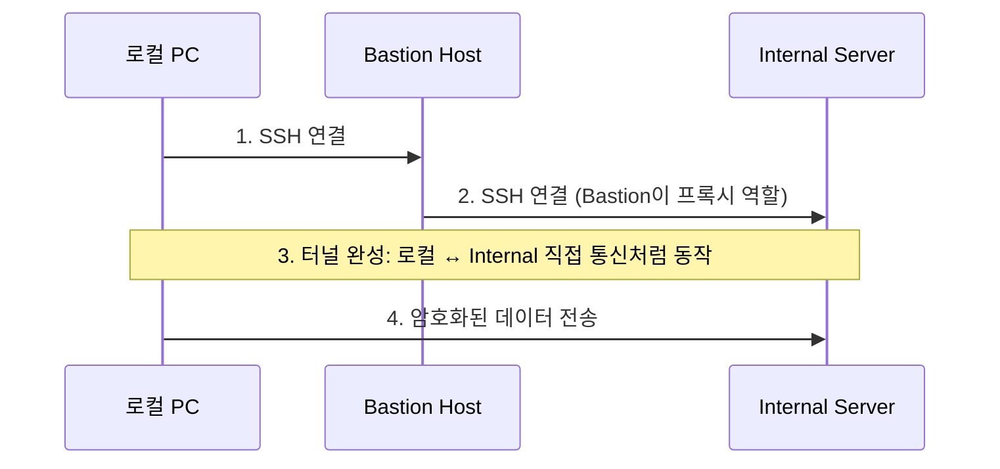
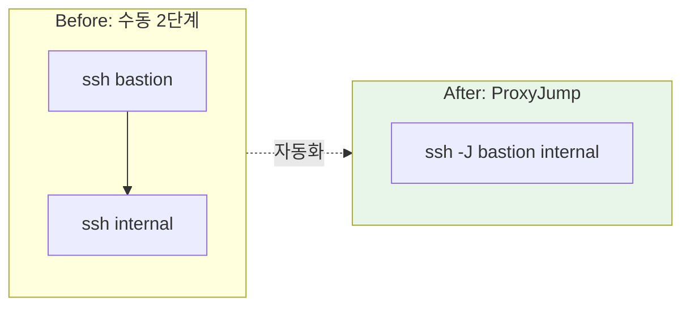

# SSH ProxyJump

중간 서버(점프 호스트)를 거쳐 최종 목적지 서버에 한 번에 접속하는 SSH 기능

## 결론부터 말하면

**ProxyJump는 SSH 접속 시 중간 서버를 자동으로 경유하게 해주는 OpenSSH의 기능이다.**

```bash
# Before: 2단계로 접속
ssh bastion          # 1단계
ssh internal-server  # 2단계 (bastion에서 실행)

# After: ProxyJump로 한 번에
ssh -J bastion internal-server
```

| 플랫폼 | 지원 여부 | 조건 |
|--------|----------|------|
| Linux | O | OpenSSH 7.3+ (2016년~) |
| macOS | O | 기본 지원 |
| Windows 10/11 | O | 1803 버전 이상 (OpenSSH 내장) |
| PuTTY | △ | 직접 지원 안 함, 우회 방법 존재 |

## 1. 왜 ProxyJump가 필요한가?

### 문제: Bastion Host 접속의 번거로움

Bastion Host를 사용하면 보안은 좋아지지만, 접속이 귀찮아진다.

```bash
# 매번 이렇게 해야 한다
$ ssh -i bastion-key.pem ec2-user@bastion.example.com
[bastion]$ ssh -i private-key.pem ec2-user@10.0.1.100
[internal]$ # 드디어 도착
```

파일을 복사하려면? 더 복잡하다.

```bash
# 로컬 → Bastion → Internal로 파일 복사
scp file.txt bastion:~/           # 로컬 → Bastion
ssh bastion                        # Bastion 접속
scp file.txt internal:~/           # Bastion → Internal
```

이런 번거로움을 해결하기 위해 **ProxyJump**가 등장했다.

### 해결: 한 줄로 끝

```bash
# 한 번에 Internal 서버 접속
ssh -J bastion internal-server

# 파일 복사도 한 번에
scp -J bastion file.txt internal-server:~/
```

## 2. ProxyJump의 동작 원리

ProxyJump는 SSH 터널링을 자동화한 것이다.



핵심은 **Bastion이 단순 경유지 역할**만 한다는 것이다. 실제 SSH 세션은 로컬과 Internal 서버 사이에 end-to-end로 암호화된다.

## 3. 사용 방법

### 3.1 명령줄에서 직접 사용

```bash
# 기본 형식
ssh -J <jump-host> <target-host>

# 예시: bastion.example.com을 거쳐 10.0.1.100에 접속
ssh -J ec2-user@bastion.example.com ec2-user@10.0.1.100

# 다른 포트 사용 시
ssh -J ec2-user@bastion.example.com:2222 ec2-user@10.0.1.100

# 여러 점프 호스트 경유 (콤마로 구분)
ssh -J jump1,jump2,jump3 target-server
```

### 3.2 SSH Config 파일 설정 (권장)

매번 긴 명령어를 치는 건 비효율적이다. `~/.ssh/config` 파일에 설정하자.

```ssh-config
# Bastion Host 정의
Host bastion
    HostName bastion.example.com
    User ec2-user
    IdentityFile ~/.ssh/bastion-key.pem

# Internal 서버 (ProxyJump 사용)
Host app-server
    HostName 10.0.1.100
    User ec2-user
    IdentityFile ~/.ssh/app-key.pem
    ProxyJump bastion

Host db-server
    HostName 10.0.1.200
    User ec2-user
    IdentityFile ~/.ssh/db-key.pem
    ProxyJump bastion
```

이제 간단하게 접속한다:

```bash
ssh app-server  # 자동으로 bastion 경유
ssh db-server   # 마찬가지
```

### 3.3 다중 점프 설정

여러 네트워크를 거쳐야 하는 경우:

```ssh-config
Host jump1
    HostName jump1.example.com
    User admin

Host jump2
    HostName 192.168.1.100
    User admin
    ProxyJump jump1

Host final-target
    HostName 172.16.0.50
    User deploy
    ProxyJump jump2
```

```bash
ssh final-target  # jump1 → jump2 → final-target 자동 경유
```

## 4. 플랫폼별 지원 현황

### 4.1 Linux / macOS

기본적으로 OpenSSH가 설치되어 있고, 대부분 7.3 이상이다.

```bash
# 버전 확인
ssh -V
# OpenSSH_9.0p1, LibreSSL 3.3.6  (macOS 예시)
```

### 4.2 Windows

**Windows 10 버전 1803 이상**에서는 OpenSSH가 기본 내장되어 있다.

```powershell
# PowerShell에서 버전 확인
ssh -V

# 만약 없다면 설치
Add-WindowsCapability -Online -Name OpenSSH.Client
```

CMD나 PowerShell에서 Linux/macOS와 동일하게 사용한다:

```powershell
ssh -J bastion internal-server
```

Config 파일 위치는 `C:\Users\<username>\.ssh\config`이다.

### 4.3 PuTTY

PuTTY는 ProxyJump를 직접 지원하지 않는다. 대신 **Plink**를 프록시 명령으로 사용하는 우회 방법이 있다.

```
Connection → Proxy → Proxy type: Local
Telnet command: plink -agent -l %user %proxyhost -nc %host:%port
```

하지만 복잡하므로, Windows에서는 **기본 OpenSSH 사용을 권장**한다.

## 5. ProxyJump vs 과거 방식 비교

### 5.1 ProxyCommand (구 방식)

ProxyJump 이전에는 `ProxyCommand`를 사용했다.

```ssh-config
# 구 방식: ProxyCommand
Host internal
    HostName 10.0.1.100
    ProxyCommand ssh -W %h:%p bastion

# 신 방식: ProxyJump (더 간결)
Host internal
    HostName 10.0.1.100
    ProxyJump bastion
```

| 비교 | ProxyCommand | ProxyJump |
|------|--------------|-----------|
| 도입 시기 | OpenSSH 5.4 (2010) | OpenSSH 7.3 (2016) |
| 문법 | 복잡 | 간결 |
| 다중 점프 | 중첩 필요 | 콤마로 나열 |
| 권장 | 레거시 환경 | 현재 표준 |

### 5.2 SSH Agent Forwarding과의 차이

| 방식 | 설명 | 키 위치 |
|------|------|---------|
| **ProxyJump** | Bastion을 경유해서 접속 | 로컬에만 키 보관 |
| **Agent Forwarding** | Bastion에서 로컬 키 사용 | 로컬에만 키 보관 (에이전트 전달) |

둘은 함께 사용할 수 있다:

```bash
# ProxyJump + Agent Forwarding
ssh -A -J bastion internal-server
```

## 6. 실전 활용 예시

### 6.1 SCP로 파일 복사

```bash
# 로컬 → Internal 서버
scp -J bastion ./deploy.tar.gz app-server:/opt/

# Internal 서버 → 로컬
scp -J bastion app-server:/var/log/app.log ./
```

### 6.2 포트 포워딩

Internal 서버의 DB에 로컬에서 접속하고 싶을 때:

```bash
# Internal 서버(10.0.1.100)의 PostgreSQL(5432)을 로컬 5432로 포워딩
ssh -J bastion -L 5432:localhost:5432 db-server -N

# 이제 로컬에서 접속 가능
psql -h localhost -p 5432 -U postgres
```

### 6.3 VS Code Remote SSH

VS Code에서도 ProxyJump를 사용할 수 있다. `~/.ssh/config` 설정만 해두면 Remote-SSH 확장이 자동으로 인식한다.

```ssh-config
Host internal-dev
    HostName 10.0.1.100
    User developer
    ProxyJump bastion
```

VS Code → Remote-SSH → `internal-dev` 선택 → Bastion 거쳐 자동 접속

## 7. 주의사항 및 트러블슈팅

### 7.1 키 파일 권한

```bash
# 키 파일 권한이 너무 열려있으면 거부됨
chmod 600 ~/.ssh/*.pem
chmod 700 ~/.ssh
```

### 7.2 Known Hosts 문제

처음 접속 시 fingerprint 확인 프롬프트가 두 번 뜬다 (Bastion, Internal 각각).

```bash
# 자동 승인 (테스트 환경에서만!)
ssh -o StrictHostKeyChecking=no -J bastion internal
```

### 7.3 타임아웃 설정

긴 작업 시 연결이 끊기지 않도록:

```ssh-config
Host *
    ServerAliveInterval 60
    ServerAliveCountMax 3
```

## 정리



ProxyJump는 **Bastion Host 환경에서 필수적인 SSH 기능**이다. 한 번 설정해두면 내부 서버 접속이 외부 서버 접속처럼 간편해진다.

- OpenSSH 7.3+ 필요 (대부분의 현대 OS에서 지원)
- Windows 10 1803 이상에서도 사용 가능
- `~/.ssh/config`에 설정해두면 `ssh 서버명`으로 바로 접속

---

## 출처

- [OpenSSH 7.3 Release Notes](https://www.openssh.com/txt/release-7.3)
- [SSH ProxyJump - Gentoo Wiki](https://wiki.gentoo.org/wiki/SSH_jump_host)
- [Microsoft - OpenSSH in Windows](https://docs.microsoft.com/en-us/windows-server/administration/openssh/openssh_install_firstuse)
