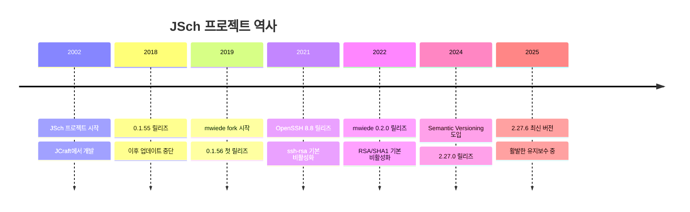
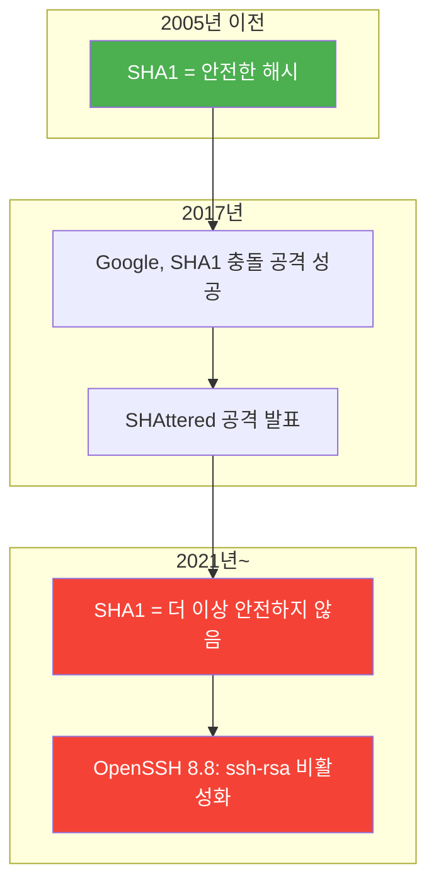
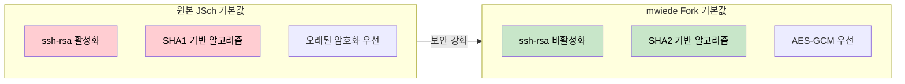

# JSch-Java SSH 라이브러리의 진화

Java에서 SSH/SFTP 연결을 구현할 때 가장 많이 사용되는 JSch 라이브러리의 역사, 원본 프로젝트의 중단, 그리고 mwiede fork가 왜 필요해졌는지를 살펴본다.

## 결론부터 말하면

**원본 JSch(com.jcraft:jsch)**는 2018년 0.1.55 버전을 마지막으로 업데이트가 중단되었다. 문제는 2021년 OpenSSH 8.8이 보안상의 이유로 `ssh-rsa`(SHA1 기반)를 기본 비활성화하면서 발생했다. 원본 JSch는 새로운 `rsa-sha2-256/512` 알고리즘을 지원하지 않아 많은 서버에 접속할 수 없게 되었다.

**mwiede/jsch fork**는 이 문제를 해결하고, 현재 2.27.x 버전까지 활발하게 유지보수되고 있다. Drop-in replacement로 설계되어 의존성만 교체하면 기존 코드 수정 없이 사용할 수 있다.

```xml
<!-- Before: 더 이상 업데이트되지 않는 원본 -->
<dependency>
    <groupId>com.jcraft</groupId>
    <artifactId>jsch</artifactId>
    <version>0.1.55</version>
</dependency>

<!-- After: 활발하게 유지보수되는 fork -->
<dependency>
    <groupId>com.github.mwiede</groupId>
    <artifactId>jsch</artifactId>
    <version>2.27.6</version>
</dependency>
```

## 1. JSch란 무엇인가?

JSch(Java Secure Channel)는 SSH2 프로토콜을 순수 Java로 구현한 라이브러리다. 2002년경 JCraft의 atsuhiko yamanaka가 개발을 시작했으며, 다음과 같은 기능을 제공한다:

- **SSH 연결**: 원격 서버에 보안 연결
- **SFTP**: SSH를 통한 파일 전송
- **포트 포워딩**: 로컬/리모트 포트 터널링
- **SCP**: Secure Copy Protocol
- **Exec/Shell**: 원격 명령 실행

### 왜 JSch를 사용하는가?

Java 표준 라이브러리에는 SSH 클라이언트가 없다. 서버에 SSH로 접속해서 파일을 업로드하거나 명령을 실행해야 하는 상황에서 JSch는 거의 유일한 선택지였다.

```java
// 기본적인 JSch 사용 예시
JSch jsch = new JSch();
Session session = jsch.getSession("username", "host.example.com", 22);
session.setPassword("password");
session.setConfig("StrictHostKeyChecking", "no");
session.connect();

// SFTP 채널 열기
ChannelSftp sftp = (ChannelSftp) session.openChannel("sftp");
sftp.connect();
sftp.put("/local/file.txt", "/remote/file.txt");
sftp.disconnect();
session.disconnect();
```

## 2. 무슨 일이 있었나? - 원본 JSch의 중단

### 타임라인



### 원본 JSch가 멈춘 이유

정확한 이유는 공식적으로 발표된 적이 없다. SourceForge에서 호스팅되던 원본 프로젝트는 2018년 이후 커밋이 없고, 메일링 리스트도 비활성화되었다. 오픈소스 프로젝트에서 흔히 볼 수 있는 메인테이너 번아웃이나 우선순위 변경으로 추정된다.

문제는 SSH 프로토콜과 암호화 알고리즘은 계속 발전하고 있다는 것이다. 보안 취약점이 발견되면 패치가 필요하고, OpenSSH가 새로운 알고리즘을 도입하면 클라이언트도 따라가야 한다.

## 3. 결정적 사건: OpenSSH 8.8

2021년 9월, OpenSSH 8.8이 릴리즈되면서 큰 변화가 발생했다.

### SHA1의 몰락



`ssh-rsa`는 RSA 키와 SHA1 해시를 조합한 서명 알고리즘이다. SHA1의 보안성이 무너지면서 OpenSSH는 이를 기본 비활성화했다.

### 원본 JSch 사용자들의 문제

```
2021년 어느 날...

개발자: "서버 배포 스크립트가 갑자기 안 돌아가네?"

에러: com.jcraft.jsch.JSchException:
      Algorithm negotiation fail

개발자: "서버는 변한 게 없는데... 아, 서버 SSH가 업데이트됐구나"
개발자: "JSch가 rsa-sha2-256을 지원 안 하네..."
개발자: "근데 JSch 업데이트는 3년째 없잖아?!"
```

이 시점에서 선택지는 세 가지였다:
1. 서버 SSH 설정을 낮춰서 ssh-rsa 다시 활성화 (보안 위험)
2. JSch 대신 다른 라이브러리 사용 (코드 대량 수정 필요)
3. mwiede fork 사용 (Drop-in replacement)

## 4. mwiede Fork의 등장

### 왜 Fork를 시작했나?

mwiede는 자신의 블로그에서 fork를 시작한 이유를 다음과 같이 설명했다:

> "OpenSSH가 ssh-rsa를 비활성화했고, rsa-sha2-256과 rsa-sha2-512를 지원하는 라이브러리가 필요했다. 원본 JSch는 더 이상 유지보수되지 않고 있었다."

### Fork의 설계 철학

1. **Drop-in replacement**: 패키지명(`com.jcraft.jsch`)을 그대로 유지해서 코드 수정 없이 교체 가능
2. **OpenJDK 기능 활용**: 외부 의존성 최소화, JDK 내장 암호화 API 우선 사용
3. **OpenSSH와 동기화**: OpenSSH의 기본 설정을 따름

### 버전 체계의 변화

```
0.1.55 (원본 마지막)
   ↓
0.1.56 ~ 0.2.26 (fork 초기)
   ↓
2.27.0 ~ (Semantic Versioning 도입)
```

0.2.26까지는 원본의 버전 체계를 따랐지만, 2.27.0부터는 Semantic Versioning으로 전환했다. 이는 "API가 안정화되었고 프로덕션에서 사용해도 된다"는 의미다.

## 5. 주요 변경사항 상세

### 5.1 지원 알고리즘 비교

| 카테고리 | 원본 JSch (0.1.55) | mwiede Fork (2.27.x) |
|---------|-------------------|---------------------|
| **RSA 서명** | ssh-rsa (SHA1) | rsa-sha2-256, rsa-sha2-512 (기본) |
| **키 교환** | diffie-hellman-group14-sha1 | curve25519-sha256, ecdh-sha2-nistp256/384/521, ML-KEM (포스트 양자) |
| **암호화** | aes128-ctr, aes192-ctr, aes256-ctr | aes128-gcm, aes256-gcm, chacha20-poly1305 |
| **MAC** | hmac-sha1, hmac-sha2-256 | hmac-sha2-256-etm, hmac-sha2-512-etm |
| **EdDSA** | 미지원 | ssh-ed25519, ssh-ed448 |

### 5.2 보안 기본값 강화



### 5.3 CVE 패치

| CVE | 설명 | 패치 버전 |
|-----|------|----------|
| CVE-2023-48795 | Terrapin Attack - SSH 핸드셰이크 취약점 | 0.2.15 |

원본 JSch를 사용한다면 이 CVE에 대한 패치를 받을 수 없다.

### 5.4 Multi-Release JAR

mwiede fork는 Multi-Release JAR로 배포된다. 이는 Java 버전에 따라 다른 구현을 사용할 수 있게 해준다.

```
jsch.jar
├── META-INF/
│   └── versions/
│       ├── 11/    # Java 11+ 전용 구현
│       └── 15/    # Java 15+ 전용 구현 (EdDSA)
└── com/jcraft/jsch/  # 기본 구현 (Java 8)
```

- **Java 8**: 기본 구현
- **Java 11+**: curve25519-sha256, curve448-sha512
- **Java 15+**: ssh-ed25519, ssh-ed448 (JEP 339 EdDSA)

## 6. 마이그레이션 가이드

### 6.1 기본 마이그레이션

가장 간단한 경우, `pom.xml`만 수정하면 된다:

```xml
<!-- 변경 전 -->
<dependency>
    <groupId>com.jcraft</groupId>
    <artifactId>jsch</artifactId>
    <version>0.1.55</version>
</dependency>

<!-- 변경 후 -->
<dependency>
    <groupId>com.github.mwiede</groupId>
    <artifactId>jsch</artifactId>
    <version>2.27.6</version>
</dependency>
```

### 6.2 전이 의존성 처리

다른 라이브러리가 원본 JSch를 전이 의존성으로 가져오는 경우:

```xml
<dependency>
    <groupId>com.github.mwiede</groupId>
    <artifactId>jsch</artifactId>
    <version>2.27.6</version>
</dependency>

<!-- 원본 JSch를 사용하는 라이브러리 -->
<dependency>
    <groupId>some.library</groupId>
    <artifactId>uses-jsch</artifactId>
    <exclusions>
        <exclusion>
            <groupId>com.jcraft</groupId>
            <artifactId>jsch</artifactId>
        </exclusion>
    </exclusions>
</dependency>
```

### 6.3 오래된 서버 연결 시

0.2.0부터 `ssh-rsa`가 기본 비활성화되어 있다. 오래된 서버에 연결해야 한다면 명시적으로 활성화해야 한다:

```java
// 방법 1: 세션별 설정
Session session = jsch.getSession("user", "old-server.com", 22);
session.setConfig("server_host_key",
    session.getConfig("server_host_key") + ",ssh-rsa");
session.setConfig("PubkeyAcceptedAlgorithms",
    session.getConfig("PubkeyAcceptedAlgorithms") + ",ssh-rsa");

// 방법 2: 전역 설정
JSch.setConfig("server_host_key",
    JSch.getConfig("server_host_key") + ",ssh-rsa");
JSch.setConfig("PubkeyAcceptedAlgorithms",
    JSch.getConfig("PubkeyAcceptedAlgorithms") + ",ssh-rsa");

// 방법 3: 시스템 프로퍼티 (애플리케이션 시작 시)
System.setProperty("jsch.server_host_key", "...,ssh-rsa");
System.setProperty("jsch.client_pubkey", "...,ssh-rsa");
```

### 6.4 선택적 의존성

일부 알고리즘은 Bouncy Castle이 필요하다:

| 알고리즘 | Java 버전 요구사항 | Bouncy Castle 필요 |
|---------|-------------------|-------------------|
| ssh-ed25519 | Java 15+ 또는 BC | Java 14 이하일 때 |
| curve25519-sha256 | Java 11+ 또는 BC | Java 10 이하일 때 |
| chacha20-poly1305 | - | 항상 필요 |

```xml
<!-- Bouncy Castle 추가 (필요한 경우) -->
<dependency>
    <groupId>org.bouncycastle</groupId>
    <artifactId>bcprov-jdk18on</artifactId>
    <version>1.78</version>
</dependency>
```

## 7. 실전 사용 예시

### 7.1 SFTP 파일 업로드

```java
public class SftpExample {
    public void uploadFile(String host, String user, String password,
                          String localPath, String remotePath) throws JSchException, SftpException {
        JSch jsch = new JSch();
        Session session = null;
        ChannelSftp sftp = null;

        try {
            session = jsch.getSession(user, host, 22);
            session.setPassword(password);

            // 호스트 키 검증 설정
            session.setConfig("StrictHostKeyChecking", "no");

            session.connect(30000); // 30초 타임아웃

            sftp = (ChannelSftp) session.openChannel("sftp");
            sftp.connect();

            sftp.put(localPath, remotePath);

        } finally {
            if (sftp != null && sftp.isConnected()) {
                sftp.disconnect();
            }
            if (session != null && session.isConnected()) {
                session.disconnect();
            }
        }
    }
}
```

### 7.2 공개키 인증

```java
public class PublicKeyAuthExample {
    public Session connectWithPublicKey(String host, String user,
                                        String privateKeyPath) throws JSchException {
        JSch jsch = new JSch();

        // 개인키 추가
        jsch.addIdentity(privateKeyPath);
        // 또는 암호화된 키: jsch.addIdentity(privateKeyPath, passphrase);

        Session session = jsch.getSession(user, host, 22);
        session.setConfig("StrictHostKeyChecking", "no");
        session.connect();

        return session;
    }
}
```

### 7.3 원격 명령 실행

```java
public class RemoteExecExample {
    public String executeCommand(Session session, String command)
            throws JSchException, IOException {
        ChannelExec channel = (ChannelExec) session.openChannel("exec");
        channel.setCommand(command);

        ByteArrayOutputStream outputStream = new ByteArrayOutputStream();
        channel.setOutputStream(outputStream);

        channel.connect();

        // 명령 완료 대기
        while (!channel.isClosed()) {
            try {
                Thread.sleep(100);
            } catch (InterruptedException e) {
                Thread.currentThread().interrupt();
            }
        }

        channel.disconnect();
        return outputStream.toString(StandardCharsets.UTF_8);
    }
}
```

### 7.4 포트 포워딩 (SSH 터널)

```java
public class PortForwardingExample {
    public void createLocalPortForward(Session session) throws JSchException {
        // localhost:3306 -> remote-db-server:3306 터널링
        // 로컬에서 localhost:13306으로 접속하면 원격 DB에 연결됨
        int assignedPort = session.setPortForwardingL(13306, "remote-db-server", 3306);
        System.out.println("Port forwarding established on port: " + assignedPort);
    }
}
```

## 8. 트러블슈팅

### 8.1 Algorithm negotiation fail

```
com.jcraft.jsch.JSchException: Algorithm negotiation fail
```

**원인**: 클라이언트와 서버 간 공통 알고리즘이 없음

**해결**:
```java
// 디버그 로깅 활성화
JSch.setLogger(new Logger() {
    @Override
    public boolean isEnabled(int level) { return true; }
    @Override
    public void log(int level, String message) {
        System.out.println(message);
    }
});
```

로그에서 어떤 알고리즘이 협상에 실패했는지 확인하고, 필요한 알고리즘을 활성화한다.

### 8.2 Auth fail

```
com.jcraft.jsch.JSchException: Auth fail
```

**체크리스트**:
1. 비밀번호/키 파일 경로 확인
2. 서버의 `sshd_config`에서 허용된 인증 방식 확인
3. 키 파일 권한 확인 (600이어야 함)

### 8.3 연결 타임아웃

```java
// 타임아웃 설정
session.connect(30000);  // 연결 타임아웃 30초

// 채널 타임아웃
channel.connect(10000);  // 채널 연결 타임아웃 10초
```

## 9. 대안 라이브러리

JSch 외에도 Java SSH 라이브러리가 있다. 각각 장단점이 있으므로 요구사항에 따라 선택하면 된다.

| 라이브러리 | 특징 | GitHub Stars |
|-----------|------|--------------|
| **mwiede/jsch** | Drop-in replacement, 가장 넓은 호환성 | ~500 |
| **Apache MINA SSHD** | Apache 재단, 서버/클라이언트 모두 지원 | ~800 |
| **sshj** | 현대적 API, Bouncy Castle 기반 | ~2,400 |

### 언제 어떤 것을 선택하나?

- **기존 JSch 코드가 있다면**: mwiede/jsch (마이그레이션 비용 최소)
- **새 프로젝트, 클라이언트만 필요**: sshj (깔끔한 API)
- **서버 구현도 필요**: Apache MINA SSHD

## 10. 정리

JSch는 Java SSH 라이브러리의 사실상 표준이었지만, 원본 프로젝트의 중단으로 보안 위협에 노출되었다. mwiede fork는 이 문제를 해결하고 현대적인 암호화 알고리즘을 지원하면서도 기존 코드와의 호환성을 유지한다.

**핵심 포인트**:
- 원본 JSch(com.jcraft:jsch) 0.1.55는 더 이상 사용하지 말 것
- mwiede/jsch(com.github.mwiede:jsch)로 마이그레이션 권장
- 패키지명이 같아서 의존성만 교체하면 됨
- ssh-rsa가 기본 비활성화되어 있으므로 오래된 서버 연결 시 주의

## 출처

- [mwiede/jsch GitHub](https://github.com/mwiede/jsch) - Fork 공식 저장소
- [mwiede 블로그 - The future of JSch](http://www.matez.de/index.php/2020/06/22/the-future-of-jsch-without-ssh-rsa/) - Fork 시작 배경
- [OpenSSH 8.8 Release Notes](https://www.openssh.com/txt/release-8.8) - ssh-rsa 비활성화 공지
- [JSch Wiki - Configuration](https://github.com/mwiede/jsch/wiki/Jsch-Configuration) - 설정 가이드
- [RFC 8332](https://datatracker.ietf.org/doc/html/rfc8332) - rsa-sha2-256/512 명세
- [CVE-2023-48795](https://nvd.nist.gov/vuln/detail/CVE-2023-48795) - Terrapin Attack
