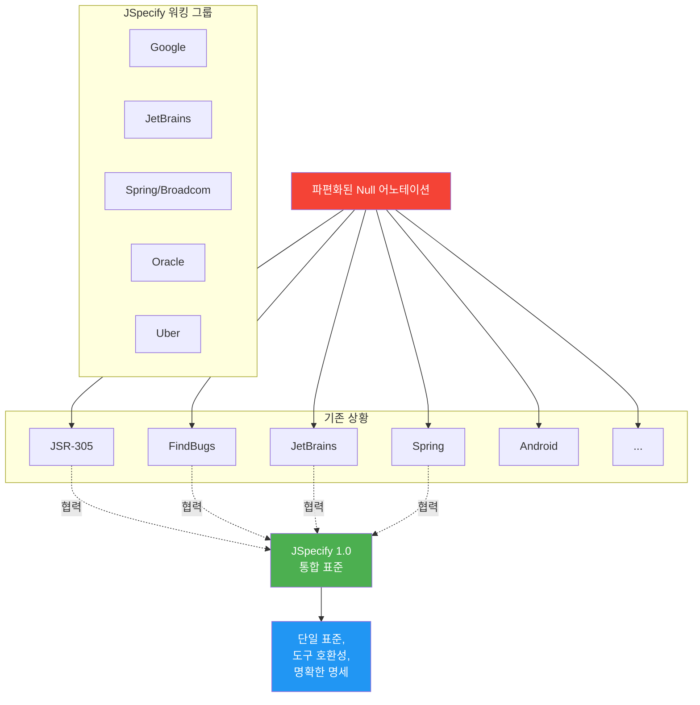
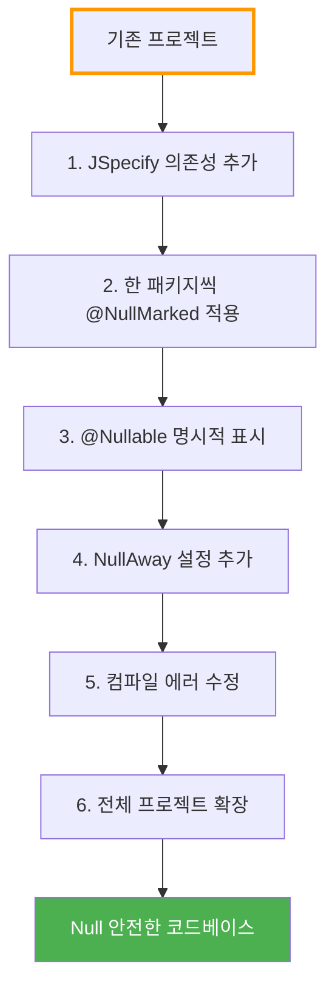
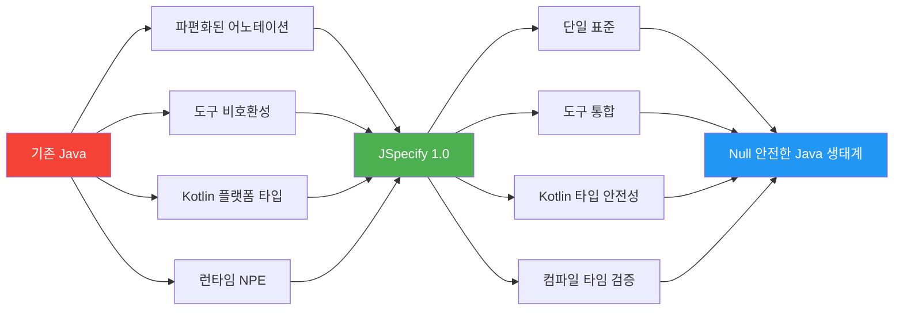

# JSpecify - Java의 Null 안전성 표준

Spring Boot 4.0과 함께 도입된 통합 Null 안전성 어노테이션 표준

## 결론부터 말하면

**JSpecify는 파편화된 Java Null 안전성 어노테이션을 통합하는 표준**입니다.
Spring Boot 4.0부터 채택되어 `@Nullable`, `@NonNull`, `@NullMarked`로 Null 안전성을 명확하게 표현할 수 있습니다.

```java
// Before: 애매한 Null 가능성
public String getUserName(String userId) {
    // null을 반환할까? 아닐까? 문서를 찾아봐야 함
    return userRepository.findById(userId);
}

// After: JSpecify로 명확한 계약
@NullMarked  // 패키지 레벨에서 기본값은 Non-null
public class UserService {
    public @Nullable String getUserName(String userId) {
        // null을 반환할 수 있음이 타입 시스템에 명시됨
        return userRepository.findById(userId);
    }
}
```

## 1. JSpecify가 해결하는 문제

### 1.1 10억 달러의 실수

> "I call it my billion-dollar mistake. It was the invention of the null reference in 1965."
> — Tony Hoare (Null을 발명한 사람)

**NullPointerException (NPE)는 Java 애플리케이션에서 가장 흔한 런타임 에러**입니다.

```java
User user = userService.getUser(userId);
String email = user.getEmail().toLowerCase();  // NPE 발생 가능!
// getUser()가 null을 반환하면?
// getEmail()이 null을 반환하면?
```

### 1.2 파편화된 Null 안전성 어노테이션

**문제: Java 생태계에 너무 많은 Null 안전성 어노테이션이 존재**

```java
// 1. JSR-305 (2006년, 표준화 실패)
import javax.annotation.Nullable;
import javax.annotation.Nonnull;

// 2. FindBugs
import edu.umd.cs.findbugs.annotations.Nullable;
import edu.umd.cs.findbugs.annotations.NonNull;

// 3. JetBrains Annotations (IntelliJ)
import org.jetbrains.annotations.Nullable;
import org.jetbrains.annotations.NotNull;

// 4. Android
import androidx.annotation.Nullable;
import androidx.annotation.NonNull;

// 5. Eclipse JDT
import org.eclipse.jdt.annotation.Nullable;
import org.eclipse.jdt.annotation.NonNull;

// 6. Spring Framework (기존)
import org.springframework.lang.Nullable;
import org.springframework.lang.NonNull;

// 7. Checker Framework
import org.checkerframework.checker.nullness.qual.Nullable;
import org.checkerframework.checker.nullness.qual.NonNull;

// 8. Lombok
import lombok.NonNull;

// ... 그리고 더 많은 라이브러리들
```

**결과:**
- 프로젝트마다 다른 어노테이션 사용
- 도구(IDE, 정적 분석기) 간 호환성 부족
- 라이브러리 의존성 충돌
- 표준 부재로 혼란

### 1.3 JSpecify의 탄생

**Google, JetBrains, Spring, Oracle, Uber 등이 협력하여 통합 표준 제정**



## 2. JSpecify 핵심 개념

### 2.1 네 가지 Null 상태

JSpecify는 모든 타입 사용을 4가지 상태로 분류합니다:

| 상태 | 설명 | 예시 | Null 가능? |
|------|------|------|-----------|
| **Nullable** | Null 가능 | `@Nullable String` | ✅ Yes |
| **Non-nullable** | Null 불가 | `String` (in @NullMarked) | ❌ No |
| **Parametric** | 타입 파라미터에 따라 결정 | `T` (제네릭) | 🔀 Depends |
| **Unspecified** | 명시되지 않음 (Java 기본) | `String` (without @NullMarked) | ❓ Unknown |

```java
@NullMarked
public class Example {
    String nonNullable;          // Non-nullable (기본값)
    @Nullable String nullable;   // Nullable (명시)

    <T> T parametric(T value) {  // Parametric (T의 null 가능성은 호출 시 결정)
        return value;
    }
}

// @NullMarked 없는 경우
public class Legacy {
    String unspecified;  // Unspecified (기존 Java 동작)
}
```

### 2.2 핵심 어노테이션

#### @Nullable

**타입이 null을 포함할 수 있음을 명시**

```java
import org.jspecify.annotations.Nullable;

public class UserService {
    // 반환값이 null일 수 있음
    public @Nullable User findUserById(String id) {
        return userRepository.findById(id).orElse(null);
    }

    // 파라미터가 null일 수 있음
    public void updateEmail(String userId, @Nullable String email) {
        if (email != null) {
            userRepository.updateEmail(userId, email);
        }
    }
}
```

#### @NonNull

**타입이 null이 아님을 보장** (명시적 사용은 드물지만 가능)

```java
import org.jspecify.annotations.NonNull;

public class Example {
    // @NullMarked 내에서는 불필요하지만, 명시할 수 있음
    public @NonNull String getName() {
        return "John";
    }
}
```

#### @NullMarked

**범위 내 모든 타입의 기본값을 Non-null로 설정**

```java
// 패키지 레벨 적용 (package-info.java)
@NullMarked
package com.example.myapp;

import org.jspecify.annotations.NullMarked;
```

```java
// 클래스 레벨 적용
@NullMarked
public class UserService {
    // 모든 타입이 기본적으로 Non-null
    public String getName(String userId) {  // userId와 반환값 모두 Non-null
        return "name";
    }

    // Nullable은 명시적으로 표시
    public @Nullable String getEmail(String userId) {
        return null;  // OK
    }
}
```

#### @NullUnmarked

**@NullMarked의 효과를 취소**하여 점진적 마이그레이션 지원

```java
@NullMarked
package com.example.myapp;

// 대부분의 클래스는 @NullMarked를 상속받음

@NullUnmarked  // 이 클래스만 기존 동작 유지
public class LegacyService {
    String unspecified;  // Unspecified 상태로 복귀
}
```

## 3. Spring Boot 4.0에서의 JSpecify

### 3.1 Spring Framework 7 & Spring Boot 4 전환

**Spring Framework 7 (Spring Boot 4의 기반)부터 전체 코드베이스가 JSpecify로 전환**

```java
// Spring Framework 6 이전
import org.springframework.lang.Nullable;

public class OldSpringCode {
    @Nullable
    public String someMethod() {
        return null;
    }
}

// Spring Framework 7 (Spring Boot 4)
import org.jspecify.annotations.Nullable;

@NullMarked
public class NewSpringCode {
    public @Nullable String someMethod() {
        return null;
    }
}
```

### 3.2 Kotlin 호환성 대폭 개선

**Kotlin 2.0+에서 JSpecify 자동 인식** → 플랫폼 타입 제거!

```kotlin
// Spring Framework 6 이전
// Spring API가 Kotlin에서 플랫폼 타입(String!)으로 보임
val user: User! = userService.getUser(id)  // Nullable인지 Non-null인지 불명확

// Spring Framework 7 (JSpecify 적용 후)
// JSpecify 어노테이션이 Kotlin 타입으로 자동 변환
val user: User? = userService.getUser(id)  // @Nullable → Nullable
val name: String = userService.getName(id)  // Non-null → Non-null
```

**Before (플랫폼 타입):**
```kotlin
// Spring API 호출
val email = user.getEmail()  // String! (플랫폼 타입)
// NPE 가능성을 컴파일러가 알 수 없음
```

**After (명확한 타입):**
```kotlin
// Spring API 호출
val email = user.getEmail()  // String? (Nullable)
// 컴파일러가 null 체크 강제
if (email != null) {
    println(email.lowercase())
}
```

### 3.3 Migration 예시

```java
// Spring Boot 3.x
import org.springframework.lang.Nullable;
import org.springframework.lang.NonNull;

public class UserController {
    @Nullable
    public User getUser(@NonNull String id) {
        return userService.findById(id);
    }
}

// Spring Boot 4.0
import org.jspecify.annotations.Nullable;
import org.jspecify.annotations.NullMarked;

@NullMarked  // 패키지 또는 클래스 레벨
public class UserController {
    public @Nullable User getUser(String id) {  // id는 기본적으로 Non-null
        return userService.findById(id);
    }
}
```

## 4. 실전 활용 예제

### 4.1 패키지 레벨 적용

```java
// src/main/java/com/example/myapp/package-info.java
@NullMarked
package com.example.myapp;

import org.jspecify.annotations.NullMarked;
```

이제 `com.example.myapp` 패키지의 모든 클래스는 기본적으로 Non-null입니다.

### 4.2 서비스 레이어

```java
package com.example.myapp.service;

import org.jspecify.annotations.Nullable;

// 패키지가 @NullMarked이므로 모든 타입이 기본적으로 Non-null
public class UserService {

    private final UserRepository userRepository;

    public UserService(UserRepository userRepository) {
        this.userRepository = userRepository;  // Non-null 보장
    }

    // 반환값이 null일 수 있음을 명시
    public @Nullable User findById(String id) {
        return userRepository.findById(id).orElse(null);
    }

    // 파라미터와 반환값 모두 Non-null
    public User create(String name, String email) {
        return userRepository.save(new User(name, email));
    }

    // 선택적 이메일 업데이트
    public void updateEmail(String userId, @Nullable String newEmail) {
        if (newEmail != null) {
            User user = findById(userId);
            if (user != null) {
                user.setEmail(newEmail);
                userRepository.save(user);
            }
        }
    }
}
```

### 4.3 REST Controller

```java
package com.example.myapp.controller;

import org.jspecify.annotations.Nullable;
import org.springframework.web.bind.annotation.*;

@RestController
@RequestMapping("/api/users")
public class UserController {

    private final UserService userService;

    public UserController(UserService userService) {
        this.userService = userService;
    }

    // 200 OK (User) 또는 404 Not Found (null)
    @GetMapping("/{id}")
    public @Nullable User getUser(@PathVariable String id) {
        return userService.findById(id);
    }

    // 항상 User 객체 반환 (201 Created)
    @PostMapping
    public User createUser(@RequestBody CreateUserRequest request) {
        return userService.create(request.getName(), request.getEmail());
    }
}
```

### 4.4 제네릭 타입

```java
import org.jspecify.annotations.Nullable;

@NullMarked
public class Result<T> {

    private final @Nullable T value;
    private final @Nullable String error;

    private Result(@Nullable T value, @Nullable String error) {
        this.value = value;
        this.error = error;
    }

    public static <T> Result<T> success(T value) {  // T는 Non-null
        return new Result<>(value, null);
    }

    public static <T> Result<T> failure(String error) {  // error는 Non-null
        return new Result<>(null, error);
    }

    public @Nullable T getValue() {
        return value;
    }

    public boolean isSuccess() {
        return value != null;
    }
}

// 사용
Result<User> result = userService.findUserResult(id);
if (result.isSuccess()) {
    User user = result.getValue();  // 여전히 @Nullable이므로 체크 필요
    if (user != null) {
        System.out.println(user.getName());
    }
}
```

### 4.5 Nullable 타입 파라미터

```java
import org.jspecify.annotations.Nullable;

@NullMarked
public class Container<T extends @Nullable Object> {  // T가 null 가능

    private final @Nullable T value;

    public Container(@Nullable T value) {
        this.value = value;
    }

    public @Nullable T get() {
        return value;
    }
}

// 사용
Container<@Nullable String> container1 = new Container<>(null);  // OK
Container<String> container2 = new Container<>("hello");  // OK
```

## 5. IDE 지원

### 5.1 IntelliJ IDEA

**IntelliJ IDEA 2025.3부터 JSpecify 일급 지원**

```java
@NullMarked
public class Example {
    public @Nullable String getName() {
        return null;
    }

    public void printName() {
        String name = getName();
        System.out.println(name.toLowerCase());  // ⚠️ IntelliJ 경고: Possible NPE
    }
}
```

**IntelliJ가 제공하는 기능:**
- Null 가능성 경고 및 에러
- 빠른 수정 (Quick Fix)
  - Null 체크 추가
  - `@Nullable` 어노테이션 추가
- 코드 자동 완성 시 Null 안전성 정보 표시
- Refactoring 지원

### 5.2 다른 IDE

- **Eclipse**: Checker Framework 플러그인 사용
- **VS Code**: Java 확장으로 제한적 지원
- **Android Studio**: IntelliJ 기반이므로 동일한 지원

## 6. 빌드 타임 검증 - NullAway

### 6.1 NullAway란?

**Uber에서 개발한 빌드 타임 Null 안전성 검사 도구**
- Error Prone 플러그인
- 컴파일 시 Null 안전성 위반을 에러로 처리
- 런타임 NPE를 컴파일 타임에 차단

### 6.2 설정 (Gradle)

```gradle
// build.gradle
plugins {
    id 'java'
    id 'net.ltgt.errorprone' version '3.1.0'
}

dependencies {
    // JSpecify 어노테이션
    implementation 'org.jspecify:jspecify:1.0.0'

    // Error Prone
    errorprone 'com.google.errorprone:error_prone_core:2.23.0'

    // NullAway
    errorprone 'com.uber.nullaway:nullaway:0.10.14'
}

tasks.withType(JavaCompile) {
    options.errorprone {
        check("NullAway", CheckSeverity.ERROR)
        option("NullAway:AnnotatedPackages", "com.example.myapp")
    }
}
```

### 6.3 NullAway 동작 예시

```java
@NullMarked
package com.example.myapp;

public class Example {
    public @Nullable String getName() {
        return null;
    }

    public void printName() {
        String name = getName();
        System.out.println(name.toLowerCase());  // ❌ 컴파일 에러!
        // [NullAway] dereferenced expression name is @Nullable
    }
}
```

**수정:**

```java
@NullMarked
public class Example {
    public @Nullable String getName() {
        return null;
    }

    public void printName() {
        String name = getName();
        if (name != null) {  // ✅ Null 체크 추가
            System.out.println(name.toLowerCase());
        }
    }
}
```

## 7. 마이그레이션 가이드

### 7.1 단계별 마이그레이션



### 7.2 기존 어노테이션 교체

```java
// Step 1: 의존성 추가
// build.gradle
dependencies {
    implementation 'org.jspecify:jspecify:1.0.0'

    // 기존 Spring 어노테이션은 제거 가능 (Spring Boot 4에서는 자동)
    // implementation 'org.springframework:spring-core'  // @Nullable 제공하지만 불필요
}
```

```java
// Step 2: 기존 어노테이션 교체
// Before
import org.springframework.lang.Nullable;
import org.springframework.lang.NonNull;

public class UserService {
    @Nullable
    public User findById(@NonNull String id) {
        return repository.findById(id).orElse(null);
    }
}

// After
import org.jspecify.annotations.Nullable;
import org.jspecify.annotations.NullMarked;

@NullMarked
public class UserService {
    public @Nullable User findById(String id) {  // id는 기본 Non-null
        return repository.findById(id).orElse(null);
    }
}
```

### 7.3 점진적 적용 전략

**1. 새 코드부터 시작**
```java
// 새로운 기능은 @NullMarked 적용
@NullMarked
package com.example.myapp.newfeature;
```

**2. 핵심 도메인 모델 우선**
```java
// 가장 중요한 엔티티부터
@NullMarked
public class User {
    private String id;  // Non-null
    private String name;  // Non-null
    private @Nullable String middleName;  // Nullable
    private String email;  // Non-null
}
```

**3. 서비스/리포지토리 레이어**
```java
@NullMarked
package com.example.myapp.service;

@NullMarked
package com.example.myapp.repository;
```

**4. 레거시 코드는 @NullUnmarked**
```java
@NullUnmarked  // 나중에 마이그레이션
package com.example.myapp.legacy;
```

## 8. 기존 어노테이션과 비교

### 8.1 파편화된 라이브러리들

| 라이브러리 | 패키지 | Nullable | NonNull | 상태 |
|-----------|--------|----------|---------|------|
| **JSpecify** | `org.jspecify.annotations` | `@Nullable` | `@NonNull` | ✅ **표준** |
| JSR-305 | `javax.annotation` | `@Nullable` | `@Nonnull` | ⚠️ 표준화 실패 |
| FindBugs | `edu.umd.cs.findbugs.annotations` | `@Nullable` | `@NonNull` | 🔴 더 이상 유지보수 안 됨 |
| JetBrains | `org.jetbrains.annotations` | `@Nullable` | `@NotNull` | ⚠️ IntelliJ 전용 |
| Android | `androidx.annotation` | `@Nullable` | `@NonNull` | ⚠️ Android 전용 |
| Spring (구) | `org.springframework.lang` | `@Nullable` | `@NonNull` | 🔄 JSpecify로 전환 중 |
| Checker Framework | `org.checkerframework.checker.nullness.qual` | `@Nullable` | `@NonNull` | ⚠️ 복잡함 |
| Lombok | - | - | `@NonNull` | ⚠️ 제한적 (파라미터만) |

### 8.2 JSpecify의 장점

| 특징 | JSpecify | 기존 라이브러리들 |
|------|----------|------------------|
| **표준화** | ✅ Google, JetBrains, Spring 등 협력 | ❌ 각자 독립적 |
| **도구 지원** | ✅ IntelliJ, NullAway, Kotlin 등 | ⚠️ 제한적 |
| **패키지 레벨 기본값** | ✅ `@NullMarked` | ❌ 대부분 없음 |
| **제네릭 지원** | ✅ 타입 파라미터 null 가능성 명시 | ⚠️ 제한적 |
| **명세 명확성** | ✅ 상세한 명세 문서 | ⚠️ 애매함 |
| **Kotlin 호환** | ✅ 자동 변환 | ⚠️ 플랫폼 타입 |

## 9. 실전 패턴

### 9.1 Optional vs @Nullable

**언제 Optional을 사용하고 언제 @Nullable을 사용할까?**

```java
@NullMarked
public class UserService {

    // ✅ 좋은 예: 반환값에 @Nullable 사용
    public @Nullable User findById(String id) {
        return repository.findById(id).orElse(null);
    }

    // ⚠️ 선택 가능: Optional 사용
    public Optional<User> findByIdOptional(String id) {
        return repository.findById(id);
    }

    // ❌ 나쁜 예: Optional 파라미터
    public void updateUser(Optional<User> user) {  // Optional은 반환값에만!
        user.ifPresent(repository::save);
    }

    // ✅ 좋은 예: @Nullable 파라미터
    public void updateUser(@Nullable User user) {
        if (user != null) {
            repository.save(user);
        }
    }
}
```

**가이드라인:**
- **반환값**: `@Nullable` 또는 `Optional` (팀 컨벤션에 따라)
- **필드**: `@Nullable` (Optional 필드는 안티패턴)
- **파라미터**: `@Nullable` (Optional 파라미터는 안티패턴)

### 9.2 컬렉션 Null 안전성

```java
@NullMarked
public class UserService {

    // ✅ 빈 리스트 반환 (null 아님)
    public List<User> findAll() {
        return repository.findAll();  // 항상 Non-null 리스트
    }

    // ✅ Nullable 요소를 가진 리스트
    public List<@Nullable User> findAllWithDeleted() {
        return repository.findAllIncludingDeleted();  // null 요소 포함 가능
    }

    // ❌ 나쁜 예: Nullable 리스트 반환
    public @Nullable List<User> findByGroup(String group) {
        // 빈 리스트를 반환하는 게 낫다
        return repository.findByGroup(group).isEmpty()
            ? null  // 안티패턴!
            : repository.findByGroup(group);
    }

    // ✅ 좋은 예: 빈 리스트 반환
    public List<User> findByGroupBetter(String group) {
        return repository.findByGroup(group);  // 빈 리스트면 Collections.emptyList()
    }
}
```

### 9.3 빌더 패턴

```java
@NullMarked
public class User {

    private final String id;
    private final String name;
    private final @Nullable String middleName;
    private final String email;
    private final @Nullable String phone;

    private User(Builder builder) {
        this.id = builder.id;
        this.name = builder.name;
        this.middleName = builder.middleName;
        this.email = builder.email;
        this.phone = builder.phone;
    }

    public static class Builder {
        private String id;
        private String name;
        private @Nullable String middleName;
        private String email;
        private @Nullable String phone;

        public Builder id(String id) {
            this.id = id;
            return this;
        }

        public Builder name(String name) {
            this.name = name;
            return this;
        }

        // Nullable 필드는 선택적
        public Builder middleName(@Nullable String middleName) {
            this.middleName = middleName;
            return this;
        }

        public Builder email(String email) {
            this.email = email;
            return this;
        }

        public Builder phone(@Nullable String phone) {
            this.phone = phone;
            return this;
        }

        public User build() {
            // Null 검증
            if (id == null || name == null || email == null) {
                throw new IllegalStateException("Required fields must not be null");
            }
            return new User(this);
        }
    }
}

// 사용
User user = new User.Builder()
    .id("123")
    .name("John Doe")
    .email("john@example.com")
    .phone(null)  // OK, Nullable
    // .middleName()  // 생략 가능, Nullable
    .build();
```

### 9.4 Exception 처리

```java
@NullMarked
public class UserService {

    // ✅ Nullable 반환 + 로깅
    public @Nullable User findByIdSafe(String id) {
        try {
            return repository.findById(id).orElse(null);
        } catch (Exception e) {
            log.error("Failed to find user: {}", id, e);
            return null;
        }
    }

    // ✅ 예외 발생 (Non-null 보장)
    public User findByIdOrThrow(String id) {
        return repository.findById(id)
            .orElseThrow(() -> new UserNotFoundException(id));
    }

    // ✅ 기본값 반환
    public User findByIdOrDefault(String id) {
        return repository.findById(id)
            .orElse(User.GUEST_USER);  // Non-null 기본값
    }
}
```

## 10. 베스트 프랙티스

### ✅ Do's

1. **패키지 레벨에서 @NullMarked 적용**
   ```java
   // package-info.java
   @NullMarked
   package com.example.myapp;
   ```

2. **Nullable은 명시적으로**
   ```java
   public @Nullable User findUser(String id) {
       return repository.findById(id).orElse(null);
   }
   ```

3. **컬렉션은 빈 값 반환 (null 아님)**
   ```java
   public List<User> getUsers() {
       return Collections.emptyList();  // null 반환 금지
   }
   ```

4. **빌드 타임 검증 도구 사용**
   ```gradle
   // NullAway 설정
   errorprone 'com.uber.nullaway:nullaway:0.10.14'
   ```

5. **IDE 경고 무시하지 않기**
   ```java
   // ❌ 경고 억제하지 말 것
   @SuppressWarnings("NullAway")

   // ✅ Null 체크 추가
   if (value != null) {
       // ...
   }
   ```

### ❌ Don'ts

1. **Optional을 필드나 파라미터로 사용하지 말 것**
   ```java
   // ❌ 나쁜 예
   private Optional<String> name;
   public void setName(Optional<String> name) { }

   // ✅ 좋은 예
   private @Nullable String name;
   public void setName(@Nullable String name) { }
   ```

2. **null 리스트/맵 반환 금지**
   ```java
   // ❌ 나쁜 예
   public @Nullable List<User> getUsers() {
       return null;
   }

   // ✅ 좋은 예
   public List<User> getUsers() {
       return Collections.emptyList();
   }
   ```

3. **@Nullable과 @NonNull 동시 사용 금지**
   ```java
   // ❌ 모순
   public @Nullable @NonNull String getName() { }
   ```

4. **과도한 Nullable 사용 지양**
   ```java
   // ❌ 너무 많은 Nullable
   public @Nullable String process(
       @Nullable String a,
       @Nullable String b,
       @Nullable String c
   ) { }

   // ✅ 필수 값은 Non-null로
   public @Nullable String process(
       String a,  // 필수
       String b,  // 필수
       @Nullable String c  // 선택
   ) { }
   ```

## 11. 트러블슈팅

### 문제 1: NullAway 컴파일 에러

**증상:**
```
[NullAway] dereferenced expression is @Nullable
```

**해결:**
```java
// Before
String name = getName();
System.out.println(name.toLowerCase());  // ❌ 에러

// After
String name = getName();
if (name != null) {  // ✅ Null 체크 추가
    System.out.println(name.toLowerCase());
}
```

### 문제 2: IntelliJ가 JSpecify를 인식하지 못함

**증상:** 어노테이션이 있어도 경고가 표시되지 않음

**해결:**
1. IntelliJ IDEA 2025.3 이상 사용
2. Settings → Build, Execution, Deployment → Compiler → Java Compiler
3. "Enable annotation processing" 체크
4. 프로젝트 재빌드

### 문제 3: Kotlin 플랫폼 타입 여전히 발생

**증상:** Spring API가 여전히 `String!`로 표시됨

**원인:** Kotlin 버전이 2.0 미만

**해결:**
```kotlin
// build.gradle.kts
kotlin {
    jvmToolchain(21)
    compilerOptions {
        apiVersion.set(org.jetbrains.kotlin.gradle.dsl.KotlinVersion.KOTLIN_2_0)
    }
}
```

### 문제 4: 레거시 코드와의 충돌

**증상:** 기존 `@Nullable`과 JSpecify `@Nullable`이 혼재

**해결:**
```java
// 점진적 마이그레이션
@NullUnmarked  // 레거시 패키지
package com.example.legacy;

@NullMarked  // 새 코드
package com.example.newcode;
```

## 12. Spring Boot 3 vs 4 비교

| 특징 | Spring Boot 3 | Spring Boot 4 |
|------|--------------|--------------|
| **Null 어노테이션** | `org.springframework.lang` | `org.jspecify.annotations` |
| **기본 동작** | 명시적 표시 필요 | `@NullMarked`로 기본 Non-null |
| **Kotlin 타입** | 플랫폼 타입 (`String!`) | 명확한 타입 (`String`, `String?`) |
| **도구 지원** | 제한적 | IntelliJ, NullAway 완벽 지원 |
| **표준화** | Spring 전용 | 업계 표준 (JSpecify) |

```java
// Spring Boot 3
import org.springframework.lang.Nullable;

public class UserService {
    @Nullable
    public User findById(@Nullable String id) {
        return repository.findById(id).orElse(null);
    }
}

// Spring Boot 4
import org.jspecify.annotations.Nullable;
import org.jspecify.annotations.NullMarked;

@NullMarked
public class UserService {
    public @Nullable User findById(String id) {  // id는 Non-null
        return repository.findById(id).orElse(null);
    }
}
```

## 13. 결론

### JSpecify가 가져온 변화



### 핵심 요약

1. **표준화**: Google, JetBrains, Spring 등이 협력한 단일 표준
2. **명확성**: `@Nullable`, `@NonNull`, `@NullMarked`로 의도 명확히 표현
3. **안전성**: 컴파일 타임에 NPE 방지 (NullAway)
4. **호환성**: Kotlin, IntelliJ 등 도구 완벽 지원
5. **점진적 도입**: `@NullUnmarked`로 레거시 코드와 공존

### 다음 단계

1. ✅ JSpecify 의존성 추가
2. ✅ 새 코드에 `@NullMarked` 적용
3. ✅ NullAway 설정 (선택적이지만 권장)
4. ✅ IntelliJ IDEA 2025.3 이상 사용
5. ✅ 점진적으로 전체 프로젝트 확장

## 출처

- [JSpecify Official Website](https://jspecify.dev/)
- [JSpecify User Guide](https://jspecify.dev/docs/user-guide/)
- [Spring Boot 4.0.0 Release Notes](https://spring.io/blog/2025/11/20/spring-boot-4-0-0-available-now)
- [Null-safe applications with Spring Boot 4](https://spring.io/blog/2025/11/12/null-safe-applications-with-spring-boot-4)
- [A Practical Guide to Null-Safety in Java With JSpecify - Baeldung](https://www.baeldung.com/java-jspecify-null-safety)
- [Solving the Billion-Dollar Mistake with JSpecify](https://dev.to/headf1rst/solving-the-billion-dollar-mistake-modern-java-null-safety-with-jspecify-and-nullaway-2ie7)
- [NullAway - Uber Engineering](https://github.com/uber/NullAway)
