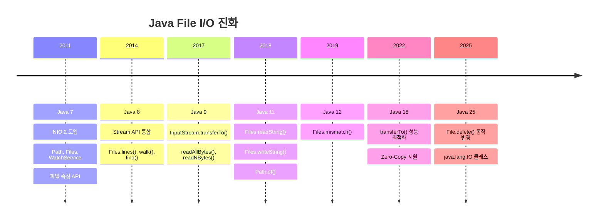

# Java File I/O의 진화: Java 7부터 25까지

Java의 파일 입출력 API가 어떻게 발전해왔는지, 버전별 핵심 변경사항을 정리합니다.

## 결론부터 말하면

Java 파일 I/O는 **Java 7의 NIO.2에서 혁명적으로 바뀌었고**, 이후 버전에서는 **편의성 개선**에 집중했습니다.

```java
// Java 6 이전 - 고통스러운 파일 읽기
BufferedReader reader = null;
try {
    reader = new BufferedReader(new FileReader("file.txt"));
    String line;
    while ((line = reader.readLine()) != null) {
        System.out.println(line);
    }
} finally {
    if (reader != null) reader.close();
}

// Java 7+ - try-with-resources + NIO.2
try (BufferedReader reader = Files.newBufferedReader(Paths.get("file.txt"))) {
    reader.lines().forEach(System.out::println);
}

// Java 11+ - 한 줄로 끝
String content = Files.readString(Path.of("file.txt"));
```

**버전별 핵심 변화:**

| 버전 | 핵심 변화 | 대표 API |
|------|----------|---------|
| Java 7 | NIO.2 도입 (혁명) | `Path`, `Files`, `WatchService` |
| Java 8 | Stream API 통합 | `Files.lines()`, `Files.walk()` |
| Java 9 | 스트림 복사 간소화 | `InputStream.transferTo()` |
| Java 11 | 문자열 I/O 간소화 | `Files.readString()`, `writeString()` |
| Java 12 | 파일 비교 | `Files.mismatch()` |
| Java 25 | Windows 동작 변경 | `File.delete()` 개선 |

---

## 1. Java 7: NIO.2의 등장 (2011)

### 왜 NIO.2가 필요했나?

Java 1.0부터 있던 `java.io.File` 클래스는 심각한 문제들이 있었다:

```java
// java.io.File의 문제점들
File file = new File("/path/to/file");

// 1. 실패해도 왜 실패했는지 모름
boolean deleted = file.delete();  // false 반환... 왜?

// 2. 심볼릭 링크 지원 안 함
// 3. 파일 속성(권한, 소유자) 접근 어려움
// 4. 디렉토리 변경 감시 불가능
// 5. 대용량 디렉토리 처리 시 성능 문제
```

### NIO.2가 가져온 변화

```java
// Path: 경로를 표현하는 새로운 방식
Path path = Paths.get("/home/user/file.txt");
Path path2 = Paths.get("/home", "user", "file.txt");  // 가변 인자

// 경로 조작이 직관적
Path parent = path.getParent();           // /home/user
Path fileName = path.getFileName();        // file.txt
Path resolved = path.resolve("subdir");    // /home/user/file.txt/subdir
Path relative = path.relativize(other);    // 상대 경로 계산
```

### Files 유틸리티 클래스

```java
// 파일 작업이 훨씬 쉬워짐
// 읽기
byte[] bytes = Files.readAllBytes(path);
List<String> lines = Files.readAllLines(path);

// 쓰기
Files.write(path, bytes);
Files.write(path, lines);

// 복사/이동/삭제 - 예외로 실패 원인 알 수 있음
Files.copy(source, target, StandardCopyOption.REPLACE_EXISTING);
Files.move(source, target);
Files.delete(path);  // NoSuchFileException, DirectoryNotEmptyException 등

// 디렉토리 생성
Files.createDirectory(path);
Files.createDirectories(path);  // mkdir -p 처럼 중간 경로도 생성
```

### WatchService: 파일 시스템 감시

```java
// 디렉토리 변경 감시 - IDE, 빌드 도구에서 활용
WatchService watchService = FileSystems.getDefault().newWatchService();
path.register(watchService,
    StandardWatchEventKinds.ENTRY_CREATE,
    StandardWatchEventKinds.ENTRY_MODIFY,
    StandardWatchEventKinds.ENTRY_DELETE);

// 주의: take()는 블로킹 호출이므로 실제 애플리케이션에서는
// 별도의 백그라운드 스레드에서 실행해야 메인 스레드가 차단되지 않음
while (true) {
    WatchKey key = watchService.take();  // 이벤트 발생까지 블로킹
    for (WatchEvent<?> event : key.pollEvents()) {
        System.out.println(event.kind() + ": " + event.context());
    }
    key.reset();
}
```

### 파일 속성 접근

```java
// 기본 속성
BasicFileAttributes attrs = Files.readAttributes(path, BasicFileAttributes.class);
System.out.println("크기: " + attrs.size());
System.out.println("생성일: " + attrs.creationTime());
System.out.println("수정일: " + attrs.lastModifiedTime());
System.out.println("디렉토리: " + attrs.isDirectory());

// POSIX 속성 (Unix/Linux/Mac)
PosixFileAttributes posix = Files.readAttributes(path, PosixFileAttributes.class);
System.out.println("소유자: " + posix.owner());
System.out.println("그룹: " + posix.group());
System.out.println("권한: " + PosixFilePermissions.toString(posix.permissions()));
```

---

## 2. Java 8: Stream API와의 통합 (2014)

Java 8의 Stream API가 파일 I/O에도 적용되었다. 핵심은 **지연 로딩**(Lazy Loading)이다.

### Files.lines(): 파일을 Stream으로

```java
// 대용량 파일도 메모리 효율적으로 처리
// 실제로 읽는 만큼만 메모리에 로드됨
try (Stream<String> lines = Files.lines(Paths.get("huge-file.txt"))) {
    lines.filter(line -> line.contains("ERROR"))
         .map(String::trim)
         .limit(100)  // 100개만 필요하면 나머지는 읽지도 않음
         .forEach(System.out::println);
}
```

### Files.list(): 디렉토리 내용을 Stream으로

```java
// 디렉토리의 파일 목록 (1단계만)
try (Stream<Path> files = Files.list(Paths.get("/var/log"))) {
    files.filter(Files::isRegularFile)
         .filter(p -> p.toString().endsWith(".log"))
         .forEach(System.out::println);
}
```

### Files.walk(): 재귀적 디렉토리 탐색

```java
// 하위 디렉토리까지 모두 탐색
try (Stream<Path> paths = Files.walk(Paths.get("/project"))) {
    long javaFileCount = paths
        .filter(p -> p.toString().endsWith(".java"))
        .count();
    System.out.println("Java 파일 수: " + javaFileCount);
}

// 깊이 제한 가능
try (Stream<Path> paths = Files.walk(Paths.get("/project"), 2)) {
    // 최대 2단계까지만 탐색
}
```

### Files.find(): 조건부 파일 검색

```java
// 특정 조건에 맞는 파일만 찾기
try (Stream<Path> found = Files.find(
        Paths.get("/project"),
        Integer.MAX_VALUE,  // 깊이 무제한
        (path, attrs) -> attrs.isRegularFile()
                        && path.toString().endsWith(".java")
                        && attrs.size() > 10_000)) {  // 10KB 이상
    found.forEach(System.out::println);
}
```

### 리소스 관리 주의!

```java
// Stream은 반드시 닫아야 함 - try-with-resources 필수!
// ❌ Bad: 리소스 누수
Files.lines(path).forEach(System.out::println);

// ✅ Good: 자동으로 닫힘
try (Stream<String> lines = Files.lines(path)) {
    lines.forEach(System.out::println);
}
```

---

## 3. Java 9: 스트림 복사 간소화 (2017)

### InputStream.transferTo()

기존에는 스트림 간 복사가 번거로웠다:

```java
// Java 8 이전 - 직접 버퍼링 필요
byte[] buffer = new byte[8192];
int bytesRead;
while ((bytesRead = inputStream.read(buffer)) != -1) {
    outputStream.write(buffer, 0, bytesRead);
}

// Java 9+ - 한 줄로 끝
inputStream.transferTo(outputStream);
```

### 실용적인 활용 예

```java
// HTTP 응답을 파일로 저장
try (InputStream in = connection.getInputStream();
     OutputStream out = Files.newOutputStream(Path.of("download.zip"))) {
    in.transferTo(out);
}

// 리소스 파일 복사
try (InputStream in = getClass().getResourceAsStream("/template.txt");
     OutputStream out = Files.newOutputStream(targetPath)) {
    in.transferTo(out);
}
```

### readAllBytes(), readNBytes()

```java
// 전체 읽기
byte[] all = inputStream.readAllBytes();

// N바이트만 읽기 (헤더 파싱 등에 유용)
byte[] header = inputStream.readNBytes(1024);
```

---

## 4. Java 11: 문자열 I/O 간소화 (2018)

Java 11은 **가장 자주 쓰는 패턴**을 API로 만들었다.

### Files.readString() / writeString()

```java
// Java 10 이전
String content = new String(Files.readAllBytes(path), StandardCharsets.UTF_8);

// Java 11+ - 한 줄로 끝 (기본 UTF-8)
String content = Files.readString(path);
String content = Files.readString(path, StandardCharsets.ISO_8859_1);  // 인코딩 지정

// 쓰기도 마찬가지
Files.writeString(path, "Hello, World!");
Files.writeString(path, "추가 내용", StandardOpenOption.APPEND);
```

### Path.of() - Paths.get()의 대안

```java
// Java 11 이전
Path path = Paths.get("/home/user/file.txt");

// Java 11+ - 더 간결한 팩토리 메서드
Path path = Path.of("/home/user/file.txt");
Path path = Path.of("/home", "user", "file.txt");
```

왜 `Path.of()`를 추가했을까? `Paths.get()`은 유틸리티 클래스를 통한 우회였지만, `Path.of()`는 인터페이스의 정적 팩토리 메서드로 더 자연스럽다.

---

## 5. Java 12: 파일 비교 (2019)

### Files.mismatch()

두 파일이 같은지 비교하는 효율적인 방법:

```java
// 두 파일 비교
long mismatchPosition = Files.mismatch(path1, path2);

if (mismatchPosition == -1L) {
    System.out.println("파일이 완전히 동일함");
} else {
    System.out.println("첫 번째 차이점 위치: " + mismatchPosition + " 바이트");
}
```

**활용 사례:**
- 백업 파일 검증
- 파일 동기화
- 테스트에서 예상 결과와 실제 결과 비교

기존에는 두 파일을 완전히 읽어서 비교해야 했지만, `mismatch()`는 차이점을 발견하면 즉시 중단하므로 효율적이다.

---

## 6. Java 18+: 성능 개선

### transferTo() 최적화

Java 18부터 `FileInputStream.transferTo()`가 NIO 채널을 활용하여 **제로카피(Zero-Copy)** 전송을 지원한다:

```java
// Java 18+ - OS 레벨 최적화 자동 적용
// sendfile() 시스템 콜 활용 (Linux)
try (InputStream in = new FileInputStream("source.dat");
     OutputStream out = new FileOutputStream("target.dat")) {
    in.transferTo(out);  // 훨씬 빠름!
}
```

---

## 7. Java 25: 동작 변경 (2025)

### File.delete() Windows 동작 변경

```java
// Java 25에서 Windows에서의 동작이 변경됨
File file = new File("readonly-file.txt");

// Java 24 이전: 읽기 전용 파일도 삭제 가능했음 (일부 상황)
// Java 25: 읽기 전용(DOS read-only attribute) 파일 삭제 시 false 반환

// 해결 방법: 먼저 쓰기 가능으로 변경
file.setWritable(true);
file.delete();

// 또는 NIO.2 사용 (더 명확한 예외)
Files.delete(path);  // AccessDeniedException
```

### java.lang.IO 클래스

Java 25는 간단한 콘솔 I/O를 위한 새로운 `IO` 클래스를 `java.lang`에 도입했다 (JEP 512). `java.lang` 패키지에 있으므로 별도 import 없이 사용 가능하다:

```java
// 기존
System.out.println("Hello");
String input = new Scanner(System.in).nextLine();

// Java 25 - java.lang.IO 사용
void main() {
    IO.println("Hello");              // System.out.println 대체
    String name = IO.readln("이름: "); // 프롬프트와 함께 입력 받기
}

// static import로 더 간결하게
import static java.lang.IO.*;

void main() {
    println("Hello");
    String name = readln();
}
```

**IO 클래스의 주요 메서드:**
- `IO.print(Object obj)` - 줄바꿈 없이 출력
- `IO.println(Object obj)` - 줄바꿈과 함께 출력
- `IO.readln()` - 한 줄 입력 받기
- `IO.readln(String prompt)` - 프롬프트 출력 후 입력 받기

---

## 버전별 변화 타임라인



---

## 실무 권장사항

### 1. NIO.2를 기본으로 사용하라

```java
// ❌ 레거시 API
File file = new File("path");
FileInputStream fis = new FileInputStream(file);

// ✅ NIO.2 API
Path path = Path.of("path");
InputStream is = Files.newInputStream(path);
```

### 2. Java 버전에 맞는 최신 API 활용

```java
// Java 11+라면
String content = Files.readString(path);
Files.writeString(path, content);

// Java 8이라면
List<String> lines = Files.readAllLines(path);
Files.write(path, lines);
```

### 3. 대용량 파일은 Stream으로

```java
// ❌ 메모리 부족 위험
List<String> all = Files.readAllLines(hugePath);

// ✅ 지연 로딩으로 안전
try (Stream<String> lines = Files.lines(hugePath)) {
    lines.filter(predicate).forEach(processor);
}
```

### 4. 항상 리소스를 닫아라

```java
// try-with-resources 필수!
try (Stream<Path> files = Files.walk(dir);
     BufferedReader reader = Files.newBufferedReader(path)) {
    // 작업 수행
}
```

---

## 출처

- [Oracle - The Java NIO.2 File System in JDK 7](https://www.oracle.com/technical-resources/articles/javase/nio.html) - 공식 문서
- [Baeldung - Java NIO2 Path API](https://www.baeldung.com/java-nio-2-path) - NIO.2 튜토리얼
- [Java 11 - New Methods in Path and Files](https://www.dariawan.com/tutorials/java/java-11-new-methods-path-and-files/) - Java 11 변경사항
- [Java 12 - Files.mismatch()](https://www.dariawan.com/tutorials/java/java-12-use-files-mismatch-compare-files/) - Files.mismatch() 가이드
- [Oracle - JDK 25 Release Notes](https://www.oracle.com/java/technologies/javase/25-relnote-issues.html) - 공식 릴리스 노트
- [File IO with Java 8 Streams](https://www.nextptr.com/tutorial/ta1321112508/file-io-with-java-8-streams) - Stream API 파일 I/O
