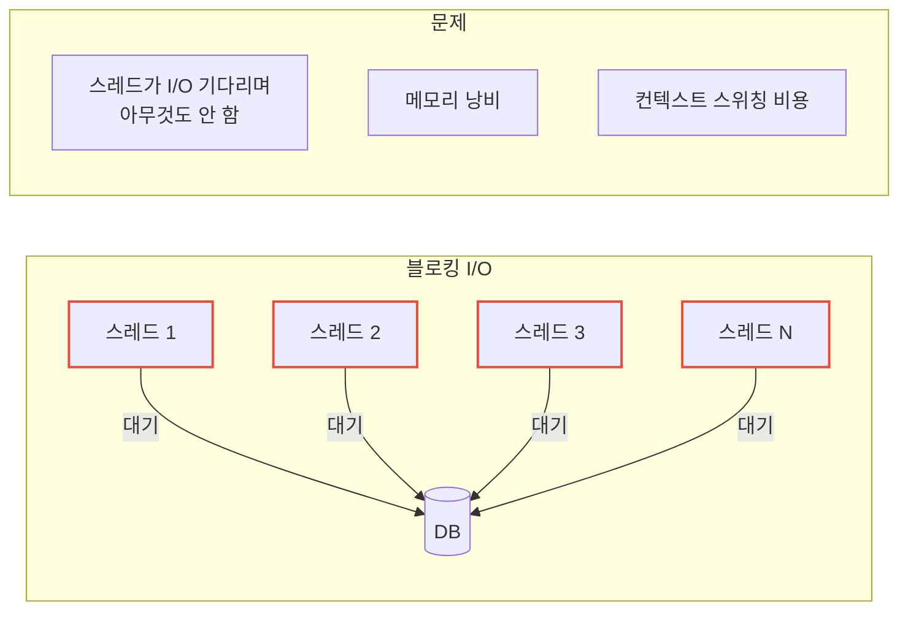
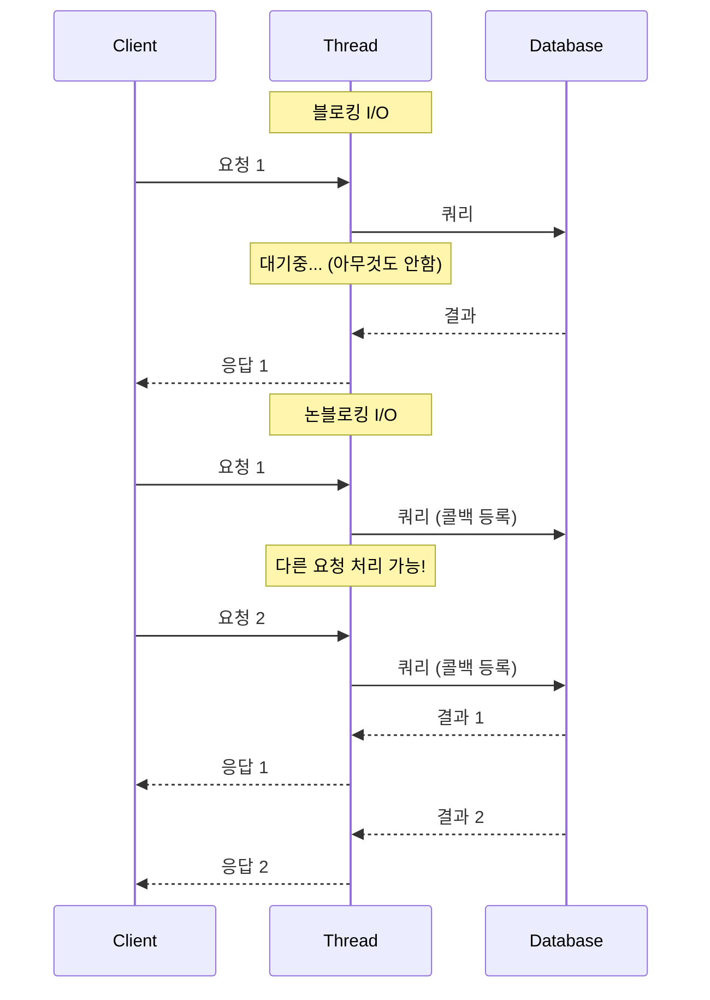
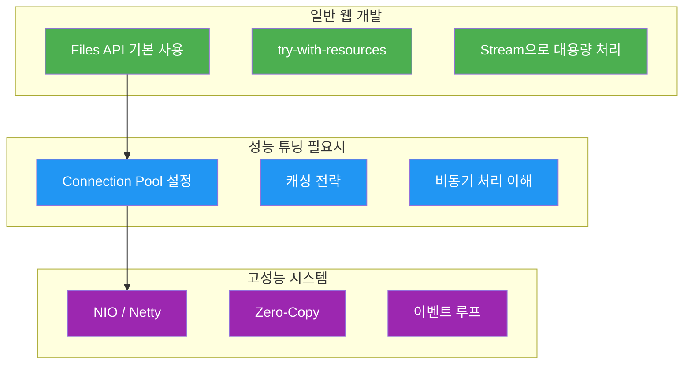

# Java I/O가 중요한 진짜 이유

I/O 책이 왜 그렇게 두꺼운지, 왜 중요하다고 하는지 실감이 안 된다면 이 글을 읽어보자.

## 결론부터 말하면

**I/O의 중요성은 "규모"가 커져야 체감된다.** 단순 웹 개발에서는 프레임워크가 다 숨겨주지만, "왜 느리지?", "동시 접속자가 늘면 왜 죽지?" 같은 문제를 만나면 결국 I/O로 돌아오게 된다.

```
CPU 연산      :          1 나노초
RAM 접근      :        100 나노초
SSD 읽기      :    100,000 나노초  (0.1ms)
HDD 읽기      : 10,000,000 나노초  (10ms)
네트워크 왕복  : 150,000,000 나노초 (150ms, 서울↔미국)
```

**CPU가 1초 일한다고 치면, 디스크는 3일, 네트워크는 5년 걸리는 셈이다.**

---

## 1. 왜 I/O가 병목인가

### 간단한 웹 서버 상황

```java
// 사용자 요청 처리
public Response handleRequest(Request req) {
    User user = database.findUser(req.userId);      // DB I/O: 5ms
    List<Order> orders = database.findOrders(user); // DB I/O: 10ms
    return new Response(user, orders);
}
```

CPU 연산은 마이크로초 단위로 끝나지만, **I/O를 기다리는 시간이 99%다.**

### 동시 접속자가 늘어나면?

| 동시 접속 | 블로킹 I/O 방식 | 문제점 |
|----------|---------------|--------|
| 100명 | 스레드 100개 | 괜찮음 |
| 1,000명 | 스레드 1,000개 | 메모리 1GB+ |
| 10,000명 | 스레드 10,000개 | 스레드 생성/전환 비용으로 서버 다운 |

이게 바로 **C10K 문제** - 동시 접속 1만 명을 어떻게 처리할 것인가?



---

## 2. 웹 개발에서 숨어있는 I/O

사실 웹 개발할 때 이미 I/O를 엄청 쓰고 있다:

```java
// 이거 전부 I/O다
userRepository.findById(id);           // DB I/O
restTemplate.getForObject(url);        // 네트워크 I/O
redisTemplate.opsForValue().get(key);  // Redis I/O
amazonS3.getObject(bucket, key);       // S3 I/O (네트워크)
Files.readString(path);                // 파일 I/O
```

**Spring MVC**가 잘 작동하는 이유?
→ Tomcat이 스레드 풀(기본 200개)로 동시 요청을 처리해주기 때문

**그런데 200명 넘으면?**
→ 나머지는 대기... 응답 시간 급증

---

## 3. I/O 문제 해결책들

### 3.1 Connection Pool (HikariCP)

```java
// 왜 DB 커넥션을 풀로 관리할까?

// TCP 연결 수립 = 3-way handshake = 네트워크 I/O 3번
// 커넥션 새로 만들기: 50~100ms
// 풀에서 가져오기: 0.001ms

// HikariCP 설정 예시
spring.datasource.hikari.maximum-pool-size=10
spring.datasource.hikari.minimum-idle=5
spring.datasource.hikari.connection-timeout=30000
```

### 3.2 캐싱 (Redis)

```java
// 왜 Redis를 쓸까?

// DB 쿼리 (디스크 I/O): 10ms
// Redis 조회 (메모리 + 네트워크): 0.5ms
// → 20배 빠르다

@Cacheable("users")
public User findUser(Long id) {
    return userRepository.findById(id);  // 첫 호출만 DB 접근
}
```

### 3.3 비동기/리액티브 (WebFlux)

```java
// Spring MVC - 스레드가 DB 응답 기다리며 놀고 있음
public Response getUser(Long id) {
    User user = userRepository.findById(id);        // 블로킹 5ms
    List<Order> orders = orderRepository.findByUser(user);  // 블로킹 10ms
    return new Response(user, orders);              // 총 15ms 대기
}

// Spring WebFlux - 스레드가 다른 일 하러 감
public Mono<Response> getUser(Long id) {
    return userRepository.findById(id)              // 논블로킹
        .flatMap(user ->
            orderRepository.findByUser(user.getId())
                .collectList()
                .map(orders -> new Response(user, orders))
        );
    // I/O 기다리는 동안 다른 요청 처리 가능!
}
```



---

## 4. 실제 대규모 시스템 사례

### Netflix
- 마이크로서비스 간 통신 = 전부 네트워크 I/O
- 한 요청에 내부 API 호출 10번 → 순차 처리면 지연 누적
- **해결**: 비동기 + 병렬 처리 (RxJava, Reactor)

### 카카오톡/Line
- 동시 접속 수백만 명
- 메시지 전송 = 네트워크 I/O
- **해결**: Netty 기반 논블로킹 서버

### 대용량 로그 분석
- 10GB 로그 파일
- 전체 메모리 로드? → OutOfMemoryError
- **해결**: Stream으로 라인 단위 처리

```java
// 10GB 파일도 메모리 걱정 없이 처리
try (Stream<String> lines = Files.lines(Paths.get("huge.log"))) {
    long errorCount = lines
        .filter(line -> line.contains("ERROR"))
        .count();
}
```

---

## 5. I/O의 깊은 세계

책 한 권이 나오는 이유는 이런 개념들이 전부 I/O 성능 최적화를 위한 것이기 때문이다:

| 개념 | 설명 | 사용 예 |
|------|------|--------|
| **블로킹/논블로킹** | 호출 시 대기 여부 | BIO vs NIO |
| **동기/비동기** | 결과 처리 방식 | Callback, Future, Reactive |
| **멀티플렉싱** | 하나의 스레드로 여러 I/O 처리 | select, epoll, kqueue |
| **버퍼링** | 시스템 콜 횟수 줄이기 | BufferedReader |
| **제로카피** | 커널-유저 공간 복사 최소화 | sendfile(), transferTo() |
| **메모리 맵 파일** | 파일을 메모리처럼 접근 | MappedByteBuffer |

---

## 6. 웹 개발자가 알아야 할 수준



### 실무 우선순위

```
1순위: DB I/O        → 쿼리 최적화, 인덱싱, 커넥션 풀
2순위: 네트워크 I/O   → API 호출 최적화, 캐싱, 타임아웃
3순위: 파일 I/O      → 대부분 프레임워크가 처리해줌
```

**웹 개발자라면 파일 I/O를 깊게 파기보다, DB 쿼리 최적화나 캐싱 전략을 공부하는 게 더 실용적이다.**

---

## 정리

| 규모 | 필요 수준 | 핵심 포인트 |
|------|----------|------------|
| 소규모 | 기본 | Spring MVC + HikariCP면 충분 |
| 중규모 | 캐싱 + 튜닝 | Redis, 커넥션 풀 최적화 |
| 대규모 | 비동기/논블로킹 | WebFlux, Netty, NIO 깊은 이해 |

**I/O를 모르면 성능 튜닝을 할 수 없다.** 하지만 모든 걸 알 필요는 없고, 현재 다루는 시스템 규모에 맞는 수준까지만 알면 된다.

---

## 출처

- [The C10K problem](http://www.kegel.com/c10k.html) - Dan Kegel
- [Netty in Action](https://www.manning.com/books/netty-in-action) - Norman Maurer
- [Java NIO vs IO](https://jenkov.com/tutorials/java-nio/nio-vs-io.html) - Jenkov
- [Spring WebFlux 공식 문서](https://docs.spring.io/spring-framework/reference/web/webflux.html)
