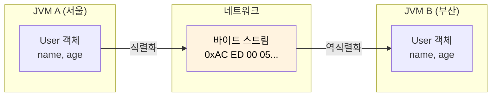
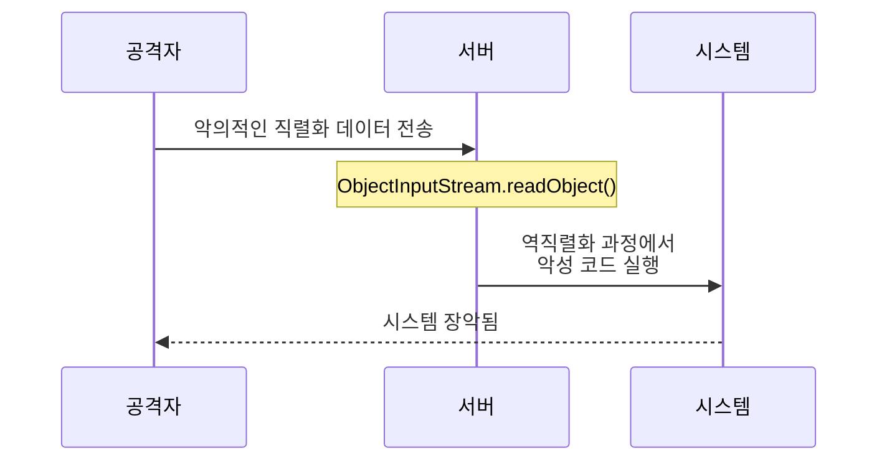
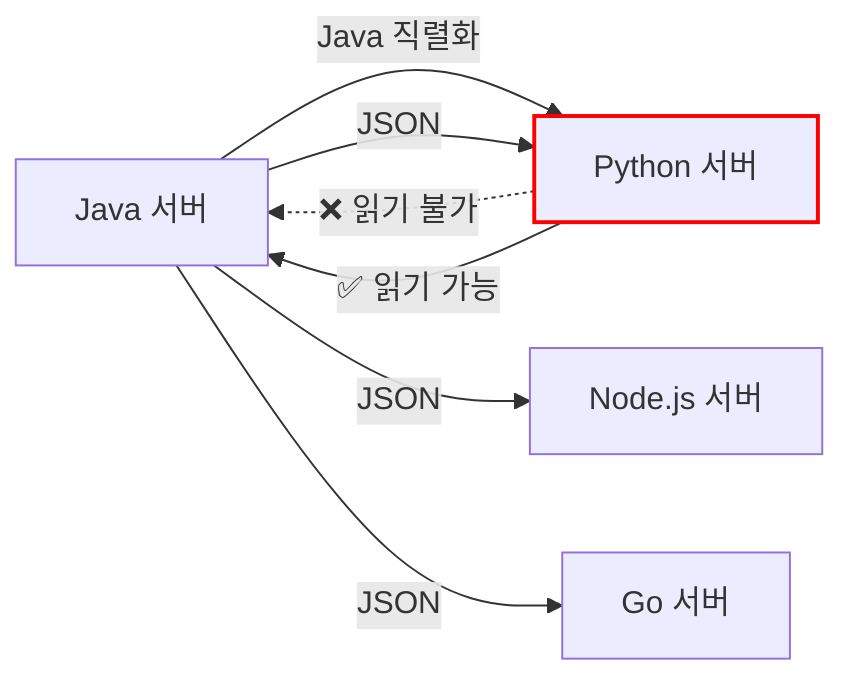
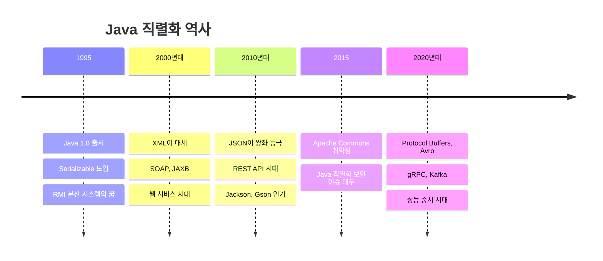

# Java 객체 직렬화의 모든 것

객체를 바이트 스트림으로 변환하여 저장하거나 전송하고, 다시 객체로 복원하는 Java의 내장 기술이다.

## 결론부터 말하면

**Java 직렬화는 역사적으로 중요하지만, 새 프로젝트에서는 JSON이나 Protocol Buffers를 사용하라.**

보안 취약점, 언어 종속성, 비효율적인 크기 때문에 현대 개발에서는 권장되지 않는다.

```java
// ❌ Java 직렬화 (레거시)
ObjectOutputStream oos = new ObjectOutputStream(new FileOutputStream("user.ser"));
oos.writeObject(user);

// ✅ JSON 직렬화 (현대적)
ObjectMapper mapper = new ObjectMapper();
String json = mapper.writeValueAsString(user);  // {"name":"김철수","age":25}
```

| 방식 | 크기 | 언어 호환 | 보안 | 권장도 |
|------|------|----------|------|--------|
| Java Serialization | 큼 (~200B) | Java만 | 취약 | ❌ |
| JSON | 중간 (~30B) | 모든 언어 | 안전 | ✅ |
| Protocol Buffers | 작음 (~15B) | 모든 언어 | 안전 | ✅ |

---

## 1. 왜 만들어졌는가?

1995년 Java가 처음 나왔을 때, **분산 시스템**의 꿈이 있었다. **RMI(Remote Method Invocation)** - 원격 서버의 메서드를 마치 로컬처럼 호출하는 기술. 이걸 위해서는 객체를 네트워크로 전송해야 했다.



메모리의 객체는 **포인터, 참조, 힙 주소** 등으로 이루어져 있다. 이걸 그대로 보내면 받는 쪽에서는 의미 없는 숫자일 뿐이다. 그래서 **"객체의 상태를 바이트 배열로 평탄화(flatten)"** 하는 기술이 필요했다.

### 직렬화와 역직렬화

| 용어 | 방향 | 설명 |
|------|------|------|
| **직렬화**(Serialization) | Object → byte[] | 객체를 바이트 스트림으로 변환 |
| **역직렬화**(Deserialization) | byte[] → Object | 바이트 스트림을 객체로 복원 |

---

## 2. 기본 사용법

### 2.1 Serializable 인터페이스

```java
import java.io.Serializable;

public class User implements Serializable {
    private String name;
    private int age;
    private String email;

    public User(String name, int age, String email) {
        this.name = name;
        this.age = age;
        this.email = email;
    }

    // getter, setter...
}
```

`Serializable`은 **마커 인터페이스**다. 메서드가 하나도 없다. JVM에게 "이 객체는 직렬화해도 된다"라고 알려주는 표식일 뿐이다.

### 2.2 직렬화 코드

```java
User user = new User("김철수", 25, "kim@example.com");

// 직렬화: Object → byte[] (파일로 저장)
try (ObjectOutputStream oos = new ObjectOutputStream(
        new FileOutputStream("user.ser"))) {
    oos.writeObject(user);
    System.out.println("직렬화 완료");
}
```

### 2.3 역직렬화 코드

```java
// 역직렬화: byte[] → Object (파일에서 복원)
try (ObjectInputStream ois = new ObjectInputStream(
        new FileInputStream("user.ser"))) {
    User restored = (User) ois.readObject();
    System.out.println(restored.getName());  // 김철수
    System.out.println(restored.getAge());   // 25
}
```

### 2.4 바이트 배열로 직렬화

파일이 아닌 메모리(바이트 배열)로 직렬화하는 것도 가능하다.

```java
// 바이트 배열로 직렬화
ByteArrayOutputStream baos = new ByteArrayOutputStream();
ObjectOutputStream oos = new ObjectOutputStream(baos);
oos.writeObject(user);
byte[] serializedBytes = baos.toByteArray();

System.out.println("크기: " + serializedBytes.length + " bytes");

// 바이트 배열에서 역직렬화
ByteArrayInputStream bais = new ByteArrayInputStream(serializedBytes);
ObjectInputStream ois = new ObjectInputStream(bais);
User restored = (User) ois.readObject();
```

---

## 3. serialVersionUID: 버전 관리

### 3.1 왜 필요한가?

클래스가 변경되면 직렬화/역직렬화에 문제가 생긴다.

```java
// v1: 직렬화할 때의 클래스
public class User implements Serializable {
    private String name;
    private int age;
}

// v2: 역직렬화할 때의 클래스 (필드 추가됨)
public class User implements Serializable {
    private String name;
    private int age;
    private String email;  // 새로 추가!
}
```

`serialVersionUID`를 명시하지 않으면 JVM이 클래스 구조를 해시해서 **자동 생성**한다. 클래스가 바뀌면 UID도 바뀌고, **InvalidClassException**이 발생한다.

### 3.2 명시적 선언

```java
public class User implements Serializable {
    private static final long serialVersionUID = 1L;  // 명시적 선언 권장

    private String name;
    private int age;
}
```

### 3.3 버전 호환성

| 변경 유형 | serialVersionUID 명시 | 명시 안 함 |
|----------|----------------------|-----------|
| **필드 추가** | 새 필드는 기본값(null, 0)으로 복원 | ❌ InvalidClassException |
| **필드 삭제** | 삭제된 필드는 무시됨 | ❌ InvalidClassException |
| **필드 타입 변경** | ❌ 예외 발생 | ❌ 예외 발생 |
| **클래스명 변경** | ❌ 예외 발생 | ❌ 예외 발생 |

```java
// 호환성 유지 예시
public class User implements Serializable {
    private static final long serialVersionUID = 1L;  // 버전 고정

    private String name;
    private int age;
    private String email;        // v2에서 추가 → 기존 데이터는 null로 복원
    private String nickname;     // v3에서 추가 → 기존 데이터는 null로 복원
}
```

---

## 4. transient: 직렬화 제외

민감하거나 직렬화할 필요 없는 필드는 `transient` 키워드로 제외한다.

```java
public class User implements Serializable {
    private static final long serialVersionUID = 1L;

    private String name;
    private int age;

    private transient String password;       // 보안상 제외
    private transient Connection dbConn;     // 직렬화 불가능한 객체
    private transient int cachedHashCode;    // 재계산 가능한 값
    private transient Logger logger;         // 런타임 의존성
}
```

### transient 필드의 역직렬화 결과

| 타입 | 역직렬화 후 값 |
|------|---------------|
| 객체 (String, Object 등) | `null` |
| int, long, short, byte | `0` |
| double, float | `0.0` |
| boolean | `false` |
| char | `'\u0000'` |

---

## 5. 왜 요즘은 잘 안 쓰는가?

### 5.1 보안 취약점 (가장 심각)

Java 직렬화는 **"갓 모드"**로 객체를 생성한다. 생성자를 호출하지 않고 바로 메모리에 객체를 만든다.

```java
// 정상적인 객체 생성
public class User {
    public User(String name) {
        if (name == null || name.isEmpty()) {
            throw new IllegalArgumentException("이름은 필수");
        }
        this.name = name;
    }
}

User user = new User("김철수");  // 생성자에서 유효성 검사 ✅

// 역직렬화로 생성
User user = (User) ois.readObject();  // 생성자 완전 우회! ❌
```

악의적인 바이트 스트림을 보내면 **원격 코드 실행(RCE)**이 가능하다.



**Apache Commons Collections 취약점(CVE-2015-7501)**이 대표적인 사례다. WebLogic, JBoss, Jenkins 등 수많은 시스템이 영향을 받았다.

#### 방어책: ObjectInputFilter (Java 9+)

레거시 시스템에서 어쩔 수 없이 직렬화를 사용해야 한다면, **ObjectInputFilter**로 허용할 클래스를 제한할 수 있다.

```java
// Java 9+ 역직렬화 필터 설정
ObjectInputFilter filter = ObjectInputFilter.Config.createFilter(
    "com.myapp.model.*;!*"  // com.myapp.model 패키지만 허용, 나머지 차단
);

ObjectInputStream ois = new ObjectInputStream(new FileInputStream("data.ser"));
ois.setObjectInputFilter(filter);

// 또는 JVM 전역 설정
// -Djdk.serialFilter=com.myapp.model.*;!*
```

| 필터 패턴 | 의미 |
|----------|------|
| `com.myapp.*` | com.myapp 패키지 허용 |
| `!*` | 나머지 모두 차단 |
| `maxdepth=3` | 객체 깊이 제한 |
| `maxarray=1000` | 배열 크기 제한 |

### 5.2 언어 종속성

Java 직렬화 포맷은 **Java에서만** 읽을 수 있다.



마이크로서비스 환경에서는 다양한 언어가 혼용된다. Java 직렬화는 이런 환경에 맞지 않는다.

### 5.3 비효율적인 크기

같은 데이터를 다른 포맷으로 직렬화했을 때 크기 비교:

```java
User user = new User("김철수", 25);
```

| 포맷 | 대략적인 크기 | 비고 |
|------|-------------|------|
| Java Serialization | ~200 bytes | 클래스 메타데이터 포함 |
| JSON | ~30 bytes | `{"name":"김철수","age":25}` |
| Protocol Buffers | ~15 bytes | 바이너리, 스키마 기반 |
| MessagePack | ~20 bytes | JSON 호환 바이너리 |

### 5.4 버전 관리의 어려움

클래스 구조가 바뀔 때마다 호환성 문제가 생긴다. `serialVersionUID`로 어느 정도 해결되지만, 복잡한 변경(상속 구조 변경, 필드 타입 변경)에는 한계가 있다.

---

## 6. 현대적 대안들

### 6.1 JSON (Jackson, Gson)

가장 널리 사용되는 방식이다.

```java
// Jackson 사용
ObjectMapper mapper = new ObjectMapper();

// 직렬화
String json = mapper.writeValueAsString(user);
// {"name":"김철수","age":25,"email":"kim@example.com"}

// 역직렬화
User restored = mapper.readValue(json, User.class);
```

**장점:**
- 사람이 읽을 수 있음
- 모든 언어에서 지원
- 디버깅 쉬움

**단점:**
- 바이너리 대비 크기가 큼
- 파싱 오버헤드

### 6.2 Protocol Buffers (Google)

성능이 중요한 시스템에서 사용한다.

```protobuf
// user.proto
syntax = "proto3";

message User {
    string name = 1;
    int32 age = 2;
    string email = 3;
}
```

```java
// 직렬화
User user = User.newBuilder()
    .setName("김철수")
    .setAge(25)
    .build();
byte[] bytes = user.toByteArray();

// 역직렬화
User restored = User.parseFrom(bytes);
```

**장점:**
- 매우 작은 크기
- 매우 빠른 속도
- 스키마로 타입 안전성

**단점:**
- .proto 파일 관리 필요
- 사람이 읽을 수 없음

### 6.3 비교표

| 포맷 | 장점 | 단점 | 사용처 |
|------|------|------|--------|
| **JSON** | 범용성, 가독성 | 크기, 속도 | REST API, 설정 파일 |
| **Protocol Buffers** | 크기, 속도, 스키마 | .proto 필요 | gRPC, 대용량 데이터 |
| **Avro** | 스키마 진화 우수 | 복잡함 | Kafka, 빅데이터 |
| **MessagePack** | JSON 호환, 바이너리 | 덜 알려짐 | 캐시, 소켓 통신 |

---

## 7. 그래도 Java 직렬화가 쓰이는 곳

완전히 사라진 것은 아니다. 다음 상황에서는 여전히 사용된다:

| 사용처 | 이유 |
|--------|------|
| **JVM 내부 캐시** (Ehcache, Hazelcast) | 같은 Java 환경, 성능 |
| **Session 클러스터링** (Tomcat) | HttpSession은 Serializable |
| **Deep Copy** | 간편한 객체 복사 |
| **레거시 RMI 시스템** | 기존 시스템 유지보수 |

### Deep Copy 트릭

> **주의:** 이 방식은 간편하지만 **성능이 매우 느리다.** 바이트 배열 생성, 스트림 I/O, 리플렉션이 내부적으로 발생한다. 성능이 중요한 곳에서는 복사 생성자나 `clone()` 메서드를 직접 구현하는 것이 좋다.

```java
// 직렬화를 이용한 Deep Copy (간편하지만 성능 주의)
@SuppressWarnings("unchecked")
public static <T extends Serializable> T deepCopy(T obj) throws Exception {
    ByteArrayOutputStream baos = new ByteArrayOutputStream();
    ObjectOutputStream oos = new ObjectOutputStream(baos);
    oos.writeObject(obj);

    ByteArrayInputStream bais = new ByteArrayInputStream(baos.toByteArray());
    ObjectInputStream ois = new ObjectInputStream(bais);
    return (T) ois.readObject();
}

// 사용
User original = new User("김철수", 25);
User copied = deepCopy(original);
copied.setAge(30);  // original은 영향 없음
```

---

## 8. 커스텀 직렬화

기본 직렬화 동작을 바꾸고 싶다면 `writeObject`/`readObject` 메서드를 구현한다.

```java
public class User implements Serializable {
    private static final long serialVersionUID = 1L;

    private String name;
    private int age;
    private transient String password;  // 직렬화 제외

    // 커스텀 직렬화
    private void writeObject(ObjectOutputStream oos) throws IOException {
        oos.defaultWriteObject();  // 기본 필드 직렬화
        // password는 암호화해서 저장
        oos.writeObject(encrypt(password));
    }

    // 커스텀 역직렬화
    private void readObject(ObjectInputStream ois)
            throws IOException, ClassNotFoundException {
        ois.defaultReadObject();  // 기본 필드 역직렬화
        // 암호화된 password 복호화
        this.password = decrypt((String) ois.readObject());
    }

    private String encrypt(String s) { /* 암호화 로직 */ }
    private String decrypt(String s) { /* 복호화 로직 */ }
}
```

---

## 9. 역사적 흐름



---

## 10. 정리

| 항목 | 내용 |
|------|------|
| **정의** | 객체 ↔ 바이트 스트림 상호 변환 기술 |
| **핵심 인터페이스** | `Serializable` (마커 인터페이스) |
| **버전 관리** | `serialVersionUID` 명시 권장 |
| **제외 키워드** | `transient` |
| **보안 문제** | 생성자 우회, RCE 취약점 |
| **현대적 대안** | JSON (Jackson), Protocol Buffers |
| **권장사항** | 새 프로젝트에서는 사용 자제 |

---

## 출처

- [Oracle Java Documentation - Object Serialization](https://docs.oracle.com/en/java/javase/17/docs/specs/serialization/index.html) - 공식 문서
- [Effective Java 3rd Edition - Item 85~90](https://www.oreilly.com/library/view/effective-java-3rd/9780134686097/) - Joshua Bloch
- [OWASP - Deserialization Vulnerabilities](https://owasp.org/www-project-web-security-testing-guide/latest/4-Web_Application_Security_Testing/07-Input_Validation_Testing/17-Testing_for_HTTP_Incoming_Requests)
- [Apache Commons Collections Vulnerability (CVE-2015-7501)](https://commons.apache.org/proper/commons-collections/security-reports.html)
