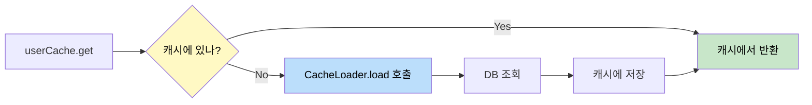
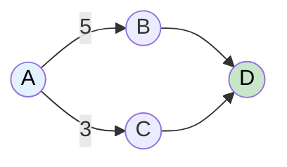
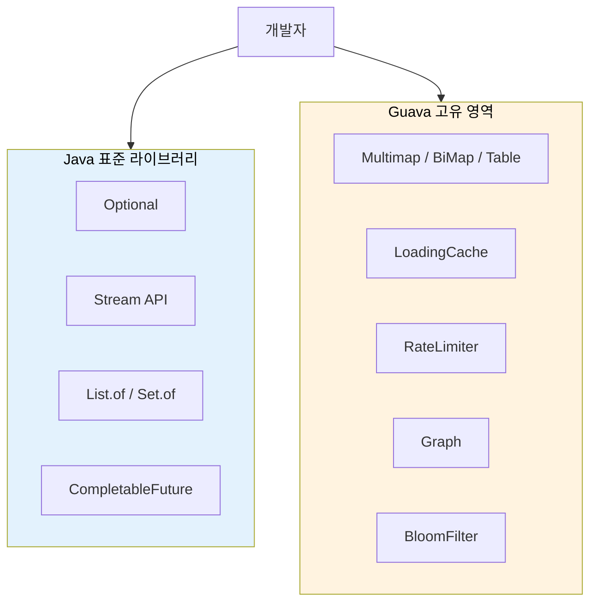

# Java가 발전해도 Guava가 여전히 쓰이는 이유

Google이 만든 Guava 라이브러리가 Java 표준 라이브러리의 발전에도 불구하고 2024-2025년에도 여전히 인기 있는 이유를 알아본다.

## 결론부터 말하면

**Guava는 "Java 표준이 커버하지 못하는 틈새"를 채운다.**

Java 8 이후 많은 Guava 기능이 표준에 흡수됐지만, **Multimap, BiMap, Table, LoadingCache, RateLimiter** 같은 고유 기능은 여전히 Java 표준에 없다.

```java
// Java 표준: 하나의 키에 여러 값을 저장하려면?
Map<String, List<String>> map = new HashMap<>();
map.computeIfAbsent("fruits", k -> new ArrayList<>()).add("apple");
map.computeIfAbsent("fruits", k -> new ArrayList<>()).add("banana");
// 매번 null 체크, 리스트 생성... 귀찮다

// Guava: 깔끔하다
Multimap<String, String> multimap = ArrayListMultimap.create();
multimap.put("fruits", "apple");
multimap.put("fruits", "banana");
// 끝!
```

## 1. Java가 Guava에서 흡수한 것들

Java 8부터 6개월마다 새 버전이 나오면서, Guava의 많은 기능이 표준 라이브러리에 들어갔다.

| Guava 기능 | Java 표준화 | 버전 |
|-----------|------------|------|
| `Optional` | `java.util.Optional` | Java 8 |
| `Function`, `Predicate` | `java.util.function.*` | Java 8 |
| `FluentIterable` | `Stream API` | Java 8 |
| `ListenableFuture` 일부 | `CompletableFuture` | Java 8 |
| `Charsets.UTF_8` | `StandardCharsets.UTF_8` | Java 7 |
| `ImmutableList.of()` | `List.of()` | Java 9 |
| `ImmutableSet.of()` | `Set.of()` | Java 9 |
| `ImmutableMap.of()` | `Map.of()` | Java 9 |

> **참고**: `ListenableFuture`는 `Futures.addCallback()`으로 직관적인 콜백 등록이 가능해서, 복잡한 체이닝 없이 간단한 비동기 처리를 할 때 여전히 유용하다. 특히 Android나 기존 Guava 기반 프로젝트에서 널리 쓰인다.

그렇다면 Guava는 이제 필요 없는 걸까?

**아니다.** Guava에는 여전히 Java 표준에 없는 강력한 기능들이 있다.

## 2. Java 표준에 없는 Guava 컬렉션

### Multimap: 하나의 키에 여러 값

실무에서 가장 자주 마주치는 상황이다. 사용자별 주문 목록, 카테고리별 상품 목록 등 **1:N 관계**를 맵으로 표현해야 할 때가 많다.

```java
// ❌ Java 표준: 보일러플레이트의 향연
Map<String, List<Order>> ordersByUser = new HashMap<>();

public void addOrder(String userId, Order order) {
    List<Order> orders = ordersByUser.get(userId);
    if (orders == null) {
        orders = new ArrayList<>();
        ordersByUser.put(userId, orders);
    }
    orders.add(order);
}

// Java 8+에서 조금 나아졌지만...
ordersByUser.computeIfAbsent(userId, k -> new ArrayList<>()).add(order);
// 여전히 매번 이걸 써야 한다

// ✅ Guava Multimap: 의도가 명확하다
Multimap<String, Order> ordersByUser = ArrayListMultimap.create();
ordersByUser.put(userId, order);  // 끝!

// 값이 없으면? 빈 컬렉션 반환 (NPE 없음)
Collection<Order> orders = ordersByUser.get("unknown");  // 빈 리스트
```

### BiMap: 양방향 매핑

키로 값을 찾고, 값으로도 키를 찾아야 할 때가 있다. 예를 들어 사용자 ID와 이메일 간의 매핑.

```java
// ❌ Java 표준: 두 개의 맵을 관리해야 한다
Map<String, String> idToEmail = new HashMap<>();
Map<String, String> emailToId = new HashMap<>();

public void addUser(String id, String email) {
    idToEmail.put(id, email);
    emailToId.put(email, id);  // 동기화 실수하면 버그!
}

// ✅ Guava BiMap: 일관성 보장
BiMap<String, String> userMapping = HashBiMap.create();
userMapping.put("user123", "user@example.com");

String email = userMapping.get("user123");           // user@example.com
String userId = userMapping.inverse().get("user@example.com");  // user123

// 중복 값 방지도 자동!
userMapping.put("user456", "user@example.com");  // IllegalArgumentException
```

### Table: 2차원 데이터 구조

행(Row)과 열(Column)으로 값을 저장해야 할 때. 엑셀 스프레드시트를 생각하면 된다.

```java
// ❌ Java 표준: 중첩 맵의 지옥
Map<String, Map<String, Integer>> scores = new HashMap<>();

public void setScore(String student, String subject, int score) {
    scores.computeIfAbsent(student, k -> new HashMap<>()).put(subject, score);
}

public Integer getScore(String student, String subject) {
    Map<String, Integer> subjects = scores.get(student);
    return subjects == null ? null : subjects.get(subject);
}

// ✅ Guava Table: 직관적이다
Table<String, String, Integer> scores = HashBasedTable.create();
scores.put("Alice", "Math", 95);
scores.put("Alice", "English", 88);
scores.put("Bob", "Math", 72);

int aliceMath = scores.get("Alice", "Math");  // 95

// 행 전체, 열 전체 조회도 간단
Map<String, Integer> aliceScores = scores.row("Alice");    // {Math=95, English=88}
Map<String, Integer> mathScores = scores.column("Math");   // {Alice=95, Bob=72}
```

### Multiset: 요소 개수 카운팅

같은 요소가 몇 번 등장했는지 세야 할 때. 단어 빈도수 계산, 투표 집계 등.

```java
// ❌ Java 표준: count 로직을 직접 구현
Map<String, Integer> wordCount = new HashMap<>();

for (String word : words) {
    wordCount.merge(word, 1, Integer::sum);
}

int appleCount = wordCount.getOrDefault("apple", 0);

// ✅ Guava Multiset: 의미가 명확하다
Multiset<String> wordCount = HashMultiset.create();
wordCount.addAll(words);

int appleCount = wordCount.count("apple");

// 가장 많이 등장한 요소 찾기
Multisets.copyHighestCountFirst(wordCount)
    .elementSet()
    .stream()
    .limit(10)
    .forEach(System.out::println);
```

## 3. 로컬 캐시: LoadingCache

Java 표준 라이브러리에는 **로컬 캐시 구현이 없다**. 직접 만들거나 외부 라이브러리를 써야 한다.

Guava의 `LoadingCache`는 매우 강력한 로컬 캐시를 제공한다.

```java
// Guava LoadingCache
LoadingCache<String, User> userCache = CacheBuilder.newBuilder()
    .maximumSize(10_000)                      // 최대 10,000개
    .expireAfterWrite(10, TimeUnit.MINUTES)  // 10분 후 만료
    .expireAfterAccess(5, TimeUnit.MINUTES)  // 5분간 미사용 시 만료
    .recordStats()                            // 통계 수집
    .build(new CacheLoader<>() {
        @Override
        public User load(String userId) {
            return userRepository.findById(userId);  // DB에서 로드
        }
    });

// 사용: 캐시에 있으면 반환, 없으면 자동 로드
User user = userCache.get("user123");

// 통계 확인
CacheStats stats = userCache.stats();
System.out.println("Hit rate: " + stats.hitRate());
System.out.println("Miss count: " + stats.missCount());
```



> **참고**: 더 고성능이 필요하다면 [Caffeine](https://github.com/ben-manes/caffeine) 라이브러리를 추천한다. Caffeine은 Guava Cache의 아이디어를 계승했지만, **Window TinyLFU** 알고리즘을 사용해 더 높은 히트율과 동시성 처리 성능을 제공한다. 새 프로젝트에서 로컬 캐시가 필요하다면 Caffeine이 더 나은 선택이다.

## 4. RateLimiter: API 속도 제한

외부 API 호출 시 초당 요청 수를 제한해야 할 때가 있다. Guava의 `RateLimiter`는 이를 간단하게 구현한다.

```java
// 초당 10개 요청으로 제한
RateLimiter rateLimiter = RateLimiter.create(10.0);

public void callExternalApi() {
    rateLimiter.acquire();  // 허용될 때까지 블로킹
    externalApi.call();
}

// 또는 타임아웃과 함께
public void callExternalApiWithTimeout() {
    if (rateLimiter.tryAcquire(1, TimeUnit.SECONDS)) {
        externalApi.call();
    } else {
        throw new RateLimitExceededException();
    }
}
```

Java 표준에는 이런 기능이 없다. 직접 구현하려면 `Semaphore`와 스케줄러를 조합해야 하는데, 버그 없이 만들기 쉽지 않다.

## 5. 그래프 자료구조

Java 표준 라이브러리에는 **그래프 자료구조가 없다**. 직접 구현해야 한다.

```java
// Guava Graph
MutableGraph<String> graph = GraphBuilder.directed().build();
graph.putEdge("A", "B");
graph.putEdge("A", "C");
graph.putEdge("B", "D");
graph.putEdge("C", "D");

// 연결된 노드 조회
Set<String> successors = graph.successors("A");  // [B, C]
Set<String> predecessors = graph.predecessors("D");  // [B, C]

// 가중치 그래프도 지원
MutableValueGraph<String, Integer> weightedGraph =
    ValueGraphBuilder.directed().build();
weightedGraph.putEdgeValue("A", "B", 5);
weightedGraph.putEdgeValue("A", "C", 3);
```



## 6. 기타 유용한 유틸리티

### Preconditions: 간결한 검증

```java
// Java 표준
public void process(String name, int count) {
    if (name == null) {
        throw new NullPointerException("name cannot be null");
    }
    if (count <= 0) {
        throw new IllegalArgumentException("count must be positive");
    }
}

// Guava Preconditions: 한 줄로
public void process(String name, int count) {
    checkNotNull(name, "name cannot be null");
    checkArgument(count > 0, "count must be positive, got: %s", count);
}
```

### Strings 유틸리티

```java
// null-safe 문자열 처리
Strings.nullToEmpty(null);      // ""
Strings.emptyToNull("");        // null
Strings.isNullOrEmpty(str);     // null이거나 빈 문자열인지

// 패딩
Strings.padStart("7", 3, '0');  // "007"
Strings.padEnd("a", 3, '-');    // "a--"

// 공통 접두사/접미사
Strings.commonPrefix("abc", "abd");  // "ab"
Strings.commonSuffix("abc", "dbc");  // "bc"
```

### Hashing: 다양한 해시 함수

```java
// 표준 Java보다 다양한 해시 알고리즘
HashFunction murmur3 = Hashing.murmur3_128();
HashCode hashCode = murmur3.hashString("hello", StandardCharsets.UTF_8);

// Bloom Filter도 지원
BloomFilter<String> filter = BloomFilter.create(
    Funnels.stringFunnel(StandardCharsets.UTF_8),
    1000,  // 예상 삽입 수
    0.01   // 오탐률 1%
);

filter.put("apple");
filter.mightContain("apple");   // true
filter.mightContain("banana");  // false (아마도)
```

## 7. 언제 Guava를 쓰고, 언제 Java 표준을 쓸까?

| 상황 | 추천 |
|------|------|
| `Optional`, `Stream`, 함수형 인터페이스 | **Java 표준** |
| 불변 컬렉션 (`List.of()`, `Set.of()`) | **Java 표준** |
| 비동기 처리 (`CompletableFuture`) | **Java 표준** |
| 1:N 매핑 (Multimap) | **Guava** |
| 양방향 매핑 (BiMap) | **Guava** |
| 2차원 데이터 (Table) | **Guava** |
| 로컬 캐시 | **Guava** 또는 Caffeine |
| API 속도 제한 | **Guava** |
| 그래프 자료구조 | **Guava** |
| Bloom Filter | **Guava** |

## 8. Guava 사용 시 주의사항

### 버전 관리

Guava는 **버전별 호환성 정책이 엄격하지 않다**. 메이저 버전 업그레이드 시 deprecated API가 제거될 수 있으니 주의해야 한다.

특히 여러 라이브러리가 서로 다른 버전의 Guava에 의존하면 **의존성 지옥**(Dependency Hell)을 경험하기 쉽다. 충돌을 미리 파악하려면:

```bash
# Maven
mvn dependency:tree | grep guava

# Gradle
./gradlew dependencies | grep guava
```

```xml
<!-- Maven -->
<dependency>
    <groupId>com.google.guava</groupId>
    <artifactId>guava</artifactId>
    <version>33.5.0-jre</version>
</dependency>
```

### Java 버전과 Guava 버전

| Guava 버전 | 아티팩트 | 최소 Java 버전 |
|-----------|---------|---------------|
| 32.x 이상 | `guava-jre` | **Java 11+** |
| 32.x 이상 | `guava-android` | Java 8+ |
| 31.x 이하 | `guava` | Java 8+ |

> ⚠️ **주의**: `-jre` 버전은 Java 11 이상이 필요하다. Java 8 환경에서는 반드시 `-android` 버전을 사용해야 한다.

Android를 지원하거나 Java 8 환경이라면 `-android` suffix 버전을 사용한다:

```xml
<artifactId>guava</artifactId>
<version>33.5.0-android</version>
```

### 표준화된 기능은 Java 표준으로

Guava 팀도 Java 표준에 같은 기능이 있으면 표준을 사용하라고 권장한다.

```java
// ❌ 이제는 불필요
import com.google.common.base.Optional;
import com.google.common.base.Function;

// ✅ Java 표준 사용
import java.util.Optional;
import java.util.function.Function;
```

## 마무리



Java는 계속 발전하고 있지만, 모든 유용한 자료구조와 유틸리티를 표준에 넣을 수는 없다. Guava는 그 틈새를 채워주는 역할을 하며, Google 내부에서 실제로 사용하면서 검증된 라이브러리다.

**Guava를 쓸지 말지 고민된다면:**
- Java 표준에 같은 기능이 있다면 → 표준 사용
- Java 표준에 없는 기능이 필요하다면 → Guava 고려

---

## 출처

- [GitHub - google/guava](https://github.com/google/guava) - 공식 저장소
- [Guava Wiki](https://github.com/google/guava/wiki) - 공식 문서
- [Guava 공식 사이트](https://guava.dev/)
- [Most popular libraries used by Java developers 2025 - Diffblue](https://www.diffblue.com/resources/most-popular-libraries-used-by-java-developers/)
- [Apache Commons Collections vs Google Guava | Baeldung](https://www.baeldung.com/apache-commons-collections-vs-guava)
