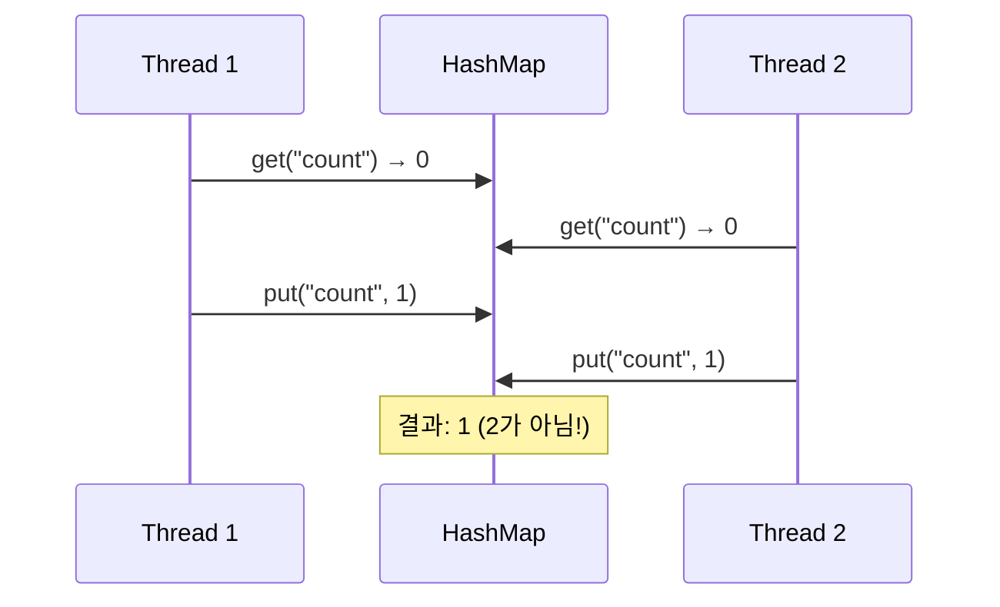
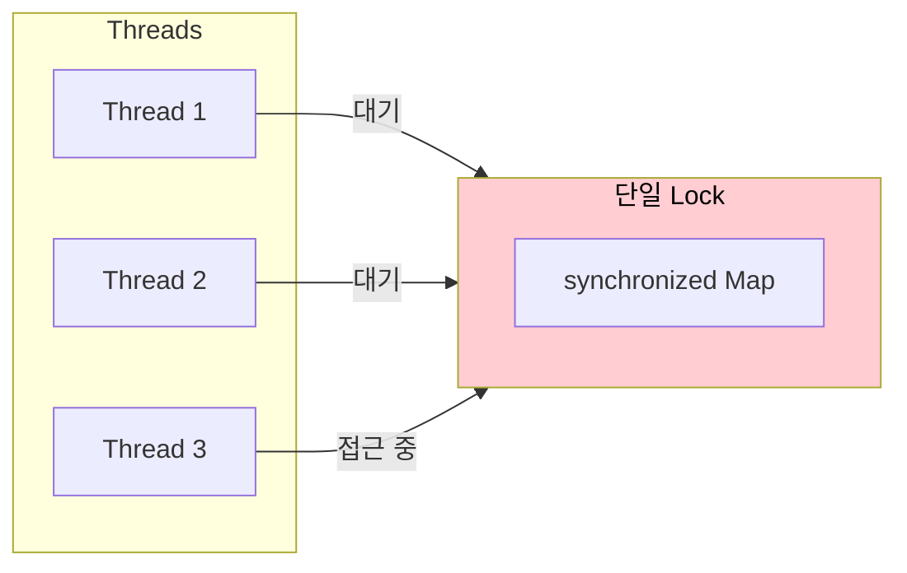
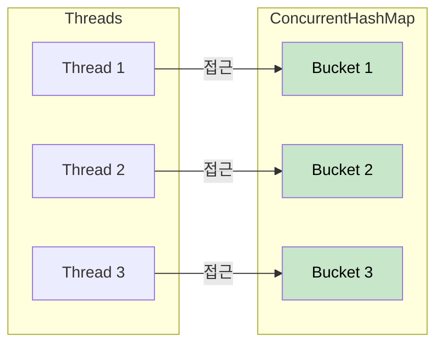
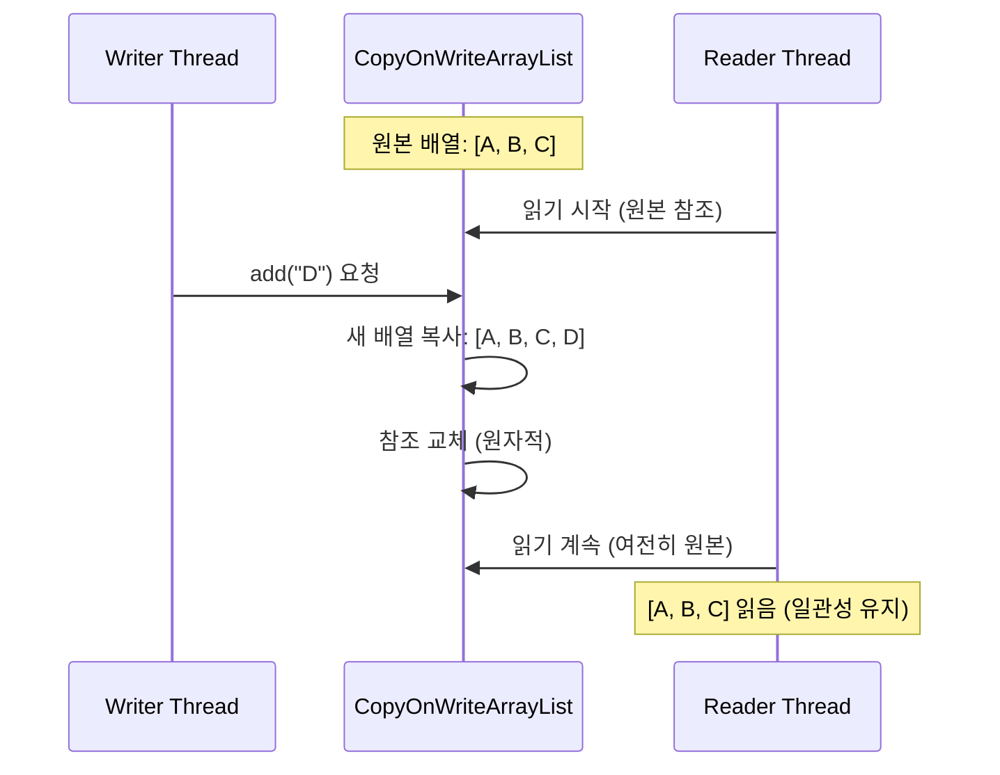
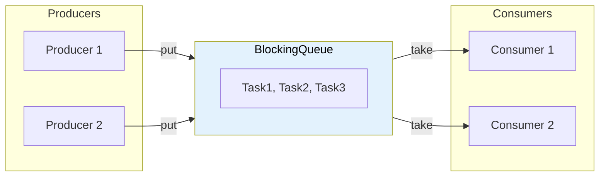
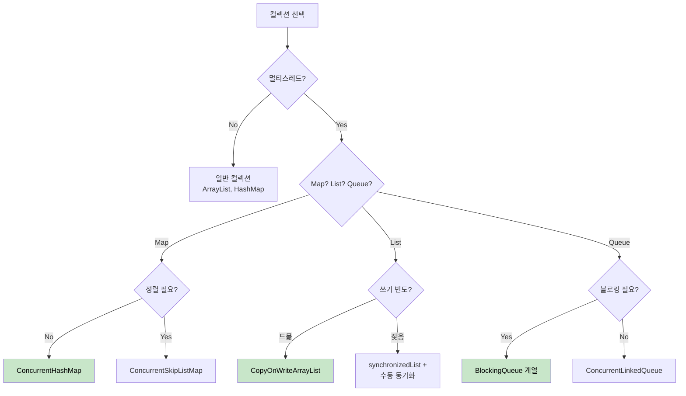

# Java의 동기화 컬렉션과 병렬 컬렉션

멀티스레드 환경에서 안전하게 컬렉션을 사용하는 두 가지 방법을 비교한다.

## 결론부터 말하면

**대부분의 경우 `ConcurrentHashMap`, `CopyOnWriteArrayList` 같은 병렬 컬렉션을 사용하라.**

`Collections.synchronizedXxx()`는 단순하지만 성능이 낮고, 복합 연산에서 여전히 동기화 문제가 발생한다.

```java
// ❌ synchronized 컬렉션 - 전체 잠금, 느림
Map<String, Integer> syncMap = Collections.synchronizedMap(new HashMap<>());

// ✅ 병렬 컬렉션 - 세분화된 잠금, 빠름
Map<String, Integer> concurrentMap = new ConcurrentHashMap<>();
```

| 방식 | 잠금 단위 | 읽기 성능 | 복합 연산 | 권장도 |
|------|----------|----------|----------|--------|
| synchronized 컬렉션 | 전체 | 느림 | 별도 동기화 필요 | 레거시 |
| 병렬 컬렉션 | 세분화/락프리 | 빠름 | 원자적 메서드 제공 | ✅ |

---

## 1. 왜 필요한가?

일반 컬렉션(`ArrayList`, `HashMap`)은 스레드 안전하지 않다. 여러 스레드가 동시에 접근하면 데이터가 손상된다.

```java
// 문제 상황: 두 스레드가 동시에 HashMap에 접근
Map<String, Integer> map = new HashMap<>();

// Thread 1
map.put("count", map.getOrDefault("count", 0) + 1);

// Thread 2 (동시 실행)
map.put("count", map.getOrDefault("count", 0) + 1);

// 기대값: 2, 실제값: 1 또는 2 (비결정적)
```



이 문제를 해결하는 두 가지 접근법이 있다.

---

## 2. synchronized 컬렉션

### 2.1 사용법

`Collections.synchronizedXxx()` 메서드로 래핑한다.

```java
List<String> syncList = Collections.synchronizedList(new ArrayList<>());
Map<String, Integer> syncMap = Collections.synchronizedMap(new HashMap<>());
Set<String> syncSet = Collections.synchronizedSet(new HashSet<>());
```

### 2.2 동작 원리

모든 메서드가 `synchronized` 블록으로 감싸져 있다. 한 번에 하나의 스레드만 접근 가능하다.

```java
// Collections.synchronizedMap 내부 구조 (단순화)
public V get(Object key) {
    synchronized (mutex) {  // 전체 잠금
        return m.get(key);
    }
}

public V put(K key, V value) {
    synchronized (mutex) {  // 같은 락 사용
        return m.put(key, value);
    }
}
```



### 2.3 문제점: 복합 연산

개별 메서드는 스레드 안전하지만, **복합 연산**은 여전히 위험하다.

```java
Map<String, Integer> syncMap = Collections.synchronizedMap(new HashMap<>());

// ❌ 위험: check-then-act 패턴
if (!syncMap.containsKey("key")) {   // 체크
    syncMap.put("key", 1);            // 행동 (이 사이에 다른 스레드가 끼어들 수 있음)
}

// ✅ 수동 동기화 필요
synchronized (syncMap) {
    if (!syncMap.containsKey("key")) {
        syncMap.put("key", 1);
    }
}
```

### 2.4 문제점: 반복자(Iterator)

반복 중에 다른 스레드가 수정하면 `ConcurrentModificationException`이 발생한다.

```java
// ❌ 예외 발생 가능
for (String item : syncList) {
    System.out.println(item);
}

// ✅ 수동 동기화 필요
synchronized (syncList) {
    for (String item : syncList) {
        System.out.println(item);
    }
}
```

---

## 3. 병렬 컬렉션 (java.util.concurrent)

Java 5에서 도입된 `java.util.concurrent` 패키지는 더 세련된 동시성 컬렉션을 제공한다.

### 3.1 ConcurrentHashMap

가장 많이 사용되는 병렬 컬렉션이다.

```java
ConcurrentHashMap<String, Integer> map = new ConcurrentHashMap<>();

// 원자적 복합 연산 제공
map.putIfAbsent("key", 1);                    // 없으면 넣기
map.computeIfAbsent("key", k -> compute());   // 없으면 계산해서 넣기
map.merge("count", 1, Integer::sum);          // 있으면 합치기
```

**동작 원리: 세분화된 잠금**

`ConcurrentHashMap`은 전체가 아닌 **부분만 잠금**을 건다. 예를 들어 Map에 10개 요소가 있을 때, 1개를 처리하면 그 부분만 락을 걸고 나머지는 다른 스레드가 접근할 수 있다.

| 버전 | 잠금 방식 |
|------|----------|
| Java 7 이전 | **세그먼트(Segment)** 단위 잠금 (기본 16개 세그먼트) |
| Java 8 이후 | **버킷(Bucket)** 단위 잠금 + CAS 연산 (더 세분화됨) |

Java 8에서 버킷 단위로 변경되면서 동시성 성능이 크게 향상되었다.

추가로 Java 8에서는 해시 충돌 최적화도 도입되었다. 버킷 내 노드 수가 8개를 초과하면 링크드 리스트가 **Red-Black Tree**로 전환된다. 이로 인해 최악의 경우에도 검색 시간 복잡도가 O(n)에서 O(log n)으로 개선된다.



**주의: size()와 isEmpty()는 근사치**

`ConcurrentHashMap`의 `size()`는 정확한 값이 아닐 수 있다. 동시 수정 중에는 근사치를 반환한다.

```java
// 정확한 크기가 필요하면 mappingCount() 사용 (long 반환)
long count = map.mappingCount();
```

### 3.2 CopyOnWriteArrayList

**읽기가 압도적으로 많고, 쓰기가 드문 경우**에 적합하다.

```java
CopyOnWriteArrayList<String> list = new CopyOnWriteArrayList<>();

list.add("item");  // 쓰기: 전체 배열 복사 (비용 큼)

for (String item : list) {  // 읽기: 락 없음, 빠름
    System.out.println(item);
}
```

**동작 원리: 쓰기 시 복사**



**언제 사용하는가?**

| 상황 | 적합 여부 |
|------|----------|
| 이벤트 리스너 목록 | ✅ 등록/해제는 드물고, 이벤트 발생 시 순회 빈번 |
| 캐시 (읽기 99%, 쓰기 1%) | ✅ |
| 자주 변경되는 목록 | ❌ 복사 비용 과다 |

### 3.3 BlockingQueue

생산자-소비자 패턴에 최적화된 큐다.

```java
BlockingQueue<Task> queue = new LinkedBlockingQueue<>(100);

// 생산자
queue.put(task);      // 큐가 가득 차면 대기
queue.offer(task, 1, TimeUnit.SECONDS);  // 타임아웃

// 소비자
Task task = queue.take();   // 큐가 비면 대기
Task task = queue.poll(1, TimeUnit.SECONDS);  // 타임아웃
```



**BlockingQueue 구현체 비교**

| 구현체 | 특징 | 용도 |
|--------|------|------|
| `ArrayBlockingQueue` | 고정 크기, 공정성 옵션 | 바운디드 버퍼 |
| `LinkedBlockingQueue` | 가변 크기 (기본 무제한) | 일반적인 작업 큐 |
| `PriorityBlockingQueue` | 우선순위 정렬 | 우선순위 작업 처리 |
| `SynchronousQueue` | 크기 0, 직접 전달 | 핸드오프 시나리오 |

### 3.4 ConcurrentLinkedQueue

**블로킹이 필요 없는 고성능 큐**다. `BlockingQueue`와 달리 대기하지 않는다.

```java
ConcurrentLinkedQueue<Task> queue = new ConcurrentLinkedQueue<>();

queue.offer(task);        // 항상 성공 (무제한 크기)
Task task = queue.poll(); // 비어있으면 null 반환 (블로킹 안 함)
```

| 특성 | BlockingQueue | ConcurrentLinkedQueue |
|------|--------------|----------------------|
| 비어있을 때 | `take()` 블로킹 | `poll()` null 반환 |
| 가득 찼을 때 | `put()` 블로킹 | 무제한 (항상 성공) |
| 용도 | 생산자-소비자 | 비블로킹 작업 전달 |

### 3.5 ConcurrentSkipListMap / ConcurrentSkipListSet

**정렬이 필요한 경우** 사용한다. `TreeMap`/`TreeSet`의 병렬 버전이다.

```java
ConcurrentSkipListMap<String, Integer> sortedMap = new ConcurrentSkipListMap<>();
sortedMap.put("banana", 2);
sortedMap.put("apple", 1);
sortedMap.put("cherry", 3);

// 정렬된 순서로 순회
sortedMap.forEach((k, v) -> System.out.println(k));  // apple, banana, cherry
```

---

## 4. 비교 정리

### 4.1 synchronized vs concurrent

| 특성 | synchronized 컬렉션 | 병렬 컬렉션 |
|------|-------------------|------------|
| **잠금 범위** | 전체 컬렉션 | 세분화 (버킷, 세그먼트) |
| **읽기 성능** | 느림 (락 필요) | 빠름 (락프리 또는 최소 락) |
| **복합 연산** | 수동 동기화 필요 | 원자적 메서드 제공 |
| **반복자** | fail-fast (예외 발생) | weakly consistent (예외 없음) |
| **null 허용** | 허용 | 대부분 불허 |

### 4.2 선택 가이드



> **주의:** 쓰기가 잦은 List의 경우 `synchronizedList`는 전체 락으로 인해 성능이 크게 저하된다. 고부하 환경에서는 설계 자체를 재검토하거나 (예: 작업을 Queue로 분리) 다른 자료구조를 고려하라.

---

## 5. 실전 예제

### 5.1 캐시 구현

```java
public class SimpleCache<K, V> {
    private final ConcurrentHashMap<K, V> cache = new ConcurrentHashMap<>();

    public V get(K key, Function<K, V> loader) {
        // computeIfAbsent: 원자적으로 "없으면 계산해서 넣기"
        return cache.computeIfAbsent(key, loader);
    }

    public void invalidate(K key) {
        cache.remove(key);
    }
}

// 사용
SimpleCache<String, User> userCache = new SimpleCache<>();
User user = userCache.get("user:123", id -> userRepository.findById(id));
```

### 5.2 이벤트 리스너 관리

```java
public class EventBus {
    private final CopyOnWriteArrayList<EventListener> listeners = new CopyOnWriteArrayList<>();

    public void register(EventListener listener) {
        listeners.add(listener);
    }

    public void unregister(EventListener listener) {
        listeners.remove(listener);
    }

    public void publish(Event event) {
        // 순회 중 등록/해제해도 안전
        for (EventListener listener : listeners) {
            listener.onEvent(event);
        }
    }
}
```

### 5.3 작업 큐 (생산자-소비자)

```java
public class TaskProcessor {
    private final BlockingQueue<Runnable> taskQueue = new LinkedBlockingQueue<>(1000);
    private final ExecutorService executor = Executors.newFixedThreadPool(4);

    public void start() {
        for (int i = 0; i < 4; i++) {
            executor.submit(() -> {
                while (!Thread.currentThread().isInterrupted()) {
                    try {
                        Runnable task = taskQueue.take();  // 블로킹
                        task.run();
                    } catch (InterruptedException e) {
                        Thread.currentThread().interrupt();
                        break;
                    }
                }
            });
        }
    }

    public void submit(Runnable task) throws InterruptedException {
        taskQueue.put(task);  // 큐가 가득 차면 대기
    }
}
```

---

## 6. 주의사항

### 6.1 ConcurrentHashMap의 null 금지

```java
ConcurrentHashMap<String, String> map = new ConcurrentHashMap<>();

map.put("key", null);      // ❌ NullPointerException
map.put(null, "value");    // ❌ NullPointerException

// HashMap은 null 허용
HashMap<String, String> hashMap = new HashMap<>();
hashMap.put("key", null);  // ✅ OK
```

왜 null을 금지하는가? `get(key)`이 `null`을 반환할 때, "키가 없음"인지 "값이 null임"인지 구분할 수 없기 때문이다. 단일 스레드에서는 `containsKey()`로 확인할 수 있지만, 멀티스레드에서는 그 사이에 상태가 바뀔 수 있다.

### 6.2 반복자의 일관성

```java
ConcurrentHashMap<String, Integer> map = new ConcurrentHashMap<>();

// weakly consistent: 반복 중 수정되어도 예외 없음
// 단, 수정 내용이 반영될 수도 있고 안 될 수도 있음
for (Map.Entry<String, Integer> entry : map.entrySet()) {
    // 다른 스레드가 map을 수정해도 ConcurrentModificationException 없음
    System.out.println(entry);
}
```

### 6.3 복합 연산은 원자적 메서드 사용

```java
ConcurrentHashMap<String, Integer> map = new ConcurrentHashMap<>();

// ❌ 여전히 위험 (두 연산 사이에 다른 스레드 개입 가능)
Integer old = map.get("count");
map.put("count", old + 1);

// ✅ 원자적 연산 사용
map.compute("count", (k, v) -> (v == null) ? 1 : v + 1);
map.merge("count", 1, Integer::sum);
```

---

## 7. 정리

| 컬렉션 | 용도 | 핵심 특징 |
|--------|------|----------|
| `ConcurrentHashMap` | 범용 Map | 세분화 잠금, 원자적 연산 |
| `CopyOnWriteArrayList` | 읽기 위주 List | 쓰기 시 복사, 락프리 읽기 |
| `BlockingQueue` | 생산자-소비자 | 블로킹 put/take |
| `ConcurrentSkipListMap` | 정렬 Map | 병렬 + 정렬 |
| `Collections.synchronizedXxx` | 레거시 | 전체 잠금, 복합 연산 주의 |

---

## 출처

- [Java Concurrency in Practice](https://jcip.net/) - Brian Goetz
- [Oracle Java Documentation - Concurrent Collections](https://docs.oracle.com/javase/tutorial/essential/concurrency/collections.html)
