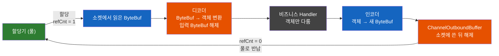
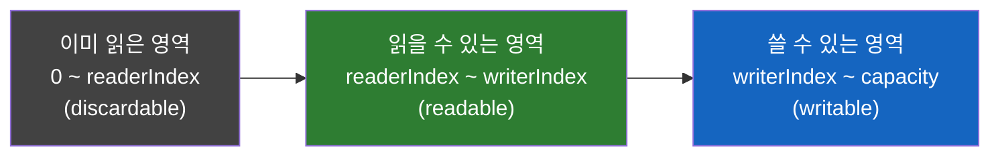

# Netty ByteBuf — GC가 있는 자바에서 왜 메모리를 직접 release()할까?

자바 개발자는 메모리 해제를 GC에 맡기는 데 익숙하다. 그런데 Netty에서는 `ByteBuf`를 다 쓰면 `release()`를 직접 호출해야 하고, 빠뜨리면 메모리가 샌다. Netty는 왜 GC를 두고 C처럼 메모리를 관리하게 만들었을까? 그리고 누가, 언제 `release()`를 불러야 할까?

## 결론부터 말하면

**GC는 "이 메모리를 이제 아무도 안 쓴다"는 사실을 제때 알려주지 못한다. 그래서 Netty는 버퍼를 풀(pool)에 돌려줄 시점을 GC가 아니라 참조 카운트로 직접 정한다.** 이렇게까지 하는 이유는 소켓 I/O에 유리한 direct memory를 빠르게 재사용하기 위해서다. 그 대가로 개발자는 규칙 하나를 지켜야 한다. **ByteBuf를 마지막으로 다룬 쪽이 `release()`를 호출한다.**



| 상황 | `release()` 책임 |
|------|------|
| Handler가 받은 ByteBuf를 다 쓰고 끝냄 (소비) | 그 Handler |
| `ctx.fireChannelRead(msg)`로 다음 Handler에 넘김 | 넘겨받은 Handler |
| `ctx.write(msg)`로 내보냄 | Netty (전송 후, 실패나 취소 시에도) |
| `SimpleChannelInboundHandler<T>`가 타입이 맞는 메시지를 받음 | 자동 (`channelRead0()`이 끝난 뒤) |
| 아무 Handler도 처리하지 않고 파이프라인 끝에 도달 | Netty (파이프라인 끝에서 해제, debug 로그만 남김) |

> 이 글은 Netty 시리즈 3편이다. [입문편](./Netty-자바에-이미-NIO가-있는데-왜-Netty를-쓸까.md), [EventLoop편](./Netty-EventLoop-스레드-하나가-수천-연결을-맡는-규칙과-그-대가.md)에 이어 Netty 4.2 기준으로 설명한다.

## 1. 왜 GC에 맡기지 않을까?

### 1.1 출발점: 소켓 I/O는 heap 밖 메모리를 좋아한다

자바의 바이트 버퍼는 두 종류다. **heap buffer** 는 JVM 힙에 있는 `byte[]` 위에 만들어지고(`ByteBuffer.allocate()`), **direct buffer** 는 JVM 힙 밖의 네이티브 메모리에 만들어진다(`ByteBuffer.allocateDirect()`). 운영체제의 소켓 읽기·쓰기는 네이티브 메모리를 대상으로 동작한다.

`ByteBuffer` 공식 문서는 direct buffer에 대해 "JVM이 그 위에서 바로 네이티브 I/O를 수행하려고 최선을 다하며, 중간 버퍼로 내용을 복사하는 것을 피하려 한다"고 설명한다. 반대로 heap buffer를 소켓에 쓰면 어떻게 될까? OpenJDK의 `IOUtil.write()`를 보면 답이 나온다.

```java
// OpenJDK sun.nio.ch.IOUtil.write()를 단순화
if (src instanceof DirectBuffer) {
    return writeFromNativeBuffer(fd, src, ...);        // direct buffer면 바로 쓴다
}
// "Substitute a native buffer"
ByteBuffer bb = Util.getTemporaryDirectBuffer(rem);    // heap buffer면 임시 direct buffer를 빌려
bb.put(src);                                           // 내용을 한 번 복사한 뒤
int n = writeFromNativeBuffer(fd, bb, ...);            // 그것을 쓴다
```

heap buffer로 소켓에 쓰면 매번 임시 direct buffer로 한 번 더 복사하는 셈이다. 데이터를 끊임없이 주고받는 네트워크 서버라면 처음부터 direct buffer를 쓰는 편이 자연스럽다.

### 1.2 그런데 direct buffer는 만들고 버리기가 비싸다

여기서 문제가 생긴다. 같은 `ByteBuffer` 문서는 direct buffer가 "대체로 할당과 해제 비용이 더 높고", 내용이 "GC가 관리하는 일반 힙 밖에 있을 수 있다"고 경고한다. 그래서 direct buffer는 **크고 오래 사는 버퍼** 에 주로 쓰라고 권한다.

그런데 네트워크 서버가 필요로 하는 버퍼는 정반대다. 메시지 하나를 읽을 때마다 작은 버퍼가 생겼다가 금방 버려진다. 비싼 direct buffer를 메시지마다 만들고 버리면 감당할 수 없다. 해법은 하나다. 큰 메모리 덩어리를 미리 확보해 두고, 잘게 나눠 빌려줬다가 돌려받아 다시 쓰는 것, 즉 **풀링(pooling)** 이다.

### 1.3 풀을 쓰려면 "언제 다 썼는지"를 알아야 한다

풀링에는 전제가 있다. 빌려준 버퍼를 **다 쓰자마자** 돌려받아야 한다. 그렇다면 GC에게 맡기면 안 될까? 버퍼 객체가 쓰레기가 되는 순간을 GC가 알려주면 그때 풀로 돌려받으면 된다.

하지만 GC는 언제 돌지 예측할 수 없고, 돌기 전까지는 그 버퍼가 아무도 쓰지 않는 메모리인지 알 방법이 없다. 그동안 풀은 메모리를 돌려받지 못한 채 계속 새로 할당해야 한다. Netty 공식 위키는 이를 이렇게 정리한다. **"GC와 reference queue는 객체에 더 이상 도달할 수 없다는 사실을 효율적이고 실시간으로 보장하지 못한다."**

그래서 Netty는 GC 대신 **참조 카운팅(reference counting)** 을 택했다. 버퍼마다 "지금 이 버퍼를 쓰는 쪽의 수"를 세는 카운터를 두고, 카운터가 0이 되는 순간 즉시 풀로 돌려보낸다. 반납 시점이 예측 가능해지는 대신, 카운터를 줄이는 책임은 개발자에게 넘어온다.

이 선택의 효과는 실제로 측정되었다. Twitter가 Netty 3과 Netty 4로 각각 에코 서버를 띄워 16,384개 연결로 비교한 결과, GC 일시 정지는 분당 45.5회에서 9.2회로, 쓰레기 생성량은 초당 207.11MiB에서 41.81MiB로 줄었다. 다만 InfoQ 기사는 원인을 두 가지로 꼽는다. 풀링 버퍼 할당기, 그리고 I/O 이벤트마다 만들던 짧게 사는 이벤트 객체를 없앤 것이다. 풀링만의 효과는 아니라는 점을 기억해 두자.

## 2. ByteBuf는 어떻게 생겼나

### 2.1 인덱스 두 개, 영역 세 개

`ByteBuf`는 읽는 위치(`readerIndex`)와 쓰는 위치(`writerIndex`)를 따로 가진다. 이 두 인덱스가 버퍼를 세 영역으로 나눈다. `ByteBuffer`처럼 `flip()`으로 모드를 바꿀 필요가 없는 이유이고, 그 차이는 [입문편 2.4](./Netty-자바에-이미-NIO가-있는데-왜-Netty를-쓸까.md)에서 비교했다.



이름이 `read`·`write`로 시작하는 메서드는 해당 인덱스를 움직이고, `get`·`set`으로 시작하는 메서드는 위치를 직접 지정해 읽고 쓰되 인덱스는 건드리지 않는다. 쓸 공간이 모자라면 `writeXxx()`가 버퍼를 `maxCapacity`까지 자동으로 늘린다. `ByteBuf` 클래스 javadoc에는 "쓸 공간이 없으면 `IndexOutOfBoundsException`"이라는 오래된 문구가 남아 있지만, 실제 구현(`AbstractByteBuf.ensureWritable0()`)은 `maxCapacity`를 넘을 때만 예외를 던진다.

```java
ByteBuf buf = ctx.alloc().buffer(16);   // Channel의 할당기에서 받는다 (refCnt = 1)
buf.writeInt(42);                       // writerIndex 0 → 4
buf.writeLong(7L);                      // writerIndex 4 → 12
int a = buf.readInt();                  // readerIndex 0 → 4
long b = buf.getLong(4);                // 위치 지정 읽기, readerIndex는 그대로 4
buf.writeBytes(new byte[100]);          // 용량 16을 넘으면 maxCapacity까지 자동 확장
buf.release();                          // refCnt 1 → 0, 할당기로 반납
```

### 2.2 할당기: 메모리를 어디서 받아 오나

Handler 안에서는 `Unpooled.buffer()`로 직접 만들기보다 `ctx.alloc()`으로 Channel에 설정된 할당기에서 받는 것이 기본이다. Netty는 direct memory를 해제할 수단이 있는 환경이면 기본적으로 direct buffer를 우선한다(`-Dio.netty.noPreferDirect=true`로 끌 수 있다). 기본 할당기는 4.2에서 바뀌었다.

| 할당기 | 방식 | 기본값 |
|------|------|------|
| `PooledByteBufAllocator` | jemalloc 논문의 아이디어를 따른 arena 구조와 스레드별 캐시 | 4.1 기본 |
| `AdaptiveByteBufAllocator` | magazine 여러 개에 스레드를 id로 나눠 배정하고, 할당 크기 히스토그램을 보고 chunk 크기를 스스로 조정(99퍼센타일 크기 10개를 담을 정도) | 4.2 기본 |
| `Unpooled` / `UnpooledByteBufAllocator` | 풀 없이 매번 새로 할당 | 테스트·단순 용도 |

여기에 이상한 점이 하나 있다. 4.2의 기본값인 `AdaptiveByteBufAllocator`의 javadoc에는 아직 **"experimental"** 이라고 적혀 있다. 4.2 마이그레이션 가이드도 adaptive가 "모두에게 최선은 아니며, 어떤 워크로드에서는 더 낫고 어떤 워크로드에서는 더 나쁠 수 있다"고 말한다. 그래서 가이드는 4.1에서 4.2로 올릴 때 먼저 `-Dio.netty.allocator.type=pooled`로 기존 할당기를 고정한 채 업그레이드하고, 문제가 없으면 그 설정을 지워 adaptive로 넘어가는 두 단계를 권한다. 넘어간 뒤에는 heap·direct 메모리 사용량과 GC 동작을 지켜보라고 한다.

## 3. 참조 카운팅: 누가 release()를 부르나

### 3.1 카운터의 규칙

참조 카운트(`refCnt`)는 단순하게 움직인다. 할당되면 1에서 시작하고, `retain()`은 1을 더하고, `release()`는 1을 뺀다. 0이 되는 순간 버퍼는 할당기로 돌아가며, 이때 `release()`는 `true`를 반환한다. 0이 된 버퍼에 다시 접근하면 `IllegalReferenceCountException`이 발생한다.

이 카운터를 누가 줄여야 하는지에 대해 Netty 위키는 규칙 하나를 준다. **"참조 카운트 객체에 마지막으로 접근하는 쪽이 그 객체를 해제할 책임을 진다."** 파이프라인으로 옮기면 다음과 같다.

### 3.2 인바운드: 소비하면 해제하고, 넘기면 받은 쪽에 맡긴다

받은 ByteBuf를 Handler에서 다 쓰고 끝낸다면 그 Handler가 마지막 사용자다. 예외가 나도 해제되도록 `finally`에서 부른다. 반대로 `ctx.fireChannelRead(msg)`로 다음 Handler에 넘긴다면 마지막 사용자는 다음 Handler이므로 여기서는 해제하지 않는다.

```java
@Override
public void channelRead(ChannelHandlerContext ctx, Object msg) {
    ByteBuf buf = (ByteBuf) msg;
    if (isHeartbeat(buf)) {
        try {
            updateLastSeen();           // 여기서 소비하고 끝낸다
        } finally {
            buf.release();              // 마지막 사용자 = 이 Handler
        }
    } else {
        ctx.fireChannelRead(buf);       // 다음 Handler에 넘긴다. 여기서는 해제하지 않는다
    }
}
```

매번 이렇게 쓰기 번거롭기 때문에 `SimpleChannelInboundHandler<T>`가 있다. 소스를 보면 자동 해제의 범위가 정확히 보인다.

```java
// Netty 4.2 SimpleChannelInboundHandler.channelRead()를 단순화
boolean release = true;
try {
    if (acceptInboundMessage(msg)) {    // 메시지 타입이 T와 맞으면
        channelRead0(ctx, (I) msg);     // 처리하고
    } else {
        release = false;                // 맞지 않으면 해제하지 않고
        ctx.fireChannelRead(msg);       // 다음 Handler로 넘긴다
    }
} finally {
    if (autoRelease && release) {
        ReferenceCountUtil.release(msg);   // 타입이 맞았던 메시지만 자동 해제
    }
}
```

타입이 맞는 메시지만 `channelRead0()`이 끝난 뒤 자동으로 해제된다. 그래서 `channelRead0()` 안에서 받은 버퍼를 나중에 쓰려고 어딘가에 저장하거나 다른 스레드로 넘기면, 쓰려는 시점에는 이미 해제되어 있다. 이 함정은 [EventLoop편 4.2](./Netty-EventLoop-스레드-하나가-수천-연결을-맡는-규칙과-그-대가.md)에서도 다뤘다.

디코더도 같은 규칙을 따른다. `ByteToMessageDecoder`를 상속한 디코더는 들어온 ByteBuf를 내부 누적 버퍼에 합치고 다 쓴 버퍼를 기반 클래스가 해제하므로, 디코더를 구현하는 쪽이 입력 버퍼를 직접 해제할 일은 없다. 다만 `LengthFieldBasedFrameDecoder` 같은 프레임 디코더는 잘라낸 프레임을 `retainedSlice()`로 만든 **새 ByteBuf** 로 넘긴다. 이 프레임의 마지막 사용자는 다음 Handler다.

그렇다면 아무 Handler도 처리하지 않은 메시지는 어떻게 될까? 파이프라인 끝까지 흘러간 메시지는 Netty가 해제한다. 다만 "Discarded inbound message ... reached at the tail of the pipeline"이라는 로그를 **debug 레벨** 로만 남긴다. 운영 환경 로그 설정에서는 보이지 않으므로, 파이프라인 구성 실수로 메시지가 아무 데도 처리되지 않아도 조용히 넘어간다.

### 3.3 아웃바운드: write()에 넘기면 Netty 몫

`ctx.write(msg)`를 호출하는 순간 그 ByteBuf의 마지막 사용자는 Netty가 된다. Netty는 메시지를 `ChannelOutboundBuffer`에 쌓아 두었다가, 소켓에 다 쓴 뒤에, 그리고 쓰기가 실패하거나 취소되었을 때에도 해제한다. 그래서 입문편의 에코 서버가 받은 `msg`를 `ctx.write(msg)`로 돌려보내기만 하고 직접 해제하지 않는 것은 올바른 코드다.

반대로 흔한 실수는 `write()`한 뒤에 "다 썼으니까" 직접 `release()`를 호출하는 것이다. 그러면 카운트가 Netty보다 먼저 0이 되어, 아직 전송되지 않은 버퍼가 풀로 돌아가거나 Netty의 해제가 이중 해제가 된다. 어느 쪽이든 `IllegalReferenceCountException`으로 이어진다. **write에 넘긴 버퍼는 더 이상 내 것이 아니다.**

인코더도 마찬가지다. `MessageToByteEncoder`를 상속한 인코더는 객체를 새 ByteBuf로 인코딩한 뒤 입력 메시지를 기반 클래스가 해제한다.

### 3.4 파생 버퍼와 ByteBufHolder

ByteBuf의 일부를 잘라 보거나 복제하는 `slice()`, `duplicate()`는 메모리를 복사하지 않는 대신 **원본과 참조 카운트를 공유한다.** 파생 버퍼를 만들어도 카운트가 늘지 않으므로, 원본이 해제되면 파생 버퍼도 함께 무효가 된다. 파생 버퍼를 다른 곳에 넘기거나 저장하려면 `retainedSlice()`, `retainedDuplicate()`처럼 카운트를 함께 올리는 메서드를 쓰거나 `retain()`을 불러야 한다.

`HttpContent`, `DatagramPacket`처럼 ByteBuf를 감싼 객체(`ByteBufHolder`)도 안에 든 버퍼와 카운트를 공유한다. 이런 메시지를 소비했다면 감싼 객체를 해제하면 된다.

### 3.5 자주 하는 실수

| 실수 | 결과 | 고치는 법 |
|------|------|------|
| 받은 ByteBuf를 소비하고 해제하지 않음 | 누수 (풀로 돌아가지 않음) | `finally`에서 `release()`, 또는 `SimpleChannelInboundHandler` |
| 예외 경로에서 해제를 건너뜀 | 누수 | 해제를 `finally`로 |
| `write(msg)` 후 `msg.release()` | 이중 해제, `IllegalReferenceCountException` | write에 넘긴 버퍼는 건드리지 않는다 |
| `slice()`를 저장하거나 다른 스레드로 넘김 | 원본 해제 시 함께 무효 | `retainedSlice()` 또는 `retain()` 후 받는 쪽에서 해제 |
| `SimpleChannelInboundHandler`에서 받은 버퍼를 비동기 작업에 넘김 | 넘겨받은 쪽이 해제된 버퍼에 접근 | 객체로 변환해서 넘기거나 `retain()` |

[Netty Channel Pipeline 노트의 실수 3](./Netty-Channel-Pipeline-인바운드와-아웃바운드-흐름.md)에서 본 "해제 누락"이 이 표의 첫 줄이다. 그렇다면 해제 누락은 어떻게 찾을 수 있을까?

## 4. 누수는 어떻게 찾나: ResourceLeakDetector

### 4.1 누수가 보이지 않는 이유

일반 자바 객체는 참조를 놓치면 GC가 회수한다. 그런데 풀링된 ByteBuf는 `release()`되지 않으면 **할당기 입장에서는 아직 빌려 간 상태** 다. 버퍼 객체 자체는 GC가 수거해도 그 메모리는 풀로 돌아오지 않는다. 이런 누수가 쌓이면 풀이 계속 새 메모리를 확보하다가 결국 direct memory 한도에 도달해 `OutOfDirectMemoryError`로 끝난다. 힙 덤프만 봐서는 원인을 찾기 어렵다.

### 4.2 동작 원리: GC를 감시자로 쓴다

Netty의 `ResourceLeakDetector`는 GC를 거꾸로 이용한다. 샘플링에 걸린 버퍼에는 그 버퍼를 약한 참조(`WeakReference`)로 가리키는 추적 객체를 붙인다. 버퍼가 `release()`되면 추적을 끝내고, `release()`되지 않은 채 GC에 수거되면 약한 참조가 `ReferenceQueue`에 들어간다. 이후 다음 버퍼를 추적 대상으로 할당하는 시점에 이 큐를 확인해 누수를 보고한다.

```
LEAK: ByteBuf.release() was not called before it's garbage-collected.
See https://netty.io/wiki/reference-counted-objects.html for more information.
Recent access records:
...
Created at:
...
```

이 원리에서 두 가지 성질이 나온다. 첫째, 누수는 **GC가 돈 뒤에야** 보인다. 짧은 테스트에서는 GC가 돌지 않아 아무것도 안 나올 수 있다. 둘째, 기본 설정에서는 일부 버퍼만 샘플링하므로 누수가 한동안 걸리지 않을 수 있다. 로그는 ERROR 레벨로 남는다.

### 4.3 탐지 레벨

`-Dio.netty.leakDetection.level`로 레벨을 정한다.

| 레벨 | 대상 | 알려주는 것 |
|------|------|------|
| `DISABLED` | 없음 | 끔. 권장하지 않는다 |
| `SIMPLE` (기본) | 샘플링, 기본 약 128개 중 1개 (위키는 1%로 표현) | 누수가 있는지만 |
| `ADVANCED` | 샘플링 | 누수 + 생성 위치(Created at)와 최근 접근 기록(Recent access records) |
| `PARANOID` | 모든 버퍼 | `ADVANCED`와 같음. 비용이 커서 테스트용 |

샘플링 간격은 `io.netty.leakDetection.samplingInterval`(기본 128)로 바꿀 수 있다. `SIMPLE`에서 누수가 잡히면 로그 자체가 "ADVANCED 레벨을 켜서 위치를 찾으라"고 안내한다. 접근 기록에 추가 정보를 남기고 싶다면 `buf.touch(hint)`로 힌트를 기록할 수 있다.

Netty 위키가 권하는 운영 방식은 이렇다. 단위·통합 테스트는 `PARANOID`와 `SIMPLE` 두 레벨로 돌리고, 운영 배포는 `SIMPLE`로 일부 서버에 먼저 내보낸 뒤, 누수가 보이면 `ADVANCED`로 올려 위치를 찾는다.

## 5. Spring WebFlux에서는

WebFlux도 같은 문제를 안고 있다. Spring은 서버마다 다른 버퍼(Netty의 `ByteBuf`, Jetty의 풀링 버퍼 등)를 `DataBuffer`라는 추상화로 감싸는데, 풀링된 버퍼인 `PooledDataBuffer`는 Netty와 같은 방식으로 참조 카운트를 가진다. 할당되면 1이고, `retain()`은 올리고 `release()`는 내린다. 해제는 `DataBufferUtils.release()`로 한다.

컨트롤러가 `Mono<Dto>`를 반환하는 평범한 경우에는 버퍼를 프레임워크의 인코더와 서버 계층이 다루므로 신경 쓸 일이 거의 없다. 직접 만나게 되는 것은 커스텀 `Encoder`·`Decoder`를 작성하거나 `DataBuffer`를 직접 다룰 때다. Spring 문서는 "`Encoder`가 만든 데이터 버퍼는 그것을 소비하는 쪽이 해제할 책임이 있다"고 적고 있다. 3장의 "마지막 사용자가 해제한다"와 같은 규칙이다. Netty 위에서 동작한다면 4장의 누수 탐지 옵션을 그대로 쓸 수 있다고 안내한다.

## 6. 여담: 참조 카운팅이 최선일까?

참조 카운팅이 실수하기 쉽다는 점은 Netty 팀도 알고 있다. Netty 5 알파(마지막 5.0.0.Alpha5, 2022년)는 `ByteBuf`를 새 Buffer API로 교체하면서 참조 카운팅을 사실상 없앴다. 버퍼는 `retain()`·`release()` 대신 `close()`로 수명을 끝내고, 같은 메모리를 여러 버퍼가 가리키는 것(aliasing)을 금지해 `slice()`·`duplicate()`를 `split()`·`send()` 같은 메서드로 대체했다. 소유자가 항상 하나뿐이도록 만들어 "누가 해제하나"라는 질문 자체를 없애려는 시도다. 다만 5.0은 정식 릴리스 없이 멈춰 있고, 지금 쓰는 Netty 4.x에서는 이 글의 규칙이 그대로 적용된다.

## 7. 정리

### 핵심 포인트

1. **GC는 "다 썼다"를 제때 알려주지 못한다**
   - direct memory를 풀링해 재사용하려면 반납 시점이 예측 가능해야 한다
   - 그래서 Netty는 참조 카운트가 0이 되는 순간 풀로 돌려보낸다

2. **규칙은 하나: 마지막으로 다룬 쪽이 release()한다**
   - 소비하면 `finally`에서 해제, `fireChannelRead()`로 넘기면 받은 쪽이 해제
   - `write()`에 넘긴 버퍼는 Netty가 전송 후 해제하므로 건드리지 않는다

3. **자동 해제 지점을 정확히 알아 둔다**
   - `SimpleChannelInboundHandler`는 타입이 맞은 메시지만 `channelRead0()` 뒤에 해제한다
   - 파이프라인 끝에 도달한 메시지는 Netty가 해제하지만 debug 로그만 남긴다

4. **파생 버퍼와 스레드 간 전달에는 retain()이 필요하다**
   - `slice()`·`duplicate()`는 원본과 카운트를 공유한다

5. **누수는 GC 뒤에야 보인다**
   - 테스트는 `PARANOID`, 운영은 `SIMPLE`, 누수가 보이면 `ADVANCED`
   - 4.2 기본 할당기는 adaptive(javadoc상 experimental)이고, 업그레이드는 `pooled`로 고정한 뒤 단계적으로 전환한다

### 함께 읽기

- [Netty — 자바에 이미 NIO가 있는데 왜 Netty를 쓸까?](./Netty-자바에-이미-NIO가-있는데-왜-Netty를-쓸까.md) - 시리즈 1편, Netty 전체 지도
- [Netty EventLoop — 스레드 하나가 수천 연결을 맡는 규칙과 그 대가](./Netty-EventLoop-스레드-하나가-수천-연결을-맡는-규칙과-그-대가.md) - 시리즈 2편, 버퍼를 다른 스레드로 넘길 때의 함정
- [Netty Channel Pipeline 인바운드와 아웃바운드 흐름](./Netty-Channel-Pipeline-인바운드와-아웃바운드-흐름.md) - 버퍼가 흘러가는 Handler 체인의 순서

---

## 출처

- [Reference counted objects](https://netty.io/wiki/reference-counted-objects.html) - Netty 공식 위키, 해제 규칙·파생 버퍼·누수 탐지 레벨
- [Netty 4.2 Migration Guide](https://netty.io/wiki/netty-4.2-migration-guide.html) - 기본 할당기 adaptive 전환과 단계적 업그레이드 권고
- [New and noteworthy in 5.0](https://netty.io/wiki/new-and-noteworthy-in-5.0.html) - 참조 카운팅을 없앤 Netty 5 Buffer API
- [ByteBuf.java (netty-4.2.19.Final)](https://github.com/netty/netty/blob/netty-4.2.19.Final/buffer/src/main/java/io/netty/buffer/ByteBuf.java) - 인덱스와 세 영역
- [AbstractByteBuf.java (netty-4.2.19.Final)](https://github.com/netty/netty/blob/netty-4.2.19.Final/buffer/src/main/java/io/netty/buffer/AbstractByteBuf.java) - `ensureWritable0()`의 자동 확장
- [ByteBufUtil.java (netty-4.2.19.Final)](https://github.com/netty/netty/blob/netty-4.2.19.Final/buffer/src/main/java/io/netty/buffer/ByteBufUtil.java) - 기본 할당기 `io.netty.allocator.type`
- [ByteBufUtil.java (4.1)](https://github.com/netty/netty/blob/4.1/buffer/src/main/java/io/netty/buffer/ByteBufUtil.java) - 4.1의 기본 할당기 `pooled`
- [AdaptiveByteBufAllocator.java (netty-4.2.19.Final)](https://github.com/netty/netty/blob/netty-4.2.19.Final/buffer/src/main/java/io/netty/buffer/AdaptiveByteBufAllocator.java) - experimental 표기
- [AdaptivePoolingAllocator.java (netty-4.2.19.Final)](https://github.com/netty/netty/blob/netty-4.2.19.Final/buffer/src/main/java/io/netty/buffer/AdaptivePoolingAllocator.java) - magazine과 chunk 크기 자동 조정
- [PooledByteBufAllocator.java (netty-4.2.19.Final)](https://github.com/netty/netty/blob/netty-4.2.19.Final/buffer/src/main/java/io/netty/buffer/PooledByteBufAllocator.java) - jemalloc 참고와 스레드 캐시
- [ResourceLeakDetector.java (netty-4.2.19.Final)](https://github.com/netty/netty/blob/netty-4.2.19.Final/common/src/main/java/io/netty/util/ResourceLeakDetector.java) - 기본 레벨, 샘플링 간격, `WeakReference` 기반 추적, 누수 로그
- [SimpleChannelInboundHandler.java (netty-4.2.19.Final)](https://github.com/netty/netty/blob/netty-4.2.19.Final/transport/src/main/java/io/netty/channel/SimpleChannelInboundHandler.java) - 자동 해제 범위
- [DefaultChannelPipeline.java (netty-4.2.19.Final)](https://github.com/netty/netty/blob/netty-4.2.19.Final/transport/src/main/java/io/netty/channel/DefaultChannelPipeline.java) - 처리되지 않은 메시지 해제와 debug 로그
- [ChannelOutboundBuffer.java (netty-4.2.19.Final)](https://github.com/netty/netty/blob/netty-4.2.19.Final/transport/src/main/java/io/netty/channel/ChannelOutboundBuffer.java) - 전송·실패·취소 후 해제
- [LengthFieldBasedFrameDecoder.java (netty-4.2.19.Final)](https://github.com/netty/netty/blob/netty-4.2.19.Final/codec-base/src/main/java/io/netty/handler/codec/LengthFieldBasedFrameDecoder.java) - 프레임을 `retainedSlice()`로 추출
- [MessageToByteEncoder.java (netty-4.2.19.Final)](https://github.com/netty/netty/blob/netty-4.2.19.Final/codec-base/src/main/java/io/netty/handler/codec/MessageToByteEncoder.java) - 인코딩 후 입력 메시지 해제
- [ByteBuffer (Java SE 21 API)](https://docs.oracle.com/en/java/javase/21/docs/api/java.base/java/nio/ByteBuffer.html) - direct buffer와 non-direct buffer
- [IOUtil.java (OpenJDK)](https://github.com/openjdk/jdk/blob/master/src/java.base/share/classes/sun/nio/ch/IOUtil.java) - heap buffer를 임시 direct buffer로 복사해 쓰는 경로
- [Netty 4 Reduces GC Overhead by 5x at Twitter (InfoQ)](https://www.infoq.com/news/2013/11/netty4-twitter) - Netty 3 대비 GC 일시 정지·쓰레기 생성량 비교
- [Spring Framework Reference: Data Buffers and Codecs](https://docs.spring.io/spring-framework/reference/core/databuffer-codec.html) - `PooledDataBuffer`와 해제 책임
