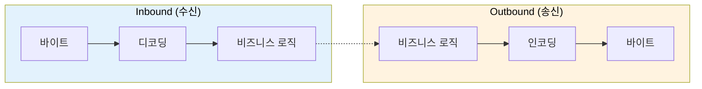
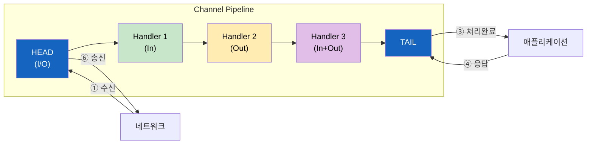
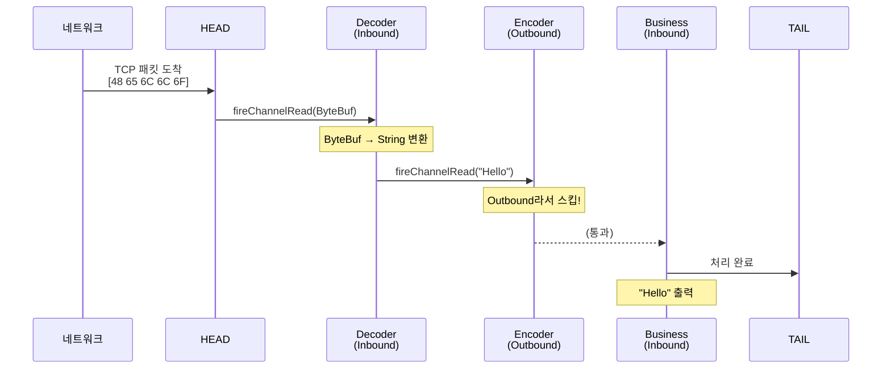
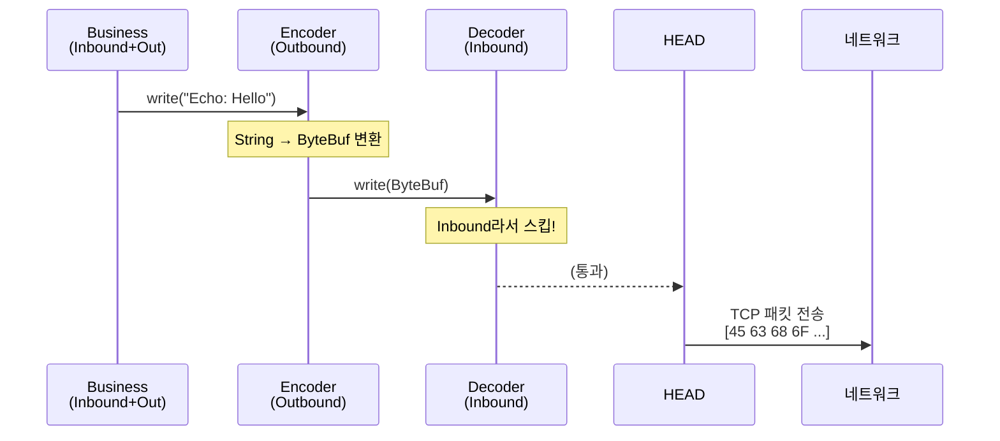
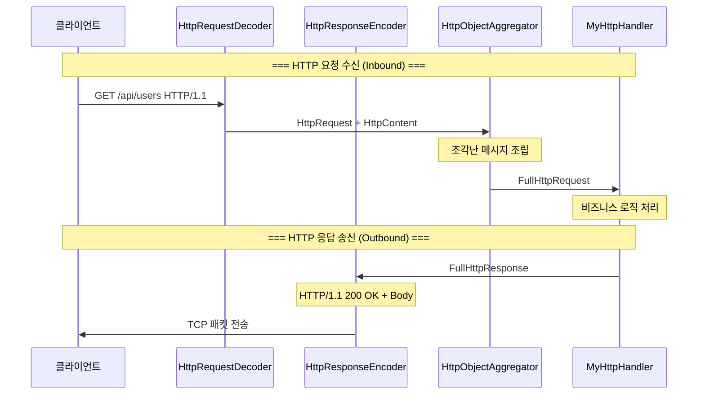
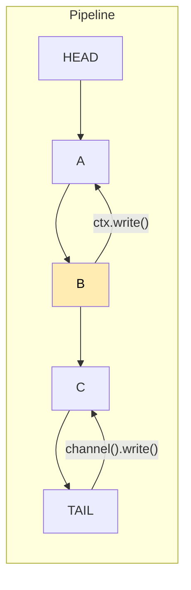
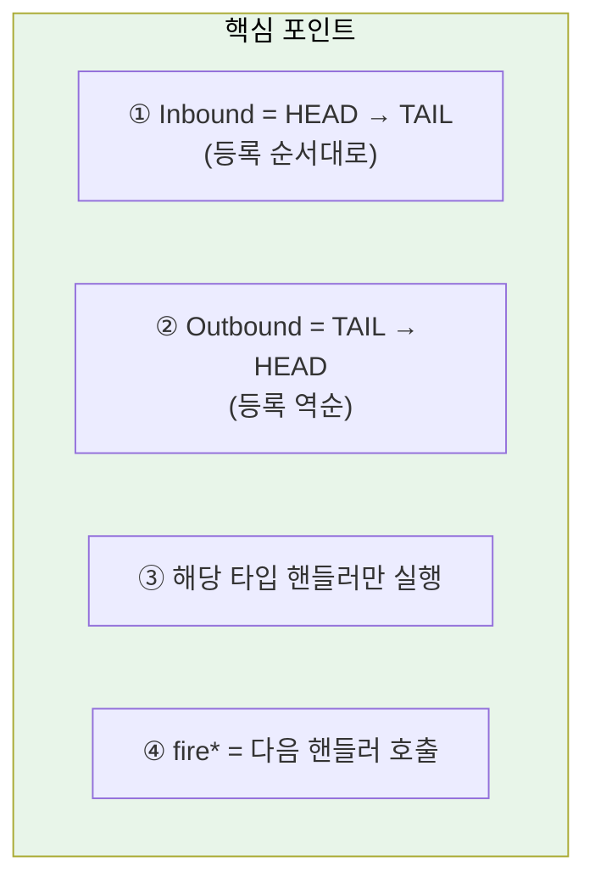

# Netty Channel Pipeline 인바운드와 아웃바운드 흐름

Netty의 Channel Pipeline에서 데이터가 어떻게 흐르는지, 인바운드와 아웃바운드의 차이를 명확하게 이해한다.

## 결론부터 말하면

**인바운드와 아웃바운드는 같은 파이프라인에서 반대 방향으로 흐른다.**

```java
// 파이프라인에 핸들러 등록 (순서: A → B → C)
pipeline.addLast("A", new DecoderHandler());    // Inbound
pipeline.addLast("B", new EncoderHandler());    // Outbound
pipeline.addLast("C", new BusinessHandler());   // Inbound + Outbound
```

| 방향 | 언제 | 실행 순서 | 방향 |
|------|------|----------|------|
| **Inbound** | 데이터 수신 시 | A → C (등록 순서) | HEAD → TAIL |
| **Outbound** | 데이터 송신 시 | C → B (등록 역순) | TAIL → HEAD |

핵심은 **Outbound가 역순**이라는 점이다. 이것만 기억하면 파이프라인의 모든 동작이 이해된다.

## 1. 왜 이렇게 설계되었을까?

네트워크 프로그래밍에서 데이터는 **계층적으로 변환**된다.

```
수신 시: 바이트 → 프레임 → 메시지 → 비즈니스 객체
송신 시: 비즈니스 객체 → 메시지 → 프레임 → 바이트
```

이 과정이 정확히 **대칭**이다. Netty는 이 대칭성을 파이프라인 구조로 표현한다.



디코더와 인코더를 **같은 위치**에 등록해도, 각자 맡은 방향에서만 동작한다. 이것이 Netty 파이프라인의 우아함이다.

## 2. 파이프라인 구조

### 전체 그림



### 핸들러 타입별 역할

| 핸들러 타입 | 인터페이스 | 역할 | 주요 메서드 |
|------------|-----------|------|------------|
| Inbound | `ChannelInboundHandler` | 수신 데이터 처리 | `channelRead()` |
| Outbound | `ChannelOutboundHandler` | 송신 데이터 처리 | `write()` |
| Duplex | `ChannelDuplexHandler` | 양방향 처리 | 둘 다 |

> **팁**: Duplex 핸들러는 로깅, 모니터링처럼 양방향 트래픽을 모두 관찰해야 할 때 유용하다.

```java
// Inbound와 Outbound를 모두 로깅하는 핸들러
public class LoggingHandler extends ChannelDuplexHandler {

    @Override
    public void channelRead(ChannelHandlerContext ctx, Object msg) throws Exception {
        System.out.println("[INBOUND] " + msg);
        super.channelRead(ctx, msg);  // 다음 Inbound 핸들러로 전달
    }

    @Override
    public void write(ChannelHandlerContext ctx, Object msg,
                      ChannelPromise promise) throws Exception {
        System.out.println("[OUTBOUND] " + msg);
        super.write(ctx, msg, promise);  // 다음 Outbound 핸들러로 전달
    }
}
```

## 3. Inbound 흐름 상세

클라이언트가 `"Hello"`를 보냈을 때:



### Inbound 핸들러 코드

```java
public class MyDecoder extends ChannelInboundHandlerAdapter {

    @Override
    public void channelRead(ChannelHandlerContext ctx, Object msg) {
        ByteBuf buf = (ByteBuf) msg;
        try {
            // 바이트 → 문자열 변환
            String decoded = buf.toString(StandardCharsets.UTF_8);

            // 다음 Inbound 핸들러로 전달 (→ 방향)
            ctx.fireChannelRead(decoded);

        } finally {
            // ByteBuf는 반드시 해제
            buf.release();
        }
    }
}

public class BusinessHandler extends ChannelInboundHandlerAdapter {

    @Override
    public void channelRead(ChannelHandlerContext ctx, Object msg) {
        String message = (String) msg;
        System.out.println("수신: " + message);

        // 응답 전송 (여기서 Outbound 시작!)
        ctx.writeAndFlush("Echo: " + message);
    }
}
```

### 핵심 메서드: `fireChannelRead()`

```java
// 다음 Inbound 핸들러로 전달
ctx.fireChannelRead(msg);  // → 방향 (HEAD → TAIL)
```

`fire` 접두사가 붙은 메서드는 **다음 핸들러를 호출**한다는 의미다.

## 4. Outbound 흐름 상세

서버가 `"Echo: Hello"`를 응답할 때:



### Outbound 핸들러 코드

```java
public class MyEncoder extends ChannelOutboundHandlerAdapter {

    @Override
    public void write(ChannelHandlerContext ctx, Object msg,
                      ChannelPromise promise) {

        if (msg instanceof String) {
            String str = (String) msg;

            // 문자열 → 바이트 변환
            ByteBuf buf = ctx.alloc().buffer();
            buf.writeBytes(str.getBytes(StandardCharsets.UTF_8));

            // 다음 Outbound 핸들러로 전달 (← 방향)
            ctx.write(buf, promise);
        } else {
            // String이 아니면 그대로 전달
            ctx.write(msg, promise);
        }
    }
}
```

> **팁**: `ChannelPromise`는 비동기 쓰기 작업의 결과를 담는 컨테이너다. 리스너를 등록하면 I/O 완료(성공/실패) 시 특정 동작을 수행할 수 있다.
>
> ```java
> ctx.write(msg, promise);
> promise.addListener(future -> {
>     if (future.isSuccess()) {
>         System.out.println("전송 성공!");
>     } else {
>         System.err.println("전송 실패: " + future.cause());
>     }
> });
> ```

### 핵심 메서드: `write()` vs `writeAndFlush()`

```java
// 버퍼에 쓰기만 (아직 전송 안 됨)
ctx.write(msg);

// 버퍼 비우기 (실제 전송)
ctx.flush();

// 쓰기 + 전송 한 번에
ctx.writeAndFlush(msg);
```

> **성능 팁**: `write()`와 `flush()`가 분리된 이유는 **배치 전송** 때문이다. 여러 개의 작은 메시지를 `write()`로 버퍼에 모았다가, 한 번의 `flush()` 시스템 콜로 묶어 보내면 I/O 효율이 높아진다.

## 5. 실행 순서 완전 정리

### 파이프라인 등록

```java
ChannelPipeline pipeline = channel.pipeline();

pipeline.addLast("frameDecoder", new LengthFieldBasedFrameDecoder(...));  // In
pipeline.addLast("frameEncoder", new LengthFieldPrepender(...));          // Out
pipeline.addLast("stringDecoder", new StringDecoder());                   // In
pipeline.addLast("stringEncoder", new StringEncoder());                   // Out
pipeline.addLast("business", new BusinessHandler());                      // In + Out
```

### 등록 순서 vs 실행 순서

```
등록 순서 (addLast 호출 순):
  frameDecoder → frameEncoder → stringDecoder → stringEncoder → business

Inbound 실행 순서 (HEAD → TAIL):
  frameDecoder → stringDecoder → business
      ↑              ↑             ↑
   Inbound       Inbound       Inbound

Outbound 실행 순서 (TAIL → HEAD):
  business → stringEncoder → frameEncoder
      ↑           ↑              ↑
   Outbound    Outbound      Outbound
```

### 시각화

```mermaid
flowchart TB
    subgraph Registration["등록 순서"]
        R1["① frameDecoder"] --> R2["② frameEncoder"] --> R3["③ stringDecoder"] --> R4["④ stringEncoder"] --> R5["⑤ business"]
    end

    subgraph Inbound["Inbound 실행"]
        direction LR
        I1["frameDecoder"] -->|"①"| I2["stringDecoder"] -->|"②"| I3["business"]
    end

    subgraph Outbound["Outbound 실행"]
        direction RL
        O1["business"] -->|"①"| O2["stringEncoder"] -->|"②"| O3["frameEncoder"]
    end

    style Registration fill:#F5F5F5,color:#000
    style Inbound fill:#E3F2FD,color:#000
    style Outbound fill:#FFF3E0,color:#000
```



## 6. 실전 예시: HTTP 서버

### 파이프라인 구성

```java
public class HttpServerInitializer extends ChannelInitializer<SocketChannel> {

    @Override
    protected void initChannel(SocketChannel ch) {
        ChannelPipeline p = ch.pipeline();

        // HTTP 코덱 (디코더 + 인코더를 하나로)
        p.addLast("codec", new HttpServerCodec());              // In + Out

        // HTTP 메시지 집계
        p.addLast("aggregator", new HttpObjectAggregator(65536)); // In

        // 비즈니스 로직
        p.addLast("handler", new MyHttpHandler());              // In
    }
}
```

> **참고**: 과거에는 `HttpRequestDecoder`(In)와 `HttpResponseEncoder`(Out)를 따로 등록했지만, 최신 Netty에서는 이 둘을 합친 `HttpServerCodec`을 사용하는 것이 권장된다.

### 요청/응답 흐름



### 비즈니스 핸들러 구현

```java
public class MyHttpHandler extends SimpleChannelInboundHandler<FullHttpRequest> {

    @Override
    protected void channelRead0(ChannelHandlerContext ctx, FullHttpRequest req) {
        // 요청 처리
        String uri = req.uri();
        String response = processRequest(uri);

        // 응답 생성
        FullHttpResponse httpResponse = new DefaultFullHttpResponse(
            HTTP_1_1,
            OK,
            Unpooled.copiedBuffer(response, StandardCharsets.UTF_8)
        );

        httpResponse.headers()
            .set(CONTENT_TYPE, "application/json")
            .setInt(CONTENT_LENGTH, httpResponse.content().readableBytes());

        // 응답 전송 (Outbound 시작)
        // Keep-Alive가 아니면 응답 후 연결 종료
        ctx.writeAndFlush(httpResponse)
           .addListener(ChannelFutureListener.CLOSE);
    }
}
```

## 7. 자주 하는 실수

### 실수 1: Outbound 핸들러 순서

```java
// ❌ 잘못된 순서
pipeline.addLast("business", new BusinessHandler());
pipeline.addLast("encoder", new MyEncoder());  // business 뒤에 등록

// Outbound 실행: business → encoder (encoder가 실행됨!)
// 의도한 대로 동작하지만, 읽기 어려운 코드
```

```java
// ✅ 권장 순서 (디코더/인코더를 먼저)
pipeline.addLast("decoder", new MyDecoder());
pipeline.addLast("encoder", new MyEncoder());
pipeline.addLast("business", new BusinessHandler());

// 직관적: 디코더/인코더가 가장 네트워크에 가까움
```

### 실수 2: `ctx.write()` vs `ctx.channel().write()`

```java
// ctx.write() - 현재 핸들러부터 역방향으로
ctx.write(msg);  // 현재 위치 → HEAD

// ctx.channel().write() - TAIL부터 역방향으로
ctx.channel().write(msg);  // TAIL → HEAD
```



### 실수 3: ByteBuf 해제 누락

```java
// ❌ 메모리 누수!
public void channelRead(ChannelHandlerContext ctx, Object msg) {
    ByteBuf buf = (ByteBuf) msg;
    // buf.release() 호출 안 함!
}

// ✅ 올바른 처리
public void channelRead(ChannelHandlerContext ctx, Object msg) {
    ByteBuf buf = (ByteBuf) msg;
    try {
        // 처리 로직
    } finally {
        buf.release();  // 또는 ReferenceCountUtil.release(msg)
    }
}

// ✅ 또는 SimpleChannelInboundHandler 사용 (자동 해제)
public class MyHandler extends SimpleChannelInboundHandler<ByteBuf> {
    @Override
    protected void channelRead0(ChannelHandlerContext ctx, ByteBuf msg) {
        // 자동으로 release() 호출됨
    }
}
```

## 8. 핵심 요약



| 개념 | Inbound | Outbound |
|------|---------|----------|
| 트리거 | 데이터 수신 | `write()` / `writeAndFlush()` |
| 방향 | HEAD → TAIL | TAIL → HEAD |
| 다음 핸들러 호출 | `ctx.fireChannelRead()` | `ctx.write()` |
| 대표 용도 | 디코딩, 요청 처리 | 인코딩, 응답 생성 |

---

## 출처

- [Netty 공식 문서 - ChannelPipeline](https://netty.io/4.1/api/io/netty/channel/ChannelPipeline.html)
- [Netty in Action](https://www.manning.com/books/netty-in-action) - Norman Maurer, Marvin Allen Wolfthal
- [Netty 4.x User Guide](https://netty.io/wiki/user-guide-for-4.x.html)
