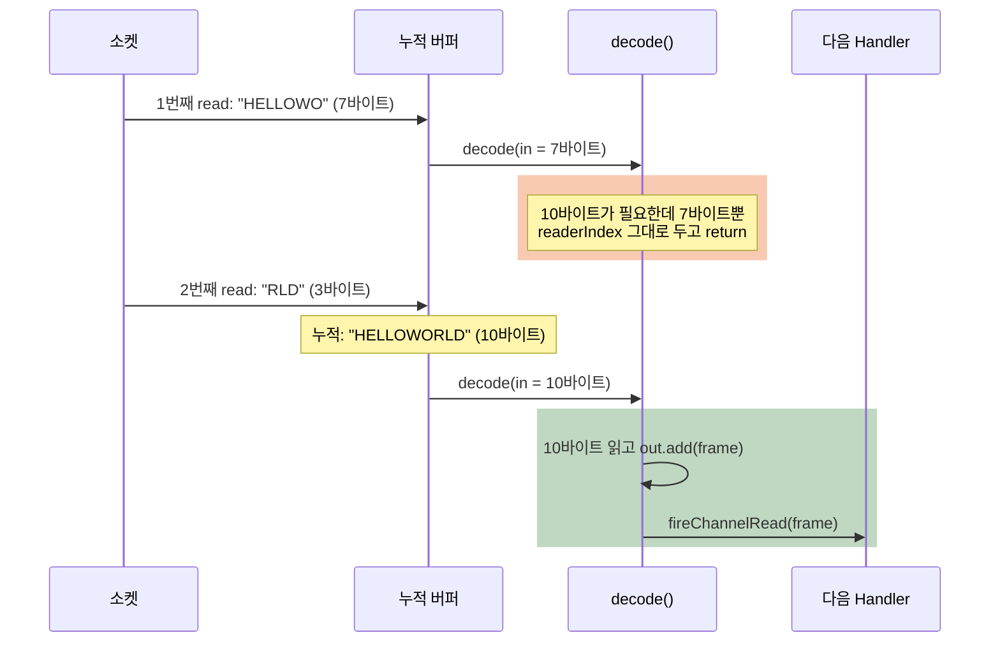

# Netty Codec — 디코더는 왜 데이터가 모자라면 그냥 return할까?

TCP는 메시지를 쪼개서도, 붙여서도 보낸다. 그런데 Netty 디코더 예제를 보면 데이터가 모자랄 때 아무것도 하지 않고 그냥 `return`한다. 받은 바이트를 버린 걸까, 기다린 걸까? 그리고 HTTP 같은 실제 프로토콜에서 Codec은 무엇을 더 맡아야 할까?

## 결론부터 말하면

**`return`은 "버림"이 아니라 "기다림"이다.** `ByteToMessageDecoder`는 연결마다 누적 버퍼를 두고, 새로 도착한 바이트를 거기에 붙인 뒤 `decode()`를 다시 부른다. 그래서 디코더를 구현하는 쪽은 규칙 하나만 지키면 된다. **완성된 메시지가 있으면 읽어서 `out`에 넣고, 모자라면 `readerIndex`를 건드리지 말고 `return`한다.** 실무에서는 이 규칙을 직접 구현하기보다 `LengthFieldBasedFrameDecoder` 같은 프레임 디코더와 HTTP 코덱을 조합하고, 어떤 경우든 **메시지 크기 상한** 을 반드시 정한다.



| 방향 | 기반 클래스 | 변환 | 예 |
|------|------|------|------|
| 인바운드 | `ByteToMessageDecoder` | 바이트 흐름 → 메시지 | `LengthFieldBasedFrameDecoder`, `HttpRequestDecoder` |
| 인바운드 | `MessageToMessageDecoder<I>` | 메시지 → 메시지 | `StringDecoder` (`ByteBuf` → `String`) |
| 아웃바운드 | `MessageToByteEncoder<I>` | 메시지 → 바이트 | 직접 만드는 객체 인코더 |
| 아웃바운드 | `MessageToMessageEncoder<I>` | 메시지 → 메시지 | `LengthFieldPrepender` (본문 앞에 길이 헤더) |

> 이 글은 Netty 시리즈 4편이다. [입문편](./Netty-자바에-이미-NIO가-있는데-왜-Netty를-쓸까.md), [EventLoop편](./Netty-EventLoop-스레드-하나가-수천-연결을-맡는-규칙과-그-대가.md), [ByteBuf편](./Netty-ByteBuf-GC가-있는-자바에서-왜-메모리를-직접-release-할까.md)에 이어 Netty 4.2 기준으로 설명한다.

## 1. 왜 Codec이 필요할까?

### 1.1 TCP는 메시지를 모른다

TCP가 전달하는 것은 "메시지"가 아니라 끊김 없는 바이트의 흐름이다. 클라이언트가 `"HELLO"`와 `"WORLD"`를 두 번에 나눠 보내도 서버는 `"HELLOWO"`와 `"RLD"`로 받을 수 있고, 반대로 두 메시지가 한 번에 붙어 올 수도 있다. 이 문제와 "앞 4바이트는 길이" 같은 규칙으로 바이트 흐름을 메시지 단위로 잘라 내는 **프레이밍(framing)** 의 개념은 [입문편의 벽 1](./Netty-자바에-이미-NIO가-있는데-왜-Netty를-쓸까.md)에서 다뤘다.

### 1.2 직접 짜면 경우의 수가 폭발한다

프레이밍을 직접 구현한다고 해 보자. 연결마다 누적 버퍼를 따로 두는 것은 기본이다. 그 위에서 적어도 네 가지 경우를 모두 처리해야 한다. 메시지 하나가 정확히 도착한 경우, 반쪽만 와서 기다려야 하는 경우, 한 번에 두세 개가 붙어 와서 반복해서 꺼내야 하는 경우, 그리고 길이 헤더가 "본문이 2GB"라고 주장하는 경우다. 마지막 경우를 놓치면 서버는 오지 않을 2GB를 기다리며 메모리를 계속 쌓는다.

이 처리를 비즈니스 Handler마다 섞어 넣으면 코드가 금방 엉킨다. Netty의 Codec은 이 일을 **"바이트 ↔ 메시지 변환"이라는 별도의 Handler** 로 떼어 낸다. 비즈니스 Handler는 늘 완성된 메시지 하나만 받는다. 그렇다면 이 변환을 맡는 기반 클래스는 위의 네 가지 경우를 어떻게 처리할까?

## 2. ByteToMessageDecoder: 누적 버퍼와 decode() 계약

### 2.1 누적 버퍼: 모자란 바이트는 어디에 머무나

`ByteToMessageDecoder`는 연결마다 누적 버퍼(cumulation)를 하나 가진다. 새 바이트가 도착하면 이 버퍼에 이어 붙이고 `decode()`를 부른다. 붙이는 방식은 두 가지다.

| 방식 | 동작 | 특징 |
|------|------|------|
| `MERGE_CUMULATOR` (기본) | 새 바이트를 하나의 버퍼로 복사해 합친다 | 단순하고 빠른 인덱싱 |
| `COMPOSITE_CUMULATOR` | 복사하지 않고 `CompositeByteBuf`에 덧붙인다 | javadoc은 인덱싱이 복잡해 경우에 따라 MERGE보다 느릴 수 있다고 경고한다 |

누적 버퍼의 수명도 기반 클래스가 관리한다. 디코딩 후 누적 버퍼를 끝까지 다 읽었으면 바로 해제한다. 읽지 않은 바이트가 남아 있으면 그대로 두되, 16번 읽을 때마다(`discardAfterReads`) 이미 읽은 앞부분을 정리해 버퍼가 끝없이 커지지 않게 한다.

이 구조에서 하나가 따라 나온다. 누적 버퍼는 **연결마다** 있어야 하므로, 디코더 인스턴스를 여러 연결이 공유하면 안 된다. 그래서 javadoc은 `ByteToMessageDecoder`의 하위 클래스에 `@Sharable`을 붙여서는 **절대 안 된다** 고 못 박는다. 실제로 생성자가 `ensureNotSharable()`로 이를 검사한다. 디코더는 `ChannelInitializer`에서 연결마다 `new`로 만들어야 한다.

### 2.2 decode()를 부르는 루프

`decode()`를 한 번만 부르는 것이 아니다. 기반 클래스의 `callDecode()`는 누적 버퍼에 읽을 바이트가 남아 있는 동안 `decode()`를 반복해서 부르고, 매번 결과를 보고 다음 행동을 정한다.

```java
// Netty 4.2 ByteToMessageDecoder.callDecode()를 단순화
while (in.isReadable()) {
    int outSize = out.size();
    int oldInputLength = in.readableBytes();
    decode(ctx, in, out);

    if (out.size() == outSize) {                       // 메시지를 하나도 못 만들었다
        if (oldInputLength == in.readableBytes()) {
            break;                                     // 읽지도 않았다 → 데이터가 모자람, 다음 read를 기다린다
        } else {
            continue;                                  // 뭔가 읽어 넘겼다(건너뛰기 등) → 다시 시도
        }
    }
    if (oldInputLength == in.readableBytes()) {        // 메시지는 만들었는데 아무것도 안 읽었다
        throw new DecoderException(
            "decode() did not read anything but decoded a message.");
    }
    // 메시지를 만들었고 바이트도 읽었다 → out의 메시지를 다음 Handler로 보내고 계속
}
```

이제 1.2의 경우 중 앞의 세 가지가 이 루프 하나로 정리된다. 메시지 하나면 한 바퀴에 끝나고, 반쪽이면 `break`로 다음 read를 기다리고, 여러 개가 붙어 왔으면 루프가 반복해서 꺼낸다. 네 번째인 크기 상한 초과는 루프가 아니라 각 디코더가 검사해야 한다(2.3 예제의 `MAX_FRAME`, 3.2의 `maxFrameLength`). 마지막 `DecoderException`은 "읽지 않고 메시지를 만드는" 실수가 무한 루프로 이어지는 것을 막는 안전장치다. 제목의 답이 여기 있다. `decode()`가 아무것도 읽지 않고 `return`하면 루프가 이를 "데이터 부족"으로 해석해 빠져나가고, 다음 바이트가 붙으면 다시 불러 준다.

### 2.3 decode()의 계약과 직접 만든 디코더

javadoc이 정리한 `decode()` 구현 규칙은 네 가지다.

- 완성된 프레임이 있는지 `readableBytes()`로 먼저 확인한다
- 모자라면 **`readerIndex`를 바꾸지 않고** `return`한다
- 길이 헤더를 엿볼 때는 인덱스를 움직이지 않는 `getInt()`를 쓰되, 반드시 `getInt(in.readerIndex())`처럼 현재 읽기 위치를 기준으로 한다. 프레임이 버퍼 맨 앞에서 시작한다는 보장이 없으므로 `getInt(0)`은 틀린 코드다
- `@Sharable`을 붙이지 않는다

이 규칙대로 "앞 4바이트는 본문 길이"인 프로토콜의 디코더를 직접 만들어 보자.

```java
public class LengthPrefixedDecoder extends ByteToMessageDecoder {
    private static final int MAX_FRAME = 1024 * 1024;

    @Override
    protected void decode(ChannelHandlerContext ctx, ByteBuf in, List<Object> out) {
        if (in.readableBytes() < 4) {
            return;                                        // 길이 헤더도 아직 다 안 왔다 → 기다린다
        }
        int length = in.getInt(in.readerIndex());          // readerIndex는 그대로 두고 엿본다
        if (length < 0 || length > MAX_FRAME) {
            throw new TooLongFrameException("frame length: " + length);   // 2GB 주장은 여기서 끊는다
        }
        if (in.readableBytes() < 4 + length) {
            return;                                        // 본문이 아직 모자라다 → 기다린다
        }
        in.skipBytes(4);                                   // 이제 확정: 헤더를 건너뛰고
        out.add(in.readRetainedSlice(length));             // 본문을 복사 없이 잘라 다음 Handler로
    }
}
```

마지막 줄에서 `readSlice()`가 아니라 `readRetainedSlice()`를 쓴 이유가 있다. [ByteBuf편 3.4](./Netty-ByteBuf-GC가-있는-자바에서-왜-메모리를-직접-release-할까.md)에서 봤듯 slice는 원본과 참조 카운트를 공유한다. 기반 클래스는 누적 버퍼를 다 읽으면 해제하는데, 카운트를 올리지 않은 slice를 넘기면 다음 Handler가 쓰기도 전에 원본이 해제되거나 이중 해제가 일어난다. 실제로 이 실수를 하면 `ByteToMessageDecoder`는 "decode()가 입력 버퍼를 해제했거나, retain() 없이 파이프라인으로 넘겼을 수 있다"는 메시지와 함께 `IllegalReferenceCountException`을 던진다. Netty의 `LengthFieldBasedFrameDecoder`도 프레임을 `retainedSlice()`로 잘라 낸다. 클래스 javadoc의 Pitfalls 절에는 `readSlice()`를 쓰라는 문장이 남아 있지만, 잘라 낸 프레임을 `out`으로 넘기는 경우라면 구현과 위 예외 메시지대로 retain된 slice를 써야 한다.

이 클래스는 계약을 이해하기 위한 예제다. 실무에서는 3장의 `LengthFieldBasedFrameDecoder` 한 줄이 같은 일을 한다.

참고로 `ReplayingDecoder`라는 변형도 있다. 필요한 바이트가 이미 다 도착한 것처럼 `decode()`를 작성하게 해 주는 대신, 바이트가 모자라면 내부적으로 처음부터 다시 실행한다. 코드는 단순해지지만 javadoc은 네트워크가 느리고 메시지가 복잡하면 성능이 나빠질 수 있다고 경고한다.

## 3. 프레임 디코더: 직접 짜지 말고 고른다

### 3.1 네 가지 프레임 디코더

`ByteToMessageDecoder`의 javadoc도 프레임 감지는 보통 파이프라인 앞쪽에 기성 프레임 디코더를 두어 처리하라고 권한다.

| 디코더 | 프레임 규칙 | 상한을 넘으면 |
|------|------|------|
| `LengthFieldBasedFrameDecoder` | 헤더 안의 길이 필드 | `TooLongFrameException` |
| `LineBasedFrameDecoder` | 줄바꿈(`\n` 또는 `\r\n`) | `TooLongFrameException` |
| `DelimiterBasedFrameDecoder` | 지정한 구분자 | `TooLongFrameException` |
| `FixedLengthFrameDecoder` | 고정 길이 | 해당 없음 (항상 같은 크기) |

### 3.2 LengthFieldBasedFrameDecoder의 파라미터 다섯 개

가장 많이 쓰이는 `LengthFieldBasedFrameDecoder`는 파라미터 다섯 개로 거의 모든 길이 헤더 형식을 표현한다.

| 파라미터 | 의미 |
|------|------|
| `maxFrameLength` | 허용하는 최대 프레임 길이. 넘으면 `TooLongFrameException` |
| `lengthFieldOffset` | 프레임 시작에서 길이 필드까지의 거리 |
| `lengthFieldLength` | 길이 필드의 바이트 수 (1, 2, 3, 4, 8) |
| `lengthAdjustment` | 길이 값에 더할 보정값 |
| `initialBytesToStrip` | 다음 Handler로 넘기기 전에 앞에서 잘라 낼 바이트 수 |

헷갈리는 것은 `lengthAdjustment`다. 소스를 보면 디코더는 전체 프레임 길이를 이렇게 계산한다.

$$
\text{frameLength} = \text{길이 필드 값} + \text{lengthAdjustment} + (\text{lengthFieldOffset} + \text{lengthFieldLength})
$$

즉 길이 필드 값을 "길이 필드 뒤에 이어지는 바이트 수"로 간주하고, 그렇지 않으면 `lengthAdjustment`로 맞춘다. javadoc의 예제 중 대표적인 세 가지는 다음과 같다.

| 프로토콜 형식 | offset | length | adjustment | strip | 다음 Handler가 받는 것 |
|------|------|------|------|------|------|
| `[길이 2B][본문]`, 길이 = 본문 길이 | 0 | 2 | 0 | 0 | 헤더 포함 전체 |
| `[길이 2B][본문]`, 길이 = 본문 길이 | 0 | 2 | 0 | 2 | 본문만 |
| `[길이 2B][본문]`, 길이 = **헤더 포함** 전체 길이 | 0 | 2 | -2 | 0 | 헤더 포함 전체 |

세 번째 줄을 공식에 넣어 보자. 본문이 12바이트면 길이 필드 값은 헤더 2바이트를 포함한 14다. 그대로 두면 $14 + 0 + 2 = 16$이 되어 2바이트를 더 기다리게 된다. 그래서 `lengthAdjustment = -2`로 길이 필드 자신의 크기를 빼 주면 $14 - 2 + 2 = 14$로 정확한 프레임 길이가 나온다.

`maxFrameLength`는 선택이 아니라 방어선이다. 다섯 개 인자 생성자는 `failFast = true`로 동작해, 길이 필드를 읽는 순간 상한을 넘으면 본문을 기다리지 않고 바로 예외를 던진다. 1.2의 "본문이 2GB"라는 헤더가 여기서 끊긴다.

### 3.3 인코딩 쪽 짝: LengthFieldPrepender

보내는 쪽은 반대 작업이 필요하다. `LengthFieldPrepender(4)`는 나가는 `ByteBuf` 앞에 4바이트 길이 헤더를 붙인다. 디코더와 인코더를 짝지어 파이프라인을 조립하면 이렇다.

```java
ch.pipeline().addLast(
    new LengthFieldBasedFrameDecoder(1024 * 1024, 0, 4, 0, 4),   // 인바운드: 길이 헤더로 프레임 자르기, 헤더 제거
    new LengthFieldPrepender(4),                                 // 아웃바운드: 4바이트 길이 헤더 붙이기
    new OrderDecoder(),                                          // 인바운드: 프레임 → Order 객체
    new OrderEncoder(),                                          // 아웃바운드: Order 객체 → 바이트
    new OrderHandler());                                         // 비즈니스 로직은 Order만 다룬다

public class OrderDecoder extends MessageToMessageDecoder<ByteBuf> {
    @Override
    protected void decode(ChannelHandlerContext ctx, ByteBuf frame, List<Object> out) {
        out.add(new Order(frame.readLong(), frame.readInt()));    // frame 해제는 기반 클래스가 한다
    }
}

public class OrderEncoder extends MessageToByteEncoder<Order> {
    @Override
    protected void encode(ChannelHandlerContext ctx, Order order, ByteBuf out) {
        out.writeLong(order.id());
        out.writeInt(order.quantity());                          // Order 해제(참조 카운트 객체라면)도 기반 클래스가 한다
    }
}
```

`MessageToMessageDecoder`는 `decode()`가 끝나면 입력 메시지를, `MessageToByteEncoder`는 `encode()`가 끝나면 입력 메시지를 해제한다. ByteBuf편의 "마지막으로 다룬 쪽이 해제한다"는 규칙을 기반 클래스가 대신 지켜 주는 것이다. 인바운드는 위에서 아래로, 아웃바운드는 아래에서 위로 흐르므로 등록 순서가 중요하다. 그 이유는 [Channel Pipeline 노트](./Netty-Channel-Pipeline-인바운드와-아웃바운드-흐름.md)에서 다뤘다.

## 4. HTTP 코덱: 같은 원리, 더 복잡한 프레임

HTTP도 결국 바이트 흐름을 메시지로 자르는 일이다. 다만 프레임 규칙이 훨씬 복잡하다. 요청 첫 줄, 헤더, 그리고 `Content-Length` 또는 chunked 전송으로 끝을 알 수 있는 본문으로 이루어진다. Netty의 `HttpServerCodec`은 `HttpRequestDecoder`와 `HttpResponseEncoder`를 하나로 묶은 Handler다.

`HttpRequestDecoder`는 요청 하나를 한 덩어리로 만들지 않는다. `HttpRequest`(첫 줄과 헤더) 하나와, 본문 조각인 `HttpContent` 여러 개, 마지막 `LastHttpContent`로 흘려보낸다. 본문 전체를 객체 하나로 받고 싶다면 `HttpObjectAggregator`를 뒤에 둔다.

```java
ch.pipeline().addLast(new HttpServerCodec());                    // 바이트 ↔ HttpRequest/HttpContent, HttpResponse
ch.pipeline().addLast(new HttpObjectAggregator(1024 * 1024));    // 조각들을 FullHttpRequest 하나로. 1MB 상한
ch.pipeline().addLast(new MyHttpHandler());                      // FullHttpRequest 하나만 받는다
```

HTTP 코덱에도 크기 상한이 기본으로 걸려 있다.

| 항목 | 기본값 | 넘으면 |
|------|------|------|
| `maxInitialLineLength` (요청 첫 줄) | 4096 | `TooLongHttpLineException` |
| `maxHeaderSize` (헤더 전체) | 8192 | `TooLongHttpHeaderException` |
| `maxChunkSize` (본문 조각) | 8192 | 오류가 아니라 여러 `HttpContent`로 나눠 전달 |
| `HttpObjectAggregator`의 `maxContentLength` | 생성자에서 지정 | `413 Request Entity Too Large` 응답 |

`HttpObjectAggregator`는 `Expect: 100-continue` 요청에도 상한을 적용해, `Content-Length`가 상한 이내면 `100 Continue`, 넘으면 `417 Expectation Failed`를 보낸다. 또 `HttpServerCodec` javadoc은 헤더 검증을 항상 켜 두라고 권한다. 끄면 응답 헤더에 줄바꿈 문자를 끼워 넣는 HTTP Response Splitting(CWE-113)에 취약해질 수 있기 때문이다.

이런 상한이 왜 중요한지는 보안 패치 기록이 보여 준다. 코덱은 외부 입력을 가장 먼저 해석하는 곳이라 공격이 몰린다. 2026년 7월 Netty 4.2.16 릴리스에 담긴 보안 수정 20여 건 중 19건이 `netty-codec-http`, `netty-codec-http2` 같은 코덱 모듈이었고, 상당수가 메모리 고갈 유형이었다. 상한을 정하고, 코덱 모듈을 최신으로 유지하는 것이 기본이다.

Spring WebFlux도 같은 원리를 따른다. 요청 본문을 메모리에 모아 객체 하나로 만드는 코덱에는 `maxInMemorySize` 상한이 있고, 기본값은 256KB다. 넘으면 `DataBufferLimitException: Exceeded limit on max bytes to buffer`가 발생한다. `HttpObjectAggregator`의 `maxContentLength`와 같은 역할이다.

## 5. 내보낼 때의 속도 조절: WriteBufferWaterMark

인코더가 아무리 빨리 바이트를 만들어도, 받는 쪽이 느리면 보내지 못한 데이터가 Channel의 출력 버퍼(`ChannelOutboundBuffer`)에 쌓인다. 쌓이는 양에 한계가 없다면 결국 메모리가 부족해진다. 그래서 Netty는 출력 버퍼에 두 개의 수위선을 둔다.

| 수위선 | 기본값 | 의미 |
|------|------|------|
| high water mark | 64KiB | 쌓인 바이트가 이를 넘으면 `channel.isWritable()`이 `false`가 된다 |
| low water mark | 32KiB | high를 넘었다가 이 아래로 내려오면 다시 `true`가 된다 |

상태가 바뀔 때마다 `channelWritabilityChanged()` 이벤트가 발생한다. 주의할 점은 이것이 **신호일 뿐** 이라는 것이다. `isWritable()`이 `false`여도 `write()`는 거부되지 않는다. 그래서 대량으로 보내는 Handler는 직접 신호를 보고 멈췄다가 재개해야 한다.

```java
private void sendMore(ChannelHandlerContext ctx) {
    while (ctx.channel().isWritable() && source.hasNext()) {
        ctx.write(source.next());               // 쓸 수 있는 동안만 쓴다
    }
    ctx.flush();
}

@Override
public void channelWritabilityChanged(ChannelHandlerContext ctx) {
    if (ctx.channel().isWritable()) {
        sendMore(ctx);                          // 출력 버퍼가 비워지면 재개
    }
    ctx.fireChannelWritabilityChanged();
}
```

수위선은 `childOption(ChannelOption.WRITE_BUFFER_WATER_MARK, new WriteBufferWaterMark(32 * 1024, 64 * 1024))`처럼 바꿀 수 있다. 한 연결에서 읽어 다른 연결로 보내는 프록시라면, 보내는 쪽이 `isWritable() == false`일 때 받는 쪽에 `setAutoRead(false)`를 걸어 읽기를 멈추는 식으로 이 신호를 이어 붙인다.

## 6. CompositeByteBuf: 복사 없이 붙이기

헤더와 본문을 따로 만든 뒤 하나로 보내고 싶을 때, 새 버퍼에 둘을 복사해 넣는 대신 `CompositeByteBuf`로 묶을 수 있다. 여러 버퍼를 메모리 복사 없이 하나처럼 보이게 하는 가상 버퍼다.

```java
CompositeByteBuf message = ctx.alloc().compositeBuffer();
message.addComponents(true, header, body);   // true: writerIndex를 함께 늘린다. header·body의 소유권은 message로 넘어간다
ctx.writeAndFlush(message);                  // message가 해제될 때 header·body도 함께 해제된다
```

두 가지를 기억하자. 첫째, 추가한 버퍼의 해제 책임은 `CompositeByteBuf`로 넘어가므로 `header`, `body`를 따로 해제하면 안 된다. 둘째, `addComponent(buf)`처럼 `boolean` 인자 없이 추가하면 `writerIndex`가 늘지 않아, 버퍼를 넣었는데 읽을 바이트가 0인 것처럼 보인다. javadoc이 직접 경고하는 함정이다.

꼭 합치지 않아도 되는 경우도 있다. `header`와 `body`를 각각 `write()`하고 `flush()`를 한 번만 하면, NIO transport는 출력 버퍼에 쌓인 여러 버퍼를 모아 한 번의 gathering write(`SocketChannel.write(ByteBuffer[])`)로 보낸다. 묶을지, 따로 쓰고 한 번에 flush할지는 상황에 맞게 고르면 된다.

## 7. 정리

### 핵심 포인트

1. **return은 버림이 아니라 기다림이다**
   - `ByteToMessageDecoder`가 연결마다 누적 버퍼를 두고, 다음 바이트가 붙으면 `decode()`를 다시 부른다
   - 그래서 디코더는 연결마다 새로 만들고 `@Sharable`을 붙이지 않는다

2. **decode()의 계약: 읽었으면 내보내고, 모자라면 그대로 return**
   - 엿볼 때는 `getInt(in.readerIndex())`, 잘라 넘길 때는 `readRetainedSlice()`
   - 읽지 않고 메시지를 만들면 `DecoderException`

3. **프레이밍은 직접 짜지 말고 고른다**
   - 길이 헤더면 `LengthFieldBasedFrameDecoder` + `LengthFieldPrepender`
   - 프레임 길이 = 길이 필드 값 + `lengthAdjustment` + 길이 필드 끝 위치

4. **크기 상한은 방어선이다**
   - `maxFrameLength`, HTTP의 줄·헤더 한도, `maxContentLength`, WebFlux의 `maxInMemorySize`
   - 코덱은 공격이 몰리는 곳이므로 최신 버전을 유지한다

5. **내보낼 때는 isWritable()을 본다**
   - 기본 high 64KiB / low 32KiB. `write()`는 막히지 않으므로 신호를 보고 직접 멈춘다

### 함께 읽기

- [Netty — 자바에 이미 NIO가 있는데 왜 Netty를 쓸까?](./Netty-자바에-이미-NIO가-있는데-왜-Netty를-쓸까.md) - 시리즈 1편, 프레이밍 문제의 출발점
- [Netty EventLoop — 스레드 하나가 수천 연결을 맡는 규칙과 그 대가](./Netty-EventLoop-스레드-하나가-수천-연결을-맡는-규칙과-그-대가.md) - 시리즈 2편, 디코더가 실행되는 스레드
- [Netty ByteBuf — GC가 있는 자바에서 왜 메모리를 직접 release()할까?](./Netty-ByteBuf-GC가-있는-자바에서-왜-메모리를-직접-release-할까.md) - 시리즈 3편, 프레임과 누적 버퍼의 해제 규칙
- [Netty Channel Pipeline 인바운드와 아웃바운드 흐름](./Netty-Channel-Pipeline-인바운드와-아웃바운드-흐름.md) - 디코더·인코더 등록 순서

---

## 출처

- [Netty User Guide for 4.x](https://netty.io/wiki/user-guide-for-4.x.html) - 공식 가이드, 스트림 기반 전송과 디코더
- [ByteToMessageDecoder.java (netty-4.2.19.Final)](https://github.com/netty/netty/blob/netty-4.2.19.Final/codec-base/src/main/java/io/netty/handler/codec/ByteToMessageDecoder.java) - 누적 버퍼, `callDecode()` 루프, `decode()` 계약, `@Sharable` 금지
- [LengthFieldBasedFrameDecoder.java (netty-4.2.19.Final)](https://github.com/netty/netty/blob/netty-4.2.19.Final/codec-base/src/main/java/io/netty/handler/codec/LengthFieldBasedFrameDecoder.java) - 파라미터와 예제, 프레임 길이 계산, `failFast`
- [LengthFieldPrepender.java (netty-4.2.19.Final)](https://github.com/netty/netty/blob/netty-4.2.19.Final/codec-base/src/main/java/io/netty/handler/codec/LengthFieldPrepender.java) - 길이 헤더 인코더
- [MessageToMessageDecoder.java (netty-4.2.19.Final)](https://github.com/netty/netty/blob/netty-4.2.19.Final/codec-base/src/main/java/io/netty/handler/codec/MessageToMessageDecoder.java) - 디코딩 후 입력 해제
- [MessageToByteEncoder.java (netty-4.2.19.Final)](https://github.com/netty/netty/blob/netty-4.2.19.Final/codec-base/src/main/java/io/netty/handler/codec/MessageToByteEncoder.java) - 인코딩 후 입력 해제
- [ReplayingDecoder.java (netty-4.2.19.Final)](https://github.com/netty/netty/blob/netty-4.2.19.Final/codec-base/src/main/java/io/netty/handler/codec/ReplayingDecoder.java) - 모든 바이트가 있는 것처럼 쓰는 디코더와 성능 주의점
- [HttpObjectDecoder.java (netty-4.2.19.Final)](https://github.com/netty/netty/blob/netty-4.2.19.Final/codec-http/src/main/java/io/netty/handler/codec/http/HttpObjectDecoder.java) - HTTP 디코더 기본 한도
- [HttpServerCodec.java (netty-4.2.19.Final)](https://github.com/netty/netty/blob/netty-4.2.19.Final/codec-http/src/main/java/io/netty/handler/codec/http/HttpServerCodec.java) - 요청 디코더·응답 인코더 결합, 헤더 검증 권고
- [HttpObjectAggregator.java (netty-4.2.19.Final)](https://github.com/netty/netty/blob/netty-4.2.19.Final/codec-http/src/main/java/io/netty/handler/codec/http/HttpObjectAggregator.java) - `FullHttpRequest` 집계와 100/417/413 응답
- [WriteBufferWaterMark.java (netty-4.2.19.Final)](https://github.com/netty/netty/blob/netty-4.2.19.Final/transport/src/main/java/io/netty/channel/WriteBufferWaterMark.java) - 수위선 기본값
- [ChannelOutboundBuffer.java (netty-4.2.19.Final)](https://github.com/netty/netty/blob/netty-4.2.19.Final/transport/src/main/java/io/netty/channel/ChannelOutboundBuffer.java) - writability 전환
- [CompositeByteBuf.java (netty-4.2.19.Final)](https://github.com/netty/netty/blob/netty-4.2.19.Final/buffer/src/main/java/io/netty/buffer/CompositeByteBuf.java) - 소유권 이전과 `writerIndex` 함정
- [NioSocketChannel.java (netty-4.2.19.Final)](https://github.com/netty/netty/blob/netty-4.2.19.Final/transport/src/main/java/io/netty/channel/socket/nio/NioSocketChannel.java) - gathering write
- [Netty 4.2.16.Final released](https://netty.io/news/2026/07/06/4-2-16-Final.html) - 코덱 모듈 보안 수정
- [Spring Framework Reference: WebClient MaxInMemorySize](https://docs.spring.io/spring-framework/reference/web/webflux-webclient/client-builder.html) - 코덱 메모리 버퍼 기본 한도 256KB
- [Spring Framework Reference: Codecs Limits](https://docs.spring.io/spring-framework/reference/web/webflux/reactive-spring.html) - `maxInMemorySize`
