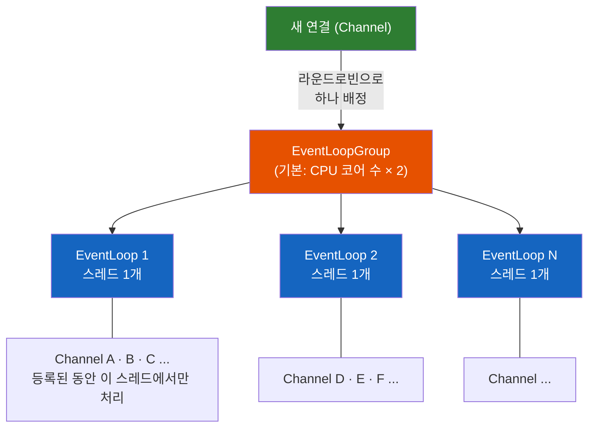
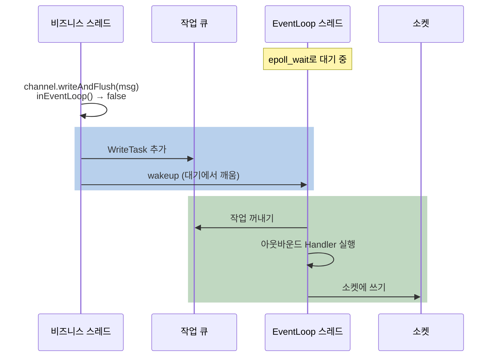
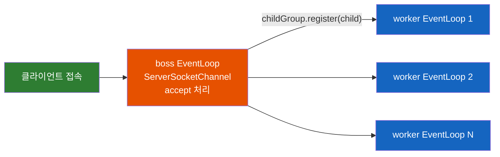
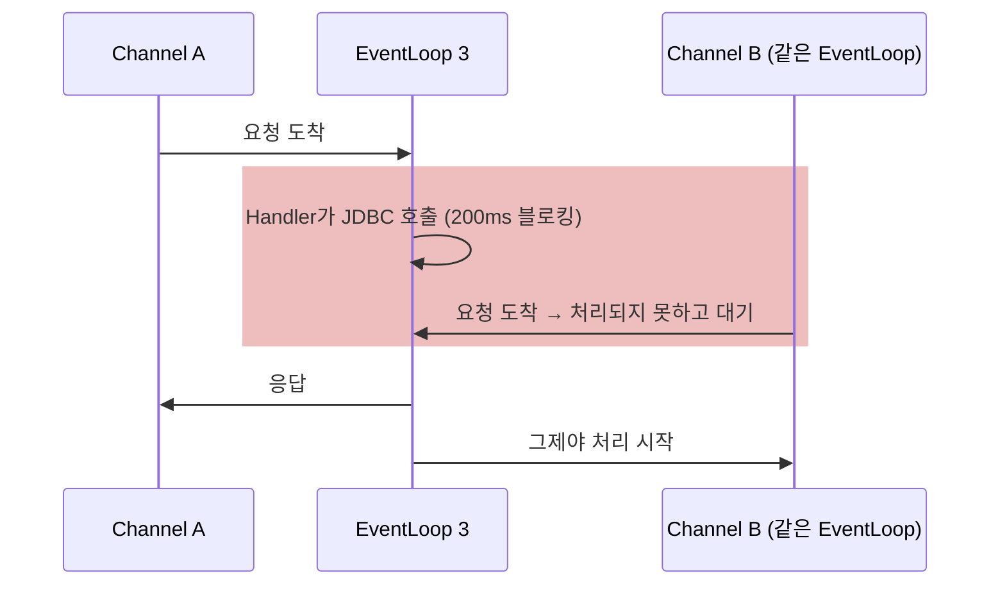

# Netty EventLoop — 스레드 하나가 수천 연결을 맡는 규칙과 그 대가

Netty의 Handler 코드에는 `synchronized`도 `volatile`도 거의 보이지 않는다. 스레드 십여 개가 수만 개의 연결을 나눠 맡는데 어떻게 안전할까? 그리고 그 안전함의 대가는 무엇일까?

## 결론부터 말하면

**EventLoop의 규칙은 하나다. Channel은 자신이 등록된 EventLoop 하나, 즉 스레드 하나에서만 처리된다.** 그래서 Handler 안에서는 락도 `volatile`도 필요 없고, 한 연결로 들어온 이벤트는 한 스레드에서 차례로 처리된다. 대가도 같은 규칙에서 나온다. 같은 EventLoop에 묶인 수백 개의 연결이 스레드 하나의 시간을 나눠 쓰므로, **Handler 하나가 블로킹하면 그 EventLoop의 모든 연결이 함께 멈춘다.** 그래서 블로킹 작업은 EventLoop 밖(예: Virtual Thread)으로 보내고, 결과를 다룰 때는 다시 EventLoop로 돌아오는 것이 기본 패턴이다.



| 구분 | 내용 |
|------|------|
| 규칙 | Channel은 등록된 EventLoop(스레드 하나)에서만 처리된다 |
| 얻는 것 | Handler에 락·`volatile`이 필요 없다. 한 연결로 들어온 이벤트는 차례로 처리된다 |
| 대가 | 같은 EventLoop의 연결들이 스레드 시간을 공유한다. 블로킹 하나가 모두를 멈춘다 |
| 대응 | 블로킹은 밖으로 넘기고(Virtual Thread 등), 결과는 EventLoop로 돌아와 처리한다 |

> 이 글은 [Netty — 자바에 이미 NIO가 있는데 왜 Netty를 쓸까?](./Netty-자바에-이미-NIO가-있는데-왜-Netty를-쓸까.md)의 후속편이다. 예제는 Netty 4.2 기준이다.

## 1. 왜 이런 규칙이 필요했을까?

### 1.1 NIO가 남긴 숙제: 어떤 일을 어느 스레드에서 할까?

JDK NIO의 `Selector`를 쓰면 스레드 하나가 수천 개의 연결을 감시할 수 있다. 하지만 그 스레드에서 무거운 일을 하면 모든 연결이 멈추고, 일을 다른 스레드로 넘기면 여러 스레드가 같은 연결의 버퍼를 건드리게 되어 락이 필요해진다. "어떤 일을 어느 스레드에서 할지"라는 스레드 모델은 전부 개발자 숙제였다. 이 배경은 입문 글의 [벽 2](./Netty-자바에-이미-NIO가-있는데-왜-Netty를-쓸까.md)에서 다뤘다.

### 1.2 Netty 3도 이 숙제를 깔끔하게 풀지 못했다

Netty 3는 NIO 위에 편리한 API를 얹었지만 스레드 규칙은 일관되지 않았다. Netty 4.0의 변경 문서는 이렇게 인정한다. **"3.x에는 잘 정의된 스레드 모델이 없었다(3.5에서 불일치를 고치려는 시도는 있었다)."** 대표적으로 데이터를 읽는 인바운드 이벤트는 I/O 스레드에서 실행되는데, 데이터를 쓰는 아웃바운드 요청은 `write()`를 호출한 스레드에서 그대로 실행되었다. 그러면 하나의 Handler가 I/O 스레드와 비즈니스 스레드에서 동시에 불릴 수 있다. Handler를 쓰는 사람은 "혹시 몰라서" 락을 걸어야 했고, 어떤 스레드가 어떤 데이터를 어떤 순서로 건드리는지 추론하기 어려웠다.

### 1.3 Netty 4의 답: 규칙 하나로 정리하기

Netty 4는 이 혼란을 **"Channel은 등록된 EventLoop 하나에서만 처리한다"** 는 규칙 하나로 정리했다. 그리고 4.0 변경 문서에 그 결과를 보장으로 적었다.

- "Netty는 `@Sharable`이 붙지 않은 `ChannelHandler`의 메서드를 절대 동시에 호출하지 않는다."
- "사용자는 더 이상 인바운드·아웃바운드 Handler 메서드를 동기화할 필요가 없다."
- "`ChannelHandler` 메서드 호출 사이에는 항상 happens-before 관계가 있다."

happens-before는 Java 메모리 모델의 용어로, "앞선 호출에서 쓴 값이 다음 호출에서 반드시 보인다"는 보장이다. 이 보장이 있으니 Handler의 필드에 `volatile`을 붙이지 않아도 된다. 그렇다면 Netty는 이 규칙을 어떤 구조로 지키고 있을까?

## 2. EventLoop는 어떻게 동작하나

### 2.1 EventLoop 한 바퀴: I/O와 작업 큐를 번갈아

EventLoop는 **스레드 하나가 무한 루프를 도는 구조** 다. 한 바퀴마다 두 가지 일을 번갈아 한다. 먼저 운영체제에 "준비된 연결이 있느냐"를 묻고(NIO의 `select`, Linux native transport의 `epoll_wait`), 준비된 Channel의 I/O를 처리하면서 파이프라인의 Handler(`channelRead` 등)를 호출한다. 그다음 작업 큐에 쌓인 일을 실행한다. 작업 큐에는 다른 스레드가 이 EventLoop에 맡긴 일과, `schedule()`로 예약한 일(타임아웃 검사 같은)이 들어 있다.

```java
// Netty 4.2 SingleThreadIoEventLoop.run()을 단순화
protected void run() {
    do {
        runIo();                       // 준비된 Channel의 I/O 처리 → Handler 호출
        runAllTasks(taskQuantumNs);    // 다른 스레드가 맡긴 작업, 예약 작업 실행
    } while (!confirmShutdown() && !canSuspend());
}
```


작업 큐가 비어 있으면 EventLoop는 I/O 대기에서 블로킹된다. 이때 다른 스레드가 작업을 넣으면, Netty는 작업을 큐에 넣은 뒤 대기 중인 EventLoop를 깨운다(`wakeup`). 덧붙여 EventLoop의 스레드는 그룹을 만들 때가 아니라 첫 작업(보통 Channel 등록)이 들어올 때 시작된다.

### 2.2 EventLoopGroup: 스레드 몇 개, 연결은 누구에게?

EventLoopGroup은 EventLoop 여러 개를 묶은 것이다. 스레드 수를 지정하지 않으면 `io.netty.eventLoopThreads` 시스템 프로퍼티를 보고, 그것도 없으면 **CPU 코어 수 × 2** 개를 만든다. 8코어 서버라면 16개다.

새 Channel이 오면 그룹은 다음 EventLoop를 차례대로 골라 배정한다. EventLoop 개수가 2의 거듭제곱이면 나머지 연산 대신 비트 마스크를 쓰는 최적화가 들어 있을 뿐, 본질은 라운드로빈이다.

```java
// Netty 4.2 DefaultEventExecutorChooserFactory를 단순화
public EventExecutor next() {
    return isPowerOfTwo
        ? executors[idx.getAndIncrement() & (executors.length - 1)]      // 16개면 & 15
        : executors[(int) Math.abs(idx.getAndIncrement() % executors.length)];
}
```

여기서 알아 둘 점이 하나 있다. 라운드로빈은 **연결의 개수만 나눌 뿐 부하는 보지 않는다.** 초당 수천 건을 주고받는 연결과 거의 놀고 있는 연결이 같은 한 칸으로 계산된다. 무거운 연결 몇 개가 우연히 한 EventLoop에 몰리면 그 EventLoop의 다른 연결들이 손해를 본다.

### 2.3 한 번 배정되면 바뀌지 않는다

Channel이 EventLoop에 등록되면 Channel은 그 EventLoop를 필드에 저장하고, 등록이 유지되는 동안(보통은 연결이 끝날 때까지) 모든 I/O 이벤트를 그 EventLoop의 스레드에서만 처리한다. Netty 4는 Channel을 등록 해제(`deregister`)했다가 다른 EventLoop에 다시 등록하는 것도 허용하지만, 일반적인 서버 코드에서 쓸 일은 거의 없다.

이 고정 배정이 1.3의 보장을 만든다. `ChannelInitializer`에서 연결마다 `new`로 만든 Handler는 그 연결의 EventLoop 스레드에서만 불리므로 필드를 마음껏 써도 된다. 반대로 `@Sharable`을 붙여 여러 연결이 함께 쓰는 Handler 인스턴스는 서로 다른 EventLoop 스레드에서 동시에 불릴 수 있으므로, 가변 필드가 있다면 직접 스레드 안전하게 만들어야 한다.

### 2.4 다른 스레드에서 호출하면 어떻게 될까?

그런데 이상한 점이 있다. 비즈니스 스레드에서 `channel.writeAndFlush(msg)`를 호출하는 코드는 흔하다. 규칙대로라면 쓰기도 EventLoop 스레드에서 일어나야 하는데, 어떻게 지켜지는 걸까?

답은 Netty 내부 곳곳에 있는 `inEventLoop()` 검사다. 지금 실행 중인 스레드가 그 Channel의 EventLoop 스레드라면 바로 실행하고, 아니라면 할 일을 작업 객체로 감싸 EventLoop의 작업 큐에 넣는다.

```java
// Netty 4.2 AbstractChannelHandlerContext.write()를 단순화
EventExecutor executor = next.executor();
if (executor.inEventLoop()) {
    // 이미 EventLoop 스레드 → 다음 Handler의 write()를 바로 호출
    next.handler().write(next, msg, promise);
} else {
    // 다른 스레드 → 작업으로 감싸 EventLoop의 큐에 넣는다
    WriteTask task = WriteTask.newInstance(this, msg, promise, flush);
    safeExecute(executor, task, promise, msg, !flush);
}
```



그래서 Handler에 별도 executor를 지정하지 않은 기본 구성에서는, 어느 스레드에서 `write()`를 불러도 실제 Handler 실행과 소켓 쓰기는 항상 EventLoop 스레드에서 일어난다. Channel 등록(`register`)도 같은 방식으로 EventLoop 스레드로 넘어간다. 규칙은 "호출하는 쪽이 조심해서" 지켜지는 게 아니라, Netty가 스레드를 갈아타 주기 때문에 지켜진다.

다만 이 구조가 **호출 순서** 까지 지켜 주지는 않는다. 다른 스레드에서 `write(a)`, `write(b)`를 호출해 작업이 큐에 들어가 있는 사이에 EventLoop 스레드에서 `write(c)`를 호출하면, `c`는 큐를 거치지 않고 바로 실행되어 `a`, `b`보다 먼저 나갈 수 있다. Netty 4.0 문서도 이 경우 a, b, c가 나가는 순서는 정의되지 않으며, 순서가 중요하면 사용자가 보장해야 한다고 적고 있다. 가장 간단한 방법은 한 연결에 대한 쓰기를 모두 EventLoop 스레드에서 하도록 모으는 것이다. 4.1에서 결과 처리를 `ctx.executor()`로 돌려보내는 이유 중 하나다.

### 2.5 boss와 worker: 서버 소켓은 누가 맡나

서버가 포트를 열고 접속을 기다리는 서버 소켓도 Netty에서는 `ServerSocketChannel`이라는 Channel 하나다. 그래서 이것도 EventLoop 하나에 등록되어 새 연결 수락(accept)을 처리한다. 연결이 수락되면 `ServerBootstrap` 내부의 `ServerBootstrapAcceptor`가 새로 생긴 Channel을 `childGroup.register(child)`로 다른 그룹에 등록한다. 이 두 그룹을 흔히 **boss** (accept 담당)와 **worker** (연결 I/O 담당)라고 부른다.

```java
EventLoopGroup boss = new MultiThreadIoEventLoopGroup(1, NioIoHandler.newFactory());  // accept 전담
EventLoopGroup worker = new MultiThreadIoEventLoopGroup(NioIoHandler.newFactory());   // 연결 I/O, 기본 CPU × 2
new ServerBootstrap()
    .group(boss, worker)
    .channel(NioServerSocketChannel.class)
    .childHandler(new MyInitializer());
```



boss 그룹의 스레드 수는 대부분 1이면 충분하다. 서버 Channel은 bind할 때 그룹에서 EventLoop **하나** 에만 등록되기 때문이다. boss 그룹을 4개로 만들어도 포트를 하나만 연다면 나머지 3개는 놀게 된다. 여러 포트를 열 때만 의미가 있다.

한편 Netty 4.2 공식 예제는 `group(group)`처럼 그룹 하나만 넘긴다. 이러면 서버 Channel도 같은 그룹의 EventLoop 하나에 등록되므로, accept를 처리하는 스레드가 일부 연결의 I/O도 함께 맡는다. 대부분의 서버에서는 문제가 없지만, 그 EventLoop가 바쁘면 새 연결 수락이 그만큼 늦어진다. 접속이 한꺼번에 몰리는 서버라면 boss를 분리하는 쪽이 안전하다. 어느 쪽이 틀렸다기보다 트레이드오프다.

## 3. 대가: 같은 EventLoop의 연결은 시간을 나눠 쓴다

### 3.1 블로킹 하나가 수백 연결을 멈춘다

규칙의 대가를 숫자로 보자. 8코어 서버에 worker EventLoop가 16개이고, 연결 10,000개가 라운드로빈으로 고르게 배정되었다고 가정하면 EventLoop 하나가 맡는 연결은 다음과 같다.

$$
\frac{10000}{16} = 625
$$

이 상태에서 어떤 Handler가 요청마다 200ms 걸리는 JDBC 조회를 EventLoop 스레드에서 직접 호출한다고 하자. 그 200ms 동안 같은 EventLoop의 나머지 624개 연결은 읽기도, 쓰기도, 타임아웃 검사도 하지 못하고 기다린다. 모든 요청이 이렇다면 EventLoop 하나는 1초에 $1000\text{ms} / 200\text{ms} = 5$ 건밖에 처리하지 못하고, 서버 전체로는 $5 \times 16 = 80$ 건이 한계다. 수만 연결을 감당하던 구조가 초당 80건짜리 서버로 떨어지는 것이다.



### 3.2 Netty가 잡아주는 블로킹, 못 잡는 블로킹

Netty가 직접 막아주는 블로킹도 있다. EventLoop 스레드 안에서 **아직 끝나지 않은** Netty `Future`에 `sync()`나 `await()`를 호출하면 `BlockingOperationException`이 발생한다. 그 Future를 완료시킬 주체가 바로 지금 기다리고 있는 EventLoop 스레드 자신이기 때문이다. 기다리는 스레드가 완료 처리까지 맡고 있으니 영원히 끝나지 않는 데드락이 된다. Netty는 `await()`에서 먼저 완료 여부를 보고, 미완료인데 `inEventLoop()`이면 `checkDeadLock()`에서 예외를 던져 이 상황을 막는다. 호출 시점에 이미 완료된 Future라면 예외 없이 그냥 반환되므로, "가끔만 터지는" 버그가 되기 쉽다.

```java
// Handler 안 = EventLoop 스레드
ctx.channel().writeAndFlush(msg).sync();     // 쓰기가 아직 미완료라면 BlockingOperationException

// 기다리지 말고 완료 콜백을 건다
ctx.channel().writeAndFlush(msg).addListener(f -> {
    if (!f.isSuccess()) {
        ctx.close();
    }
});
```

하지만 이 검사는 Netty 자신의 Future에만 걸려 있다. JDBC 호출, 동기 HTTP 클라이언트, `Thread.sleep()`, 파일 I/O는 Netty가 알아챌 방법이 없다. 3.1의 상황은 아무 예외 없이 조용히 일어난다. 테스트 환경에서 이런 호출을 찾고 싶다면 Reactor 진영의 [BlockHound](https://github.com/reactor/BlockHound) 같은 Java agent로 "논블로킹 스레드에서 블로킹 호출"을 감지할 수 있다.

### 3.3 작업 큐도 같은 시간을 쓴다 — Netty 4.2의 지연 사례

EventLoop의 시간을 잡아먹는 것은 블로킹 호출만이 아니다. 2.1에서 봤듯 EventLoop는 I/O와 작업 큐를 번갈아 처리하므로, 작업 큐에 일이 많이 쌓이면 그만큼 I/O 처리가 늦어진다. 이 균형 문제가 실제로 Netty 4.1에서 4.2로 넘어가면서 드러났다.

| 버전 | 작업 큐 처리 시간 규칙 |
|------|------|
| 4.1 (`NioEventLoop`) | `ioRatio` 기본 50: 직전 I/O에 쓴 시간에 비례해 작업 처리 시간을 준다 |
| 4.2.0 | transport 통합 과정에서 `ioRatio`가 사라지고, 매 바퀴 작업 처리 상한만 둔다(`io.netty.eventLoop.maxTaskProcessingQuantumMs`, 기본 1000ms) |
| 4.2.19 | `io.netty.eventLoop.ioRatio`로 다시 설정할 수 있게 복원. 기본값 100은 4.2.0 동작 그대로, 50으로 두면 4.1과 비슷한 균형 |

이 변경을 되돌린 PR(netty/netty#17481)의 설명에 따르면, 부하가 계속되면 작업 큐가 비지 않아 EventLoop가 매 바퀴 상한 시간을 거의 다 작업에 쓸 수 있었다. 그만큼 I/O 처리가 밀려 일부 요청의 응답이 늦어졌고, 4.1에서 4.2로 올린 뒤 중앙값이 아닌 **평균** 왕복 지연이 오르는 현상으로 관찰되었다. 4.1로 되돌리면 사라졌다고 한다.

교훈은 단순하다. `ctx.executor().execute(...)`나 `schedule(...)`로 EventLoop에 맡기는 작업도 I/O와 같은 스레드 시간을 쓴다. EventLoop에는 짧은 일만 맡겨야 한다.

## 4. 블로킹 작업은 어디로 보낼까?

### 4.1 기본 패턴: 밖에서 기다리고, 안으로 돌아온다

해법의 방향은 정해져 있다. 블로킹 작업은 EventLoop 밖의 스레드에서 기다리게 하고, 결과를 다룰 때는 EventLoop로 돌아온다. Java 21 이상이라면 기다리는 쪽에 Virtual Thread를 쓰는 것이 자연스럽다. Virtual Thread는 블로킹 대기가 싸서 스레드 풀 크기를 고민할 필요가 거의 없다.

```java
public class OrderHandler extends SimpleChannelInboundHandler<OrderRequest> {
    private static final ExecutorService BLOCKING = Executors.newVirtualThreadPerTaskExecutor();
    private final OrderRepository repository;

    public OrderHandler(OrderRepository repository) {
        this.repository = repository;
    }

    @Override
    protected void channelRead0(ChannelHandlerContext ctx, OrderRequest req) {    // EventLoop 스레드
        CompletableFuture
            .supplyAsync(() -> repository.save(req), BLOCKING)                   // JDBC 블로킹은 Virtual Thread에서
            .whenCompleteAsync((result, error) -> {                              // 결과 처리는 다시 EventLoop 스레드에서
                if (error != null) {
                    ctx.close();
                } else {
                    ctx.writeAndFlush(result);
                }
            }, ctx.executor());                                                  // 기본 구성에서 ctx.executor() = 이 Channel의 EventLoop
    }
}
```

`OrderRequest`는 앞단 디코더가 바이트를 변환해 만든 일반 객체라고 가정했다. 결과 처리를 `ctx.executor()`로 돌려보내는 이유는 2.4에서 봤듯 `writeAndFlush()` 때문만은 아니다. Handler가 연결별 상태(카운터, 세션 정보 등)를 갖고 있다면 그 상태를 건드리는 코드가 모두 EventLoop 스레드에서 실행되어야 1.3의 "락 없음" 보장이 유지된다.

한 가지 더 기억할 점이 있다. Virtual Thread는 사실상 무한히 만들 수 있지만 DB 커넥션은 그렇지 않다. 요청이 몰리면 Virtual Thread 수천 개가 커넥션 풀 앞에서 줄을 선다. 동시 실행 수를 `Semaphore` 등으로 제한하는 설계가 필요할 수 있다. 또 Java 21~23에서는 JDBC 드라이버 내부의 `synchronized` 블록 안에서 대기하면 Virtual Thread가 carrier thread를 붙잡는 pinning이 생길 수 있다(JDK 24에서 해소). 이 버전을 쓴다면 JDK Flight Recorder로 pinning 여부를 점검해 두자.

> Netty 4.1까지는 `pipeline.addLast(eventExecutorGroup, handler)`로 특정 Handler만 별도 스레드 풀에서 실행하는 방식이 흔했다. 이 오버로드는 4.2에서 deprecated 되었다.

### 4.2 넘길 때 생기는 함정 두 가지

**첫째, 응답 순서가 뒤바뀔 수 있다.** 같은 연결로 요청 1과 요청 2가 연달아 들어와 각각 Virtual Thread로 넘어가면, 요청 2의 DB 조회가 먼저 끝날 수 있다. 그러면 응답도 2, 1 순서로 나간다. 요청 ID 없이 "보낸 순서대로 응답이 온다"고 가정하는 프로토콜(HTTP/1.1 파이프라이닝, 많은 사내 전문 프로토콜)에서는 응답이 엉뚱한 요청에 매칭된다. 이런 프로토콜이라면 연결마다 작업 큐를 두고 앞 요청의 응답을 보낸 뒤에 다음 요청을 시작하도록 처리를 직렬화하거나, 응답을 요청 순서대로 모았다가 내보내야 한다. `channel.config().setAutoRead(false)`로 소켓 읽기를 멈추는 것만으로는 부족하다. 이미 읽어 둔 버퍼에 요청이 두 개 들어 있으면 디코더(`ByteToMessageDecoder`)가 둘 다 연달아 Handler로 넘기기 때문이다. `setAutoRead(false)`는 추가 유입을 줄이는 보조 수단으로 쓴다.

**둘째, `ByteBuf`를 그대로 넘기면 안 된다.** `SimpleChannelInboundHandler`는 `channelRead0()`이 끝나면 받은 메시지를 자동으로 해제(`release()`)한다. 받은 `ByteBuf`를 다른 스레드로 넘겼다면, 그 스레드가 읽을 때는 이미 해제된 메모리일 수 있다. 위 예제처럼 일반 객체로 변환한 뒤 넘기거나, 꼭 넘겨야 한다면 `retain()`으로 참조를 늘리고 받는 쪽에서 `release()`해야 한다. 참조 카운팅은 ByteBuf를 다룰 때 자세히 볼 주제다.

### 4.3 EventLoop와 Virtual Thread를 합치려는 실험

4.1의 패턴에는 숨은 비용이 있다. Virtual Thread는 기본적으로 JDK의 `ForkJoinPool` 스레드(carrier thread) 위에서 실행되는데, 이는 Netty EventLoop 스레드와 별개다. 그래서 요청 하나마다 EventLoop 스레드 → carrier thread → EventLoop 스레드로 스레드를 갈아타는 문맥 교환이 생긴다. Micronaut 팀은 이 비용을 요청과 응답마다 치러야 하는 비용으로 지목했다.

이 비용을 없애려는 시도가 이어지고 있다. **아직 실험 단계** 라는 점을 전제로 보자.

| 시도 | 내용 |
|------|------|
| Micronaut "loom carrier mode" | Micronaut HTTP Server Netty 4.9에 들어간 실험 기능. EventLoop마다 carrier thread를 두고, EventLoop 자체와 요청을 처리하는 Virtual Thread를 같은 carrier에서 실행해 스레드 전환을 없앤다 |
| Netty 4.2 `ManualIoEventLoop` | EventLoop를 돌리는 스레드를 사용자가 직접 소유하고 `run()`을 호출하는 EventLoop. javadoc은 "고급 사용 사례 전용"이라고 못 박는다 |
| Netty-VirtualThread-Scheduler | Netty 기여자 franz1981의 프로젝트. `ManualIoEventLoop`를 이용해 Virtual Thread 스케줄러와 EventLoop를 통합하는 실험 |

실무 기본값은 여전히 "EventLoop는 플랫폼 스레드, 블로킹은 Virtual Thread로 넘기기"다. 위 실험들은 그 스레드 전환 비용이 병목이 될 만큼 트래픽이 큰 경우에 지켜볼 방향이다.

### 4.4 Spring WebFlux에서는

WebFlux를 쓰고 있다면 이 이야기는 남의 일이 아니다. Spring Boot의 WebFlux 기본 서버인 Reactor Netty에서 로그에 보이는 `reactor-http-nio-N` 스레드가 바로 Netty EventLoop다. Reactor Netty는 기본적으로 **CPU 코어 수(최소 4)** 개의 worker를 만들고, 이 EventLoop 그룹을 JVM 안의 모든 서버와 클라이언트(`WebClient` 포함)가 공유한다. 순수 Netty의 기본값(CPU × 2)과 다르다는 점도 기억해 두자.

그래서 컨트롤러에서 JDBC나 동기 HTTP 클라이언트를 직접 호출하면 3.1의 상황이 그대로 일어나고, 같은 EventLoop를 쓰는 `WebClient` 호출까지 함께 느려진다. 대응은 두 가지다.

```java
// 1) Reactor 방식: 블로킹 호출을 별도 스케줄러로 넘긴다
Mono.fromCallable(() -> repository.findById(id))
    .subscribeOn(Schedulers.boundedElastic());

// 2) Spring Framework의 Blocking Execution: 리액티브 타입을 반환하지 않는 컨트롤러 메서드를
//    지정한 Executor에서 실행한다
@Configuration
public class WebConfig implements WebFluxConfigurer {
    @Override
    public void configureBlockingExecution(BlockingExecutionConfigurer configurer) {
        configurer.setExecutor(new VirtualThreadTaskExecutor("blocking-"));
    }
}
```

Spring Framework 문서에 따르면 기본적으로 반환 타입이 `ReactiveAdapterRegistry`에 등록되지 않은 컨트롤러 메서드, 즉 `Mono`·`Flux` 같은 리액티브 타입을 반환하지 않는 메서드를 블로킹으로 간주해 이 Executor에서 실행한다. 4.1의 "밖에서 기다린다"를 프레임워크가 대신 해 주는 셈이다.

## 5. 정리

### 핵심 포인트

1. **규칙은 하나: Channel은 등록된 EventLoop 스레드에서만 처리된다**
   - 그래서 Handler에 락·`volatile`이 필요 없고, 한 연결로 들어온 이벤트는 차례로 처리된다
   - 단, 여러 스레드에서 섞어 호출한 `write()`의 순서는 사용자가 보장해야 한다
   - `@Sharable` Handler의 가변 필드는 예외다

2. **EventLoop는 I/O와 작업 큐를 번갈아 처리하는 스레드 하나다**
   - 다른 스레드에서의 `write()`·`register()`는 `inEventLoop()` 검사 후 작업으로 바뀌어 큐로 들어간다
   - 기본 스레드 수는 CPU × 2, 새 연결은 부하와 무관하게 라운드로빈으로 배정된다

3. **대가: 같은 EventLoop의 연결은 시간을 나눠 쓴다**
   - 블로킹 하나가 수백 연결을 멈춘다. `sync()`는 예외로 막아주지만 JDBC는 못 잡는다
   - EventLoop에 맡긴 작업도 I/O와 시간을 나눠 쓴다(4.2의 `ioRatio` 사례)

4. **블로킹은 밖에서 기다리고, 결과는 EventLoop로 돌아와 처리한다**
   - Virtual Thread executor + `whenCompleteAsync(..., ctx.executor())`
   - 응답 순서와 `ByteBuf` 해제 시점을 조심한다

5. **boss는 포트당 스레드 하나면 충분하다**
   - 서버 Channel은 EventLoop 하나에만 등록된다. 그룹 하나로 합칠지는 트레이드오프다

### 함께 읽기

- [Netty — 자바에 이미 NIO가 있는데 왜 Netty를 쓸까?](./Netty-자바에-이미-NIO가-있는데-왜-Netty를-쓸까.md) - Netty의 탄생 배경과 핵심 부품 전체 지도
- [Netty Channel Pipeline 인바운드와 아웃바운드 흐름](./Netty-Channel-Pipeline-인바운드와-아웃바운드-흐름.md) - EventLoop가 호출하는 Handler 체인의 순서
- [C10K 문제의 역사와 해결](../network/C10K-문제의-역사와-해결.md) - 이벤트 루프 모델이 등장한 배경

---

## 출처

- [New and noteworthy in 4.0](https://netty.io/wiki/new-and-noteworthy-in-4.0.html) - Netty 공식 문서, 4.0의 스레드 모델 보장과 등록 해제·재등록
- [Netty 4.2 Migration Guide](https://netty.io/wiki/netty-4.2-migration-guide.html) - `MultiThreadIoEventLoopGroup`과 `IoHandler` 구조
- [ChannelPipeline API (4.2)](https://netty.io/4.2/api/io/netty/channel/ChannelPipeline.html) - `addLast(EventExecutorGroup, ...)` deprecated 표시
- [ManualIoEventLoop API (4.2)](https://netty.io/4.2/api/io/netty/channel/ManualIoEventLoop.html) - 사용자가 직접 구동하는 EventLoop
- [SingleThreadIoEventLoop.java (netty-4.2.19.Final)](https://github.com/netty/netty/blob/netty-4.2.19.Final/transport/src/main/java/io/netty/channel/SingleThreadIoEventLoop.java) - `run()` 루프, `ioRatio`, 작업 처리 상한
- [MultithreadEventLoopGroup.java (4.2)](https://github.com/netty/netty/blob/4.2/transport/src/main/java/io/netty/channel/MultithreadEventLoopGroup.java) - 기본 스레드 수(CPU × 2)
- [DefaultEventExecutorChooserFactory.java (4.2)](https://github.com/netty/netty/blob/4.2/common/src/main/java/io/netty/util/concurrent/DefaultEventExecutorChooserFactory.java) - 라운드로빈 배정
- [AbstractChannelHandlerContext.java (4.2)](https://github.com/netty/netty/blob/4.2/transport/src/main/java/io/netty/channel/AbstractChannelHandlerContext.java) - `inEventLoop()` 검사와 `WriteTask`
- [SingleThreadEventExecutor.java (4.2)](https://github.com/netty/netty/blob/4.2/common/src/main/java/io/netty/util/concurrent/SingleThreadEventExecutor.java) - 작업 추가, `wakeup`, 지연 시작
- [AbstractChannel.java (4.2)](https://github.com/netty/netty/blob/4.2/transport/src/main/java/io/netty/channel/AbstractChannel.java) - Channel 등록
- [ServerBootstrap.java (4.2)](https://github.com/netty/netty/blob/4.2/transport/src/main/java/io/netty/bootstrap/ServerBootstrap.java) - `ServerBootstrapAcceptor`의 `childGroup.register`
- [DefaultPromise.java (4.2)](https://github.com/netty/netty/blob/4.2/common/src/main/java/io/netty/util/concurrent/DefaultPromise.java) - `checkDeadLock()`과 `BlockingOperationException`
- [NioEventLoop.java (4.1)](https://github.com/netty/netty/blob/4.1/transport/src/main/java/io/netty/channel/nio/NioEventLoop.java) - 4.1의 `ioRatio` 기본값 50
- [netty/netty#17481 Restore configurable ioRatio-based task scheduling](https://github.com/netty/netty/pull/17481) - 4.2에서 평균 지연이 늘어난 원인과 복원
- [Reactor Netty Reference: HTTP Server](https://projectreactor.io/docs/netty/release/reference/http-server.html) - 기본 Event Loop Group 크기(CPU, 최소 4)와 JVM 공유
- [Spring Framework Reference: WebFlux Config](https://docs.spring.io/spring-framework/reference/web/webflux/config.html) - Blocking Execution
- [Transitioning to virtual threads using the Micronaut loom carrier](https://micronaut.io/2025/06/30/transitioning-to-virtual-threads-using-the-micronaut-loom-carrier) - EventLoop와 Virtual Thread 사이 문맥 교환 비용과 loom carrier mode
- [franz1981/Netty-VirtualThread-Scheduler](https://github.com/franz1981/Netty-VirtualThread-Scheduler) - `ManualIoEventLoop` 기반 통합 실험
- [BlockHound](https://github.com/reactor/BlockHound) - 논블로킹 스레드의 블로킹 호출 감지
