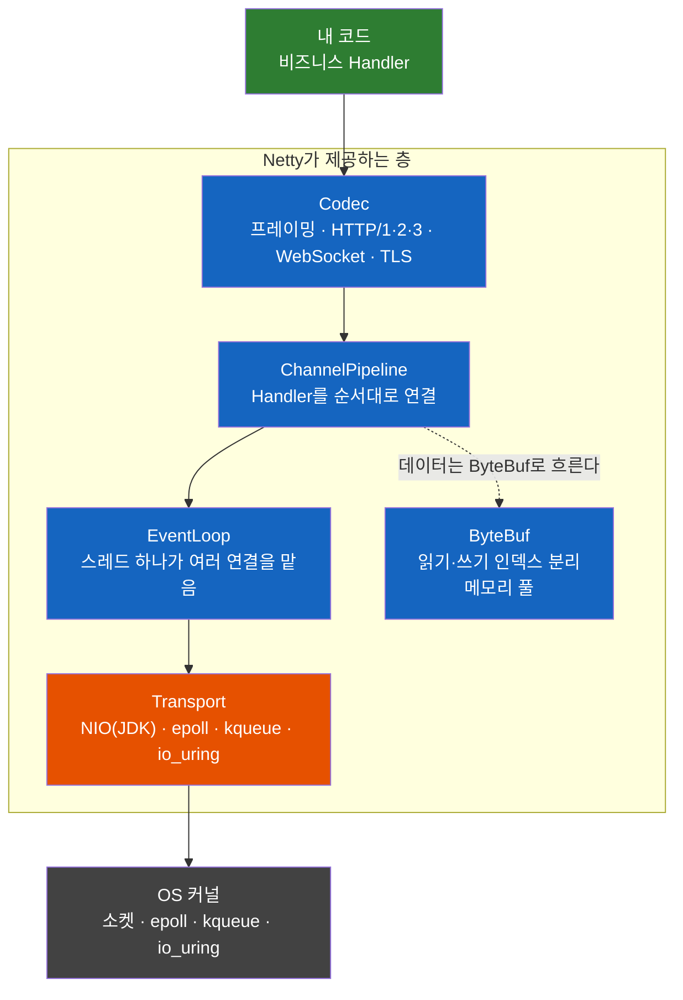
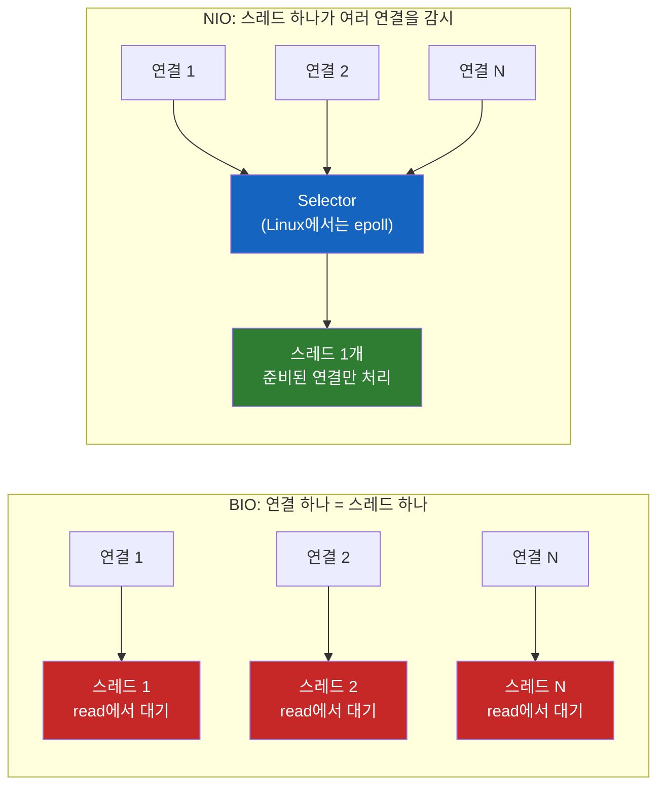
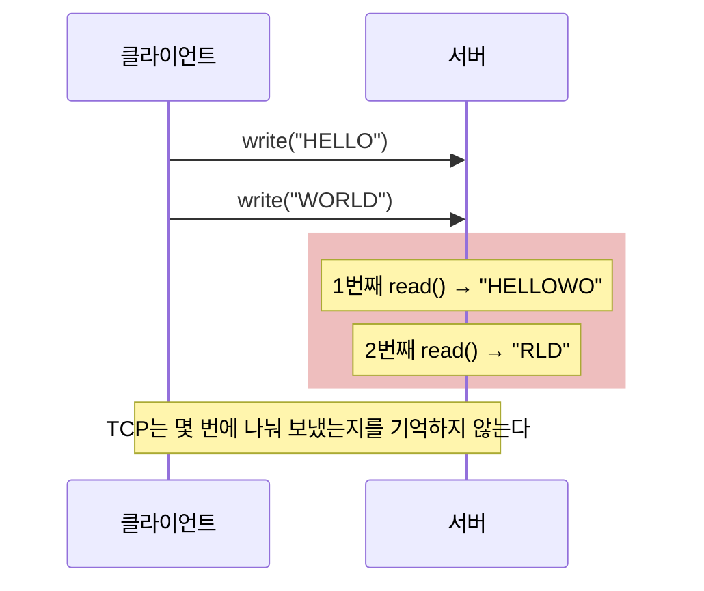
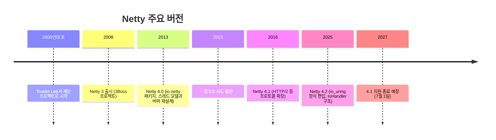

# Netty — 자바에 이미 NIO가 있는데 왜 Netty를 쓸까?

Java는 2002년(Java 1.4)부터 논블로킹 소켓을 지원했다. 그런데 왜 Spring WebFlux, gRPC, Elasticsearch, 카카오톡 서버는 하나같이 JDK NIO를 직접 쓰지 않고 Netty 위에서 돌아갈까?

## 결론부터 말하면

**JDK NIO가 주는 것은 "지금 읽거나 쓸 준비가 된 소켓이 어느 것인지 운영체제에 물어보는 방법"까지다.** 그 위에서 필요한 버퍼 관리, 메시지 경계 자르기, 다 못 보낸 데이터 처리, 스레드 배치, JDK 버그 회피, HTTP·TLS 같은 프로토콜 구현은 전부 개발자 몫으로 남는다. Netty는 바로 그 위층 전체를 제공하는 **비동기 이벤트 기반 네트워크 애플리케이션 프레임워크** 다. NIO가 고성능 서버를 "가능하게" 만들었다면, Netty는 그런 서버를 "매일 만들 수 있게" 만들었다.



그림에서 JDK NIO는 맨 아래 Transport 칸의 선택지 하나일 뿐이다. 나머지 파란 칸이 NIO만 쓸 때 직접 만들어야 하는 부분이다.

| 직접 풀어야 하는 문제 | JDK NIO만 쓸 때 | Netty를 쓸 때 |
|------|------|------|
| 읽기·쓰기 버퍼 | `ByteBuffer`의 `flip()`/`compact()`를 직접 관리 | `ByteBuf`가 읽기·쓰기 위치를 따로 관리 |
| 메시지 경계 | 연결마다 누적 버퍼를 두고 직접 자름 | `LengthFieldBasedFrameDecoder` 등을 파이프라인에 추가 |
| 다 못 보낸 데이터 | `OP_WRITE` 등록·해제를 직접 | `write()`가 출력 버퍼에 쌓고 알아서 마저 보냄 |
| 스레드 배치 | Selector 스레드와 작업 스레드를 직접 설계 | EventLoop: 연결 하나는 평생 스레드 하나에 고정 |
| JDK epoll 버그 | 직접 감지·우회 | Selector 자동 재생성 내장 |
| HTTP·TLS·WebSocket | 직접 구현 (`SSLEngine` 포함) | 코덱 Handler를 추가 |
| 전송 방식 교체 | 코드 재작성 | `IoHandler` 팩토리와 Channel 클래스만 교체 |

## 1. 왜 NIO만으로는 부족했을까?

### 1.1 출발점: 연결 하나에 스레드 하나

소켓은 네트워크 연결의 양 끝에서 프로그램이 데이터를 읽고 쓰는 창구다. Java 1.0부터 있던 `java.net.Socket`은 **블로킹** 방식으로 동작한다. 블로킹이란 `read()`를 호출했는데 아직 데이터가 오지 않았으면, 데이터가 올 때까지 호출한 스레드가 그 자리에 멈춰 기다린다는 뜻이다. 그래서 여러 클라이언트를 동시에 받으려면 연결마다 스레드를 하나씩 붙일 수밖에 없다.

```java
ServerSocket server = new ServerSocket(8080);
while (true) {
    Socket socket = server.accept();            // 연결이 올 때까지 멈춤
    new Thread(() -> handle(socket)).start();   // 연결마다 스레드 하나
}
```

이 방식을 흔히 BIO(Blocking I/O)라고 부른다. 코드는 단순하지만, 동시 연결이 1만 개면 스레드도 1만 개가 된다. 스레드마다 별도의 스택 메모리(64비트 Linux HotSpot 기본 1MB)가 잡히고, 운영체제는 1만 개 스레드 사이를 오가며 문맥 교환 비용을 치른다. 더 아까운 점은 그 스레드 대부분이 일을 하는 게 아니라 `read()`에서 데이터를 **기다리고만** 있다는 것이다. 이 한계가 1999년에 이름 붙은 C10K 문제이고, 자세한 역사는 [C10K 문제의 역사와 해결](../network/C10K-문제의-역사와-해결.md)에서 다뤘다.

### 1.2 Java 1.4의 해답: 한 스레드가 여러 연결을 지켜보는 NIO

2002년 Java 1.4는 `java.nio` 패키지로 이 문제에 답했다. NIO(New I/O)의 핵심은 세 가지다.

- **Channel:** 논블로킹 모드로 둘 수 있는 소켓이다. 데이터가 없으면 `read()`가 기다리지 않고 0을 반환하며 즉시 돌아온다.
- **ByteBuffer:** Channel에서 읽고 쓰는 데이터를 담는 버퍼다.
- **Selector:** 스레드 하나가 수천 개의 Channel을 등록해 두고 "이 중에 지금 읽을 데이터가 온 건 어느 것이냐"를 운영체제에 한 번에 묻는 장치다. Linux에서는 내부적으로 `epoll`을 쓴다.



이제 스레드 하나로 수천 개의 연결을 처리할 수 있다. 문제가 해결된 것처럼 보인다. 그런데 정말 그럴까?

### 1.3 그런데 직접 짜보면 벽이 나온다

NIO로 가장 단순한 서버, 받은 바이트를 그대로 돌려주는 에코 서버를 짜보자.

```java
Selector selector = Selector.open();
ServerSocketChannel server = ServerSocketChannel.open();
server.bind(new InetSocketAddress(8080));
server.configureBlocking(false);                   // 논블로킹 모드로 전환
server.register(selector, SelectionKey.OP_ACCEPT); // "새 연결이 오면 알려줘"

while (true) {
    selector.select();                             // [벽 3] 이벤트가 없는데 0을 반환하며 계속 깨어나는 JDK 버그
    Iterator<SelectionKey> keys = selector.selectedKeys().iterator();
    while (keys.hasNext()) {
        SelectionKey key = keys.next();
        keys.remove();                             // 직접 지우지 않으면 다음 루프에 또 나온다
        if (key.isAcceptable()) {
            SocketChannel client = server.accept();
            client.configureBlocking(false);
            client.register(selector, SelectionKey.OP_READ, ByteBuffer.allocate(1024));
        } else if (key.isReadable()) {
            SocketChannel client = (SocketChannel) key.channel();
            ByteBuffer buf = (ByteBuffer) key.attachment();
            if (client.read(buf) == -1) {          // -1 = 상대가 연결을 닫음
                client.close();
                continue;
            }
            buf.flip();                            // [벽 1] 쓰기 모드 → 읽기 모드. 빠뜨리면 아무것도 안 나간다
            client.write(buf);                     // [벽 2] 한 번에 다 안 써질 수 있다
            buf.compact();                         // 못 보낸 바이트를 앞으로 당기고 다시 쓰기 모드로
            // [벽 1] 방금 읽은 바이트가 "메시지 하나"라는 보장이 없다
            // [벽 2] 여기서 DB를 100ms 호출하면 이 Selector의 모든 연결이 같이 멈춘다
            // [벽 4] 그리고 이건 에코일 뿐, HTTP도 TLS도 아니다
        }
    }
}
```

30줄 남짓인데 주석으로 표시한 벽이 네 종류나 된다. 하나씩 보자.

#### 벽 1. 버퍼와 메시지 경계

`ByteBuffer`는 위치 포인터(`position`) 하나로 쓰기와 읽기를 함께 처리한다. 그래서 버퍼에 데이터를 채운 뒤 꺼내려면 `flip()`으로 "이제부터 읽기 모드"라고 직접 알려줘야 하고, 다 못 꺼냈으면 `compact()`로 남은 바이트를 정리해야 한다. 하나라도 빠뜨리면 예외 없이 조용히 엉뚱한 데이터를 읽는다.

더 근본적인 문제는 TCP 자체에 있다. Netty 사용자 가이드의 표현을 빌리면 TCP 수신 버퍼는 **"패킷의 큐가 아니라 바이트의 큐"** 다. 클라이언트가 `write()`를 두 번 했다고 서버의 `read()`가 두 번 나뉘어 들어온다는 보장이 없다.



그래서 서버는 연결마다 누적 버퍼를 따로 두고, "앞 4바이트는 길이" 또는 "줄바꿈까지가 한 메시지" 같은 규칙으로 바이트 흐름을 메시지 단위로 잘라내야 한다. 이 작업을 **프레이밍(framing)** 이라고 한다. 모든 TCP 서버가 반드시 해야 하는 일인데, NIO는 아무것도 도와주지 않는다.

#### 벽 2. 다 못 보낸 데이터와 스레드

쓰기도 한 번에 끝나지 않는다. 운영체제의 송신 버퍼가 가득 차 있으면 `write()`는 요청한 바이트 중 일부만 보내고 돌아온다. 나머지는 어딘가 보관해 뒀다가, Selector에 `OP_WRITE`를 등록해 "다시 쓸 수 있게 되면 알려줘"라고 부탁하고, 다 보내면 `OP_WRITE`를 다시 해제해야 한다. 해제를 잊으면 소켓은 거의 항상 쓰기 가능 상태이므로 Selector가 쉴 새 없이 깨어나 CPU를 태운다.

스레드 문제도 남아 있다. Selector를 돌리는 스레드는 하나뿐이라서, 그 스레드에서 무거운 작업을 하면 그 Selector에 등록된 **모든 연결이 함께 멈춘다.** 그렇다고 작업을 별도 스레드 풀로 넘기면 이번에는 여러 스레드가 같은 연결의 버퍼를 건드리게 되어 동기화를 직접 설계해야 한다. "어떤 일을 어느 스레드에서 할지"라는 스레드 모델 전체가 개발자 숙제다.

#### 벽 3. JDK 자체의 버그

`selector.select()`는 준비된 Channel이 생길 때까지 블로킹되어야 정상이다. 그런데 Linux의 JDK에는 select가 준비된 Channel 없이 **0을 반환하며 끝없이 깨어나는** 버그가 있었다([JDK-6670302](https://bugs.openjdk.org/browse/JDK-6670302), 제목부터 "NIO selector wakes up with 0 selected keys infinitely"다). 위 코드의 `while (true)`는 할 일 없이 무한히 돌고, CPU 사용률은 100%에 붙는다. 네트워크 코드에서 흔히 "epoll 100% CPU 버그"라고 부르는 그 문제다.

애플리케이션 개발자가 JDK 버그를 직접 감지하고 우회해야 한다는 것 자체가 큰 부담이다. Netty는 select가 타임아웃 전에 빈손으로 돌아오는 횟수를 세다가 기본 512회(`io.netty.selectorAutoRebuildThreshold`)를 넘으면 Selector를 새로 만들고 모든 Channel을 옮겨 등록한다. 이 우회 로직은 Netty 4.2의 `NioIoHandler`에도 기본으로 켜져 있다.

#### 벽 4. 프로토콜은 전부 직접

앞의 세 벽을 다 넘어도 손에 쥔 것은 "바이트를 안정적으로 주고받는 서버"일 뿐이다. 실제로 필요한 것은 HTTP 요청 파싱, keep-alive, chunked 전송, WebSocket 업그레이드, HTTP/2 프레임, 그리고 TLS다. 특히 JDK의 TLS 엔진인 `SSLEngine`은 핸드셰이크 상태 기계를 NIO 버퍼와 맞물려 직접 돌려야 해서 제대로 쓰기 어려운 API로 악명이 높다.

이 네 개의 벽은 회사마다, 프로젝트마다 반복해서 다시 넘어야 했다. 그렇다면 누군가 한 번 제대로 넘어 두고 모두가 재사용하면 되지 않을까?

### 1.4 Netty의 탄생: 한 대학생이 시작한 프로젝트

Netty는 한국인 개발자 Trustin Lee(이희승)가 대학생 시절인 2000년대 초에 시작한 프로젝트다. 정확한 시작 연도는 자료마다 2001년, 2004년 등으로 엇갈린다. 그는 Java 진영의 또 다른 NIO 프레임워크인 Apache MINA의 공동 창시자이기도 하다. 이후 Red Hat(JBoss)에 합류하면서 Netty는 JBoss 프로젝트가 되었고, 2008년 Netty 3가 나왔다. 오래된 코드에서 `org.jboss.netty` 패키지가 보이는 이유가 이것이다. 그가 Red Hat을 떠난 뒤 Netty는 독립 커뮤니티 프로젝트가 되었고, 지금은 Norman Maurer, Chris Vest 등이 이끌고 있다.



버전마다 무엇이 왜 바뀌었는지를 보면 Netty가 어떤 문제와 싸워 왔는지가 보인다.

- **Netty 4.0 (2013)** 은 Netty 3의 약점을 정면으로 고쳤다. Netty 3에서는 인바운드 처리는 I/O 스레드에서, 아웃바운드 쓰기는 호출한 스레드에서 실행되어 "어떤 스레드가 어떤 데이터를 어떤 순서로 건드리는지" 추론하기 어려웠다. 4.0은 모든 I/O 이벤트를 연결이 묶인 EventLoop 스레드에서 처리하도록 통일했고, 직접 메모리 버퍼 풀을 도입했으며, JDK NIO를 거치지 않는 Linux 전용 epoll transport도 추가했다(4.0.16부터).
- **5.0** 은 2015년 한 번 중단되었다. `ForkJoinPool` 도입이 복잡도만 늘리고 뚜렷한 성능 이득을 보여주지 못했다는 판단이었다(netty/netty#4466). 이후 새 버퍼 API로 다시 알파를 냈지만(마지막 5.0.0.Alpha5, 2022년), 정식 릴리스 없이 4.x가 주력으로 남아 있다.
- **Netty 4.1 (2016)** 은 HTTP/2 같은 프로토콜 지원을 넓혔고, 10년 가까이 사실상의 표준 버전이었다.
- **Netty 4.2 (2025)** 는 인큐베이터에 있던 io_uring transport를 본체로 들이고 EventLoop를 `IoHandler` 기반 구조로 재편했다. 4.1 코드와 대체로 호환되지만 일부 API와 기본 동작이 바뀌었고, 4.1과 4.2를 한 classpath에 함께 둘 수 없으므로 업그레이드 전에 공식 마이그레이션 가이드를 확인해야 한다.

2026년 10월 기준 최신 버전은 4.2.19.Final이고, 4.1은 2027년 7월 1일에 지원이 끝난다. **지금 새로 배운다면 4.2가 기준** 이다.

## 2. Netty는 무엇을 해주나 — 다섯 가지 핵심 부품

결론의 그림에 있던 다섯 칸이 1장의 네 벽을 하나씩 맡는다.

| 1장의 벽 | Netty의 부품 | 어떻게 넘는가 |
|------|------|------|
| 벽 1. 버퍼 | `ByteBuf` | 읽기·쓰기 위치를 따로 관리해 `flip()`이 필요 없다 |
| 벽 1. 메시지 경계 | Codec (`ByteToMessageDecoder` 계열) | 바이트를 모아 완성된 메시지 단위로 다음 Handler에 넘긴다 |
| 벽 2. 부분 쓰기 | Channel의 출력 버퍼 | `write()`는 출력 버퍼에 쌓고, 소켓이 다시 쓸 수 있게 되면 Netty가 마저 보낸다 |
| 벽 2. 스레드 | `EventLoop` | 연결 하나는 평생 스레드 하나에서만 처리된다 |
| 벽 3. JDK 버그 | Transport | NIO transport는 Selector 재생성으로 우회하고, native transport는 JDK NIO를 아예 거치지 않는다 |
| 벽 4. 프로토콜 | Codec, `SslHandler` | HTTP/1.1, HTTP/2, HTTP/3, WebSocket, TLS가 Handler로 준비되어 있다 |

### 2.1 Channel과 Transport: 같은 코드, 다른 엔진

Netty에서 연결 하나는 `Channel` 객체 하나다. 이 Channel이 실제로 어떤 방식으로 운영체제와 대화할지를 정하는 것이 **Transport** 다. 모든 OS에서 동작하는 NIO transport 외에, JNI로 운영체제 기능을 직접 부르는 native transport가 있다. 공식 문서는 native transport가 플랫폼 전용 기능을 더하고, 가비지를 덜 만들며, 대체로 NIO transport보다 성능이 좋다고 설명한다.

| Transport | 동작 환경 | 특징 |
|------|------|------|
| NIO | 모든 OS | JDK `Selector` 사용 |
| epoll | Linux | JNI로 epoll 직접 호출 (4.0.16부터) |
| kqueue | macOS, BSD | JNI로 kqueue 직접 호출 (4.1.11부터) |
| io_uring | Linux | 4.2부터 본체 포함, JDK 9 이상 필요 |

중요한 점은 Transport를 바꿔도 **Handler 코드는 한 줄도 바뀌지 않는다** 는 것이다. 이 차이는 3장에서 코드로 확인한다.

### 2.2 EventLoop: 연결은 평생 한 스레드에 묶인다

EventLoop는 스레드 하나가 무한 루프를 돌면서 "I/O 이벤트 처리"와 "큐에 쌓인 작업 실행"을 번갈아 하는 구조다. Channel은 생성될 때 EventLoop 하나에 등록되고, 그 뒤로 등록이 유지되는 동안(보통은 연결이 끝날 때까지) 그 Channel의 모든 I/O 이벤트는 **그 EventLoop의 스레드에서만** 처리된다. 다른 스레드에서 `channel.write()`를 호출해도 Netty가 그 작업을 해당 EventLoop의 큐로 넘긴다.

이 규칙 덕분에 연결별 상태를 그 EventLoop 안에서만 읽고 쓴다면 Handler 안에서 락이 필요 없다. 같은 연결의 데이터를 두 스레드가 동시에 건드리는 일이 구조적으로 일어나지 않기 때문이다. 반대로 여러 연결이 함께 쓰는 `@Sharable` Handler의 필드나, 별도 작업 스레드와 공유하는 상태는 여전히 직접 스레드 안전하게 만들어야 한다. 벽 2에서 "직접 설계해야 했던 스레드 모델"을 Netty가 하나의 규칙으로 정해 준 셈이다.

다만 Netty도 대신 넘어주지 못하는 절반이 있다. EventLoop 스레드 하나는 수많은 연결을 함께 맡고 있으므로, **Handler 안에서 블로킹 호출(DB 조회, 외부 API 동기 호출)을 하면 그 EventLoop의 모든 연결이 함께 멈춘다.** 무거운 작업은 Handler 안에서 별도 작업 스레드 풀에 제출하고, 결과만 `ctx.writeAndFlush()`로 돌려보내야 한다. 앞서 말했듯 다른 스레드에서 호출해도 Netty가 쓰기를 해당 EventLoop로 넘겨 준다. (4.1까지 쓰이던 `pipeline.addLast(EventExecutorGroup, handler)` 방식은 4.2에서 deprecated 되었다.) Netty를 쓸 때 가장 흔한 실수가 바로 이것이다.

### 2.3 ChannelPipeline과 Handler: 일을 나눠 맡기는 컨베이어

Channel마다 `ChannelPipeline`이 하나씩 있고, 그 안에 `ChannelHandler`들이 순서대로 연결된다. 들어온 바이트는 "프레임 자르기 → 메시지 객체로 변환 → 비즈니스 처리" 순으로 Handler를 통과하고, 나가는 응답은 반대 방향으로 "객체 → 바이트" 변환을 거친다. 각 Handler는 자기 일 하나만 알면 된다. 인바운드와 아웃바운드가 어떤 순서로 흐르는지는 [Netty Channel Pipeline 인바운드와 아웃바운드 흐름](./Netty-Channel-Pipeline-인바운드와-아웃바운드-흐름.md)에서 자세히 다뤘다.

### 2.4 ByteBuf: flip()이 없는 버퍼

`ByteBuf`는 `ByteBuffer`를 대신하는 Netty의 버퍼다. 가장 눈에 띄는 차이는 읽는 위치(`readerIndex`)와 쓰는 위치(`writerIndex`)가 따로 있다는 점이다.

```java
// JDK ByteBuffer: position 하나로 쓰기와 읽기를 겸한다
ByteBuffer nio = ByteBuffer.allocate(16);
nio.putInt(42);
nio.flip();               // 빠뜨리면 getInt()가 방금 쓴 값 다음 칸을 읽어 0이 나온다
int a = nio.getInt();

// Netty ByteBuf: 읽는 위치와 쓰는 위치가 따로 있다
ByteBuf buf = Unpooled.buffer(16);
buf.writeInt(42);         // writerIndex만 4 증가
int b = buf.readInt();    // readerIndex만 4 증가, flip() 불필요
```

성능 쪽 차이도 크다. 네트워크 I/O에 유리한 직접 메모리(JVM 힙 밖의 메모리)는 할당과 해제가 비싸서, Netty는 버퍼를 풀(pool)에 모아 두고 재사용한다. 그 대가로 개발자는 다 쓴 버퍼를 `release()`로 돌려줘야 한다(참조 카운팅). 이 책임을 놓치면 메모리 누수가 생긴다.

### 2.5 Codec: 프로토콜을 Handler로 꽂는다

Codec은 "바이트 ↔ 메시지" 변환을 맡는 Handler다. 벽 1의 프레이밍은 `LengthFieldBasedFrameDecoder`(길이 헤더 방식), `LineBasedFrameDecoder`(줄바꿈 방식) 같은 디코더가 맡고, 벽 4의 프로토콜은 `HttpServerCodec`, HTTP/2·HTTP/3 코덱, WebSocket Handler, TLS를 처리하는 `SslHandler`가 맡는다. 필요한 Codec을 파이프라인에 추가하면 그 프로토콜을 말하는 서버가 된다.

여기서 Java 개발자가 자주 헷갈리는 점 하나를 짚고 가자. **Netty는 Tomcat 같은 서블릿 컨테이너가 아니다.** Servlet API를 구현하지 않으며, HTTP는 Netty가 다룰 수 있는 여러 프로토콜 중 하나일 뿐이다. Redis 프로토콜, MQTT, 사내 바이너리 전문(電文)도 같은 방식으로 Codec을 끼워 처리한다.

## 3. 코드로 보는 차이

### 3.1 같은 에코 서버, Netty 4.2 버전

1.3의 NIO 에코 서버를 Netty 4.2 공식 예제 스타일로 다시 쓰면 이렇다.

```java
EventLoopGroup group = new MultiThreadIoEventLoopGroup(NioIoHandler.newFactory());
try {
    ServerBootstrap b = new ServerBootstrap();
    b.group(group)
     .channel(NioServerSocketChannel.class)
     .childHandler(new ChannelInitializer<SocketChannel>() {
         @Override
         public void initChannel(SocketChannel ch) {
             ch.pipeline().addLast(new EchoServerHandler());   // 연결마다 파이프라인 구성
         }
     });
    b.bind(8080).sync()                  // bind도 비동기, 반환된 ChannelFuture를 sync()로 기다림
     .channel().closeFuture().sync();    // 서버 소켓이 닫힐 때까지 대기
} finally {
    group.shutdownGracefully();
}

public class EchoServerHandler extends ChannelInboundHandlerAdapter {
    @Override
    public void channelRead(ChannelHandlerContext ctx, Object msg) {
        ctx.write(msg);     // 받은 ByteBuf를 출력 버퍼에 넣는다. 부분 쓰기는 Netty가 처리
    }

    @Override
    public void channelReadComplete(ChannelHandlerContext ctx) {
        ctx.flush();        // 이번에 읽은 묶음에서 쌓인 write를 한 번에 소켓으로
    }

    @Override
    public void exceptionCaught(ChannelHandlerContext ctx, Throwable cause) {
        ctx.close();        // 예외가 나면 그 연결만 닫는다
    }
}
```

NIO 버전에 있던 코드가 어디로 갔는지 비교해 보자.

| NIO 버전에 있던 것 | Netty 버전에서는 |
|------|------|
| `selectedKeys()` 순회와 `keys.remove()` | EventLoop 내부로 들어감 |
| `OP_ACCEPT`, `OP_READ` 등록 | `ServerBootstrap`이 처리 |
| `flip()`, `compact()` | 사라짐 (`ByteBuf`) |
| 부분 쓰기와 `OP_WRITE` 관리 | `write()`가 출력 버퍼에 쌓고 Netty가 마저 보냄 |
| `read() == -1` 확인 후 close | Netty가 연결 종료를 감지해 이벤트로 알려줌 |
| epoll 버그 우회 | Transport 내부에 내장 |

`write()`와 `flush()`가 나뉘어 있는 것도 의도된 설계다. 시스템 콜은 비싸므로 여러 `write()`를 출력 버퍼에 모아 두었다가 `flush()` 한 번으로 묶어 보내면 시스템 콜 횟수가 줄어든다.

다만 출력 버퍼는 무한하지 않다. 받는 쪽이 느린데 계속 `write()`하면 보내지 못한 데이터가 출력 버퍼에 쌓여 결국 메모리가 부족해진다. Netty는 출력 버퍼가 상한(`WriteBufferWaterMark`의 high)을 넘으면 `channel.isWritable()`을 `false`로 바꾸고 `channelWritabilityChanged()` 이벤트로 알려준다. 대량 전송을 하는 Handler는 이 신호를 보고 쓰기를 잠시 멈춰야 한다. 일종의 배압(backpressure)이다.

> 참고로 [C10K 문제의 역사와 해결](../network/C10K-문제의-역사와-해결.md)의 Netty 예제처럼 `new NioEventLoopGroup()`을 쓰는 코드가 아직 많다. 4.1까지의 표준 방식이고 4.2에서도 동작하지만, 4.2에서는 deprecated 되었다. 4.2 마이그레이션 가이드는 `new MultiThreadIoEventLoopGroup(NioIoHandler.newFactory())`로 바꾸라고 안내한다.

### 3.2 메시지 경계 문제는 Handler 한 줄

벽 1의 프레이밍은 파이프라인 맨 앞에 디코더 하나를 넣으면 해결된다. "앞 4바이트에 본문 길이가 들어 있다"는 흔한 규칙이라면 이렇게 쓴다.

```java
ch.pipeline().addLast(
    new LengthFieldBasedFrameDecoder(
        1024 * 1024,   // maxFrameLength: 이보다 긴 메시지는 거부 (메모리 공격 방어)
        0,             // lengthFieldOffset: 길이 필드는 맨 앞에
        4,             // lengthFieldLength: 길이 필드는 4바이트
        0,             // lengthAdjustment: 길이 값이 본문 길이 그대로
        4),            // initialBytesToStrip: 길이 헤더 4바이트는 떼고 넘김
    new MyMessageHandler()   // 여기서는 항상 "완성된 메시지 하나"만 받는다
);
```

1.3의 시퀀스 다이어그램처럼 "HELLOWO"와 "RLD"로 쪼개져 들어와도, 디코더가 바이트를 모아 두었다가 길이만큼 찼을 때 메시지 하나로 넘긴다. `MyMessageHandler`는 TCP가 바이트를 어떻게 쪼갰는지 전혀 몰라도 된다.

### 3.3 전송 방식 교체는 두 곳만

Linux 서버에서 JDK Selector 대신 epoll이나 io_uring을 쓰고 싶다면, `IoHandler` 팩토리와 서버 Channel 클래스 두 곳만 바꾸면 된다. `EchoServerHandler`는 그대로다.

| Transport | `IoHandler` 팩토리 | 서버 Channel 클래스 |
|------|------|------|
| NIO | `NioIoHandler.newFactory()` | `NioServerSocketChannel` |
| epoll | `EpollIoHandler.newFactory()` | `EpollServerSocketChannel` |
| kqueue | `KQueueIoHandler.newFactory()` | `KQueueServerSocketChannel` |
| io_uring | `IoUringIoHandler.newFactory()` | `IoUringServerSocketChannel` |

```java
// NIO → Linux epoll: 이 두 줄만 바뀐다
EventLoopGroup group = new MultiThreadIoEventLoopGroup(EpollIoHandler.newFactory());
b.group(group).channel(EpollServerSocketChannel.class);
```

native transport는 운영체제별 바이너리가 필요하므로 의존성에 classifier를 붙여야 한다(예: `netty-transport-native-epoll`의 `linux-x86_64`). NIO로 개발하고 운영 환경에서만 native transport로 바꾸는 구성이 흔한 이유가 이 교체 비용이 작기 때문이다.

## 4. 어디서 쓰이나 — 이미 쓰고 있는 Netty

Netty의 API를 직접 만져 본 적이 없어도, Java 백엔드 개발자라면 이미 Netty를 쓰고 있을 가능성이 높다. 많은 프레임워크와 라이브러리가 Netty를 네트워크 엔진으로 품고 있기 때문이다.

| 분야 | 프로젝트 | Netty의 역할 |
|------|------|------|
| 웹 프레임워크 | Spring WebFlux, Vert.x | WebFlux는 Spring Boot 기본 서버가 Reactor Netty |
| RPC | gRPC-Java, Apache Dubbo, Armeria(LINE) | 서버·클라이언트 전송 계층 |
| 데이터 저장소·검색 | Elasticsearch, Cassandra | 노드 간 통신과 클라이언트 통신 |
| 클라이언트 라이브러리 | Lettuce (Redis) | 논블로킹 Redis 클라이언트의 기반 |
| 게이트웨이 | Netflix Zuul | HTTP 게이트웨이 |
| 빅데이터·메시징 | Apache Spark, Flink, Pulsar | 내부 데이터 전송 |

Netty 공식 Adopters 페이지에는 Apple, Twitter(Finagle), Alibaba, 카카오톡, LINE 같은 이름도 올라 있다. 반대로 Spring MVC를 쓰는 일반적인 Spring Boot 애플리케이션은 기본 서버가 Tomcat이므로 서버 쪽은 Netty가 아니다. "WebFlux = Netty, MVC = Tomcat"이 기본 구성이라고 기억해 두면 된다.

## 5. Virtual Thread 시대에도 Netty가 필요할까?

Java 21에서 정식 도입된 Virtual Thread는 이 이야기의 출발점을 흔든다. Virtual Thread는 소켓 I/O처럼 대기하는 순간 JVM이 OS 스레드에서 떼어내므로(Java 21에서는 `synchronized` 블록 안에서 대기하면 OS 스레드를 붙잡는 pinning이 있었고, JDK 24에서 해소되었다), 1.1의 "연결 하나에 스레드 하나" 구조를 유지한 채 스레드 생성 부분만 바꾸면 수만 연결을 감당할 수 있다. 단, `new Thread(...)`는 Java 21에서도 여전히 OS 스레드와 1:1인 Platform Thread를 만든다. `Thread.ofVirtual().start(() -> handle(socket))`처럼 Virtual Thread를 명시적으로 만들어야 한다. 실제로 Helidon 4는 기존의 Netty 기반 웹 서버를 버리고 Virtual Thread 기반 서버(Níma)를 처음부터 새로 만들었다. Helidon 팀은 Netty 기반 리액티브 런타임과 대등한 성능을 내면서도 코드는 훨씬 단순한 명령형 스타일로 쓸 수 있다고 설명한다.

하지만 이것이 곧 Netty의 퇴장을 뜻하지는 않는다. Virtual Thread가 덜어주는 것은 주로 "스레드 비용" 쪽, 즉 벽 2의 일부다. 메시지 프레이밍, HTTP/2·HTTP/3·TLS 같은 프로토콜 구현, 직접 메모리 풀링, native transport는 여전히 누군가 만들어야 하고, Netty는 그 층을 20년 넘게 다듬어 온 부품이다. Helidon 팀도 지적했듯 Netty 기반 런타임이 블로킹 작업만 Virtual Thread로 넘기는 방식도 가능하다. Netty 자체도 4.2에서 io_uring을 정식으로 들이며 계속 릴리스되고 있다.

정리하면 애플리케이션 개발자가 Netty API를 직접 만질 일은 줄어드는 방향이지만, 프로토콜과 전송 계층을 다루는 프레임워크·라이브러리 층에서는 여전히 기본 부품으로 쓰이고 있다.

## 6. 정리

### 핵심 포인트

1. **NIO는 재료, Netty는 그 위층 전체다**
   - JDK NIO는 Channel, Selector, ByteBuffer라는 저수준 도구만 준다
   - 버퍼 관리, 프레이밍, 스레드 모델, 버그 회피, 프로토콜은 Netty가 채운다

2. **Netty가 대신 넘어주는 네 개의 벽**
   - 버퍼와 메시지 경계, 부분 쓰기와 스레드 배치, JDK epoll 버그, 프로토콜 구현
   - 단, Handler 안의 블로킹 호출은 Netty도 막아주지 못한다

3. **다섯 개의 핵심 부품**
   - Transport(전송 엔진), EventLoop(스레드 모델), ChannelPipeline(Handler 체인), ByteBuf(버퍼), Codec(프로토콜)
   - Transport를 바꿔도 Handler 코드는 그대로다

4. **지금 배운다면 Netty 4.2**
   - `new MultiThreadIoEventLoopGroup(NioIoHandler.newFactory())`가 4.2 방식이다
   - 4.1은 2027년 7월 1일에 지원이 끝난다

5. **이미 간접적으로 쓰고 있다**
   - Spring WebFlux, gRPC-Java, Elasticsearch, Lettuce가 Netty 위에서 돈다

### 함께 읽기

- [C10K 문제의 역사와 해결](../network/C10K-문제의-역사와-해결.md) - BIO의 한계와 epoll이 등장한 배경
- [Java I/O가 중요한 진짜 이유](./Java-IO가-중요한-진짜-이유.md) - 웹 개발에서 I/O가 병목이 되는 지점
- [Netty Channel Pipeline 인바운드와 아웃바운드 흐름](./Netty-Channel-Pipeline-인바운드와-아웃바운드-흐름.md) - 파이프라인 안에서 이벤트가 흐르는 순서

---

## 출처

- [Netty 공식 사이트](https://netty.io/) - 공식 소개와 기능 목록, 최신 릴리스
- [Netty User Guide for 4.x](https://netty.io/wiki/user-guide-for-4.x.html) - 공식 사용자 가이드 (스트림 기반 전송과 프레이밍)
- [Netty 4.2 Migration Guide](https://netty.io/wiki/netty-4.2-migration-guide.html) - `MultiThreadIoEventLoopGroup`과 `IoHandler` 팩토리
- [Netty 4.2.0.Final released](https://netty.io/news/2025/04/03/4-2-0.html) - 4.2 릴리스 공지
- [Netty 4.1 will be EOL on July 1st, 2027](https://netty.io/news/2026/09/09/4-1-EOL-announcement.html) - 4.1 지원 종료 공지
- [Netty 4.0.0.Final released](https://netty.io/news/2013/07/16/4-0-0-Final.html) - 4.0 릴리스 공지
- [Native transports](https://netty.io/wiki/native-transports.html) - epoll, kqueue native transport
- [Netty Adopters](https://netty.io/wiki/adopters.html) - Netty를 쓰는 조직과 프로젝트
- [NioEventLoopGroup API (4.2)](https://netty.io/4.2/api/io/netty/channel/nio/NioEventLoopGroup.html) - deprecated 표시와 epoll 버그 우회 설명
- [NioIoHandler.java (4.2 branch)](https://github.com/netty/netty/blob/4.2/transport/src/main/java/io/netty/channel/nio/NioIoHandler.java) - Selector 자동 재생성 임곗값
- [netty/netty#4466 Remove master branch](https://github.com/netty/netty/issues/4466) - 첫 5.0 시도 중단 사유
- [JDK-6670302: NIO selector wakes up with 0 selected keys infinitely](https://bugs.openjdk.org/browse/JDK-6670302) - JDK epoll 버그
- [Spring Boot How-to: Embedded Web Servers](https://docs.spring.io/spring-boot/how-to/webserver.html) - WebFlux 기본 서버 Reactor Netty
- [Netty - One Framework to rule them all (Norman Maurer)](https://www.youtube.com/watch?v=DKJ0w30M0vg) - Netty 3에서 4로의 설계 변화
- [Netty (software) - Wikipedia](https://en.wikipedia.org/wiki/Netty_%28software%29) - 역사 개요
- [Open-sourcing Armeria (LINE Engineering)](https://engineering.linecorp.com/en/blog/open-sourcing-armeria) - Trustin Lee 소개 (Netty 창시자, Apache MINA 공동 창시자)
- [Helidon and Virtual Threads](https://medium.com/helidon/helidon-and-virtual-threads-91d4e9bcb55c) - Helidon 4가 Netty를 Virtual Thread 서버로 대체한 이유
- [Helidon 4 Adopts Virtual Threads (InfoQ)](https://www.infoq.com/articles/helidon-4-adopts-virtual-threads) - Helidon Níma 아키텍처
