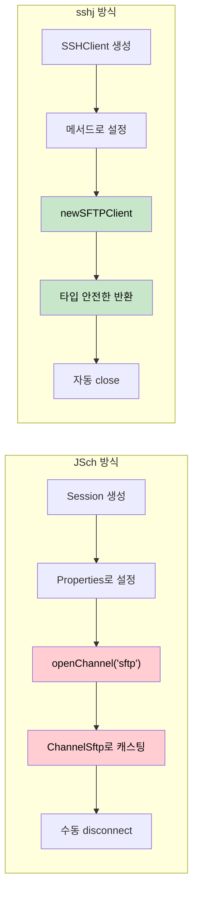
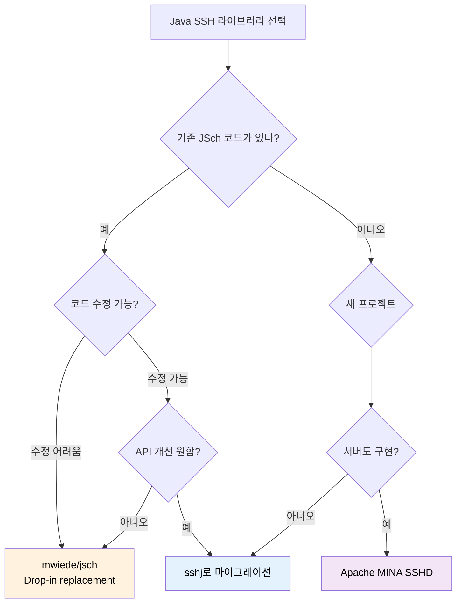

# sshj-현대적인 Java SSH 라이브러리

JSch의 복잡한 API에 지친 개발자들을 위한 대안. sshj는 "pleasantly usable API"를 목표로 설계된 현대적인 Java SSH 라이브러리다.

## 결론부터 말하면

**sshj**는 JSch보다 깔끔하고 직관적인 API를 제공하는 Java SSH 라이브러리다. 새 프로젝트를 시작한다면 sshj를 고려해볼 만하다.

```java
// JSch - 장황하고 캐스팅이 필요함
JSch jsch = new JSch();
Session session = jsch.getSession("user", "host", 22);
session.setPassword("password");
session.setConfig("StrictHostKeyChecking", "no");
session.connect();
ChannelSftp sftp = (ChannelSftp) session.openChannel("sftp");  // 캐스팅 필요
sftp.connect();
sftp.put(localFile, remoteFile);

// sshj - 간결하고 타입 안전함
SSHClient ssh = new SSHClient();
ssh.addHostKeyVerifier(new PromiscuousVerifier());
ssh.connect("host");
ssh.authPassword("user", "password");
try (SFTPClient sftp = ssh.newSFTPClient()) {
    sftp.put(localFile, remoteFile);
}
```

| 항목 | JSch | sshj |
|------|------|------|
| API 설계 | 2000년대 스타일, 캐스팅 필요 | 현대적, 타입 안전, 플루언트 |
| 문서화 | Javadoc 거의 없음 | 예제 풍부, 명확한 API |
| 유지보수 | mwiede fork로 활발 | 활발 (hierynomus) |
| 라이선스 | BSD | Apache 2.0 |

## 1. sshj란?

sshj는 2009년경 시작된 Java SSH 라이브러리로, Shikhar Bhushan이 JSch의 불편한 API를 개선하기 위해 만들었다. 현재는 hierynomus(Jeroen van Erp)가 메인테이너로 활동하고 있다.

### 핵심 설계 원칙

1. **Pleasantly Usable API**: 개발자가 SSH 프로토콜의 복잡함을 몰라도 쉽게 사용할 수 있어야 한다
2. **타입 안전성**: 문자열 키 대신 타입이 있는 설정, 캐스팅 최소화
3. **자원 관리**: try-with-resources 패턴 지원
4. **확장성**: 커스텀 알고리즘, 인증 방식 추가 용이

### 주요 기능

- **SSH 연결**: 다양한 인증 방식 (비밀번호, 공개키, 키보드 인터랙티브)
- **SFTP**: 버전 0-3 완전 지원, 파일 업로드/다운로드/디렉토리 작업
- **SCP**: 빠른 파일 복사
- **포트 포워딩**: 로컬/리모트 포트 터널링
- **원격 명령 실행**: 단일 명령 또는 셸 세션

## 2. JSch vs sshj: 왜 sshj인가?

### API 비교: SFTP 파일 업로드

JSch로 파일을 업로드하려면 이런 코드가 필요하다:

```java
// JSch - 장황함
public void uploadWithJSch(String host, String user, String password,
                           String localPath, String remotePath) throws Exception {
    JSch jsch = new JSch();
    Session session = null;
    ChannelSftp channel = null;

    try {
        session = jsch.getSession(user, host, 22);
        session.setPassword(password);

        Properties config = new Properties();
        config.put("StrictHostKeyChecking", "no");
        session.setConfig(config);

        session.connect();

        channel = (ChannelSftp) session.openChannel("sftp");  // 문자열 + 캐스팅
        channel.connect();

        channel.put(localPath, remotePath);
    } finally {
        if (channel != null) channel.disconnect();
        if (session != null) session.disconnect();
    }
}
```

sshj로 같은 작업을 하면:

```java
// sshj - 간결함
public void uploadWithSSHJ(String host, String user, String password,
                           String localPath, String remotePath) throws IOException {
    try (SSHClient ssh = new SSHClient()) {
        ssh.addHostKeyVerifier(new PromiscuousVerifier());
        ssh.connect(host);
        ssh.authPassword(user, password);

        try (SFTPClient sftp = ssh.newSFTPClient()) {
            sftp.put(localPath, remotePath);
        }
    }  // 자동으로 연결 종료
}
```

### 차이점 분석



| 측면 | JSch | sshj |
|------|------|------|
| 채널 생성 | `openChannel("sftp")` 문자열 | `newSFTPClient()` 메서드 |
| 타입 변환 | `(ChannelSftp)` 캐스팅 필요 | 타입 안전한 반환 |
| 자원 해제 | 수동 `disconnect()` | `AutoCloseable` 지원 |
| 설정 방식 | `Properties` 객체 | 플루언트 메서드 체인 |

## 3. sshj 시작하기

### 의존성 추가

```xml
<!-- Maven -->
<dependency>
    <groupId>com.hierynomus</groupId>
    <artifactId>sshj</artifactId>
    <version>0.39.0</version>
</dependency>
```

```groovy
// Gradle
implementation 'com.hierynomus:sshj:0.39.0'
```

### 필수 의존성

sshj는 다음 라이브러리에 의존한다:

| 의존성 | 용도 | 필수 여부 |
|--------|------|----------|
| SLF4J 2.x | 로깅 | 필수 |
| Bouncy Castle | 추가 암호화 알고리즘 | 선택 |

```xml
<!-- SLF4J 구현체 (예: Logback) -->
<dependency>
    <groupId>ch.qos.logback</groupId>
    <artifactId>logback-classic</artifactId>
    <version>1.4.14</version>
</dependency>

<!-- Bouncy Castle (ChaCha20 등 추가 알고리즘 필요시) -->
<dependency>
    <groupId>org.bouncycastle</groupId>
    <artifactId>bcprov-jdk18on</artifactId>
    <version>1.78</version>
</dependency>
```

## 4. 지원 알고리즘

sshj는 OpenSSH와 호환되는 광범위한 알고리즘을 지원한다.

### 암호화 (Ciphers)

| 알고리즘 | 비고 |
|---------|------|
| aes128-ctr, aes192-ctr, aes256-ctr | 권장 |
| aes128-gcm@openssh.com, aes256-gcm@openssh.com | AEAD, 권장 |
| chacha20-poly1305@openssh.com | Bouncy Castle 필요 |
| aes128-cbc, aes192-cbc, aes256-cbc | 레거시 |
| 3des-cbc, blowfish-cbc | 레거시, 비권장 |

### 키 교환 (Key Exchange)

| 알고리즘 | 비고 |
|---------|------|
| curve25519-sha256, curve25519-sha256@libssh.org | 권장 |
| ecdh-sha2-nistp256, ecdh-sha2-nistp384, ecdh-sha2-nistp521 | 권장 |
| diffie-hellman-group16-sha512, diffie-hellman-group18-sha512 | 강력 |
| diffie-hellman-group14-sha256 | 호환성 |
| diffie-hellman-group14-sha1, diffie-hellman-group1-sha1 | 레거시 |

### 서명 (Signatures)

| 알고리즘 | 비고 |
|---------|------|
| ssh-ed25519 | 권장, 빠름 |
| ecdsa-sha2-nistp256, ecdsa-sha2-nistp384, ecdsa-sha2-nistp521 | 권장 |
| rsa-sha2-512, rsa-sha2-256 | RSA 키 사용시 권장 |
| ssh-rsa | SHA1 기반, 비권장 |
| ssh-dss | 비권장 |

### MAC (Message Authentication Code)

| 알고리즘 | 비고 |
|---------|------|
| hmac-sha2-256-etm@openssh.com, hmac-sha2-512-etm@openssh.com | 권장 (Encrypt-then-MAC) |
| hmac-sha2-256, hmac-sha2-512 | 권장 |
| hmac-sha1, hmac-sha1-96 | 레거시 |

## 5. 실전 사용 예시

### 5.1 기본 연결과 비밀번호 인증

```java
public class BasicConnection {
    public void connect(String host, String user, String password) throws IOException {
        try (SSHClient ssh = new SSHClient()) {
            // 호스트 키 검증 설정
            ssh.loadKnownHosts();  // ~/.ssh/known_hosts 사용
            // 또는 개발용: ssh.addHostKeyVerifier(new PromiscuousVerifier());

            ssh.connect(host);
            ssh.authPassword(user, password);

            // 연결된 상태에서 작업 수행
            System.out.println("Connected: " + ssh.isConnected());
        }
    }
}
```

### 5.2 공개키 인증

```java
public class PublicKeyAuth {
    public void connectWithKey(String host, String user,
                               String privateKeyPath) throws IOException {
        try (SSHClient ssh = new SSHClient()) {
            ssh.loadKnownHosts();
            ssh.connect(host);

            // 키 파일로 인증
            ssh.authPublickey(user, privateKeyPath);

            // 또는 기본 위치(~/.ssh/id_rsa, id_ed25519 등) 자동 탐색
            // ssh.authPublickey(user);
        }
    }

    public void connectWithEncryptedKey(String host, String user,
                                        String privateKeyPath,
                                        String passphrase) throws IOException {
        try (SSHClient ssh = new SSHClient()) {
            ssh.loadKnownHosts();
            ssh.connect(host);

            KeyProvider keyProvider = ssh.loadKeys(privateKeyPath, passphrase);
            ssh.authPublickey(user, keyProvider);
        }
    }
}
```

### 5.3 SFTP 파일 전송

```java
public class SFTPExample {

    // 파일 업로드
    public void upload(SSHClient ssh, String localPath, String remotePath)
            throws IOException {
        try (SFTPClient sftp = ssh.newSFTPClient()) {
            sftp.put(localPath, remotePath);
        }
    }

    // 파일 다운로드
    public void download(SSHClient ssh, String remotePath, String localPath)
            throws IOException {
        try (SFTPClient sftp = ssh.newSFTPClient()) {
            sftp.get(remotePath, localPath);
        }
    }

    // 디렉토리 생성
    public void mkdir(SSHClient ssh, String remotePath) throws IOException {
        try (SFTPClient sftp = ssh.newSFTPClient()) {
            sftp.mkdir(remotePath);
        }
    }

    // 파일 목록 조회
    public List<RemoteResourceInfo> listFiles(SSHClient ssh, String remotePath)
            throws IOException {
        try (SFTPClient sftp = ssh.newSFTPClient()) {
            return sftp.ls(remotePath);
        }
    }

    // 파일 존재 여부 확인
    public boolean exists(SSHClient ssh, String remotePath) throws IOException {
        try (SFTPClient sftp = ssh.newSFTPClient()) {
            return sftp.statExistence(remotePath) != null;
        }
    }
}
```

### 5.4 SCP 파일 전송

SCP는 SFTP보다 단순하지만 빠를 수 있다:

```java
public class SCPExample {

    // 업로드
    public void upload(SSHClient ssh, String localPath, String remotePath)
            throws IOException {
        ssh.newSCPFileTransfer().upload(localPath, remotePath);
    }

    // 다운로드
    public void download(SSHClient ssh, String remotePath, String localPath)
            throws IOException {
        ssh.newSCPFileTransfer().download(remotePath, localPath);
    }
}
```

### 5.5 원격 명령 실행

```java
public class RemoteExecution {

    // 단일 명령 실행
    public String executeCommand(SSHClient ssh, String command) throws IOException {
        try (Session session = ssh.startSession()) {
            Session.Command cmd = session.exec(command);

            // 출력 읽기
            String output = IOUtils.readFully(cmd.getInputStream()).toString();

            // 명령 완료 대기
            cmd.join(30, TimeUnit.SECONDS);

            // 종료 코드 확인
            Integer exitStatus = cmd.getExitStatus();
            if (exitStatus != null && exitStatus != 0) {
                String errorOutput = IOUtils.readFully(cmd.getErrorStream()).toString();
                throw new RuntimeException("Command failed: " + errorOutput);
            }

            return output;
        }
    }

    // 여러 명령 실행
    public void executeMultipleCommands(SSHClient ssh, List<String> commands)
            throws IOException {
        for (String command : commands) {
            String result = executeCommand(ssh, command);
            System.out.println(command + " -> " + result);
        }
    }
}
```

### 5.6 포트 포워딩

```java
public class PortForwarding {

    // 로컬 포트 포워딩: localhost:localPort -> remoteHost:remotePort
    public void localForward(SSHClient ssh, int localPort,
                            String remoteHost, int remotePort) throws IOException {
        Parameters params = new Parameters("localhost", localPort, remoteHost, remotePort);
        ssh.newLocalPortForwarder(params, null).listen();
    }

    // 리모트 포트 포워딩: remoteHost:remotePort -> localhost:localPort
    public void remoteForward(SSHClient ssh, int remotePort,
                             String localHost, int localPort) throws IOException {
        ssh.getRemotePortForwarder().bind(
            new Forward(remotePort),
            new SocketForwardingConnectListener(new InetSocketAddress(localHost, localPort))
        );
    }
}
```

### 5.7 연결 풀링과 재사용

장시간 연결을 유지해야 하는 경우:

```java
public class ConnectionPool {
    private final SSHClient ssh;

    public ConnectionPool(String host, String user, String password) throws IOException {
        this.ssh = new SSHClient();
        ssh.addHostKeyVerifier(new PromiscuousVerifier());
        ssh.connect(host);
        ssh.authPassword(user, password);

        // Keep-alive 설정
        ssh.getConnection().getKeepAlive().setKeepAliveInterval(30);
    }

    public void uploadFile(String local, String remote) throws IOException {
        try (SFTPClient sftp = ssh.newSFTPClient()) {
            sftp.put(local, remote);
        }
    }

    public void close() throws IOException {
        ssh.disconnect();
    }
}
```

## 6. 호스트 키 검증

프로덕션 환경에서는 반드시 호스트 키를 검증해야 한다.

### 검증 방식

```java
public class HostKeyVerification {

    // 1. known_hosts 파일 사용 (권장)
    public void withKnownHosts(SSHClient ssh) throws IOException {
        ssh.loadKnownHosts();  // ~/.ssh/known_hosts
        // 또는 커스텀 경로
        ssh.loadKnownHosts(new File("/path/to/known_hosts"));
    }

    // 2. 특정 fingerprint 검증
    public void withFingerprint(SSHClient ssh) {
        ssh.addHostKeyVerifier("SHA256:xxxxxxxxxxxxxxxxxxxxxxxxxxxxxxxxxxxxxxxxxxxxx");
    }

    // 3. 커스텀 검증 로직
    public void withCustomVerifier(SSHClient ssh) {
        ssh.addHostKeyVerifier((hostname, port, key) -> {
            // 검증 로직 구현
            String fingerprint = SecurityUtils.getFingerprint(key);
            return checkAgainstDatabase(hostname, fingerprint);
        });
    }

    // 4. 개발용 - 모든 호스트 허용 (프로덕션 금지!)
    public void promiscuous(SSHClient ssh) {
        ssh.addHostKeyVerifier(new PromiscuousVerifier());
    }
}
```

## 7. 에러 처리

sshj는 명확한 예외 계층을 제공한다:

```java
public class ErrorHandling {
    public void robustConnection(String host, String user, String password) {
        try (SSHClient ssh = new SSHClient()) {
            ssh.loadKnownHosts();
            ssh.connect(host);
            ssh.authPassword(user, password);

            // 작업 수행

        } catch (UserAuthException e) {
            // 인증 실패
            System.err.println("Authentication failed: " + e.getMessage());

        } catch (TransportException e) {
            // 전송 계층 오류 (알고리즘 협상 실패 등)
            System.err.println("Transport error: " + e.getMessage());

        } catch (ConnectionException e) {
            // 연결 실패
            System.err.println("Connection failed: " + e.getMessage());

        } catch (IOException e) {
            // 기타 I/O 오류
            System.err.println("I/O error: " + e.getMessage());
        }
    }
}
```

## 8. JSch에서 sshj로 마이그레이션

### 마이그레이션 매핑

| JSch | sshj |
|------|------|
| `new JSch()` | `new SSHClient()` |
| `jsch.getSession(user, host, port)` | `ssh.connect(host, port)` |
| `session.setPassword(pwd)` | `ssh.authPassword(user, pwd)` |
| `jsch.addIdentity(keyPath)` | `ssh.authPublickey(user, keyPath)` |
| `session.openChannel("sftp")` | `ssh.newSFTPClient()` |
| `session.openChannel("exec")` | `ssh.startSession().exec(cmd)` |
| `channel.disconnect()` | try-with-resources 사용 |
| `session.disconnect()` | `ssh.disconnect()` 또는 try-with-resources |

### 마이그레이션 예시

```java
// Before: JSch
public void jschExample() throws Exception {
    JSch jsch = new JSch();
    Session session = jsch.getSession("user", "host", 22);
    session.setPassword("password");
    session.setConfig("StrictHostKeyChecking", "no");
    session.connect();

    ChannelSftp sftp = (ChannelSftp) session.openChannel("sftp");
    sftp.connect();
    sftp.put("/local/file", "/remote/file");
    sftp.disconnect();
    session.disconnect();
}

// After: sshj
public void sshjExample() throws IOException {
    try (SSHClient ssh = new SSHClient()) {
        ssh.addHostKeyVerifier(new PromiscuousVerifier());
        ssh.connect("host");
        ssh.authPassword("user", "password");

        try (SFTPClient sftp = ssh.newSFTPClient()) {
            sftp.put("/local/file", "/remote/file");
        }
    }
}
```

## 9. 성능 고려사항

### sshj vs JSch 성능

| 시나리오 | sshj | JSch |
|---------|------|------|
| 소규모 파일 전송 | 유사 | 유사 |
| 대용량 파일 전송 | 약간 느림 | 약간 빠름 |
| 연결 설정 | 유사 | 유사 |
| 메모리 사용량 | 유사 | 유사 |

대용량 파일 전송에서 JSch가 약간 빠르다는 보고가 있지만, 대부분의 경우 차이는 미미하다. API의 편의성과 유지보수성이 더 중요한 경우가 많다.

### 성능 최적화 팁

```java
public class PerformanceTips {

    // 1. 연결 재사용
    private SSHClient ssh;

    public void reuseConnection() throws IOException {
        // 매번 새 연결 대신 기존 연결 재사용
        if (ssh == null || !ssh.isConnected()) {
            ssh = createConnection();
        }
    }

    // 2. 버퍼 크기 조정 (대용량 파일)
    public void largeFileTransfer(SSHClient ssh, String local, String remote)
            throws IOException {
        try (SFTPClient sftp = ssh.newSFTPClient()) {
            // 커스텀 FileSystemFactory로 버퍼 크기 조정 가능
            sftp.put(new FileSystemFile(local), remote);
        }
    }

    // 3. Keep-alive 설정
    public void setKeepAlive(SSHClient ssh) {
        ssh.getConnection().getKeepAlive().setKeepAliveInterval(30);
    }
}
```

## 10. 보안 주의사항

### CVE-2023-48795 (Terrapin Attack)

sshj 0.37.0 이하 버전은 Terrapin Attack에 취약하다. **반드시 0.38.0 이상으로 업그레이드**해야 한다.

```xml
<!-- 취약 버전 -->
<version>0.37.0</version>  <!-- 사용 금지! -->

<!-- 패치된 버전 -->
<version>0.39.0</version>  <!-- 권장 -->
```

### 프로덕션 체크리스트

- [ ] 최신 버전 사용 (CVE 패치 포함)
- [ ] `PromiscuousVerifier` 사용 금지
- [ ] `known_hosts` 또는 fingerprint 검증 사용
- [ ] 강력한 알고리즘 사용 (AES-GCM, Ed25519 등)
- [ ] 비밀번호보다 공개키 인증 선호

## 11. 언제 무엇을 선택할까?



| 상황 | 추천 |
|------|------|
| 기존 JSch 코드, 최소 변경 | mwiede/jsch |
| 새 프로젝트, 클라이언트만 | **sshj** |
| SSH 서버 구현 필요 | Apache MINA SSHD |
| API 깔끔함 중시 | **sshj** |
| 레거시 호환성 필요 | mwiede/jsch |

## 출처

- [sshj GitHub](https://github.com/hierynomus/sshj) - 공식 저장소
- [SSH Libraries Showdown: VFS-SSHJ vs JSch](https://javanexus.com/blog/ssh-libraries-showdown-vfs-sshj-vs-jsch)
- [Comparison of Commons VFS, SSHJ and JSch](https://medium.com/@ldclakmal/comparison-of-commons-vfs-sshj-and-jsch-libraries-for-sftp-support-cd5a0db2fbce)
- [The Evolution of Java SSH Libraries](https://jadaptive.com/the-evolution-of-java-ssh-libraries/)
- [CVE-2023-48795](https://nvd.nist.gov/vuln/detail/CVE-2023-48795) - Terrapin Attack
