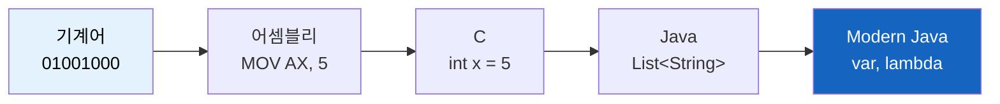
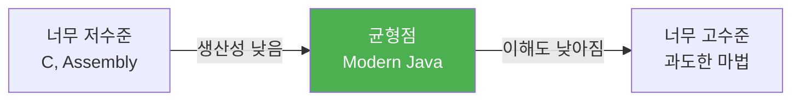
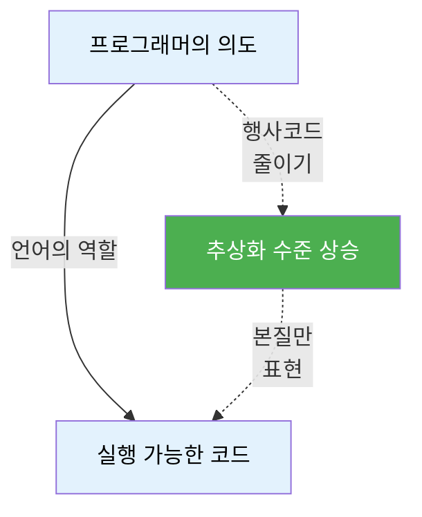

# 프로그래밍 언어의 진화와 추상화

프로그래밍 언어는 어떤 방향으로 발전해왔을까? 복잡해지는 방향일까, 단순해지는 방향일까?

## 결론부터 말하면

**언어의 진화는 추상화 수준을 높여서 "본질(what)"에 집중하고 "의례(how)"는 자동화하는 방향**으로 움직인다.
프로그래밍 언어에서 노화하는 것은 문법 자체가 아니라 **행사코드(boilerplate)**다.

```java
// 1990년대: 의례적 코드가 본질을 가림
Collections.sort(numbers, new Comparator<Integer>() {
    @Override
    public int compare(Integer a, Integer b) {
        return a - b;  // ← 이것만 본질
    }
});

// 2014년 (Java 8): 본질만 남음
Collections.sort(numbers, (a, b) -> a - b);
```

프로그래머가 진짜 말하고 싶은 것은 `a - b`였다.
나머지 18줄은 컴파일러를 만족시키기 위한 의식(ceremony)이었을 뿐이다.

---

## 1. 왜 언어는 진화하는가?

### 프로그래머가 작성하는 코드의 본질

코드를 작성할 때 우리는 두 가지를 동시에 표현한다:

| 요소 | 설명 | 예시 |
|------|------|------|
| **본질(Essential)** | 내가 해결하려는 문제의 로직 | "숫자를 오름차순으로 정렬" |
| **의례(Accidental)** | 언어/플랫폼의 제약으로 인한 부가 코드 | 익명 클래스, 타입 캐스팅, 메모리 관리 |

좋은 언어는 **"의례"를 줄여서 "본질"이 드러나게** 만든다.

### 역사적 관점

프로그래밍 언어의 역사는 "기계가 이해하는 방식"에서 "인간이 생각하는 방식"으로의 이동이다:



각 단계마다 "프로그래머가 직접 관리해야 하는 것"이 줄어들었다:
- 기계어 → 어셈블리: 메모리 주소 직접 계산 불필요
- 어셈블리 → C: 레지스터 관리 불필요
- C → Java: 메모리 해제 불필요 (GC)
- Java 7 → Java 8: 익명 클래스 불필요 (lambda)

---

## 2. 행사코드(Boilerplate)란?

### 정의

**행사코드**: 프로그램이 동작하기 위해 반드시 작성해야 하지만, 실제 비즈니스 로직과는 무관한 반복적인 코드.

마치 관료제의 "형식적 절차"처럼, 컴파일러나 프레임워크를 만족시키기 위한 의식(ceremony)이다.

### 특징

```java
// 행사코드의 특징: 제거해도 의도는 변하지 않음

// Before: 행사코드 포함
public class UserService {
    private UserRepository userRepository;

    @Autowired
    public UserService(UserRepository userRepository) {
        this.userRepository = userRepository;
    }
}

// After: 행사코드 제거 (Lombok)
@Service
@RequiredArgsConstructor
public class UserService {
    private final UserRepository userRepository;
}
```

두 코드의 **의도는 동일**하다. 생성자 코드는 "의례"였을 뿐이다.

---

## 3. 시대별 행사코드 제거 사례

### 3.1 메모리 관리 (C → Java)

```c
// C: 수동 메모리 관리
char* str = (char*)malloc(100 * sizeof(char));
strcpy(str, "Hello");
// ... 사용 ...
free(str);  // ← 깜빡하면 메모리 누수
```

```java
// Java: 자동 메모리 관리
String str = "Hello";
// GC가 알아서 처리
```

**왜 중요한가?** 메모리 관리는 "문제 해결"이 아니라 "기계 관리"이기 때문이다.

### 3.2 타입 캐스팅 (Java 1.4 → Java 5)

```java
// Java 1.4: 타입 안전성 없음
List list = new ArrayList();
list.add("Hello");
String str = (String) list.get(0);  // ← 매번 캐스팅

// Java 5: Generics
List<String> list = new ArrayList<>();
String str = list.get(0);  // 캐스팅 불필요
```

### 3.3 익명 클래스 (Java 7 → Java 8)

```java
// Java 7: 20줄의 의식
ExecutorService executor = Executors.newSingleThreadExecutor();
executor.submit(new Runnable() {
    @Override
    public void run() {
        System.out.println("Task");
    }
});

// Java 8: 1줄의 본질
executor.submit(() -> System.out.println("Task"));
```

### 3.4 타입 선언 (Java 10)

```java
// Java 9: 중복된 타입 선언
Map<String, List<User>> usersByRole = new HashMap<String, List<User>>();

// Java 10: var 키워드
var usersByRole = new HashMap<String, List<User>>();
```

---

## 4. 람다가 나온 이유

### 문제 상황

Java는 객체지향 언어다. 모든 것은 클래스와 객체여야 한다.

하지만 실무에서는 **"함수 하나만 넘기고 싶은데"** 클래스를 만들어야 하는 상황이 빈번했다:

```java
// 버튼 클릭 이벤트 하나 등록하는데 5줄
button.addActionListener(new ActionListener() {
    @Override
    public void actionPerformed(ActionEvent e) {
        System.out.println("Clicked");
    }
});
```

이 코드에서 프로그래머가 진짜 말하고 싶었던 것은 무엇일까?

**"버튼이 클릭되면 'Clicked'를 출력해"** ← 이게 전부다.

### 람다의 등장

```java
// 람다: 의도만 남김
button.addActionListener(e -> System.out.println("Clicked"));
```

람다는 "함수를 일급 객체로 다루고 싶다"는 함수형 프로그래밍의 철학을 Java에 도입한 것이다.

### Stream API의 사례

```java
// Before: 루프 제어가 본질을 가림
List<String> result = new ArrayList<>();
for (int i = 0; i < names.size(); i++) {
    String name = names.get(i);
    if (name.startsWith("A")) {
        result.add(name.toUpperCase());
    }
}

// After: 의도가 명확함
List<String> result = names.stream()
    .filter(name -> name.startsWith("A"))
    .map(String::toUpperCase)
    .toList();
```

**"A로 시작하는 이름을 대문자로 변환"** ← 이 의도가 코드에 그대로 드러난다.

---

## 5. 언어별 행사코드 제거 전략

### 5.1 Java

| 시대 | 행사코드 | 해결책 |
|------|---------|--------|
| Java 1.4 | 타입 캐스팅 | Generics (Java 5) |
| Java 7 | 익명 클래스 | Lambda (Java 8) |
| Java 8 | `new ArrayList<>()` | `List.of()` (Java 9) |
| Java 9 | 중복 타입 선언 | `var` (Java 10) |
| Java 14 | `instanceof` + 캐스팅 | Pattern Matching (Java 16) |

### 5.2 Spring

```java
// Spring 2.x (XML 지옥)
<bean id="userService" class="com.example.UserService">
    <property name="userRepository" ref="userRepository"/>
</bean>

// Spring 3.x (Annotation)
@Service
public class UserService {
    @Autowired
    private UserRepository userRepository;
}

// Spring 4.x+ (Constructor Injection)
@Service
@RequiredArgsConstructor
public class UserService {
    private final UserRepository userRepository;
}
```

### 5.3 Python

Python은 태생부터 "행사코드 최소화"를 목표로 설계되었다:

```python
# Java
public class User {
    private String name;

    public User(String name) {
        this.name = name;
    }

    public String getName() {
        return name;
    }
}

# Python
class User:
    def __init__(self, name):
        self.name = name
```

심지어 Python 3.7+는 `@dataclass`로 이마저도 줄인다:

```python
from dataclasses import dataclass

@dataclass
class User:
    name: str
```

---

## 6. 추상화의 역설

### 문제점

추상화 수준이 높아질수록 **"내부에서 무슨 일이 일어나는지" 모르는 프로그래머**가 늘어난다.

```python
# 둘 다 한 줄, 하지만...

# Case 1: 리스트 컴프리헨션 (메모리에 100만 개 생성)
result = [x**2 for x in range(1000000)]

# Case 2: 제너레이터 (지연 평가)
result = (x**2 for x in range(1000000))
```

겉보기에는 똑같지만 성능 차이는 엄청나다.

### JPA의 N+1 문제

```java
// 간결한 코드, 하지만 100개 쿼리 실행
List<Order> orders = orderRepository.findAll();
for (Order order : orders) {
    System.out.println(order.getUser().getName());  // ← 매번 쿼리
}
```

프레임워크가 복잡도를 감추면서, 동시에 "무엇이 감춰졌는지"를 이해하기 어렵게 만든다.

### 균형점



좋은 추상화는:
- ✅ 90%의 일반적 케이스를 간결하게 만듦
- ✅ 나머지 10%를 위한 탈출구(escape hatch)를 제공

나쁜 추상화는:
- ❌ 복잡도를 숨기지만 예외 상황에서 디버깅 불가능
- ❌ "마법"에 의존해서 내부 작동 방식 이해 불가

---

## 7. 결론

### 언어 진화의 본질

프로그래밍 언어의 발전은 **"프로그래머가 말하고 싶은 것"과 "실제로 타이핑해야 하는 것" 사이의 간극을 줄이는 것**이다.



### 프로그래머의 역할

행사코드가 사라지는 것은 **수단**이지 **목적**이 아니다.

진짜 목표는:
- **의도를 명확히 표현하는 것**
- **본질적 복잡도에 집중하는 것**
- **우연적 복잡도를 제거하는 것**

| 구분 | 설명 | 예시 |
|------|------|------|
| **본질적 복잡도** | 문제 자체의 복잡도 | 비즈니스 로직, 알고리즘 |
| **우연적 복잡도** | 도구/언어로 인한 복잡도 | 익명 클래스, 타입 캐스팅 |

좋은 프로그래머는:
1. 추상화의 혜택을 누리면서도
2. 내부 작동 방식을 이해하고
3. 필요할 때 저수준으로 내려갈 수 있어야 한다

**"간결함(conciseness)"은 목표가 아니라 명확함(clarity)을 달성하기 위한 수단이다.**

---

## 출처

- [The Mythical Man-Month - Fred Brooks](https://en.wikipedia.org/wiki/The_Mythical_Man-Month) - 본질적/우연적 복잡도 개념
- [Effective Java - Joshua Bloch](https://www.oreilly.com/library/view/effective-java/9780134686097/) - Java 모던 패턴
- [Java Language Updates](https://docs.oracle.com/en/java/javase/) - Java 버전별 발전사
