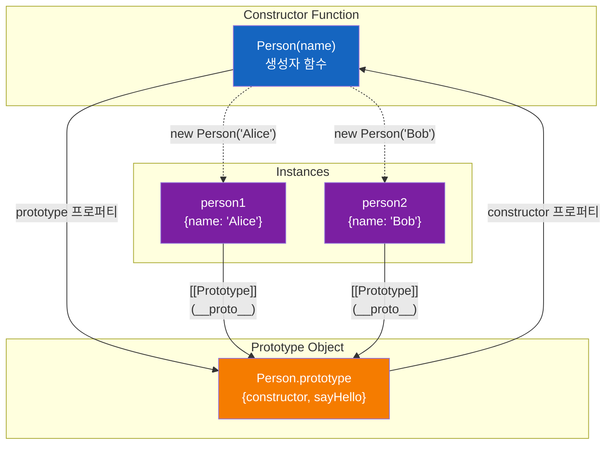
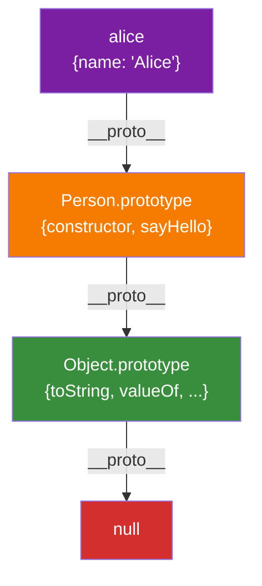
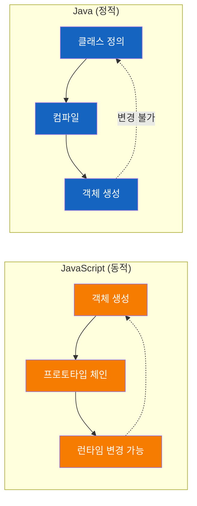

# JavaScript 프로토타입 (Prototype)

JavaScript가 **클래스 없이** 객체를 생성하고 상속을 구현하는 메커니즘

## 결론부터 말하면

JavaScript는 **프로토타입 기반 언어**로, Java처럼 클래스가 아닌 **프로토타입 체인**으로 상속을 구현합니다.

```javascript
// JavaScript: 프로토타입 기반
function Person(name) {
    this.name = name;
}
Person.prototype.sayHello = function() {
    console.log(`Hello, ${this.name}`);
};

const person = new Person('Alice');
person.sayHello(); // "Hello, Alice"
```

```java
// Java: 클래스 기반
public class Person {
    private String name;
    
    public Person(String name) {
        this.name = name;
    }
    
    public void sayHello() {
        System.out.println("Hello, " + name);
    }
}

Person person = new Person("Alice");
person.sayHello(); // "Hello, Alice"
```

**핵심 차이**:
- Java: 클래스라는 "설계도"가 먼저 필요
- JavaScript: 객체가 먼저 존재하고, 프로토타입으로 연결

## 1. 프로토타입 기반 언어란?

### 클래스 기반 vs 프로토타입 기반

| 특징 | 클래스 기반 (Java) | 프로토타입 기반 (JavaScript) |
|------|-------------------|----------------------------|
| **설계도** | 클래스 (class) | 프로토타입 객체 (prototype) |
| **객체 생성** | `new ClassName()` | `new Function()` 또는 `Object.create()` |
| **상속 방식** | 클래스 상속 (`extends`) | 프로토타입 체인 |
| **메서드 저장** | 클래스 정의 내부 | 프로토타입 객체에 저장 |
| **유연성** | 정적 (컴파일 시 확정) | 동적 (런타임 변경 가능) |

### 프로토타입 기반의 특징

```javascript
// 1. 객체는 다른 객체를 직접 상속받을 수 있음
const parent = { x: 10 };
const child = Object.create(parent);
console.log(child.x); // 10 (부모에서 상속)

// 2. 런타임에 프로토타입 변경 가능
function Dog(name) {
    this.name = name;
}
Dog.prototype.bark = function() {
    console.log('Woof!');
};

// 나중에 메서드 추가 가능
Dog.prototype.run = function() {
    console.log(`${this.name} is running`);
};
```

## 2. Constructor, Prototype, Instance의 관계

### 관계도



### 핵심 구성요소

#### 1. Constructor (생성자 함수)
```javascript
function Person(name) {
    this.name = name;  // 인스턴스 프로퍼티
}
```
- 객체를 생성하는 함수

- `new` 키워드와 함께 사용되어 인스턴스 생성
- **`prototype` 프로퍼티**를 자동으로 가짐

#### 2. Prototype (프로토타입 객체)
```javascript
Person.prototype.sayHello = function() {
    console.log(`Hello, ${this.name}`);
};
```
- 생성자 함수의 `prototype` 프로퍼티가 가리키는 객체
- 모든 인스턴스가 **공유**하는 메서드와 프로퍼티 저장
- **메모리 효율적**: 메서드를 한 번만 저장하고 모든 인스턴스가 공유

#### 3. Instance (인스턴스)
```javascript
const person1 = new Person('Alice');
const person2 = new Person('Bob');
```
- `new` 키워드로 생성된 실제 객체
- **`[[Prototype]]`** (내부 슬롯)으로 프로토타입 객체를 참조
- `__proto__` 접근자로 프로토타입에 접근 가능 (비표준이지만 널리 사용)

### 관계 흐름

```javascript
function Person(name) {
    this.name = name;
}

// 1. Constructor.prototype 설정
Person.prototype.sayHello = function() {
    console.log(`Hello, ${this.name}`);
};

// 2. 인스턴스 생성
const alice = new Person('Alice');


// 3. 관계 확인
console.log(alice.__proto__ === Person.prototype);           // true
console.log(Person.prototype.constructor === Person);        // true
console.log(alice.constructor === Person);                   // true

// 4. 메서드 호출
alice.sayHello(); // "Hello, Alice"
// alice 객체에 sayHello가 없으면 → alice.__proto__ (Person.prototype)에서 찾음
```

## 3. 프로토타입 체인 (Prototype Chain)

### 프로토타입 체인이란?

객체의 프로퍼티나 메서드를 찾을 때, 해당 객체에 없으면 **프로토타입을 따라 올라가며 찾는 메커니즘**



### 프로토타입 체인 동작


```javascript
function Person(name) {
    this.name = name;
}

Person.prototype.sayHello = function() {
    console.log(`Hello, ${this.name}`);
};

const alice = new Person('Alice');

// 1. alice.name 찾기
console.log(alice.name);  // 'Alice'
// ✅ alice 객체에 직접 존재 → 즉시 반환

// 2. alice.sayHello 찾기
alice.sayHello();  // "Hello, Alice"
// ❌ alice 객체에 없음 → alice.__proto__ (Person.prototype)에서 찾음 ✅

// 3. alice.toString 찾기
console.log(alice.toString());  // "[object Object]"
// ❌ alice 객체에 없음
// ❌ Person.prototype에도 없음
// ✅ Object.prototype에서 찾음

// 4. alice.nonExistent 찾기
console.log(alice.nonExistent);  // undefined
// ❌ alice 객체에 없음
// ❌ Person.prototype에도 없음
// ❌ Object.prototype에도 없음
// ❌ null에 도달 → undefined 반환
```

### 프로토타입 체인 확인


```javascript
function Person(name) {
    this.name = name;
}

const alice = new Person('Alice');

// 프로토타입 체인 확인
console.log(alice.__proto__ === Person.prototype);                  // true
console.log(Person.prototype.__proto__ === Object.prototype);       // true
console.log(Object.prototype.__proto__ === null);                   // true

// instanceof로 체인 확인
console.log(alice instanceof Person);   // true
console.log(alice instanceof Object);   // true
```

## 4. Java와의 비교

### 상속 메커니즘 비교

| 특징 | Java (클래스 기반) | JavaScript (프로토타입 기반) |
|------|-------------------|----------------------------|
| **설계도** | 클래스 (compile-time) | 프로토타입 객체 (runtime) |
| **상속 문법** | `extends` 키워드 | 프로토타입 체인 |
| **메서드 위치** | 클래스 내부 | 프로토타입 객체 |
| **동적 변경** | 불가능 (컴파일 후 고정) | 가능 (런타임 변경 가능) |
| **메모리** | 각 인스턴스마다 메서드 복사 안 함 | 프로토타입 공유로 메모리 절약 |

### 코드 비교

#### Java: 클래스 기반 상속

```java
// Animal 클래스 (부모)
public class Animal {
    protected String name;
    
    public Animal(String name) {
        this.name = name;
    }
    
    public void speak() {
        System.out.println(name + " makes a sound");
    }
}

// Dog 클래스 (자식)
public class Dog extends Animal {
    public Dog(String name) {
        super(name);
    }
    
    @Override
    public void speak() {
        System.out.println(name + " barks");
    }
}

// 사용
Dog dog = new Dog("Buddy");
dog.speak();  // "Buddy barks"
```

#### JavaScript: 프로토타입 기반 상속

```javascript
// Animal 생성자 (부모)
function Animal(name) {
    this.name = name;
}

Animal.prototype.speak = function() {
    console.log(`${this.name} makes a sound`);
};

// Dog 생성자 (자식)
function Dog(name) {
    Animal.call(this, name);  // super(name)과 유사
}

// 프로토타입 체인 설정 (상속)
Dog.prototype = Object.create(Animal.prototype);
Dog.prototype.constructor = Dog;

// 메서드 오버라이딩
Dog.prototype.speak = function() {
    console.log(`${this.name} barks`);
};

// 사용
const dog = new Dog('Buddy');
dog.speak();  // "Buddy barks"
```

#### ES6 Class (문법 설탕)

```javascript
// ES6 클래스 문법 (내부적으로는 프로토타입 사용)
class Animal {
    constructor(name) {
        this.name = name;
    }
    
    speak() {
        console.log(`${this.name} makes a sound`);
    }
}


class Dog extends Animal {
    speak() {
        console.log(`${this.name} barks`);
    }
}

const dog = new Dog('Buddy');
dog.speak();  // "Buddy barks"

// ES6 class도 내부적으로는 프로토타입!
console.log(Dog.prototype.speak);  // [Function: speak]
console.log(dog.__proto__ === Dog.prototype);  // true
```

### 주요 차이점

#### 1. 동적 vs 정적

```javascript
// JavaScript: 런타임에 메서드 추가 가능 ✅
function Person(name) {
    this.name = name;
}

const person = new Person('Alice');

// 나중에 프로토타입에 메서드 추가
Person.prototype.sayHello = function() {
    console.log(`Hello, ${this.name}`);
};

person.sayHello();  // "Hello, Alice" - 동작함!
```

```java
// Java: 컴파일 후에는 클래스 변경 불가능 ❌
public class Person {
    private String name;
    
    public Person(String name) {
        this.name = name;
    }
}

Person person = new Person("Alice");
// person.sayHello(); // 컴파일 에러! 메서드가 없음

// 메서드를 추가하려면 클래스를 다시 컴파일해야 함
```

#### 2. 다중 상속

```javascript
// JavaScript: 프로토타입 체인은 단일 상속만 가능
// 하지만 Object.assign으로 믹스인(mixin) 패턴 구현 가능
const canFly = {
    fly() {
        console.log('Flying!');
    }
};

const canSwim = {
    swim() {
        console.log('Swimming!');
    }
};

function Duck(name) {
    this.name = name;
}

Object.assign(Duck.prototype, canFly, canSwim);

const duck = new Duck('Donald');
duck.fly();   // "Flying!"
duck.swim();  // "Swimming!"
```

```java
// Java: 인터페이스로 다중 상속 구현
interface CanFly {
    void fly();
}

interface CanSwim {
    void swim();
}

class Duck implements CanFly, CanSwim {
    @Override
    public void fly() {
        System.out.println("Flying!");
    }

    
    @Override
    public void swim() {
        System.out.println("Swimming!");
    }
}
```

## 5. 프로토타입의 주요 활용

### 5.1 메모리 효율적인 메서드 공유

```javascript
// ❌ 비효율적: 각 인스턴스마다 메서드 복사
function Person(name) {
    this.name = name;
    this.sayHello = function() {  // 인스턴스마다 새로운 함수 생성!
        console.log(`Hello, ${this.name}`);
    };
}

const person1 = new Person('Alice');
const person2 = new Person('Bob');

console.log(person1.sayHello === person2.sayHello);  // false (서로 다른 함수)

// ✅ 효율적: 프로토타입으로 메서드 공유
function PersonOptimized(name) {
    this.name = name;
}

PersonOptimized.prototype.sayHello = function() {
    console.log(`Hello, ${this.name}`);
};

const person3 = new PersonOptimized('Alice');
const person4 = new PersonOptimized('Bob');

console.log(person3.sayHello === person4.sayHello);  // true (같은 함수 공유)
```

### 5.2 프로토타입 체인을 이용한 상속


```javascript
// 상속 구현 패턴
function Shape(x, y) {
    this.x = x;
    this.y = y;
}

Shape.prototype.move = function(dx, dy) {
    this.x += dx;
    this.y += dy;
};

// Circle이 Shape을 상속
function Circle(x, y, radius) {
    Shape.call(this, x, y);  // 부모 생성자 호출
    this.radius = radius;
}

// 프로토타입 체인 설정
Circle.prototype = Object.create(Shape.prototype);
Circle.prototype.constructor = Circle;

// Circle 전용 메서드
Circle.prototype.getArea = function() {
    return Math.PI * this.radius * this.radius;
};

const circle = new Circle(0, 0, 5);
circle.move(10, 10);  // Shape의 메서드 사용
console.log(circle.x, circle.y);  // 10, 10
console.log(circle.getArea());     // 78.53981633974483
```

### 5.3 내장 객체 확장 (주의: 권장하지 않음)

```javascript
// Array.prototype 확장 (실무에서는 피해야 함!)
Array.prototype.first = function() {
    return this[0];
};

Array.prototype.last = function() {
    return this[this.length - 1];
};

const arr = [1, 2, 3, 4, 5];
console.log(arr.first());  // 1
console.log(arr.last());   // 5


// ⚠️ 주의: 내장 프로토타입 확장 시 문제점
// 1. 다른 라이브러리와 충돌 가능
// 2. for...in 루프에 영향
// 3. 향후 표준과 충돌 가능
```

## 6. 실전 활용 패턴

### 6.1 팩토리 패턴과 프로토타입

```javascript
// 객체 생성 팩토리
function createUser(name, role) {
    function User(name, role) {
        this.name = name;
        this.role = role;
    }
    
    User.prototype.hasPermission = function(permission) {
        const permissions = {
            admin: ['read', 'write', 'delete'],
            user: ['read']
        };
        return permissions[this.role]?.includes(permission) || false;
    };
    
    return new User(name, role);
}

const admin = createUser('Alice', 'admin');
const user = createUser('Bob', 'user');

console.log(admin.hasPermission('delete'));  // true
console.log(user.hasPermission('delete'));   // false
```

### 6.2 폴리필(Polyfill) 구현

```javascript
// Array.prototype.includes 폴리필
if (!Array.prototype.includes) {
    Array.prototype.includes = function(searchElement, fromIndex) {
        if (this == null) {
            throw new TypeError('"this" is null or not defined');
        }

        
        const o = Object(this);
        const len = o.length >>> 0;
        
        if (len === 0) {
            return false;
        }
        
        const n = fromIndex | 0;
        let k = Math.max(n >= 0 ? n : len - Math.abs(n), 0);
        
        while (k < len) {
            if (o[k] === searchElement) {
                return true;
            }
            k++;
        }
        
        return false;
    };
}
```

### 6.3 프로토타입 기반 플러그인 시스템

```javascript
// 기본 컴포넌트
function Component(name) {
    this.name = name;
    this.plugins = [];
}

Component.prototype.use = function(plugin) {
    this.plugins.push(plugin);
    // 플러그인의 메서드를 프로토타입에 추가
    Object.assign(Component.prototype, plugin);
    return this;
};

// 플러그인 정의
const loggerPlugin = {
    log(message) {
        console.log(`[${this.name}] ${message}`);
    }
};

const validatorPlugin = {

    validate(data) {
        return data && data.length > 0;
    }
};

// 사용
const myComponent = new Component('MyApp');
myComponent.use(loggerPlugin).use(validatorPlugin);

myComponent.log('Component initialized');  // "[MyApp] Component initialized"
console.log(myComponent.validate('test')); // true
```

## 7. 프로토타입 사용 시 주의사항

### 7.1 프로토타입 오염(Prototype Pollution)

```javascript
// ⚠️ 위험: 프로토타입 오염
function merge(target, source) {
    for (let key in source) {
        target[key] = source[key];  // 위험!
    }
    return target;
}

const maliciousInput = JSON.parse('{"__proto__": {"isAdmin": true}}');
const user = {};
merge(user, maliciousInput);

// 모든 객체에 영향!
console.log({}.isAdmin);  // true (보안 문제!)

// ✅ 안전한 방법
function safeMerge(target, source) {
    for (let key in source) {
        if (source.hasOwnProperty(key) && key !== '__proto__') {
            target[key] = source[key];
        }
    }
    return target;
}
```

### 7.2 hasOwnProperty 체크


```javascript
function Person(name) {
    this.name = name;
}

Person.prototype.sayHello = function() {
    console.log(`Hello, ${this.name}`);
};

const person = new Person('Alice');

// for...in은 프로토타입 체인의 모든 열거 가능한 프로퍼티를 순회
for (let key in person) {
    console.log(key);  // 'name', 'sayHello' (프로토타입 메서드도 포함!)
}

// ✅ 자신의 프로퍼티만 확인
for (let key in person) {
    if (person.hasOwnProperty(key)) {
        console.log(key);  // 'name' (자신의 프로퍼티만)
    }
}

// 또는 Object.keys 사용 (권장)
Object.keys(person).forEach(key => {
    console.log(key);  // 'name' (자신의 프로퍼티만)
});
```

### 7.3 프로토타입 변경의 영향

```javascript
function Car(model) {
    this.model = model;
}

const car1 = new Car('Tesla');
const car2 = new Car('BMW');

// 프로토타입에 메서드 추가
Car.prototype.drive = function() {
    console.log(`${this.model} is driving`);
};

// 이미 생성된 인스턴스에도 영향!
car1.drive();  // "Tesla is driving"
car2.drive();  // "BMW is driving"

// ⚠️ 주의: 프로토타입 객체 자체를 교체하면?

Car.prototype = {
    park() {
        console.log(`${this.model} is parked`);
    }
};

car1.drive();  // 여전히 작동! (기존 프로토타입 참조 유지)
// car1.park();  // 에러! 새로운 프로토타입은 기존 인스턴스에 영향 없음

const car3 = new Car('Audi');
// car3.drive();  // 에러! 새로운 프로토타입에는 drive가 없음
car3.park();   // "Audi is parked" (새로운 프로토타입 사용)
```

## 8. 모던 JavaScript와 프로토타입

### 8.1 ES6 Class는 여전히 프로토타입

```javascript
class Person {
    constructor(name) {
        this.name = name;
    }
    
    sayHello() {
        console.log(`Hello, ${this.name}`);
    }
}

// 내부적으로는 프로토타입 사용!
console.log(typeof Person);                      // "function"
console.log(typeof Person.prototype.sayHello);   // "function"

const person = new Person('Alice');
console.log(person.__proto__ === Person.prototype);  // true
```

### 8.2 Object.create로 프로토타입 설정

```javascript
// 프로토타입 객체 정의
const personPrototype = {
    sayHello() {
        console.log(`Hello, ${this.name}`);
    },
    introduce() {

        console.log(`I'm ${this.name}, nice to meet you!`);
    }
};

// 프로토타입을 사용하여 객체 생성
const person1 = Object.create(personPrototype);
person1.name = 'Alice';
person1.sayHello();     // "Hello, Alice"
person1.introduce();    // "I'm Alice, nice to meet you!"

// 프로토타입 확인
console.log(person1.__proto__ === personPrototype);  // true
```

### 8.3 Object.setPrototypeOf (권장하지 않음)

```javascript
const person = { name: 'Alice' };
const personMethods = {
    sayHello() {
        console.log(`Hello, ${this.name}`);
    }
};

// ⚠️ 성능 문제: 런타임에 프로토타입 변경은 최적화를 방해
Object.setPrototypeOf(person, personMethods);
person.sayHello();  // "Hello, Alice"

// ✅ 더 나은 방법: Object.create 사용
const betterPerson = Object.create(personMethods);
betterPerson.name = 'Bob';
betterPerson.sayHello();  // "Hello, Bob"
```

## 9. 성능 고려사항

### 9.1 프로토타입 체인 탐색 비용

```javascript
// 긴 프로토타입 체인은 성능에 영향
function Level1() {}
function Level2() {}
function Level3() {}
function Level4() {}

Level2.prototype = Object.create(Level1.prototype);
Level3.prototype = Object.create(Level2.prototype);
Level4.prototype = Object.create(Level3.prototype);

Level1.prototype.method = function() {
    return 'found';
};

const obj = new Level4();

// 4단계 프로토타입 체인을 거쳐야 메서드 발견
obj.method();  // Level4 → Level3 → Level2 → Level1 (찾음!)
```

### 9.2 인스턴스 프로퍼티 vs 프로토타입 프로퍼티

```javascript
function Counter() {
    this.count = 0;  // 인스턴스 프로퍼티 (빠름)
}

Counter.prototype.increment = function() {  // 프로토타입 메서드 (체인 탐색)
    this.count++;
};

const counter = new Counter();

// 인스턴스 프로퍼티 접근 (빠름)
console.log(counter.count);  // 직접 접근

// 프로토타입 메서드 접근 (약간 느림)
counter.increment();  // 프로토타입 체인 탐색 필요
```

## 10. 요약 및 베스트 프랙티스

### 핵심 개념 정리

| 개념 | 설명 |
|------|------|
| **Constructor** | 객체를 생성하는 함수, `prototype` 프로퍼티를 가짐 |
| **Prototype** | 생성자의 `prototype` 프로퍼티가 가리키는 객체, 메서드 공유 |
| **Instance** | `new`로 생성된 객체, `[[Prototype]]`으로 프로토타입 참조 |
| **프로토타입 체인** | 프로퍼티/메서드를 찾을 때 프로토타입을 따라 올라가는 메커니즘 |

### 베스트 프랙티스

#### ✅ 해야 할 것

```javascript
// 1. 프로토타입에 메서드 정의 (메모리 효율)
function Person(name) {
    this.name = name;
}
Person.prototype.sayHello = function() {
    console.log(`Hello, ${this.name}`);
};

// 2. hasOwnProperty로 자신의 프로퍼티 확인
for (let key in obj) {
    if (obj.hasOwnProperty(key)) {
        // 안전한 처리
    }
}

// 3. Object.create로 명시적 프로토타입 설정
const child = Object.create(parent);


// 4. ES6 class 사용 (가독성)
class Person {
    constructor(name) {
        this.name = name;
    }
    
    sayHello() {
        console.log(`Hello, ${this.name}`);
    }
}
```

#### ❌ 피해야 할 것

```javascript
// 1. 내장 프로토타입 확장 금지
Array.prototype.myMethod = function() { };  // ❌ 위험!

// 2. 프로토타입 객체 자체 교체 지양
Constructor.prototype = { };  // ❌ 기존 인스턴스와 연결 끊김

// 3. Object.setPrototypeOf 런타임 변경 지양
Object.setPrototypeOf(obj, proto);  // ❌ 성능 문제

// 4. __proto__ 직접 접근 지양 (비표준)
obj.__proto__ = proto;  // ❌ Object.create 사용 권장

// 5. 생성자에 메서드 정의 금지 (메모리 낭비)
function Person(name) {
    this.name = name;
    this.sayHello = function() { };  // ❌ 인스턴스마다 복사됨
}
```

### JavaScript 프로토타입 vs Java 클래스



## 출처

- [MDN Web Docs - Object prototypes](https://developer.mozilla.org/en-US/docs/Learn/JavaScript/Objects/Object_prototypes)
- [MDN Web Docs - Inheritance and the prototype chain](https://developer.mozilla.org/en-US/docs/Web/JavaScript/Inheritance_and_the_prototype_chain)
- [JavaScript.info - Prototypes, inheritance](https://javascript.info/prototypes)
- [You Don't Know JS - this & Object Prototypes](https://github.com/getify/You-Dont-Know-JS/tree/1st-ed/this%20%26%20object%20prototypes)
