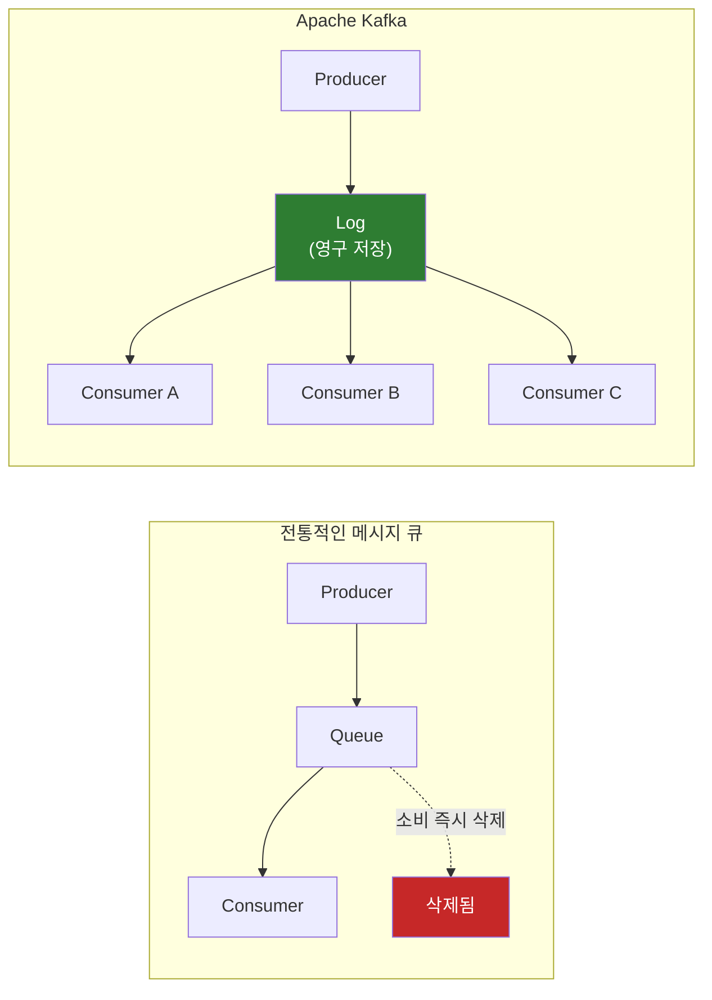
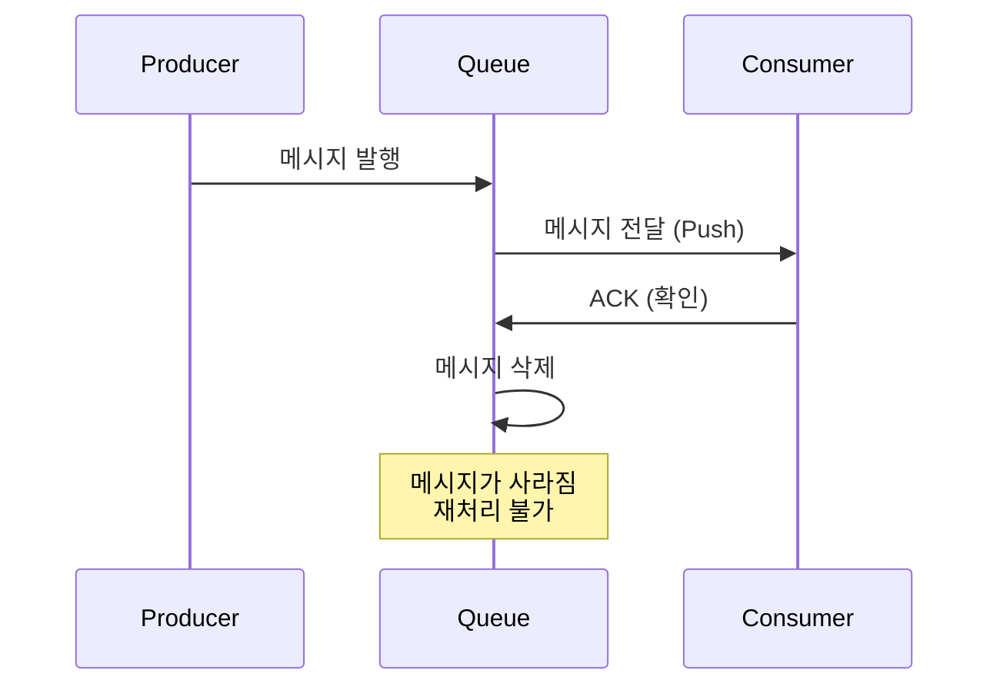
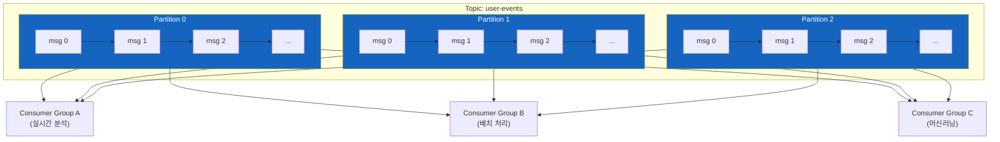
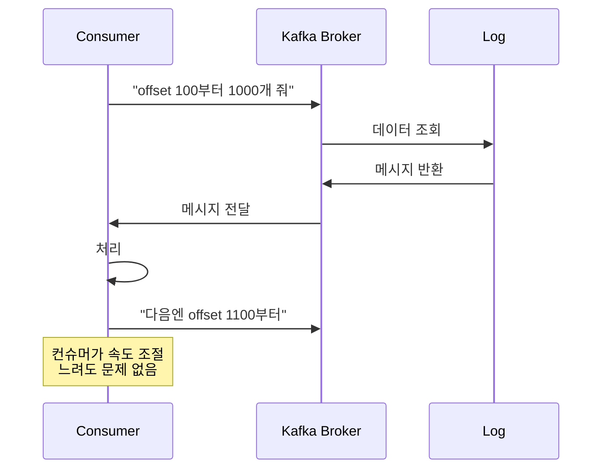
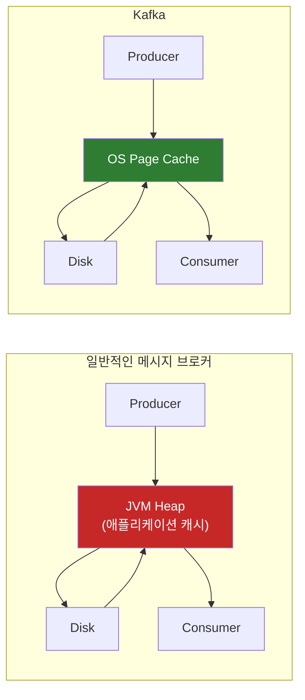
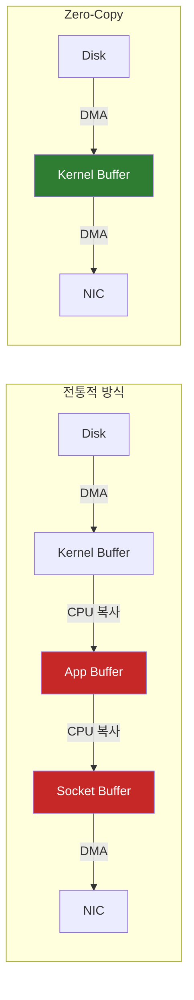
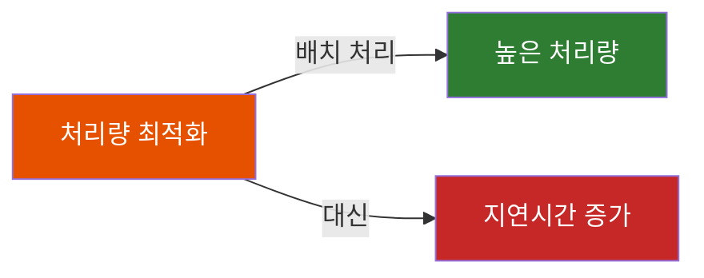
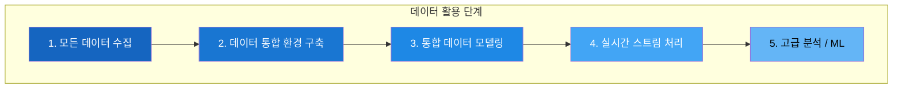

# Kafka는 왜 만들어졌는가

"기존 메시지 큐로는 하루 10억 건의 이벤트를 감당할 수 없었다" — 2010년, LinkedIn 엔지니어들의 좌절에서 시작된 이야기

## 결론부터 말하면

**Kafka는 "전통적인 메시지 큐의 한계"를 극복하기 위해 태어났다.** RabbitMQ, ActiveMQ 같은 기존 메시지 브로커는 메시지를 소비하면 즉시 삭제하고, 단일 큐가 단일 스레드로 동작하며, 수평 확장에 한계가 있었다. LinkedIn은 이 모든 제약을 뛰어넘는 새로운 패러다임이 필요했다.



| 구분 | 전통적 메시지 큐 | Kafka |
|------|-----------------|-------|
| 메시지 보관 | 소비 후 **즉시 삭제** | **영구 보관** (설정 가능) |
| 처리량 | 큐당 ~50,000 msg/sec | **초당 수백만** 메시지 |
| 소비 모델 | Push (브로커가 밀어줌) | **Pull** (컨슈머가 가져감) |
| 확장성 | 단일 큐 = 단일 스레드 | **파티션 기반** 수평 확장 |
| 재처리 | 불가능 | **언제든 가능** (offset 조정) |

---

## 1. 왜 Kafka가 태어났는가?

### 1.1 2010년, LinkedIn의 데이터 폭발

2010년 LinkedIn은 급격한 성장통을 겪고 있었다. 사용자들의 프로필 조회, 연결 요청, 검색, 추천 — 모든 행동이 이벤트로 쌓였다. 문제는 이 데이터의 **양** 과 **속도** 였다.

Jay Kreps(현 Confluent CEO), Neha Narkhede, Jun Rao — 세 명의 엔지니어가 LinkedIn의 실시간 데이터 인프라를 담당하고 있었다. 그들이 마주한 현실은 이랬다:

- 하루에 **10억 건 이상** 의 이벤트 발생
- 실시간 분석과 배치 처리를 **동시에** 해야 함
- 수십 개의 데이터 소스에서 **통합된 파이프라인** 필요

기존 시스템으로는 감당이 안 됐다.

### 1.2 기존 솔루션을 시도하다

Kreps 팀은 당시 존재하던 모든 옵션을 검토했다.

**배치 처리 시스템:**
- 구현 세부사항이 하위 소비자에게 노출됨
- Push 모델로 수신자를 압도할 수 있음
- **실시간** 처리 불가능

**전통적인 메시지 큐 (ActiveMQ, RabbitMQ):**
- 트랜잭션, 전달 보장 등 LinkedIn에 불필요한 기능이 많음
- 대용량 처리에 최적화되지 않음
- "LinkedIn의 유스케이스에는 **오버킬** 이었다"

Kreps는 나중에 이렇게 회고했다:

> "우리는 한동안 기존 메시징 인프라 위에 뭔가를 만들어보려고 했다. 하지만 어느 순간, 이 옵션들 중 어느 것도 우리에게 맞지 않는다는 걸 깨달았다. 결국 직접 만들어야 했다."

### 1.3 "그냥 로그에 다 쌓으면 안 되나?"

기존 메시지 큐의 근본적인 문제가 무엇이었을까?

```
전통적 메시지 큐:
Producer → Queue → Consumer (읽으면 삭제)
                      ↓
                  "다시 읽을 수 없음"
```

메시지가 소비되면 사라진다. 만약 새로운 분석 시스템을 추가하고 싶다면? 과거 데이터는 이미 없다. 장애가 발생해서 재처리가 필요하다면? 불가능하다.

Kreps 팀은 발상을 전환했다. **"메시지를 삭제하지 말고, 로그처럼 계속 쌓아두면 어떨까?"**

이것이 Kafka의 핵심 아이디어다. 데이터베이스의 **트랜잭션 로그** 에서 영감을 받았다. 은행 계좌의 현재 잔액은 모든 입출금 내역(로그)에서 계산할 수 있다. 하지만 잔액만 있으면 내역을 복원할 수 없다. **로그가 더 근본적인 데이터 구조** 인 것이다.

### 1.4 크리스마스의 전설

2010년 크리스마스 연휴, Jay Kreps가 Kafka의 첫 코드를 작성했다는 전설이 있다. Kreps 본인은 "이런 이야기들은 항상 조금은 사실이지만, 머리에 사과가 떨어져서 바로 발명한 건 아니다"라고 말했다.

실제로는 LinkedIn에서 수년간 데이터 문제에 **"절여져"** 있었고, 그 고민의 결과물이 Kafka였다. 2011년 오픈소스로 공개되었고, 그해 말에는 이미 LinkedIn에서 **하루 10억 건 이상** 의 메시지를 처리하고 있었다.

참고로, Kafka라는 이름은 작가 Franz Kafka에서 따왔다. Kreps가 "글쓰기에 최적화된 시스템"이라서 그의 이름을 붙였다고 한다.

---

## 2. Kafka가 해결한 문제: 전통적 메시지 큐의 한계

### 2.1 "소비하면 삭제" 모델의 문제

RabbitMQ의 기본 동작을 보자:



이 모델의 문제점:

1. **재처리 불가**: 장애 복구나 재분석이 필요할 때 과거 데이터에 접근할 수 없음
2. **새 소비자 추가 어려움**: 어제 만든 분석 시스템은 오늘의 데이터만 볼 수 있음
3. **단일 소비자 종속**: 하나의 메시지는 하나의 소비자만 처리

### 2.2 처리량의 벽

RabbitMQ의 큐는 **단일 스레드** 로 동작한다. 하나의 큐가 처리할 수 있는 한계는 약 **50,000 msg/sec** 정도다.

| 병목 지점 | 설명 |
|----------|------|
| 단일 스레드 큐 | 하나의 큐 = 하나의 CPU 코어 |
| 메모리 압박 | 메시지가 쌓이면 디스크로 페이징, 성능 급락 |
| ACK 오버헤드 | 매 메시지마다 확인 응답 필요 |

LinkedIn이 필요로 한 건 **초당 수백만 건** 의 처리량이었다. 기존 시스템으로는 물리적으로 불가능했다.

### 2.3 Push vs Pull의 딜레마

전통적 메시지 브로커는 **Push 모델** 을 사용한다. 브로커가 "똑똑하고", 컨슈머는 "멍청하다"(Smart Broker / Dumb Consumer).

```
RabbitMQ (Push):
Broker → "여기 메시지!" → Consumer
         ↓
    Consumer가 느리면?
         ↓
    메모리 폭발 (OOM)
```

컨슈머의 처리 속도보다 브로커가 더 빨리 밀어넣으면? 컨슈머가 터진다. RabbitMQ 공식 문서도 이 문제를 경고한다:

> "자동 확인 모드는 메시지를 전달하는 속도만큼 빠르게 처리할 수 없는 소비자를 압도할 수 있다."

---

## 3. Kafka의 해법: 분산 로그

### 3.1 로그 기반 아키텍처

Kafka는 메시지를 **삭제하지 않는다**. 대신 **분산 로그** 에 순차적으로 기록한다.



**핵심 개념:**

| 개념 | 설명 |
|------|------|
| **Topic** | 메시지의 논리적 카테고리 (예: `user-events`) |
| **Partition** | 토픽을 물리적으로 분할한 단위, 병렬 처리의 기본 |
| **Offset** | 파티션 내 메시지의 위치 (인덱스) |
| **Consumer Group** | 여러 컨슈머가 파티션을 나눠서 처리 |

### 3.2 Pull 모델의 승리

Kafka는 **Pull 모델** 을 채택했다. 브로커는 "멍청하고", 컨슈머가 "똑똑하다"(Dumb Broker / Smart Consumer).



**Pull 모델의 장점:**

1. **백프레셔 자연 해결**: 컨슈머가 자기 속도로 가져감
2. **배치 처리 최적화**: 한 번에 여러 메시지를 가져올 수 있음
3. **재처리 간단**: offset만 조정하면 과거 데이터 재소비 가능

### 3.3 파티션으로 수평 확장

Kafka의 진짜 마법은 **파티션** 에 있다.

```
하나의 Topic = 여러 Partition
각 Partition = 독립적인 로그 = 독립적인 CPU/디스크 사용

Partition 수 ↑ = 처리량 ↑
```

RabbitMQ에서 처리량을 늘리려면 큐를 여러 개 만들고 애플리케이션에서 분배해야 한다. Kafka는 이 분배 로직이 **내장** 되어 있다.

| 파티션 수 | 이론적 처리량 |
|----------|--------------|
| 1 | 기준 |
| 10 | ~10배 |
| 100 | ~100배 |

LinkedIn은 현재 **100개 이상의 클러스터** 에서 하루 **7조 개의 메시지** 를 처리한다.

### 3.4 디스크인데 왜 빠른가? (Sequential I/O + Zero-Copy)

여기서 의문이 생긴다. Kafka는 메시지를 **디스크** 에 저장한다. 그런데 어떻게 메모리 기반 시스템과 경쟁할 수 있을까?

비밀은 **디스크를 사용하는 방식** 에 있다.

#### Sequential I/O: 디스크의 숨겨진 강점

디스크 I/O에는 두 가지가 있다:

| I/O 방식 | 동작 | 성능 |
|----------|------|------|
| **Random I/O** | 여기저기 점프하며 읽기/쓰기 | 느림 (헤드 이동, 탐색 시간) |
| **Sequential I/O** | 순서대로 연속 읽기/쓰기 | **빠름** (100MB/s 이상) |

HDD의 순차 쓰기는 **메모리의 랜덤 액세스보다 빠를 수 있다**. 놀랍지만 사실이다.

```
Random I/O:     [읽기] → 점프 → [읽기] → 점프 → [읽기]
                        ↓
                  매번 디스크 헤드 이동

Sequential I/O: [읽기][읽기][읽기][읽기][읽기]...
                        ↓
                  헤드 이동 없이 연속 읽기
```

Kafka는 로그를 **append-only** 로 설계했다. 새 메시지는 항상 파일 끝에 추가된다. 읽을 때도 순서대로 읽는다. 랜덤 액세스가 거의 없다.

#### Page Cache: OS를 믿어라

Kafka는 JVM 힙 메모리에 데이터를 캐싱하지 않는다. 대신 **OS의 페이지 캐시** 를 활용한다.



**왜 OS 캐시가 더 나은가?**

1. **GC 없음**: JVM 힙은 가비지 컬렉션이 필요하다. 페이지 캐시는 OS가 관리한다.
2. **메모리 효율**: JVM 객체는 오버헤드가 크다. 페이지 캐시는 원시 바이트를 그대로 저장한다.
3. **재시작 후에도 유지**: JVM이 죽어도 페이지 캐시는 살아있다.

#### Zero-Copy: 복사를 없애다

전통적인 데이터 전송은 이렇게 동작한다:

```
1. Disk → Kernel Buffer     (DMA, CPU 개입 없음)
2. Kernel Buffer → App Buffer   ← CPU 복사 (1회)
3. App Buffer → Socket Buffer   ← CPU 복사 (2회)
4. Socket Buffer → NIC      (DMA, CPU 개입 없음)
```

총 4번의 데이터 이동 중 **CPU가 직접 개입하는 복사가 2번**, 그리고 **컨텍스트 스위칭이 4번** 발생한다. 이게 병목이다.

Kafka는 Linux의 `sendfile()` 시스템 콜을 사용해 **Zero-Copy** 를 구현한다:

```
1. Disk → Kernel Buffer     (DMA)
2. Kernel Buffer → NIC      (DMA, CPU 개입 없음)
```



**결과:**
- CPU 복사 2회 → **0회**
- 컨텍스트 스위칭 4회 → **2회**
- CPU 사용량 대폭 감소, 처리량 향상

이 세 가지 기법(Sequential I/O + Page Cache + Zero-Copy)이 합쳐져서, Kafka는 **디스크를 사용하면서도** 메모리 기반 시스템에 버금가는 성능을 낸다.

### 3.5 메시지 보존: 삭제하지 않는 용기

```yaml
# Kafka 설정 예시
log.retention.hours: 168       # 7일 보관 (기본값)
log.retention.bytes: -1        # 용량 제한 없음
```

메시지가 보존되기 때문에:

1. **새 시스템 추가가 쉽다**: 어제 배포한 서비스가 일주일 전 데이터부터 처리 가능
2. **장애 복구가 간단하다**: offset만 되돌리면 재처리 완료
3. **감사 로그로 활용**: 무슨 일이 있었는지 추적 가능

> **참고: 재처리와 중복 문제**
>
> offset을 되돌려서 재처리할 수 있다는 건 양날의 검이다. 메시지를 처리하고 offset을 커밋하기 전에 컨슈머가 죽으면? 재시작 후 같은 메시지를 **다시 처리** 하게 된다(at-least-once). 이 중복을 막으려면 **멱등성 프로듀서(Idempotent Producer)** 와 **트랜잭션 API** 를 사용해 **정확히 한 번 처리(exactly-once semantics)** 를 구현해야 한다. Kafka 0.11(2017년)부터 이 기능이 도입되었지만, 설정과 이해가 필요한 고급 주제다.

---

## 4. 트레이드오프: Kafka의 한계

Kafka도 만능이 아니다. 모든 기술에는 대가가 있다.

### 4.1 운영 복잡성

**Kafka는 운영하기 어렵다.** 정말 어렵다.

| 복잡성 요소 | 설명 |
|------------|------|
| ZooKeeper 의존성 | 메타데이터 관리를 위한 별도 클러스터 필요 |
| 파티션 리밸런싱 | 컨슈머 추가/제거 시 복잡한 조정 |
| 모니터링 도구 부재 | 기본 UI 없음, 서드파티 도구 필요 |
| 설정 튜닝 | 수백 개의 설정 파라미터 |

> **참고: KRaft (ZooKeeper 제거)**
>
> Kafka 3.3(2022년)부터 ZooKeeper 없이 운영할 수 있는 KRaft 모드가 도입되었다. Kafka 4.0에서는 ZooKeeper가 완전히 제거될 예정이다. 하지만 프로덕션에서의 안정성 검증은 아직 진행 중이다.

운영팀이 없는 소규모 조직에서 Kafka를 직접 운영하는 건 **악몽** 이 될 수 있다. Confluent Cloud 같은 매니지드 서비스를 고려해야 하는 이유다.

### 4.2 처리량 vs 지연시간

Kafka는 **처리량(Throughput)** 에 최적화되어 있다. **지연시간(Latency)** 은 우선순위가 아니다.



Kafka는 메시지를 **배치로 모아서** 처리한다. 네트워크 효율은 좋아지지만, 개별 메시지의 지연시간은 늘어난다.

| 지표 | Kafka | RabbitMQ |
|------|-------|----------|
| 처리량 | **초당 수백만** | 초당 수만 |
| 지연시간 | 수 ms ~ 수십 ms | **< 1ms 가능** |

**밀리초 단위 지연시간** 이 중요한 실시간 알림이나 채팅 시스템에는 RabbitMQ가 더 적합할 수 있다.

### 4.3 파티션 내에서만 순서 보장

Kafka는 **파티션 내에서만** 메시지 순서를 보장한다. 토픽 전체에서는 순서가 보장되지 않는다.

```
Partition 0: A → B → C (순서 보장)
Partition 1: D → E → F (순서 보장)

전체 토픽에서? A와 D 중 뭐가 먼저인지 알 수 없음
```

전역 순서가 필요하다면 파티션을 하나만 써야 하는데, 그러면 처리량이 급감한다. 이건 설계 시 반드시 고려해야 할 트레이드오프다.

### 4.4 메시지 우선순위 없음

RabbitMQ는 메시지에 우선순위를 부여할 수 있다. 급한 메시지를 먼저 처리할 수 있다.

Kafka는? **우선순위가 없다.** 순서대로 처리될 뿐이다.

```python
# RabbitMQ: 우선순위 지원
channel.basic_publish(
    properties=pika.BasicProperties(priority=10)  # 높은 우선순위
)

# Kafka: 우선순위 개념 없음
producer.send('topic', value=message)  # 그냥 보냄
```

우선순위가 필요하면 별도의 토픽을 만들고 애플리케이션에서 관리해야 한다.

### 4.5 학습 곡선

Kafka를 제대로 쓰려면 알아야 할 게 많다:

- 파티션 설계
- 컨슈머 그룹 관리
- offset 커밋 전략
- 리밸런싱 동작
- 재시도 및 데드레터 처리
- 직렬화/역직렬화
- 스키마 관리 (Avro, Protobuf)

RabbitMQ는 며칠이면 프로덕션에 올릴 수 있지만, Kafka는 **수주에서 수개월** 이 걸릴 수 있다.

---

## 5. 그래서 언제 Kafka를 쓰는가?

### 5.1 Kafka가 빛나는 순간

| 용도 | 왜 Kafka인가 |
|------|-------------|
| **이벤트 스트리밍** | 대용량 실시간 이벤트 처리 |
| **로그 수집** | 분산 시스템의 로그 중앙화 |
| **데이터 파이프라인** | 소스 → Kafka → 다양한 목적지 |
| **이벤트 소싱** | 상태 변경을 이벤트로 기록 |
| **CDC (Change Data Capture)** | DB 변경사항 실시간 전파 |
| **마이크로서비스 통합** | 서비스 간 비동기 통신 |

### 5.2 Kafka를 피해야 할 때

| 상황 | 대안 |
|------|------|
| 저지연 필수 (< 1ms) | RabbitMQ, Redis Pub/Sub |
| 단순 작업 큐 | RabbitMQ, SQS |
| 메시지 우선순위 필요 | RabbitMQ |
| 소규모 트래픽 | 뭐든 상관없음 (Kafka는 오버킬) |
| 운영 인력 부족 | 매니지드 서비스 또는 더 단순한 대안 |

### 5.3 Jay Kreps의 데이터 피라미드

Jay Kreps는 데이터 활용의 **"매슬로우 욕구 단계"** 를 제시했다:



Kafka는 이 피라미드의 **기반(1, 2단계)** 을 담당한다. 데이터를 수집하고 통합하는 **중앙 신경계** 역할이다. 그래서 Kafka를 도입하면 그 위에 실시간 분석, 머신러닝 등을 쌓을 수 있는 토대가 마련된다.

---

## 6. 정리

Kafka는 "기존 메시지 큐가 대용량을 못 버텨서" 만들어졌다. 메시지를 삭제하지 않고 로그로 보관하는 과감한 선택으로 재처리와 다중 소비자 문제를 해결했고, 파티션 기반 설계로 수평 확장을 가능하게 했다. 하지만 그 대가로 운영 복잡성, 학습 곡선, 지연시간 트레이드오프를 받아들여야 한다.

**Kafka를 쓸 때 기억할 것:**
- 대용량 이벤트 스트리밍에는 최적
- 단순 메시지 큐 용도라면 **오버킬**
- 운영 복잡성을 과소평가하지 말 것
- 파티션 내에서만 순서 보장됨
- 처리량 vs 지연시간 트레이드오프 이해

2010년 LinkedIn의 세 엔지니어가 시작한 프로젝트는, 현재 **Fortune 100 기업의 80% 이상** 이 사용하는 데이터 인프라의 표준이 되었다. "로그를 삭제하지 말자"는 단순한 아이디어가 얼마나 강력한지 보여주는 사례다.

---

## 출처

- [The Log: What every software engineer should know about real-time data's unifying abstraction - LinkedIn Engineering](https://engineering.linkedin.com/distributed-systems/log-what-every-software-engineer-should-know-about-real-time-datas-unifying)
- [Kafka's origin story at LinkedIn - Tanvir Ahmed](https://www.linkedin.com/pulse/kafkas-origin-story-linkedin-tanvir-ahmed)
- [How (and why) Kafka was created at LinkedIn - Frontier Enterprise](https://www.frontier-enterprise.com/unleashing-kafka-insights-from-confluent-jun-rao/)
- [Lessons from the early days building Kafka and Confluent - Jay Kreps](https://softwaremisadventures.com/p/jay-kreps-kafka-confluent)
- [The Good and the Bad of Apache Kafka - AltexSoft](https://www.altexsoft.com/blog/apache-kafka-pros-cons/)
- [Apache Kafka - Wikipedia](https://en.wikipedia.org/wiki/Apache_Kafka)
- [Kafka vs RabbitMQ - AWS](https://aws.amazon.com/compare/the-difference-between-rabbitmq-and-kafka/)
- [RabbitMQ vs. Kafka vs. ActiveMQ - Design Gurus](https://www.designgurus.io/blog/rabbitmq-kafka-activemq-system-design)
