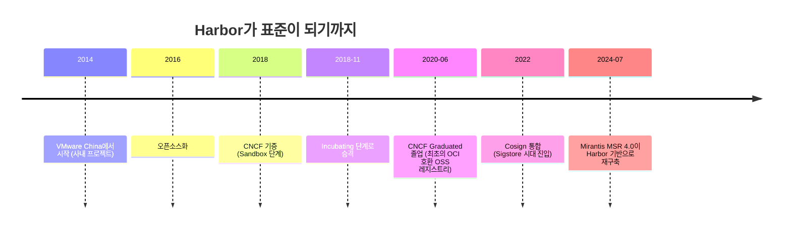
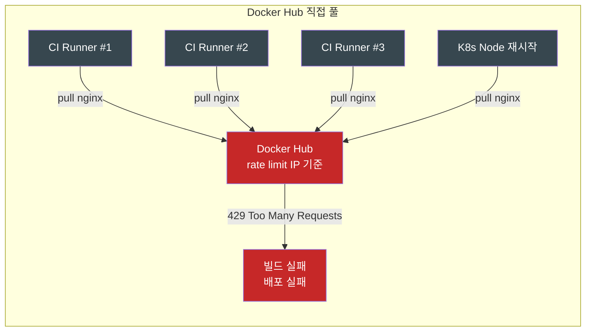
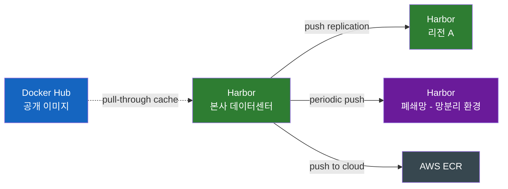
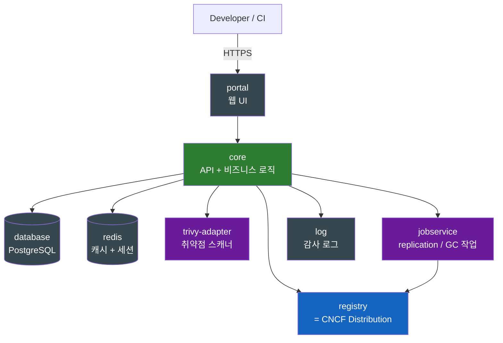
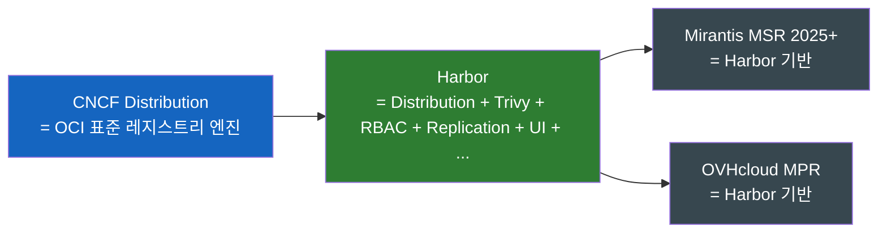

# Harbor — 왜 회사들은 사내 컨테이너 레지스트리를 두는가

자바 개발자에게 사내 Nexus가 있다면, 컨테이너 시대의 사내 Nexus가 Harbor다.

## 결론부터 말하면

**Harbor는 자체 호스팅 컨테이너 레지스트리다 — 컨테이너 이미지와 Helm Chart, OCI Artifact를 저장하면서 취약점 스캐닝, 이미지 서명, 접근 제어, 다른 레지스트리와의 동기화까지 한 묶음으로 제공한다.** 본질적으로는 CNCF Distribution(옛 Docker Registry)이라는 베이스 엔진 위에 엔터프라이즈 기능을 얹은 완성품이다. 2014년 VMware China에서 만들어져 2016년 오픈소스화, 2020년 6월 CNCF Graduated로 졸업했다. 2024년 7월 Mirantis가 자사 MSR(Docker Trusted Registry의 후신) 4.0을 Harbor 기반으로 재구축하면서, 사실상 **"사내 컨테이너 레지스트리 = Harbor"** 가 시장 표준이 되었다.

| 핵심 기능 | 한 줄 요약 | 자바 세계 비유 |
|----------|-----------|----------------|
| **취약점 스캔** | Trivy로 이미지 푸시 시 자동 스캔 | Nexus IQ / Snyk |
| **RBAC + Projects** | 프로젝트 단위로 권한 분리 + LDAP/OIDC | Nexus의 Realm/Role |
| **이미지 서명** | Cosign / Notary로 신원 보증 | jar 서명 (jarsigner) |
| **Replication** | Docker Hub, ECR, 다른 Harbor와 동기화 | Maven 미러 |
| **Proxy Cache** | Docker Hub를 캐싱해 rate limit 회피 | Maven Central 프록시 |
| **OCI Artifact** | 이미지 + **Helm Chart** + SBOM 일체 저장 | Maven repo의 multi-packaging |

---

## 1. 왜 Docker Hub만으로는 안 되는가

### 1.1 Pull Rate Limit — 2024년 12월의 사건

Docker Hub는 컨테이너 시대의 Maven Central이다. 무료고, 거의 모든 공식 이미지가 거기 있고, `docker pull nginx`만 치면 작동한다. 그런데 2020년부터 Docker Inc.는 운영비 부담을 이유로 **풀 요청에 제한**을 걸기 시작했다.

**현재 적용 정책** (2026-05 기준, Docker 공식 발표)

| 계정 유형 | 풀 제한 |
|----------|---------|
| 익명 사용자 | 6시간당 **100회** |
| Personal (무료 가입) | 6시간당 **200회** |
| Pro / Team / Business (유료) | 무제한 (구독 등급별 정책 차이) |

**시도/예고됐던 정책** (참고용)

| 시점 | 익명 풀 제한 | 인증된 풀 제한 | 결과 |
|------|-------------|---------------|------|
| 2024-12-10 발표 | 시간당 10회 | 시간당 40회 | 2025-04-08 Docker가 철회, 기존 100/200 유지 발표 |

현재 적용 중인 6시간당 100회만 해도 CI/CD 파이프라인을 운영해 본 사람은 즉시 알 것이다. 빌드 컨테이너가 베이스 이미지를 받아오고, 의존성 단계마다 풀이 일어나며, **단일 NAT 게이트웨이 뒤에서 동작하는 사내 CI 환경에서는 익명 풀의 경우 IP 하나로 모든 빌드가 합산**된다 (인증된 풀은 IP가 아닌 계정 기준으로 카운트되지만, 익명 풀이 발생하는 경로가 하나라도 있으면 NAT IP가 통째로 차감된다). 멀티 스테이지 빌드 한 번에 베이스 이미지 여러 장이 풀되는 경우도 흔하므로, 사내 빌드가 활발하면 6시간당 100회를 빠르게 소진하고 `429 Too Many Requests`를 마주친다. 2024년 12월의 "시간당 10회" 강화안이 결국 철회된 것도 업계 반발이 그만큼 컸기 때문이다 — 정책이 한 번 강화 시도됐다는 사실 자체가 **"Docker Hub 의존은 언제든 끊길 수 있는 리스크"** 임을 모두에게 학습시켰고, 이것이 사내 레지스트리 채택을 가속화한 결정적 사건이었다.

이게 단순히 "불편함"이 아니라 **서비스 장애**로 직결된다는 점이 핵심이다. 쿠버네티스가 Pod를 다른 노드로 재스케줄링할 때 해당 노드에 이미지가 없으면 풀을 하는데, 이 풀이 rate limit에 막히면 Pod가 뜨지 않는다. 자바로 치면 Maven Central이 갑자기 시간당 10번만 응답하기 시작한 격이다.

해결책은 본질적으로 두 가지다. 첫째, **유료 Docker 구독**을 결제한다. 둘째, **사내 레지스트리를 둔다.** 후자가 Harbor의 가장 큰 실용적 가치다.

### 1.2 보안 — 이미지는 "OS 통째로"다

두 번째 이유는 보안이다. Docker 이미지의 정체를 생각해보면 명확하다. **이미지는 사실상 미니 운영체제다.** `nginx:1.27` 이미지 안에는 OpenSSL, glibc, 수십 개의 시스템 패키지가 들어있다. 그리고 그중 어느 하나에라도 CVE가 있으면 컨테이너 전체가 취약해진다.

2021년 12월의 **Log4Shell**(CVE-2021-44228)은 이 점을 모두에게 강제로 학습시킨 사건이다. 자바 라이브러리 하나의 취약점이 전 세계 컨테이너 이미지에 박혀 있었다. 사용자가 직접 Log4j를 안 썼더라도 **빌드 단계에서 Maven/Gradle이 끌어온 의존성의 의존성**으로 들어오는 경우가 흔했고, 더 깊이는 **베이스 이미지가 묶고 있는 OS 시스템 패키지** 자체의 취약점도 별개 축으로 존재한다. 즉 컨테이너 이미지의 공격 표면은 (1) 베이스 이미지에 내장된 OS 패키지, (2) 빌드 시 더해진 애플리케이션 라이브러리 — 이 두 층 모두 스캔되어야 한다.

이 시점부터 업계는 **"이미지를 신뢰할 수 있는가"를 푸시 시점에 검증** 해야 한다는 합의에 도달했다. Docker Hub의 공식 이미지조차 1주 단위로 새 취약점이 발견된다. 우리가 받아 쓰는 이미지가 지금 이 순간 안전한지 모른다면, 운영 책임을 질 수 없다.

### 1.3 거버넌스 — 누가 무엇을 푸시했는가

세 번째는 운영 거버넌스다. 회사 안에서 누가 어떤 이미지를 푸시했는지, 누가 풀했는지, 어떤 이미지가 prod에 배포된 적이 있는지 — 이런 감사 추적이 Docker Hub로는 어렵다. 사내 정책으로 "외부 미상 이미지는 prod에 못 들어간다"를 강제하려면 결국 사내 게이트가 있어야 하고, 그 게이트가 사내 레지스트리다.

---

## 2. Harbor가 메우는 6가지 빈틈

위 세 가지 문제를 직접 해결하는 것이 Harbor의 존재 이유다. 핵심 기능 6가지를 보자.

### 2.1 Trivy로 푸시 시점 취약점 스캔

Harbor는 **Trivy**(Aqua Security가 만든 오픈소스 스캐너)를 내장한다. 설치 시 `install.sh --with-trivy` 한 줄로 스캐너 자체를 활성화하고, 추가로 프로젝트 설정에서 **"Automatically scan images on push"** 옵션을 켜야 푸시 직후 자동 스캔이 동작한다 (설치만으로는 자동 스캔이 켜지지 않는다는 점이 자주 헷갈리는 부분이다). 활성화하면 Harbor가 OS 패키지(Alpine/Debian/RHEL 등)와 애플리케이션 의존성(npm/PyPI/RubyGems 등)을 스캔해 CVE 목록을 만든다.

운영상 강력한 점은 **"Critical 취약점이 있으면 풀을 막는다"** 같은 정책 게이트를 걸 수 있다는 것이다. 개발자가 무심코 푸시한 이미지가 prod에 들어가는 경로 자체를 차단한다.

### 2.2 RBAC + 프로젝트 분리

Harbor는 이미지를 **프로젝트** 단위로 묶는다. 각 프로젝트는 public/private 설정이 가능하고, 프로젝트별로 권한이 따로 관리된다.

| 역할 | 권한 |
|------|------|
| **Project Admin** | 프로젝트 설정/멤버 관리 |
| **Maintainer** | 이미지 푸시/태깅/삭제 |
| **Developer** | 이미지 푸시/풀 |
| **Guest** | 이미지 풀만 |
| **Limited Guest** | 이미지 풀은 가능, 단 프로젝트 로그/멤버 목록 같은 메타데이터 조회는 차단 |

LDAP/AD/OIDC 통합이 있어 사내 SSO 인프라에 그대로 연결된다. 자바 개발자가 사내 Nexus에서 Maven repo별로 권한을 분리하던 그 모델을 컨테이너 세계에 옮겨놓았다고 보면 된다.

### 2.3 Cosign / Notary로 이미지 서명

이미지가 진짜 우리 빌드 시스템이 만든 것인지 어떻게 증명할까? 답은 **디지털 서명**이다. Harbor의 서명 체계는 시대별로 다음과 같이 진화했다.

| 도구 | 등장 시점 | 현재 상태 |
|------|----------|----------|
| **Notary v1** (Docker Content Trust) | 2015~ | **Harbor 2.6부터 Deprecated, 2.9.0(2023)에서 UI/Backend 완전 제거** — 별도 Notary 서버 필요, 운영 복잡. Cosign/Notation으로 마이그레이션 필수 |
| **Cosign** (Sigstore) | 2021~, Harbor v2.5(2022)에 통합 | **현재 권장** — 서명을 레지스트리 안에 일반 OCI artifact로 저장 |
| **Notation** (Notary v2 계열) | 2023~ | 현재 권장 — OCI Referrers 기반의 표준화된 서명 모델 |

Harbor 공식 문서는 더 이상 Notary v1을 안내하지 않고 **Cosign 또는 Notation**을 사용하도록 권장한다. 두 방식 모두 별도 서명 서버 없이 레지스트리 자체에 서명을 OCI Artifact 형태로 저장한다는 공통점이 있다. 별도 서명 인프라가 필요 없고, AWS KMS, GCP KMS, HashiCorp Vault 같은 키 관리 시스템과 연동된다. Harbor는 프로젝트에 "Cosign 서명이 없으면 풀 금지" 옵션을 걸 수 있어, 검증되지 않은 이미지가 클러스터로 새어 나가는 길을 막는다.

Kubernetes 어드미션 컨트롤러(Kyverno, OPA Gatekeeper)와 결합하면 **"클러스터에 들어오는 모든 이미지는 Harbor의 우리 키로 서명되어야 한다"** 같은 엄격한 정책을 강제할 수 있다 — 이것이 **공급망 보안(Supply Chain Security)** 의 기본 아키텍처다.

### 2.4 Replication — 멀티 클러스터와 폐쇄망

큰 조직은 클러스터가 하나가 아니다. dev/stg/prod, 리전별, 클라우드별로 클러스터가 흩어진다. Harbor는 다른 Harbor 인스턴스, Docker Hub, ECR, GCR, GHCR 등과 **이미지를 동기화**할 수 있다. 단 동기화 규칙은 **Push 또는 Pull 중 하나의 단방향**으로만 설정한다 — 외부 레지스트리와 양방향 실시간 동기화는 무한 루프 위험과 외부 API 제약 때문에 지원되지 않으므로, 필요한 방향에 맞게 규칙을 따로 두는 식이다.

특히 **폐쇄망(air-gapped)** 환경에서 빛난다. 인터넷이 안 되는 클러스터에 이미지를 어떻게 넣을까? Harbor를 망 안에 두고, 주기적으로 외부 Harbor에서 복제해 들이는 방식이 표준이다. CERN처럼 전 세계 170개 사이트가 협업하는 컴퓨팅 그리드에서도 Harbor의 replication이 핵심 도구로 쓰인다고 한다.

### 2.5 Proxy Cache — Rate Limit의 정공법

1.1절에서 본 Docker Hub rate limit 문제의 깔끔한 해법이 이것이다. Harbor에서 **Proxy Cache 유형의 프로젝트를 별도 생성**(예: `dockerhub-cache`)하고 대상 레지스트리를 Docker Hub로 지정하면 동작은 다음과 같다.

1. 개발자가 `harbor.company.com/dockerhub-cache/library/nginx:1.27`를 풀하라고 요청한다.
2. Harbor 캐시에 유효한 사본이 있으면 그대로 반환한다.
3. 없거나 upstream의 mutable tag(`latest`, `1.27` 같은 가변 태그)가 갱신되었으면 Harbor가 Docker Hub에서 받아와 캐시를 갱신하고 반환한다.

결과적으로 Docker Hub로의 풀은 **동일 아키텍처/동일 digest 기준 캐시 히트인 한 사내에 처음 들어올 때 한 번만** 일어난다. 모든 CI runner와 K8s 노드가 같은 이미지를 받아도 Hub 카운터는 1만 증가한다 (멀티 아키텍처 이미지는 arch별 manifest가 별도로 카운트될 수 있다). 단 캐시 미스 시점에는 Harbor의 아웃바운드 IP 기준으로 여전히 Docker Hub의 rate limit를 소모한다는 점은 알아두자 — 캐시가 무한히 안전망이 되는 것은 아니다.

> ⚠️ **Proxy Cache 프로젝트의 제약**: 이 프로젝트는 외부 레지스트리의 **읽기 전용(pull-only) 미러**로만 동작한다. 사용자가 사내 빌드 이미지를 여기에 직접 푸시할 수 없다. 따라서 실무에서는 외부 캐싱용 프로젝트(`dockerhub-cache`)와 사내 빌드 저장용 프로젝트(`service-prod`)를 명확히 분리해 운영한다.

### 2.6 OCI Artifact — Helm Chart도 같이 저장

OCI(Open Container Initiative) 명세가 진화하면서, 컨테이너 레지스트리가 이미지 외의 것들도 저장할 수 있게 됐다. Harbor는 OCI Artifact 모델을 지원하므로 다음을 모두 저장한다.

| 타입 | 용도 |
|------|------|
| 컨테이너 이미지 | 기본 |
| **Helm Chart** | 이전 글에서 본 K8s 패키지 |
| Cosign 서명 | 이미지 서명 |
| SBOM (CycloneDX, SPDX) | 소프트웨어 자재 명세서 |
| WASM 모듈 | WebAssembly 런타임용 |
| OPA Bundle | 정책 번들 |

이것이 이전 글의 **Helm**과 만나는 지점이다. Helm 3.8(2022)에서 OCI 레지스트리 지원이 정식화되면서, 회사들은 **이미지와 Chart를 같은 Harbor에서 관리**하기 시작했다. 사내 앱의 컨테이너 이미지와 그 앱을 배포하는 Helm Chart가 같은 권한 체계, 같은 서명 정책 안에서 묶여 흐른다.

---

## 3. 아키텍처 — Harbor는 결국 "Distribution + α"

Harbor를 설치하면 약 **10개의 컨테이너**가 뜬다. 이름만 봐도 역할이 보인다.

여기서 가장 흥미로운 점은 **`registry` 컨테이너의 정체**다. 이것이 바로 **CNCF Distribution**(옛 Docker Registry)이다. 즉 **Harbor는 Distribution을 그대로 품고 그 위에 자체 컨트롤 플레인을 얹은 구조**다.

비유하자면 **Distribution은 엔진, Harbor는 그 엔진으로 만든 완성차**다. 그리고 2025년 들어서는 Mirantis(MSR)나 OVHcloud Managed Private Registry 같은 **상업 제품들이 Harbor 위에서 다시 만들어지는** 흐름이 정착됐다. 사내 컨테이너 레지스트리 영역에서 Harbor가 사실상 표준 플랫폼이 된 것이다.

---

## 4. Helm 시리즈와의 연결 — 신뢰 체인 완성

이전 글에서 본 Helm 4의 변화 중 하나가 **OCI digest 기반 공급망 보안 강화 + 재현 가능 빌드** 였다 — 차트 서명 자체는 Helm v2 시절부터 provenance 기능으로 존재했지만, Helm 4는 OCI 레지스트리에 저장된 digest로 차트를 고정 설치하고 검증하는 흐름을 정식 지원한다. 차트도 컨테이너 이미지와 같은 수준의 공급망 보안을 받아야 한다는 방향이다. Harbor는 그 방향에 정확히 맞물린다.

| 단계 | 도구 | 무엇을 신뢰하는가 |
|------|------|------------------|
| **빌드** | CI/CD | 우리 빌드 시스템이 빌드한 결과물 |
| **저장** | **Harbor** | 우리 레지스트리에 있는 아티팩트 |
| **서명** | **Cosign in Harbor** | 우리 키로 서명된 것 |
| **검증** | Kyverno / OPA Gatekeeper | 서명이 맞는 것만 클러스터 진입 |
| **배포** | **Helm** | 검증된 Chart로만 설치 |
| **롤백** | Helm rollback / git revert | 검증된 과거 상태로만 복귀 |

각 단계의 도구가 따로따로 있는 것 같지만, **Harbor가 중앙 저장소이자 검증 지점**으로 자리잡으면 전체가 하나의 신뢰 체인으로 묶인다. 이 그림이 2026년 기준 클라우드 네이티브 보안의 베이스라인이다.

---

## 5. 대안과 선택 기준

Harbor만이 답은 아니다. 상황에 따른 선택지를 정리하면 다음과 같다.

| 옵션 | 강점 | 약점 | 언제 |
|------|------|------|------|
| **Harbor** | 풍부한 OSS 기능, 셀프호스팅, OCI artifact, Helm 친화 | 운영 부담 (PostgreSQL/Redis까지 챙겨야) | 자체 호스팅, 다기능, 멀티 클라우드 |
| **AWS ECR / GCR / ACR** | 클라우드 IAM 통합, 운영 부담 ↓ | 해당 클라우드 락인, 기능 제한 | 단일 클라우드 환경 |
| **CNCF Distribution** | Harbor의 베이스, 가장 가벼움 | UI/RBAC/스캔 없음 (직접 구현) | 자체 레지스트리를 만드는 벤더 |
| **JFrog Artifactory** | 멀티 포맷 (Maven, npm, NuGet, Docker 통합) | 상용, 무겁고 비싸다 | 이미 JFrog를 쓰는 대기업 |
| **Sonatype Nexus** | 자바 생태계 우위, 멀티 포맷 | 컨테이너 특화 기능은 약함 | 사내 Maven repo가 이미 Nexus인 곳 |
| **Quay (Red Hat)** | OpenShift 통합 우수 | Red Hat 생태계 종속 | OpenShift 사용 조직 |
| **GitHub Container Registry** | GitHub Actions와 짝궁 | 사내 거버넌스 약함 | OSS, 소규모 팀 |

가장 흔한 실무 패턴은 이렇다 — **클라우드 한 곳만 쓰면 그 회사의 매니지드 레지스트리, 여러 곳을 쓰거나 폐쇄망이 있으면 Harbor.** Java 자산이 큰 조직이 이미 Nexus/Artifactory를 잘 굴리고 있다면 그것에 컨테이너 포맷을 얹는 선택도 합리적이지만, OCI Artifact 시대의 풍부함은 Harbor 쪽이 한 발 앞선다.

---

## 6. 정리

Harbor는 컨테이너 시대에 "회사의 자재창고"를 세우는 도구다. Docker Hub에서 받아온 이미지를 **신뢰할 수 있는 형태로 사내에 보관**하고, 내부 빌드물에 **서명과 스캔으로 신원과 안전성**을 부여하며, 흩어진 클러스터들에 **일관된 배포 원본**을 제공한다.

| 자리 | 도구 |
|------|------|
| **자바 의존성 창고** | Nexus, Artifactory |
| **OS 패키지 창고** | apt 미러, yum 미러 |
| **컨테이너 + Helm Chart 창고** | **Harbor** |
| **K8s 패키지 매니저** | Helm (이전 글) |

이전 글의 Helm은 "어떻게 배포하는가"의 답이었고, 이번 Harbor는 "어디에서 끌어와 배포하는가"의 답이다. 두 도구는 카테고리가 전혀 다르지만, 실제 운영에서는 같은 파이프라인의 다른 단계로 함께 쓰인다.

다음 글에서는 두 도구의 역할 차이를 명확히 정리하고, **CI/CD 파이프라인에서 둘이 협업하는 실제 시나리오**를 그려본다 — 이미지 빌드 → Harbor 푸시 → Trivy 스캔 → Cosign 서명 → Helm Chart에서 이미지 참조 → 배포 → Kyverno 검증의 흐름이다.

---

## 출처

- [Harbor 공식 사이트 (goharbor.io)](https://goharbor.io/) — 공식 레퍼런스
- [Harbor 공식 문서](https://goharbor.io/docs/) — 설치/운영 가이드
- [CNCF — Harbor Project Page](https://www.cncf.io/projects/harbor/) — Graduated 상태, 프로젝트 메타정보
- [CNCF — Harbor Project Journey Report](https://www.cncf.io/reports/harbor-project-journey-report/) — VMware → CNCF 졸업 여정
- [CNCF Blog — Harbor: Enterprise-grade container registry (2025-12-08)](https://www.cncf.io/blog/2025/12/08/harbor-enterprise-grade-container-registry-for-modern-private-cloud/) — 최신 운영 가이드
- [Harbor docs — Sign Artifacts with Cosign or Notation (최신)](https://goharbor.io/docs/edge/working-with-projects/working-with-images/sign-images/) — 서명 통합 (현재 권장)
- [Red Hat — Mitigate impact of Docker Hub Pull Request Limits](https://www.redhat.com/en/blog/mitigate-impact-of-docker-hub-pull-request-limits) — Rate limit 배경
- [OVHcloud Blog — Solutions to overcome Docker Hub pull rate limits (2025-04)](https://blog.ovhcloud.com/solutions-at-ovhcloud-to-overcome-the-docker-hub-pull-rate-limits/) — 2025년 4월 시점 상황
- [Distr.sh — Container Image Registry Comparison 2026](https://distr.sh/blog/container-image-registry-comparison) — Mirantis MSR의 Harbor 이전 등 시장 동향
- [Snyk — Signing container images: Sigstore, Notary, DCT 비교](https://snyk.io/blog/signing-container-images/) — Cosign vs Notary 선택 기준
