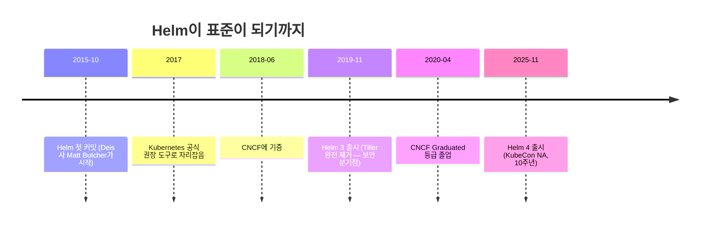
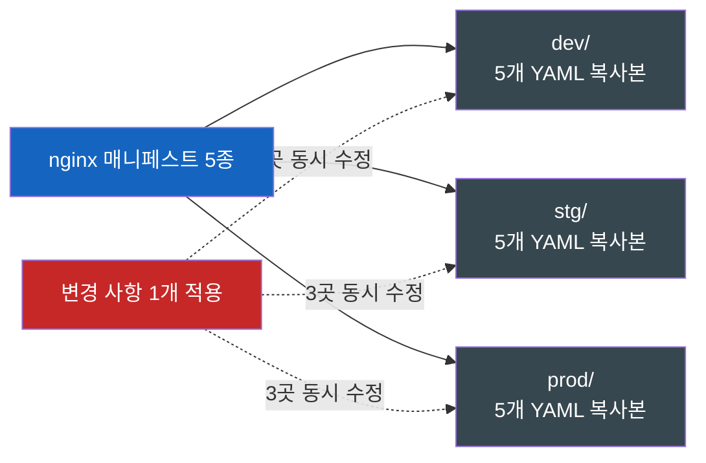
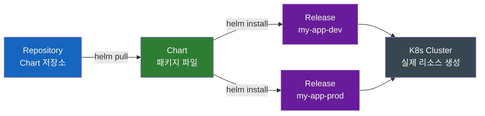
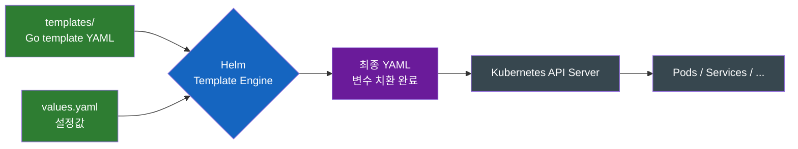
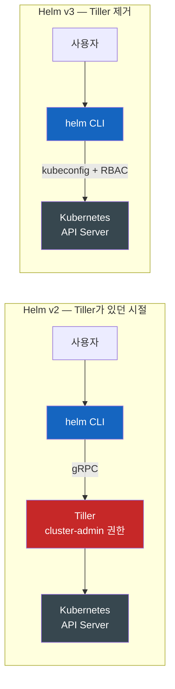

# Helm — 쿠버네티스의 패키지 매니저는 왜 필요한가

자바 개발자가 Ant XML 지옥에서 Maven으로 빠져나간 그 길을, 쿠버네티스 사용자들도 똑같이 걸어야 했다.

## 결론부터 말하면

**Helm은 쿠버네티스 위에 애플리케이션을 설치/업그레이드/롤백하는 패키지 매니저다.** YAML 파일을 환경별로 복붙하던 시절의 고통을 "Chart"라는 패키지 단위로 묶어서 해결했다. 자바 개발자에게 익숙한 비유로 옮기면, **Helm Chart는 Maven 아티팩트, `helm install`은 `apt-get install`** 에 가깝다 — 빌드가 아니라 배포 행위다. 2015년 첫 커밋, 2018년 CNCF에 기증되어 2020년 Graduated 등급으로 졸업했고, 2025년 11월 KubeCon NA Atlanta에서 6년 만의 메이저 업그레이드인 Helm 4가 발표되었다.



| 개념 | 한 줄 정의 | 자바/리눅스 비유 |
|------|-----------|------------------|
| **Chart** | 설치 가능한 K8s 애플리케이션 패키지 | Maven 아티팩트 (`.jar` + `pom.xml`) |
| **Release** | Chart를 클러스터에 설치한 인스턴스 | 실행 중인 프로세스 / 설치된 데비안 패키지 |
| **Repository** | Chart들이 모여 있는 원격 저장소 | Maven Central / APT 미러 |
| **Values** | Chart의 설정값 (`values.yaml`) | `application.yml`의 프로파일별 오버라이드 |

---

## 1. Helm이 없던 시절 — YAML 지옥의 풍경

### 1.1 nginx 하나 띄우는 데 쌓이는 YAML

쿠버네티스에 평범한 웹 서비스 하나를 올린다고 해보자. 무엇이 필요한가? 가장 단순한 형태로는 **Deployment 하나만으로도 nginx는 뜬다.** 클러스터 내부에서 임시로 접근만 한다면 그것으로 충분하다. 하지만 운영 환경에 올리는 순간 이야기가 달라진다. 외부 노출, 설정 주입, 도메인 라우팅, 권한 분리가 전부 별도 리소스로 쪼개져 있고, 하나씩 더해진다.

| 리소스 | 역할 | 필요 시점 |
|--------|------|-----------|
| **Deployment** | 컨테이너의 원하는 상태(replicas, 이미지 태그) 선언 | 필수 |
| **Service** | Pod에 안정적인 가상 IP/이름을 부여 | 다른 Pod에서 호출하려면 |
| **ConfigMap** | 환경변수, 설정 파일 주입 | 환경별 설정 분기가 생기면 |
| **Ingress** | 외부 도메인 → 클러스터 내부 라우팅 | 외부에서 HTTP로 접근하려면 |
| **ServiceAccount** | Pod가 K8s API를 호출할 때 사용할 ID | 기본 SA 권한이 부족하거나 분리하고 싶으면 |

각 리소스는 별도 YAML 파일로 작성된다. 운영형 웹 서비스 한 벌을 제대로 띄우려면 자연스럽게 매니페스트 4~5개가 묶여 다니게 된다는 뜻이다.

### 1.2 그리고 환경이 셋이 된다 — 복붙의 시작

문제는 여기서 시작된다. 같은 애플리케이션을 `dev`, `stg`, `prod` 세 환경에 배포한다고 해보자. 환경별로 다른 것은 **replicas 개수**, **이미지 태그**, **도메인**, **리소스 limit** 정도다. 나머지는 동일하다.

> "그럼 폴더 세 개 만들고 복붙하면 되지 않나?"

처음엔 다들 그렇게 한다. 그러다 변경 사항 하나를 적용하려면 세 폴더의 다섯 파일을 동시에 수정해야 한다는 사실을 깨닫는다. 한 곳을 빼먹으면 환경 간 drift가 발생한다. 운영하다 보면 dev에서는 되는데 prod에서만 안 되는 미스터리 버그가 등장하는데, 원인을 찾아보면 누군가 prod 매니페스트만 갱신을 깜빡한 것이다.



자연스럽게 "변수"가 그리워진다. 하지만 표준 YAML에는 변수 개념이 없다. 그래서 사람들은 `sed`로 치환하는 스크립트를 쓰거나, Python으로 템플릿을 굴리거나, Jenkinsfile에 환경별 분기를 박아 넣었다. 모두가 같은 문제를 각자의 방식으로 풀고 있었다.

### 1.3 자바 개발자라면 어디서 본 풍경이다

여기서 데자뷰가 발동한다. 2000년대 초 자바 빌드는 Ant XML이 지배했다. 모든 프로젝트가 자기만의 `build.xml`을 작성했고, 의존성은 `lib/` 폴더에 jar 파일을 직접 던져 넣었다. 누군가 라이브러리 버전을 올리면 모든 프로젝트의 lib 폴더를 일일이 갱신해야 했다.

이 카오스를 정리한 것이 Maven이었다. Maven은 **"관습(convention)"** 과 **"중앙 저장소"** 라는 두 가지를 들고 왔다. 디렉토리 구조와 라이프사이클을 표준화했고, `pom.xml`에 의존성만 적으면 Maven Central에서 자동으로 가져왔다.

| Ant 시대 (2000년대) | Maven 시대 (2004~) | kubectl 시대 | Helm 시대 |
|---------------------|---------------------|--------------|-----------|
| build.xml 각자 작성 | pom.xml 표준 | YAML 5종 복붙 | Chart 패키지 |
| lib/ 폴더에 jar 직접 | Maven Central 의존 | 환경별 매니페스트 폴더 | values.yaml로 분기 |
| 빌드 스크립트 = 명령형 | 선언적 의존성 | 선언적이긴 한데 단편적 | 패키지 단위 선언 |

Helm이 K8s에서 한 일은 본질적으로 같다. **사람들이 각자 sed/스크립트로 풀던 문제를 패키지 매니저라는 추상화로 통일했다.** 그래서 K8s 생태계의 거의 모든 오픈소스 — Prometheus, cert-manager, NGINX Ingress, Harbor 자체까지 — Helm Chart로 배포된다.

---

## 2. Helm의 3대 개념: Chart, Release, Repository

Helm을 이해하는 데 필요한 용어는 사실 세 개뿐이다.



### 2.1 Chart — 설치 가능한 단위

Chart는 K8s에 무언가를 설치하기 위한 **패키지 단위**다. 디렉토리 구조는 다음과 같다.

```
my-app/
├── Chart.yaml          # 패키지 메타 (이름, 버전, 의존성)
├── values.yaml         # 기본 설정값
├── templates/          # K8s 매니페스트 템플릿
│   ├── deployment.yaml
│   ├── service.yaml
│   └── ingress.yaml
└── charts/             # 의존하는 다른 Chart들 (sub-charts)
```

`Chart.yaml`은 Maven의 `pom.xml`과 정확히 같은 역할을 한다 — 패키지의 신원증명이다. `templates/` 아래의 파일들은 일반 YAML이 아니라 **Go template 문법**이 섞인 YAML이다. 자세한 문법은 3장에서 본다.

### 2.2 Release — Chart를 클러스터에 설치한 인스턴스

**Chart는 클래스, Release는 인스턴스**다. 같은 Chart로 여러 Release를 만들 수 있다.

```bash
helm install my-app-dev  ./my-app --namespace dev  --values dev-values.yaml
helm install my-app-prod ./my-app --namespace prod --values prod-values.yaml
```

두 명령은 같은 Chart를 두 번 설치한다. 같은 클러스터 안에 `my-app-dev`, `my-app-prod` 두 Release가 공존한다. Helm은 각 Release의 상태와 이력을 추적하기 때문에, "prod에 설치된 my-app은 현재 어떤 버전이지?" 같은 질문에 즉답할 수 있다.

> 다만 한 클러스터에서 Release를 동시에 띄우려면 **리소스 이름이 겹치지 않게** 해야 한다. 실무에서는 두 가지 전제 중 하나를 깔고 간다: (1) Chart의 템플릿이 리소스명에 `{{ .Release.Name }}` 접두사를 붙이도록 작성되어 있거나, (2) `--namespace dev`, `--namespace prod`처럼 namespace를 분리한다. Bitnami 같은 잘 만든 Chart는 (1)이 기본이라 같은 namespace에 여러 Release를 띄워도 충돌이 안 난다.

### 2.3 Repository — Chart들이 모여 있는 저장소

옛날에는 `helm/charts`라는 거대한 모노레포에 모든 공식 Chart가 모여 있었다(stable 저장소). 이 모델은 유지보수 부담이 폭증해 2020년 폐기되었고, 지금은 두 갈래로 흩어졌다.

| 형태 | 설명 | 예시 |
|------|------|------|
| **전통적 HTTP Repository** | `index.yaml` + tarball을 HTTP로 서빙 | Bitnami, ingress-nginx |
| **OCI Registry** | 컨테이너 이미지 레지스트리에 Chart도 저장 | Docker Hub, **Harbor**, GHCR |

OCI Registry 지원은 Helm 3.8(2022년)에 정식화되었고, 이게 핵심 트렌드다. **컨테이너 이미지와 Chart를 같은 레지스트리에서 관리**할 수 있게 된 것 — 다음 글에서 다룰 Harbor의 존재 의의가 여기서 더 커진다.

검색 허브로는 **Artifact Hub**(artifacthub.io)가 사실상 표준이다. Maven Central처럼 "여기 가면 다 있다"의 위치를 차지하고 있다.

---

## 3. 어떻게 동작하는가 — 템플릿 엔진과 4가지 명령

### 3.1 values.yaml + templates = 최종 YAML

Helm은 본질적으로 **클라이언트 사이드 템플릿 엔진**이다. `helm install`을 실행하는 순간 일어나는 일은 단순하다.



예시를 보자. `templates/deployment.yaml`은 다음처럼 생겼다.

```yaml
apiVersion: apps/v1
kind: Deployment
metadata:
  name: {{ .Release.Name }}-nginx
spec:
  replicas: {{ .Values.replicaCount }}
  template:
    spec:
      containers:
        - name: nginx
          image: "nginx:{{ .Values.image.tag }}"
          resources:
            limits:
              memory: {{ .Values.resources.memory | quote }}
```

`values.yaml`은 이렇게 생겼다.

```yaml
replicaCount: 3
image:
  tag: "1.27"
resources:
  memory: "256Mi"
```

`helm install my-app ./chart`를 실행하면 Helm은 두 파일을 합쳐 다음의 평범한 K8s 매니페스트를 만들어내고 API Server에 보낸다.

```yaml
apiVersion: apps/v1
kind: Deployment
metadata:
  name: my-app-nginx
spec:
  replicas: 3
  ...
```

핵심은 **치환은 클라이언트에서 끝난다**는 점이다. 클러스터에 들어가는 것은 평범한 YAML이다. Helm은 매번 새로 만든다 — 그래서 클러스터 입장에서는 Helm을 쓰든 안 쓰든 보이는 결과물은 동일하다.

### 3.2 핵심 명령어 4개로 라이프사이클이 끝난다

| 명령 | 하는 일 | `kubectl`로 흉내 낼 수 있나? |
|------|---------|-----------------------------|
| `helm install`   | Chart를 처음 설치, Release 생성 | `kubectl apply -f`로 비슷하게 |
| `helm upgrade`   | values를 바꿔서 Release 갱신 | 가능, 다만 변경분 추적 없음 |
| `helm rollback`  | 이전 Release 버전으로 즉시 복귀 (Release에 묶인 **모든 리소스를 한 번에**) | 부분적 — `kubectl rollout undo`는 **Deployment/StatefulSet/DaemonSet 같은 단일 워크로드 리소스 단위**만 가능, Service/ConfigMap/Secret까지 묶어서 되돌리지는 못함 |
| `helm uninstall` | Release가 만든 리소스 일괄 삭제 | `kubectl delete -f`로 일일이 |

`rollback`이 Helm의 **결정적 차별점**이다. Helm은 모든 Release의 히스토리를 클러스터에 Secret으로 저장한다(v3 기준). 그래서 `helm rollback my-app 3`이라고 치면 3번째 리비전 시점의 매니페스트로 클러스터 상태를 되돌릴 수 있다.

이게 왜 중요한가? 운영 중 배포 사고가 났다고 가정해보자. kubectl만 쓰는 팀은 **"어제 prod에 적용된 YAML이 정확히 무엇이었지?"** 를 Git 로그를 뒤지며 재구성해야 한다. Helm은 그 답을 클러스터 자체에 들고 있다.

---

## 4. Helm v2 → v3 — Tiller가 죽은 사건 (2019년)

Helm의 역사에서 가장 큰 사건은 2019년 11월의 v3 출시다. **Tiller라는 서버사이드 컴포넌트가 완전히 제거**되었기 때문이다.

### 4.1 Tiller가 뭐였나

Helm v2는 클라이언트-서버 구조였다. 사용자가 `helm install`을 치면 로컬 CLI(`helm`)가 클러스터 안에 떠 있는 Tiller에게 gRPC로 요청을 보내고, Tiller가 대신 Kubernetes API를 호출하는 식이었다.



설계 자체는 2016년 당시엔 합리적이었다. Kubernetes의 RBAC가 아직 미성숙했기 때문이다. Tiller가 Release 상태 저장, 권한 분리, 템플릿 렌더링을 모두 책임지는 단일 게이트웨이 역할을 했다.

### 4.2 왜 죽어야 했나 — 보안의 시한폭탄

문제는 운영하다 보니 Tiller가 **보안적 시한폭탄**이라는 점이 드러났다는 것이다.

- `helm init` 기본 설치는 **RBAC 규칙을 자동으로 걸어주지 않았다**. 결과적으로 환경에 따라 Tiller가 과도한 권한을 갖기 쉬웠고, 많은 튜토리얼이 편의상 `cluster-admin` 바인딩을 권장하면서 사실상의 관행이 되어버렸다. 즉 "기본값이 안전하지 않다"가 문제의 본질이었다.
- Tiller의 gRPC 포트는 인증이 약했다. 클러스터 내부에 어떤 식으로든 접근할 수 있으면 Tiller에 명령을 보낼 수 있었고, 그러면 사실상 클러스터 전체를 장악할 수 있었다.
- Kubernetes 자체의 RBAC가 1.6(2017년)에서 beta로 널리 쓰이기 시작했고 1.8에서 GA로 승격되면서, **"중간 게이트웨이로서의 Tiller"가 중복+위험** 으로 격하되었다. 클러스터의 권한 시스템을 또 다른 권한 시스템(Tiller)으로 우회하는 모양새였기 때문이다.

KubeCon NA 2019에서 메인테이너들이 "Tiller is dead"를 선언하자 청중이 박수쳤다는 일화가 있다 — 그만큼 많은 사람이 이 컴포넌트로 고생했다는 뜻이다.

### 4.3 v3가 가져온 모델

Helm v3는 Tiller를 들어내고 **클라이언트가 직접 kubeconfig + RBAC로 API Server와 통신**하는 모델로 바꿨다. Release 정보는 클러스터 안의 Secret(같은 namespace에 저장)에 적재된다. 그 외의 부수 변경도 컸다.

| 변화 | v2 | v3 |
|------|----|----|
| 서버 컴포넌트 | Tiller 필요 | **없음** |
| 권한 모델 | Tiller의 SA 권한 | 사용자의 kubeconfig RBAC |
| Release 저장 | Tiller의 ConfigMap | namespace 내 Secret |
| Chart.yaml | apiVersion v1 | **apiVersion v2** (의존성을 여기에 통합) |
| 명령어 | `helm install <chart>` (이름 자동) | `helm install <name> <chart>` (이름 명시) |

요약하면, **v3는 K8s의 진화를 따라잡으면서 본인의 보안 부채를 청산한 릴리스**다. v2에서 v3로 넘어가려면 `helm 2to3` 플러그인으로 마이그레이션을 한다.

---

## 5. Helm v4 — 2025년 11월의 변화

2025년 11월 12일, KubeCon NA Atlanta에서 **Helm 4**가 발표되었다. v3 이후 6년 만의 메이저 업데이트이자, 2015년 첫 커밋 이후 10주년을 맞은 시점이다.

핵심 변화는 세 가지로 정리할 수 있다.

| 영역 | v3 | v4 |
|------|----|----|
| **리소스 적용 방식** | 클라이언트 사이드 3-way merge | **Server-Side Apply (SSA) 기본 채택** |
| **공급망 보안** | 차트 서명 옵션 (Provenance) | 재현 가능 빌드 + 다이제스트 검증 강화 |
| **플러그인 시스템** | 셸 스크립트 기반의 단순한 구조 | 더 강력하고 휴대 가능한 새 플러그인 모델 |

특히 **Server-Side Apply 도입**이 의미 있다. v3까지는 Helm이 클라이언트에서 변경분을 계산해 보냈는데, 이때 누가 어떤 필드의 주인인지 모호한 경우가 있었다(`kubectl` 수동 변경분이나 HPA 같은 외부 컨트롤러의 갱신분이 Helm 업그레이드로 사라지는 식의 문제). SSA는 **API Server가 필드 소유권(managed fields)을 추적**하므로 이 충돌을 명확하게 해소한다. 모던 K8s 표준에 Helm이 정렬한 것이다.

단, **SSA 기본 적용은 새로 설치되는 Release에만 해당된다.** Helm 3에서 만들어둔 기존 Release를 Helm 4로 업그레이드하면 기본값은 여전히 client-side apply다 — 운영 중인 클러스터의 동작이 메이저 업그레이드만으로 바뀌면 곤란하므로 일부러 보수적으로 설계되었다. 기존 Release를 SSA로 옮기려면 `--server-side` 플래그를 명시해서 의도적으로 전환해야 한다.

공급망 보안 강화도 시대적 흐름이다. Log4Shell, SolarWinds 같은 사건 이후 "패키지의 무결성을 어떻게 보증할 것인가"가 큰 화두가 되었고, Helm 4의 차트 서명/검증 강화는 그 답이다. 컨테이너 이미지를 cosign으로 서명하는 것처럼, Chart도 신뢰 체인을 갖춰야 한다는 방향이다.

---

## 6. Helm의 한계와 Kustomize와의 선택 기준

Helm이 만병통치약은 아니다. 가장 자주 비판받는 지점은 **템플릿 지옥**이다.

```yaml
{{- if and .Values.ingress.enabled (not .Values.ingress.hosts) }}
  {{- range $key, $value := .Values.ingress.annotations }}
    {{ $key }}: {{ tpl $value $ | quote }}
  {{- end }}
{{- end }}
```

Go template은 강력하지만, if/range/with 같은 제어 구조가 YAML 들여쓰기와 섞이면 가독성이 급격히 떨어진다. 들여쓰기 한 칸 어긋나면 YAML 파싱이 깨지는데 디버깅은 매우 고통스럽다. 그래서 **Kustomize**라는 대안이 인기를 끌었다.

| 비교 항목 | Helm | Kustomize |
|----------|------|-----------|
| 접근법 | 템플릿에서 YAML 생성 | 베이스 YAML을 패치(overlay)로 변형 |
| 문법 | Go template 학습 필요 | 표준 YAML만 알면 됨 |
| 통합 | 별도 `helm` CLI | `kubectl apply -k`로 내장 |
| 릴리즈 이력 | 자동 추적, `rollback` 지원 | 없음 (Git 이력으로 대체) |
| 패키지 배포 | Chart로 외부 공유 용이 | 공유 어려움 (디렉토리 구조) |

2026년 현재 업계가 도달한 합의는 **둘을 같이 쓴다**는 쪽이다.

- **서드파티 제품 설치는 Helm**: cert-manager, Prometheus, Traefik, Harbor 자체. 벤더가 Chart로 패키징해서 배포하므로 그대로 받아 쓰면 된다. 버전과 URL만 GitOps 레포에 적어두면 재현 가능한 인프라가 된다.
- **사내 애플리케이션은 Kustomize**: 환경별로 자주 바뀌고, 내부 팀이 직접 다루므로 평이한 YAML이 유지보수에 유리하다. 템플릿 추상화를 깔 만큼 복잡하지 않은 경우가 많다.

ArgoCD나 Flux 같은 GitOps 도구는 두 방식을 모두 네이티브로 다룬다. "Helm 차트로 설치한 리소스를 Kustomize로 패치"하는 하이브리드도 흔한 패턴이 되었다 — Helm의 **Post-Rendering** 기능을 쓰면 서드파티 Chart의 원본을 포크하지 않고도 렌더링 결과 위에 Kustomize 오버레이를 얹을 수 있다.

> ⚠️ **GitOps와 Helm의 미묘한 결합 주의점**: ArgoCD나 Flux 환경에서 Helm을 쓸 때는 **상태 관리 주체가 누구인지** 명확히 해야 한다. ArgoCD는 기본적으로 내부에서 `helm template`만 호출해서 매니페스트를 렌더링한 뒤 자체 동기화 엔진으로 클러스터에 적용한다 — 이 경우 `helm list`로 Release가 보이지 않고, 운영자가 콘솔에서 `helm rollback`을 쳐도 ArgoCD가 "Out of Sync"로 감지해 Git 상태로 즉시 덮어쓴다. **GitOps 환경에서는 롤백을 `git revert`로 한다**가 정석이며, Helm의 Release 이력은 부차적인 도구로 격하된다는 점을 알아두는 것이 좋다.

---

## 7. 정리

쿠버네티스의 YAML은 강력하지만 단편적이다. 환경이 늘어나고 서비스가 늘어나면 그 단편성이 곱셈으로 폭증해 운영 부담이 된다. **Helm은 그 폭증을 "Chart"라는 패키지 단위로 다시 묶어내는 도구**다 — 자바 세계에서 Maven이 했던 일과 본질적으로 같다.

| 자리 | 도구 |
|------|------|
| **빌드 산출물 패키저** | Maven, npm, Cargo |
| **OS 패키지 매니저** | apt, yum, brew |
| **컨테이너 패키저** | Docker (`Dockerfile` + 이미지) |
| **K8s 애플리케이션 패키저** | **Helm** |

다음 글에서는 그 패키지(컨테이너 이미지와 Helm Chart)를 **어디에 저장하고 어떻게 신뢰할 것인가** 에 대한 답인 **Harbor**를 다룬다. Helm 4가 차트 서명을 강조하는 시대, Harbor 같은 보안 강화 레지스트리의 존재 의미가 한층 커졌다는 점을 같이 살펴볼 것이다.

---

## 출처

- [Helm 공식 문서](https://helm.sh/docs/) — 공식 레퍼런스
- [Helm Architecture (helm.sh/docs/topics/architecture)](https://helm.sh/docs/topics/architecture/) — 아키텍처 설명
- [Migrating Helm v2 to v3 (helm.sh)](https://helm.sh/docs/v3/topics/v2_v3_migration/) — v2→v3 마이그레이션 공식 가이드
- [CNCF — Helm Project Page](https://www.cncf.io/projects/helm/) — CNCF Graduated 상태, 프로젝트 메타정보
- [CNCF Announcement — Helm Marks 10 Years With Release of Version 4 (2025-11-12)](https://www.cncf.io/announcements/2025/11/12/helm-marks-10-years-with-release-of-version-4/) — Helm 4 공식 발표
- [InfoQ — Helm Improves Kubernetes Package Management with Biggest Release in 6 Years](https://www.infoq.com/news/2025/11/helm-4/) — Helm 4 변경 사항 상세
- [TechTarget — Kubernetes Helm Tiller is dead, and IT pros rejoice](https://www.techtarget.com/searchitoperations/news/252474360/Kubernetes-Helm-Tiller-is-dead-and-IT-pros-rejoice) — Tiller 제거 배경
- [sanj.dev — Kustomize vs Helm in 2026](https://sanj.dev/post/kustomize-vs-helm-2026) — 최신 비교 분석
- [IBM Think — Kustomize vs. Helm: What's the Difference?](https://www.ibm.com/think/insights/kustomize-vs-helm) — 선택 기준 정리
